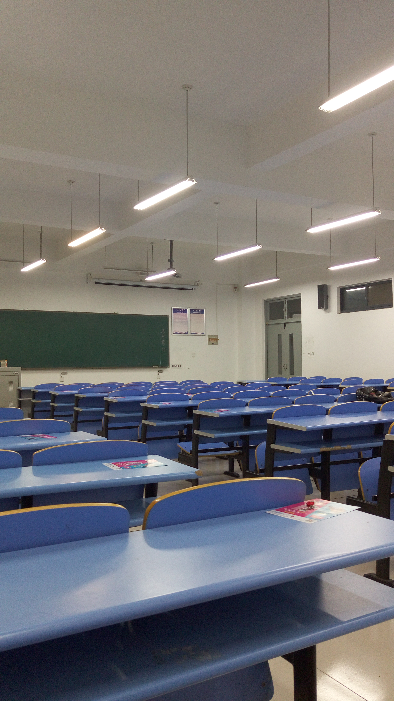
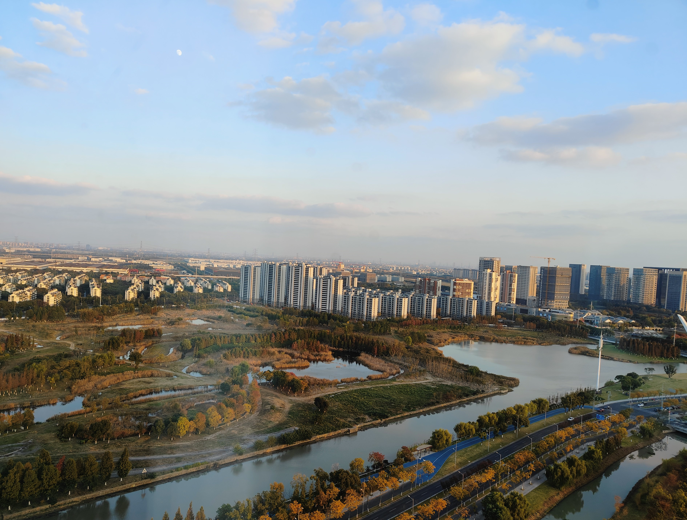

<!DOCTYPE html>
<html lang="zh-CN">

<head>
    <meta charset="UTF-8">
    <meta name="viewport" content="width=device-width, initial-scale=1.0" href="https://gitee.com/tongchaowei/front-native-page-template/tree/main/image-display/template-01">
    <title>图片展示页面</title>
    
</head>

<body>
    <!-- 图片展示页面 -->
    

        <!-- 图片展示页面中的标题 -->
        

            <!-- 标题 -->
            <h1>C和S的那些事儿</h1>
            <!-- 副标题 -->
            
故事要从大学说起~

        

        <!-- 图片展示项容器 -->
        

            <!-- 图片展示项 -->
            

                <!-- 内容容器 -->
                

                    <!-- 内容 -->
                    

                        <!-- 图片 -->
                        

                            
                        

                        <!-- 图片标题 -->
                        <h2 class="title">相识篇</h2>
                        <!-- 图片描述 -->
                        

                            早到的C选择坐在后排，迟到的S只好坐在后排。认真听课的S好奇专心玩手机的C在看什么小说，《明朝那些事儿》。C和S的那些事儿由此开始~
                        

                    

                

                <!-- 时间 -->
                

                    
2014-xx-xx

                

            

            

                <!-- 内容容器 -->
                

                    <!-- 内容 -->
                    

                        <!-- 图片 -->
                        

                            
                        

                        <!-- 图片标题 -->
                        <h2 class="title">补习篇</h2>
                        <!-- 图片描述 -->
                        

                            金工实习C和S分到一组，时逢C将补考理论力学，求学霸S带其自习。C想得最多的不是补考，而是怎样才能让S理解，挂科只是不爱力学。为什么校园总会有这样的故事~
                        

                    

                

                <!-- 时间 -->
                

                    
2014-冬

                

            

            

                <!-- 内容容器 -->
                

                    <!-- 内容 -->
                    

                        <!-- 图片 -->
                        

                            
                        

                        <!-- 图片标题 -->
                        <h2 class="title">牵手篇</h2>
                        <!-- 图片描述 -->
                        

                            晚自习后，散步在校园，S终究没有招架住C在多个这样场景下的“软磨硬泡”。C问S为什么是在这一天，S说因为那天是我生日，即使未来有一天不在一起了，也要记得。感谢老铁，可以少记一个纪念日~
                        

                    

                

                <!-- 时间 -->
                

                    
2015-04-10

                

            

            

                <!-- 内容容器 -->
                

                    <!-- 内容 -->
                    

                        <!-- 图片 -->
                        

                            
                        

                        <!-- 图片标题 -->
                        <h2 class="title">校园篇</h2>
                        <!-- 图片描述 -->
                        

                            这是一段“可无必有”的回忆。可无，吃喝玩乐，嬉笑吵闹，无非是每对情侣都会经历的故事；必有，台风天一起去海边，没赶上回家的火车，建模比赛熬过的夜...这些是只属于C和S的故事，独一无二~
                        

                    

                

                <!-- 时间 -->
                

                    
2015-04~2017-07

                

            

            

                <!-- 内容容器 -->
                

                    <!-- 内容 -->
                    

                        <!-- 图片 -->
                        

                            
                        

                        <!-- 图片标题 -->
                        <h2 class="title">毕业篇</h2>
                        <!-- 图片描述 -->
                        

                            毕业即分手，校园总会有这样的故事。可惜，C和S苟住了，以至于现在还偶尔彼此“表达失望”，当时毕业怎么就~好吧，并非如此。毕业当天，带着行李，C和S过家门而不入，到从没来过的南方，边找工作边旅游。起初C在昆山找到了工作，S回了老家。有的故事，到这里也许就结束了，但C和S还没有——S也来到了昆山工作。2018年S去了上海，C还在昆山。2020年底终于买了房子，为更高的收入还房贷，C也将工作换到了上海~
                        

                    

                

                <!-- 时间 -->
                

                    
2017-07

                

            

            

                <!-- 内容容器 -->
                

                    <!-- 内容 -->
                    

                        <!-- 图片 -->
                        

                            
                        

                        <!-- 图片标题 -->
                        <h2 class="title">打工篇</h2>
                        <!-- 图片描述 -->
                        

                            起初C在昆山找到了工作，S回了老家。有的故事，到这里也许就结束了，但C和S还没有——S也来到了昆山工作。2018年S去了上海，C还在昆山。2020年底终于买了房子，为更高的收入还房贷，C也将工作换到了上海~
                        

                    

                

                <!-- 时间 -->
                

                    
2017-07~

                

            

            

                <!-- 内容容器 -->
                

                    <!-- 内容 -->
                    

                        <!-- 图片 -->
                        

                            
                        

                        <!-- 图片标题 -->
                        <h2 class="title">结婚篇</h2>
                        <!-- 图片描述 -->
                        

                            2023.9.28，C和S领证了。一起吃喝玩乐，有过嬉笑，有过吵闹，旅游、看演唱会，经历了种种欢笑和争吵。2023.10.1，我们结婚了~
                        

                    

                

                <!-- 时间 -->
                

                    
2023-10-01

                

            

        

        <!-- 图片加载中 -->
        

            
图片加载中...

        

        <!-- 没有更多了 -->
        

            
未完待续...

        

    

    <!-- 脚本 -->
    <!-- 随机生成图片展示项 -->
    <!---->
    <!-- 控制当前展示图片项 -->
    
</body>

</html>