---
hide:
  - toc
---

# Page title
...

## Driver directory structure

The Driver SDK directory structure is as follows:

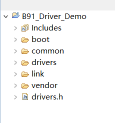

### boot

Under this folder are the boot files.

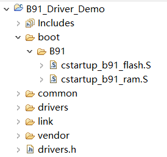

### common

Under this folder are some common files that are not related to the driver. Two of the folders are described in particular:

bt_debug: is the interface function for Bluetooth related modules to set debug GPIO.

compatibility_pack: is to be compatible with the previous driver interface of each SDK, the relevant files added will not be used in the driver.

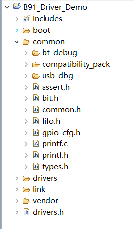

### drivers

This folder is for the driver of relevant module.

### link

This folder is used to store link files and is selected according to different usage needs.

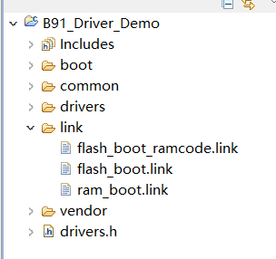

### vendor

This folder is for the demo of all modules.

\newpage
## Boot mechanism

### Telink platform SoC

a) Chip power on or wake up from deep mode: it will move a program from flash to RAM first, and then boot from RAM.

b) It boots directly from RAM after retention.

As you can see, the boot location here is the same, both are RAM.

### Risc-V platform SoC

a) Chip power on or wake up from deep mode: Instead of moving the code from flash to RAM, it jumps to the start address of flash (0x20000000) and starts execution. (The reason why it can be handled in this way is that the chips of this series support taking commands directly from flash for execution.)

b) It will boot from IRAM after wake up from retention.

**Note:**

>- There are two RAMs, one is IRAM and the other is DRAM, IRAM stores programs and data, DRAM can only store data.

As you can see, the boot location here is different. Two segments are in the link and S files, vectors and retention_reset segment, where the vector segment is at the flash start address and the retention segment is at the start of IRAM, which are both the boot code section. The code section will be handled differently, which will be explained in detail later.

\newpage
## S and link files

### Use of combinations

According to different usage scenarios, we can choose the corresponding combination.

----------------------------------------------------------------------------------------------------------------------------------------
Usage scenario                                                          S file                         link file
----------------------------------------------------------------------- ------------------------------ ---------------------------------
Common boot from flash                                                  cstartup_b91_flash.S           flash_boot.link

Used when testing performance (coremark and                             cstartup_b91_flash.S           flash_boot_ramcode.link
dhrystone)

Used to load to ram to start the program, cannot                        cstartup_b91_ram.S             ram_boot.link  
be loadedto the flash for execution

----------------------------------------------------------------------------------------------------------------------------------------

The differences in the S files therein are as follows:

------------------------------------------------------------------------------------
S file                   Description
------------------------ -----------------------------------------------------------
cstartup_b91_flash.S     It is the S file required to start the program from flash.

cstartup_b91_ram.S       It is the S file required to start the program  from ram.

------------------------------------------------------------------------------------

The differences in link files are as follows:

-------------------------------------------------------------------------------------------------------------------------
link file                        Description
-------------------------------- ----------------------------------------------------------------------------------------
flash_boot.link                  Used in normal usage scenarios.

flash_boot_ramcode.link          The only difference with the flash_boot.link file is that it puts all the segments except the vector segment needed for booting into the ramcode segment, and all the programs run in ram, which makes the execution time fast.

ram_boot.link                    This file is used to load to ram to start the program, cannot be loaded to flash for execution. This link file works with cstartup_b91_ram.S file.

-------------------------------------------------------------------------------------------------------------------------

### Configuration method

#### Link

You can select the link file to be used by the following configuration.

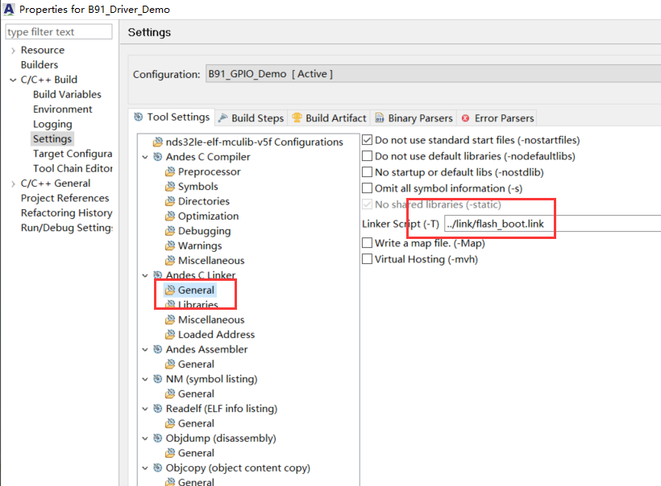

#### S file

S files are selected differently by the following macro definitions.

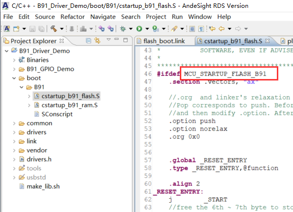

Macros can be defined in the following way to decide which S file to choose to use.

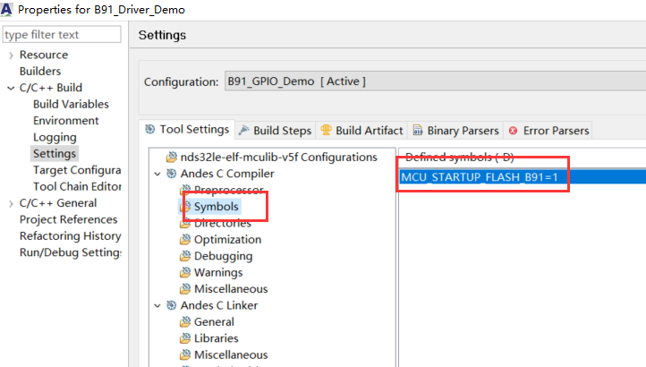

#### objdump.txt

The relevant distributions of VMA and LMA can be seen in the generated objdump.txt file.

The following figure shows an objdump.txt file generated by compiling with cstartup_b91_flash.S and flash_boot.link file.

In this file, the VMA and LMA addresses of vectors and text are the same, and these two segments are taken from the flash for execution.

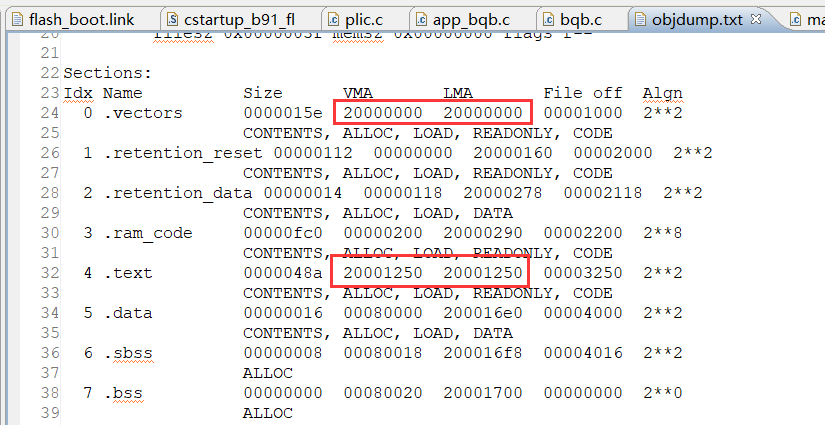

The VMA and LMA addresses of retention_reset, retention_data, and ram_code are different. The LMA address is the flash address, and the VMA address is the IRAM address. In the S file, it will move these three segments from the flash to the IRAM correspondingly.

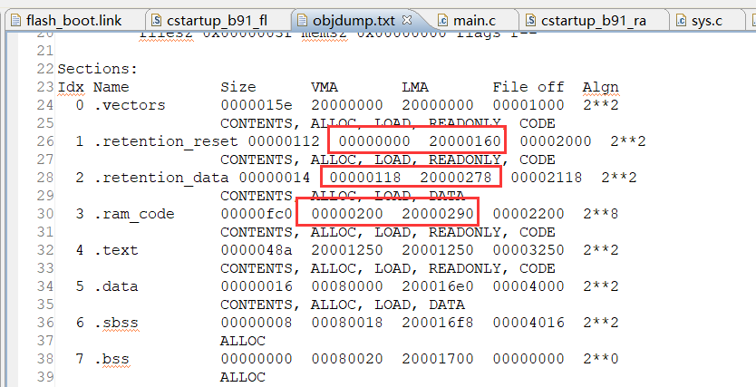

The addresses of VMA and LMA of data segment are different, the address of LMA is in flash and the address of VMA is in DRAM.

In the S file, the data segment will be moved from flash to DRAM correspondingly.

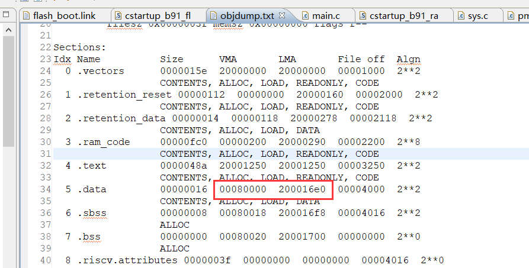

### Link file details

#### Code detail

Take the flash_boot.link file as an example:

```C
// Set the code entry to _RESET_ENTRY
ENTRY(_RESET_ENTRY)
SECTIONS
{
// Define the variable NDS_SAG_LMA_FLASH = 0x20000000
    NDS_SAG_LMA_FLASH = 0x20000000 ;
//specify the current address is 0x20000000 (without AT addresses involved are VMA), the point is to represent the current address
//VMA(Virtual Memory Address): is the address where the program is running.
//LMA(Load Memory Address): The load address, here can be simply understood as the address in flash.
    . = 0x20000000;	
// Define the variable BIN_BEGIN equal to the current address
    PROVIDE (BIN_BEGIN = .) .
// Define vectors segment, VMA address and LMA address are 0x2000000, so no AT commands are added here.
// that is, the vectors segment is loaded and run at 0x20000000 (here 0x20000000 is the base address of the flash, that is, vectors segment is stored in the flash 0x20000000, and also from this address to take the commands to run)
//keep is equivalent to telling the compiler that this section should not be garbage collected. The garbage collection is to remove unused sections and not output to the output file, set with the --gc-sections option. But you can use KEEP to keep it. For example, the following vectors section is required to be kept.
    .vectors      : { KEEP(*(.vectors )) }
//Specify the current location as 0x0 (which is the starting address of IRAM)
    . = 0x00000000;
//Define the retention_reset segment with VMA address 0x0
//LMA address= ALIGN(LOADADADDR (.vectors) + SIZEOF (.vectors),8)
//LOADADDR (section): Get the address of the LMA of the section.
//SIZEOF (section): Get the size of the section
//AT (addr): Define the address of the LMA of this segment.
// When VMA and LMA do not match, you need to set LMA with AT commands
    .retention_reset  : AT( ALIGN(LOADADDR (.vectors) + SIZEOF (.vectors),8))
     { KEEP(*(.retention_reset )) }
// some addresses of retention_reset segment of VMA, LMA need to be saved to the variable, S file will be used.
    PROVIDE (_RETENTION_RESET_VMA_START = ADDR(.retention_reset));
    PROVIDE (_RETENTION_RESET_LMA_START = LOADADADDR(.retention_reset));
    PROVIDE (_RETENTION_RESET_VMA_END = .) .
//The aes_data segment can be only in the first 64K addresses of the IRAM, so please do not modify its location if you are not sure of the usage.
// Set current address = . Address aligned by 8
// If no value (point) is assigned to the current address, the addresses of all segments will be listed in order.
    . = ALIGN(8);
    PROVIDE (_AES_VMA_START = .) .
    .aes_data   (NOLOAD)  : { KEEP(*(.aes_data )) }
    PROVIDE (_AES_VMA_END = .) .
    . = ALIGN(8);
    .retention_data : AT( ALIGN(LOADADDR (.retention_reset) + SIZEOF (.retention_reset),8))
      { KEEP(*(.retention_data )) }
    PROVIDE (_RETENTION_DATA_VMA_START = ADDR(.retention_data));
    PROVIDE (_RETENTION_DATA_LMA_START = LOADADADDR(.retention_data));
    PROVIDE (_RETENTION_DATA_VMA_END = .) .

    . = ALIGN(8);
    .ram_code : AT( ALIGN(LOADADDR (.retention_data) + SIZEOF (.retention_data),8))
      { KEEP(*(.ram_code )) }
    PROVIDE (_RAMCODE_VMA_END = .) .
    PROVIDE (_RAMCODE_VMA_START = ADDR(.ram_code));
    PROVIDE (_RAMCODE_LMA_START = LOADADADDR(.ram_code));
    PROVIDE (_RAMCODE_SIZE = SIZEOF (.ram_code));
    . = ALIGN(LOADADADDR (.ram_code) + SIZEOF (.ram_code), 8);
    .text   : AT(ALIGN(LOADADADDR (.ram_code) + SIZEOF (.ram_code), 8))
       { *(.text .stub .text.* .gnu.linkonce.t.* ) KEEP(*(.text.*personality* )) *(.gnu.warning ) }
    . rodata   : AT(ALIGN(LOADADADDR (.text) + SIZEOF (.text), ALIGNOF(. rodata)))
       { *(. rodata . rodata.* .gnu.linkonce.r.* )}
//Added allocation of segments of eh_frame/eh_frame_hdr, compile error will occur if there is no allocation when using puts function
    .eh_frame_hdr 	: AT(ALIGN(LOADADADDR (. rodata) + SIZEOF (. rodata), ALIGNOF(.eh_frame_hdr)))
        { *(.eh_frame_hdr ) }
    . = ALIGN(0x20);
    .eh_frame : AT(ALIGN(LOADADDR (.eh_frame_hdr) + SIZEOF (.eh_frame_hdr), 32))
        { KEEP(*(.eh_frame )) }
//allocate memory space for the command compression table.exec.itable
    .exec.itable : AT(ALIGN(LOADADDR (.eh_frame) + SIZEOF (.eh_frame), ALIGNOF(.exec.itable)))
        { KEEP(*(.exec.itable)) }

    . = 0x00080000;
    PROVIDE( __global_pointer$ = . + (4K / 2) );
// ALIGNOF(.data): return the alignment requirement of the VMA of data.
// If the section has been allocated, it will return the aligned byte named “section”. The linker will report an error if the section has not been allocated yet.
    .data : AT(ALIGN(LOADADADDR (.exec.itable) + SIZEOF (.exec.itable), ALIGNOF(.data)))
        { *(.data .data.* .gnu.linkonce.d.* ) KEEP(*(.gnu.linkonce.d.*personality* )) SORT(CONSTRUCTORS)
            \*(.srodata.cst16 ) \*(.srodata.cst8 ) \*(.srodata.cst4 ) \*(.srodata.cst2 ) \*(. srodata . srodata.\* ) \*(. sdata . sdata.\* .gnu.linkonce.s.\* ) \*(.sdata2 .sdata2.\* .gnu.linkonce.s.\* )
        }
    PROVIDE (_DATA_VMA_END = .) .
    PROVIDE (_DATA_VMA_START = ADDR(.data));
    PROVIDE (_DATA_LMA_START = LOADADDR(.data));
//BIN_SIZE = LMA address of data segment + size of data segment - BIN_BEGIN.
//The bin file is actually the LMA of all the segments stitched together and generally arranged in order (the values in the AT commands are set according to this rule)
    PROVIDE (BIN_SIZE = LOADADDR(.data) + SIZEOF(.data) - BIN_BEGIN);
//Each output section can have a type, and the type is a keyword enclosed in parentheses.
// NOLOAD, section is marked as a non-loadable type and will not be loaded into memory when the program runs.
//The bss segment does not need to be loaded, the S file will zero out the VMA address space of the bss segment.
    . = ALIGN(8);
    PROVIDE (_BSS_VMA_START = .) .
    . sbss (NOLOAD) : { \*(. dynsbss ) \*(. sbss . sbss.\* .gnu.linkonce.sb.* ) \*(. scommon . scommon.\* ) }
    . bss  (NOLOAD) : { \*(. dynbss ) \*(. bss . bss.\* .gnu.linkonce.b.\* ) \*(COMMON ) . = ALIGN(8); }
    PROVIDE (_BSS_VMA_END = .) .

    . = ALIGN(8);
//_end is the starting address of the heap, the heap is growing upwards, and generally we set it in the space not used after bss
// functions like sprintf/malloc/free are called, these functions will call the _sbrk function to allocate heap memory, and _sbrk will determine where to start allocating heap space via the _end symbol (usually the end of the .bss segment), otherwise a link error will occur.
    _end = .
    PROVIDE (end = .) .
//Define the start address of the stack, here the end location of DRAM is defined.
    PROVIDE (_STACK_TOP = 0x00a0000);
    PROVIDE (FLASH_SIZE = 0x0100000);
}

ASSERT((BIN_SIZE)<= FLASH_SIZE, "BIN FILE OVERFLOW");
```

#### Alignment

The link file involves some alignment rules. If it involves multiple segments moved together, you need to pay attention to the alignment of these segments. When the starting address of LMA and VMA are not consistent, multiple segments moving together is likely to encounter move error.

The following is an example of an error:

The code in the S file is trying to move the sdata and data segments from the LMA to the VMA. The starting address of the VMA is 0x00080000 and the starting address of the LMA is related to the previous code and is aligned according to the alignment rules of the VMA for sdata.

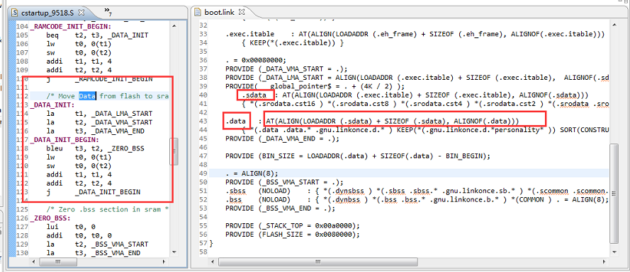

The following figure shows an error-prone lst file compiled with the above link file.

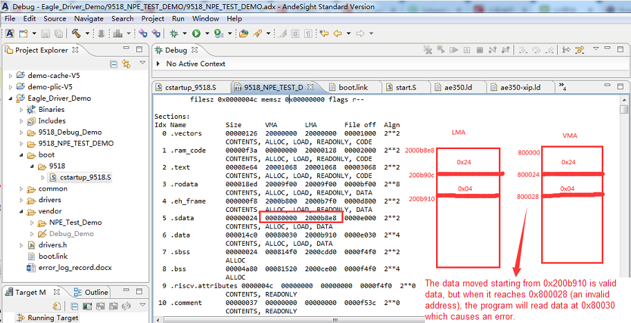

There are several methods of modification:

(1) Move one segment at a time so that you don't have the problems above.

(2) Merge sdata, data segments.

### S file details

Take the cstartup_b91_flash.S file as an example.

#### Code detail

```C
// Define the vector segment, the code starting after this sentence belongs to the vectors segment, until the next segment name encountered, or the end of the file
// where "ax" means the section is assignable and executable
//`a' section is allocable `x' section is executable
.section .vectors, "ax" 
.option push        //push saves the current .option configuration
.option norelax    //set to norelax
.org 0x0          //The pseudo command .org is telling the compiler the offset address of the next command. Set the offset address to 0.
//The .global pseudo-command is used to define a global symbol that allows the linker to recognize it globally, that is a symbol defined in a program file can be visible to all other program files.
.global _RESET_ENTRY 
// The .type pseudo-command is used to define the type of the symbol. The following is the definition of _RESET_ENTRY as a function
.type _RESET_ENTRY,@function
// The .align pseudo-command is used to push the current PC address to a location aligned to "the integer power of 2 bytes". The following is to push the current PC address to 4 bytes aligned.
.align 2
//The label _RESET_ENTRY is the entry address of the program.
_RESET_ENTRY:
//The entry address of the program must be an executable command, here is a jump command to the label _START
    j     _START
// Set the offset address to 0x18 to store BIN_SIZE (4 bytes), BIN_SIZE is defined in the link file.
    .org 0x18
    .word (BIN_SIZE)
// Set the offset address to 0x20 to store the keyword, this location must be this value, otherwise the program will not run.
    .org 0x20
    .word ('T'<<24 | 'L'<<16 | 'N'<<8 | 'K')
// Set the offset address to 0x26 to store the flash configuration, later the flash fetching command will decide which protocol to go according to this configuration.
//The following 6 are supported and can be selected according to flash model.
     .org 0x26
     //.short (0x0003) //READ: cmd:1x, addr:1x, data:1x, dummy:0
    //.short (0x070B) //FREAD: cmd:1x, addr:1x, data:1x, dummy:8
    .short (0x173B) //DREAD: cmd:1x, addr:1x, data:2x, dummy:8
    //.short (0x53BB) //X2READ: cmd:1x, addr:2x, data:2x, dummy:4
    //.short (0x276B) //QREAD: cmd:1x, addr:1x, data:4x, dummy:8
    //.short (0x65EB) //X4READ: cmd:1x, addr:4x, data:4x, dummy:6
// Use pop to restore .option configuration
.option pop 
//4 byte alignment
    .align 2

_START:
//This is for debug use, it will output PB4 high. It is generally used to check the status, the default is off.
#if 0
    lui   t0,0x80140        //0x8014030a
    li    t1, 0xef
    li    t2, 0x10
    sb    t1 , 0x30a(t0)   //0x8014030a PB oen = 0xef
    sb    t2 , 0x30b(t0)   //0x8014030b PB output = 0x10
#endif
    //initialize the global pointer gp register, __global_pointer$ is defined in the link file.
    .option push
    .option norelax
    la gp, __global_pointer$
    .option pop
//initialize stack pointer sp register, _STACK_TOP is defined in the link file.
     la t0, _STACK_TOP
    mv sp, t0

#ifdef __nds_execit
// Set the command compression table and address
    la t0, _ITB_BASE_
    csrw uitb , t0
#endif
// Set FS to 0b11, clear fscsr (is the processing that needs to be done before floating point operations)
#ifdef __riscv_flen
    /* Enable FPU */
    li t0, 0x00006000
    csrrs t0, mstatus , t0
    /* Initialize FCSR */
    fscsr zero
#endif
// Set the interrupt entry base address
    la t0, __vectors
    csrw mtvec, t0
// enable interrupt vector mode (need to enable two places, no modification here)
    /* Enable vectored external plic interrupt */
    csrsi mmisc_ctl, 2

    /*vector mode enable bit (VECTORED) of the Feature Enable Register */
    lui    t0, 0xe4000
    li     t1, 0x02
    sw     t1, 0x0(t0)   //(*(volatile unsigned long*)(0xe4000000))= 0x02
// Enable I/D-Cache
    csrr t0, mcache_ctl
    ori t0, t0, 1 #/I-Cache
    ori t0, t0, 2 #/D-Cache
    csrw mcache_ctl, t0
    fence.i
//Move the retention_reset segment from flash to ram

_RETENTION_RESET_INIT:
    la t1, _RETENTION_RESET_LMA_START
    la t2, _RETENTION_RESET_VMA_START
    la t3, _RETENTION_RESET_VMA_END
_RETENTION_RESET_BEGIN:
    bleu t3, t2, _RETENTION_DATA_INIT
    lw t0, 0(t1)
    sw t0, 0(t2)
    addi t1, t1, 4
    addi t2, t2, 4
    j _RETENTION_RESET_BEGIN
//Move the retention_data segment from flash to ram
_RETENTION_DATA_INIT:
    la t1, _RETENTION_DATA_LMA_START
    la t2, _RETENTION_DATA_VMA_START
    la t3, _RETENTION_DATA_VMA_END
_RETENTION_DATA_INIT_BEGIN:
    bleu t3, t2, _RAMCODE_INIT
    lw t0, 0(t1)
    sw t0, 0(t2)
    addi t1, t1, 4
    addi t2, t2, 4
    j _RETENTION_DATA_INIT_BEGIN
//Move ram_code segment from flash to ram
_RAMCODE_INIT:
    la t1, _RAMCODE_LMA_START
    la t2, _RAMCODE_VMA_START
    la t3, _RAMCODE_VMA_END
_RAMCODE_INIT_BEGIN:
    bleu t3, t2, _DATA_INIT
    lw t0, 0(t1)
    sw t0, 0(t2)
    addi t1, t1, 4
    addi t2, t2, 4
    j _RAMCODE_INIT_BEGIN
//Move data segments from flash to ram
_DATA_INIT:
    la t1, _DATA_LMA_START
    la t2, _DATA_VMA_START
    la t3, _DATA_VMA_END
_DATA_INIT_BEGIN:
    bleu t3, t2, _ZERO_BSS
    lw t0, 0(t1)
    sw t0, 0(t2)
    addi t1, t1, 4
    addi t2, t2, 4
    j _DATA_INIT_BEGIN
//clear the bss segment to zero
_ZERO_BSS:
    lui t0, 0
    la t2, _BSS_VMA_START
    la t3, _BSS_VMA_END
_ZERO_BSS_BEGIN:
    bleu t3, t2, _ZERO_AES
    sw t0, 0(t2)
    addi t2, t2, 4
    j _ZERO_BSS_BEGIN
// Clear the AES segment to zero
_ZERO_AES:
    lui t0, 0
    la t2, _AES_VMA_START
    la t3, _AES_VMA_END
_ZERO_AES_BEGIN:
    bleu t3, t2, _FILL_STK
    sw t0, 0(t2)
    addi t2, t2, 4
    j _ZERO_AES_BEGIN
//The stack area are initialized to 0x55, the default code is not open, because the ram is relatively large and will be more time-consuming. If the debug needs, it can be opened to use.
_FILL_STK:
#if 0
    lui t0, 0x55555
    addi t0, t0, 0x555
    la t2, _BSS_VMA_END
    la t3, _STACK_TOP
_FILL_STK_BEGIN:
    bleu t3, t2, _MAIN_FUNC
    sw t0, 0(t2)
    addi t2, t2, 4
    j _FILL_STK_BEGIN
#endif
//jump to the main function
_MAIN_FUNC:
    nop
//Use j or jal can only jump to [-524288,524287], beyond this range we can only use jalr to achieve, in order to avoid such problems, we uniformly use jalr to jump.
    la t0, main
    jalr t0

    nop
    nop
    nop
    nop
    nop
_END:
j _END 

//Define a macro with the name INTERRUPT, the parameter is num, and the macro ends at .endm
.macro INTERRUPT num
//Weak definition
.weak entry_irq\num
.set entry_irq\num, default_irq_entry
.long entry_irq\num
.endm
//There are a total of 64 interrupt sources
#define VECTOR_NUMINTRS 63
.section .ram_code, "ax"
//Define ram_code segment, all interrupt entry address should be in ram_code, so as to enter interrupt quickly.
.global __vectors
// There are 64 interrupt sources, and the formula for the alignment that needs to be set here is: 2ceiling(log2(N))+2, and N is 64, so the it should be set to 256 alignment here.
.balign 256

__vectors:
    .long trap_entry
//Actually here is a for loop that defines the 63 interrupt entry addresses in addition to the trap interrupt.
//after expansion is:
//.weak entry_irq1
//.set entry_irq1, default_irq_entry
//.long entry_irq1
//.........
//.weak entry_irq63
//.set entry_irq63, default_irq_entry
//.long entry_irq63
//We use vector mode, after an interrupt occurs, the pc will point to address __vectors +4*interrupt ID, if the interrupt ID is 2, it will jump to entry_irq2
.altmacro
.set irqno, 1
.rept VECTOR_NUMINTRS/* .rept .endr */
INTERRUPT %irqno
.set irqno, irqno+1
.endr
```

#### Differences between vectors and retention_reset segments

The retention_reset is the startup code that will run when comes back from retention.

The current retention_reset processing is not to move these segments (retention_reset, retention_data, ram_code) from flash to ram, because these segments are retained during the retention phase and will not be lost. The condition for this processing is that the size of the retention ram is larger than these segments, and if there is more than that, then the move action needs to be done.

The retention_reset boot part requires more processing than the vectors, include: flash wake-up, multi-address register recovery. which is a must-do processing coming from the retention.

#### Others

##### Notes on the use of .org

In the current compilation environment, .org and Link Time Optimization (-flto) in the optimization option cannot be used at the same time. However, (-flto) is definitely selected in order to compile a small bin file, so if you want to use .org in the S file, you need to use it as follows:

 in optimization options")

```C
.option push       //push saves the current .option configuration
.option norelax   // set to norelax
.org 0x0         //set .org
.........
.option pop     // Use pop to restore the .option configuration
```

The description of .option is as follows:

The .option pseudo-command is used to set certain architecture-specific options that enable the assembler to recognize the option and act according to the definition of the option.

The push, pop are used to temporarily save or restore the options specified by the .option pseudo-command:

The ".option push" pseudo-command temporarily saves the current option settings, allowing new options to be specified later using the .option pseudo-command, while the ".option pop" pseudo-command restores the most recently saved option settings to take effect again.

The combination of ".option push" and ".option pop" makes it possible to set different options specifically for a section of code embedded in an assembly program without affecting the global option settings.

##### Compression command

The RISC-V's C Extension, which refers to replacing 32bit commands with 16bit commands, and Andes' CoDense (Code Dense) technology puts 32bit commands inside the command table and replaces them with 16 EXEC.IT 0xxxxx where the original 32bit commands appear.

The macro \__nds_execit is set to be on by compiler default, while \_ITB_BASE_ will be set to the first address of .exec.itable.

Set _ITB_BASE_ to register uitb in the S file as the base address of the command table. The compression instructions are put into the .exec.itable segment.

#### FPU enable

The macro \__riscv_flen is set to be on by compiler default.

Before executing a floating-point command, the mstatus<14:13> FS segment needs to be changed to a non-zero value, otherwise a command exception will occur. So the S file sets FS to 0b11 and initializes the floating-point control status register FCSR to 0.

\newpage
## Debug Demo

The driver does not redefine the printf interface, it directly uses the printf interface that comes with toolchain. However, we redirect it, the driver implements two kinds of redirection, one is to redirect the data to GPIO (through GPIO to simulate serial timing), the other one is to redirect to USB. You can choose either one for debug info output.

You can choose whether to use GPIO or USB printing in printf.h.

```C
#define DEBUG_IO         0
#define DEBUG_USB        1
#define DEBUG_BUS        DEBUG_IO
```

### Simulate serial output via GPIO port

GPIO port related configuration is configured in printf.h, including baud rate, and others (only RX and GND need to be connected). The hardware connections are as follows:

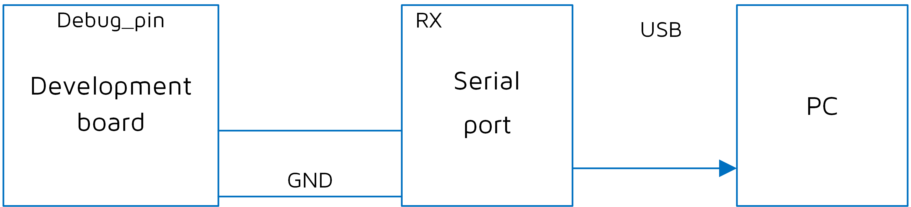

The following figure shows the printout received by the serial assistant tool:

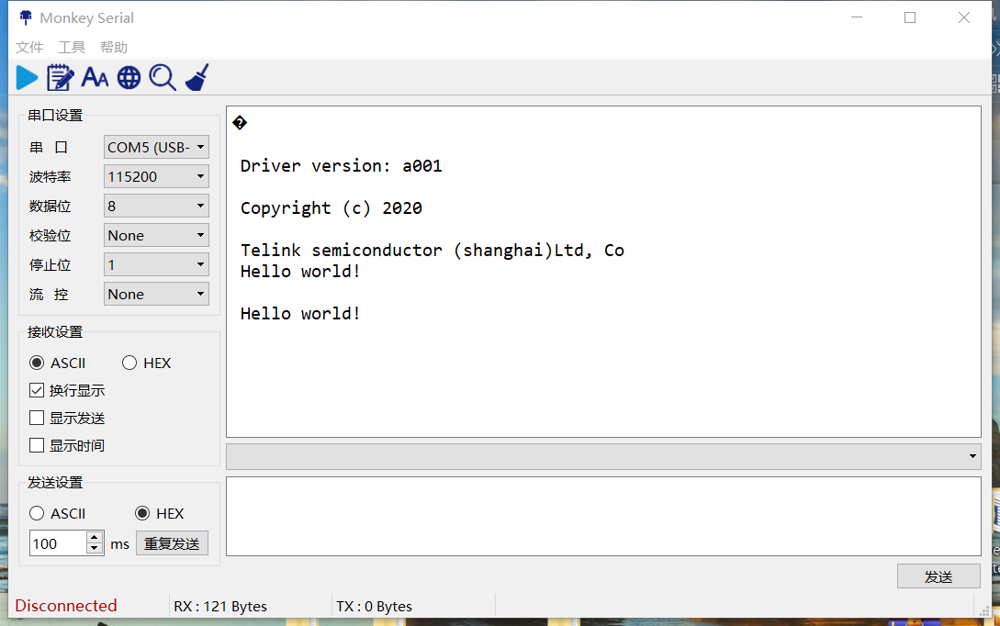

### USB printout

Configuring USB printf, you need to use the BDT tool to view the output information. The point to note when using USB printf is that the USB uses a fixed 48M clock, in the clock initialization it is configured by default. However, if the PLL clock used cannot be divided to get 48M, then the USB may not work properly.

When using USB printf, you can configure blocking and non-blocking modes, which can be selected through the relevant macro definitions in printf. The default is non-blocking as follows:

```C
#define BLOCK_MODE         0
```

The following is the BDT configuring usb_log method and experimental phenomena:

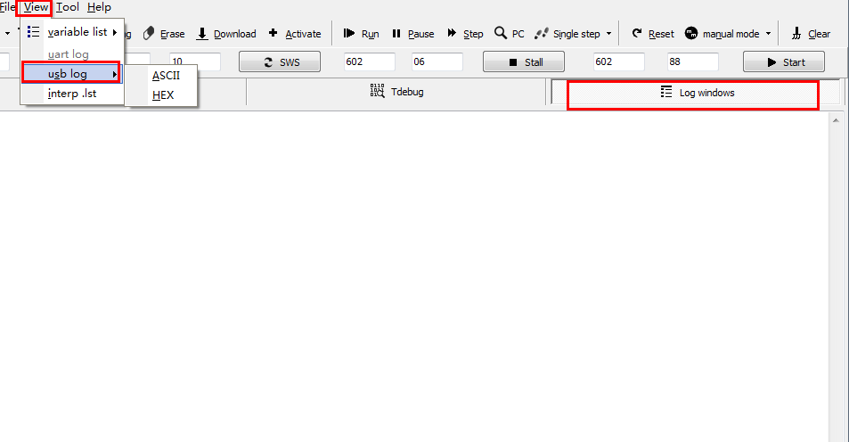

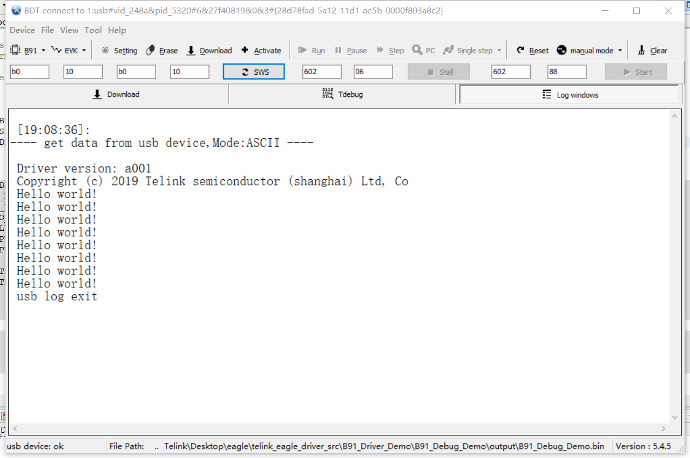

\newpage
## Interrupt

The PLIC (Platform-Level Interrupt Controller) is compatible with RISC-V PLIC and has two major functions: interrupt vector and interrupt priority.

### Interrupt overview

In the interrupt mechanism, the processor is suddenly interrupted by another request during the sequential execution of the program command stream and aborts the execution of the current program to deal with something else. After it has finished processing something else, it then reverts to the point where the program was interrupted to continue executing the previous program command stream. The "other request" is called an interrupt request, and the other "request source" is called the interrupt source, which usually comes from a peripheral device. The processor turns to perform "something else", which is called an interrupt processing program.

### Interrupt type

The RISV-V architecture has three modes of operation: Machine Mode, User Mode and Supervisor Mode. We are using Machine Mode, and there are three types of interrupts in Machine Mode: Software Interrupt, Timer Interrupt, and External Interrupt. The external interrupt refers to CPU external interrupts, such as from UART, GPIO, and so on; the timer interrupt refers to interrupts from timers; the software interrupt is an interrupt triggered by the software itself.

**Note:**

>- There are two modes of interrupt, vector and regular mode, and the driver defaults to vector mode.

### External interrupt

### Interrupt enable

For the use of the driver interrupt interface, if you want to open the interrupt, it has the following three levels:

**The first layer**

```C
core_enable_interrupt()
```

It enables the corresponding BIT in the CSR register of the RISC-V core, which is the general interrupt switch.

**Second layer**

```C
plic_interrupt_enable()
```

It enables the BIT of the corresponding module in the plic module, which is the module interrupt control switch.

**Third layer**

```C
rf_set_irq_mask(FLD_ZB_RX_IRQ)
```

It enables the mask of the corresponding module, take the rf module as an example, set which one you need to use.

### External interrupt handler function in vector mode

The corresponding interrupt handler functions have been defined in the plic driver and correspond to the following:

---------------------------------------------------------------------
Interrup vectors           Interrupt handler functions
-------------------------- ------------------------------------------
IRQ0_EXCEPTION             except_handler

IRQ1_SYSTIMER              stimer_irq_handler

IRQ2_ALG                   analog_irq_handler

IRQ3_TIMER1                timer1_irq_handler

IRQ4_TIMER0                timer0_irq_handler

IRQ5_DMA                   dma_irq_handler

IRQ6_BMC                   bmc_irq_handler

IRQ7_USB_CTRL_EP_SETUP     usb_ctrl_ep_setup_irq_handler

IRQ8_USB_CTRL_EP_DATA      usb_ctrl_ep_data_irq_handler

IRQ9_USB_CTRL_EP_STATUS    usb_ctrl_ep_status_irq_handler

IRQ10_USB_CTRL_EP_SETINF   usb_ctrl_ep_setinf_irq_handler

IRQ11_USB_ENDPOINT         usb_endpoint_irq_handler

IRQ12_ZB_DM                rf_dm_irq_handler

IRQ13_ZB_BLE               rf_ble_irq_handler

IRQ14_ZB_BT                rf_bt_irq_handler

IRQ15_ZB_RT                rf_irq_handler

IRQ16_PWM                  pwm_irq_handler

IRQ17_PKE                  pke_irq_handler

IRQ18_UART1                uart1_irq_handler

IRQ19_UART0                uart0_irq_handler

IRQ20_DFIFO                audio_irq_handler

IRQ21_I2C                  i2c_irq_handler

IRQ22_SPI_AHB              hspi_irq_handler

IRQ23_SPI_APB              pspi_irq_handler

IRQ24_USB_PWDN             usb_pwdn_irq_handler

IRQ25_GPIO                 gpio_irq_handler

IRQ26_GPIO2RISC0           gpio_risc0_irq_handler

IRQ27_GPIO2RISC1           gpio_risc1_irq_handler

IRQ28_SOFT                 soft_irq_handler

IRQ29_NPE_BUS0             npe_bus0_irq_handler

IRQ30_NPE_BUS1             npe_bus1_irq_handler

IRQ31_NPE_BUS2             npe_bus2_irq_handler

IRQ32_NPE_BUS3             npe_bus3_irq_handler

IRQ33_NPE_BUS4             npe_bus4_irq_handler

IRQ35_USB_RESET            usb_reset_irq_handler

IRQ36_NPE_BUS7             npe_bus7_irq_handler

IRQ37_NPE_BUS8             npe_bus8_irq_handler

IRQ42_NPE_BUS13            npe_bus13_irq_handler

IRQ43_NPE_BUS14            npe_bus14_irq_handler

IRQ44_NPE_BUS15            npe_bus15_irq_handler

IRQ46_NPE_BUS17            npe_bus17_irq_handler

IRQ50_NPE_BUS21            npe_bus21_irq_handler

IRQ51_NPE_BUS22            npe_bus22_irq_handler

IRQ52_NPE_BUS23            npe_bus23_irq_handler

IRQ53_NPE_BUS24            npe_bus24_irq_handler

IRQ54_NPE_BUS25            npe_bus25_irq_handler

IRQ55_NPE_BUS26            npe_bus26_irq_handler

IRQ56_NPE_BUS27            npe_bus27_irq_handler

IRQ57_NPE_BUS28            npe_bus28_irq_handler

IRQ58_NPE_BUS29            npe_bus29_irq_handler

IRQ59_NPE_BUS30            npe_bus30_irq_handler

IRQ60_NPE_BUS31            npe_bus31_irq_handler

IRQ61_NPE_COMB             npe_comb_irq_handler

IRQ62_PM_TM                pm_irq_handler

IRQ63_EOC                  eoc_irq_handler

---------------------------------------------------------------------

```C
__attribute__((section(".ram_code"))) void default_irq_handler(void)
{

}
void stimer_irq_handler(void) __attribute__((weak, alias("default_irq_handler")));
```

By default, all interrupt handler functions are weakly defined as default_irq_handler, an empty function.

**Weak function**

In theory, a project is not allowed to have two functions with the same name. Here it is OK to use _weak to specify that one of them is a weak function.

When the program is compiled, if two functions with the same name are found and one of them is a weak function, the weak function will be ignored and the normal function will be used for compilation; if only one weak function is found, then the weak function will still be used to participate in the compilation.

When the upper layer uses it, just define another function which is the same, without specifying the weak function, and then add some user code to the function.

**Interrupt site save and resume**

No interrupt save and resume are found in the interrupt processing, but the function is normal for the following reasons:

\_attribute\_ ((interrupt ("machine"), aligned(4)));

There are interrupt declarations in attribute, and the compiler sees that it will insert code that modifies the protection registers.

### Priority in external interrupt

When multiple interrupt sources initiate requests to the processor at the same time, the concept of interrupt priority exists when these interrupt sources need to be arbitrated and which interrupt sources are prioritized. When interrupt priority is not enabled, a new interrupt will not interrupt the interrupt being processed and will wait until the interrupt service function is completed before a new interrupt request can be responded accordingly. The default interrupt preemption function is not turned on, and if you need to use the interrupt preemption function, you need the following three steps:

a) Set plic_set_threshold(). Only interrupts with priority> threshold can be generated, threshold defaults to 0 and priority defaults to 1.

b) plic_preempt_feature_en();   //enable interrupt preemption function

c) plic_set_priority();  //set the interrupt priority

**Note:**

>- The SoC has 4 interrupt priority 0-3. The interrupt source with no setting of interrupt priority, the default priority is 1, the larger the number the higher the priority. Setting to 0 priority will not generate interrupts (threshold default 0, do not meet the condition: priority> threshold). The high priority interrupt source can interrupt the interrupt source with lower priority, can not interrupt the interrupt with the same level priority.

There are 3 interrupts configured in the demo, stimer interrupt, timer0 interrupt and rf_tx interrupt.

a) Enable interrupt

```C
core_interrupt_enable();
```

b) Enable interrupt preemption, set priority, default threshold is 0

```C
plic_preempt_feature_en();  //enable interrupt preemption
plic_set_priority(IRQ1_SYSTIMER,IRQ_PRI_LEV3);  //set the stimer priority
plic_set_priority(IRQ4_TIMER0, IRQ_PRI_LEV2);   //set timer0 priority
plic_set_priority(IRQ15_ZB_RT, IRQ_PRI_LEV1);  //set rf priority
```

Before and after the delay of the interrupt handler function, the observation IO is set to pull up before the delay and pull down after the delay. In the demo, the stimer is delayed for 250us, the timer0 is delayed for 600us, and the rf_tx is delayed for 800us.

```C
_attribute_ram_code_sec_noinline_ void irq_handler(void)
{ ...
    gpio_set_high_level(LED3);
    delay_us();
    gpio_set_low_level(LED3);
}
```

### Results observation

In the following figure, the interrupt nesting is enabled, rf_tx is interrupted by the high priority timer0, and so forth, Time0 interrupt handler function is interrupted by the higher priority stimer.

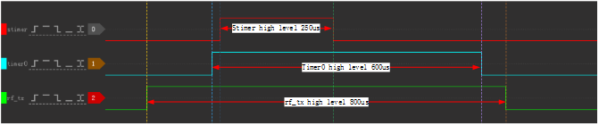

In the figure below, the interrupt nesting is not enabled, and the default priority of all three interrupt sources is 1. After the previous interrupt handler function is executed, the next interrupt handler function is processed without interrupts.

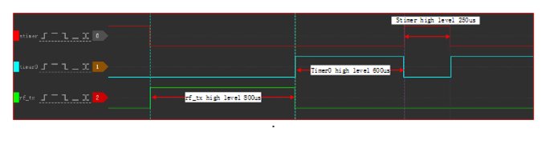

\newpage
# GPIO

The SoC's GPIO driver implements the configuration of GPIO inputs and outputs, pull-ups and pull-downs, interrupts, and other functions.

## Interrupt

GPIO can be configured to generate interrupts. The interrupt hardware structure is shown in the figure below. Each GPIO can be configured to generate three types of interrupts, GPIO_IRQ, GPIO2RISC0_IRQ, and GPIO2RISC1_IRQ. GPIO_IRQ is the most basic GPIO interrupt, GPIO2RISC0_IRQ and GPIO2RISC1_IRQ can generate count or control signals in Timer (timer peripheral) applications, in addition to the GPIO_IRQ functions.

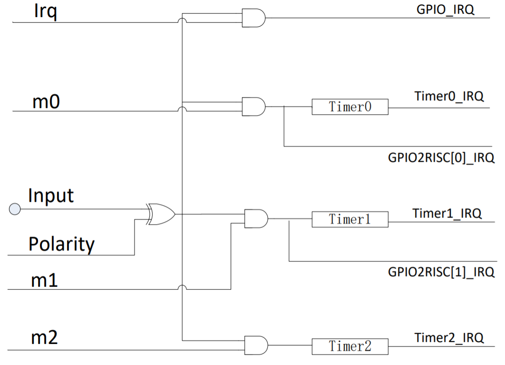

### Mechanism description

As shown in the figure below, the GPIO is set to trigger at rising edge. The mechanism of MCU is that the level signal of GPIO is used as the signal to generate interrupt and trigger the interrupt at rising edge.

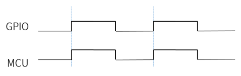

As shown in the figure below, the GPIO is set to trigger at falling edge. The mechanism of MCU is to invert the level signal of GPIO and then use the inverted signal as the signal for interrupt generation, and trigger the interrupt at rising edge.

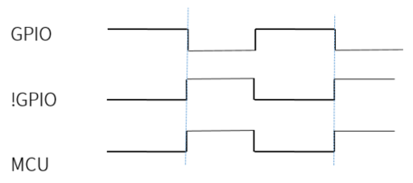

As shown in the figure below, if two GPIOs are set as one kind of interrupt, trigger at rising edge, the mechanism of MCU is that the level signal of two GPIOs will be or operation, and then use the obtained signal as the condition to generate interrupt, trigger the interrupt at rising edge. In this figure, only GPIO0 triggers the interrupt.

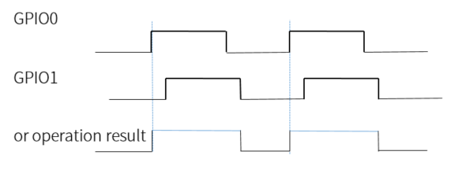

As shown in the figure below, if two GPIOs are set as one kind of interrupt, trigger at falling edge, the mechanism of MCU is to invert the level signals of two GPIOs respectively, and then make or operation for the inverted signal, and use the obtained signal as the condition to generate interrupt, which also triggers interrupt at rising edge. That is, finally MCU uses the final signal to trigger the interrupt at rising edge. In the figure, only GPIO0 triggers the interrupt.

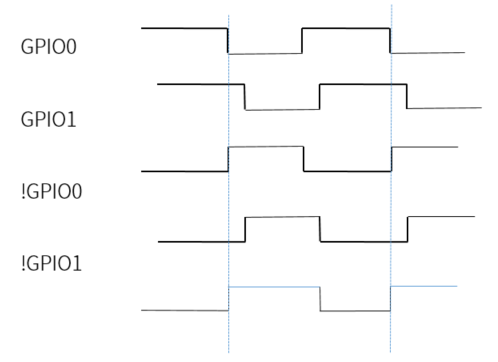

As shown in the figure below, if GPIO0 is set to trigger at rising edge and GPIO1 is set to trigger at falling edge, the mechanism of MCU is to invert the level signal of GPIO1, then make or operation for GPIO0 and (!GPIO1), and use the obtained signal as the condition to generate interrupt, which also trigger interrupt at rising edge. That is, finally MCU is using the final signal to trigger the interrupt at rising edge. In the figure, only GPIO1 triggers the interrupt.

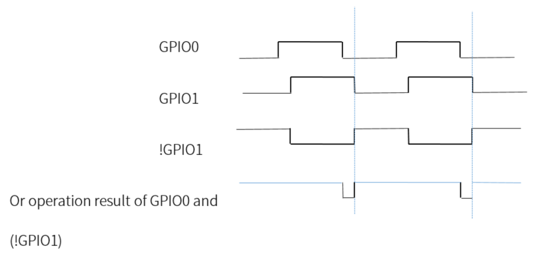

### Conclusion

Two or more GPIOs set as one kind of interrupt, depending on the timing of input GPIO, triggering interrupts is uncertain and not recommended. However, the mechanisms of different GPIO interrupts are independent of each other. If one GPIO is set to one kind of interrupt, the interrupts of both GPIOs can be triggered.

For example, GPIO0 is set to GPIO_IRQ interrupt and GPIO1 is set to GPIO_IRQ_RSIC0 interrupt, both configured to be triggered at rising edge. In the figure below, signals 0 and 1 are the input timing of GPIO0 and the toggle signal set within the interrupt handler function to observe the GPIO0 interrupt, and signals 2 and 3 are the input timing of GPIO1 and the toggle signal set within the interrupt handler function to observe the GPIO1 interrupt, respectively. In this figure, both GPIO1 and GPIO2 trigger the interrupt.

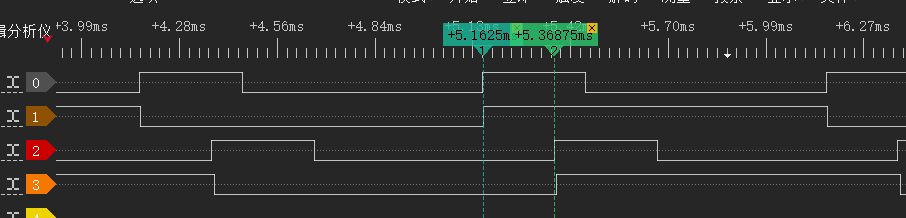

**Note:**

>- Since there are only three GPIO interrupts, GPIO_IRQ, GPIO_IRQ_RSIC0, and GPIO_IRQ_RSIC1, up to three GPIO interrupts can be set at the same time.

## Attentions

If setting the trigger type as high or trigger at rising edge, pull-down resistor should be set; if setting the trigger type as low or trigger at falling edge, pull-up resistor should be set.

Two other issues that do not require concern to the application layer are also briefly explained here (they are addressed in the driver interface).

When setting trigger at falling edge, you need to clear the interrupt bit after setting the polarity of GPIO, and then enable mask. (Otherwise, when setting GPIO to trigger at falling edge, a non-falling edge caused interrupt trigger is generated at the moment of enabling GPIO interrupt.) This part has been handled in the corresponding interrupt enable function of GPIO, and does not require the application layer to care.

GPIO multiplexing function switching notes:

(1) It starts with GPIO function, so you need to configure the required function MUX first, and then disable the GPIO function at the end.

(2) It starts with IO function, and needs to change to GPIO output. First set the corresponding IO output value and OEN set correctly, and enable GPIO function at the end.

(3) It starts with IO function, and needs to be changed to GPIO input.

Need pull up this IO:

Case 1 (digital pull-up): set output to 1 and OEN to 1;

Case 2 (analog pull-up): set pullup to 1.

No need to pull up:

Case 1 (digital pull-up): set output to 0 and OEN to 1;

Case 2 (analog pull-up): set pullup to 0.

Finally enable the GPIO function.

\newpage
# Clock

## Brief description

The clock of Risc-V Platform SoC is relatively complex, the following figure shows the clock tree for some of the clocks (the complete clock tree structure is in the datasheet). Here are a few of some important clocks, pll_clk/cclk/hclk/pclk/mspi_clk.

pll_clk: it is PLL in the figure, which is the source of many module clock sources, many clocks including sys_clk generally use frequency divided from PLL.

cclk: it is CPU clk, the speed of the program running is determined by this clock, and it is also the only clock source of hclk and pclk.

hclk: hclk is used by all modules hooked to the AHB bus.

pclk: pclk is used by all modules hooked to the APB bus.

mspi_clk: mspi connects to flash and performs flash-related operations, including fetching commands, reading and writing flash, and so on, all of which are controlled by this clock.

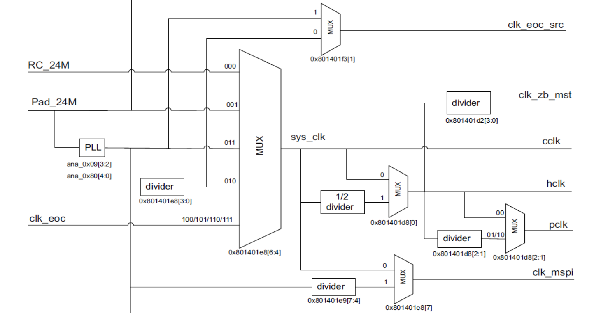

## clock_init

The Driver provides the clock_init interface to configure the 5 clocks above.

**Note:**

>- This function sets several clocks in addition to the parameters, and will also set the USB clock. The USB clock is using fixed 48M clock.

The maximum clocks currently supported are shown in the following table:

-----------------------------------------------------------------------
clk      cclk  hclk  pclk  mspi
-------- ----- ----- ----- --------------------------------------------
fre_max  96M   48M   24M   External flash: 48M; internal flash: 64M

-----------------------------------------------------------------------

### PLL_CLK

Many clocks can be used, but if there is no special demand, 192M needs to be used uniformly.

**Note:**

>- USB uses a fixed 48M clock, when configuring PLL_CLK, you need to pay attention to the fact that if the clock cannot be divided to get 48M, it may cause the USB not to work normally.
>- In addition, some frequencies in the Audio driver are set in accordance with192M, modifying the PLL_CLOCK will lead to Audio errors.

### CCLK

There are four optional clock sources for cclk, namely RC_24M, PAD_24M, PAD_PLL, and PAD_PLL_DIV, where PAD_PLL_DIV has an optional dividing frequency ratio of 2-15.

### HCLK

The hclk is frequency divided from cclk, and can be 1 and 2 frequency division.

### PCLK

The pclk is frequency divided from the hclk and can be 1, 2, or 4 frequency division.

**Note:**

>- When hclk = 1/2 cclk, pclk can not be set to 4 frequency divisions, this is related to the hardware, which is processed in the interface. If set so, the program will stop and will not be executed for the next.
>- In addition: in the case of using REBOOT or PM, if hclk selects 2 frequency divisions, there is a probability of causing a crash.

### MSPI_CLK

The mspi clock has two optional clock sources, one is equal to cclk and the other is obtained by frequency devision from the PLL_clock.

\newpage
# AES

It supports hardware AES128 encryption, all buffer data used in the interface are using the small endian mode.

**Note:**

>- This is because there is a restriction on the address where the data used in AES calculations can be stored: it must be in the address space of base_address+64K.
>- It is currently handled in the driver as follows: Define the base_address as 0xc0000000 (that is the starting address of IRAM) in the first 64K of the IRAM range aes_data segment (which can be seen in the link file), and the data that needs to be processed during AES calculation are put into the aes_data segment for processing.
>- If you do not change the location of the aes_data segment in the link file, you can use it directly without concerning the above process.
>- If it does not meet the demand, you can also adjust it by yourself according to the demand. The driver provides aes_set_em_base_addr interface to modify the base_address.
>- In addition, this address is shared with BT, and modifying it also requires ensuring that the data used by BT is also in this address space.

\newpage
# EMI

EMI samples are used with "EMI_Tool" and "Non_Signaling_Test_Tool" tools. This document mainly introduces related functions and considerations in the EMI test samples.

## Protocol

Please refer to the _Telink SoC EMI Test User Guide_ for the communication protocol.

## Program description

EMI testing in Eagle supports carrieronly mode, continue mode, burst mode, and packet-receiving mode.

The supported wireless communication methods include Ble1M, Ble2M, Ble125K, Ble500K, and Zigbee250K.

### CarrierOnly mode

Function: The CarrierOnly mode is used to generate a single-pass signal. In this mode, you can set the channel, power value and the communication mode (rf mode) for the single-pass signal.

**Example:**

Test tool: select EMI_Tool

Wireless communication mode setting: Ble1M/Ble2M/Ble125K/Ble500K/Zigbee250K

Power setting: XXdB

Channel setting: 2402~2480MHz

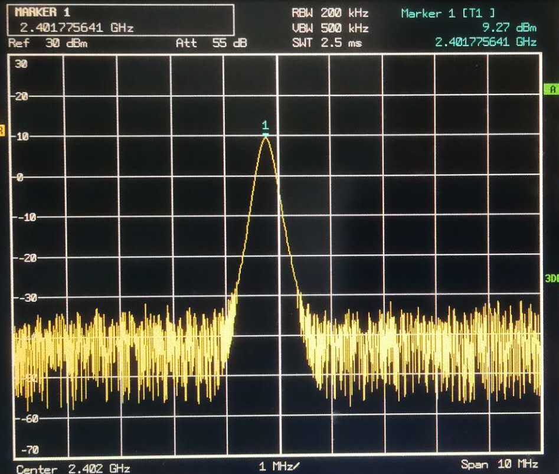

### Continue mode

Function: The continue mode is used to generate a continuous signal, in which the channel, power value as well as the communication mode (rf mode) can be set.

The continue mode sending packet (Payload) data includes Prbs9, 0x0f, and 0x55, and can set frequency hop.

**Example:**

Test tool: select EMI_Tool

Wireless communication mode setting: Ble1M/Ble2M/Ble125K/Ble500K/Zigbee250K

Power setting: XXdB

Channel setting: 2402~2480MHz

**Note:**

>- Currently EMI_Tool only supports sending prbs9 packets in continue mode.

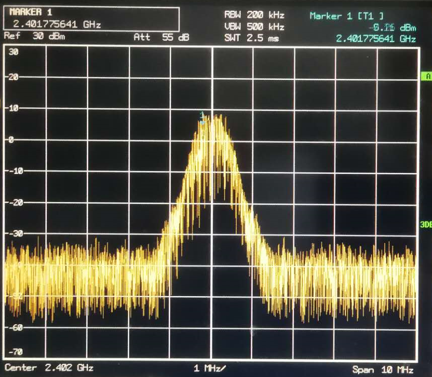

### Burst mode

Function: The burst mode allows you to set the channel, power value and the communication mode (rf mode) for the Burst signal.

The burst mode sending packet (Payload) data includes Prbs9, 0x0f, and 0x55.

**Example:**

Test tool: select Non_Signaling_Test_Tool

Wireless communication mode setting: Ble1M/Ble2M/Ble125K/Ble500K/Zigbee250K

Power setting: XXdB

Channel setting: 2402~2480MHz

**Note:**

>- Due to the discontinuous signal in Burst mode, the Single Sweep and MaxHold settings of the spectrum analyzer can be used to capture the signal.

The first three pictures below are the results of the Single Sweep setting, and the fourth picture is the result of the MaxHold setting.

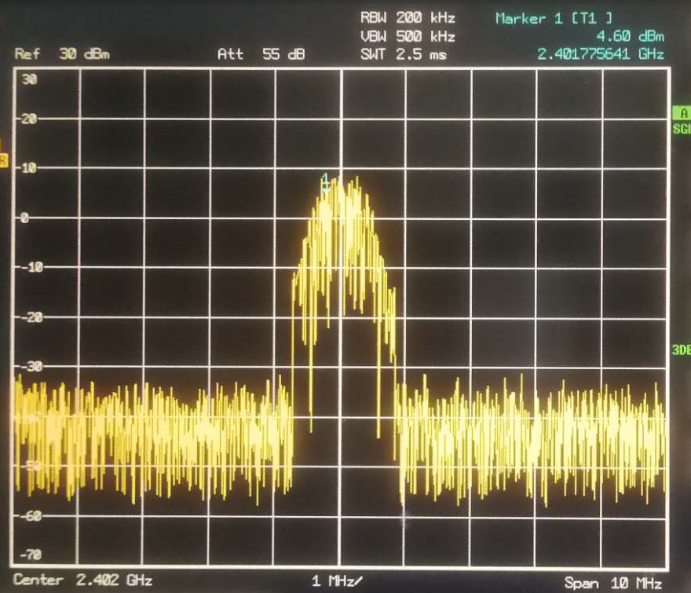

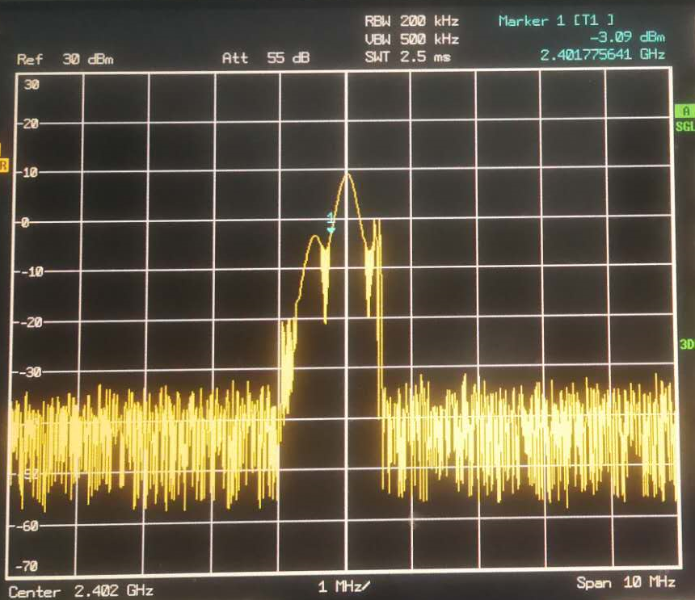

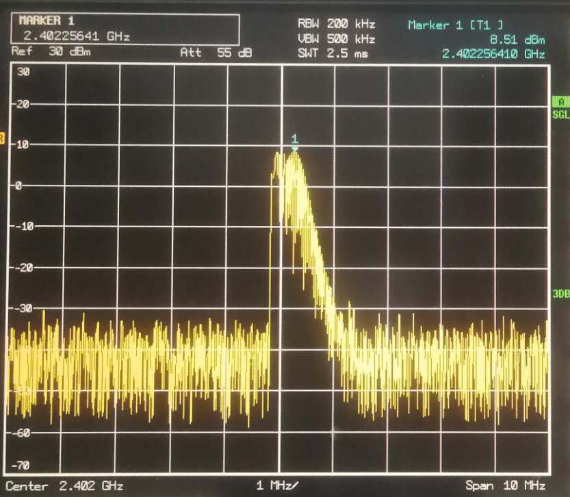

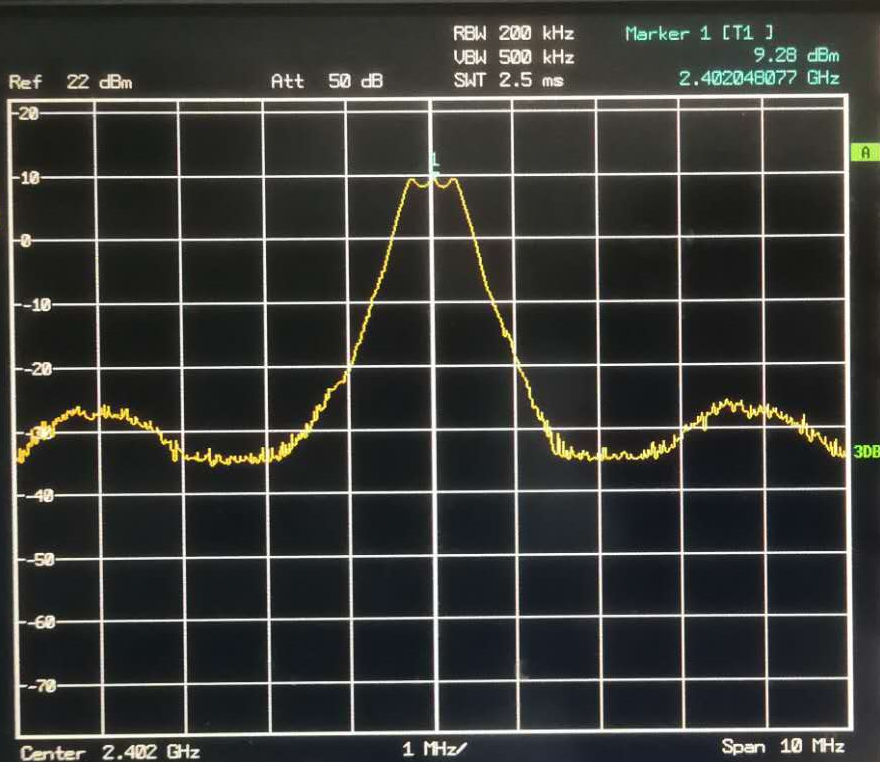

### RX Mode

Function: In the packet-receiving mode, communication mode can be set to receive packets, specifically with the non-signaling test tool "Non_Signaling_Test_Tool" to obtain the number of packets received and RSSI.

**Example:**

Test tool: select Non_Signaling_Test_Tool

Wireless communication mode setting: Ble1M/Ble2M/Ble125K/Ble500K/Zigbee250K

Channel setting: 2402~2480MHz

\newpage
# Timer

This SoC supports 2 timers: Timer0 and Timer1.

The following four modes are supported: System Clock Mode, GPIO Trigger Mode, GPIO Pulse Width Mode, and Tick Mode.

There is also a watchdog timer, configured as "watchdog" to monitor system operation and reboot if there is an exception.

## Function description

When using Timer0, Timer1 timers, you need to specify which mode to use by setting the timer_set_mode function interface:

```C
void timer_set_mode(timer_type_e type, timer_mode_e mode,unsigned int init_tick, unsigned int cap_tick).
```

When using GPIO Trigger Mode and GPIO Pulse Width Mode of Timer0 and Timer1, the clock source of Timer is provided by GPIO, which needs to be set through the following interface. You can select GPIO and polarity, and the corresponding GPIO interrupt mask will also be set in this interface, so that the timer interrupt can be generated normally.

```C
void timer_gpio_init(timer_type_e type, gpio_pin_e pin, gpio_pol_e pol ).
```

### System Clock Mode

---------------------------------------------------------------------------
Clock Source   Function                     Mechanism Description
-------------- ---------------------------- ---------------------------------------------------
pclk           Timed interrupt generation   After setting to this mode, when a rising edge of pclk is detected, count register of the timer will add 1 until reaching the capture value, generating an interrupt, and at the same time, initial_tick will be automatically loaded, and recounted, and when reaching capture value, the interrupt will be entered again, timer enable is not turned off, so that this operation will be cyclic all the time.

---------------------------------------------------------------------------

Setup steps (as the following code):

```C
timer_set_mode(TIMER0, TIMER_MODE_SYSCLK, 0, 50*sys_clk.pclk*1000);
timer_start(TIMER0);
```

### GPIO Trigger Mode

--------------------------------------------------------------------------------------------------------------------------------------
Clock Source      Function                                                         Mechanism Description
----------------- ---------------------------------------------------------------- ---------------------------------------------------
Provided by GPIO  Specific number of GPIO rising/falling edge triggers interrupts. After setting to this mode, the timer will count plus 1 for every rising/falling edge of GPIO. When the timer count value reaches the specified set number, an interrupt will be performed, the timer will be cleared to start counting again. The timer enable interrupt is not turned off, so that the operation will be cyclic all the time.

--------------------------------------------------------------------------------------------------------------------------------------

Setup steps (as the following code):

```C
timer_gpio_init(TIMER0, SW1,POL_RISING);
timer_set_mode(TIMER0, TIMER_MODE_GPIO_TRIGGER,0,TIMER_MODE_GPIO_TRIGGER_TICK);
timer_start(TIMER0);
```

### GPIO Pulse Width Mode

----------------------------------------------------------------------------------------
Clock Source   Function              Mechanism Description
-------------- --------------------- ---------------------------------------------------
pclk           Capture pulse width   After setting to this mode, if the set GPIO detects a rising/falling edge, it will trigger the timer timing. For every pclk, the timer will count plus 1. When the GPIO level invert is detected, it will enter the interrupt, the timer count stops, at this time the current tick count value can be read to calculate the width of the GPIO pulse. This interrupt is triggered once, will not operate in automatic loop.

----------------------------------------------------------------------------------------

Setup steps (as the following code):

```C
timer_gpio_init(TIMER0, SW1, POL_FALLING);
timer_set_mode(TIMER0, TIMER_MODE_GPIO_WIDTH,0,0);
timer_start(TIMER0);
```

Example: If the polarity is set to POL_FALLING, the timing is triggered at the falling edge and the interrupt is generated at the rising edge.

### Tick Mode

-------------------------------------------------------------------------------------------------------------------------------------------
Clock Source        Function                                          Mechanism Description
------------------- ------------------------------------------------- ---------------------------------------------------------------------
pclk                Can be used as a time indicator,                  After setting to this mode, the timer will count plus 1 for every rising/falling
                    this mode does not generate interrupt.            edge of GPIO. When the timer count value reaches the specified set number,
                                                                      an interrupt will be performed, the timer will be cleared to start counting again. If the initial count value of the timer is not set to 0 at the specified time, then the timer will keep adding 1 until the timer count overflows, automatically setting the initial count value of the timer to 0 and starting the timer again, and the timer will keep cycling through the timer like a clock.

-------------------------------------------------------------------------------------------------------------------------------------------

Setup steps (as the following code):

```C
timer_set_mode(TIMER0, TIMER_MODE_TICK,0,0);
timer_start(TIMER0);
```

### Watchdog Mode

--------------------------------------------------------------------------------------------------------------------------------------------
Clock Source        Function                                                 Mechanism Description
------------------- -------------------------------------------------------- ---------------------------------------------------------------
pclk                Reset if you do not "feed the dog" within the set time   After setting to this mode, the watchdog starts timing. If the dog is not fed within the specified time, the program will reset. The dog feeding function is: wd_clear_cnt, this function will clear the timing and restart the timing. If the watchdog is not used, you need to turn off the watchdog to avoid the program reset.

--------------------------------------------------------------------------------------------------------------------------------------------

Setup steps (as the following code):

```C
wd_set_interval_ms(1000,sys_clk.pclk*1000);
wd_start();
```

## Demo description

Choose which mode to use using the macro TIMER_MODE in Timer_Demo/app_config.h.

```C
#define TIMER_SYS_CLOCK_MODE      1
#define TIMER_GPIO_TRIGGER_MODE   2
#define TIMER_GPIO_WIDTH_MODE     3
```

### GPIO System Clock Mode

**Demo setting:**

Timer0, set to system clock mode, set initial_tick=0, capture value=50ms, enable timer0. Interrupt will be reversed using LED2.

**Execution result:**

LED2 will be reversed every 50ms, resulting in the following:

Channel 1 (LED2): is an interrupt marker GPIO, about 50ms, reversing once.

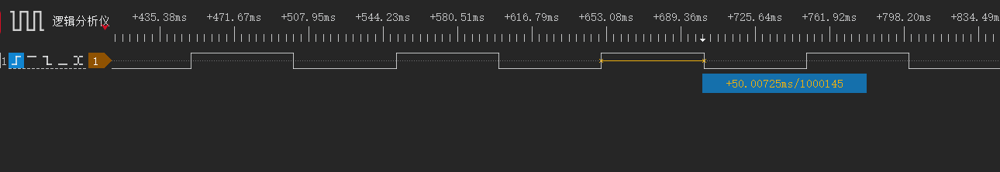

### GPIO Trigger Mode

**Demo setting:**

Timer0, set to GPIO trigger mode, initialize GPIO, configure SW1 as timer0s clock source, trigger at rising edge, set initial_tick=0, value=0xf, enable timer0. Interconnect GPIO_PA2 and SW1 pins, GPIO_PA2 generates a rising edge every 500ms, when reaching the capture value, it enters an interrupt. The interrupt will be reversed using GPIO_PB5.

**Execution result:**

For every 15 rising edges generated by GPIO_PA2, LED2 reverses once, resulting in the following:

Channel 1 (LED2): is the interrupt marker GPIO, for every 15 rising edges generated by GPIO_PA2, LED2 generates a reverse.

Channel 0 (GPIO_PA2): is the trigger signal pin GPIO_PA2.

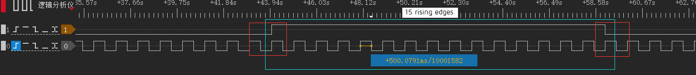

The following is detailed description of the red box:

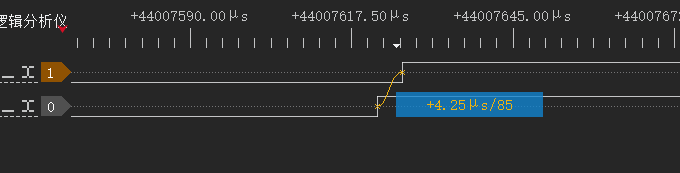

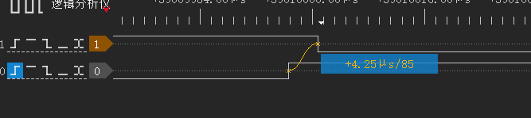

As you can see from the red box 1 and 2, after the 15th rising edge of the previous interrupt, the delay is about 4.25us, it will enter the current interrupt, and LED2 will be reversed. And after the current LED2 lasts for 15 rising edges, the delay is about 4.25us and it will enter the next interrupt.

### GPIO Pulse Width Mode

**Demo setting:**

Timer0, set to GPIO pulse width mode, initialize GPIO, configure SW1 as trigger source for timer0, trigger at falling edge, set initial_tick=0, capture value=0, enable timer0. Interconnect GPIO_PA2 and SW1 pins, GPIO_PA2 generates a falling edge, trigger timer timing, delay 250ms, GPIO_PA2 generate a rising edge, it enters an interrupt. The interrupt will be reversed using LED2.

**Execution result:**

When GPIO_PA2 generates a rising edge, LED2 reverses and the result is as follows:

Channel 0 (GPIO_PB4): is the waveform of trigger source GPIO_PA2.

Channel 1 (LED2): is an interrupt marker GPIO, detects that GPIO_PA2 generates a rising edge, an interrupt occurs, and LED2 generates a reverse.

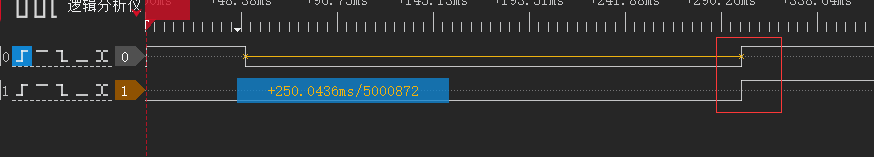

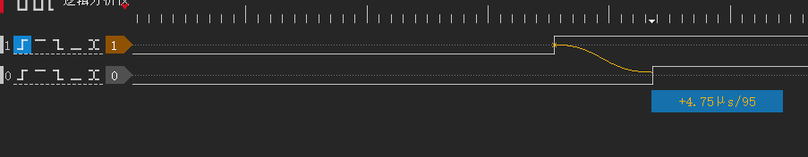

The time delay for generating interrupts is 4.75us, and the CPU entering the interrupt needs a certain amount of software and hardware processing time.

Reading the timing register of the timer results in the following:


For 0x005b8e01 hexadecimal conversion to decimal, the result is 6000129, using the system clock, the frequency is 24M, every 1/24M seconds count once, 6000129 * (1/24M) calculated to be about 250ms.

### Tick Mode

**Demo setting:**

Timer0, set to tick mode, set initial_tick=0, capture value=0, enable timer0. Every 500ms, manually set the timer timing to start from the beginning and LED2 reverses once.

**Execution result:**

LED2 will be reversed every 500ms, resulting in the following:

Channel 1 (LED2): is tick mode marker GPIO, which is reversed once every 500ms or so.

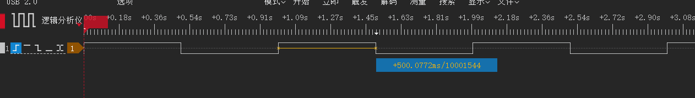

### Watchdog Mode

#### Dog-feeding test

**Demo setting:**

Set the watchdog time, reg_wt_target=1000ms. Every 990ms, feed the dog and LED2 reverses once.

**Execution result:**

LED2 will be reversed every 990ms, resulting in the following:

Channel 1 (LED2): is the dog-feeding test marker GPIO, which is reversed every 990ms or so.

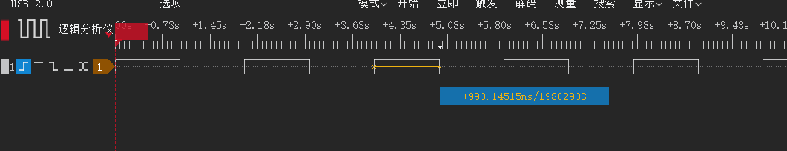

#### No dog-feeding test

If the dog is not fed within the set watchdog time.

**Demo setting:**

delay_ms(990);

//wd_clear_cnt(); //cancel the dog feeding operation

gpio_toggle(LED2);

**Execution result:**

LED2 will periodically output a waveform with a low level of 991.3847ms and a high level of 10.0074ms, resulting in the following:

Channel 1 (LED2): is no dog-feeding test marker GPIO.

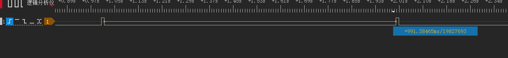

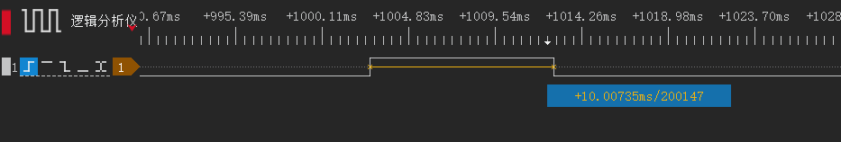

Result: The time set for watchdog is 1000ms, after 990ms delay, reverse LED2, as there is no dog feeding, LED2 high level state is maintained for 10ms, after reaching the time set for watchdog, the program resets and keeps repeating the above operation.

\newpage
# Analog

The analog driver is used to read and write analog registers, supporting the function test of single Byte/Hword/Word, data buffer, DMA channel read and write.

## Attentions

When using DMA to read data from analog registers to buffer, the buffer size of the corresponding destination address must be a multiple of 4.

The reason: Each DMA sends 4 bytes to buffer. 4 bytes will be written to the destination address even if the configured read length is less than 4.

For example: if you define an array buffer of size 5 bytes and configure the DMA to read 5 bytes from the analog register to buffer, the DMA actually transfers twice and 8 bytes in total to buffer, and the extra 3 bytes data will overflow from the array, and the overflowed data will overwrite other variables. At this time, if the array size is configured to 8 bytes, the extra 3 bytes data will be stored in the array and will not be overflowed, avoiding the potential risk.

## Speed Test

Under the condition that cclk, pclk and hclk are set to 24MHz, each interface function is loaded into RAM and the time spent on reading and writing 4 bytes and 8 bytes in each mode is tested as follows:

|Mode|Time of writing 4 bytes|Time of reading 4 bytes|
|:------------------------|:-----------------|:-----------------|
|ALG_WORD_MODE|6us|12.9us|
|ALG_DMA_WORD_MODE|8.4us|10.2us|
|ALG_DMA_BUFF_MODE|8.4us|12.4us|
|ALG_BUFF_MODE|10us|12us|
|ALG_HWORD_MODE|12.8us|17.6us|
|ALG_DMA_ADDR_DATA_MODE|13.1us|Not supported|
|ALG_BYTE_MODE|22.6us|26.8us|

|Mode|Time of writing 8 bytes|Time of reading 8 bytes|
|:----------------------|:---------------|:------------------|
|ALG_DMA_BUFF_MODE|11.2us|15.5us|
|ALG_BUFF_MODE|12.8us|16.6us|
|ALG_WORD_MODE|15.8us|19.3us|
|ALG_DMA_ADDR_DATA_MODE|18.9us|Not supported|
|ALG_DMA_WORD_MODE|23.5us|20.1us|
|ALG_HWORD_MODE|24.8us|32.9us|
|ALG_BYTE_MODE|44.1us|53.9us|

\newpage
# Flash

The flash is a Non-Volatile memory that can retain data for a long time without current supply and has storage characteristics equivalent to a hard disk. The flash can erase and reprogram memory cells called blocks. The write operation of any flash device can only be performed in an empty or erased cell, so an erase must be performed before a write operation can be performed.

## Read operation

**Note:**

>- When the read address exceeds the maximum address of flash, the value can still be read, but the read address is calculated according to the valid address bits. (If the flash size is 1M bytes, the maximum address is 0xfffff, that is, the lower 20 bits is the valid address bit; if the value of 0x100000 address is read, the value of 0x0 address is read.)

## Write operation

**Note:**

>- You should erase before write. The latest flash_write_page function supports cross-page writing.

\newpage
# BQB

This section describes how to use the BQB to test Demo.

## Function description

+ Supports 2-wire mode;

+ Supports BLE1M, BLE2M, BLE_LR_S2/S8;

+ Supports long packages (payload of 255);

+ Supports manual adjustment of frequency bias values by writing flash;

+ Supports manual adjustment of serial port configuration by writing flash.

## Frequency bias value setting

The flash addresses of 0x7e000 (512K), 0xfe000 (1M), and 0x1fe000 (2M) are used to set the frequency bias value, and the setting is made effective by a reset after writing the frequency bias value. If the value is not written, (0xff) is the default frequency bias value.

## Communication verification

After the serial port configuration is complete you can verify that the serial port is communicating properly by the following method:

Open the serial port tool on the PC and send "C0 00" in hexadecimal format to Eagle development board. If you can receive the response of "80 00" from the board, it means the communication is normal.

\newpage
# PWM

## PWM introduction

The SoC has 6 PWM channels: PWM0~PWM5.

The relevant modes supported by PWM are described as follows:

Modes supported by PWM0:

- continuous mode
- counting mode
- IR mode
- IR FIFO mode
- IR DMA FIFO mode

Modes supported by PWM1~PWM5:

- continuous mode

### Clock

The PWM clock source is available in two ways, either pclk or 32K, as shown below:

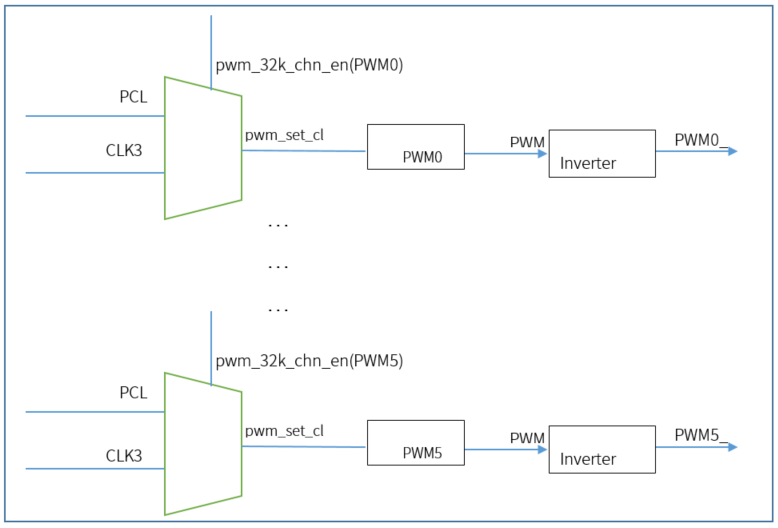

**pclk:**

Function: The clock can be frequency divided and then the divided clock is used as the clock source for PWM.

Interface configuration: static inline void pwm_set_clk(unsigned char pwm_clk_div);

Where: pwm_clk_div = pclk_frequency /pwm_frequency -1; (pwm_clk_div: 0~255)

**32K:**

Function: The frequency division is not supported. It only supports continuous mode and counting mode. This configuration is mainly for the purpose of sending PWM waveforms even in suspend mode.

Interface configuration: static inline void pwm_32k_chn_en(pwm_clk_32k_en_chn_e pwm_32K_en_chn);

**Note:**

>- All channels use pclk clock source by default. If you want to use 32K clock source, call pwm_32k_chn_en to enable the corresponding channel, the channel that is not enabled still uses pclk clock source.
>- For 32K clock source, PWM design only considered when the suspend scenario, using interrupts in continuous mode and counting mode it will enter the interrupt a 32K clock cycle in advance, in this 32K clock cycle, it will exit the interrupt and enter the interrupt. When using 32K PWM, if you need interrupt, it is recommended using GPIO interrupt to achieve the interrupt.
>- When using 32K clock source, if you need to update the duty cycle during operation, only calling the function to set the duty cycle will not take effect, you should set the duty cycle and then call the following function before it will take effect.

The specific function interface is as follows:

```C
static inline void pwm_32k_chn_update_duty_cycle(void);
```

### Duty cycle

A signal frame of PWM consists of two parts, Count status (high level time) and Remaining status (low level time). And the specific waveform of a signal frame is as follows, where tmax is the cycle time.

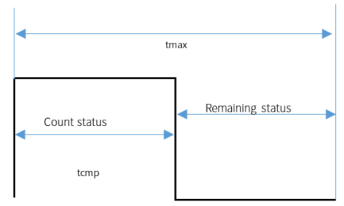

The functions to set the signal frame period and duty cycle in the driver both use tcmp and tmax as parameters.

a) Generic function interface for setting duty cycle (all channels supported):

```C
static inline void pwm_set_tcmp(pwm_id_e id, unsigned short tcmp);
static inline void pwm_set_tmax(pwm_id_e id, unsigned short tmax);
```

**pwm_set_tcmp:**

id: select which PWM channel;

tcmp: set the high level duration.

**pwm_set_tmax:**

id: select which PWM channel;

tmax: set period.

**Note:**

>- The second parameter in the pwm_set_tmax function sets the period of PWM, the parameter type is short, the minimum value of tmax is 1 and cannot be 0. If tmax is 0, the pwm is in a non-working state, so the value of tmax is in the range of 1~65535.
>- The second parameter in the pwm_set_tcmp function sets the duty cycle of PWM, and the parameter type is short. The minimum value of tcmp can be 0, when it is 0, the waveform of pwm is always low, and the maximum value can be tmax, when the waveform of pwm is always high, so the value range of tcmp is: 0~tmax.

b) When using the IR FIFO Mode and IR DMA FIFO Mode of PWM0, another function interface will be used:

```C
static inline void pwm_set_pwm0_tcmp_and_tmax_shadow(unsigned short tmac_tick, unsigned short cmp_tick);
```

**Note:**

>- In the pwm_set_pwm0_tcmp_and_tmax_shadow function, the parameter tmac_tick sets the cycle of pwm0, and the parameter cmp_tick sets the high level duration of pwm0. The value range of tmac_tick: 1 \~ 65536, and the value range of cmp_tick: 0 \~ cycle_ tick.

c) When using the counting mode and IR mode of PWM0, pwm0 needs to set the number of pulses output function, using the following function interface:

```C
static inline void pwm_set_pwm0_pulse_num(unsigned short pulse_num);
```

pulse_num: the number of pulses.

d) When pwm0 writes cfg data to the fifo, the following function interface is used:

```C
static inline void pwm_set_pwm0_ir_fifo_cfg_data(unsigned short pulse_num, unsigned char use_shadow, unsigned char carrier_en);
```

**use_shadow:**

1: Use the period and duty cycle set under the pwm_set_pwm0_tcmp_and_tmax_shadow function.

0: Use the period and duty cycle set under pwm_set_tmax, pwm_set_tcmp function.

**carrier_en:**

1: Output pulse according to the settings of pulse_num and use_shadow.

0: Output low level, duration is calculated according to parameters pulse_num and use_shadow.

### Invert/polarity

(1) The waveform set by pwm_set_tcmp and pwm_set_tmax will output high level of Count status first and low level of Remaining status later by default.

(2) If PWM\*_PIN is used, the output waveform is the same as the waveform set by pwm_set_tcmp and pwm_set_tmax.

(3) If PWM\*_N_PIN is used, the output waveform is the opposite of PWM\*_PIN waveform.

(4) If the PWM\* channel invert function is enabled using pwm_invert_en, it will flip the PWM\*_PIN waveform.

(5) If the PWM\* channel invert function is enabled using pwm_n_invert_en, it will flip the PWM\*_N_PIN waveform.

(6) If the polarity function of PWM\* channels is enabled using pwm_set_polarity_en, all PWM_PINs will be output according to the following rule: Count status outputs low, Remaining status outputs high.

## Function description

### Continuous mode

This mode will keep sending signal at the set duty cycle, set stop if you want to stop, and stop immediately after setting. During sending, the duty cycle can be updated, and the duty cycle will take effect at the next frame.

### Counting Mode

It will stop once sending a set number of signal frames. In this mode, if stop, it will stop immediately. In this mode, modifying the duty cycle during sending will not change the duty cycle.

### IR Mode

It sends pulse groups continuously in IR mode, and the duty cycle can be changed in between and will take effect on the next pulse group. If you want to stop it immediately, you can stop it directly. The difference between IR mode and counting mode is that it sends one pulse group and then stops sending in counting mode, while it sends pulse groups continuously in IR mode.

If you want to stop IR mode and finish the current pulse group, you can switch to counting mode.

If you want to stop immediately, you can stop directly.

**Note:**

>- If you want to stop IR mode and finish the current pulse group, you can switch to counting mode in the interrupt, but during the switching process, the pulse group in the current IR mode will be sent out before switching over.

### IR FIFO mode

The long code pattern can be sent without the MCU intervention. The IR carrier frequency is obtained by dividing the system clock and can support common frequencies. The element "Fifo cfg data" is used as the base unit of the IR waveform, and the hardware will parse the cfg information to send the corresponding signal.

In the IR FIFO mode it takes out the cfg data in the FIFO in turn and sends the corresponding signal until the fifo is empty. In this mode, you can use stop, but it only stops the execution of the current cfg data and does not affect the execution of the cfg data after the fifo.

**Note:**

>- In IR FIFO mode, as long as the fifo has data, it will keep sending out (auto send), no start signal is needed, also IR DMA FIFO mode does not need start signal, but in all other modes, pwm_start signal is needed.
>- Every time the function pwm_set_pwm0_ir_fifo_cfg_data is called, the cnt of the FIFO is added by 1 (if the FIFO is full at this time, it waits until the FIFO is not full and then writes), and the hardware takes one out from the FIFO, the cnt in the FIFO is subtracted by 1. The depth of the FIFO is 8 bytes. After the data is taken out from the FIFO, the send signal action is executed, and only after the current signal is executed, the next one will be taken out from the FIFO.

### IR DMA FIFO mode

The IR DMA FIFO mode is similar to IR FIFO mode, except that the configuration is not written directly by the MCU in the FIFO, but is written to the FIFO via DMA.

**Note:**

>- Inside the interrupt you need to update the DMA part of the configuration: update of the source address, DMA triggering, and so on.
>- In this mode, unlike the IR FIFO, the interrupt is not triggered when the number of cfg data in the FIFO is empty, but only when all the configuration pwm signal frames in the fifo are executed.

## Interrupts

The interrupt settings supported by PWM are described as follows (hardware does not automatically clear the interrupt flag bit, it needs to be cleared manually by software).

**Interrupts supported by PWM0:**

a) FLD_PWM0_FRAME_DONE_IRQ: Each signal frame is completed and an interrupt is generated.

b) FLD_PWM0_PNUM_IRQ: An interrupt is generated after each pulse group is sent.

c) FLD_PWM0_IR_FIFO_IRQ: Enter interrupt when the cfg data inside the FIFO is less than (not including equal to) the set value (trigger_level).

d) FLD_PWM0_IR_DMA_FIFO_IRQ: When the FIFO has finished executing the cfg data sent by DMA, it enters the interrupt.

**Interrupts supported by PWM1:**

a) FLD_PWM1_FRAME_DONE_IRQ: Each signal frame is completed and an interrupt is generated.

**Interrupts supported by PWM2:**

a) FLD_PWM2_FRAME_DONE_IRQ: Each signal frame is completed and an interrupt is generated.

**Interrupts supported by PWM3:**

a) FLD_PWM3_FRAME_DONE_IRQ: Each signal frame is completed and an interrupt is generated.

**Interrupts supported by PWM4:**

a) FLD_PWM4_FRAME_DONE_IRQ: Each signal frame is completed and an interrupt is generated.

**Interrupts supported by PWM5:**

a) FLD_PWM5_FRAME_DONE_IRQ: Each signal frame is completed and an interrupt is generated.

A pulse group contains several frames and can be configured via the pwm_set_pwm0_pulse_num function interface:

```C
static inline void pwm_set_pwm0_pulse_num(unsigned short pulse_num).
```

The value of the IR FIFO mode trigger_level can be configured via the pwm_set_pwm0_ir_fifo_irq_trig_level function interface:

```C
static inline void pwm_set_pwm0_ir_fifo_irq_trig_level(unsigned char trig_level).
```

**Note:**

>- When responding to an interrupt, there is a time delay of about 2~4 us.

## Continuous mode

### Function description

The demo implements the following functions: LED1 will continuously send signal frame (high level time of 50us, period of 100us), at the same time, every time an interrupt is generated, LED4 will be toggled once (the GPIO is a marker signal set to do interrupt test).

### Example results

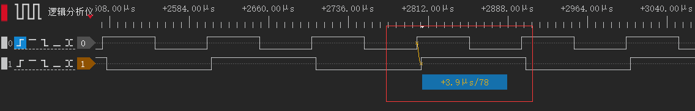

The above figure shows the test results captured using a logic analyzer:

Channel 0 (LED1): is the PWM output signal.

Channel 1 (LED4): is an interrupt marker GPIO, generating an interrupt for each signal frame sent.

The red box indicates: the time delay to generate the interrupt, the CPU needs a certain amount of software and hardware processing time to enter the interrupt.

### Other validation results

#### Stop

Use the following test to verify that in continuous mode, signal will stop immediately after executing stop.

The code implementation is as follows, after the stop, toggle the state of LED3.

```C
pwm_start(PWM_ID);
delay_ms(1);
pwm_stop(PWM_ID);
gpio_toggle(LED3);
```

Test results are captured using a logic analyzer:

Channel 0 (LED1): is the PWM output signal.

Channel 1 (LED3): is the stop marker GPIO.

As can be seen from the figure, the PWM signal stops immediately after LED3 is toggled.

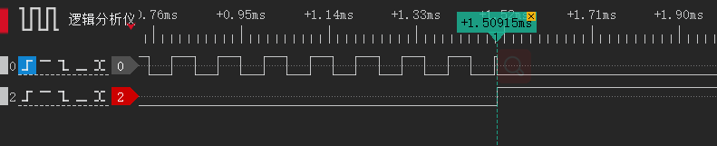

#### Duty cycle

Use the following test to verify that in continuous mode, the duty cycle can be updated during the data sending period, and the update of the duty cycle will take effect in the next frame. The code implementation is as follows, after modifying the duty cycle state, the state of LED3 is toggled.

```C
pwm_start(PWM_ID);
delay_ms(1);
pwm_set_tcmp(PWM_ID,10 * CLOCK_PWM_CLOCK_1US);
gpio_toggle(LED3);
```

Test results are captured using a logic analyzer:

Channel 0 (LED1): is the PWM output signal.

Channel 1 (LED3): is the duty cycle update marker GPIO.

As can be seen from the figure, after LED3 is toggled, PWM modifies the duty cycle to take effect at the next frame.

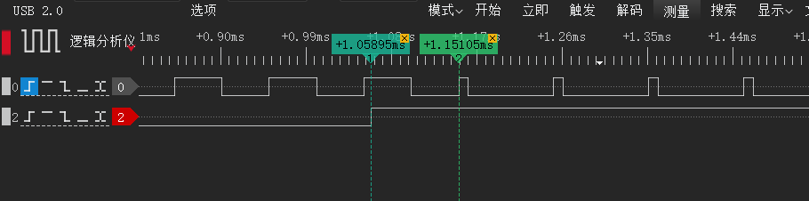

## Counting mode

Choose which interrupt method by using the macro in app_pwm_count.c

```C
#define COUNT_FRAME_INIT 1
#define COUNT_PNUM_INIT 2
#define SET_COUNT_INIT_MODE COUNT_FRAME_INIT
```

### COUNT_FRAME_INIT

#### Function description

The demo implements the following functions, LED1 will output a number of 16 signal frame (high level time of 50us, period of 100us), at the same time, it generates an interrupt every signal frame sent, , LED4 will be toggled once (the GPIO is a marker signal set to do interrupt test).

#### Example results

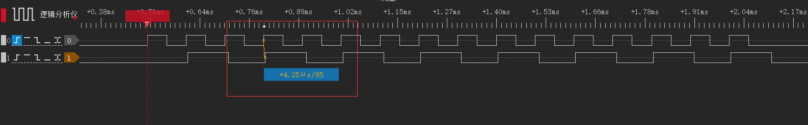

Channel 0 (LED1): is the PWM output signal.

Channel 1 (LED4): is an interrupt marker GPIO, generating an interrupt for each signal frame sent.

The red box indicates: the time delay to generate the interrupt, the CPU needs a certain amount of software and hardware processing time to enter the interrupt.

### COUNT_PNUM_INIT

#### Function description

The demo implements the following functions: LED1 will output a signal frame with a number of 16 (50us high level time, 100us period), and after sending the specified number of pulses, an interrupt will be generated and LED4 will be toggled (the GPIO is a marker signal set for interrupt testing).

#### Example results

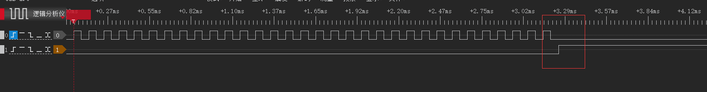

The details of the red boxes are as follows:

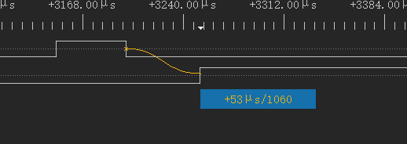

Channel 0 (LED1): is the PWM output signal.

Channel 1 (LED4): is the interrupt marker GPIO, specify the number of pulses sent out, generate an interrupt.

Red box description: 3us more than 50us, indicating that there is a certain time delay to enter the interrupt and the CPU needs a certain amount of software and hardware processing time to enter the interrupt.

### Other validation results

#### Stop

Use the following test to verify that in counting mode, signal will stop immediately after executing stop.

The code implementation is as follows, after the stop, toggle the state of LED3.

```C
pwm_start(PWM_ID);
delay_ms(1);
pwm_stop(PWM_ID);
gpio_toggle(LED3);
```

Test results are captured using a logic analyzer:

Channel 0 (LED1): is the PWM output signal.

Channel 1 (LED3): is the stop marker GPIO.

As can be seen from the figure, the PWM signal stops immediately after LED3 is toggled.

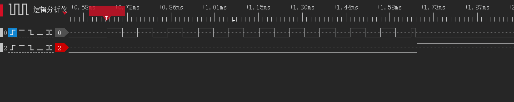

#### Duty cycle

Use the following test to verify that in counting mode, the duty cycle cannot be changed when changing the duty cycle during data sending.

The code is implemented as follows, toggle the state of LED3 after modifying the duty cycle state.

```C
pwm_start(PWM_ID);
delay_ms(1);
pwm_set_tcmp(PWM_ID,10 * CLOCK_PWM_CLOCK_1US);
gpio_toggle(LED3);
```

Test results are captured using a logic analyzer:

Channel 0 (LED1): is the PWM output signal.

Channel 1 (LED3): is the duty cycle update marker GPIO.

As can be seen from the figure, the signal of PWM does not change after LED3 is toggled.

The test results are as follows:

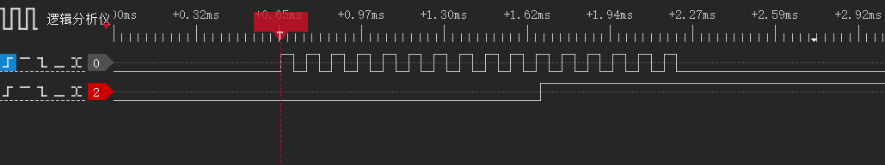

## IR mode

### Function description

The demo implements the following functions, LED1 will output 6 pulse groups (each pulse group, the number of pulses is 4, the high level time is 50us, the period is 100us), at the same time, after sending a pulse group, an interrupt is generated, LED4 will be toggled once (the GPIO is a marker signal set to do interrupt test).

### Example results

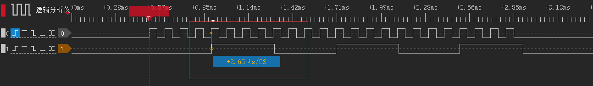

The above figure shows the test results captured using a logic analyzer:

Channel 0 (LED1): is the PWM output signal.

Channel 1 (LED3): is an interrupt marker GPIO, toggle once after a pulse group sent.

The red box indicates: the time delay to generate the interrupt, the CPU needs a certain amount of software and hardware processing time to enter the interrupt.

### Other validation results

#### Stop

Use the following test to verify that in counting mode, signal will stop immediately after executing stop.

The code implementation is as follows, after the stop, toggle the state of LED3.

```C
pwm_start(PWM_ID);
delay_ms(1);
pwm_stop(PWM_ID);
gpio_toggle(LED3);
```

Test results captured using a logic analyzer:

Channel 0 (LED1): is the PWM output signal.

Channel 1 (LED3): is the stop marker GPIO.

As can be seen from the figure, the PWM signal stops immediately after LED3 is toggled.

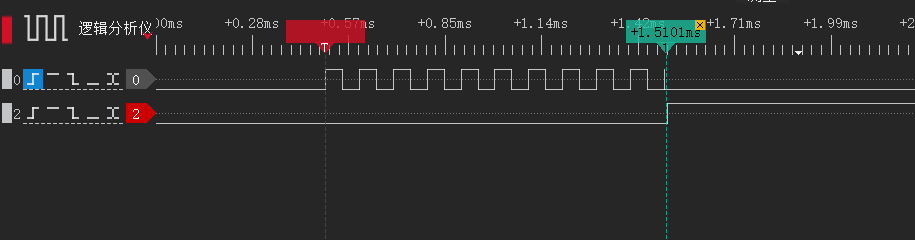

#### Duty cycle

Use the following test to verify that in counting mode, the duty cycle can be changed in the middle, but it will take effect after the current pulse group is executed.

The code implementation is as follows:

```C
pwm_start(PWM_ID);
delay_ms(1);
pwm_set_tcmp(PWM_ID,10 * CLOCK_PWM_CLOCK_1US);
gpio_toggle(LED3);
```

Test results are captured using a logic analyzer:

Channel 0 (LED1): is the PWM output signal.

Channel 1 (LED3): is the duty cycle update marker GPIO.

As you can see from the figure, the signal of pwm does not change immediately after LED3 is toggled, but takes effect after the current pulse group is executed.

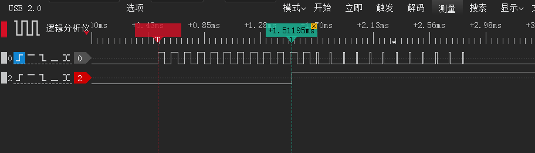

## IR FIFO Mode

### Function description

The general flow of the IR FIFO MODE demo is introduced: at the beginning, write two groups of cfg data1, cfg data2 to the FIFO, when the cfg data inside the FIFO is less than (not including equal to) the set value (trigger_level is 1) to enter the interrupt, in the interrupt the same two groups of cfg data1, cfg data2 are configured.

The demo implements the following functions, LED1 is sent in two groups of pulses in sequence and continuously, and the two groups of pulses are set as follows:

(1) cfg data1, high level time of 50us, period of 100us

(2) cfg data2, high level time of 100us, period of 200us

LED4 will be toggled once for each interrupt generated (this GPIO is a marker signal set to do interrupt testing).

### Example results

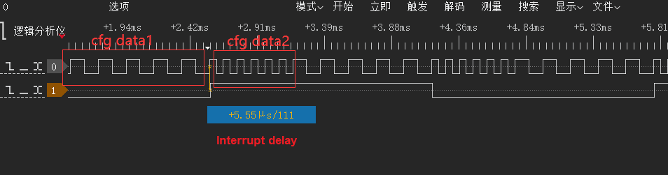

Channel 0 (LED1): is the PWM output signal.

Channel 1 (LED4): is the interrupt marker GPIO, when the cfg data inside the FIFO is less than (not including equal to) the set value (trigger_level is 1), toggle once (after the execution of cfg data1, cfg data2 is taken out from the FIFO, the value of cnt is 0, which is less than the trigger level (value is 1), it enters an interrupt).

The red box indicates: the time delay to generate the interrupt, the CPU needs a certain amount of software and hardware processing time to enter the interrupt.

### Other validation results

#### Stop

Use the following test to verify that in IR FIFO mode, after executing stop, it only stops the execution of the current cfg data and does not affect the execution of the cfg data after the fifo.

The code implementation is as follows, after the stop, toggle the state of LED3.

```C
delay_ms(10);
pwm_stop(PWM_ID);
gpio_toggle(LED3);
```

Test results are captured using a logic analyzer:

Channel 0 (LED1): is the PWM output signal.

Channel 1 (LED3): is the stop marker GPIO.

In the IR FIFO MODE function description:

cfg data1: Number of pulses is 5, high level time is 50us, period is 100us.

cfg data2: number of pulses is 6, high level time is 100us, period is 200us.

As can be seen from the figure, after executing stop, LED3 is toggled, stopping the execution of the current cfg data1 does not affect the execution of cfg data2 behind the fifo.

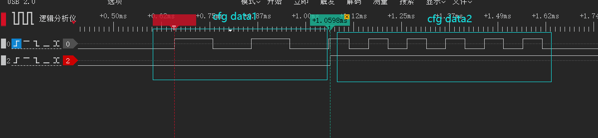

## DMA FIFO mode

Select the working method by using the macro in app_pwm_ir_dma.c

```C
#define 	PWM_IR_FIFO_DMA 	1
#define 	PWM_CHAIN_DMA 		2
#define     SET_PWM_DMA_MODE 	PWM_IR_FIFO_DMA
```

### PWM_IR_FIFO_DMA

In IR DAM FIFO Mode, interrupts need to be constantly triggered to request DMA to send cfg data to the FIFO.

IR DMA FIFO Mode program rough flow: in the main program through the DMA request, send three groups of cfg data to the FIFO, respectively cfg data1, cfg data2, and cfg data3. When all the cfg data in the FIFO are executed, enter the interrupt, in the interrupt through the DMA request, send two groups of cfg data to the FIFO, respectively cfg data4, cfg data5.

#### Function description

The demo implements the following functions, with LED1 sending a three-set of pulse group at the beginning:

cfg data1: the number of pulses is 5, the high level time is 50us, and the period is 100us.

cfg data2: the number of pulses is 4, the high level time is 50us, and the period is 100us.

cfg data3: the number of pulses is 6, the high level time is 100us, and the period is 200us.

Next, two sets of pulses are continuously sent in groups of two pulses:

cfg data4: the number of pulses is 4, the high level time is 50us, and the period is 100us

cfg data5: the number of pulses is 4, the high level time is 50us, and the period is 100us

At the same time, LED4 will be toggled once for each interrupt generated (this GPIO is a marker signal set to do interrupt testing).

#### Example results

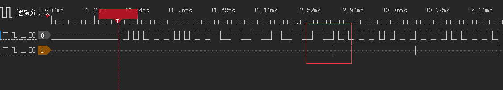

Channel 0 (LED1): is the PWM output signal.

Channel 1 (LED4): is the interrupt marker GPIO.

As you can see from the above figure, in this mode, the interrupt is triggered only when all the cfg data of the FIFO is executed, which is different from the interrupt mechanism of IR FIFO Mode.

The following figure is the enlarged red box in the above figure. From the figure, we can see that the last low maintenance time of cfg data3 is 105us (not 100us as set by cfg data3), so we can see that in this usage method, after sending the first group of DMA data, the DMA is retriggered in the interrupt, and there is a time delay on the signal. (This example is equivalent to the actual output: cfg1+cfg2+cfg3+delay(low level 5us or so)+cfg4+cfg5), the 5us time includes the time to enter the interrupt and reset the relevant settings.

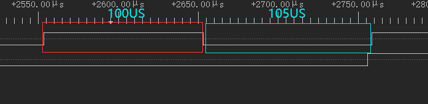

### PWM_CHAIN_DMA

The SoC chip's DMA has a chain table form that can be used in conjunction with the DMA FIFO mode, the advantage of which is that it is possible to keep sending the desired signal repeatedly without the MCU's intervention. In the previous IR DAM FIFO Mode example, it is necessary to continuously trigger interrupts to request DMA to send cfg data to the FIFO, using the chain table method can also accomplish the function of continuous sending data without interrupt participation.

In the example of pwm_chain_dma, the chain table structure is as follows:

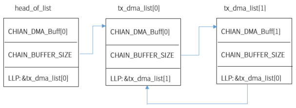

First create the head node head_of_list , then add nodes to the circular chain table, in the demo, two circular chain table nodes are added, tx_dma_list[0] and tx_dma_list[1].

**Note:**

>- The head node needs to be configured with the DMA source address, the DMA length, and the address where the next node configuration is located. We cannot just configure the address where the next node configuration is located.

From the flow chart, we can see that the execution of the head pointer starts first, then tx_dma_list[0], tx_dma_list[1], then tx_dma_list[0] is executed, and so on in a loop until LLP is set to 0.

This is only to achieve two circular chain tables through DMA to achieve continuous sending. If you want to achieve more arrays of circular sending, you can follow the above structure to add the corresponding pointer structure.

The specific DMA chain table configuration is as follows:

```C
pwm_set_dma_config(DMA_CHN);
pwm_set_dma_chain_llp(DMA_CHN,(u16*)(&CHIAN_DMA_Buff[0]),MIC_BUFFER_SIZE,&tx_dma_list[0]);
pwm_set_tx_dma_add_list_element(DMA_CHN,&tx_dma_list[0],&tx_dma_list[1],(u16*)(&CHIAN_DMA_Buff[0]),CHAIN_BUFFER_SIZE);
pwm_set_tx_dma_add_list_element(DMA_CHN,&tx_dma_list[1],&tx_dma_list[0],(u16*)(&CHIAN_DMA_Buff[1]),CHAIN_BUFFER_SIZE)
pwm_ir_dma_mode_start(DMA_CHN);
```

The DMA chain table differs from PWM_IR_FIFO_DMA in that:

pwm_set_dma_chain_llp function and pwm_set_tx_dma_add_list_element function.

Set the chain table header with the pwm_set_dma_chain_llp function.

```C
void pwm_set_dma_chain_llp(dma_chn_e chn,u16 * src_addr, u32 data_len,dma_chian_config_t * head_of_list)
```

chn: DMA configuration.

src_addr: DMA source address, that is cfg data array.

data_len: DMA data length.

head_of_list: the address where the next node is configured.

Contents included in each node: DMA configuration, address where the current node configuration is located, address where the next node configuration is located, DMA source address, DMA length, nodes of the circular chain table set by the pwm_set_tx_dma_add_list_element function.

```C
void pwm_set_tx_dma_add_list_element(dma_chn_e chn, dma_chian_config_t *config_addr, dma_chian_config_t *llponit , u16 * src_addr, u32 data_len)
```

chn : DMA configuration.

config_addr: The address where the current node configuration is located.

llponit: The address where the next node configuration is located.

src_addr: DMA source address, that is cfg data array.

data_len: DMA data length.

#### Function description

The demo implements the following functions, LED1 will first send the cfg data array configured by the head node at the beginning, and then will execute non-stop sending the cfg data array configured by node 1 and the cfg data array configured by node 2 alternately and circularly.

Node 1 is configured with the following cfg data:

cfg data1: the number of pulses is 5, the high level time is 100us, and the period is 200us.

cfg data2: the number of pulses is 4, the high level time is 100us, and the period is 200us.

cfg data3: the number of pulses is 6, the high level time is 100us, and the period is 200us.

cfg data4: the number of pulses is 3, the high level time is 100us, and the period is 200us.

 Node 2 is configured with the following cfg data:

cfg data 5: the number of pulses is 5, the high level time is 50us, and the period is 100us.

cfg data6: the number of pulses is 4, the high level time is 50us, and the period is 100us.

cfg data7: the number of pulses is 6, the high level time is 50us, and the period is 100us.

cfg data8: the number of pulses is 3, the high level time is 50us, and the period is 100us.

### Example results

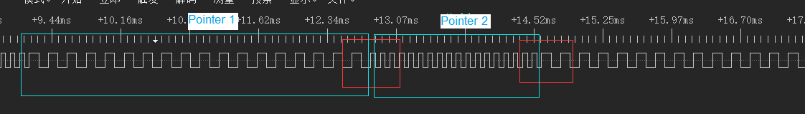

Channel 0 (LED1): is the PWM output signal.

To elaborate on the red box, the cfg data of pointer 1 and pointer 2 are switched without the generation of time delay.

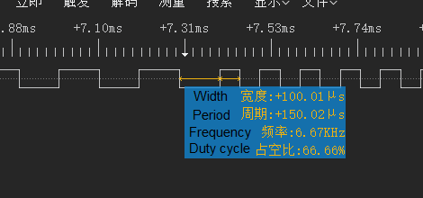

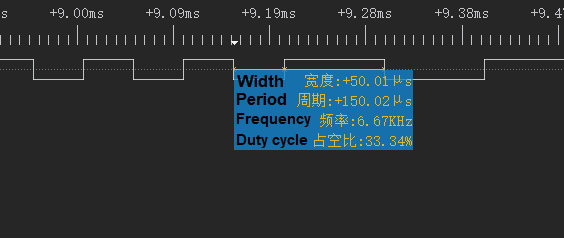

As can be seen from the figure, there is no delay generation, so a continuous PWM waveform can be sent using the chain table approach.

\newpage
# I2C

## Introduction

I2C, a serial bus consisting of the data SDA and the clock SCL, can send and receive data and is a half-duplex communication method. The clock is controlled by the master end and the I2C communication protocol is as follows:

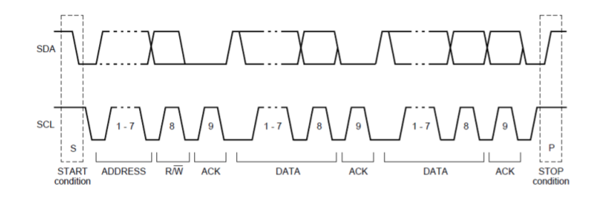

The I2C communication protocol is described in detail as follows:

-------------------------------------------------------------------------------
Status              Process
------------------- ---------------------------------------------------------------
Idle state          When both the SDA and SCL signal of the I2C bus are high at the same time, it is specified as the idle state of the bus.

Start signal        The SDA jumps from high to low during SCL is high.

Stop signal         The SDA jumps from low to high during SCL is high.

Responding signal   The requirement for the feedback valid responding bit ACK is that the receiver pulls the SDA signal low during the low period before the 9th clock pulse and ensures a steady low level during the high period of that clock. If the receiver is the master, it sends a NACK signal after it receives the last byte to notify the controlled transmitter to end data transmission and release the SDA signal so that the master receiver can send a stop signal P.

Validity of data     When the I2C bus is used for data transfer, the data on the data line must remain stable during the period when the clock signal is high. Only during the period when the signal on the clock line is low, the high or low state on the data line is allowed to change. That is, the data needs to be ready before the rising edge of SCL arrives, and must be stable before the falling edge arrives.

Data transfer        Each bit of data transmitted on the I2C bus has a corresponding clock pulse (or synchronization control), that is, each bit of data is transmitted serially on SDA bit by bit in cooperation with the SCL serial clock.

-------------------------------------------------------------------------------

## Interrupt

Interrupt-related introduction in I2C mode is as follows:

**I2C no-DMA mode:**

Related interrupts:

a) I2C_RX_BUF_MASK: Related to rx_irq_trig_lev setting, when fifo_data_cnt>=rx_irq_trig_lev , it generates an interrupt.

b) I2C_RX_DONE_MASK: Generate an interrupt after receiving the sent data.

Whether to clear the interrupt flag bit manually:

I2C_RX_BUF_MASK and I2C_RX_DONE_MASK do not need to clear the interrupt flag bits manually, they will be cleared automatically when the conditions are not met.

**I2C DMA mode:**

Related interrupts:

a) TC_MASK: TC interrupt of DMA will be up when DMA has finished transferring the received data.

b) I2C_TX_DONE_MASK: Generate an interrupt when finished sending data.

Whether to manually clear the interrupt flag bit:

TC_MASK, I2C_TX_DONE_MASK need to clear the interrupt flag bit manually, otherwise it will keep going in and out of interrupts.

**Note:**

>- In non-DMA mode, when the slave end uses interrupts to receive data, the slave end must use both I2C_RX_BUF_MASK and I2C_RX_DONE_MASK to determine the completion of a frame in order to be compatible with all possible data lengths. the reason is as follows:
        (1) I2C_RX_DONE_MASK cannot be captured if the data length is a multiple of trigger level;
        (2) I2C_RX_BUF_MASK is not detected by the tail packet interrupt when the data length is not a multiple of trigger level.
>- In DMA mode, the I2C_RX_DONE_MASK interrupt flag bit is not captured. Use the TC_MASK interrupt of DMA instead.
>- All interrupt MASKs of DMA are turned on by default, you need to turn off other unused MASKs to avoid affecting the results of the experiment.
>- Before using the I2C_TX_DONE_MASK interrupt, you need to clear the I2C_TX_DONE_CLR state manually. If not, it will keep going into the interrupt.
>- I2C_TX_DONE_MASK interrupt does not mean that a frame is sent (it just means that the data part is sent, without waiting for the stop signal), after generating the I2C_TX_DONE_MASK interrupt, then query the BUSY signal until IDLE represents the end.

## I2C mode

The chip supports both as master and as slave. If acting as master, you need to do master initialization and set the clock signal, the interface is as follows:

```C
void i2c_master_init(void);
void i2c_set_master_clk(unsigned char clock);
```

If acting as a slave, the following interface is invoked for initialization, with a unique address (id) for each device:

```C
void i2c_slave_init(unsigned char id).
```

### I2C no-DMA mode

#### Master

The relevant interfaces for the master to send and receive data are configured as follows:

```C
unsigned char i2c_master_write(unsigned char id, unsigned char *data, unsigned char len);
unsigned char i2c_master_read(unsigned char id, unsigned char *data, unsigned char len);
```

The functions of i2c_master_write and i2c_master_read are as follows:

In the case that the master reads and writes, and the slave is normally responding (responds with ACK), the result is as follows:

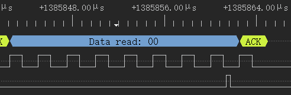

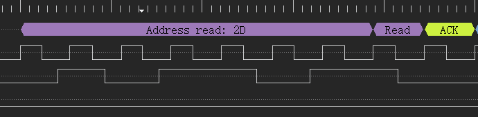

After the master sends the address frame, if the slave responds with NACK, the master will send a stop to stop the transmission, and the result is as follows:

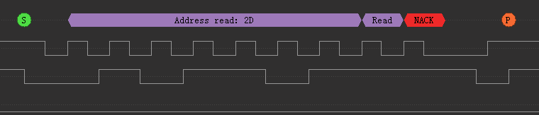

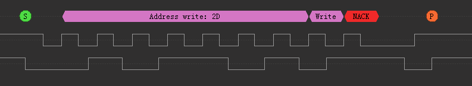

If during the data phase, the slave responds with NAK, the master will still send the remaining data normally. The result is shown as follows:

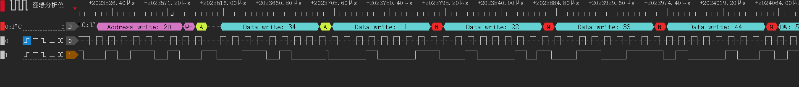

**Note:**

>- At present, only MCUmode supports the function of stopping when NACK is detected after sending the address frame, DMA mode does not support it. The DMA mode will send the whole frame of data regardless of whether the slave end responds with NAK or not.

#### Slave

The relevant interfaces for the slave to receive and send data are configured as follows:

```C
void i2c_slave_write(unsigned char* data , unsigned char len ).
void i2c_slave_read(unsigned char* data , unsigned char len ).
```

Slave end receiving data: you can use interrupts to enable the rx (I2C_RX_BUF_MASK) interrupt and rx_done (I2C_RX_DONE_MASK) interrupt when in non-DMA mode to determine if a frame of data has been received.

The specific configuration of interrupts on the Slave end is as follows:

```C
i2c_set_irq_mask(FLD_I2C_MASK_RX|FLD_I2C_MASK_RX_DONE);
i2c_rx_irq_trig_cnt(SLAVE_RX_IRQ_TRIG_LEVEL);
core_interrupt_enable();
plic_interrupt_enable(IRQ21_I2C);
```

**Note:**

>- Current problem: When I2C is used as a slave, the software cannot distinguish whether the master sends a read or a write command. The Slave end does not know whether to read or write, so the slave needs to write the data to the FIFO in advance before the maste end sends the read command. However, from the application point of view, it is difficult to control the time of writing data in advance because we don't know when the master end will read the data.  
    This can lead to the following problem: In non-DMA mode, the slave end needs to put the sent data in the fifo in advance before the master sends the read command. The size of the fifo is only 8 bytes, and if the master does not read it away, it will be stuck in the i2c_slave_write function, so to use this function, you need to control the timing at the software level.

### I2C DMA mode

#### Master

The relevant interfaces for the master to send and receive data are configured as follows:

```C
void i2c_master_write_dma(unsigned char id, unsigned char *data, unsigned char len);
void i2c_master_read_dma(unsigned char id, unsigned char *rx_data, unsigned char len);
```

The relevant interfaces used to determine whether the master end has finished sending and receiving data are as follows:

```C
static inline bool i2c_master_busy(void).
```

**Note:**

>- TX_DONE interrupt does not mean that a frame is sent (it just means that the data part is sent, without waiting for the stop signal), after generating the TX_DONE interrupt, then querying the busy signal until idle represents the end.

#### Slave

The relevant interfaces for the slave to send and receive data are configured as follows:

```C
void i2c_slave_read_dma(unsigned char *data, unsigned char len);
void i2c_slave_write_dma(unsigned char *data, unsigned char len);
```

The DMA TC_MASK needs to be configured for receiving interrupts on the slave end, as follows:

```C
i2c_clr_txdone_irq_status (I2C_TX_DONE_CLR);
i2c_set_irq_mask(I2C_TX_DONE_MASK);
core_interrupt_enable();
plic_interrupt_enable(IRQ21_I2C);
```

To send interrupts on the slave end, you need to configure I2C_TX_DONE_MASK, as follows:

```C
dma_set_irq_mask(I2C_RX_DMA_CHN, TC_MASK);
```

**Note:**

>- The master end sends a read command to the slave end, and the slave end needs to use i2c_slave_write_dma before the master end sends a read command.
>- The function puts the sent data in the DMA in advance. (Note, you need to ensure that this fill is the data that needs to be responded, because after calling this function, the DMA will put the specified buffer data in the fifo, and wait for the master's clock to come to read the data out.)

## I2C demo description

Choose which mode to use via the macros I2C_MASTER_WRITE_READ_MODE in app.c and app_dma.c.

```C
#define I2C_MASTER_WRITE_READ_NO_DMA            1

#define I2C_MASTER_WRITE_READ_DMA               2

#define I2C_MASTER_WRITE_READ_MODE              I2C_MASTER_WRITE_READ_NO_DMA
```

Select master and slave mode via macro I2C_DEVICE.

```C
#define I2C_MASTER_DEVICE             1

#define I2C_SLAVE_DEVICE              2

#define I2C_DEVICE                    I2C_MASTER_WRITE_READ_NO_DMA
```

**Note：**

>- When testing I2C communication through two boards, when the code of the master end and the salve end are burned to the board, after both boards are powered off, power on the slave end first, and then the master (to avoid data errors), and there is a common ground between the two boards.

### Function description

|   Node     |   Function description                                                   |
|------------|-----------------------------------------------------------------|
| master     | Keep sending write operations, read operations, and then compare the sent data with the read data, if the comparison result differs, LED2 status will change.  |
| slave      | Return the received data to the master. |

### Example results

Using a logic analyzer to capture the timing sequence of the I2C sent data and received data, the following results were executed:

Channel 0: represents the SCL signal of I2C.

Channel 1: represents the SDA signal of I2C.

Channel 2: LED2 represents the flag bit on the master side to determine whether the sent data and received data are the same, and will be flipped if the compared data is not the same.

Master end sends data:

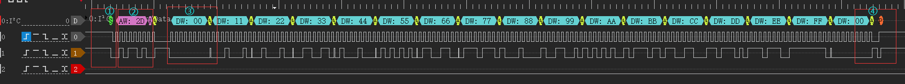

Master end receives data:

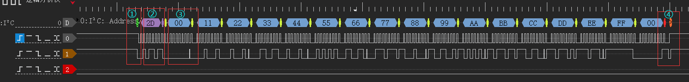

**Special notes:**

(1) When i2c writes, the slave will respond with ACK after the master completes writing the last byte, and then the master will send stop signal to end the communication.

(2) When i2c reads, after the master receives the last byte sent by the slave, the slave end sends the NACK signal and releases the SDA signal so that the master receiver can send a stop signal P.

\newpage
# UART

## Introduction

UART is an asynchronous full-duplex serial communication protocol consisting of two data lines, Tx and Rx. Since there is no clock reference signal, the two communicating parties using UART must agree on configuration parameters such as serial port baud rate, data bit width, parity bit, stop bit, and so on. Therefore they can communicate at the same rate.

Usually, asynchronous communication takes one character as the transmission unit, and the time interval between two characters in communication is not fixed, but the time interval between two adjacent bits in the same character is fixed. When the baud rate is 9600 bps, the time interval for transmitting one bit is about 104.16 us, and when the baud rate is 115200 bps, the time interval for transmitting one bit is about 8 us.

The data transmission rate is expressed in terms of baud rate, which is the number of binary bits transmitted per second. Each character consists of 11 bits (1 start bit, 8 data bits, 1 parity bit, and 1 end bit). For example, if the data transmission rate is 120 characters per second, the baud rate is 11 x 120 = 1320 characters per second = 1320 baud.

## Data communication timing

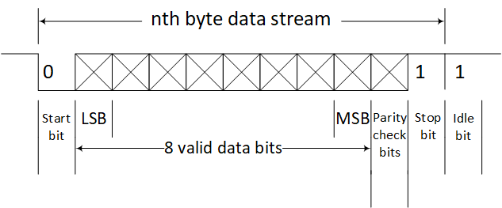

The meaning of each bit is as follows:

Start bit: A logical "0" is issued first to indicate the start of the transmitted character.

Data bits: can be 5-8 bits of logic "0" or "1", such as ASCII code (7 bits), extended BCD code (8 bits), the transmission method is small-end transmission, that is, LSB first, MSB second.

Parity bit: The data bit is added with this parity to make the number of "1" bit even (even parity) or odd (odd parity).

Stop bit: it is a character data end flag, can be 1 bit, 1.5 bits, 2 bits high-level (used to synchronize both ends, the longer the stop bit time, the more fault tolerance).

Idle bit: in the state of logic "1", indicating that there is no data transmission on the current line.

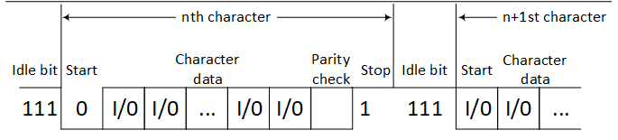

As shown above, it is worth noting that asynchronous communication is transmitted by character, and the receiving device receives the start signal correctly as long as it is synchronized with the transmitting device for the transmission time of one character. After the next character start bit arrives it needs to be synchronized and recalibrated again (relying on the detection of the start bit to achieve self-synchronization of the clocks of the sender and receiver).

## Communication principle

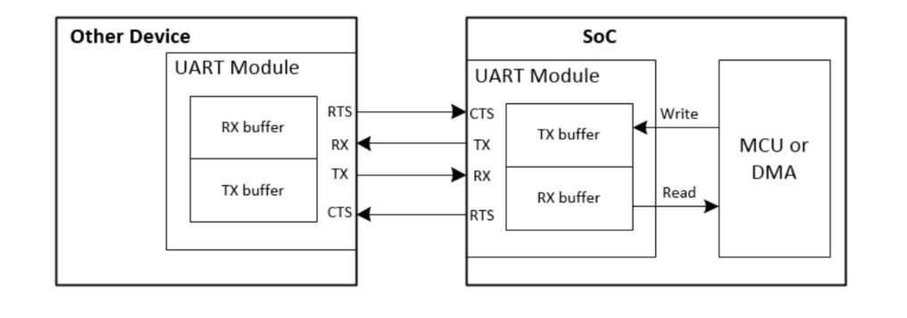

Take the UART module in Telink SoC as an example, the data to be sent is first written to the TX buffer by the MCU or DMA of the chip, and then the UART module sends the data in the TX buffer to other devices through the TX pin. In the receiving device, the data is first written to the RX buffer through the RX pin of the UART module, and then the data is read by the MCU or DMA of the receiving device.

If the chip's RX buffer is close to overflowing, the chip will send a signal (either configured high or low) to its connected device via its RTS pin, indicating that the device should stop sending data. Similarly, if the chip receives a signal via its CTS pin that the RX buffer of another device is close to overflowing, the chip should stop sending data.

## Function introduction

### Initialization

The caveats are as follows:

(1) Whenever you use UART port, it is better to call uart_reset() function to reset first, so that the effect of the previous operation of using UART can be avoided on this use. (for example, UART related register legacy setting)

    ```C
    uart_reset(uart_num_e uart_num)
    ```

(2) Use uart_set_pin() to set TX/RX pins in UART

    ```C
    uart_set_pin(uart_tx_pin_e tx_pin,uart_rx_pin_e rx_pin)
    ```

    **Wiring Note:** The TX/RX of the current device is connected to the TX/RX of other devices with the rule TX-RX, RX-TX.

(3) In DMA mode, pay attention to choose the DMA channels that are not occupied by other modules

(4) In NDMA mode, if using interrupts, the following configuration are needed:

    (a) uart_rx_irq_trig_level(): it is used to set the number of interrupt triggering level for receiving characters. If set to 1, it will enter interrupt once for receiving one character. (Recommended setting is 1)

    (b) uart_tx_irq_trig_level(): it is used to set the interrupt trigger level for sending characters. When the number of characters in the sending buffer reaches this level, it will enter the sending interrupt. A setting of 0 indicates that there is data in the buffer to send.

**Note:**

>- When NDMA mode is used to receive data using interrupts, it is recommended to set level=1 during initialization (more general) for the following reasons:
       (1) When receiving data in NDMA mode, you can manually set the receive data interrupt level during initialization, the level value can be 1-4. We set the level to 1 by default. If the level is set to 2, 3, 4, the length of the received data needs to meet certain conditions to complete the data reception normally. For example, if the level is set to 2, and the actual length of received data is a multiple of 2, the data can be received normally. But if the actual received data length is not a multiple of 2, such as 3, the first two data can be received normally, but the third data will be lost. (NDMA mode takes data from buffer according to the length of level, if the last time to obatin data, the length can not reach this level, the data will not be taken out). The situation of level setting as 3 and 4 is similar, it needs to receive data length of times of 3, 4, in order to complete the data reception normally.
       (2) When level is set to 1, it should be noted that: because the receive interrupt is triggered too frequently, if the receiving data is too fast (baud rate is too high), it may appear that the next data has arrived before the previous one is not fully received. If this situation occurs, it can be solved by appropriately reducing the baud rate.

### Baud rate

#### Function calls

Two functions are used to calculate the baud rate:

(1) uart_cal_div_and_bwpc() function will calculate the optimal clock division number div and bit width bwpc based on the input baud rate and system clock.

    ```C
    uart_cal_div_and_bwpc(unsigned int baudrate, unsigned int sysclk, unsigned short* div, unsigned char *bwpc)
    ```

(2) uart_init() passes the above calculated clock division div and bit width bwpc into the function to really set the baud rate, while the function also sets the UART port, the stop bit, parity bit, and so on.

    ```C
    uart_init(uart_num_e uart_num, unsigned short div, unsigned char bwpc, uart_parity_e parity, uart_stop_bit_e stop_bit)
    ```

There are some applications with high timing requirements, you can calculate the clock division number div and bit width bwpc first, and then call uart_init directly, which saves the execution time of uart_cal_div_and_bwpc function.

#### Tested data

We tested the effect of different baud rates on data transfer accuracy in DMA and NDMA modes, respectively.

Test data: 0x00, 0x11, 0x22 ...... 0xff, 16 data in total.

Test conditions: two B91 development board TX/RX interconnected, communication every one second (experiments show that the phenomenon of no time interval and with time interval consistent, here for more stable phenomenon, we use 1s time interval), clock settings of 16MHZ-PCLK, 16MHZ-HCLK, 16MHZ-CCLK.

Test chip: B91 80pin-EVK

Test program: UART-DEMO.

**NDMA mode:**

|Baud rate |Receive| Send |
|:---------|:--------|:-------|
|2000000 |  Fail | Fail |
|1500000 |  Pass | Pass |
|1000000 |  Pass | Pass |
|500000  |  Pass | Pass |
|256000  |  Pass | Pass |
|115200  |  Pass | Pass |
|57600   |  Pass | Pass |
|38400   |  Pass | Pass |
|19200   |  Pass | Pass |
|9600    |  Pass | Pass |
|4800    |  Pass | Pass |
|2400    |  Pass | Pass |
|1200    |  Pass | Pass |
|600     |  Pass | Pass |
|300     |  Pass | Pass |

**DMA mode:**

|Baud rate |Receive| Send |
|:---------|:--------|:-------|
|2000000 |  Pass | Pass |
|1500000 |  Pass | Pass |
|1000000 |  Pass | Pass |
|500000  |  Pass | Pass |
|256000  |  Pass | Pass |
|115200  |  Pass | Pass |
|57600   |  Pass | Pass |
|38400   |  Pass | Pass |
|19200   |  Pass | Pass |
|9600    |  Pass | Pass |
|4800    |  Pass | Pass |
|2400    |  Pass | Pass |
|1200    |  Pass | Pass |
|600     |  Pass | Pass |
|300     |  Pass | Pass |

From the test, it can be seen that from 300bps to 1.5Mbps baud rate, it can communicate normally in both NDMA and DMA mode. At 2Mbps baud rate, in DMA mode it can still communicate normally, but in NDMA mode it has shown an error (sent and received garbled data).

**Note:**

>- Further tests show that the DMA limit baud rate can reach 5Mbps at 16MHZ-PCLK.
>- When PCLK is raised to 24MHZ, HCLK and CCLK are raised to 48MHZ, NDMA mode limit baud rate can reach 5Mbps, DMA limit baud rate can reach 8Mbps, PCLK is the main influencing factor of UART baud rate limit.

### Interrupt

--------------------------------------------------------------------------------------------------------------------------------------------
Interrupt                   Generation condition                                                Automatic or manual clearing 
--------------------------- ------------------------------------------------------------------- --------------------------------------------
TX DMA TC 					Interrupts are generated every time a frame of data is received		It needs to be cleared manually.

UART_TXDONE 				Shared by NDMA and DMA. The default value is 1. It will be set to 	It needs to be cleared manually.
							0 when it starts to send data and will be automatically set to 1 
							by the hardware when the data transmission is finished.

UART_RXDONE (need to check 	This interrupt can only be used in DMA mode, the default value is 	It needs to be cleared manually.
the chip difference if it 	0, and will be set to 1 after receiving a packet of data.
can be used)

UART_RXBUF_ IRQ_STATUS		When the amount of data in the receiving BUFF buffer reaches the 	This flag bit is cleared automatically when 
							level set during initialization, an interrupt is generated.			the buffer data is read.

UART_TXBUF_ IRQ_STATUS		When the amount of data in the transmitting BUFF buffer reaches 	This flag bit is cleared automatically when 
							the level set during initialization, an interrupt is generated.		the buffer data is sent out.

UART_RX_ERR (need to check 	UART receive error flag. When the UART receives data with error    	This flag bit needs to be cleared manually.
the chip difference if it 	(such as parity error or stop bit error), an interrupt will be
can be used)				generated, and the data reception will be stopped after the
							interrupt.
--------------------------------------------------------------------------------------------------------------------------------------------

### DMA mode

#### Sending data

Using this function to send data, the function only triggers the send action, and does not actually send all data, you need to use a query or interrupt to determine whether it sent all data.

```C
unsigned char uart_send_dma(uart_num_e uart_num,unsigned char * addr,unsigned char len)
```

**Query**

```C
uart_send_dma(UART0, (unsigned char*)tx_byte_buff, 16);
while(uart_tx_is_busy(UART0));
```

You need to use uart_tx_is_busy interface to query the current status, if this flag bit is 0, it indicates that the last frame data transmission is finished and you can enter into the current frame data transmission.

**Interrupt**

To use the TX_DONE interrupt, you need to set the corresponding mask:

```C
uart_set_irq_mask(UART0, UART_TXDONE_MASK);
```

In addition to the normal use of interrupt-related function calls, the following matters need to be noted:

When initializing, the following function needs to be called (to set the TX_DONE signal to 0, otherwise it will keep going into interruptions):

```C
uart_clr_tx_done(UART0);
```

The interrupt handler function needs to be handled in the following manner:

```C
_attribute_ram_code_sec_noinline_ void uart0_irq_handler(void)
{
     if(uart_get_irq_status(UART0,UART_TXDONE))//judge the interrupt flag bit
     {
         .........
         uart_clr_tx_done(UART0); //set TX_DONE signal to 0
     }
 }
```

Flag bit: UART_TXDONE

When using the interrupt method, the UART_TXDONE interrupt is generated to indicate that the previous frame of data transmission is finished and can move to the next frame of data transmission.

**Note:**

>- When DMA mode uses interrupt method to send data, we need to use the status of UART_TXDONE. Since the initial default value of UART_TXDONE is 1, in order to generate interrupt normally, we use uart_clr_tx_done(UART0) function to set UART_TXDONE to 0 during initialization, so that when the sending is finished UART_TXDONE will be set to 1 automatically, then enter UART_TXDONE interrupt, then use uart_clr_tx_done(UART0) function to pull down UART_TXDONE again in the interrupt handler program.

#### Receiving data

When using DMA to receive data, the initialization has a packet reception end judgment rx_timeout.

```C
uart_set_dma_rx_timeout(uart_num_e uart_num, unsigned char bwpc, unsigned char bit_cnt, uart_timeout_mul_e mul)
```

Where bwpc and bit_cnt set the time used to transmit a byte, and the time required to transmit a byte is (bwpc+1)\*bit_cnt. We use mul to set the timeout time, which can be set to 0, 1, 2, or 3. The mul set to 0 means that if no data is received for more than 1 byte, the packet receiving is considered to be finished. The mul set to 1 means that if no data is received for more than 2 bytes, the packet receiving is considered to be finished.

There are two ways to receive data using DMA mode:

(1) RX_DONE interrupt

    Using RX_DONE interrupt to receive data is a more general way, this way allows us to receive packets of unknown length, but some chips do not support this way. Please check the chip difference chapter of UART if the chip supports this way.

(2) DMA interrupt

    If the chip does not support the RX_DONE interrupt, you can use the DMA interrupt to receive data. However, this method has a usage limitation and can only receive packets of known length.

**RX_DONE interrupt**

To use RX_DONE interrupt, you need to set the corresponding mask.

```C
uart_set_irq_mask(UART0, UART_RXDONE_MASK);
```

Flag bit: UART_RXDONE

When data is received using the interrupt method, the RX_DONE interrupt is generated to indicate that data has been received, and this flag bit needs to be cleared manually.

**Note:**

>- When using the DMA-RX_DONE interrupt, the interrupt handler function has the calculation of the received data length rec_data_len, so that we can clearly know the received data length when using the RX_DONE method to receive data.

**DMA interrupt**

With the interrupt flag bit DMA_TC_IRQ, this flag bit needs to be cleared manually when there is an interrupt request, indicating that data has been received.

```C
void uart_receive_dma(uart_num_e uart_num, unsigned char * addr,unsigned char rev_size)
```

**Note:**

>- The length of the data must be known in order to generate an interrupt. The parameter rev_size needs to meet a certain relationship with the actual length of the received data, len, so that no data will be missed and the interrupt will be generated accurately. (For example, if 4*(n-1)<len≤4*n, then rev_size needs to meet 4*(n-1)<rev_size≤4*n, where n is the same value). (For example: rev_size is set to 8, the received data length is 5/6/7/8 to generate an interrupt).

**Attentions:**

(1) The size of the rec_buff receiving array should be reserved for more areas. The reason is: DMA transfers data in a unit of 4byte, for example, the actual length of the received data is 5, rev_size can be set to 5 - 8, DMA will transfer data twice, although the second transfer only left one valid data, DMA will still transfer 4 data, the last three of which are useless data.

(2) The length len of the received data meets a certain relationship, for example, when 4*(n-1)<len≤4*n, the rec_buff size is set to greater than or equal to 4n. This way the first len data of the rec_buff is valid data, and the later ones are invalid data, which we need to distinguish accurately.

(3) When actually using DMA to receive data, it is better to set rec_buff=rev_size=4n when the received data length len is at 4*(n-1)<len≤4*n.

Example: rec_buff length is set to 8, rev_size is set to 8, and 4, 5, 6, 7, 8 data are sent to compare.

The program sets the DMA to receive mode and initializes rec_buff to all 0. Check the rec_buff value by BDT.

---------------------------------------------------------------------------------------------------------------------------------------------------------------------
Sending data                  Receiving data                                    Whether the interrupt is generated   Number of invalid data    DMA transferring times
----------------------------- ------------------------------------------------- ------------------------------------ ------------------------- -----------------------
0x11, 0x22, 0x33, 0x44        0x11, 0x22, 0x33, 0x44                            No                                   0                         1

0x11, 0x22, 0x33, 0x44,       0x11, 0x22, 0x33, 0x44, 0x55, 0xXX, 0xXX, 0xXX    Yes                                  3                         2
0x55

0x11, 0x22, 0x33, 0x44,       0x11, 0x22, 0x33, 0x44, 0x55, 0x66, 0xXX, 0xXX    Yes                                  2                         2
0x55, 0x66

0x11, 0x22, 0x33, 0x44,       0x11, 0x22, 0x33, 0x44, 0x55, 0x66, 0x77, 0xXX    Yes                                  1                         2
0x55, 0x66, 0x77

0x11, 0x22, 0x33, 0x44,       0x11, 0x22, 0x33, 0x44, 0x55, 0x66, 0x77, 0x88    Yes                                  0                         2
0x55, 0x66, 0x77, 0x88

--------------------------------------------------------------------------------------------------------------------------------------------------------------------

**Note:**

>- 0xXX means invalid data value, usually displayed as garbled code

### NDMA mode

#### Sending data

```C
void uart_send_byte(uart_num_e uart_num, unsigned char tx_data)
```

**Note:**

>- NDMA mode also provides us to send data as hword (2byte) and word (4byte). It should be noted that when sending data, the low byte data is sent first, then the high byte data is sent. For example, if a string of data is 0x11223344, if we want to receive data at the receiver end, the order of sending data in hword form is 0x2211, 0x4433, and in word form is 0x44332211.

**Query**

```C
uart_send_byte(UART0, uart0_tx_buff_byte[i]);
while(uart_tx_is_busy(UART0));
```

You need to use uart_tx_is_busy interface to query the current status, if this flag bit is 0, it indicates that the last frame data transmission is finished and you can enter into the current frame data transmission.

**Interrupt**

Flag bit: UART_TXBUF_IRQ_STATUS

In the initialization, the interrupt trigger number level of TX is set by uart_tx_irq_trig_level(), when the send buffer data reaches this level, the sending will start. At this time it will enter the sending interrupt.

**Note:**

>- The DEMO gives the TX interrupt trigger level as 0, that is, the buffer has data to send. At this time, if we use TX interrupt, the program will be in TX interrupt state all the time, which is not good for practical use. Therefore, the DEMO does not give the judgment and processing of TX interrupt, so that it is more in line with our actual use habits (send directly if there is a demand for sending), if you really need to judge the sending status, it is recommended to use the query method.

#### Receiving data

```C
unsigned char uart_read_byte(uart_num_e uart_num)
```

Flag bit: UART_RXBUF_IRQ_STATUS

In the initialization, the trigger number level of receiving interrupts is set. When the number of received characters reaches the level, the flag bit will be set to 1, and then the interrupt will be entered and the buffer data will be moved to our pre-defined receive array.

### Flow Control

Because of the difference in processing speed between the two sides of the UART, there is a large gap between the receiving rate and the sending rate when data is transmitted, so that the receiving end may not be able to receive the data in time during the process of sending and receiving. In order to prevent data loss, it is necessary for the sender to control, which is called flow control.

CTS (clear to send) allows sending

RTS (request to send) request to send

If UART0 is communicating with UART1, the RTS pin of UART0 is connected to the CTS pin of UART1, and the CTS pin of UART0 is connected to the RTS pin of UART1.

#### CTS

```C
uart_cts_config(uart_num_e uart_num,uart_cts_pin_e cts_pin,u8 cts_parity)
```

The uart_cts_config() function is used to configure the port number to use CTS flow control with the CTS pin. When the input level of CTS pin is equal to cts_parity, UART will stop transmitting.

#### RTS

```C
uart_rts_config(uart_num_e uart_num,uart_rts_pin_e rts_pin,u8 rts_parity,u8 auto_mode_en)
uart_rts_trig_level_auto_mode(uart_num_e uart_num,u8 level)
```

The uart_rts_config() function is used to configure the UART port number, RTS pin.

The rts_parity is valid only in auto mode, it indicates the jump direction of the RTS pin when the received data amount reaches the level value, the level jumps from low to high when it is 1, and from high to low when it is 0.

**Note:**

>- RTS has two modes to choose when configuring, UART_RTS_MODE_AUTO/UART_RTS_MODE_MANUAL which are Auto mode and Manual mode. In auto mode, the RTS pin automatically performs the RTS_INVERT related jumps when receiving RTS-THRESH data. In manual mode, we need to calculate the received data length, and when the data length reaches the expected value, we need to pull down or pull up the RTS pin manually using the uart_set_rts_level() function.

The uart_rts_trig_level_auto_mode() function is the RTS jump trigger setting, level indicates the trigger threshold, if set to 5, the RTS pin will be jumped upon receiving 5 data.

## DEMO introduction

You can choose to configure the UART working mode (DMA and NDMA) in the header UART_DEMO/app_config.h, as shown below, corresponding to the contents in app_dma.c and app.c respectively.

```C
#define UART_DMA      1 //uart use dma
#define UART_NDMA     2 //uart not use dma
#define UART_MODE     2
```

Among them, you can specifically select flow control mode in NDMA and DMA mode as follows

```C
#define BASE_TX      0 //just for NDMA
#define NORMAL       1
#define USE_CTS      2
#define USE_RTS      3
#define FLOW_CTR     1
```

### DMA Mode

The UART module keeps sending the received data via DMA, and the initial rec_buff[] is all 0.

Verification via serial port tool is as below:

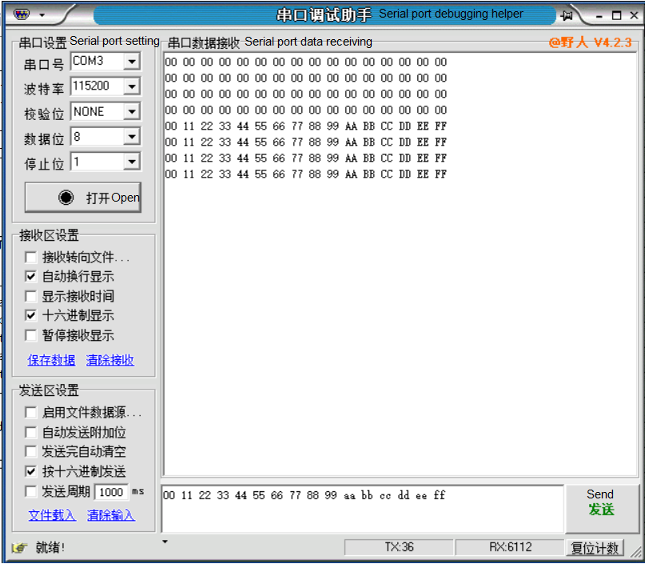

### NDMA Mode

When the number of received characters reaches the preset acceptance length (which is UART0_RX_IRQ_LEN), uart0_rx_flag will be 1, and then the interrupt service program will process the received characters and send them out.

Verification via serial port tool is as below:

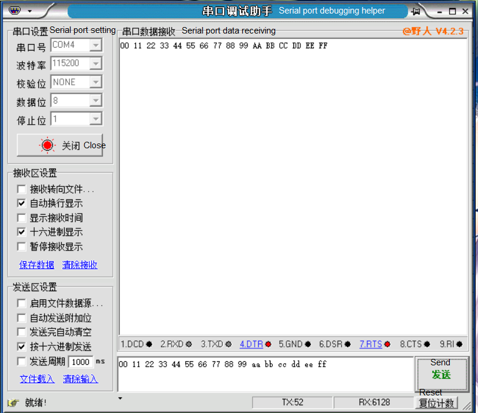

### RTS and CTS

Take NDMA as an example, due to hardware constraints, only a single demonstration of RTS or CTS is available.

CTS: Set STOP_VOLT=1, which means stop sending TX when in high level.

When the CTS pin is 0, continuous transmission, using the serial port tool to view:

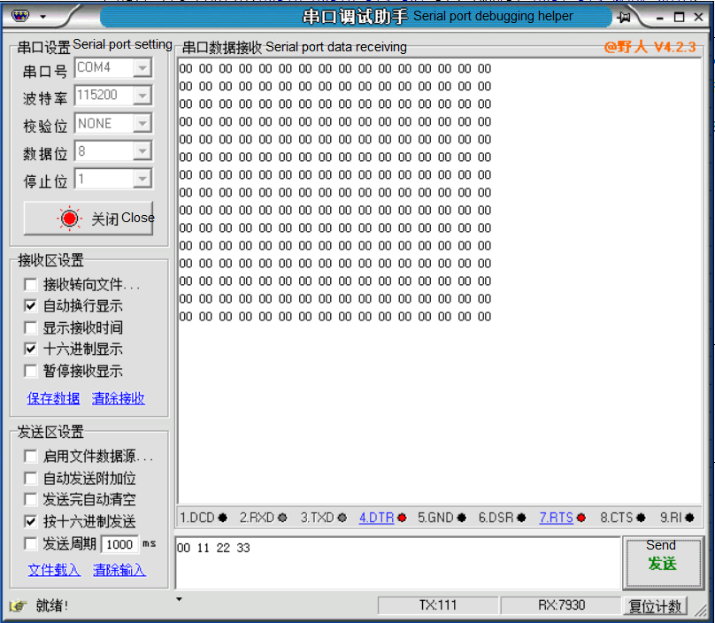

Set CTS high to stop transmitting.

RTS: In auto mode, set RTS_THRESH=5,RTS_INVERT=1, which means the RTS pin jumps from low to high when 5 data are received cumulatively.

To make the phenomenon more significant, the logic analyzer was used to view the jump results.

Use the serial port tool to send 4 data:

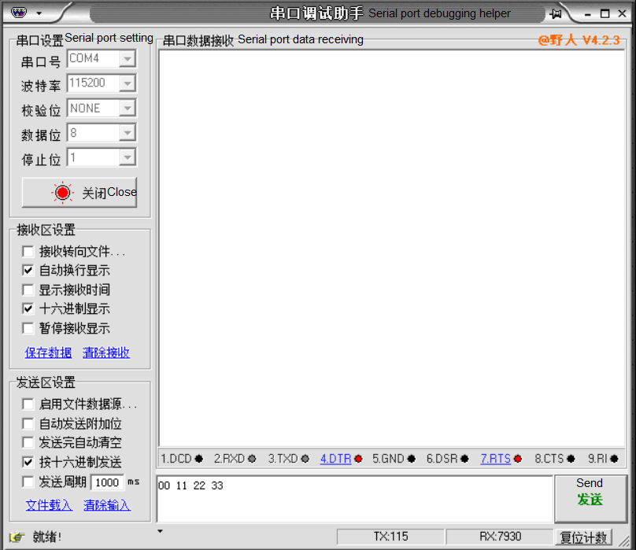

RTS jump did not occur.

Send 5 data:

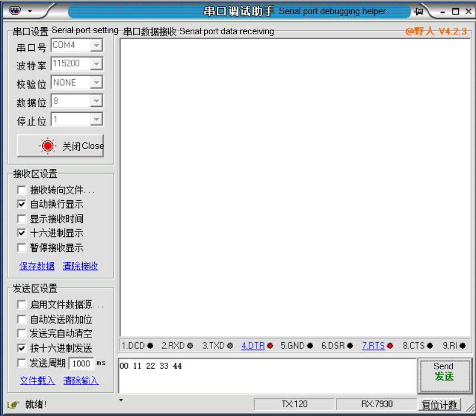

The RTS pin completes the jump from low to high.

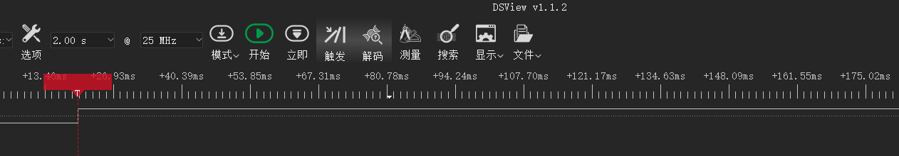

**Note:**

>- When actually using the flow control of UART, we need to pay attention to the reasonable configuration of CTS and RTS jumping method. For example, if the RTS pin of one device is set to jump from low to high when triggered, then the CTS pin of the other device connected to it needs to be set to high to stop transmitting. Thereafter, the UART flow control can work properly.

## Chip Differences

### UART_RXDONE interrupt

The use of this interrupt is supported in order to effectively determine the end of a packet (even if the length of the packet is unknown).

| Chip |DMA mode RX_DONE interrupt|
|------|--------------------------|
|B91 A0|     Not supported        |
|Other |     Supported            |

### UART_RX_ERR interrupt

**B91 A0 chip:**

(1) DMA mode: UART_RX_ERR interrupt is not available. (Reason: Hardware detects this interrupt and clears it automatically, software does not detect it.)

(2) NDMA mode: UART_RX_ERR interrupt can be used.

Recommended usage: clear interrupt status, clear RX-FIFO, zero in on hardware pointer and software pointer.

Reason: when receiving errors, there may be wrong data in the FIFO, in order not to affect the subsequent reception of correct data, the RX-FIFO needs to be cleared (that means the pointer is zeroed, uart_reset() makes the hardware pointer zeroed, while the software pointer is kept consistent also needs to be cleared).

Summarize: after the UART_RX_ERR interrupt is detected in this mode, the following actions need to be performed:

```C
uart_clr_irq_status (UART0,UART_CLR_RX); //NDMA mode will clear RX-FIFO and RX_ERR_IRQ, RX_BUFF_IRQ (Note: if it enters RX_ERR interrupt, it means there is an error in receiving data, clearing RX will clear RX_BUFF interrupt at the same time)
uart_reset()；//clear to zero on hardware pointer
uart_clr_rx_index();//clear to zero on the software pointer
```

**Other chip:**

(1) DMA mode: UART_RX_ERR interrupt can be used.

Recommended usage: clear interrupt status only.

Reason: DMA mode receiving data occurs error, when enter to RX_DONE interrupt, DMA will finish transferring data in RX-FIFO, FIFO pointer will be zeroed automatically, no need uart_reset(), the error data will not affect the subsequent reception of correct data. (Note: If UART_RX_ERR interrupt occurs, the data in the receive array will be the wrong data and cannot be used.)

Summarize: after the UART_RX_ERR interrupt is detected in this mode, the following actions need to be performed:

```C
uart_clr_irq_status(UART0,UART_CLR_RX); //In DMA mode it will clear RX_FIFO, RX_DONE_IRQ, and RX_ERR status
```

\newpage
# SPI

## Introduction

### Standard SPI interface

The Serial Peripheral Interface (SPI) is a synchronous serial peripheral interface that allows embedded processors to communicate and exchange data with various peripheral devices in a serial manner.

The standard SPI interface typically uses four lines of communication:

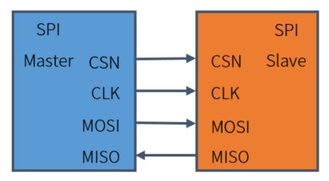

|Name|Meaning|
|:---------|-------------------------------------|
|CSN|Device chip select signal line, active low|
|CLK|Clock signal line|
|MOSI|Master data output and Slave data input line|
|MISO|Master data input and Slave data output line|

### SPI communication process

The following figure shows a simple example of SPI communication:

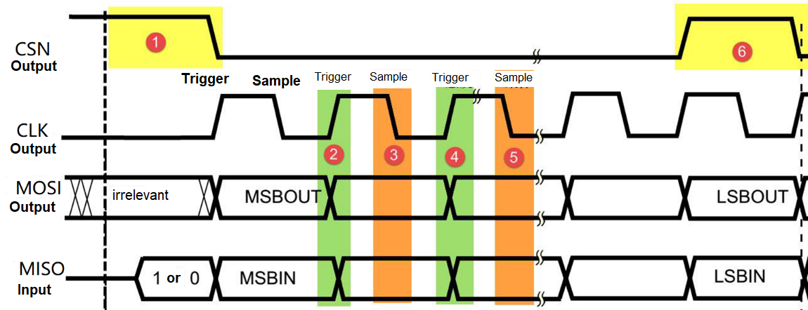

This is the communication timing of a standard SPI. The CSN, CLK, and MOSI signals are generated by the Master, and the data output is through the MOSI line, while the MISO signal is generated by the Slave, and the Master reads the data from the Slave through this signal line. The MOSI and MISO signals are only active when CSN is low. The sampling is triggered at the rising or falling edge of CLK. In each clock cycle of CLK, MOSI and MISO transfer 1bit data, and can achieve 1byte data transfer in 8 clock cycles.

According to the different CLK Clock Polarity (CPOL) at idle time and CLK Clock Phase (CPHA) at sampling time, SPI distinguishes four working modes as the following table, the host and slave need to work in the same mode to communicate properly.

|SPI working mode|CPOL|CPHA|
|:----------:|:-------:|:-------:|
|SPI_MODE0|0|0|
|SPI_MODE1|0|1|
|SPI_MODE2|1|0|
|SPI_MODE4|1|1|

CPOL: Clock Polarity

- When CPOL = 0, CLK is held low at idle time.
- When CPOL=1, CLK is held high at idle time.

CPHA: Clock Phase

- When CPHA = 0, sampling is triggered at the odd edge of CLK.
- When CPHA = 1, sampling is triggered at the even edge of CLK.

### Diversified SPI interface

On the basis of the standard SPI, many types of SPI interfaces have gradually been derived to suit different application scenarios.

3line SPI: 3line SPI implies only 3 lines as the name, CLK, CSN, and MOSI. The data sending and receiving share a common line, which is half-duplex communication.

Dual SPI: it extends the usage of MOSI and MISO by making them work in half-duplex and transferring data in the same direction to double the data transfer. That is, for Dual SPI, MOSI becomes IO0 and MISO becomes IO1, so that 2 bits of data can be transferred in one clock cycle, doubling the data transfer.

Quad SPI: similar to Dual SPI, it extends the usage of WP and HOLD, WP becomes IO2 and HOLD becomes IO3. Which means, it has four data lines at the same time and can transfer 4 bits in one clock cycle, the transfer speed is significantly increased.

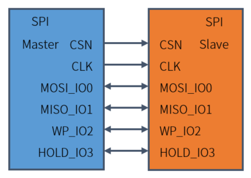

## Function description

The SOC contains a variety of SPI modules, including HSPI, SPI and SPI Slave, each with appropriate driver support.

### Interface description

The interface naming rule is as follows.

- spi as prefix: an interface that can be used by both hspi and pspi.
- pspi as prefix: for pspi use only.
- hspi as prefix: for hspi use only.
- dma as suffix: the interface that will be used by dma mode.
- plus as suffix: support richer read/write modes and operation commands.

For example, the spi_master_write_read_dma_plus interface will use the DMA channel when in use, first writing the address to the SPI Slave and then reading the data from the corresponding address of the SPI Slave.

**Note:**

>- The function of the interfaces with the "read" or "write_read" segment is to read data from the SPI Slave.
>- The difference between the above two is as below:
        (1) The interface with the "read" segment supports hardware auto-sending address frames for applications that enable hardware address frame, and the interface can directly read data from the corresponding address.
        (2) The interface with the "write_read" segment is used without enabling the hardware address frame. The address information is first written to the SPI Slave by "write" and then the data at the corresponding address can be read.

### HSPI and PSPI

HSPI and PSPI are two advanced SPI interfaces supported by the SoC, both supporting Master and Slave modes. HSPI/PSPI Slave both automatically parse cmd and require software operation for data receiving and sending.

**Note:**

>- In the example, the HSPI/PSPI Slave receives and sends data through software, which has the advantage of being more flexible in configuration and supporting Quad I/O mode, but has the disadvantage of not being as easy to configure as using the SPI Slave module directly and consuming computing resources. If you need to simply configure the device as a Slave, it is recommended to use the SPI Slave module.

#### Master

**Standard SPI Master**

The HSPI/PSPI module of the SoC supports the standard SPI Master mode, in which the function interface is called without the "plus" suffix and the functions and modes are relatively simple.

Initialize the interface as follows:

```C
spi_master_config(SPI_MODULE_SEL, SPI_NOMAL);
```

The supported interfaces for read and write operations are:

```C
void spi_master_write(spi_sel_e spi_sel, u8 *data, u32 len);
void spi_master_write_dma(spi_sel_e spi_sel, u8 * data, u32 len);
void spi_master_write_read(spi_sel_e spi_sel, u8 * addr , u32 addr_len, u8 * data , u32 data_len);
void spi_master_write_read_dma(spi_sel_e spi_sel, u8 *addr, u32 addr_len, u8 *data, u32 data_len);
```

**HSPI/PSPI Master**

Function description:

The SoC's HSPI/PSPI Master has additional hardware configurations for several frame information in common protocols, including cmd frame, address frame, and dummy frame (null cycle).

In the table below, among the features supported by HSPI/PSPI Master, Y stands for supported and N stands for not supported.

----------------------------------------------------------------------------------
 SPI Module   cmd_en   cmd_fmt   address_en   address_fmt   3line    Dual    Quad
------------ -------- --------- ------------ ------------- -------- ------- ------
   HSPI         Y        Y         Y            Y             Y        Y       Y

   PSPI         Y        N         N            N             Y        Y       N

----------------------------------------------------------------------------------

- cmd_en: hardware cmd frame
- cmd_fmt: cmd frame follows the encoding format corresponding to Dual/Quad I/O
- address_en: hardware address frame
- address_fmt: cmd frame follows the encoding format corresponding to Dual/Quad I/O
- 3line: 3line SPI mode
- Dual: Dual SPI mode
- Quad: Quad SPI mode

Data frame format:

HSPI/PSPI Master supports sending data in the following format: [cmd] + [adress] + [dummy] + data. [] stands for optional.

Step 1 The data frame format supported by the HSPI is configured by calling the following structure interface, and the PSPI is similar:

```C
hspi_config_st hspi_slave_protocol_config = {
    .hspi_io_mode = HSPI_QUAD,
    .hspi_ dummy _cnt = 6,
    .hspi_ cmd _en = 1,
    .hspi_addr_en = 1 ,
    .hspi_addr_len = 3,//when hspi_addr_en = false,invalid set.
    .hspi_cmd_fmt_en = 0,//when hspi_cmd_en = false,invalid set.
    .hspi_addr_fmt_en = 1 ,//when hspi_addr_en = false,invalid set.
};
```

This code configures the various frame parameters of the HSPI Master:

- Module is configured as Quad I/O mode
- dummy frame length is 6 clocks.
- Hardware cmd is enabled, cmd transmission is in Single I/O mode, not following the encoding format corresponding to Dual/Quad I/O (hspi_cmd_fmt_en = 0).
- Hardware address is enabled, with the address frame length of 3 Bytes, following the encoding format corresponding to Dual/Quad I/O (hspi_addr_fmt_en = 1).

The corresponding communication timing diagram is as follows:

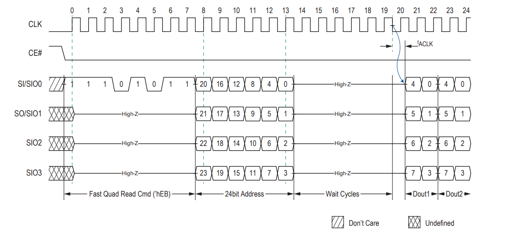

Call the following interface to enable the configuration of the frame parameters:

```C
hspi_master_config_plus(&hspi_slave_protocol_config);
```

Interface for read/write operation calls:

The interface for HSPI/PSPI Master read/write operation calls is as follows:

```C
void spi_master_write_plus(spi_sel_e spi_sel, u8 cmd, u32 addr, u8 *data, u32 data_len, spi_wr_tans_mode_e wr_mode); 
void spi_master_write_dma_plus(spi_sel_e spi_sel, u8 cmd, u32 addr, u8 *data, u32 data_len, spi_wr_tans_mode_e wr_mode);

void spi_master_read_plus(spi_sel_e spi_sel, u8 cmd, u32 addr, u8 *data, u32 data_len, spi_rd_tans_mode_e rd_mode);
void spi_master_read_dma_plus(spi_sel_e spi_sel, u8 cmd, u32 addr, u8 *dst_addr, u32 data_len, spi_rd_tans_mode_e rd_mode);

void spi_master_write_read_plus(spi_sel_e spi_sel, u8 cmd, u8 *addrs, u32 addr_len, u8 *data, u32 data_len, spi_rd_tans_mode_e wr_ mode);
void spi_master_write_read_dma_plus(spi_sel_e spi_sel, u8 cmd, u8 *addr, u32 addr_len, u8 *rd_data, u32 rd_len, spi_rd_tans_mode_e rd_mode);
```

Read and write method:

The HSPI/PSPI Master operates the SPI Slave through the operation commands and also needs to configure the HSPI/PSPI read/write method to match the operation process. The read/write method is used to indicate whether the operation requires a dummy (empty cycle) frame and whether the command operation is a read or a write.

The enumeration for the read-write method is defined as follows:

```C
typedef enum{
    SPI_MODE_WR_WRITE_ONLY = 1,//write
    SPI_MODE_WR_DUMMY_WRITE = 8,//dummy_write
}spi_wr_tans_mode_e;

typedef enum{
    SPI_MODE_RD_READ_ONLY = 2,//must enbale CmdEn
    SPI_MODE_RD_DUMMY_READ = 9,//dummy_read
}spi_rd_tans_mode_e;

typedef enum{
    SPI_MODE_WR_RD       = 3,//must enbale CmdEn
    SPI_MODE_WR_DUMMY_RD = 5,//write_dummy_read
}spi_wr_rd_tans_mode_e; .
```

For example, when reading data, SPI Slave requires to have dummy idle frame, and SPI_MODE_RD_DUMMY_READ method should be selected for reading data.

#### Slave

The SoC's HSPI supports Single, Dual, and Quad I/O modes when used as a Slave. The PSPI supports Single and Dual I/O modes when used as a Slave. Both of them automatically parse cmd, but Slave data receiving and sending requires software operation.

**Communication data frame format**

The communication data frame formats supported by HSPI/PSPI Slave are listed in the table below.

(1) HSPI/PSPI SINGLE WRITE

|MOSI_IO0|cmd (write 8bit)|dummy (8clock)|data0|...|
|---|:---:|:---:|:---:|:---:|
|MISO_IO1|-|-|-|-|

(2) HSPI/PSPI SINGLE READ

|MOSI_IO0|cmd (read 8bit)|dummy (8clock)|-|...|
|---|:---:|:---:|:---:|:---:|
|MISO_IO1|-|-|data0|-|

(3) HSPI/PSPI DUAL WRITE

|MOSI_IO0|cmd (write 8bit)|dummy (8clock)|D6|D4|D2|D0|...|
|---|:---:|:---:|---|---|---|---|:---:|
|MISO_IO1|-|-|D7|D5|D3|D1|...|

(4) HSPI/PSPI DUAL READ

|MOSI_IO0|cmd (read 8bit)|dummy (8clock)|D6|D4|D2|D0|...|
|---|:---:|:---:|---|---|---|---|:---:|
|MISO_IO1|-|-|D7|D5|D3|D1|...|

(5) HSPI/PSPI QUAD WRITE

|MOSI_IO0|cmd (write 8bit)|dummy (8clock)|D4|D0|...|
|---|:---:|:---:|---|---|:---:|
|MISO_IO1|-|-|D5|D1|...|
|WP_IO2|-|-|D6|D2|...|
|HOLD_IO3|-|-|D7|D3|...|

(6) HSPI/PSPI QUAD READ

|MOSI_IO0|cmd (read 8bit)|dummy (8clock)|D4|D0|...|
|---|:---:|:---:|---|---|:---:|
|MISO_IO1|-|-|D5|D1|...|
|WP_IO2|-|-|D6|D2|...|
|HOLD_IO3|-|-|D7|D3|...|

**Operation commands supported by HSPI/PSPI Slave**

The operation commands supported by HSPI/PSPI Slave are represented by enumeration definitions in the demo, which correspond to the cmd parameters of the read/write function interface when used.

```C
enum{
    SPI_READ_STATUS_SINGLE_CMD = 0x05,
    SPI_READ_STATUS_DUAL_CMD = 0x15,
    HSPI_READ_STATUS_QUAD_CMD = 0x25,
    SPI_READ_DATA_SINGLE_CMD = 0x0B,
    SPI_READ_DATA_DUAL_CMD = 0x0C,
    HSPI_READ_DATA_QUAD_CMD = 0x0E,
    SPI_WRITE_DATA_SINGLE_CMD = 0x51,
    SPI_WRITE_DATA_DUAL_CMD = 0x52,
    HSPI_WRITE_DATA_QUAD_CMD = 0x54,
};
```

**Note:**

>- The operation commands are related to the HSPI or PSPI mode. The SPI prefix indicates that commands are common for HSPI and PSPI, the HSPI prefix indicates that only HSPI can be used, DUAL_CMD corresponds to Dual SPI mode, and QUAD_CMD corresponds to Quad SPI mode.

#### Clock settings

In the SoC, the clock source for the HSPI is hclk and the clock source for the PSPI is pclk.

**Master clock**

The clock calculation formula in Master mode is:

$$F_{Master} = \frac {F_{hclk\&pclk}}{(spi\_clk\_div +1)*2}$$

Where spi_clk_div is the frequency dividing coefficient.

$F_{Master}$ is the CLK frequency of the Master output.

$F_{hclk\&pclk}$ is the frequency of the clock source, where the clock source of HSPI is hclk and PSPI is pclk.

The clock frequency configuration interface of the Master is a macro definition:

```C
#define SPI_CLK   500000
```

The enable interface for clock configuration is:

```C
spi_master_init(SPI_MODULE_SEL, sys_clk.pclk * 1000000 / (2 * SPI_CLK) - 1, SPI_MODE0);
```

For actual use, simply modify the SPI_CLK macro definition to the corresponding clock frequency.

**Note:**

>- When the frequency dividing coefficient is 0xff, the Master output clock frequency can reach the maximum frequency of the source clock.
>- The configuration range of SPI_CLK is described in the demo, which can be referred to when configuring, and exceeding the configuration range may cause communication failure.

**Slave clock**

The clock of the Slave is input by the Master, and the Slave does not need to configure the corresponding clock. However, the clock input by the Master to the Slave needs to satisfy the following conditions:

$$F_{Master} \le \frac {F_{hclk\&pclk}}{3}$$

where $F_{Master}$ is the CLK frequency that the SPI Master inputs to the Slave.

$F_{hclk\&pclk}$ is the Slave device's own internal clock source frequency, PSPI Slave corresponds to pclk frequency, HSPI Slave corresponds to hclk frequency.

#### Interrupt

The SoC supports a variety of SPI interrupt types, which can be flexibly configured according to the application scenario when used. The characteristics of each interrupt type are listed in the following table:

------------------------------------------------------------------------------------------------------------------------------------------------------------------
Mode                Related interrupts                              Whether abnormal     Whether manually clear     Generated by Master
                                                                        interrupt        the interrupt flag bit           or Slave
------------------- --------------------------------------------- -------------------- -------------------------- -----------------------
Non-DMA             SPI_RXF_OR_INT: RX FIFO over run interrupt.   Y                    Y                          Slave
                    When receiving data, the program does not
                    read the data fast enough and the RX FIFO
                    will be overwritten with new data, this
                    loss of data is called over run.

Non-DMA             SPI_TXF_UR_INT: TX FIFO under run interrupt.  Y                    Y                          Slave
                    When sending data, the speed at which the
                    program writes data to the TX FIFO cannot
                    keep up with the speed of sending, and
                    there is an interruption in sending data,
                    which is called under run.

Non-DMA             SPI_RXF_INT: RX FIFO threshold (threshold     N                    Y                          Master and Slave
                    value) interrupt. With this interrupt
                    enabled, this interrupt is triggered when
                    the RX FIFO data reaches or exceeds the
                    threshold value.

Non-DMA             SPI_TXF_INT: TX FIFO threshold (threshold     N                    Y                          Master and Slave
                    value) interrupt. With this interrupt
                    enabled, this interrupt is triggered when
                    the TX FIFO data less than or reaches the
                    threshold value.

DMA, not            SPI_END_INT: Data transfer end interrupt,     N                    Y                          Master and Slave
 common             a data transfer completion will trigger
 with               this interrupt.
 DMA

DMA, not            SPI_SLV_CMD_INT: When it is configured to     N                    Y                          Slave
common              Slave mode, this interrupt will be
 with               triggered for every 1Byte command
 DMA                received.
------------------------------------------------------------------------------------------------------------------------------------------------------------------

#### DMA mode

Use macro definition to select DMA channels with the following relevant interfaces:

```C
#define TX_DMA_CHN DMA2
#define RX_DMA_CHN DMA3
hspi_set_tx_dma_config(TX_DMA_CHN);
hspi_set_rx_dma_config(RX_DMA_CHN);
```

The example here configures DMA2 for tx channel, configures DMA3 for rx channel. The PSPI is similar, details can be viewed in the demo.

The relevant interfaces used to determine whether data has been sent and received in DMA mode are as follows:

**Enquiry:**

```C
static inline _Bool spi_is_busy(spi_sel_e spi_sel)
```

**Interrupt mode:**

```C
spi_set_irq_mask(SPI_MODULE_SEL, SPI_END_INT_EN);//endint_en
```

**Note:**

>- SPI_END_INT interrupt does not represent the end of data transfer (it just means the end of fifo data transfer, CSN is not pulled up). After generating SPI_END_INT interrupt, query the busy signal, until IDLE represents the end.
>- When using DMA for data transmission, the structure or array that defines the send (receive) is quadruple aligned, as reflected in the demo by \_\_attribute\_\_((aligned(4))).
>- When using DMA to receive SPI data into Buffer, the Buffer size of the corresponding destination address must be a multiple of 4. The reason is: Each DMA sends 4 Bytes to Buffer. 4 Bytes will be written to the destination address even if the configured read length is less than 4. For example, if you define an array Buffer of size 5Byte and configure the DMA to read 5Byte from SPI to Buffer, at this time the DMA actually transfers twice and 8Byte in total to Buffer, and the extra 3Byte data will overflow from the array, and in severe cases the overflowed data will overwrite other variables. In this case, if the array size is configured to 8 Bytes, the extra 3 Bytes will be stored in the array and will not overflow, avoiding the potential risk.

#### 3Line

HSPI/PSPI Master/Slave supports 3line mode, which needs to be enabled in Slave.

The interface to be called is:

```C
void spi_set_3line_mode(spi_sel_e spi_sel)
```

**Note:**

>- The 3line mode read/write commands are compatible with SINGLE_CMD of HSPI/PSPI.

#### Multi-SPI Slave architecture

For multi-SPI Slave application scenarios, a CSN pin can be assigned to each Slave. When a data transfer is completed, the CSN will be pulled high. At this time, you can switch CSN to achieve the effect of switching Slave.

The HSPI Master calls the interface as follows:

```C
void hspi_cs_pin_dis(hspi_csn_pin_def_e pin)
void hspi_cs_pin_en(hspi_csn_pin_def_e pin)
```

The PSPI Master calling the interface is similar and can be viewed in the code of the interface.

#### XIP mode

XIP: eXecute In Place, which means that applications can be command obtained, decoded, and executed directly in the external storage device. The HSPI supports XIP mode, which allows the address space of the SoC to be extended to the external storage device through the HSPI interface, providing a hardware foundation for running applications with large amounts of data.

**Configure XIP mode**

The XIP mode is configured via the following interface.

```C
hspi_xip_seq_mode_en();//must
hspi_xip_page_size(4);
hspi_xip_en();
```

The seq_mode(sequential mode) in the code indicates an interval sending and receiving mode, which means that the data is divided into blocks of $2^{page\_size}$ bytes, and the CS will be pulled up once after each block is transferred, until all the data is completely transferred.

**Sending command**

Send commands through the following interface:

```C
void hspi_master_write_xip_cmd_data(u8 cmd, u32 addr_offset, u8 data_in, spi_wr_tans_mode_e wr_mode)
```

**Data reading and writing**

The read/write data calling interface is as follows:

```C
void hspi_master_write_xip(u8 cmd, u32 addr_offset, u8 *data, u32 data_len, spi_wr_tans_mode_e wr_mode) 
void hspi_master_read_xip(u8 cmd, u32 addr_offset, u8 *data, u32 data_len, spi_rd_tans_mode_e rd_mode)
```

**XIP on-chip running program**

To run the program in XIP mode, you need to switch the PC pointer to the address corresponding to the program in the XIP device before running it. Here the base address of XIP is 0x1000000, switch the PC pointer to the corresponding address of XIP device (base address 0x1000000+relative address 0x00) by the following two commands, and then you can run the program in XIP mode.

```C
__asm__("li t0,0x1000000");
__asm__("jarr t0");
```

### SPI Slave

As the name implies, SPI Slave only supports Slave mode. In the program you only needs to configure the corresponding GPIO of SPI Slave as SPI function. The hardware will automatically parse the received SPI data (read/write the value of the corresponding address) and do the corresponding response. In addition, SPI Slave also supports Dual I/O mode.

#### Communication data frame format

The communication data formats supported by the SPI Slave module are listed in the table below.

（1）SPI SLAVE SINGLE WRITE

|MOSI_IO0|cmd (write 8bit)|addr(32bit) high -> low|data0|data1|...|
|:---:|:---:|:---:|:---:|:---:|:---:|
|MISO_IO1|-|-|-|-|-|

（2）SPI SLAVE SINGLE READ

|MOSI_IO0|cmd (read 8bit)|addr(32bit) high -> low|dummy (8cycle)|-|-|
|:---:|:---:|:---:|:---:|:---:|:---:|
|MISO_IO1|-|-|-|data0|-|

（3）SPI SLAVE DUAL WRITE

|MOSI_IO0|cmd (write 8bit)|addr(32bit) high -> low|D6|D4|D2|D0|...|
|:---:|:---:|:---:|:---:|:---:|:---:|:---:|:---:|
|MISO_IO1|-|-|D7|D5|D3|D1|...|

（4）SPI SLAVE DUAL READ

|MOSI_IO0|cmd (read 8bit)|addr(32bit) high -> low|dummy (8cycle)|D6|D4|D2|D0|...|
|:---:|:---:|:---:|:---:|:---:|:---:|:---:|:---:|:---:|
|MISO_IO1|-|-|-|D7|D5|D3|D1|...|

**Note:**

>- "addr(32bit) high -> low" indicates that the high byte comes first in the address order.

#### Operation commands supported by SPI Slave

The operation commands supported by SPI Slave are represented by enumeration definitions in the demo, which correspond to the cmd parameters of the read/write function interface when used.

```C
typedef enum{
    SPI_SLAVE_WRITE_DATA_CMD = 0x00,
    SPI_SLAVE_WRITE_DATA_DUAL_CMD,
    SPI_SLAVE_WRITE_ADDR_DUAL_CMD,
    SPI_SLAVE_WRITE_DATA_DUAL_4CYC_CMD,
    SPI_SLAVE_WRITE_ADDR_DUAL_4CYC_CMD,
    SPI_SLAVE_WRITE_DATA_AND_ADDR_DUL_4CYC_CMD,
}spi_slave_write_cmd_e;

typedef enum{
    SPI_SLAVE_READ_DATA_CMD,
    SPI_SLAVE_READ_DATA_DUAL_CMD,
    SPI_SLAVE_READ_ADDR_DUAL_CMD,
    SPI_SLAVE_READ_DATA_DUAL_4CYC_CMD,
    SPI_SLAVE_READ_ADDR_DUAL_4CYC_CMD,
    SPI_SLAVE_READ_DATA_AND_ADDR_DUL_4CYC_CMD,
}spi_slave_read_cmd_e;
```

**Note:**

>- The operation command and the SPI mode are related, DUAL_CMD corresponds to Dual SPI mode, 4CYC_CMD corresponds to dummy 4cycle mode. These commands are or to each other when called. For example, if both address and data support Dual I/O encoding, then the read command format is: SPI_SLAVE__DATA_DUAL_CMD | SPI_SLAVE_READ_ADDR_DUAL_CMD.

## Demo description

### Demo structure description

The application .c files of SPI Demo are app.c, app_dma.c and app_hspi_xip.c, which correspond to DMA, NDMA (non-DMA), and XIP transfer modes, respectively.

Select which transfer mode to use using the macro SPI_MODE in SPI_Demo/app_config. h.

```C
#define SPI_NDMA_MODE   1
#define SPI_DMA_MODE    2
#define SPI_XIP_MODE    3
#define SPI_MODE        SPI_NDMA_MODE
```

In DMA and NDMA transfer modes, the SPI_DEVICE macro in each mode is configured to select Master and Slave modes.

```C
#define SPI_MASTER_DEVICE     1
#define SPI_SLAVE_DEVICE      2
#define SPI_DEVICE            SPI_MASTER_DEVICE
```

Using HSPI or PSPI module is selected via the macro SPI_MODULE_SEL.

```C
#define PSPI_MODULE         0
#define HSPI_MODULE         1
#define SPI_MODULE_SEL      HSPI_MODULE
```

In DMA and NDMA transfer modes, the communication protocols are divided into three categories according to the Slave device, which are selected by the macro SPI_TRANS_MODE.

```C
#define KITE_VULTURE_SLAVE_PROTOCOL      1
#define HSPI_PSPI_SLAVE_PROTOCOL         2
#define SPI_SLAVE_PROTOCOL               3
#define SPI_TRANS_MODE                   SPI_SLAVE_PROTOCOL
```

KITE_VULTURE_SLAVE_PROTOCOL: is a mode designed for use scenarios such as Telink Kite (TLSR825x) or Vulture (TLSR827x) as Slave.

HSPI_PSPI_SLAVE_PROTOCOL: is the mode designed for the use scenario of SoC's HSPI/PSPI as Slave.

SPI_SLAVE_PROTOCOL: it is a mode designed for the use scenario of SPI SLAVE of SoC as Slave.

**Note:**

>- When testing SPI communication of two boards, after burning the code of both the Master end and Slave end to the board, power up the Slave end first and then the Master, and there needs to be a stable common ground between the two boards.

### Hardware connection

The wiring method will be different for different SPI_TRANS_MODE in the Demo.

The hardware connection for KITE_VULTURE_SLAVE_PROTOCOL is as follows:

|HSPI/PSPI Master (SoC)|Slave (Kite/Vulture)|
|--------|:---------|
|CLK|CLK|
|CSN|CSN|
|MOSI_IO0|SDI|
|MISO_IO1|SDO|

The hardware connection for HSPI_PSPI_SLAVE_PROTOCOL is as follows.

|HSPI/PSPI Master (SoC)|HSPI/PSPI Slave (SoC)|
|--------|--------|
|CLK|CLK|
|CSN|CSN|
|MOSI_IO0|MOSI_IO0|
|MISO_IO1|MISO_IO1|
|WP_IO2(HSPI only)|WP_IO2(HSPI only)|
|HOLD_IO3(HSPI only)|HOLD_IO3(HSPI only)|

The hardware connection for SPI_SLAVE_PROTOCOL is as follows.

|HSPI/PSPI Master (SoC)|SPI Slave (SoC)|
|--------|--------|
|CLK|CLK|
|CSN|CSN|
|MOSI_IO0|MOSI_IO0|
|MISO_IO1|MISO_IO1|

### Initial configuration of HSPI/PSPI Master/Slave

The initialization flow of HSPI/PSPI Master/Slave is shown in the following diagram:

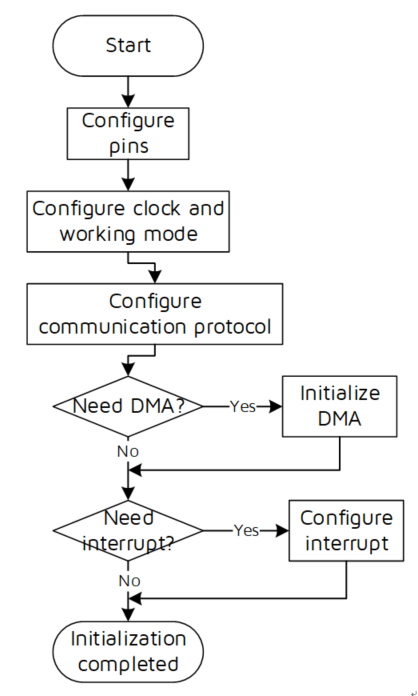

### HSPI/PSPI Master read/write operations

The read/write operation flow of HSPI/PSPI Master is shown in the following diagram:

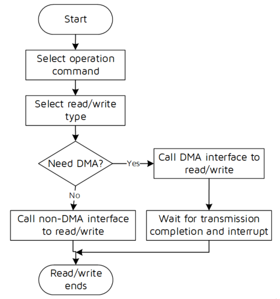

#### Test example

The Demo configures HSPI in SPI_SLAVE_PROTOCOL mode as Dual SPI, HSPI Master writes 16Bytes data to SPI Slave using DMA via Dual I/O write command SPI_SLAVE_WRITE_DATA_DUAL_CMD | SPI_ SLAVE_WRITE_ADDR_DUAL_CMD, and then reads it out using DMA via Dual I/O read command SPI_READ_DATA_DUAL_CMD | SPI_READ_ADDR_DUAL_CMD. The test is successful and the logic analyzer waveform is as follows:

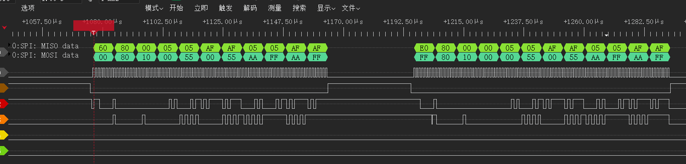

### SPI_XIP_MODE mode

The XIP Device for Demo is a PSRAM model APS1604M-3SQR, which supports both traditional SPI and QUAD SPI modes.

#### Communication format

The communication format of PSRAM in Demo is enabled by macro definition, and the macro definition and meaning are as follows:

```C
#define SPI_XIP_SERIAL_CMD_READ                1
#define SPI_XIP_SINGLE_CMD_FAST_READ           2
#define SPI_XIP_SINGLE_CMD_FAST_QUAD_READ      3
#define SPI_XIP_QUAD_CMD_FAST_READ             4
#define SPI_XIP_QUAD_CMD_FAST_QUAD_READ        5
#define SPI_XIP_LOAD_PROGRAM_TO_PSRAM          6

#define SPI_XIP_TEST_MODE        SPI_XIP_SERIAL_CMD_READ
```

SPI_XIP_SERIAL_CMD_READ: Single-line command data read/write mode.

SPI_XIP_SINGLE_CMD_FAST_READ: Upgrade mode for single-line command data read/write, supporting higher CLK.

SPI_XIP_SINGLE_CMD_FAST_QUAD_READ: Single-line command four-line data read/write mode.

SPI_XIP_QUAD_CMD_FAST_READ: Four-line command four-line data read/write mode.

SPI_XIP_QUAD_CMD_FAST_QUAD_READ: Upgrade mode for four-line command four-line data read/write, supporting higher CLK.

SPI_XIP_LOAD_PROGRAM_TO_PSRAM: The mode of running the program inside the chip.

**Note:**

>- The APS1604M-3SQR supports a variety of communication formats, from single-line cmd frame to four-line cmd frame, and the number of dummies varies with the mode difference, all of which are reflected in the demo. Here only represents the meaning of the interfaces called, if users want to know more about the application, they can refer to the demo and the related PSRAM manual when developing.

#### Configure XIP mode

The APS1604M-3SQR hardware requires that the single data transfer time should not exceed 8us (some versions are 4us, check the product manual for details), otherwise there will be a risk of error, therefore the seq_mode should be enabled when configuring XIP mode to. The page_size is set to 1 in the figure below, and 8 bytes data (0x00, 0x11, 0x22, 0x33, 0x44, 0x55, 0x77) are written on the PSRAM base address 0x000000, the data is divided into 4 blocks and sent each time $2^{page\_size}$ = 2bytes, sent in four times to complete. The time interval between adjacent CSN pull-ups is less than 8us.

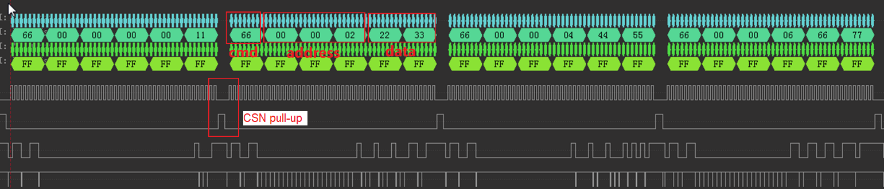

**Note:**

>- Because of the 8us interval required by the APS1604M-3SQR, the CLK frequency has to be increased to reduce the time consumed by each transfer of $2^{page\_size}$ Bytes of data to meet the 8us requirement, so the SPI_CLK of the HSPI in XIP mode is higher than the general SPI application. When the SPI_CLK cannot be adjusted to meet the 8us requirement, the size of page_size can be configured to reduce the number of bytes per transfer and increase the number of transfers to meet the time requirement.

#### Test example

The Demo configures HSPI to QUAD XIP mode, writes the LED blinking program in the array led_program_in _sram to PSRAM address 0x00 via HSPI XIP, and then jumps to the corresponding address in PSRAM to execute the program.

The test found that LED2 blinks at intervals, proving that the PSRAM on-chip running program is successful.

Read the program in PSRAM to the array led_program_in_psram, read the array led_program_in_psram and led_program_in_sram by BDT tool to compare, the two sets of data are exactly the same, which proves the success of reading and writing PSRAM.

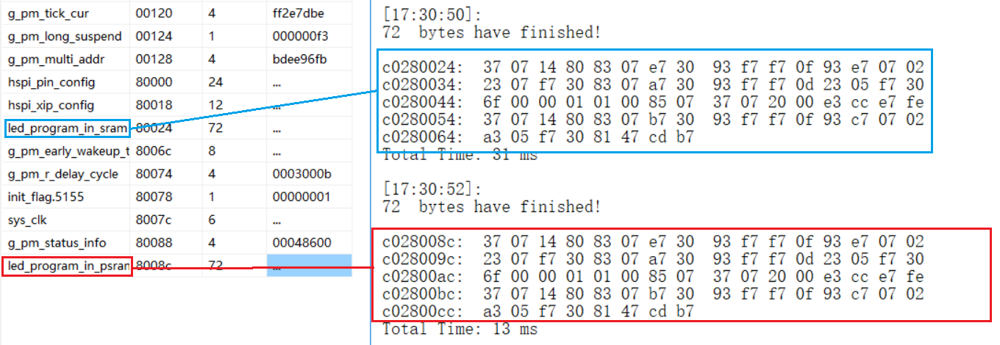

\newpage
# PM

The MCU is in working mode during normal program execution and the current will be at the mA level. If you need to save power you need to enter the low power mode.

## Function description

The Low power mode (LPM), also known as sleep mode, has three types as follows:

(1) Suspend

(2) deep sleep without SRAM retention (hereinafter referred to as deep)

(3) deep sleep with SRAM retention (hereinafter referred to as deep retention)

Each mode is divided into PAD wake-up, 32k_timer wake-up (internal 32k, external 32k clock source), MDEC wake-up, LPC wake-up and CORE wake-up depending on the wake-up source, where CORE wake-up only supports suspend mode and other wake-up sources support all modes.

The current chip models that support deep retention mode include: blackHawk (8K), kite (8K/16k/32k), vulture (16k/32k), and eagle (32k/64k).

The states of SRAM, digital register, and analog register in the three low-power modes are as follows.

|module|suspend|deep retention|deep|
|:--------:|:--------:|:--------:|:--------:|
|SRAM|100% keep|First 16K/32K/64K keep, others lost|100% lost|
|digital register|99% keep|100% lost|100% lost|
|analog register|100% keep|99% lost|99% lost|

The three low-power modes are described as follows:

### Suspend

In suspend mode, the program stops running, similar to a pause function. When the suspend mode is woken up, the program continues to execute. In suspend mode, the PM module works normally, SRAM does not power down (no data loss), all the analog register does not power down, and a small amount of digital register power down. In order to save power, the software can be set to power down the RF/USB/Audio modules, at this time the corresponding part of the digital register of these modules will be lost. For example, RF needs to be re-initialized after waking up in order to send packets, the rest of the registers are not lost. If you want to be able to send packets directly after waking up, you cannot set the corresponding module power down, but the corresponding power consumption will increase. It can be woken up by IO, timer, and other methods; here it should be noted that in the pad wake-up mode in order to avoid false triggering, you need to do the corresponding pull-up and pull-down to ensure the initial level.

### Deep

In deep mode, the program stops running, the vast majority of the MCU hardware modules are powered off. When the deep mode is woken up, the MCU will restart, similar to re-powering, and the program starts initializing again. In deep mode, the pm module works normally, the SRAM is powered down, data is lost, most of the 3.3V analog register will be saved, the rest of the analog register is powered down, and all digital registers are powered down. It can be woken up by IO, Timer, and other methods, but the SRAM data is lost.

### Deep retention

The deep mode has low current, but cannot store SRAM information; the suspend mode can keep SRAM and register without losing data, but the current is high. In order to achieve some application scenarios that require low current when sleeping and to ensure that the state can be restored immediately after waking up from sleep, the deep retention mode is added. The Deep Retention mode is closer to deep mode, and the only difference with deep is that it can save SRAM, and you can choose the size of SRAM retention area according to your actual needs.

In deep retention mode, the program stops running, most of the MCU hardware modules are powered off. When the deep retention mode is woken up, the MCU will restart, similar to re-powering, the program starts initialization again. In deep retention mode, pm module works normally, SRAM keeps part of the space without power off, the rest is powered off. All others are powered down, most of the 3.3V analog register will be saved, other analog register is powered down, all digital register is powered down, and the current value greater than deep mode is the current value consumed to keep the SRAM. It can be woken up by IO, Timer, and other methods. Since deep retention mode will save SRAM, it can save part of the action of moving code/data from flash to RAM after waking up. In addition, the program can also define the retention data. The variable defined as retention data will not go to flash to get the value after waking up, but will be saved in SRAM directly, so the last modified value will be saved.

### Low power mode workflow

The MCU operation flow is different for different sleep modes. The following is a detailed description of the MCU operation flow after waking up from the 3 sleep modes: suspend, deepsleep, and deepsleep retention. Please refer to the following diagram.

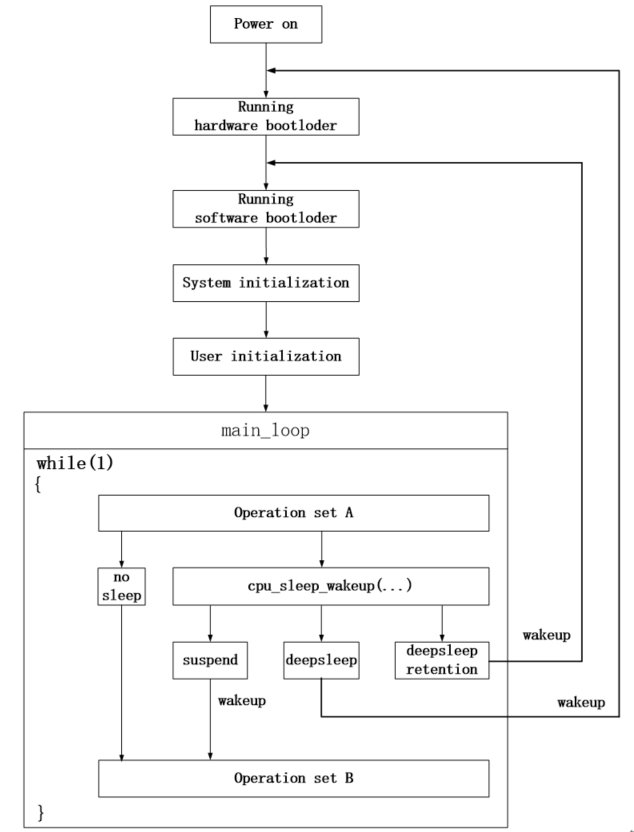

**Description of the modules in the flowchart.**

a) Run hardware bootloader

The MCU hardware performs some fixed actions that are solidified in the hardware and cannot be modified by software.

b) Run software bootloader

After the hardware bootloader finishes running, the MCU starts running the software bootloader, which is the vector segment that corresponds to the assembly program inside the S file. The software bootloader is to set up the memory environment for the later C program, which can be understood as the initialization of the whole memory.

c) System initialization

The system initialization corresponds to the initialization of each hardware module such as sys_init and clock_init in the main function, and sets the digital/analog register status of each hardware module.

d) User initialization

The user initialization corresponds to the function user_init.

e) main_loop

After the user initialization is completed, it enters the main_loop controlled by while(1). The series of operations before entering sleep mode in main_loop is called "Operation Set A", and the series of operations after waking up from sleep is called "Operation Set B".

**Process analysis of each sleep mode.**

(1) no sleep

Without sleep, the MCU runs as a loop in while(1), repeatedly executing "Operation Set A" -> "Operation Set B".

(2) suspend

The cpu_sleep_wakeup function is called to enter the suspend mode. When the suspend mode is woken up, the MCU continues to run to "Operation Set B", similar to the normal exit of the cpu_sleep_wakeup function. During suspend sleep, all SRAM data remains unchanged, and most of the digital/analog register states remain unchanged (with a few special exceptions); therefore, after the suspend mode is woken up, the program continues to run in its original position, and there is almost no need to consider any SRAM and register state recovery.

(3) deepsleep

The cpu_sleep_wakeup function is called to enter the deep mode, and when the deep mode is woken up, similar to re-powering, the MCU goes back to hardware bootloader to run again. During deep sleep all SRAM and most of the digital/analog registers are powered down (with the exception of some special analog registers) and all hardware and software initialization will be redone.

(4) deepsleep retention

The deep retention mode is a sleep mode between suspend and deep. The cpu_sleep_wakeup function is called to enter deep retention mode. When deep retention is woken up, the MCU returns to run software bootloader to start running. During the deep retention sleep period SRAM keeps only a part of SRAM powered on, most of the digital/analog registers are powered down (with the exception of some special analog registers). After waking up, part of the data in front of the SRAM is kept, and the step of "Run hardware bootloader" can be skipped, because the retention area on the SRAM is limited, "run software bootloader" cannot be skipped and must be executed; because deepsleep retention cannot save the register state, the system initialization must be executed and the register initialization needs to be reset. Since the program can also define the retention data, the user initialization can be optimized and improved, and the user initialization after power on/deep wake-up can be differentiated.

## Driver description

The driver layer provides a number of interface resources for use by the upper application layer, which are described below.

### Reserved information BUF

When the chip enters the deep/retention state, the data of most of the registers will be lost. The chip reserves 8 registers that will not be lost in deep/retention, so that the application layer can record some information that you want to save in the sleep state. You can define in the driver as the following (0x38<0> and 0x39<0> are used by the driver and the rest is reserved for the application layer):

(1) The following registers will be cleared in three cases: watchdog, hardware/software reset, and power-up.

```C
//watchdog, chip reset, RESET Pin, power cycle
#define PM_ANA_REG_WD_CLR_BUF0     0x38 // initial value 0xff. [Bit0] is already occupied. The customer cannot change!
```

(2) The following registers will be cleared only when re-powered.

```C
#define PM_ANA_REG_POWER_ON_CLR_BUF0   0x39 // initial value 0x00. [Bit0] is already occupied. The customer cannot change!
#define PM_ANA_REG_POWER_ON_CLR_BUF1   0x3a // initial value 0x00
#define PM_ANA_REG_POWER_ON_CLR_BUF2   0x3b // initial value 0x00
#define PM_ANA_REG_POWER_ON_CLR_BUF3   0x3c // initial value 0x00
#define PM_ANA_REG_POWER_ON_CLR_BUF4   0x3d // initial value 0x00
#define PM_ANA_REG_POWER_ON_CLR_BUF5   0x3e // initial value 0x00
#define PM_ANA_REG_POWER_ON_CLR_BUF60x3f // initial value 0x0f
```

### Status information

The driver defines a global variable g_pm_status_info that will update the relevant status of the pm in the **sys_init** function, which contains the following:

```C
typedef struct{
    unsigned char is_pad_wakeup;  //Whether this time it is woken up by the pad
    unsigned char wakeup_src; //Which wake-up source is for wake-up this time, including the wake-up status of PAD, TIMER, MDEC, LPC and CORE.
    pm_mcu_status mcu_status; //Which state is MCU back from, including power on/watchdog/deep/deep ret four states
    unsigned char rsvd;
}pm_status_info_s;

extern _attribute_aligned_(4) pm_status_info_s g_pm_status_info;
```

**Note:**

>- For the wake-up source WAKEUP_STATUS_TIMER, as long as the timer time to the set time, the flag will be set up by itself, even if no timer wake-up set on, the flag will be set up, but not wake-up. After clearing the flag, it will still be set up when the time comes.
>- For the wake-up source WAKEUP_STATUS_CORE, it belongs to the digital part of the wake-up mode, during the wake-up process the digital registers can not be powered off, so it only supports suspend sleep mode. Register configuration default open core wake-up, when power on/deep/deep ret is back the wake-up source flag bit will be set up, you need to ignore this flag bit, back from suspend the wake-up source flag bit  will display normally.
>- For the wake-up source WAKEUP_STATUS_PAD, when entering sleep, if the pad meets the wake-up condition, the program will not enter sleep and continue to run. If it is deep mode, the driver sleep function is set to enter reboot, and the program is processed as reboot. If it is retention mode, the driver sleep function is not processed, the upper software can be processed as suspend, and after exiting the sleep function, the rf module needs to be initialized again.

### Suspend power setting

Interface function: pm_set_suspend_power_cfg

This function configures whether the basebend, usb, and npe modules are powered down when suspend. The default state is all power down. If you want to be in suspend mode, you can call this function to set it before entering suspend.

### LPC wake-up

In the test, it is found that when setting 872mv and 50%, it can wake up below 2.02V (normally it should wake up below 1.744V), the reason is that the LPC function is less accurate in LPC_LOWPOWER mode.

### USB wake-up

In the test, we found that the USB wake-up flag will be set wrongly, because the trigger condition of USB wake-up is that there is a voltage change on the USB pins DP and DM and data is generated, before setting the USB wake-up, software configuration is needed to connect the DP pin to pull-up and the DM pin to pull-down, which can ensure the stability of the voltage level.

**Note:**

>- The DM pin is connected to the pull-down in order to simulate the state of the connection with the host, which is only needed when testing the USB wake-up configuration.

## Demo description

### Process description

The flow chart of the Demo is as follows.

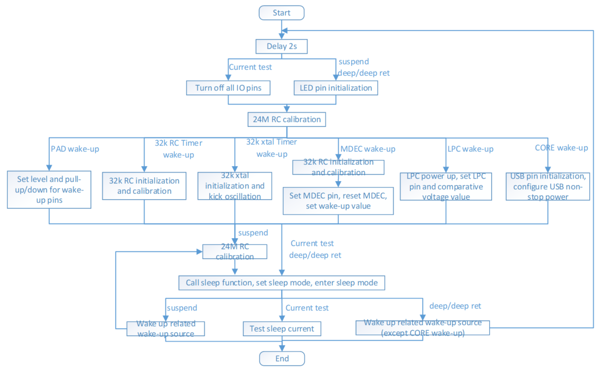

**Flowchart description:**

(1) The 2s delay is added at the beginning to keep communication possible, because after entering sleep, swire will not work, it is easy to fail active when using BDT and cannot burn the program.

(2) Turn off all IO pins to prevent leakage before the current test starts.

(3) CORE wake-up only supports suspend sleep mode, not deep mode or deep retention mode.

(4) Suspend mode turns on LED2 before sleep and turns it off after waking up, deep and deep retention mode goes to sleep when the chip is powered down and LED1 turns off automatically. (LED is just to indicate the status.)

(5) Because RC clocks are inaccurate and vary with temperature, they generally need to be calibrated regularly. The following recommendations are given:

a) 24M RC

It can be calibrated every 10s, calibrated before sleep, this accuracy will affect the start time of the crystal after sleep. Waking up from sleep, the hardware uses 24M RC clock to kick crystal, the more accurate the time, the faster the start time.

b) 32K RC

It is calibrated once after power up and wake up from deep. Because of the tricking method used in PM (using 16M to count the time of 32K fixed cycles), there is no effect on the accuracy of Timer wake-up time here.

If other modules use 32K RC, they need to be handled according to the application requirements.

c) 32K xtal

It is needed to kick crystal after power up. In addition, when using 32K xtal, you need to solder a capacitor externally.

## Chip difference

### Sleep current value

Set The CURRENT_TEST current test macro to 1, test the sleep current in uA (this is a chip test data, for reference only, you can refer to the datasheet for details).

Sleep current value of B91 A0 chip:

|  - |Pad ldo|Pad dcdc|32k rc ldo|32k rc dcdc|32k xtal ldo|32k xtal dcdc|mdec ldo|mdec dcdc|lpc ldo|lpc dcdc|
|:-------------------------:|:---:|:---:|:------:|:------:|:--------:|:--------:|:----:|:----:|:---:|:---:|
|deep|0.7|0.7|1.3|1.2|1.7|1.6|1.4|1.4|1.6|1.6|
|deep retention 32k sram|1.8|1.8|2.4|2.4|2.8|2.7|2.6|2.6|2.8|2.8|
|deep retention 64k sram|2.7|2.7|3.2|3.2|3.7|3.6|3.4|3.4|3.7|3.8|

Sleep current values for the B91 A1 chip:

| #9 |Pad ldo|Pad dcdc|32k rc ldo|32k rc dcdc|32k xtal ldo|32k xtal dcdc|mdec ldo|mdec dcdc|comp. ldo|comp. dcdc|core ldo|core dcdc|
|:------------:|:---:|:---:|:------:|:------:|:--------:|:--------:|:----:|:----:|:---:|:---:|:---:|:---:|
|suspend|36.6|36.7|37.1|37.1|36.8|37.1|37.1|36.8|37.9|37.7|37|36.8|
|deep|0.6|0.5|1.1|1.1|1.5|1.4|1.1|1.0|1.5|1.5|-|-|
|deep ret 32k|1.8|1.7|2.3|2.2|2.7|2.5|2.3|2.2|2.7|2.7|-|-|
|deep ret 64k|2.7|2.6|3.1|3.1|3.5|3.4|3.2|3.1|3.6|3.1|-|-|

\newpage
# LPC

## Introduction

The Low Power Comparator (LPC for short) compares the input voltage multiplied by the selected scale factor with a reference voltage and outputs the result of the comparison. There are two working modes of the LPC, which are:

(1) Normal mode, the internal reference voltage is from bandgap (BG for short), it has higher accuracy, high power consumption, and works in the chip's normal power supply environment.

(2) Low power mode, internal reference voltage is from UVLO, it has lower accuracy, low power consumption, and works in the chip sleep environment.

The output of the low-power comparator can also be used as a signal to wake up the system from low-power mode.

## Working principle

The LPC requires a 32K RC clock source to be used as the comparator clock. The comparison results are as follows:

(1) If the value of [Input Voltage * Scaling] is greater than the reference voltage, the output will be low ("0").

(2) If the value of [Input Voltage * Scaling] is less than the reference voltage, the output will be high (" 1").

(3) If the value of [Input Voltage * Scaling] is equal to the reference voltage, or if the input channel is selected as float, the output will be indeterminate.

## Demo description

Demo flow chart is as follows:

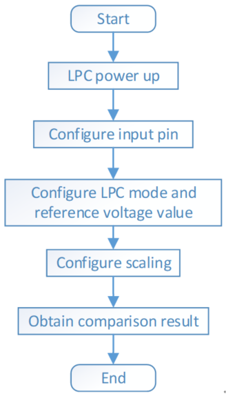

The reference voltage value is set to 872mv, and the scaling ratio is set to 50%, then when the input voltage is 0 \~ 1.744V, the lpc_get_result returns "1"; and when the input voltage is 1.744 \~ 3.3V, the lpc_get_result returns "0".

\newpage
# MDEC

MDEC is the Manchester Decoding Module.

## Test environment setup

The working environment for implementing the MDEC function consists of two other boards in addition to the development board:

(1) AT9001H-V1.1: Receive RF data and send the data out through MCU_1.

(2) E21480094v-0: Send RF data to the AT9001H-V1.1 board.

In the figure of AT9001H-V1.1, the black cable is GND, the red cable is MCU_1, the long iron piece on the right is GND, and the diagonal iron above is VBAT. When wiring, please note that MCU_1 should be connected to the MDEC function pins (PA0 on the silkscreen) set in the development board. The red cable of PCB board E21480094v-0 is 24V+ and the black cable is 24V-.

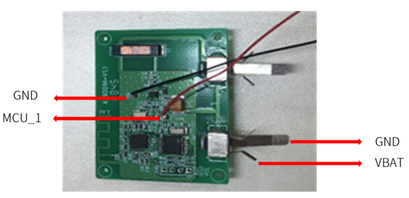

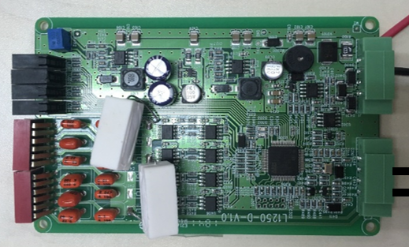

In addition, the PCB board E21480094v-0 requires a 24V regulated voltage source to supply power. The specific wiring schematic is as follows:

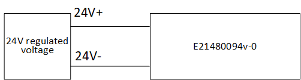

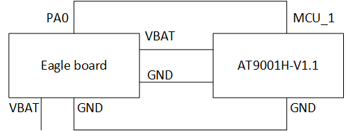

When the environment is set up and powered on, the board E21480094v-0 will continuously send wireless packet data content, when the board AT9001H-V1.1 receives the data it will send through MCU_1 to the SoC's Manchester interface IO in the form of levels. Pay attention to place the two boards as close as possible, and the correct level waveform is as follows:

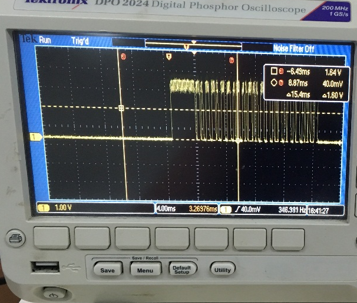

**Note:**

>- If you see a messy waveform, reposition the two boards and adjust the long black coil in the connector at the bottom of the E21480094v-0.

## Function description

Using the MDEC module requires a 32K clock to be turned on, where both 32K RC and 32K Xtal are suitable. The relevant data is obtained and determined by reading the voltage level of the Manchester input pin. It can be used for MDEC wake-up in low-power mode.

**Note:**

>- The 32K clock source is used because the MDEC is designed to be used as a wake-up source in deep and suspend scenarios.

\newpage
# RF

The RF driver supported transceiver modes include BLE1M, BLE2M, BLE125K, BLE500K, Zigbee250K, Hybee1M, Hybee2M, Hybee500K, Private1M, Private2M, Private250K, Private500K, and ANT mode. Where BLE1M, 2M also contains two modes of turning on PN and turning off PN.

The BLE mode works in standard compliant 1Mbps BLE mode, 2Mbps enhanced BLE mode, 125Kbps BLE remote mode (S8), and 500kbps BLE remote mode (S2). The Zigbee mode works in IEEE 802.15.4 compliant 250Kbps mode.

## Initialization

The RF module initialization is as follows:

```C
rf_mode_init(); //RF initialization
rf_set_ble_1M_mode(); //different modes call different mode initialization, here take BLE_1M mode as an example
rf_set_power_level(RF_POWER); //Set the transmit energy
rf_access_code_comm(ACCESS_CODE);// Zigbee, hybee mode has no access code concept, so this step is not needed
rf_set_tx_dma(0,128);//1 FIFO, each FIFO size is 128bytes
rf_set_rx_dma(rx_packet,RX_FIFO_NUM-1,RX_FIFO_DEP);
rf_set_ble_chn(17);//for BLE open PN 2440MHz
```

If you want to send and receive packets, there are two usage options:

(1) Manual Mode: all the use process for tx and rx are controlled by the software process, for example, set tx mode, wait for stable PLL before sending packets, and so on.

(2) Auto Mode: as long as the corresponding state machine mode is triggered, the subsequent actions are automatically controlled by the hardware and do not require software control.

## Energy setting

Currently there are two interfaces to set energy:

```C
void rf_set_power_level (rf_power_level_e level)
```

------------------------------------------------------------------------------------------
Applicable mode   Parameter chn_num
----------------- ------------------------------------------------------------------------
All modes         Set the value of the enumeration variable corresponding to the energy.

------------------------------------------------------------------------------------------

```C
void rf_set_power_level_index (rf_power_level_index_e idx)
```

------------------------------------------------------------------------------------------
Applicable mode   Parameter chn
----------------- ------------------------------------------------------------------------
All modes         The passed in index value of the enumeration variable in the corresponding array for the energy.

------------------------------------------------------------------------------------------

**Note:**

>- The only difference between the two is the inconsistency in the way the parameters are passed, and in the application you can choose whichever to use as needed.

## Frequency setting

Currently there are two interfaces to set the frequency point:

```C
void rf_set_ble_chn(signed char chn_num)
```

|Applicable mode|Parameter chn_num|
|:-----------------------------------|:-------------------------------------------------------|
|ble_1M, ble_2M, ble_250K, ble_500K|The actual frequency point is set to (chn_num+2400) MHz|

```C
void rf_set_chn(signed char chn)//all modes can be used
```

------------------------------------------------------------------------------------------
Applicable mode   Parameter chn
----------------- ------------------------------------------------------------------------
All modes         The index value of the frequency point is passed in. It is set to the corresponding frequency point by the transformation of index, and the index relationship is as follows.

------------------------------------------------------------------------------------------

The correspondence between the rf_set_ble_chn function parameter chn_num and the frequency points is shown in the following table.

|Corresponding frequency point (MHz)|chn_num|
|:--------:|:--------:|
|2402|37|
|2404|0|
|2406|1|
|2408|2|
|2410|3|
|2412|4|
|2414|5|
|2416|6|
|2418|7|
|2420|8|
|2422|9|
|2424|10|
|2426|38|
|2428|11|
|2430|12|
|2432|13|
|2434|14|
|2436|15|
|2438|16|
|2440|17|
|2442|18|
|2444|19|
|2446|20|
|2448|21|
|2450|22|
|2452|23|
|2454|24|
|2456|25|
|2458|26|
|2460|27|
|2462|28|
|2464|29|
|2466|30|
|2468|31|
|2470|32|
|2472|33|
|2474|34|
|2476|35|
|2478|36|
|2480|39|

## Interrupt

All interrupts below need to be cleared manually by the software.

--------------------------------------------------------------------------------------------------------------------
Mode           Related interrupts
-------------- -----------------------------------------------------------------------------------------------------
Auto           **FLD_RF_IRQ_RX_TIMEOU:** If the packet is still not received within the time set from trigger to timeout, an interrupt is generated and the state machine returns to idle state. The timeout time is set by void rf_set_rx_timeout(); and the timeout starts from the trigger RX.

Auto           **FLD_RF_IRQ_CMD_DONE:** After completing a normal packet receiving or sending operation, the state machine returns to the IDLE state normally and generates an interrupt.

Auto           **FLD_RF_IRQ_RX_CRC_2:** BTX,BRX,PTX,PRX will generate interrupt if CRC error is detected twice in a row during packet receiving (continuous packet receiving).

Auto           **FLD_RF_IRQ_FSM_TIMEOUT:** It contains the state machine used for switching from receive to send, specifying the time of the entire state machine, and determining whether the specified time is exceeded in the TX_WAIT state.

Auto           **FLD_RF_IRQ_TX_RETRYCNT:** Generate an interrupt when the number of ptx retry exceeds the set r_max_retry_cnt.

Auto           **FLD_RF_IRQ_TX_DS:** Length of payload (sent by PTX, PRX) ! = 0, generate tx_ds interrupt.

Auto           **FLD_RF_IRQ_RX_DR:** PRX, PTX, SRX received packets detect the packet payload length ! = 0, generate rx_dr interrupt.

Auto           **FLD_RF_IRQ_STX_TIMEOUT:** The STX state does not wait for tx_done in the specified time, thus timeout, generating an interrupt.

Auto           **FLD_RF_IRQ_INVALID_PID:** PTX or PRX receives invalid pid and generates interrupt.

Auto           **FLD_RF_IRQ_FIRST_TIMEOUT:** BRX, PRX, SRX, SRT first RX timeout, when the first packet receive timeout it will generate an interrupt.

Auto           **FLD_RF_IRQ_WIFI_DENY:** After the Bluetooth chip receives the wifi_deny signal from the WiFi chip when it is connected to the WiFi chip, the Bluetooth chip generates an interrupt

Auto/Manual    **FLD_RF_IRQ_RX:** an interrupt is generated after each packet is received.

Auto/Manual    **FLD_RF_IRQ_TX:** an interrupt is generated after each packet is sent.

Auto/Manual    **FLD_RF_IRQ_SUPP_OF:** The interrupt is mainly used for AOA and AOD. If iq sampling frequency is too high the hardware FIFO will overflow error, generate interrupt iq sample and synchronize fifo overflow.

--------------------------------------------------------------------------------------------------------------------

## Packet format

The format of the packet contents of sending and receiving packets in ram differs for each mode. The following describes the format of the packet contents in ram for each mode according to the sending and receiving packets.

The first four bytes of the outgoing packet format in all modes are DMA_LEN_INFO, which can be obtained and filled in by calling the following function:

```C
DMA_LEN_INFO = rf_tx_packet_dma_len (data_len).
```

**Note:**

>- The receiving/sending buffer must be four-byte aligned. For example:
     unsigned char rx_packet[128*4] \_\_attribute\_\_ ((aligned (4)));

### BLE packet format

#### BLE packet sending format

The format of the packet sending in RAM is shown below (where payload length is the data length and data is the data to be sent):

**BLE TX Packet:**

--------------------------------------------------------------------------------------------------------------------
Address                               Content
------------------------------------- ------------------------------------------------------------------------------
addr, addr + 1, addr + 2, addr + 3    DMA_LEN_INFO <br>rf_tx_packet_dma_len(payload length+2).

addr + 4                              header0

addr + 5                              header (payload length)

addr + 6                              data(0)

addr + 7                              data(1)

addr + 8                              data(1)

.....                                 .....

addr +6+(length-1)                    data(length-1)

--------------------------------------------------------------------------------------------------------------------

#### BLE packet receiving format

When the SoC is in BLE mode for packet receiving, the received packet data is stored in ram in the following format:

**BLE packet receiving format:**

--------------------------------------------------------------------------------------------------------------------
Address                       Content                                                  Description
----------------------------- -------------------------------------------------------- -----------------------------
rba-4, rba-3, rba-2, rba-1    -                                                        -

rba                           header0                                                  refer to Bluetooth low energy spec

rba+1                         header1 (payload length)                                 indicate length of payload only, do not include 3 crc bytes

rba+2                         data(0)                                                  payload

rba+3                         data(1)                                                  payload

rba+4                         data(2)                                                  payload

.....                         .....                                                    payload

rba+2+(length-1)              data(length-1)                                           payload

rba+2+(length)                crc(0)                                                   crc byte0

rba+2+(length+1)              crc(1)                                                   crc byte1

rba+2+(length+2)              crc(2)                                                   crc byte2

rba+2+(length+3)              r_tstamp[7:0]                                            time stamp byte0

rba+2+(length+4)              r_tstamp[15:8]                                           time stamp byte1

rba+2+(length+5)              r_tstamp[23:16]                                          time stamp byte2

rba+2+(length+6)              r_tstamp[31:24]                                          time stamp byte3

rba+2+(length+7)              pkt_fdc[7:0]                                             low byte of recorded frequency offset after demodulation

rba+2+(length+8)              {1'b0,rx_packet_chn_efuse[2:0]}, {1'b0,pkt_fdc[10:8]}    high byte of recorded frequency offset after demodulation

rba+2+(length+9)              pkt_rssi                                                 recorded packet RSSI

\-                             [0]                                                     crc error

\-                             [1]                                                     sfd error

\-                             [2]                                                     link layer error

\-                             [3]                                                     power error

\-                             [4]                                                     long range 125K indicator

\-                             [6:5]                                                   N/A

\-                             [7]                                                     NoACK indicator

--------------------------------------------------------------------------------------------------------------------

#### BLE packet receiving data parsing

According to the receiving packet format introduced in the previous sections, the information commonly used in the receiving packet can be obtained through the interface, which has been encapsulated with the relevant functions:

------------------------------------------------------------------------------------------------------------
Function                                   Description
------------------------------------------ ----------------------------------------------------------------
rf_ble_packet_crc_ok(p)                    Determine whether the receiving packet CRC is correct

rf_ble_dma_rx_offset_crc24(p)              Get the index of the CRC location in the packet

rf_ble_dma_rx_offset_time_stamp(p)         Get the index value of time_stamp in the packet

rf_ble_dma_rx_offset_freq_offset(p)        Get the index value of the frequency offset in the packet

rf_ble_dma_rx_offset_rssi(p)               Get the index value of rssi in the packet

------------------------------------------------------------------------------------------------------------

#### Packet parsing example

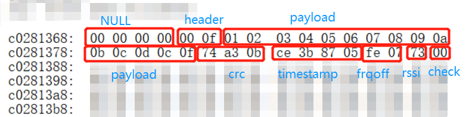

### Zigbee/hybee packet format

#### Zigbee/hybee packet sending format  

Zigbee 250K and hybee mode sending packet data are stored in ram in the following format:

**Zigbee/Hybee TX Packet:**

----------------------------------------------------------------------------------
Address                           Content
--------------------------------- ------------------------------------------------
tba, tba + 1, tba + 2, tba + 3    DMA_LEN_INFO: rf_tx_packet_dma_len(payload length-1)

tba + 4                           Payload length

tba + 5                           data(0)

tba + 6                           data(1)

tba + 7                           data(1)

.....                             .....

tba+5+(length-3)                  data(length-3)

----------------------------------------------------------------------------------

#### Zigbee/hybee packet receiving format

When the SoC is in zigbee 250K or hybee mode to receive packets, the received packet data is stored in ram in the format shown in the table below:

**Zigbee/hybee packet receiving format:**

------------------------------------------------------------------------------------------------------------------------
Address                           Content                                  Description
--------------------------------- ---------------------------------------- ---------------------------------------------
rba-4, rba-3, rba-2, rba-1        -                                          -

rba                               length (payload+crc)                       indicate length of payload and 2 crc bytes

rba+1                             data(0)                                    payload

rba+2                             data(1)                                    payload

rba+3                             data(2)                                    payload

.....                             .....                                      payload

rba+1+(length-3)                  data(length-3)                             payload

rba+1+(length-2)                  crc(0)                                     crc byte0

rba+1+(length-1)                  crc(1)                                     crc byte1

rba+1+(length)                    r_tstamp[7:0]                              time stamp byte0

rba+1+(length+1)                  r_tstamp[15:8]                             time stamp byte1

rba+1+(length+2)                  r_tstamp[23:16]                            time stamp byte2

rba+1+(length+3)                  r_tstamp[31:24]                            time stamp byte3

rba+1+(length+4)                  pkt_fdc[7:0]                               low byte of recorded frequency offset after demodulation

rba+1+(length+5)                  {1'b0,rx_packet_chn_efuse[2:0]}            high byte of recorded frequency offset after demodulation
                                  {1'b0,pkt_fdc[10:8]}

rba+1+(length+6)                  pkt_rssi                                   recorded packet RSSI

rba+1+(length+7)                  [0]                                        crc error

rba+1+(length+7)                  [1]                                        sfd error

rba+1+(length+7)                  [2]                                        link layer error

rba+1+(length+7)                  [3]                                        power error

rba+1+(length+7)                  [4]                                        long range 125K indicator

rba+1+(length+7)                  [6:5]                                       N/A

rba+1+(length+7)                  [7]                                         NoACK indicator

-----------------------------------------------------------------------------------------------------------------------

#### Packet data parsing

Obtain the index of the received packet information according to the packet format.

-------------------------------------------------------------------------------------------------
Function                                   Description
------------------------------------------ ------------------------------------------------------
rf_zigbee_packet_crc_ok(p)                 Determine whether the CRC of the packet is correct

rf_zigbee_dma_rx_offset_crc(p)             Obtain the index of the CRC in the packet

rf_zigbee_dma_rx_offset_time_stamp(p)      Obtain the index of time_stamp in the packet

rf_zigbee_dma_rx_offset_freq_offset(p)     Obtain the index of frequency offset in the packet

rf_zigbee_dma_rx_offset_rssi(p)            Obatin the index of rssi in the packet

--------------------------------------------------------------------------------------------------

#### Packet parsing example

The received data can be parsed according to the storage format of the received packets in zigbee/hybee mode in the previous sections, as shown in the following example:

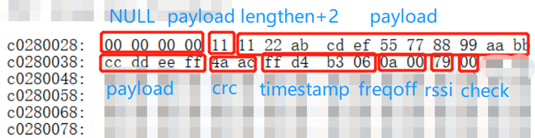

## Private packet format

The Private mode can be divided into two types of SB and TPLL(Telink Proprietary Link Layer), and this section introduces the sending and receiving packet formats for each of them.

### Private TPLL packet sending format

When the SoC sends packets in private mode using the TPLL, the packet data is stored in the following format:

**Private TPLL TX Packet:**

-------------------------------------------------------------------------------------------
Address                             Content
----------------------------------- -------------------------------------------------------
tba, tba + 1, tba + 2, tba + 3      DMA_LEN_INFO: rf_tx_packet_dma_len(payload length).

tba + 4                             Payload length

tba + 5                             data(0)

tba + 6                             data(1)

.....                               .....

tba+5+(length-1)                    data(length-1)

-------------------------------------------------------------------------------------------

### Private TPLL packet receiving format

When the SoC is in private TPLL mode to receive packets, the format of the received packets in RAM is shown below:

**Private TPLL mode receiving packet format:**

------------------------------------------------------------------------------------------------------------------------------
Address             Content                                                 Description|
------------------- ------------------------------------------------------- --------------------------------------------------
rba-4, rba-3        0                                                       -

rba-2               -                                                       -

rba-1               -                                                       -

rba                 payload length                                          indicate length of payload only, do not include 2 crc bytes

rba+1               data(0)                                                 payload

rba+2               data(1)                                                 payload

rba+3               data(2)                                                 payload

.....               .....                                                   payload

rba+1+(length-1)    data(length-1)                                          payload

rba+1+(length)      crc(0)                                                  crc byte0

rba+1+(length+1)    crc(1)                                                  crc byte1

rba+1+(length+2)    r_tstamp[7:0]                                           time stamp byte0

rba+1+(length+3)    r_tstamp[15:8]                                          time stamp byte1

rba+1+(length+4)    r_tstamp[23:16]                                         time stamp byte2

rba+1+(length+5)    r_tstamp[31:24]                                         time stamp byte3

rba+1+(length+6)    pkt_fdc[7:0]                                            low byte of recorded frequency offset after demodulation

rba+1+(length+7)    {1'b0,rx_packet_chn_efuse[2:0]} {1'b0,pkt_fdc[10:8]}    high byte of recorded frequency offset after demodulation

rba+1+(length+8)    pkt_rssi                                                recorded packet RSSI

rba+1+(length+9)    [0]                                                     crc error

rba+1+(length+9)    [1]                                                     sfd error

rba+1+(length+9)    [2]                                                     link layer error

rba+1+(length+9)    [3]                                                     power error

rba+1+(length+9)    [4]                                                     long range 125K indicator

rba+1+(length+9)    [6:5]                                                   N/A

rba+1+(length+9)    [7]                                                     NoACK indicator

------------------------------------------------------------------------------------------------------------------------------

### TPLL receiving packet parsing

Get the index of the information received in the packet according to the packet format.

------------------------------------------------------------------------------------------------------
Function                                     Description
-------------------------------------------- ---------------------------------------------------------
rf_pri_tpll_packet_crc_ok(p)                  Determine whether the receiving packet CRC is correct

rf_pri_tpll_dma_rx_offset_crc(p)              Get the index of the CRC location in the packet

rf_pri_tpll_dma_rx_offset_time_stamp(p)       Get the index value of time_stamp in the packet

rf_pri_tpll_dma_rx_offset_freq_offset(p)      Get the index value of the frequency offset in the packet

rf_pri_tpll_dma_rx_offset_rssi(p)             Get the index value of rssi in the packet

------------------------------------------------------------------------------------------------------

### Example of TPLL receiving packet parsing

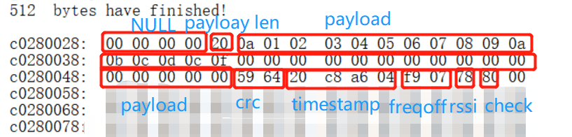

### Private SB packet format

When the SoC is in private SB mode for packet sending, the data is stored in ram in the following table:

**Private SB TX Packet:**

---------------------------------------------------------------------------------
Address                           Content
--------------------------------- -----------------------------------------------
tba, tba + 1, tba + 2, tba + 3    DMA_LEN_INFO: rf_tx_packet_dma_len(payload length).

tba + 4                           Payload length

tba + 7                           data(1)

---------------------------------------------------------------------------------

**Note:**

>- In private SB mode, the payload length information is not included in the packet format, so the packet format is different, and the payload length can be set by the function void rf_set_private_sb_len().

### Private SB packet receiving format

When the SoC is in private SB mode for packet receiving, the received packet data is stored in the ram as shown in the following table:

**Private SB packet receiving format:**

----------------------------------------------------------------------------------------------------------------------------------
Address                 Content                                             Description
----------------------- --------------------------------------------------- ------------------------------------------------------
rba-4, rba-3            0                                                    -

rba-2                   -                                                    -

rba-1                   -                                                    -

rba                     data(0)                                              payload

rba+1                   data(1)                                              payload

rba+2                   data(2)                                              payload

.....                   .....                                                payload

rba+1+(length-1)        data(length-1)                                       payload

rba+1+(length)          crc(0)                                               crc byte0

rba+1+(length+1)        crc(1)                                               crc byte1

rba+1+(length+2)        r_tstamp[7:0]                                        time stamp byte0

rba+1+(length+3)        r_tstamp[15:8]                                       time stamp byte1

rba+1+(length+4)        r_tstamp[23:16]                                      time stamp byte2

rba+1+(length+5)        r_tstamp[31:24]                                      time stamp byte3

rba+1+(length+6)        pkt_fdc[7:0]                                         low byte of recorded frequency offset after demodulation

rba+1+(length+7)        {1'b0,rx_packet_chn_efuse[2:0]}                      high byte of recorded frequency offset after demodulation
                        {1'b0,pkt_fdc[10:8]}

rba+1+(length+8)        pkt_rssi                                             recorded packet RSSI

rba+1+(length+9)        [0]                                                  crc error

rba+1+(length+9)        [1]                                                  sfd error

rba+1+(length+9)        [2]                                                  link layer error

rba+1+(length+9)        [3]                                                  power error

rba+1+(length+9)        [4]                                                  long range 125K indicator

rba+1+(length+9)        [6:5]                                                N/A

rba+1+(length+9)        [7]                                                  NoACK indicator

------------------------------------------------------------------------------------------------------------------------------------

### Example of SB receiving packet parsing

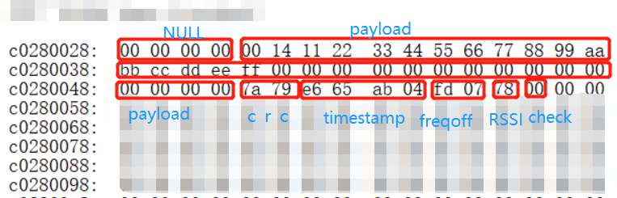

**Note:**

>- The demo framework of all modes is basically the same, but in private mode there is a need to distinguish between TPLL and SB; when using TPLL mode the operation is basically the same as other modes, but when using SB mode to send and receive packets you need to configure the corresponding registers to turn on the SB mode corresponding interface void rf_private_sb_en(void), and because SB mode packet format does not contain payload length information, you need to set the payload length of the receiving and sending end, corresponding to the interface void rf_set_private_sb_len(int pay_len).

## Manual mode

### Manual TX

#### Single-frequency sending

For single frequency point sending in manual TX mode, the setup steps are as follows:

```C
rf_set_txmode(); //enter tx mode and wait for the trigger to send packets
delay_us(113); //wait for PLL to stabilize
while(1)
{
    rf_tx_pkt(ble_tx_packet); //trigger the packet sending
    while(! (rf_get_irq_status(FLD_RF_IRQ_TX))); //wait for the end of packet sending
    rf_clr_irq_status(FLD_RF_IRQ_TX); //clear the interrupt flag
}
```

**Note:**

>- In manual mode, the tx_settle time needs to be controlled manually to wait for the PLL to stabilize during the settle phase. 112.5us is the minimum settle time, and since the PLL is always working after rf_set_txmode() is set in manual mode, this action only needs to be done once when the manual tx is turned on.

#### Frequency-hopping sending

If you need to switch frequencies during data sending, you need to wait for a packet to be sent before you can switch frequencies and send the next packet, set up as the following steps:

```C
//first complete the initialization action
rf_set_ble_chn(17);// 2440MHz
rf_set_txmode();
delay_us(113);//wait for PLL to stabilize
rf_tx_pkt(ble_tx_packet);//trigger the packet sending
while(! (rf_get_irq_status(FLD_RF_IRQ_TX))); //wait for packet sending to finish
rf_clr_irq_status(FLD_RF_IRQ_TX); //clear interrupt status
//Frequency-hopping sending usually requires waiting for the previous packet to be sent before switching the frequency and then triggering the next packet sending.
rf_set_ble_chn(37); //Switch the frequency to 2402MHz
rf_tx_pkt(ble_tx_packet); //trigger again to send packet
```

### Manual RX

#### Single frequency receiving

If you need to use manual mode to send packets after completing the initialization settings, you can set the rf_set_rxmode() interface to enter the packet receiving state. The setting steps are as follows:

```C
rf_set_rxmode();//enter packet receiving mode, no packets are received at this stage, need to wait for stable PLL
    delay_us(85); //Wait for the PLL to stabilize and then enter the real packet receiving stage, if not switch the state, it will always be in the RX state and can always receive packets
    while(1)
    {
        if(rf_get_irq_status(FLD_RF_IRQ_RX)) //determine whether packet receiving is completed
        {
            if(rf_ble_packet_crc_ok(rx_packet)) //determine whether the received packet CRC is correct
            {
                rx_cnt++; //count the received packet
            }
            rf_clr_irq_status(FLD_RF_IRQ_RX); //clear packet receiving interrupt status
        }
    }
```

**Note:**

>- In manual mode, the rx_settle time needs to be controlled manually to wait for the PLL to stabilize during the settle phase. The minimum settle time is 85us, and since the PLL is always working after setting rf_set_rxmode() in manual mode, this action only needs to be done once when the manual rx is turned on.
>- The PLL stays on in manual mode when a packet is received, so clearing the interrupt flag after a packet is received moves to the next packet receiving state.

```C
void rf_set_rx_dma (unsigned char *buff,unsigned char wptr_mask, unsigned short fifo_byte_size) 
```

function description:

-------------------------------------------------------------------------------------
Parameters        Description
----------------- -------------------------------------------------------------------
buff              Receiving packet address

wptr_mask         Receive packet with dma write pointer mask = number of FIFOs - 1

fifo_byte_size    FIFO size

-------------------------------------------------------------------------------------

**Note:**

>- In manual mode, because the hardware will not maintain reading and writing pointers, only one FIFO will be used for receiving, the number of FIFOs is usually set to 1 when setting the dma. An example of setting: rf_set_rx_dma(rx_packet,0,128) one FIFO, FIFO size of 128bytes.

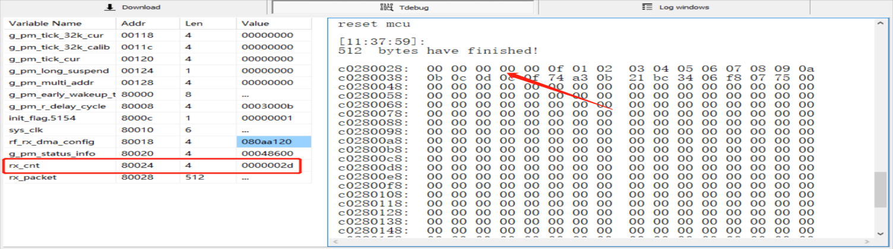

#### Frequency-hopping receiving

If frequency hopping is required during packet receiving, the setting example is as follows:

```C
// first complete the initialization action
rf_set_ble_chn(17);// 2440MHz
rf_set_rxmode();//enter packet receiving mode
delay_us(85);//wait for the PLL to stabilize and enter the actual packet receiving phase after stabilization
if(rf_get_irq_status(FLD_RF_IRQ_RX))
{
    if(rf_ble_packet_crc_ok(rx_packet))
    {
                rx_cnt++;
    }
    rf_clr_irq_status(FLD_RF_IRQ_RX);
}
while(rf_receiving_flag());//wait for the end of the packet receiving (currently it waits for the completion of the packet receiving, whether there is a problem in the packet receiving status is directly interrupted is still being confirmed)
rf_set_ble_chn(37);//Switch the frequency to 2402MHz and wait for the next packet receiving
```

#### Send-receive switching

If you need to switch between sending and receiving modes during operation, code example is as follows:

```C
// first complete the initialization action
rf_set_ble_chn(17);// 2440MHz
rf_set_txmode();//enter packet receiving mode
delay_us(113);//wait for the PLL to stabilize and enter the actual packet receiving phase after stabilization
while(! (rf_get_irq_status(FLD_RF_IRQ_TX))); //wait until the end of packet sending
rf_clr_irq_status(FLD_RF_IRQ_TX); //clear interrupt status
//Switching states requires waiting for the previous state to end before switching states
rf_tx_rx_off();//turn off tx,rx
rf_set_rx_mode(); //enter rx state
delay_us(85);//wait for PLL to stabilize
```

## Auto mode

### STX

The workflow of the state machine in auto mode is as follows:

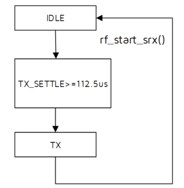

Call function void rf_start_stx (void* addr, unsigned int tick) to trigger STX, enter tx settle, settle ends and enters actual tx state.

```C
void rf_start_stx (void* addr, unsigned int tick)
```

function description:

-------------------------------------------------------------------------------------
Parameters    Description
------------- -----------------------------------------------------------------------
addr          Packet sending address

tick          Trigger immediately when the current tick value is greater than the set tick

-------------------------------------------------------------------------------------

**Note:**

>- The default value of TX_SETTLE time is 150us. You can call interface void rf_tx_settle_us(unsigned short txstl_us) to adjust the settle time, but the tx settle time should not be less than 112.5us.

#### Single-frequency sending

Calling the **rf_start_stx** function will trigger the state machine to enter the TX state (including tx settle), complete the packet sending and return to the IDLE state. The setting steps are as follows.

```C
// first complete the initialization action
rf_start_stx(ble_tx_packet,clock_time());//trigger the first packet sending, and the state machine automatically returns to IDLE state after the packet is sent.
    while(1)
    {
        while(! (rf_get_irq_status(FLD_RF_IRQ_TX))); //determine whether the packet sending is completed
        rf_clr_irq_status(FLD_RF_IRQ_TX);//
        rf_start_stx(ble_tx_packet,clock_time());
    }
```

#### Frequency-hopping sending

If you need to switch the frequency point during packet sending, the setting steps are as follows:

```C
// first complete the initialization action
rf_set_ble_chn(17);// 2440MHz
rf_start_stx(ble_tx_packet,clock_time());//trigger the first packet sending, and the state machine automatically returns to IDLE state after the packet is sent.
while(! (rf_get_irq_status(FLD_RF_IRQ_TX)));//determine whether the packet sending is completed
rf_clr_irq_status(FLD_RF_IRQ_TX);// clear the packet sending interrupt status 
rf_set_ble_chn(37);// 2402MHz switch frequency
rf_start_stx(ble_tx_packet,clock_time());//trigger packet sending again
```

### SRX

The working process of the state machine when receiving packets in auto mode is as follows:

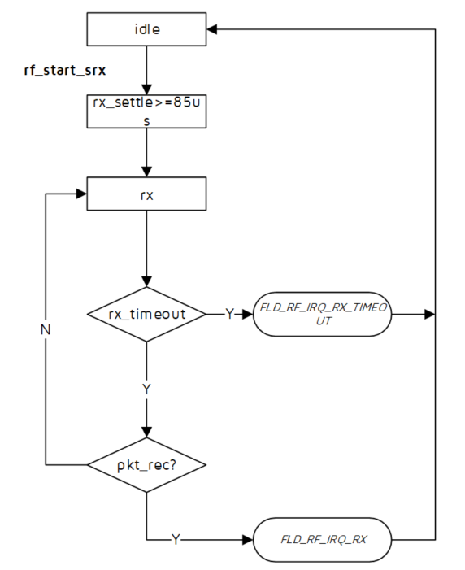

The auto mode use function void rf_start_srx(unsigned int tick); to trigger SRX, enter rx settle, after settle ends and enter actual rx, when packet receiving is completed it automatically returns to idle state. In the specified time, if the data is not synchronized to the packet, it triggers FLD_RF_IRQ_RX_TIMEOUT interrupt.

```C
void rf_start_srx (unsigned int tick)
```

function description:

-------------------------------------------------------------------------------------
Parameters    Description|
------------- -----------------------------------------------------------------------
tick          Trigger immediately when the current tick value is greater than the set tick

-------------------------------------------------------------------------------------

**Note:**

>- The default value of rx_settle time is 150us, you can call the interface void rf_rx_settle_us(unsigned short txstl_us) to adjust the settle time, but the tx settle time should not be less than 85us.

#### Single-frequency receiving

If single frequency point receiving is performed in auto mode, the setting steps are as follows:

```C
// first complete the initialization action
rf_start_srx(clock_time());//after triggering the state machine will enter the synchronous state from IDLE state, while timeout starts timing.
    while(1)
    {
        if(rf_get_irq_status(FLD_RF_IRQ_RX))//determine if packet receiving is finished
        {
            u8* raw_pkt = rf_get_rx_packet_addr(RX_FIFO_NUM,RX_FIFO_DEP,rx_packet);//find the current packet receiving address, only needed in auto mode.
            if(rf_ble_packet_crc_ok(raw_pkt))//determine whether the CRC of the packet is correct
            {
                rx_cnt++;//record the number of packets received
                rf_clr_irq_status(FLD_RF_IRQ_RX);//clear the interrupt status
                rf_start_srx(clock_time());//trigger the next packet receiving
        }
     }
```

**Note:**

>- In auto mode, DMA will automatically offset the data when carrying data to the ram address based on the number of FIFOs and FIFO depth. Therefore, after each packet is received, you need to find the address of this packet in ram for crc check by rf_get_rx_packet_addr(int fifo_num,int fifo_dep,void* addr) function.

The rf_get_rx_packet_addr function is described as follows:

-------------------------------------------------------------------------------------
Parameters   Description
------------ ------------------------------------------------------------------------
fifo_num     Number of FIFOs

fifo_dep     Size of each FIFO

addr         Receiving packet address

-------------------------------------------------------------------------------------

When using the function rf_set_rx_dma(rx_packet,3,128); to set DMA, it will have 4 FIFOs for packet receiving.

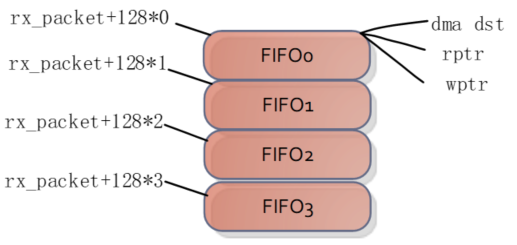

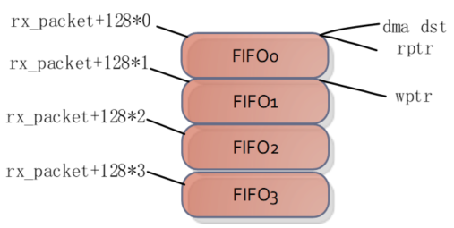

Until the four FIFOs are received, it returns to the first FIFO. The following figure shows the result of packet receiving in auto mode, where the number of FIFOs is 4 and the FIFO size is 128 bytes.

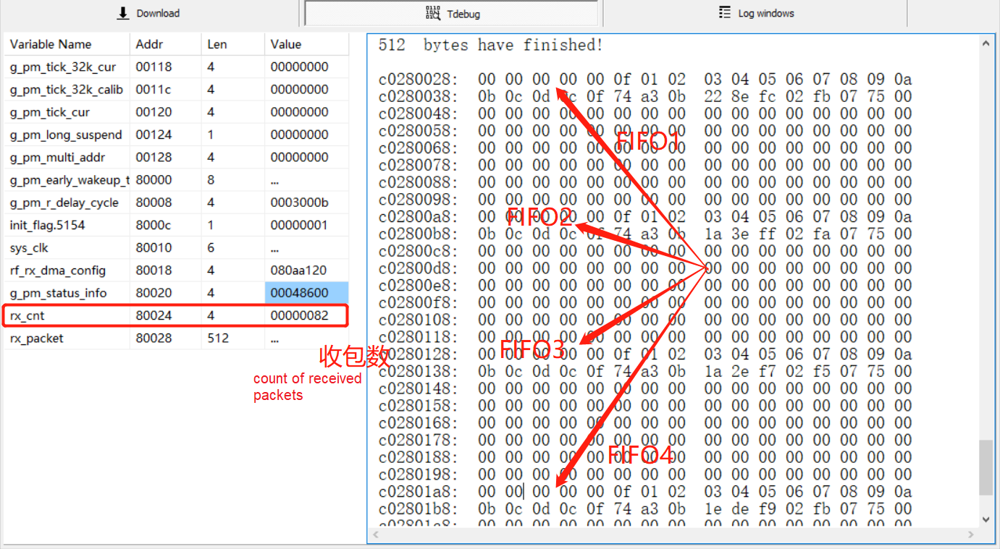

#### Frequency-hopping receiving

If you need to switch the frequency point during packet receiving, the setting steps are as follows:

```C
// first complete the initialization action
rf_set_ble_chn(17);// 2440MHz
rf_start_srx(clock_time());//trigger packet receiving, and the state machine will automatically return to IDLE state after packet receiving is completed
if(rf_get_irq_status(FLD_RF_IRQ_RX))//determine the end of packet receiving
{
    u8* raw_pkt = rf_get_rx_packet_addr(RX_FIFO_NUM,RX_FIFO_DEP,rx_packet);//find the address of the packet receiving
    if(rf_ble_packet_crc_ok(raw_pkt))
    {
            rx_cnt++;
    }
    rf_clr_irq_status(FLD_RF_IRQ_RX);
}
while(rf_receiving_flag());//determine whether packet sending is completed
rf_clr_irq_status(FLD_RF_IRQ_RX);//clear packet receiving interrupt status
rf_set_ble_chn(37);// 2402MHz switching frequency
rf_start_srx(clock_time());//trigger packet receiving again
```

#### Automatic mode switching

If you switch between sending and receiving in auto mode, the code example is as follows:

```C
// first complete the initialization action
rf_set_ble_chn(17);// 2440MHz
rf_set_stx(ble_tx_packet,clock_time());
while(! (rf_get_irq_status(FLD_RF_IRQ_TX))); //wait for the end of packet sending
rf_clr_irq_status(FLD_RF_IRQ_TX); //clear the interrupt status
// Wait for the previous state to end before switching states
rf_set_tx_rx_off_auto_mode();//turn off tx,rx
rf_start_srx(clock_time());//trigger packet receiving
```

**Note:**

>- Currently, when switching states we usually wait until the previous state is finished before stopping the state machine, and then switch to the next state.

\newpage
# ISO-7816

## Introduction of ISO-7816 protocol

ISO-7816, the International Standard for Smart Card Communication, specifies the specifications for contact smart cards, including physical characteristics, interface specifications, transmission protocols, command exchange formats, and so on.

Telink SoC integrates ISO-7816 communication module and supports communication with contact IC cards. This article briefly introduces the method to establish communication between Telink SoC and contact IC cards.

## How to use ISO-7816

### Hardware connection

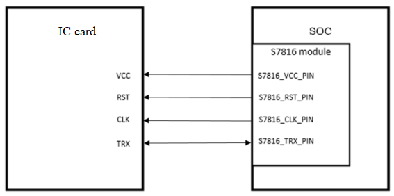

In actual use, we need to connect each contact of IC card to SoC one by one, which is the hardware basis for communication between SoC and IC card.

(1) VCC is the power supply voltage of IC card and RST is the reset signal of IC card. We can choose any two of the free GPIO pins of the SoC to connect to it.

(2) CLK is the clock contact of the IC card. The clock is supplied to the IC card by the SoC.

(3) TRX, I/O contact, is IC card input and output contact. Because IC card only supports half-duplex communication, at a certain moment I/O contact only supports input or output, so in actual use we need to pay attention to the timing.

**Note:**

>- The IS07816-3 protocol specifies three operating voltages for IC cards: Class A-5V, Class B-3V, and Class C-1.8V. In actual use, the voltage provided by the SoC needs to match the operating voltage of the card.

### Initilization

```C
s7816_set_pin(gpio_pin_e rst_pin,gpio_pin_e vcc_pin,gpio_pin_e clk_pin,gpio_pin_e trx_pin)
s7816_init(uart_num_e uart_num,s7816_clock_e clock,int f,int d)
```

s7816_set_pin() is used to configure the RST,VCC,CLK,TRX pins.

S7816_init() is used to select UART channels (UART0 and UART1), configure IC card clock, and IC card clock frequency adjustment factor F (default is 372) and bit rate adjustment factor D (default is 1).

```C
s7816_en(uart_num_e chn)
```

After the configuration is complete, you need to use the function s7816_en() to enable the 7816 module.

**Note:**

>- The S7816 is implemented through the UART function of the SoC, so it will occupy the corresponding UART module when used.

### IC card activation and cold reset

```C
s7816_coldreset();
```

The ISO7816 protocol states that after the reset pin is pulled up, the cold reset answer will begin within 400-40,000 clock cycles thereafter.

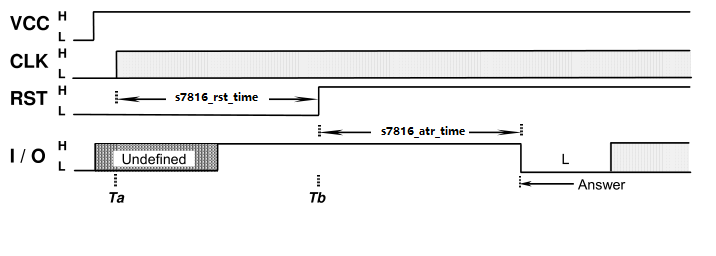

Taking the SoC clock configuration of 4MHz as an example, the cold reset process is as follows:

a) After VCC is pulled up, the SoC outputs CLK from the Ta moment, the SoC configures the TRX pin, and after the SoC's TRX pin is configured, the SoC's TRX pin is set to the receive state.

b) Within 40,000 cycles (10,000us) after Ta, RST is pulled up.

c) Within 40,000 cycles (10,000us) after RST is pulled high, the IC card will pass back the reset character to the SoC.

```C
s7816_set_time(int rst_time_us)
```

s7816_set_time() is used to reset the s7816_rst_time time in a cold reset.

(1) rst_time_us corresponds to s7816_rst_time, which is the reset waiting time from Ta to Tb in the timing sequence, and the default is 40,000 clock cycles.

(2) s7816_atr_time, the time to wait for the ATR return time after Tb in the timing sequence, ranges from 400 to 40,000 clock cycles. In practice, you need to wait for the ATR character to be received before proceeding to the next operation (you can perform protocol parsing in the main function to determine whether the ATR character is received).

### Warm reset

```C
s7816_warmreset()
```

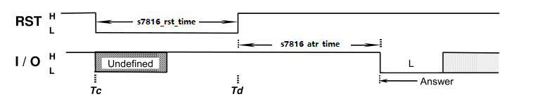

The IC card has specified specifications and contents for the reset answer to the terminal. If the answer to reset received by the interrupt does not meet the specified requirements, the terminal will initiate a warm reset and obtain a reset signal from the IC card.

Take the clock configuration 4MHz as an example, the warm reset process is as follows:

a) CLK and VCC always remain normal state (CLK applied, VCC pulled up).

b) At the moment of Tc, set RST from high to low.

c) Within 200 cycles (50us) of the Tc moment, the SoC sets the TRX pin to the receiving state.

d) Set RST high within 40,000 cycles (10000-10000us) after Tc. The IC card answer to reset will start within 40,000 cycles (10000us) after Td.

Like the cold reset, the warm reset can also reset the s7816_rst_time (default value 40,000 clock cycles) using the s7816_set_time() function. You need to wait for the ATR character to be received before you can proceed to the next step.

**Note:**

>- The answer to reset (initial ATR) is the same for cold reset and warm reset. The difference between the two is that cold reset is accompanied by IC card activation and warm reset is performed after IC card activation.

### Contact release

```C
s7816_release_trig()
```

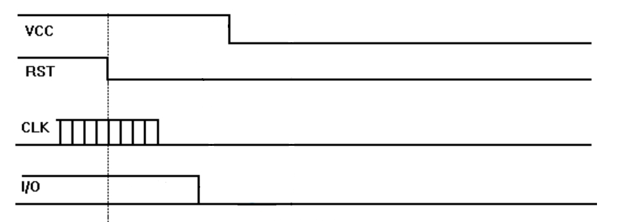

During cold reset or warm reset, if the IC card does not respond to the reset within the specified time, the terminal needs to initiate a contact release timing sequence.

(1) The terminal starts the contact release sequence by setting RST to low level.

(2) After setting RST low and before VCC is powered down, the terminal sets CLK and I/O low as well.

(3) Finally, the terminal power down VCC before actually breaking the contact.

## Demo introduction

Take an initialized SMARTCOS-PSAM card as an example. The demo first performs a cold reset and then takes random numbers.

Take random command is: 0x00,0x84,0x00,0x00,0x04 (take 4 bytes of random number)

Cold reset to obtain initial ATR:

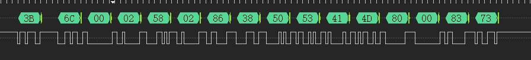

The initial ATR is 16 bytes in total. The initial ATR is analyzed as follows:

(1) 3B: positive agreement.

(2) 6C: that is, T0, binary of 6 is 0110, indicating the presence of TB1 and TC1, C indicates that the historical characters is 12.

(3) From T0, we know that TB1 is 00, which means no additional programming voltage is required.

(4) It is known from T0 that TC1 is 02 and two additional protection times are required, that is, two additional etu times are required between every two bytes when sending data from the terminal to the IC card.

(5) From T0, we know that the 12 historical characters are 0x58,0x02,0x86,0x38,0x50,0x53,0x41,0x4d,0x80,0x00,0x83,0x73.

(6) The IC card uses the T=0 protocol and has no TCK check character.

Taking random numbers is as follows:

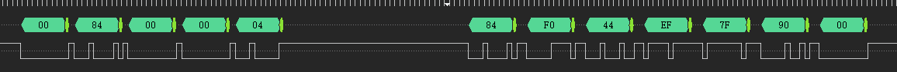

Where 0x00,0x84,0x00,0x00,0x00,0x04 are the commands sent by the terminal to the IC card to take random numbers.

The random numbers obtained are 0xf0,0x44,0xef,0x7f for a total of 4 bytes, and the random numbers taken will be different each time.

Data ending with 9000 indicates successful execution of the command.

\newpage
# ADC

## Introduction

The ADC driver can be used for ADC sampling of external GPIO voltage, battery voltage and temperature sensor.

## Working principle

### Internal structure

Internal structure of SAR_ADC, as shown below:  

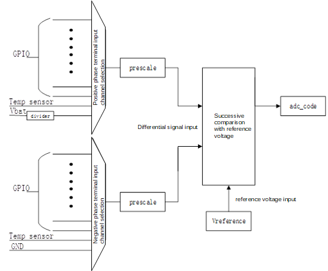  

SAR ADC only supports differential mode. The code value is obtained through differential sampling, and then converted into voltage value or temperature value by the driver.

|Application scenario|  P end  |   N end  |
|:------------------|:----------|:------------|
| Single GPIO sampling | ADC_GPIO | GND |
| Two GPIO differential sampling | ADC_GPIO1 | ADC_GPIO2 |
| Vbat channel | VBAT | GND |
| Temp sensor | ADC_TEMSENSORP_EE | ADC_TEMSENSORN_EE |

**Requirements for P end and N end voltage:**

For the sampling range of a single GPIO, refer to (1) and (2) below to determine the final sampling range.  

The application scope of two GPIO differential sampling needs to meet the following four conditions:

(1) The voltage of P end and N end is not allowed to exceed prescal * vreference.

(2) The voltage of P end and N end is not allowed to exceed V_ioh (Voltage value at IO output high level).

(3) The difference voltage between P end and N end is not allowed to exceed prescal * vreference.

(4) ((Vp+Vn)/2)<(prescal*Vreference).

|Chip|V_ioh(Voltage value at IO output high level)|
|:-----|:-------------------------------------------------------------------------------------|
|  B85  |  V_ioh=vbat<3.6v  |
|  B87  |  V_ioh=vbat<3.6v  |
|  B91  |  (1) When the Vbat voltage in the application scenario must be lower than 3.6V, set Vbat_MAX_VALUE_LESS_THAN_3v6 mode. (2) When the Vbat voltage in the application scenario may be higher than 3.6V, set VBAT_MAX_VALUE_GREATER_THAN_3V6 mode, V_ioh follows vbat when vbat < V_ldo, and V_ioh = V_ldo when vbat > V_ldo. (V_ldo=3.3v(+-10%))|

### Sampling voltage value calculation

The analog input voltage ($V_{IN}$) is compared with the reference voltage ($V_{REF}$) to generate a proportional N-bit sample code value, which is stored in a register. In actual application we will generally do pre-scale to $V_{IN}$ to support a larger sampling range. Taking the 14-bit resolution sampling code value as an example, when the pre-scale factor pre_scale = ¼, the conversion formula between $V_{IN}$ and code value is:

$$\frac {{\frac 14}*{V_{IN}}}{V_{REF}} = \frac {adc\_code}{ref\_code}$$

Among them, adc_code is the code value obtained by sampling $V_{IN}$ .

The ref_code is the code value converted from $V_{REF}$ , 14-bit resolution corresponds to 0x1fff (bit13 is the sign bit).

The inverse of this can be used to obtain the sampled voltage value of $V_{IN}$.

**Note:**

>- For GPIO, after pre-scale it can be compared with the reference voltage as a differential signal. However, Vbat can be compared only after two voltage dividers of Vbat divider and pre-scale. The final voltage divider factor is the product of two voltage divider factors. e.g. when the pre-scale factor pre_scale = 1 and Vbat_divider = 1/3, the conversion formula between $V_{IN}$ and code value is:  

$$\frac {{\frac 13}*{1}*{V_{IN}}}{V_{REF}} = \frac {adc\_code}{ref\_code}$$

## B91 ADC instructions

### Interface description

The interface naming rule is:

- init suffix: the interface used for initialization.
- dma suffix: the interface that will be used for dma mode sampling.
- No dma suffix: the interface that will be used for manual sampling.

## Demo description

### Demo structure description

The application.c file for ADC Demo is app.c, and the macro ADC_MODE in ADC_Demo/app_config.h selects which sampling mode to use.

```C
#define ADC_DMA_MODE				 1
#define ADC_NDMA_MODE				 2

#define ADC_MODE 			   ADC_NDMA_MODE
```

In ADC_NDMA_MODE (manual sampling mode) and ADC_DMA_MODE (DMA sampling mode), the ADC usage scenario is selected by configuring the macro ADC_SAMPLE_MODE for one of GPIO analog signal input, battery voltage (Vbat) and temperature sensor.

```C
#define ADC_GPIO_SAMPLE			 1	//GPIO voltage
#define ADC_VBAT_SAMPLE			 2	//Vbat channel Battery Voltage
#define ADC_TEMP_SENSOR_SAMPLE	         3      //Temp test
#define ADC_SAMPLE_MODE		   ADC_GPIO_SAMPLE
```

### ADC initialization configuration

The ADC initialization flow is shown in the following figure:

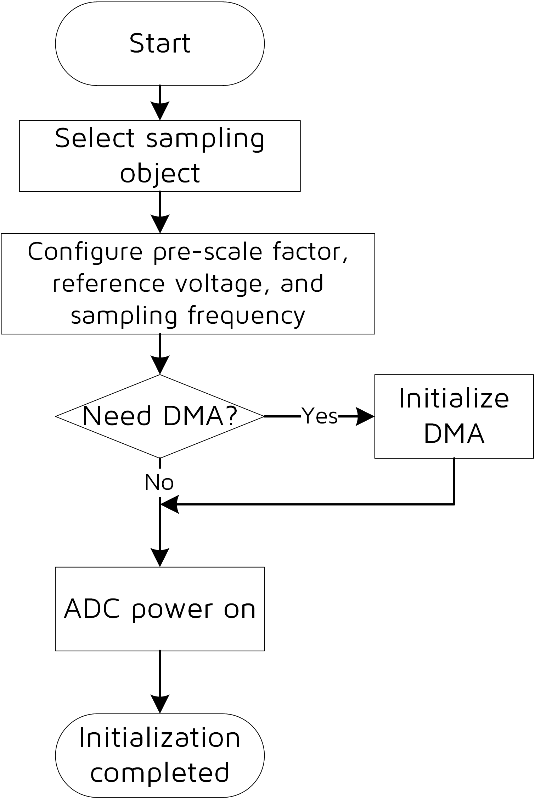

### ADC sampling and conversion process

The sampling and conversion of the ADC is shown in the following figure:

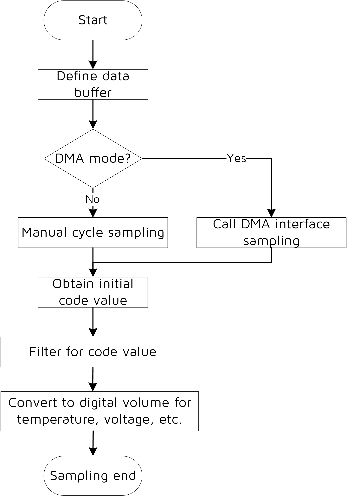

**Note:**

>- When sampling (ADC_NDMA_MODE) manually, only one adc_code can be acquired at a time, during which the ADC sampling function will be turned off, and when using, it is necessary to ensure that the time interval between continuous acquisition of adc_code is greater than 2 sampling cycles.

### Demo test example

Sample Vbat using the method of configuring DMA.

The sampling results are viewed through the BDT tool as follows:

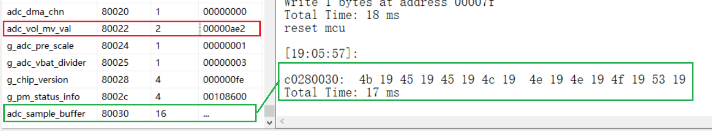

In the above figure: adc_sample_buffer stores the code values of 8 sets of samples, adc_vol_mv_val represents the sampled voltage value, 0xae2 converted to decimal is 2786mV (2790mV measured by voltmeter).

## Chip difference

### Feature support differences

|Chip|GPIO sampling|Vbat sampling mode|Whether Temp sampling is supported|
|:---|:-----------|:------------------------------------------|:-------------------|
|B85|PB0-7/PC4-5|Vbat channel mode is not supported, using GPIO output high level, to GPIO sampling way of vbat sampling, at this time the GPIO voltage is the voltage of Vbat. (This method does not require hardware wiring, you can set a pin without package to save GPIO resources.)|not support|
|B87|PB0-7/PC4-5|vbat channel|support|
|B91|PB0-7/PD0-1|The external voltage divider is used in the hardware circuit, and the GPIO method is used for sampling in the software|support|

### Calibration configuration description

The configurations with chip level calibration are listed below. It is recommended to use these configurations to reduce the error (if other configurations are used, the calibration value is inaccurate). If you want the error to be smaller, you can use a fixture for board level calibration on the production line.

|Chip|Factory calibration value|Sampling error (The amount of test data is small and is only for reference)|
|:---|:-------------------------------------------------------------|:-------------------------------|
|B85|GPIO sampling, sampling rate 96KHz, pre-scale factor 1/8, reference voltage 1.2V.|Error in -14~12mV. (29 sample chips)|
|B87|GPIO sampling, sampling rate 96KHz, pre-scale factor 1/8, reference voltage 1.2V.|Error in 9~12mV. (20 sample chips)|
|B87|vbat channel sampling, sampling rate 96KHz, pre-scale factor 1, vbat scale factor 1/3, reference voltage1.2V.|Error within 10mV. (10 sample chips)|
|B91|GPIO sampling, sampling rate 48KHz, pre-scale factor 1/4, reference voltage 1.2V.|Error in -11~7mV. (19 sample chips)|

**Distinction between signal-to-noise ratio and error concepts**

The datasheet of B91 indicates that the signal-to-noise ratio is 10.5bit, which means as follows:

The signal-to-noise ratio (significant bit) is 10.5 bits, and the corresponding analog quantity is 1200mV/（2^10.5）≈0.82mV (assuming reference voltage selection 1200mV), which means that the sampling accuracy of ADC is 0.82mV, that is, the code value of 1 unit represents the voltage value of 0.82mV.

The concept of error, e.g. the error is 10mV, the input is 500mV, and the sampling result is 510mV.

**External voltage divider circuit**

When the voltage to be sampled exceeds the ADC sampling range, an external voltage divider circuit must be used to divide the original voltage to the sampling range, and then input to the sampling point for sampling through GPIO. The recommended configuration of the external voltage divider circuit is as follows (it can be selected according to the respective application requirements):

Hardware circuit reference:

As the chip internal resistance is tens of Mbps, so the total resistance values of the voltage divider circuit should not be too large (preferably not more than 2M), otherwise the current is too small and the ADC cannot sample normally.

***M-level voltage divider circuit: small leakage, slow sampling***

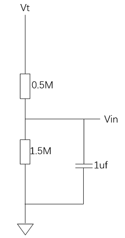

***Hundred K-level voltage divider circuit: large leakage, fast sampling***

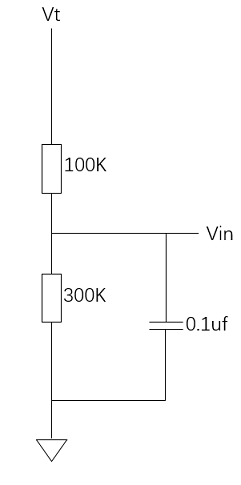

Software requirements:

The input equivalent of sar adc is a capacitance of about 15pF, and there will be a dynamic current equivalent to $f*c*v$ in the sampling, so the voltage value of the sampling point of the resistor divider will slowly produce an error voltage. So

(1) When the ADC is turned on to sample immediately, the value of the sampling point is still in a more accurate place, so the sampling value is more accurate.

(2) Delay after closing ADC, the resistance value at the voltage divider point will return to the accurate value due to no dynamic current.

(3) The higher the sampling rate, the greater the error voltage.

***There are different solutions for different working modes. Take B91 as an example to illustrate.***

***(The delay part marked below will be related to the sampling frequency, voltage and current, so when using only need to refer to the following logic processing method, but the relevant delay part, please test according to the actual application, and set aside a certain amount of margin out.)***

Hardware configuration: B91 calibration chip + M-level voltage divider circuit

Software configuration (ADC_Demo):

- 1.2V Vref reference voltage
- 1 / 4 pre_scale pre-voltage-dividing factor
- Sampling frequency 23K

(1) In normal operating mode:  
        a. Turn on the ADC to sample immediately, and then turn off the ADC immediately.  
        b. Delay (greater than 50ms, less than this value error will be larger).  
        c. Perform the next sampling, the sampling steps are the same as a and b.

**Note:**

>- If you need to switch the PIN, the operation of switching the PIN can be added before step a.

(2) In the deep or deep retention mode, after sampling, it will enter the deep or deep retention  without additional operation.

(3) In the suppend mode, it will enter the suppend after sampling, and the time to configure suppend is greater than 200ms.

Chip level calibration error is - 9 \~ 5mV; The board level calibration error is - 3 \~ 8mV. (10 sample chips)

Hardware configuration: B91 calibration chip + Hundred K-level voltage divider circuit

Software configuration (ADC_Demo):

- 1.2V Vref reference voltage
- 1 / 4 pre_scale pre-voltage-dividing factor
- Sampling frequency 23K

(1) In normal operating mode:  
        a. Turn on the ADC to sample immediately, and then turn off the ADC immediately.  
        b. Delay (greater than 5ms, less than this value error will be larger).  
        c. Perform the next sampling, the sampling steps are the same as a and b.

**Note:**

>- If you need to switch the PIN, the operation of switching the PIN can be added before step a.

(2) In the deep or deep retention mode, after sampling, it will enter the deep or deep retention  without additional operation.

(3) In the suppend mode, it will enter the suppend after sampling, and the time to configure suppend is greater than 50ms.

Chip level calibration error is - 5 \~ 7mV; The board level calibration error is - 4 \~ 6mV. (10 sample chips)

\newpage
# USB introduction

USB  (Universal Serial Bus) is an external bus standard used to standardize the connection and communication between computers and external devices. It is an interface technology applied in PC area. USB interface supports plug-and-play and hot-plug functions of devices. USB was jointly proposed by Intel, Compaq, IBM, Microsoft and many other companies at the end of 1994. As shown in the figure below, USB consists of four wires, namely VCC, GND, D- (DM), and D+ (DP). USB can choose to be powered through the host computer or self-powered, and most USB devices are currently powered through the host computer.

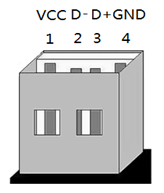

The USB communication is the communication between the controller and the device, the computer host is the controller, Telink USB is the device, and the host referenced later is the controller by default. USB bus is a one-way bus, communication can only be initiated by the controller, the device receives a request from the controller, the data is sent to the controller. The controller is sending requests to the device every n units of time, and n is the user configuration parameter.

The USB has four operating speeds: Super Speed (5.0Gbit/s), High Speed (480Mbit/s), Full Speed (12Mbit/s) and Low Speed (1.5Mbit/s), where the communication frame period (the interval between sending two consecutive frames of data) of the Full Speed and Low Speed USB buses is 1ms, and the communication frame period of the High Speed USB bus is 125us. USB1.1 only supports full speed and low speed, USB2.0 supports high speed, full speed and low speed, and super speed is only supported in USB3.0.

## USB packet format and transfer process

Packet is the most basic unit of USB data transmission, that is, each data transmission is in the form of a packet. And packets have to be composed into transactions for effective communication. There are various packets for composing various transactions (IN, OUT, SETUP) according to the communication needs. One or more transactions make up a transmission (control transmission, bulk transmission, terminal transmission, and isochronous transmission).

Packets are the smallest unit of data transfer on the USB bus and cannot be interrupted or interfered with, otherwise it will raise an error. Several packets form a single transaction, and a single transaction cannot be interrupted either, that is, several packets belonging to a single transaction.

### USB packet structure

Packet is the basic unit of information transmission in the USB system, all data is packaged and transmitted on the bus.

As shown in the figure below, a USB packet consists of seven parts, namely the synchronization field (SYNC), packet identification (PID), address field (ADDR), endpoint field (ENDP), frame number field (FRAM), data field (DATA), and checksum field (CRC). Note that not every USB packet contains all seven of these fields, meaning that some packets contain only a few of them.

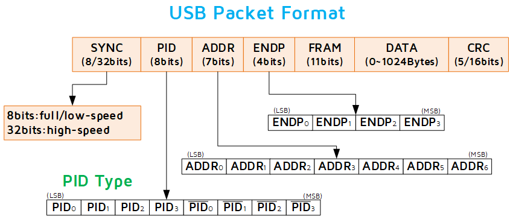

(1) Synchronization field

The sync field is mainly to notify each other of the start of data transfer and to provide a synchronous clock. For low-speed and full-speed devices, the synchronization field uses 0000 0001 (binary number); for high-speed devices it uses 000000 00000000 00000000 00000001.

(2) Packet ID (PID)

The packet ID is mainly used to identify the type of the packet and consists of 8 bits: the lower 4 bits are the PID code, and the upper 4 bits are the checksum field, which is obtained by inverting the lower 4 bits. Various packets in USB are distinguished by the PID field.

(3) Address field

Since there may be more than one device accessing the USB bus, the address field needs to be introduced to make it easier to distinguish which device is the one currently communicating. The address field contains 7 data bits and up to 128 addresses can be specified. Address 0 is used as the default address and is not assigned to a USB device. For each device on the USB bus, the address is unique.

(4) Endpoint field

The endpoint field is used to specify an endpoint number of a device on the USB bus, containing 4 data bits; full-speed/high-speed devices can contain up to 16 endpoints, and low-speed devices can contain up to 3 endpoints. All USB devices must contain an endpoint with endpoint number 0, which is used to exchange basic information between the host and the device. All endpoints except for endpoint 0 are specific to the specific USB device. The address field and endpoint field combination specifies the channel for communication between the host and the device.

(5) Frame number field

The frame number field is used to indicate the frame number of the current frame, which is sent only in the SOF token packet at the beginning of each frame/microframe. Its data bits are 11 bits long and are incremented by 1 for each frame transmitted by the host and zeroed when the maximum value of 7FFH is reached.

(6) Data field

The data field contains the data to be transferred between the host and the USB device in bytes, with a maximum length of 1024, while the actual length depends on the specifics of the transfer.

(7) Checksum field

The checksum field is primarily used to verify the correctness of the communication data. The CRC is used in both USB token packets and data packets. However, the CRC is generated by the sender prior to bit padding, which requires the receiver to decode the CRC field after removing the bit padding. The PID field in the message packet itself contains the checksum, so the CRC calculation does not contain a PID part. The CRC for the token packet uses a 5-bit CRC, and the data field in the data packet uses a 16-bit CRC.

#### Token packets

The SOF packets are sent from the host to the device: every 1.00 ms ± 0.0005 ms for the full-speed bus and every 125us ± 0.0625us for the high-speed bus.

The SOF packet format is as below.

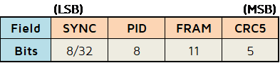

The IN, OUT, SETUP packet format is as below.

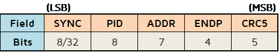

#### Data packets

Data packets (DATA0, DATA1, DATA2, MDATA)

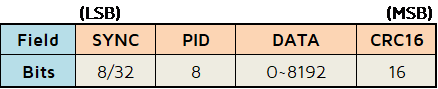

#### Handshake packets

PRE, ACK, NAK, STALL, NYET packet format.

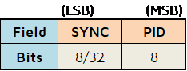

### USB transfer process

#### USB transaction

The process of receiving or sending data at one time in USB is called Transaction, and the transaction is usually composed of a series of packets. For different transactions, the packets composed of transactions are different. In the USB data transfer, common transactions include IN transaction, OUT transaction, and SETUP transaction. Note that SOF is only an indication of the beginning of a frame with no valid data and is not a transaction; EOF is a level state at the end of a frame transmission and is not a transaction.

The transaction usually consists of two or three packets: a token packet, a data packet, and a handshake packet. The token packet initiates the transaction, the data packet transmits the data, the sender of the handshake packet is usually the data receiver. When the data is correctly received, the handshake packet is sent, and the device can also use NACK to indicate that the data is not ready.

#### Input transaction

An input (IN) transaction is the process of a host getting data from one of the endpoints of a USB device. As shown in the figure below, an input transaction has three states, namely, a normal input transaction (figure (a)), an input transaction when the device is busy or has no data (figure (b)), and an input transaction when the device is in error (figure (c)). A correct input transaction includes three phases: token packet, data packet, and handshake packet.

**Input transaction processing flow**

 Normal input transaction")

 Input transaction when device is busy or no data")

 Input transaction when device is in error")

The normal input transaction is introduced and analyzed with the normal input transaction example. As shown in the following figure, a normal input transaction contains three interaction processes: (1) Host sends an IN token packet to Device; (2) Device receives the IN token packet and sends the data to be sent to the host; (3) Host receives the packet and replies with an ACK packet to confirm the packet is received correctly.

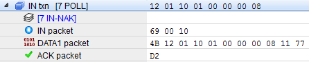

#### Output transaction

An output (OUT) transaction is the process of sending data from a host to one of the endpoints of a USB device. As shown in the figure below, an output transaction has three states, namely, a normal output transaction (figure (a)), an output transaction when the device is busy (figure (b)), and an output transaction when the device is in error (figure (c)). The correct output transaction includes three phases: token, data and handshake.

**Output transaction processing flow**

 Normal output transaction")

 Output transaction when device is busy")

 Output transaction when device is in error")

The following is an introduction and analysis of a normal output transaction with an example of a normal output transaction. As shown in the following figure, a normal output transaction contains three interaction processes: (1) Host sends an OUT token packet to Device; (2) Host sends a data packet to Device; (3) Device receives the data packet and replies with an ACK packet to confirm that the data packet was correctly received.

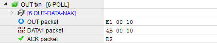

#### Setup transaction

The SETUP transaction handles and defines the special data transfer between Host and Device, which is only applicable to the establishment phase of USB control transfer. As shown in the figure below, the setup transaction usually has three states, namely, normal setup transaction (figure (a)), device busy setup transaction (figure (b)) and device error setup transaction (figure (c)), and the correct setup transaction includes three phases: token, data and handshake.

**SETUP transaction process**

 Normal output transaction")

 Setup transaction processing when device is busy")

 Setup transaction processing when device is in error")

The following is an introduction and analysis of a normal SETUP transaction with an example of a normal SETUP transaction. As shown in the figure below, a normal setup transaction consists of three interaction processes: (1) Host sends a SETUP token packet to Device; (2) Host sends a DATA0 packet to Device; (3) Device receives the packet and replies with an ACK packet to confirm that the packet was received correctly.

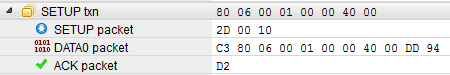

### USB transfer

The USB transfer consists of transactions such as OUT, IN or SETUP. The USB standard protocol defines four types of transfers: Control Transfer, Bulk Transfer, Interrupt Transfer and Isochronous Transfer. The priority of the four types of transfers from high to low is: Isochronous Transfer, Interrupt Transfer, Control Transfer, and Bulk Transfer.

#### Control transfer

The Control Transfer is the most basic and important transfer method in USB, and is the default transfer method for port 0. Control Transfer is typically used for transfers between the host and USB peripherals on Endpoint 0, but vendor-specific Control Transfer may be used on other endpoints. Control Transfer is primarily used to query, configure, and send generic commands to USB devices. Control transfers are unidirectional (except for Endpoint 0, which is bidirectional) and the amount of data is usually small. The maximum packet length of the control transfer depends on its operating speed, with a fixed maximum packet length of 8 bytes for low-speed mode, 64 bytes for high-speed mode, and a choice of 8, 16, 32, and 64 bytes for full-speed mode.

**Note:**

>- The packet length of Telink USB's endpoint 0 is a fixed length of 8 bytes, and no other value can be configured.
>- The control transfer is composed of three stages, namely the setup stage, the data stage (optional) and the status stage, each consisting of one or more (data stage) transactions.
>- Setup stage: The setup stage consists of the SETUP transaction as shown in the figure below. The data stage of the SETLUP transaction always uses DATA0 and has a fixed length of 8 bytes.

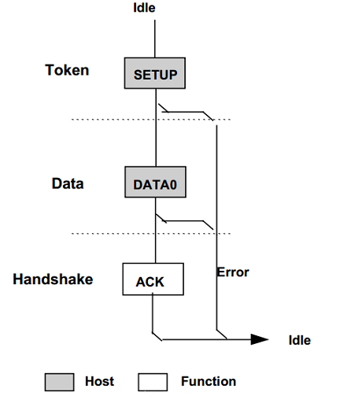

>- Data stage: The data stage is optional. If a data stage is available, it includes one or more IN/OUT transactions, which are used to transfer data in the USB defined format as required by the setup stage. The transactions in the data stage have the same direction, that is, either all IN or all OUT. if the data to be transferred is larger than the length of a packet, the controller divides it into multiple packets for transfer. Once the data transfer direction is changed, it is considered to enter the status process. The first packet of the data process must be a DATA1 packet, and then each time it seeks to transfer a packet it is exchanged between DATA0 and DATA1. If the last packet size is equal to the maximum packet size, then another packet of size 0 should be transferred to determine the end. According to the direction of data transfer the data stage, control transmission can be further divided into three types, namely Control Write, Control Read and No-data Control, as shown in the following figure.

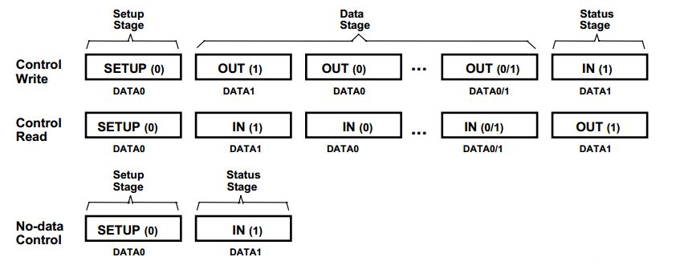

>- Status stage: The status stage is the last stage of control transaction processing and consists of an IN or OUT transaction, always composed using DATA1 packets. The status stage is transferred in the opposite direction to the data stage, that is, if the data stage is IN, the status stage is OUT, and vice versa. It is used to report the results of the setup stage and data stage transfers.

#### Interrupt transfer

The Interrupt Transfer is the same as bulk transfer except that it does not support PING and NYET packets, so its sequence diagram can refer to bulk transfer. The main difference between interrupt transfer and bulk transfer is reflected in two points: First, the priority is different, interrupt transfer has a higher priority than bulk transfer, second only to isochronous transfer; Second, the maximum packet length supported is different, the maximum packet length of interrupt transfer low-speed mode is capped at 8 bytes, the maximum packet length of full-speed mode is capped at 64 bytes, and the maximum packet length of high-speed mode is capped at 1024 bytes.

It is important to note that the interrupt described here is not the same as interrupt on hardware. Since USB does not support hardware interrupt, the host must be polled periodically to know if a device needs to transmit data to the host. It can be seen that interrupt transfer is also a polling process, polling period determined by the user device (polling interval of full-speed device is 1ms \~ 255ms, low-speed device is 10ms \~ 255ms), the host only needs to ensure that schedule a transfer in no greater than the interval. The polling period is very important, if it is too fast, it will occupy too much bus bandwidth; if it is too low, the data may be lost, so the user needs to set it according to the condition of their data.

Interrupt transfers are typically used in devices that do not have a large amount of data, but are time-critical, such as keyboard and mouse in human interface devices (HIDs). Interrupt transfer can also be used to continuously check the status of the device and then use bulk transfer to transfer large amounts of data when the conditions are met. The endpoint type of interrupt transfer is generally IN endpoint, that is, from Device to Host (IN transaction), rarely used in OUT endpoint, some computers do not even support interrupt transfer OUT transaction.

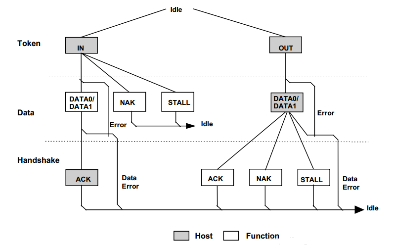

#### Isochronous transfer

The Isochronous Transfer is an unreliable transfer. Isochronous transfer has only two stages, token packet (IN/OUT token packet) and data packet (DATAx), it has no handshake packet and does not support PID inverse, host has the highest priority when scheduling the transfer. The maximum length of isochronous transfer packet is capped at 1023 bytes for full-speed mode, 1024 bytes for high-speed mode, and isochronous transfer is not supported for low-speed mode.

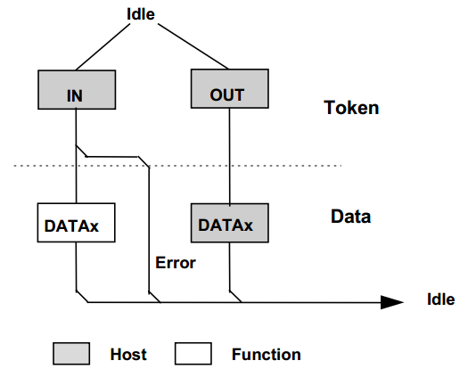

Isochronous transfer is suitable for data that must arrive at a fixed rate or at a specified moment in time, where occasional errors can be tolerated. USB reserves bus bandwidth for it, ensuring that it can be served within each frame/small frame. The rate is accurate and the transfer time is predictable. However, error control and retransfer mechanisms are not used, and success is not guaranteed for every transfer, it is suitable for audio and video devices.

#### Bulk transfer

The Bulk Transfer, also known as block transfer, is a one-way reliable transfer consisting of one or more IN/OUT transactions in which the packets in the transaction are inverted according to DATA0-DATA1-DATA0-... to ensure synchronization between the transmitting end and the receiving end, as shown in the figure below.

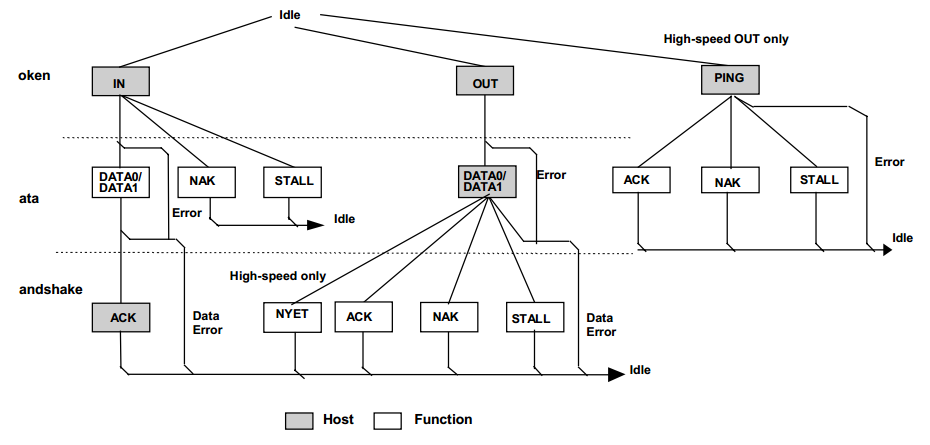

The error detection and retransfer mechanism in USB is done by hardware. If this transfer has error, the DATA packet will not be inverted and the packet will be retransferred. At the same time, the receiving end receives consecutive DATA packets with the same PID, which will be considered as retransfer packets. USB allows less than 3 consecutive transfer errors, if more than 3 times, the host considers the endpoint function error (STALL) and abandons the transfer task of the endpoint.

## USB applications

This chapter is not about the real USB applications, but about the design of the application layer that lies above the USB driver layer. This chapter will explain in detail the basic concepts and working principles of USB from the user's point of view, in order to facilitate the user's familiarity and mastery of the basics and usage of USB.

### Basic concept

The relationship between USB hardware devices and software devices is that a USB hardware device can correspond to one or more software devices, depending on the user's enumeration information (configuration descriptor information). A software device is a virtual device in which the PC abstracts the interface of a hardware device, a class that implements the same function, and can be operated in a uniform manner. A software device contains one or more interfaces, an interface contains one or more endpoints (endpoints will be explained below), and interfaces and endpoints are all concepts in a hardware device.

An Endpoint is the smallest unit in a USB device that can send and receive data. Except for Endpoint 0 (which is fixed for bidirectional control transfer), all other endpoints support only unidirectional communication, that is, input endpoints (data flow from device to host) or output endpoints (data flow from host to device). The number of endpoints supported by the device is limited to a maximum of 2 groups of endpoints (2 inputs, 2 outputs) for low-speed devices and a maximum of 15 groups of endpoints for high-speed and full-speed devices, in addition to the default endpoint 0.

The Interface is a collection of endpoints that make up a basic function in a USB device, and is the object controlled by the USB device driver (the host will virtualize a USB device that can be operated directly on the PC according to the interface, the virtual device is a USB device class). From the host, a USB device can consist of one or more interfaces, such as a USB device with an integrated mouse and keyboard, they have two Interfaces, one for the keyboard and the other for the mouse; for example, an audio device is composed of an interface for command transmission and an interface for data transmission.

The summary is as follows:

Endpoint: An endpoint is the only identifiable part of a USB device that is the end point of the communication flow between the host and the device, and is a data buffer on a USB device or host that is used to store and send various data from the USB.

Interface: can be understood as a function.

Configuration: For the combination of interfaces, select which combination during the connection.

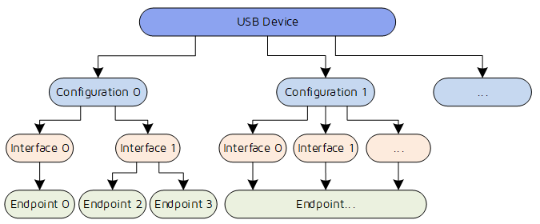

## Standard descriptor

The Descriptor is data knot used to describe the attributes of a device and it is divided into standard descriptor and proprietary descriptor. Standard descriptor is common to all USB device classes, including device descriptor, configuration descriptor, interface descriptor, endpoint descriptor, and string descriptor, among which string descriptor is divided into serial number descriptor, product descriptor, vendor descriptor, and language ID descriptor. Proprietary descriptor is unique to each device class, such as HID class unique descriptor has HID descriptor, report descriptor and entity descriptor, and so on. The following figure shows the standard device request structure specified by the USB protocol.

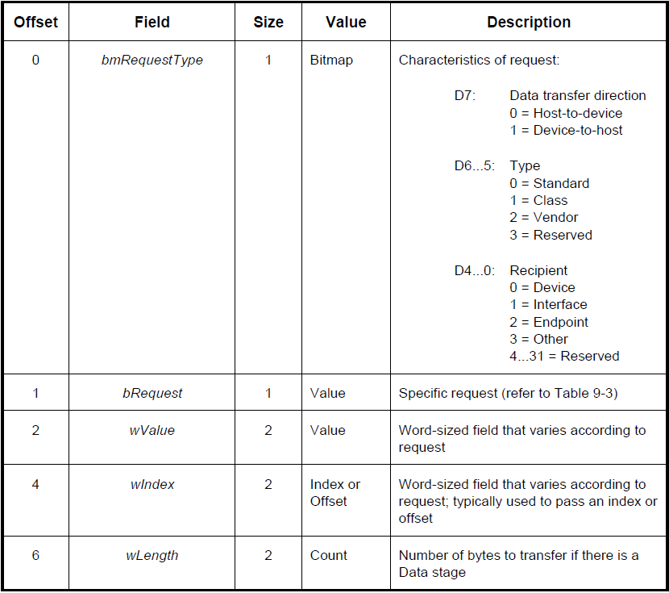

### Device descriptor

A device descriptor describes the basic information of a USB device, which has only one device descriptor. The following diagram presents the structure of a standard device descriptor. The first 8 bytes summarize the basic properties of USB, which is the first information the host has to obtain in the USB enumeration.

----------------------------------------------------------------------------------------------------------------------------------------------
Offset  Field                           Size  Value          Description
------- ------------------------------- ----- -------------- ---------------------------------------------------------------------------------
0       bLength                         1     Digital        Number of bytes in this description table

1       bDecriptorType                  1     Constant       Type of descriptor (here it should be 0x01, which is device descriptor)

2       bcdUSB                          2     BCD code       USB device description version number (BCD code) of this device compatible with the description table

4       bDeviceClass                    1     Class          Equipment class code.

5       bDeviceSubClass                 1     Subclass       Subclass mask

6       bDevicePortocol                 1     Protocol       Protocol code

7       bMaxPacketSize0                 1     Digital        Maximum packet size for endpoint 0 (only 8,16,32,64 are legal values)

8       idVendor                        2     ID             Vendor id (assigned by the USB-IF organization)

10       idProduct                      2     ID             Product id (assigned by the manufacturer)

12       bcdDevice                      2     BCD code       Device issue number (BCD code)

14       iManufacturer                  1     Index          The index value of the string descriptor describing the vendor information.

15       iProduct                       1     Index          The index value of the string descriptor describing the product information.

16       iSerialNumber                  1     Index          The index value of the string descriptor describing the device serial number information.

17       bNumConfigurations             1     Digital        Number of possible configuration descriptors

-----------------------------------------------------------------------------------------------------------------------------------------------

**Note:**

>- idVendor(VID) and idProduct(PID) are used to uniquely identify a device, but for the Windows system, given only the VID and PID, it does not uniquely identify the device, which behaves as a non-stop installation of new drivers. At this point, you also need to consider the serial number string, that is, only when the VID, PID and serial number are consistent, Windows only need to install the driver once.
>- The index values of the three string descriptors should be different values (except 0).

### Configuration descriptor

A configuration descriptor defines the configuration information of a device. A device can have multiple configuration descriptors.

--------------------------------------------------------------------------------------------------------------------------------------
Offset  Field                           Size    Value        Description
------- ------------------------------- ------- ------------ ----------------------------------------------------------------------------
0       bLength                         1       Digital      The length of the byte count of this description table.

1       bDescriptorType                 1       Constant     Configure description table type (0x02 here)

2       wTotalLength                    2       Digital      Total length of this configuration information (including configuration, interface, endpoint descriptors)

4       bNumInterfaces                  1       Digital      Number of interfaces supported by this configuration

5       bCongfigurationValue            1       Digital      Use as a parameter in the SetConfiguration(x) request to select this configuration

6       iConfiguration                  1       Index        Description of the string description table index for this configuration (0 - none)

7       bmAttributes                    1       Bitmap       Configuration features: D7: Reserved (set to one); D6: Self-powered; D5: Remote wake-up; D4..0: Reserved (set to one)

8       MaxPower                        1       mA           Bus power consumption in this configuration, in units of 2mA

--------------------------------------------------------------------------------------------------------------------------------------

### Interface descriptor

The interface descriptor describes the configuration provided by the interface. The number of interfaces owned by a configuration is determined by the bNumInterfaces of the configuration descriptor.

--------------------------------------------------------------------------------------------------------------------------------------
Offset  Field                         Size    Value       Description
------- ----------------------------- ------- ----------- ----------------------------------------------------------------------------
0       bLength                       1       Digital     Number of bytes of this table

1       bDescriptorType               1       Constant    Interface description table class (should be 0x04 here)

2       bInterfaceNumber              1       Digital     Interface number, the index of the array of interfaces supported by the current configuration (starting from zero).

3       bAlternateSetting             1       Digital     The index value of the optional setting.

4       bNumEndpoints                 1       Digital     Number of endpoints for this interface, except endpoint 0

5       bInterfaceClass               1       Class       The value of the class to which the interface belongs

6       bInterfaceSubClass            1       Subclass    Subclass code .

7       bInterfaceProtocol            1       Protocol    Protocol code: bInterfaceClass and bInterfaceSubClass fields depending on the value.

8       iInterface                    1       Index       The index value of the string description table describing this interface.

--------------------------------------------------------------------------------------------------------------------------------------

### Endpoint descriptor

Each endpoint in a USB device has its own endpoint descriptor, the number of which is determined by the bNumEndpoint in the interface descriptor.

-----------------------------------------------------------------------------------------------------------------------------------
Offset  Field                        Size    Value         Description
------  ---------------------------  ------  ------------  ----------------------------------------------------------------------------
0       bLength                      1       Digital       Length of bytes of this description table

1       bDescriptorType              1       Constant      Endpoint description table class (should be 0x05 here)

2       bEndpointAddress             1       Endpoint      Address and direction of the endpoints described in this description table: 
                                                           Bit 3..0 : Endpoint number. The endpoint number cannot be repeated in the change configuration; 
                                                           Bit 6..4 : Reserved, zero; 
                                                           Bit 7: Direction, omitted if the control endpoint. 
                                                           0: Output endpoint (host to device). 
                                                           1: Input endpoint (device to host).

3       bmAttributes                 1       Bitmap        The characteristics of the endpoint. Bit 1..0 :Transfer type 00=Control transfer 01=Isochronous transfer 10=Bulk transfer 11=Interrupt transfer

4       wMaxPacketSize               2       Digital       The maximum packet size that this endpoint can receive or send in the current configuration. For interrupt transfer, bulk transfer and control transfer, endpoints may send packets shorter than this.

6       bInterval                    1       Digital       The interval at which the host polls this endpoint, is ignored for bulk and control transfer endpoints; for isochronous transfer endpoints, it must be 1; for interrupt transfer, it is 10 to 255 (ms) here for low-speed mode and 1 to 255 (ms) for full-speed mode.

------------------------------------------------------------------------------------------------------------------------------------

### String descriptor

The String descriptor is optional. If string descriptor is not supported, all string descriptors within their device, configuration, and interface descriptors must have an index of 0. Language string descriptors have an index of 0.

---------------------------------------------------------------------------------------------------------------------------------
Offset  Field                 Size    Value          Description
------  --------------------  ------  -------------  ----------------------------------------------------------------------------
0       bLength               1        Digital       Number of bytes for this description table (value N + 2 for the bString field)

1       bDescriptorType       1        Constant      String description table type (here should be 0x03)

2       bString               N        Digital       UNICODE encoded strings

---------------------------------------------------------------------------------------------------------------------------------

## USB enumeration

The Enumeration is that the host reads some information from the device side to know what kind of device it is and how it communicates, so that the host can load the appropriate driver based on this information. When debugging USB devices, it is important to check the USB enumeration, as long as the enumeration is successful, it has been mostly successful. The following USB enumeration sequence diagram (figure (a) below) and the Telink mouse class USB enumeration example (figure (b) below) are to introduce the USB enumeration process in detail.

### USB enumeration sequence

The USB enumeration sequence diagram is given in the figure below, from which we can see that the USB enumeration process is divided into 8 steps to complete, where Step 1 to 7 is the standard USB enumeration process, and Step 8 is the USB device class proprietary enumeration process.

 USB enumeration sequence diagram")

- Step 1	After the host detects a device access: first, the host determines whether the device is a low-speed device or a full-speed device based on the level status on the differential signal line (high-speed devices are considered to be full-speed devices by default at the initial power-up); then the host waits for the device power to stabilize (>=100ms) and sends a reset signal to the device (D+ and D- all low for >=10ms); finally, if it is a high-speed device and the host (Hub) supports high-speed mode, the device can switch to high-speed mode after the host and the device perform high-speed detection and handshake, otherwise it still maintains full-speed mode.

- Step 2	After Step 1, the host will use endpoint 0 (default endpoint, control transfer) and send a GetDescriptor request (device address is 0). After the device receives the request, it will send its own device descriptor to the host, and the host will take the next action based on this device descriptor (bMaxPacketSize0 field). It should be noted that: (1) only the device receives the reset signal in Step 1 to respond to the host; (2) the device that has completed the enumeration does not respond to the request; (3) the length of the descriptor is at least 8 bytes (bMaxPacketSize0 field is in the 8th byte); (4) if the device timeout without respond or responds incorrectly, the host will start again and try three times, and if still cannot get the correct response for three times, the host will consider the device as an unrecognizable device (the same below).

- Step 3	After the host correctly completes Step 2 and obtains the maximum packet length for endpoint 0, it resets the device, after which the packets will be unpacked and grouped according to that length.

- Step 4	The host assigns a non-zero address to the device that is different from the other devices on the hub and is used to ensure the stability of directed communication. After the host completes addressing the device, communication between the host and the device will continue at the new address until the device is reset or removed.

- Step 5	The host gets the standard descriptors (device descriptor, configuration descriptor, interface descriptor, endpoint descriptor and string descriptor) of the device in order according to the new address of the device in Step 4. Note: (1) the host has already obtained the length of the device descriptor in Step 2, so the host specifies the length (the maximum length is the length of the device descriptor) to get the device descriptor, other descriptors are obtained by finding the maximum length 255, the device end only needs to send according to the actual length; (2) the interface descriptor and endpoint descriptor of the device may be included in the configuration descriptor. The host will retrieve all the data for the configuration based on the wTotalLength field in the configuration descriptor. (3) If the device has more than one configuration, the host will divide it into multiple times to request the configuration descriptors; (4) The host will request the string descriptors according to the number of string descriptors contained in the descriptors of the device, configuration, interface and endpoint, according to their index values. And the index value of 0 is special string descriptor (voice information descriptor).

- Step 6	After completing Step 5, the host obtains the actual length of the configuration descriptor, and in turn obtains the configuration descriptor information and other information contained in the configuration descriptor (such as interface descriptor and endpoint descriptor, and so on).

- Step 7	Step 1\~6 is the standard USB enumeration process. Only when Step 1\~6 are all correct, the host issues the SetConfiguration command to activate and use a configuration of the device, and then the device is truly available. After the device is configured, the host will split the device into one or more virtual devices based on the standard descriptor of the device.

- Step 8	After Step 7 is completed, one or more virtual devices are generated on the host, and each virtual device has its class identification. The host will look up the corresponding driver according to its VID, PID and serial number, and install the driver (if it has backup on the host, it will be used directly and not installed anymore). Then, the host loads the corresponding class-exclusive description information according to the driver. The standard HID device is given here, and the host comes with the driver.

### USB enumeration example

The following figure (b) is the enumeration process when Telink Dongle is used as a mouse device, Step x in the figure corresponds to Step x in the above figure (a). Step 8 is the HID device class proprietary enumeration process, that is, to obtain the report descriptor, the structure of the report descriptor can be referred to the USB HID protocol Universal Serial Bus (USB)-Device Class Definition for Human Interface Devices (HID).

 Enumeration flow when Telink Dongle is a mouse device")

## USB hardware introduction

The Telink USB hardware module internally solidifies the processing of raw packets and transactions, automatically completes the saving of IN endpoint data and the sending of OUT endpoint data, and packages the data of endpoint 0 into standard user packets, which not only improves the efficiency of USB execution but also minimizes the difficulty of USB development.

## USB endpoint

### Endpoint configuration

Telink USB supports USB1.1 protocol and adopts external power supply mode. The DP pin has a 1.5k pull-up resistor (optional for users), users can set the analog register to enable (set to 1) or disable (set to 0) the USB function, and the default is off. Telink USB has 9 endpoints, i.e. endpoint 0 and endpoints 1\~8, the endpoints 1, 2, 3, 4, 7 and 8 can be configured as input endpoints, while endpoints 5 and 6 are configured as output endpoints. Endpoint 0 can only use control transfer, endpoints 1\~8 support three other transfer modes except control transfer. In audio applications, endpoints 6 and 7 are isochronous transfer endpoints by default (users can turn off the isochronous transfer function of endpoints 6 and 7 by clearing bit6 and bit7 of digital register 0x38). The endpoint 6 supports synchronous output and endpoint 7 supports synchronous input.

|Configurable endpoint type|Endpoint number|
|--------------------------|---------------|
|Control endpoints (both inputs and outputs)|0|
|Output endpoint|5, 6|
|Input endpoint|1, 2, 3, 4, 7 and 8|

### Endpoint memory allocation

Telink USB uses 8+256 bytes USB exclusive RAM to cache the data of each endpoint, the RAM address of endpoint 0 is fixed and the size is 8 bytes, the rest of the endpoints share 256 bytes. The user can configure the address registers as needed to set the starting location of each endpoint data. The cache size of the endpoint is the starting address of the next endpoint minus the starting address of this endpoint. The USB endpoint resource allocation chart is calculated based on the default configuration in the table below (USB Endpoint Register Default Allocation Table). The hardware will store the received data into the corresponding buffer or take data from the corresponding buffer and send it to the host according to the user's configuration. It should be noted that the user should calculate the address of each endpoint when configuring the address register, otherwise it may trigger data overwriting problems.

|Endpoint starting address|Meaning|
|-------------------------|-------|
|0x00|Endpoint 1 starting address|
|0x08|Endpoint 2 starting address|
|0x10|Endpoint 3 starting address|
|0x20|Endpoint 6 starting address|
|0x30|Endpoint 7 starting address|
|0x40|Endpoint 4 starting address|
|0x80|Endpoint 8 starting address|
|0xc0|Endpoint 5 starting address|

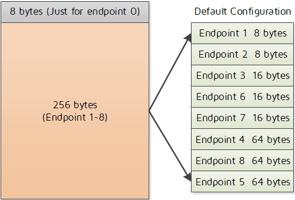

**Note:**

>- The endpoint cache size is determined by the following two conditions:
     a) At the starting point of each endpoint, the cache size of the endpoint is the starting address of the next endpoint minus the starting address of this endpoint. For example, if endpoint 1 starts at 0x00 and endpoint 2 starts at 0x08, the endpoint 1 has a cache size of 0x08 bytes. The default endpoint addresses are not ordered by endpoint 1-8, but by the starting address of the endpoint.
     b) The endpoint cache maximum is determined by the max register (except for endpoint 7, which can be allocated to all cache space) and defaults to 64 bytes, so the cache size for each endpoint should not exceed 64 bytes maximum.
>- The endpoint starting address only works for endpoint cache allocation if it is used in an enumerated device. For example, usb audio only uses endpoints 6 and 7, the other default starting addresses, do not work for cache allocation.

## Interrupt

The USB interrupts can be divided into three types, endpoint 0 interrupt, endpoints 1-8 interrupts and suspend/250us/reset interrupts, shown as below.

----------------------------------------------------------------------------------------------------------------------------------------
Interrupt                         Generation conditions                    									Automatic or manual clearing
--------------------------------- ------------------------------------------------------------------------- ----------------------------
CTRL_EP_SETUP(IRQ7)   			  Endpoint 0 control transfer setup phase  									Clear status manually

CTRL_EP_DATA (IRQ8)   			  Endpoint 0 control transfer data phase   									Clear status manually

CTRL_EP_STATUS (IRQ9) 			  Endpoint 0 control transfer state phase  									Clear status manually

Endpoint(1-8) interrupts(IRQ11)   1. Except for synchronous endpoints										Clear status manually
FLD_USB_EDP8_IRQ (in)			  Output endpoint: host out transaction, the corresponding position 1 of 
FLD_USB_EDP1_IRQ (in)			  the status register, generating interrupt, after receiving return ACK.
FLD_USB_EDP2_IRQ (in)			  Input endpoint: After the data is filled, configure ACK, notifies the 
FLD_USB_EDP3_IRQ (in)			  hardware and generates an interrupt, and the hardware sends the data 
FLD_USB_EDP4_IRQ (in)			  to the host upon receipt of the host in transaction.
FLD_USB_EDP5_IRQ (out)			  2. Synchronous endpoints
FLD_USB_EDP6_IRQ (out)			  Endpoints 6, 7 can be set as synchronous endpoints and timed at 1ms 
FLD_USB_EDP7_IRQ (in)			  to generate an interrupt.

USB_IRQ_USB_SUSPEND (IRQ24)		  USB bus idle, for example, unplug USB port, host hibernate				Clear status manually

USB_IRQ_250us (IRQ34)			  250us timed interrupt														Clear status manually

USB_IRQ_RESET (IRQ35)			  Host sends reset timings													Clear status manually
----------------------------------------------------------------------------------------------------------------------------------------

**Note:**

>- Driver enumeration process transfers are handled by polling and no interrupts are used.

## Automatic and manual modes

Telink USB has two modes, namely automatic mode and manual mode:

Users can set the configuration register of endpoint 0 to control whether to choose automatic mode or manual mode. The default configuration register of Endpoint 0 is 0xFF, which is auto mode, when all codecs related to USB endpoint 0 are automatically driven by Telink hardware, and Telink comes with a driver for Print device. Use endpoint 8 as the endpoint of the control interface, from which printer data is sent to endpoint 0.

The Manual mode requires the user to modify the EDP0CFG register (as below), typically by setting bit[7] and bit[5] to 0, that is, the user is to complete the enumeration of the standard USB and use the user-defined descriptors.

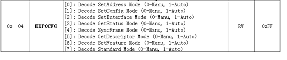

## USB software fundamental

## USB operation flow

The software operation flow of Telink USB can be divided into two phases, namely the initialization phase and the cyclic detection phase, as shown in the figure below.

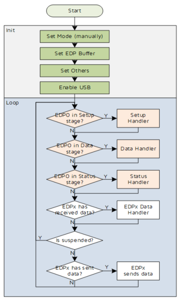

During the initialization phase it mainly completes the USB-related configuration and enables USB. The USB configuration options include mode switching (auto mode and manual mode), setting USB data buffer and setting other configuration items; mode switching is mainly to switch the USB working mode to manual mode, at this time the related enumeration process and descriptors are controlled by the user, and the device will report the enumeration information prepared by the user to the host; setting USB buffer is to assign a buffer to the related endpoints (total buffer size 256 Bytes, endpoints not used do not need to be specified) according to the usage of their endpoints (except endpoint 0); setting other configurations is used for other configuration operations, users can choose to configure themselves if they do not want to use the system default configuration items, such as interrupt form transferring data, and so on.

The main purpose of the loop detection is to constantly check whether there is data in the data receive and send buffers, and if there is data, then the relevant operation will be performed, and usb_handle_irq will be executed repeatedly during the program run. The operation process of endpoint 0 can be divided into three stages, as shown in the figure below, which correspond to the SETUP stage, DATA stage and STATUS stage of the control transfer, mainly to complete the USB identification and configuration, such as USB enumeration which is completed in the main loop; SETUP parses the commands sent by the host and prepares the corresponding data according to the host's commands; DATA sends the data prepared in the data stage to the host or receives the data sent by the host; STATUS is the handshake process between the two sides.

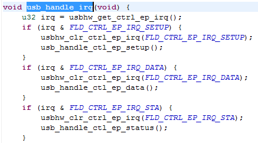

## Data receiving and sending

### Data receiving

Telink USB data receiving is done by the hardware, which will save the received data into RAM, and the hardware will generate an interrupt to notify the user after the receiving is completed, and the user only needs to read the data after the interrupt is detected. Data detection and receiving should be performed in the usb_handle_irq function in usb.c. Combined with the following diagram, the processing flow of Telink USB data receiving is analyzed in detail:

(1) The user needs to check if the relevant interrupt identification bit (reg_usb_irq) is set to 1. If it is set to 1, the data reception stage is entered.

(2) Once the data has been detected, the user needs to clear the interrupt identification bit, that is reg_usb_irq = BIT((USB_EDP_CUSTUM_OUT & 0x07)).

(3) Before the user can read the data, he needs to use reg_usb_ep_ptr(USB_EDP_CUSTUM_OUT) to get the length of the received data.

(4) After the user gets the data length, he can get all the data received this time by repeatedly reading usbhw_read_ep_data(USB_EDP_CUSTUM_OUT).

(5) After the user receives the data, he needs to set the call to usbhw_data_ep_ack(USB_EDP_CUSTUM _OUT). (Note that this step is important, only when the ACK of the OUT endpoint is set up, the hardware will go to receive the data sent down to that endpoint by the host and generate an interrupt when the receiving is complete.)

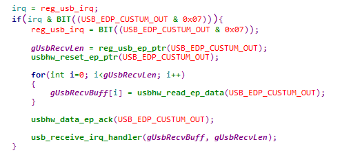

### Data sending

Telink USB data sending is done by hardware just like data receiving, user only needs to fill the data into the corresponding USB RAM and set the data ACK bit to 1. Before filling the data, user needs to first detect if there is pending data in the USB RAM, if there is pending data, you need to wait for the completion of sending before filling the new data, otherwise the data overwrite will occur.

The following figure gives an example of sending data in the Telink SDK. The following is a detailed analysis of the USB data sending process with this example:

(1) Before sending data, the user needs to detect if the operating endpoint is busy, and if it is busy (data to be sent), it needs to wait until the sending is completed before filling the data.

(2) If the endpoint is idle, the endpoint counter needs to be reset first, that is reg_usb_ep_ptr(USB_EDP _CUSTUM_CMISC_IN) = 0.

(3) After resetting the endpoint counter, the user can fill the endpoint with data. Note that reg_usb_ep_dat(USB_EDP_CUSTUM_CMISC_IN) = data[i] puts the data into the USB RAM (hardware operation).

(4) After the user fills the data, he needs to call reg_usb_ep_ctrl(USB_EDP_CUSTUM_CMISC_IN) = FLD_EP_DAT_ACK to inform the hardware that the data is ready and the hardware will send the data to the next host when it requests it after receiving this command.

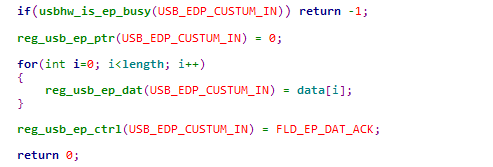

## USB demo

The USB application mainly introduces the USB standard device class HID (Human Interface Device) device, Audio device, CDC (Communication Device Class) device simple application, customers can freely combine according to the needs.

The HID class devices are common types of USB devices, which are USB devices that interact directly with people, such as USB mouse, USB keyboard.

The most common USB Audio devices are microphones and speakers.

The CDC class of USB is the abbreviation for the USB communication device class, and the virtual serial device is a type of CDC class device.

In the header USB_DEMO/app_config.h you can choose to configure it as different devices.

```C
#define 	USB_MOUSE 			1
#define 	USB_KEYBOARD		2
#define 	USB_MICROPHONE		3
#define 	USB_SPEAKER		 	4
#define 	USB_CDC 			5
#define 	USB_MIC_SPEAKER 	6

#define 	USB_DEMO_TYPE		USB_MOUSE
```

### USB mouse

#### Mouse processing flow

The USB HID devices transfer data via report. A report descriptor can describe multiple reports, and different reports are identified by their ID, which is the first byte of the report. When no report ID is specified, the report has no ID field and starts with data. Detailed information on the report descriptors can be found in the USB HID protocol and in the HID Usage Tables.

First the host identifies the Telink USB as a mouse device, which needs to go through an enumeration stage, and after the device is successfully enumerated, it enters the data sending and receiving stage. According to the content of mouse report descriptor, there are 4 bytes in the descriptor with report ID USB_HID_MOUSE. The low 5 bits of the 1st byte word indicate whether the key is pressed or not, and the high 3 bits are constant and useless; the 2nd byte is the amount of X-axis change; the 3rd byte is the amount of Y-axis change; and the 4th byte is the amount of scroll wheel change. The report is returned by the function usbmouse_hid_report( USB_HID_MOUSE ,mouse,4).

In the Demo program, the array unsigned char mouse[4] is defined, where mouse[0]: BIT(0) - left key; BIT(1) - right key; BIT(2) - middle key; BIT(3) - side key; BIT(4) - external key. The corresponding bit is set to 1, which means the corresponding mouse button is pressed; mouse[1]: the amount of change relative to the x coordinate; mouse[2]: the amount of change relative to the y coordinate; mouse[3]: the amount of change of the scroll wheel.

#### Mouse test

**Press test**

In the demo program, report ID: USB_HID_MOUSE=1,

Assignment of the array mouse: mouse[0]=BIT(1), mouse[1]= -2 (code complement), mouse [2]=2, mouse[3]=2.

Ground pin PD1 on the development board and then unplug it, the function usbmouse_hid_report(USB_HID_ MOUSE,mouse,4) will be executed.

You can observe that the on the desktop right mouse button is pressed and the mouse cursor is moved down to the left, as in the figure below, and also from the USB packet capture tool Input Report[1]: x:-2,Y:2,wheel:0,Btns=[2].

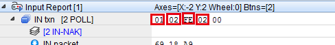

**Release test** 

The same operation as PD1 is performed on pin PD2, the mouse array is cleared to zero and the key is released.

### USB keyboard

#### Keyboard processing process

According to the contents of the keyboard report descriptor, there are input and output reports, where the input report specifies 8 bytes and the 8 bits of the first byte indicate whether the special key is pressed or not.

BYTE0 : BIT(0) - Left Ctl ; BIT(1) - Left Shift ; BIT(2) - Left Alt ; BIT(3) - Left GUI 

BIT(4) - Right Ctl; BIT(5) - Right Shift; BIT(6) - Right Alt; BIT(7) - Right GUI 

The second byte is a reserved value, both are 0. 

BYTE1: 0

Bytes 3 to 8 are common key value. When no key is pressed, all 6 bytes are 0. The first byte value of these 6 bytes is the key value of the key, and when more than one key is pressed at the same time, the key values are returned at the same time, and the order of the keys in the array is irrelevant. Please refer to the HID Usage Table document for specific key values. For example, 0x59 corresponds to numeric keypad 1; 0x5a corresponds to numeric keypad 2; 0x5b corresponds to numeric keypad 3; 0x39 corresponds to case-switching key.

#### Keyboard test

**Press test**

In the demo program, define the array kb_data[6] and assign the values kb_data[0] = 0; kb_data[1] = 0; kb_data[2] = 0x59; kb_data[3] = 0x5a; kb_data[4] = 0x39; kb_data[5] = 0;

Ground pin PC1 on the development board and then unplug it, the function usbkb_hid_report_normal(0x10, kb_data ) will be executed, where parameter 1 corresponds to the first byte and parameter 2 is an array corresponding to 3~8 bytes.

It can be observed that in the edit window input screen, the numbers 1 and 2 will be entered and the right Ctrl key and capslock key pressed.

As shown in the figure below, you can also see from the USB packet capture tool Input Report: Keys=[Rctrl 1 2 CapsLk]


**Release test**

Perform the same operation on GPIO_PC2 as GPIO_PC1, special keys and kb_data array are cleared to zero and keys are released.

### USB MIC

#### MIC processing flow

Take AMIC for example, the USB microphone device is the device's AMIC data through the USB transfer to the host, you need to ensure that the entire data channel sampling rate and channel number match. In Demo program, the main data upload to the USB part is different, Mic endpoint interrupt is 1ms timing interrupt, also 1ms into an interrupt. According to the different sampling rate, 1ms generate different amounts of data, for example, 16K sampling rate receive sounds, mono data, 1 sample for 2 bytes, 1ms data for 32bytes, correspond to the audio buff will be filled into the USB SRAM.

#### Mic demo test

In Audio-related tests, we use the help of Audacity software, as shown in the figure below microphone choosing Telink Audio16, speaker choosing PC speaker.

Device Mic receive sounds, PC speaker playback, if recorded vocals can be played through the speaker without distortion, indicating that the Mic works properly.

")

### USB speaker

#### Speaker handling process

The USB speaker device is transferring the audio data from the host to the device via USB, and this process is also done in a 1ms interrupt, reading the length of the USB SRAM data and filling the corresponding data to the audio buff.

#### Speaker demo test

In Audacity software, select PC Microphone for microphone and Telink Audio16 for speaker. We use the output audio interface (3.5mm headphone jack). If the recorded vocals can be played out through the headphones without distortion, it means that the speaker is working properly.

")

### USB CDC

The CDC device has two interfaces, a CDC control interface and a CDC data interface. The control interface allocates endpoint 2, as an interrupt input endpoint transfer. The data interface allocates endpoint 5 (out), endpoint 4 (in), and must first set the ACK of endpoint 5 up before the endpoint can receive data from the USB host.

#### CDC processing flow

USB Installation of CDC Device

The first time the host is recognized as a CDC device, the .inf file needs to be installed manually, as shown in the following figure under the 8278_USB_Demo path.

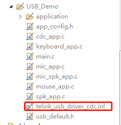

**Data receiving (host to device)**

In Demo program, in function void usb_cdc_irq_data_process(void) host send data to device, endpoint 5 generates interrupt, function usb_cdc_rx_data_from_host(usb_cdc_data) is for data receiving.

**Data sending (device to host)**

As shown in the figure below, in main_loop, when the received buff data length is judged to be non-zero, the received data is sent to host by the function usb_cdc_rx_data_from_host(usb_cdc_data).

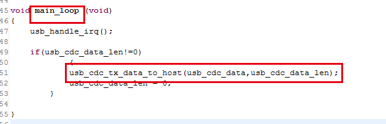

#### CDC demo test

The test phenomenon is shown in the figure below, which returns the data sent by the serial tool.

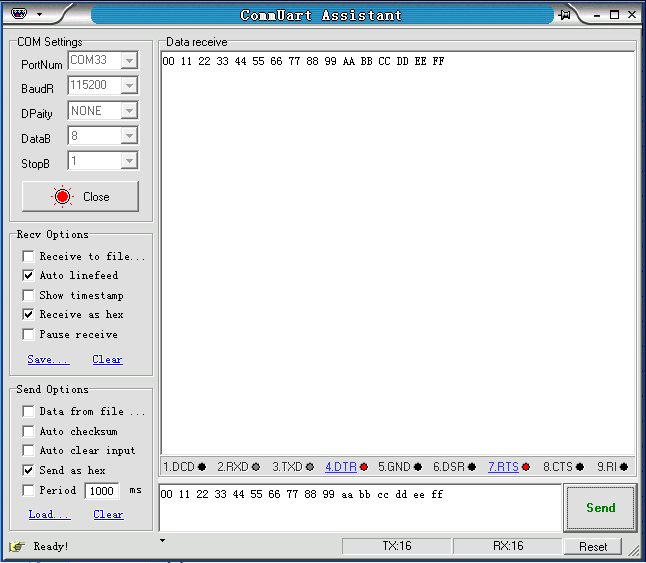


\newpage
# CPU performance test

One important measure of a processor is power consumption, and another important measure is performance. There are many benchmarks in the processor area, the most well-known and common benchmarks in the embedded processor area are Dhrystone and CoreMark.

## Dhrystone

The Dhrystone standard test method is simple, it is how many times the Dhrystone program is run per unit time, and its metric unit is DMIPS/MHz. The MIPS stands for Million Instructions Per Second, the number of million machine language instructions processed per second. The D in DMIPS is an abbreviation for Dhrystone, which indicates the MIPS under the Dhrystone standard test method, mainly used to measure integer computing power.

## CoreMark

The CoreMark program is written in C and contains the following four types of algorithms: mathematical matrix operations (normal matrix operations), enumeration (find and sort), state machine (used to determine whether the input stream contains valid numbers), and CRC (cyclic redundancy check). Similar to Dhrystone, the standard CoreMark test method is how many times the CoreMark program is run per unit of time under a certain combination of configuration parameters, with the metric unit of CoreMark/MHz. The higher CoreMark numbers mean the higher performance.

## Testing

Dhrystone_Demo and CoreMark_Demo are for Dhrystone and CoreMark tests, respectively, with the test information exported from the USB.

---------------------------------
Benchmarks  Test results  Remarks
----------  ------------  -------
Dhrystone   2.7 (DMIPS)   attach1

CoreMark    3.38          attach2
---------------------------------

**Note:**

>- To improve the test performance, the link file corresponding to the two demos is flash_boot_ramcode.link.

\newpage
# Audio

## Audio introduction

### Sound basic

Sound is an acoustic wave produced by the vibration of an object and is a mechanical wave. The audio recording process is an analog-to-digital conversion process and the playback process is the opposite.

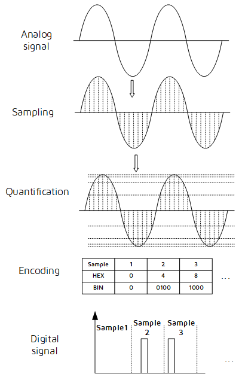

- Sampling: Taking a point at regular intervals for an analog signal.

- Quantization: scales the vertical coordinates and takes integer values according to an approximation so that the values of the points sampled are integers.

- Encoding: Encode the integer values obtained by quantization in binary.

- Digital signal: Transform the sequence of 0's and 1's obtained by encoding into a high and low level signal.

The whole analog-to-digital conversion process is called Pulse Code Modulation (PCM for short), and as can be seen from the above analog-to-digital conversion, the contents of the PCM format file are actually the encoded sequence.

### Basic concepts of sampled audio

**Sampling frequency:** Sampling is the digitization of an analog signal on a time axis, which is sampled (AD-converted) at a frequency more than twice the highest frequency of the sound according to Nyquist's Theorem (sampling theorem). Sounds with frequencies between 20 Hz and 20 kHz are recognizable to the human ear. This is why the sampling frequency is generally around 40 kHz, commonly used for music at 44.1 kHz (44,100 samples/second), 48 kHz, etc. The sampling rate for telephones is 8 kHz.

**Sampling bits:** The range of data that each sample point can represent. The number of sampling bits is usually either 8 bits or 16 bits, the greater the number of bits, the more detailed the variation in sound that can be recorded and the greater the corresponding amount of data. The 16-bit is the most common sampling accuracy.

**Number of channels:** The number of channels refers to the number of audio channels that can support different sound generation, commonly used are mono, stereo (left and right channel).

For example, the relevant parameters for CD sound quality are, sample bit width of 16 bits, sample rate of 44100, number of channels is 2, which is used to measure the volume size of the audio data per unit time, the data bit rate of CD sound quality is: 44100 \* 16 \* 2 = 1411.2 kbps.

**PCM audio data:** PCM is sampled and quantized uncompressed audio data, converted from analog signals into standard digital audio data by sampling, quantizing and encoding. In the case of mono audio files, the sampled data is stored sequentially in chronological order (in the case of dual channels it is stored in LRLR mode, the storage is also related to the big/small-endian of the machine). The big-endian mode is shown in the figure below.

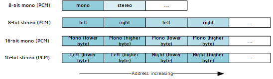

### I2S protocol

The I2S (Inter-IC Sound) bus, also known as the integrated circuit built-in audio bus, is a bus standard developed by Philips Semiconductors (now NXP Semiconductors) for the transmission of audio data between digital audio devices, which is used exclusively for data transmission between audio devices.

#### I2S signals

(1) Serial clock BCLK

The serial clock, BCLK, has a pulse for each bit of data corresponding to the digital audio.

(2) Frame clock LRCK

The frame clock LRCK is for switching data between left and right channels. LRCLK (Left/Right CLOCK), frequency of LRCK = sampling frequency.

(3) Serial data SDATA

It is the audio data expressed in binary complement, (MSB ---> LSB: the data is transmitted sequentially from high to low bits).

#### I2S data format

Depending on the position of the data relative to the LRCLK and BCLK, it is divided into I2S standard format (I2S), left-justified (LJ) and right-justified (RJ), and the same data format must be used on both the transmitter and receiver end.

**Note:**

>- The driver defaults to the I2S format.

(1) I2S format

The highest bit of the data is always at the 2nd BCLK pulse after the LRCLK change (i.e. the start of a frame) and the timing sequence is shown as below.

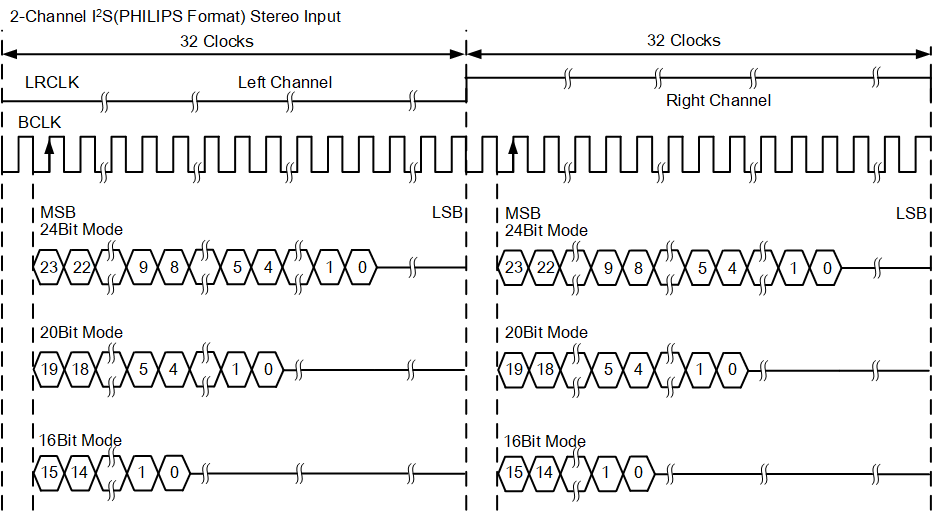

(2) LJ format

Data transmission starts at the same time as the LRCLK is flipped. Note that at this point when LRCLK is 1, the left channel data is transmitted, which is just the opposite of the I2S Philips standard. The left-aligned (MSB) standard timing sequence is shown as below.

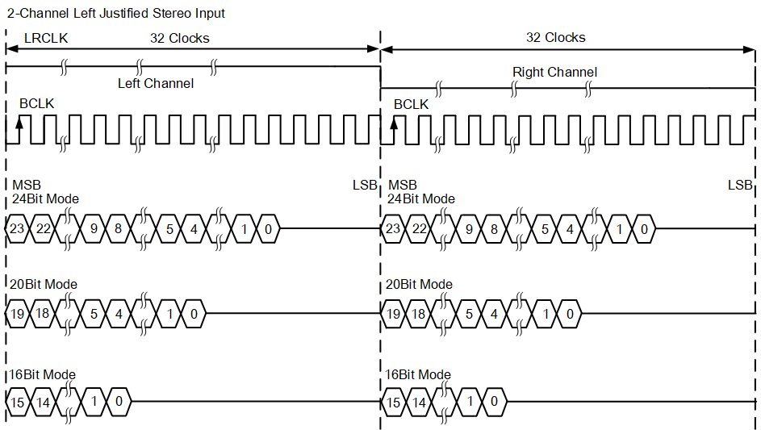

(3) RJ format

While the sound data LSB transmission is completed, the LRCLK completes its second flip (it just happens that the LSB and LRCLK are right-justified, hence called right-justified standard). Note that at this point when LRCLK is 1, the left channel data is transmitted.

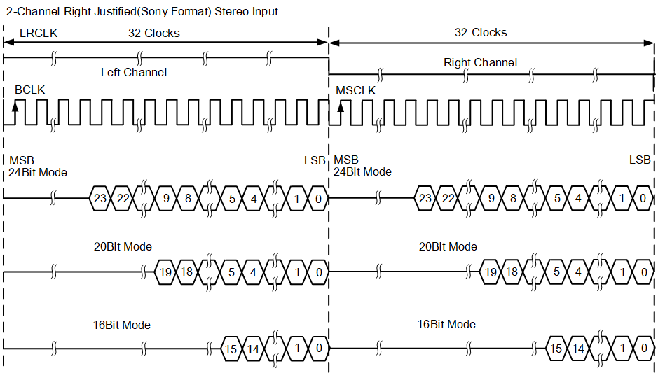

(4) DSP/PCM mode

The DSP/PCM mode is divided into two modes, Mode-A and Mode-B. Some of the datasheets for different chips write PCM mode and some write DSP mode. The I2S left and right channels are high and low respectively, PCM has only one start signal and the left channel data follows the right channel. In figure A below, the Mode-A data is at the first BCLK pulse. In figure B below, the Mode-B data is at the 2nd BCLK pulse.

")

")

## Audio structure

### CODEC introduction

As shown in the diagram below, the audio CODEC has an analog-to-digital converter (ADC). The CODEC converts the analog signal from the AMIC and Line-in inputs into an A/D conversion, turning the analog signal into a digital signal that the CPU can process; the digital-to-analog converter (DAC) converts signals such as PCM into a D/A conversion, converts the digital audio signal into an analog signal.

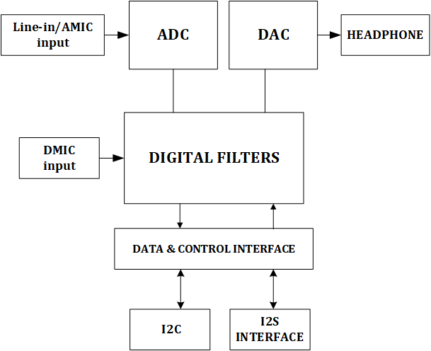

### Audio framework

As shown in the figure below, the audio module consists of 3 parts: the data input and output interfaces, which may vary from SoC to SoC, the I2S RX interface and the audio CODEC ADC interface at Input_Path, the I2S TX interface and the CODEC DAC interface at Output_Path; the FIFO and DMA that make up the data interaction interface (blue box); BUFF for storing PCM data (orange box).

- Input_Path：The CODEC passes the A/D converted digital signal into the BUFF or directly passes the data into the BUFF via the I2S RX interface.

- Output_Path：D/A conversion of signals such as PCM from BUFF, converting digital audio signals to analog signals or direct output via I2S TX.

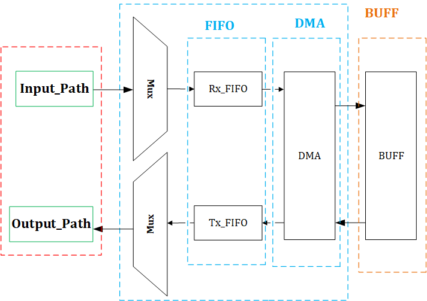

### Audio I2S clock

As shown in the figure below, when the SoC as master to accommodate different sampling rates (LRCLK), supporting 8K/16K/32K/48K/44.1K, it is necessary to set different dividing factors to calculate the corresponding sampling rate, where the Audio module clock source of MCLK clock and I2S_CLK are directly from PLL = 192M, then I2S_CLK is divided to BCLK and LRCLK.

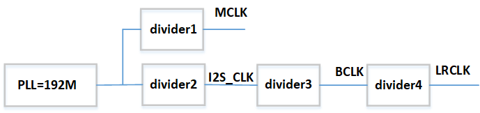

In which, MCLK=PLL/diver1, LRCLK=PLL/divder2/divider3/divider4.

## Audio driver

### DMA transfer

The audio data transfer is via DMA (Direct Memory Access). The working mechanism of DMA and Audio BUFF are introduced below.

#### DMA transfer mechanism

The DMA transfer is the direct sending of data from a peripheral device to internal memory without CPU, or, from internal memory to an external device without CPU. The transfer action itself is implemented and completed by the DMA controller, and the transfer process does not require the involvement of the CPU. As shown in the following figure, the audio FIFO and BUFF data interaction is transferred via DMA, with the source address of the recording (Rx) DMA being the first address of Rx_FIFO with a depth of 8 words and the destination address being the first address of Rx_BUFF with a depth that can be configured. The playback (Tx) DMA has a destination address of the first address of Tx_FIFO with a depth of 8 word and a source address of the first address of Tx_Buff with a depth that can be configured. If Rx_BUFF and Tx_BUFF share a common BUFF, then the destination address of Rx and the source address of Tx are the same.

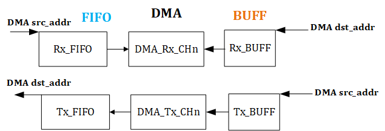

#### DMA link transfer

The audio data streams are generated without interruption. DMA transfers are completed once and then the next transfer requires configuration of the relevant control registers and DMA length to trigger the DMA transfer again. The DMA linked list can solve this problem, using the linked list method can complete the function of continuous transfer without CPU involvement. The DMA linked list includes the following contents: DMA control, src_addr, dst_addr, DMA length and LLP_ptr (the address of the next linked list). After the DMA has completed the first transfer, set the head of the linked list (Head_of_list) and the DMA will be transferred according to the contents of the linked list configuration and then linked to the next  linked list for transfer, and the cycle repeats.

(1) DMA ping-pong buff link transfer

The following figure shows the link transfer of a ping-pong buff with Tx as an example. Create the header node Head_of_list first, and then add two linked lists to the circular linked list, Tx_dma_list[0] and Tx_dma_list[1], with Tx_dma_list[0] corresponding to the source address Tx_BUFF[1], Tx_dma_list[1] corresponding to Tx_BUFF[0]. According to its flow, the data of Tx_BUFF[0] is carried first, then the data of Tx_BUFF[1] is carried according to the linked list header LLP pointing to Tx_dma_list[0], the data of Tx_BUFF[0] is carried according to the LLP in Tx_dma_list[0] pointing to the Tx_dma_list[1], then LLP in turn points to Tx_dma_ list[0], which closes to form a ping-pong buff.

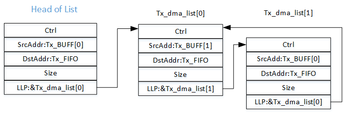

(2) DMA single buff link transfer

As shown in the figure below, in the case of Tx, the ping-pong buff is used to make the LLP of the Tx_dma_list point to itself, and to send a DMA is to carry the data of a single Tx_BUFF all the time.

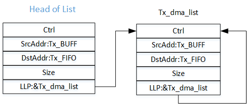

### Audio buff working mechanism

Audio uses a ring buff, Rx for recording and Tx for playback. Data is transferred via DMA, with the source address of DMA for Rx being the audio peripheral FIFO address and the destination address being the RX_BUFF first address, and the source address of DMA for Tx being Tx_BUFF and the destination address being the audio peripheral FIFO address.

#### Rx Path

As shown in the figure below, Rx_BUFF with BUFF_size length set , the recording data is moved into Rx_BUFF by DMA to obtain rx_wptr which is maintained by hardware (the way it is obtained varies from chip to chip). Record rx_rptr according to the software fetch data operation from Rx_BUFF, maintained by the software. The red line part is the readable data length read_len which has below conditions:

- rx_wptr > rx_rptr, read_len = rx_wptr - rx_rptr;

- rx_wptr < rx_rptr, read_len = buff_size - (rx_rptr - rx_wptr).

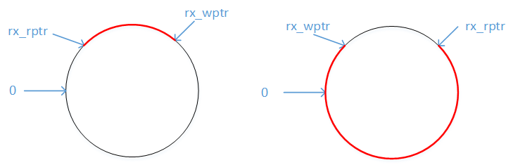

#### Tx Path

As shown in the figure below, Tx_BUFF with BUFF_size length is set, and the playback is to move the BUFF data out of BUFF by DMA to obtain tx_rptr maintained by hardware (the way it is obtained varies from chip to chip). Record tx_wptr according to the software fill data operation to Tx_BUFF, maintained by the software. The red line is the length of the writable data write_len which has below conditions:

- tx_rptr > tx_wptr, write_len = tx_rptr - tx_wptr;

- tx_rptr < tx_wptr, write_len = buff_size - (tx_wptr - tx_rptr).

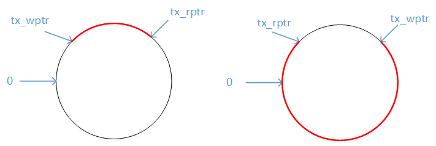

### Audio_Demo

In the header of audio demo, configure the macro AUDIO_MODE in app_config.h to select the different audio modes.

--------------------------------------------------------------------------------------------------------------------------
Demo                                  Function
------------------------------------- ------------------------------------------------------------------------------------
LINEIN_TO_LINEOUT                     The analog audio is fed in at the input jack, with speakers or headphones connected at the output jack to hear the CODEC-processed audio in real time.

AMIC_TO_LINEOUT                       AMIC recording, with CODEC-processed audio heard in real time by connecting speakers or headphones to the output jack.

DMIC_TO_LINEOUT                       DMIC recording, with a speaker or headphone connected to the output jack to hear the CODEC-processed audio in real time.

BUFFER_TO_LINEOUT                     The PCM data from the BUFF will be output through CODEC processing, and the audio from the BUFF (usually 1K sine wave) can be heard by connecting speakers or headphones to the output jack.

FLASH_TO_LINEOUT                      The PCM data in the flash is read out according to a certain way to fill in the AUDIO BUFF, and then output after CODEC processing, the audio in the flash can be heard in the output jack connected to the speaker or headphones.

EXT_CODEC_LINEIN_LINEOUT              The SoC's I2S interface interacts with an external CODEC (WM8731 for example), which is LINE_IN to LINE_OUT in external CODEC.
--------------------------------------------------------------------------------------------------------------------------

## Chip difference

### Difference between Input Path and Output Path

#### B91 Audio Input Path

Referring to Input_Path in the [Audio framework diagram](#audio-framework), as shown below, there are 2 types of audio input: I2S signals (AMIC/DMIC/LINE-IN) processed by the internal CODEC (all CODECs refer to the internal CODEC unless otherwise stated); and I2S signals input from the external CODEC.

**I2S input:**

The IO of the I2S interface is connected to an internal CODEC or an external CODEC via Mux selection. I2S supports I2S, LJ, RJ and DSP formats; the bit width supports 16bit, 20bit, 24bit and 32bit data formats. When transferring data I2S_Rx will convert the received serial I2S data into parallel data and write it to Rx_BUFF.

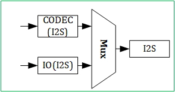

#### B91 Audio output Path

Referring to Output_Path in the [Audio framework diagram](#audio-framework), as shown below, there are 2 ways to output audio: audio data in Tx_BUFF, which is output to the internal CODEC or external CODEC via the I2S interface.

**I2S output:**

The audio data in Tx_BUFF is converted to serial I2S format by I2S_Tx and fed to an internal CODEC or an external CODEC.

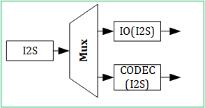

### Audio Demo difference

#### B91 LINEIN_TO_LINEOUT

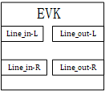

**Note:**

>- The ADC input supports single-ended and differential, the default is differential mode, while the DAC only supports differential output.
>- In MONO mode, you can select single left channel output or left and right channel output at the same time, when the data of both channels are the same, the default is the latter.
>- In STEREO mode, the left input corresponds to the left output and the right input corresponds to the right output.

#### AMIC_TO_LINEOUT

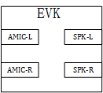

**Note:**

>- The ADC input supports single-ended and differential, the default is differential mode, while the DAC only supports differential output.
>- In MONO mode, for the input channel: the default is left channel as AMIC input, you can call audio_set_mono_chn interface to set it to right channel as AMIC input. For the output channel: you can choose single left channel output or left and right channel output at the same time, at this time the data of both channels is the same, the default is the latter.
>- In STEREO mode, the left input corresponds to the left output and the right input corresponds to the right output.

#### DMIC_TO_LINEOUT

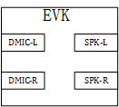

**Note:**

>- In MONO mode, single DMIC only need 2 signal lines of data and clk, the clk frequency is fixed at 3 MHz.
>- In STEREO mode, the left input corresponds to the left output, the right input corresponds to the right output, the dual DMIC has 1 signal line of data and 2 clks, the dual DMICs share data, the timing of the 2 clks is the same, the data of one DMIC is collected on the upper edge of the clk, the data of the other DMIC is collected on the lower edge of the clk.

#### BUFFER_TO_LINEOUT

The demo provides mono audio data at a frequency of 1KHz with a sample rate of 44.1Kbps, and mono audio data at a frequency of 1KHz with a sample rate of 48Kbps.

**Note:**

>- The first address of BUFF here is the source address of the DMA, using BUFFER as audio_buff.
>- Whether in MONO or STEREO mode, the output dual channel output will have a sample phase difference. Calling audio_invert_i2s_lr_clk to invert the i2s clk will eliminate the phase difference.

#### EXT_CODEC_LINEIN_LINEOUT

The demo implementation: the SoC's I2S interface interacts with an external CODEC (WM8731 for example), external CODEC LINE_IN to LINE_OUT.

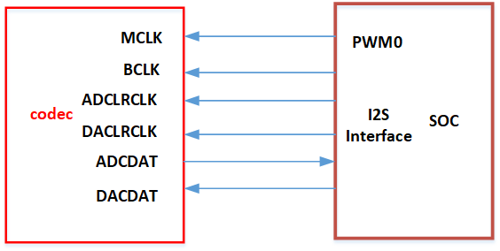

**Note:**

>- MCLK (12M) is provided using PWM0.
>- The default sample rate is 32Kbps, MONO, BIT_16.

#### FLASH_TO_LINEOUT

The demo function: the PCM data in the flash is read out in accordance with the fixed length filled into the AUDIO_BUFF, and then through the LINE_OUT output. Refer to [AUDIO BUFF working mechanism](#audio-buff-working-mechanism), the length of the BUFF is 4K (AUDIO_BUFF_SIZE), the flash data is very large and needs to be filled into the BUFF in batches.

**B91 audio module has no valid interrupts to fill and fetch audio data:**

- The recording data is moved into Rx_BUFF by the DMA in the unit of word, and the destination address of the DMA is self-adding by 4 each time, returning to 0 after self-adding to BUFF_size-4. The offset of the destination address relative to the first address of Rx_BUFF is noted as rx_wptr.

- The playback is to move the BUFF data out of the BUFF by the DMA in the unit of word, and the DMA source address is self-added by 4 each time, returning to 0 after self-adding to BUFF_size-4. The offset of the source address relative to the first address of Tx_BUFF is noted as tx_rptr.

The function interface is introduced first:

```C
u32 audio_get_tx_dma_rptr (dma_chn_e chn) //The parameter chn is configured as a tx dma channel to obtain the corresponding channel dma source address
```

The source address of the initialization DMA is configured as the first address of audio_buff. The size of audio_buff is 4K, the playback is to move the buff data out of the buff by DMA in the unit of word, the source address of DMA will add 4 at each move, returning to 0 after the addition to buff_size-4. The source address of DMA minus the first address of audio_buff address, which characterizes the state of the hardware read at audio_buff, noted as the read pointer tx_rptr:

```C
tx_rptr= ((audio_get_tx_dma_rptr (DMA3)-(u32)audio_buff));
```

And the write state of audio_buff_buff, maintained by software, is noted as tx_wptr, referring to the formula for calculating [Tx Path](#tx-path) in the AUDIO BUFF working mechanism, the remaining writable space of audio_buff is coded as below:

```C
if((tx_wptr&(AUDIO_BUFF_SIZE - 1))>tx_rptr)
    {
        unused_buff=AUDIO_BUFF_SIZE-(tx_wptr&(AUDIO_BUFF_SIZE-1))+tx_rptr;
    }
    else
    {
        unused_buff=tx_rptr-tx_wptr;
    }
```

For example, if the BUFF is filled by fixed length of data (AUDIO_THD_SIZE), its flow in while (1) is as follows.

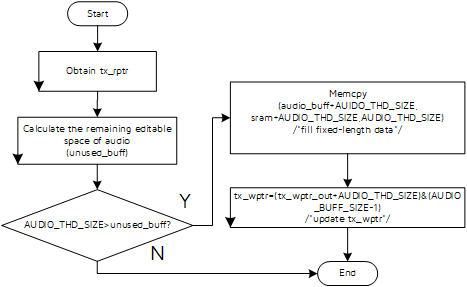

**Note:**

>- The ADC input supports single-ended and differential, the default is differential mode, while the DAC only supports differential output.
>- In MONO mode, you can select single left channel output or left and right channel output at the same time, when the data of both channels are the same, the default is the latter.
>- In STEREO mode, the left input corresponds to the left output and the right input corresponds to the right output.
