## Desktop shortcuts

The Telink IoT studio installer will create 2 shortcuts on the desktop:

- `Telink IoT studio`: used to launch the IoT Studio.
- `Telink TC32 console`: used to launch the development console for TLSR8, users can input commands like `tc32-elf-gcc` and `make` in it.

## Different IDEs

The following 3 different IDEs will be referred to in this user guide:

- `Telink IoT studio`: the IDE contains this document.
- `Telink old IDE`: the IDE list on this wiki page ([IDE for TLSR8 Chips](http://wiki.telink-semi.cn/wiki/IDE-and-Tools/IDE-for-TLSR8-Chips/)) for TLSR8 chips.
- `Telink RDS IDE`: the IDE list on this wiki page ([IDE for TLSR9 Chips](http://wiki.telink-semi.cn/wiki/IDE-and-Tools/RISC-V_IDE_for_TLSR9_Chips/)) for TLSR9 chips.

The above 3 IDEs have the following different desktop shortcut icons:

Telink IoT studio:


Telink old IDE:

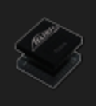

Telink RDS IDE:


## IoT Studio or integrated tools

- Build TLSR8 Projects and SDK
- Import and build TLSR9 Telink RDS Projects and SDK
- Telink Windows BDT used to flash image for both TLSR8 and TLSR9
- Telink libUsb version BDT used to flash image for both TLSR8 and TLSR9, still in beta phase.
- Jtag_Burn used to flash image for TLSR9 with JTAG

### Project property difference between Telink RDS and Telink IoT studio

## Ext HW DSP option

This option is used to configure whether to use the DSP and its libraries:

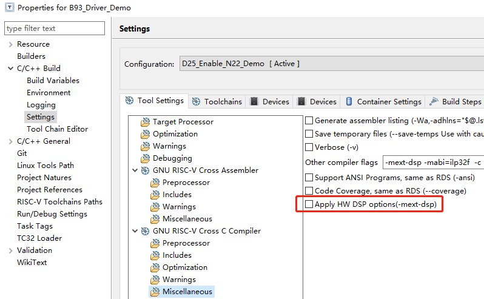

This option would add `-mext-dsp` flag to `cc` and `ld`, and also it would add `-lm` and `-ldsp` flags to linker in Telink RDS IDE. While the Telink IoT studio would only add `-mext-dsp` flag to `cc` and `ld` without the `-lm` and `-ldsp` extra libraries flags. This makes the configuration more flexible.

Users can add the `math` and `dsp` libraries to linker specifically on the linker library setting page:

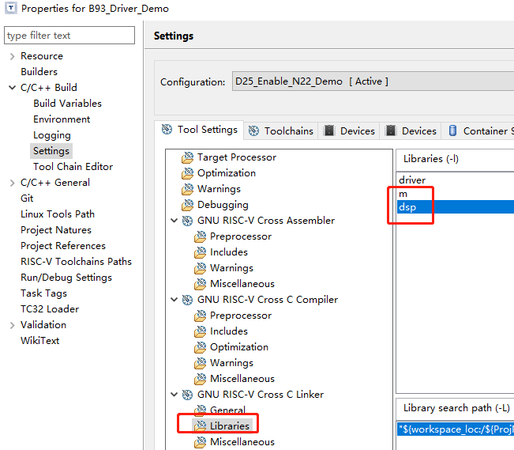

## `-msave-restore` and `-msmall-data-limit`

The `Telink RDS IDE` uses the IoT Studio built-in (default) value for both `-msave-restore` and `-msmall-data-limit` without options on configuration page, while the `Telink IoT studio` has a more flexible configuration for these options.

Right now, users should use the `Use toolchain default value` option for TLSR9 chips.

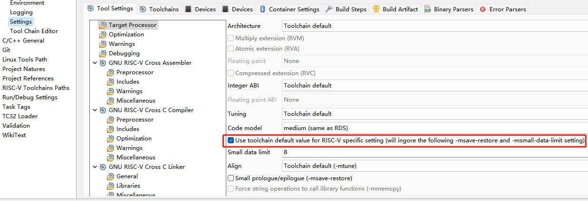

## Toolchain and build tool

## Toolchain information

The Telink IoT studio contains several toolchains for TLSR8 and TLSR9:

- Telink TC32 Cross Compiler with GCC version 4.5.1 (tc32-elf) for TLSR8 which is the same as [the Telink old IDE](http://wiki.telink-semi.cn/wiki/IDE-and-Tools/IDE-for-TLSR8-Chips/).
- Cross Compiler with GCC version 7.4 from Telink RDS IDE V3.2.3 for TLSR9 (D25F and N22 architecture) chips
- Cross Compiler with GCC version 10.3 from Telink RDS IDE V5.1.2 for TLSR9 (D25F and N22 architecture) chips
- Cross Compiler with GCC version 12.2 from Telink RDS IDE V5.3.0 for TLSR9 (D25F and N22 architecture) chips

### Toolchain location

We assume that the Telink IoT studio is installed at location `$IoTStudio`:

- Telink TC32 Cross Compiler with GCC version 4.5.1 (tc32-elf-1.5) for TLSR8: `$IoTStudio/opt/tc32/bin`
- Cross Compiler with GCC version 7.4 from Telink RDS IDE V3.2.3 for TLSR9 (D25F and N22 architecture) chips
  - N22: `$IoTStudio/RDS/V3.2.3/toolchains/nds32le-elf-mculib-v5`
  - D25F: `$IoTStudio/RDS/V3.2.3/toolchains/nds32le-elf-mculib-v5f`
- Cross Compiler with GCC version 10.3 from Telink RDS IDE V5.1.2 for TLSR9 (D25F and N22 architecture) chips
  - N22: `$IoTStudio/RDS/V5.1.2/toolchains/nds32le-elf-mculib-v5`
  - D25F: `$IoTStudio/RDS/V5.1.2/toolchains/nds32le-elf-mculib-v5f`
- Cross Compiler with GCC version 12.2 from Telink RDS IDE V5.3.0 for TLSR9 (D25F and N22 architecture) chips
  - N22: `$IoTStudio/RDS/V5.3.0/toolchains/nds32le-elf-mculib-v5`
  - D25F: `$IoTStudio/RDS/V5.3.0/toolchains/nds32le-elf-mculib-v5f`

## Select a different toolchain for TLSR9 projects

As only one toolchain is included for TLSR8, this section is only applied to TLSR9 chips.

To change the toolchain of a project, open the project properties, navigate to `C/C++ Build` --> `Settings` --> `Toolchains` tab, and select the different one from the drop-down list:

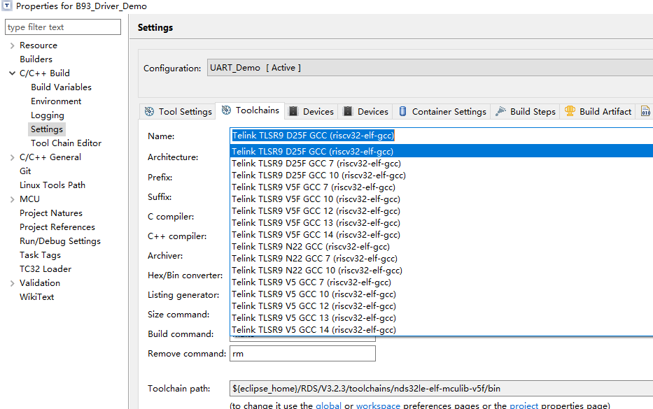

The listed toolchains are:

- `Telink TLSR9 D25F GCC`: for D25F architecture chips, from RDS V3.2.3
- `Telink TLSR9 D25F GCC 7`: same as `Telink TLSR9 D25F GCC`
- `Telink TLSR9 D25F GCC 10`: for D25F architecture chips, from RDS V5.1.2
- `Telink TLSR9 V5F GCC 12`: for D25F architecture chips, from RDS V5.3.0
- `Telink TLSR9 N22 GCC`: for N22 architecture chips, from RDS V3.2.3
- `Telink TLSR9 N22 GCC 7`: same as `Telink TLSR9 N22 GCC`
- `Telink TLSR9 D25F GCC 10`: for N22 architecture chips, from RDS V5.1.2
- `Telink TLSR9 V5 GCC 12`: for N22 architecture chips, from RDS V5.3.0

### Advanced usage: toolchain setting according to path

Normally, users shouldn't set the toolchain by changing toolchain path. Instead, a toolchain should be set with the method mentioned in the previous section: `Select a different toolchain for TLSR9 projects`.

This section is for advanced users with special requirements.

Open the project property dialog by clicking the Property menu item on right and click the pop-up menu on the project:

Switch to the `C/C++ Build` --> `Settings` --> `Toolchains` tab:

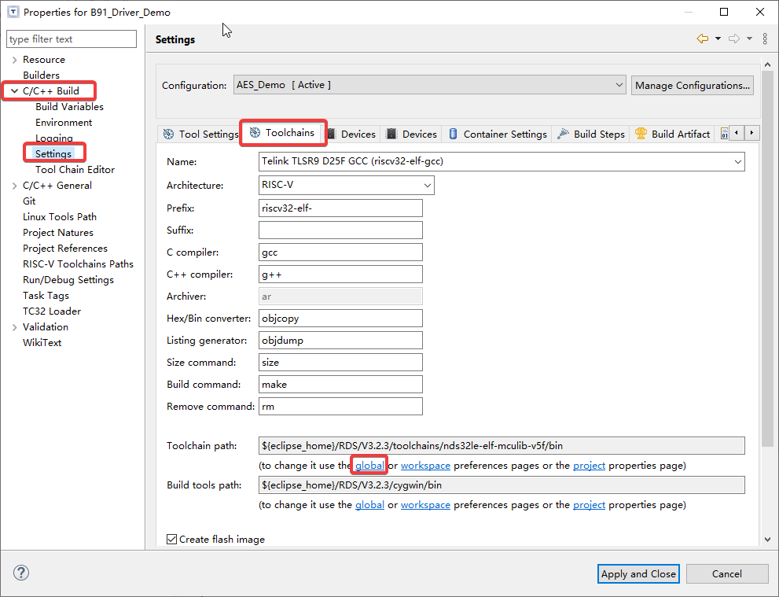

Click the `global` link text which is surrounded in red square block.

Set the path string in the line edit.

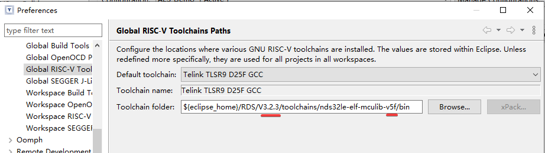

Normally, users would only be required to change the version and the suffix which are marked with red lines.

The first red line marks the toolchain base version string (in the image it is `V3.2.3`) of the toolchain, users can change it to one of the following items:

- `V3.2.3`: from Telink RDS IDE V3.2.3
- `V5.1.2`: from Telink RDS IDE V5.1.2
- `V5.3.0`: from Telink RDS IDE V5.3.0

The second red line indicates the version of the toolchain variants string (in the image it is `nds32le-elf-mculib-v5f`) of the toolchain, users can change it to one of the following items:

- `nds32le-elf-mculib-v5f`: for Telink TLSR9 D25F chips
- `nds32le-elf-mculib-v5`: for Telink TLSR9 N22 chips

Once the toolchain path variable has been changed, click the `apply and close` button to save it.

### Telink Smart Build Shortcut Button (Recommend)

We provide a shortcut button in the toolbar that can automatically configure the required build tool path based on your toolchain settings, as shown in the figure.

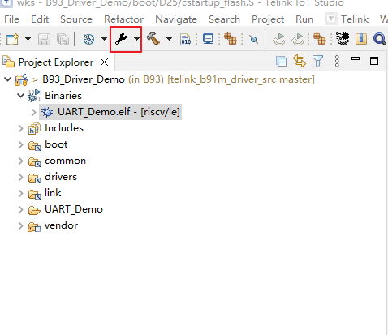

So when your projects require different versions of toolchains, you no longer need to worry about how to change the build tool path, just use this button to build it.

The following sections will explain how to change the corresponding build tool path based on the toolchain version, but this operation is not recommended now. The content of the following sections is only for compatibility with older versions

### Notice: base version matching (Old version, not reommended)

The build tool version and toolchain base version (the V3.2.3 or V5.1.2 string on the path of tools in above image) must be the same. Refer to the following section to verify and change the make tool version after you have changed the toolchain version.

### Examine the current set version (Required for Windows OS Only)

You can check the currently project used toolchain version from the project property.

Right click on the project, select the `Property` on the pop-up menu:

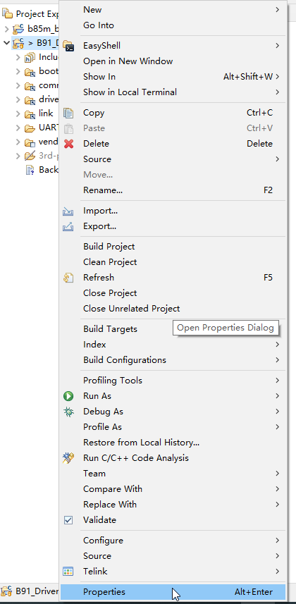

In the tab, we can get the `build tool` version and `toolchain` version:

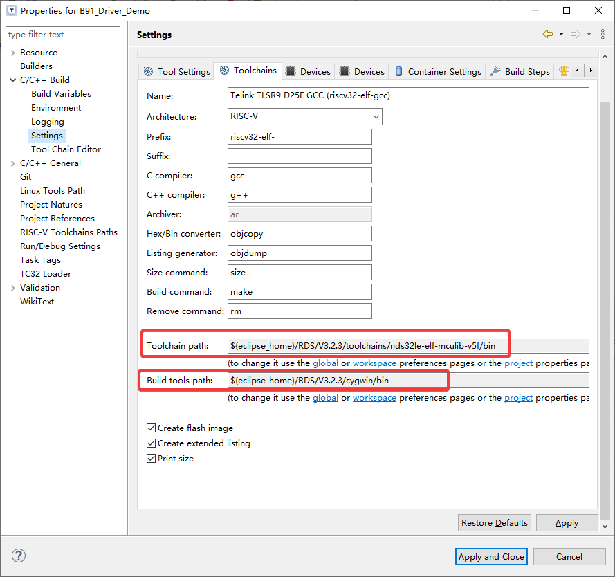

From the build tool and toolchain path string, we can find the version sub-string which begins from `V` after the `RDS`, in the above picture, both the `build tool` version and `toolchain` version are `V3.2.3`.

### Set global make tool version (Required for Windows OS Only and Not recommended for use now)

Make tool version should be set in global scope. Two ways of changing the global make tool version are described below. 

#### Set build tool version with chip type

Users can set the build tool version according to the chip type from the group `Set Build tool according to Chip type for TLSR9` :

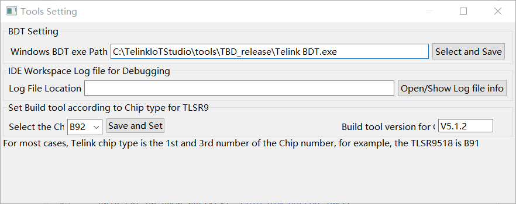

After changing the chip type, it's required to click the `Save and Set` button to make the change into effect, a restart of IoT Studio is required.

#### Set and check build tool version directly

To see the current global make tool version, you can click the menu item `Settings and Log` from the `Telink` menu.

The group `Set build Tool(make) Version` would show the make tool version.

The make tool version in the above section image is `V5.1.2`.

To change it to another version, select the target version from the combo list. Right now, only `V3.2.3` and `V5.1.2` are available. Then, click the `Save selected version`, a restart of IoT Studio is required. You can choose to restart it manually or automatically as the message box hint:

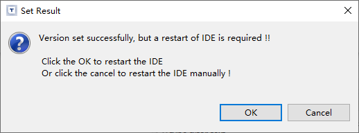

#### Notice

The global version implies a consistent version of the make tool that is accessible to all projects, matching the global version. Furthermore, if required, you can modify the PATH variable of a specific project's build configuration using the method provided in Chapter "`Building V3.2.3 and V5.1.2 Projects/Configurations Simultaneously`". After this adjustment, the make tool version for this specific build configuration will become independent of the global make tool version, and this operation will take precedence over the global make tool version.

### Building V3.2.3 and V5.1.2 projects/configurations Simultaneously (Only for Windows OS and not recommended)

In IoTStudio, the default version of make tool is used to build B92(V5.1.2) projects, if you want to build a B91(V3.2.3) project simultaneously, then you need to modify the PATH variable of this project's build configuration.

It should be noted that if you modify the PATH variable, you `must not share the .setting folder` when you want to share your project with others. Usually, the .setting folder and the .project file are in the same directory.

There are two ways to modify the PATH variable as follows.

#### Use the shortcut button

If the toolchain version is inconsistent with the global build tool version in the current build configuration, you can click the button in the picture below to automatically and correctly change the PATH.

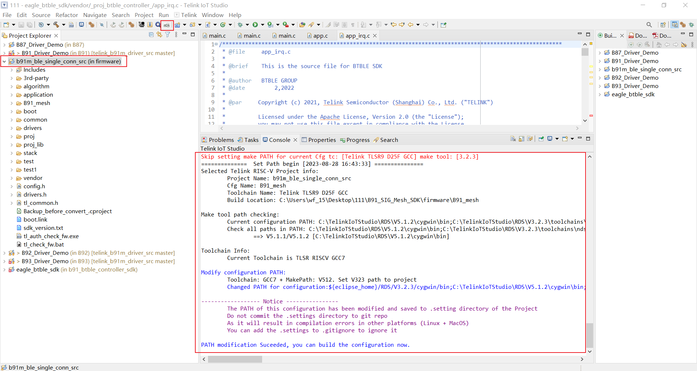

Again, this operation only takes effect for the current build configuration of the currently selected project.

#### Modify the PATH variable directly

You can add the following string `at the beginning of the PATH variable`, and this setting is only for `the current build configuration`. The PATH of other build configurations within the project and the global build tool version will not be changed.

- `${eclipse_home}/RDS/V3.2.3/cygwin/bin`

In the PATH variable, each path ends with a semicolon.

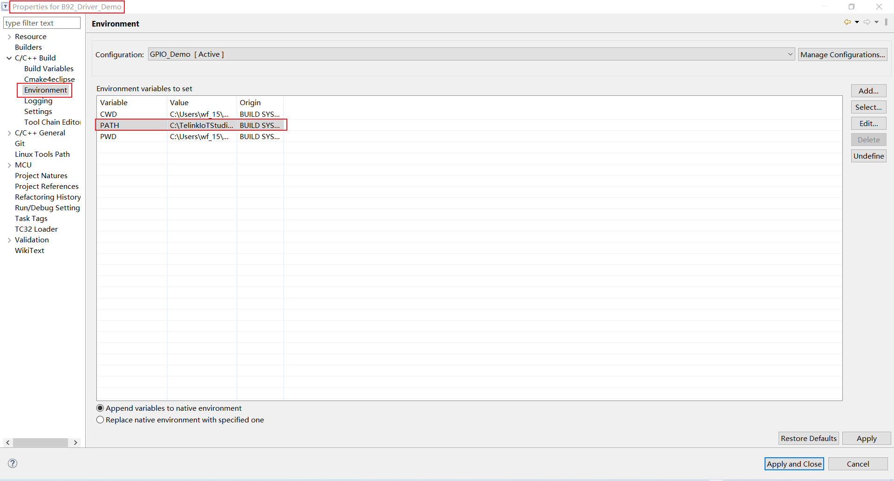

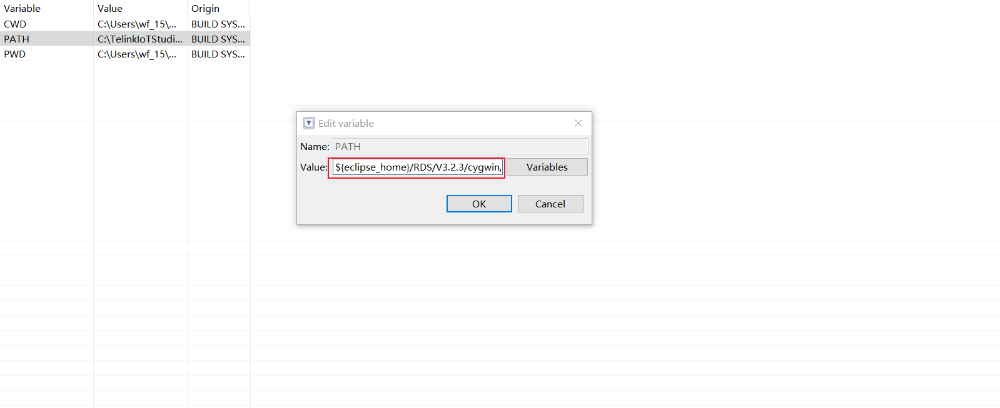

It should be noted that the above situation is just the default situation. If the current global version is V3.2.3(B91), then when you want to build B92(V5.1.2) projects, you can also refer to the above description. The string that needs to be filled in at the beginning of PATH becomes the following.

- `${eclipse_home}/RDS/V5.1.2/cygwin/bin`

## Import and build projects

### TLSR8

Telink IoT studio supports SDK or projects import function like the [Telink old IDE](http://wiki.telink-semi.cn/wiki/IDE-and-Tools/IDE-for-TLSR8-Chips/).

Users can use the `File` -> `Import...` to import SDK or projects:

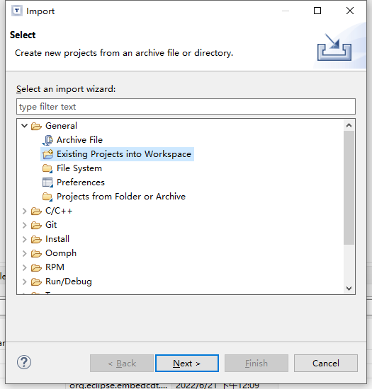

Users can refer to [this Telink wiki page](http://wiki.telink-semi.cn/wiki/IDE-and-Tools/IDE-for-TLSR8-Chips/).

### TLSR9

For `Telink RDS IDE` format projects( for example, the SDKs for TLSR9 chips at [Telink official wiki page](http://wiki.telink-semi.cn/wiki/)), it must be converted to `Telink IoT studio` format before importing it into the workspace.

Users can refer to the following `RDS to IDE converter` section on `Telink menu` chapter to view how to do it.

# Telink menu and toolbar entries

## RDS to IoT Studio converter

If you get the SDK or projects for TLSR9 chip `B91` from [Telink official wiki page](http://wiki.telink-semi.cn/wiki/), they are in `Telink RDS IDE` format, you can use this function to convert it to `Telink IoT studio` format before importing it into Telink IoT studio, and SDK or projects of `B92` do not require conversion.

Click the `Telink RDS to IDE Converter` in `Telink` menu:

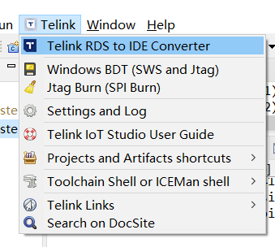

Click the `Select .cproject file` button in the dialog to choose the Telink RDS IDE format `.cproject` file.

In Linux OS, users can use `Ctrl + h` or other shortcut keys to show the hide files (`.cproject`), and the filter should be changed to `*`:

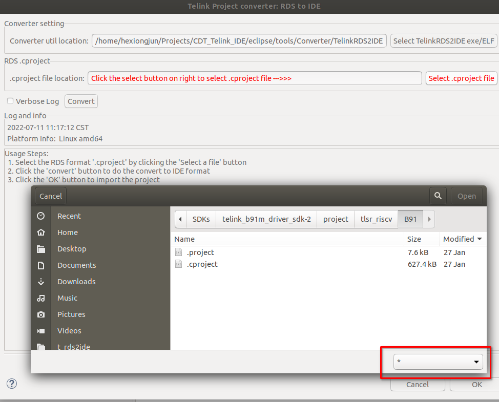

If a `.cproject` file has been selected, it will display the file path:

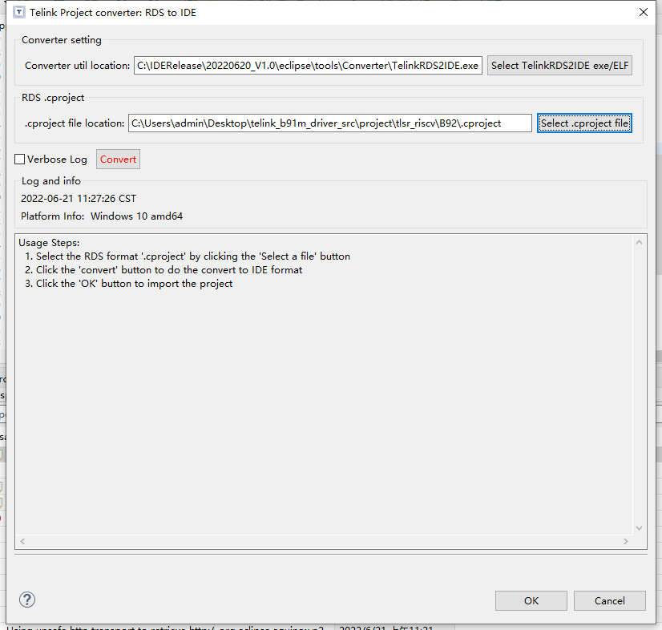

Then click the `convert` button, the result would show on the large text block:

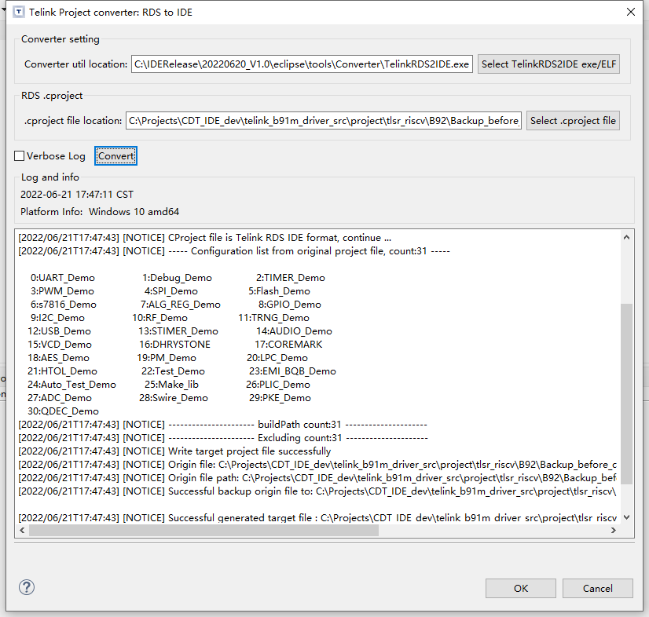

If it is fails, the background of log text block would be set to red. Users can copy and send the log to `Telink IoT studio` developer/FAE to get support.

### Using converter as a standalone utility

The converter can be used as a standalone utility, users can use it in command line.

The converter is installed at:

- Windows: $IoTStudio_PATH/tools/Converter/TelinkRDS2IDE.exe
- Linux: $IoTStudio_PATH/tools/Converter/TelinkRDS2IDE

To convert a `.cproject` file from command line in Windows OS, users can use following the command:

```
$IoTStudio_PATH/tools/Converter/TelinkRDS2IDE.exe Path/To/.cproject
```

In Linux OS:

```
$IoTStudio_PATH/tools/Converter/TelinkRDS2IDE Path/To/.cproject
```

### Notice

The converted project (`.cproject`) would set the toolchain to `Telink TLSR9 D25F GCC` by default, which will use the `Telink RDS IDE` 7.4 GCC Cross compiler for D25F.

## Jtag burn menu

The `Jtag_Burn` function is similar to the `Telink RDS IDE` Jtag_Burn function, both use the JTAG to burn the image to TLSR9X chips.

Except for the `Jtag_Burn`, TLSR9 can be burned with `Windows BDT` software through `SWS` protocol with `Burning EVK`, which is the recommended option.

The `SWS` protocol requires only one GPIO to flash the binary image to TLSR8 and TLSR9 chips, while the JTAG uses 2 or 4 GPIO pins for TLSR9 chips.

### Parameters

Once the Jtag_Burn dialog has been opened, users can fill or set parameters for Jtag_Burn and ICEMan:

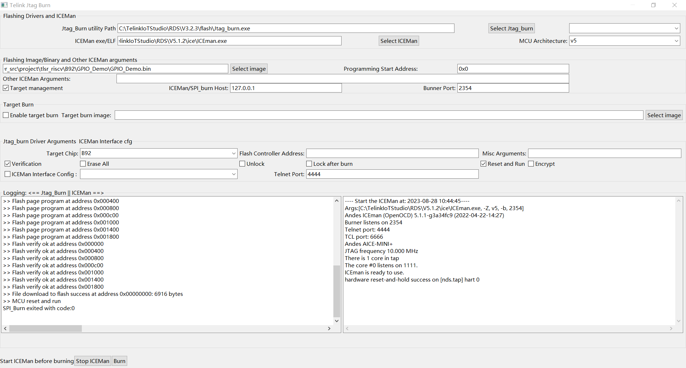

Parameters for `Jtag_Burn` can be set in `Jtag_Burn driver Arguments`.

### Use ICEMan in Jtag_Burn dialog

ICEMan is a tool to manage the TLSR9 JTAG ICE (support 4-wire and 2-wire mode).

Users can refer to the document files in the `doc` directory to get more information.

### ICEMan in Jtag_Burn ELF setting

Users can set the other ICEMan and Jtag_Burn ELF from `Flashing Drivers and ICEMan` section, the set/selected value will be saved and reused in next re-opening the dialog.

The normal ELF files' names are listed for reference:

- ICEMan: `ICEMan.exe` in Windows, and `ICEMan` on Linux OS
- Jtag_Burn: `Jtag_Burn.exe` in Windows, and `Jtag_Burn` on Linux OS

### Burn Program

When burning the program, pay attention to burner's path and chip type, and then click Start ICEman. After ICEman is ready, the telnet_port and burner_port should be consistent with ICEman's, then click Burn, as shown below:

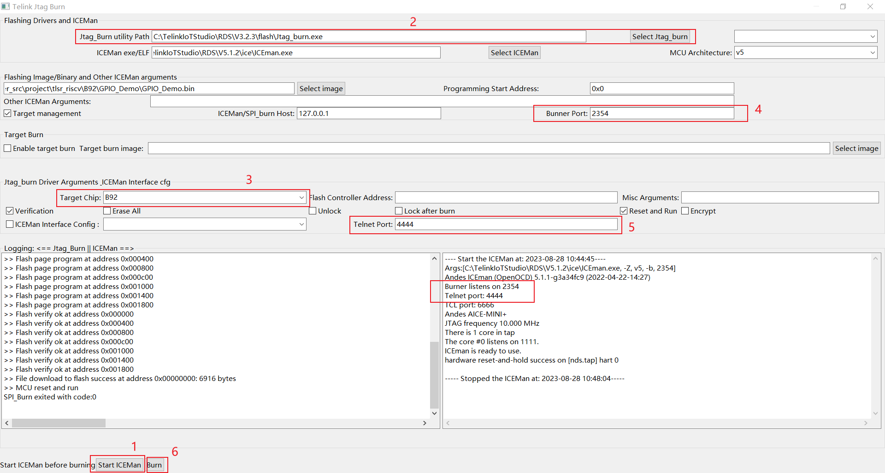

Jtag_ Burn is located in the $IoTStudio_PATH/RDS/V3.2.3/flash/directory, and its help documents are also in the same directory.

### Security Download

If you need to use the security download function of Jtag_Burn, check the encrypt checkbox

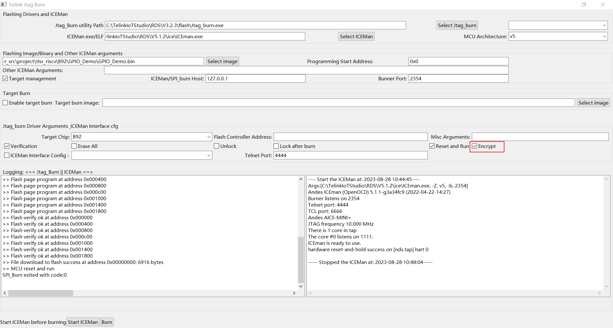

## Log and Settings

### Log

Users can click the button `Open/Show Log file info` to view the workspace log file content and the path will be set.

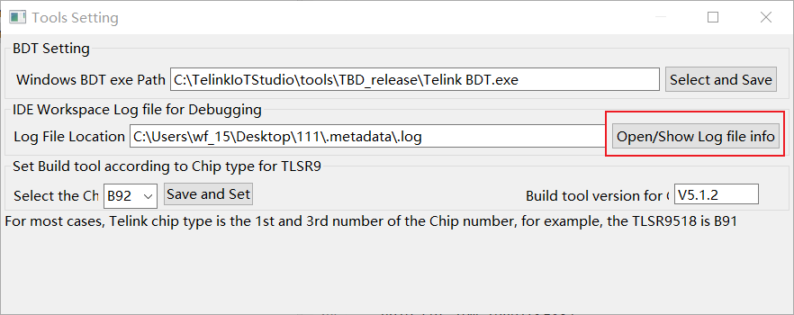

Users should attach this log file when submitting feedback problems or issues to Telink.

### Settings

Users can set the `Windows BDT` exe path at Windows BDT section, the set one will be saved and reused in `Windows BDT (SWS and JTAG)` menu.

## Telink links

In this sub-menu, users can quickly visit Telink websites for development resources or information:

- Telink forum
- Telink wiki
- Telink official webpage

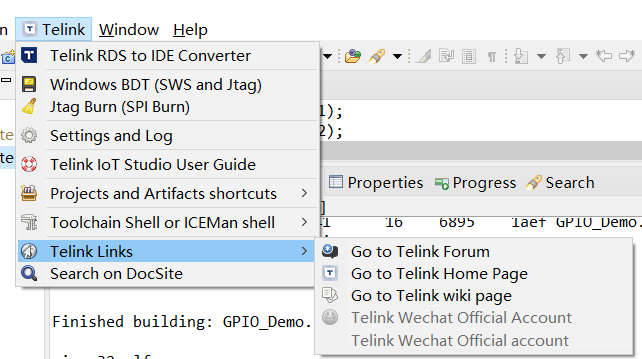

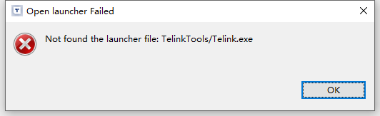

## libusb version BDT

The `libusb version BDT` is a new burning tool which is similar to `Windows BDT` for Windows OS and Linux OS, but this tool requires Burning EVK with new firmware. This tool can be used to flash the image to TLSR8 and TLSR9 chips through SWS. This tool is still in the beta phase. If this tool is not working on some Windows OS, use the `Windows BDT` (mentioned in the following `Windows BDT` section) instead.

Users can launch this tool and click the help on libUSB BDT menu to learn how to use it.

Clicking this menu entry would open the libusb version of BDT and pass the artifact bin path to it if a project has been selected and the artifact has been found, so users do not require to copy the artifact path manually:

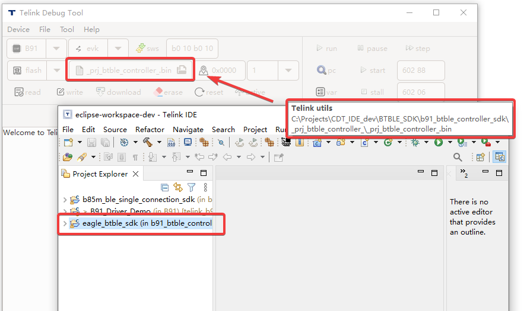

If no project is selected, a error dialog would show, users can close it, the libusb BDT program would be started normally as well:

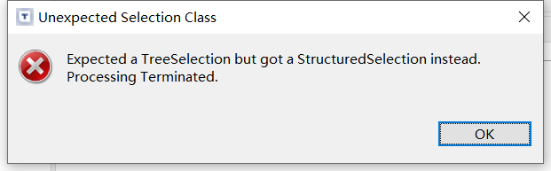

## Toolchain shell or ICEMan shell menu entry

This is a submenu, it has several menu entries to start the toolchain console or ICEMan console, users can input commands (for example: `riscv-elf-gcc` or `ICEMan`) in these shells.

It is worth noting that we provide two versions of ICEman. Under `${IoTStudio_Path}/RDS/V5.1.2/ice_cygwin_from_andes/`, there is the original version of ICEman, while under `${IoTStudio_Path}/RDS/V5.1.2/ice/`, there is a new version of ICEman used by IoTStudio by default. It has made some modifications to match the functionality of IoTStudio and currently does not support IPv6.

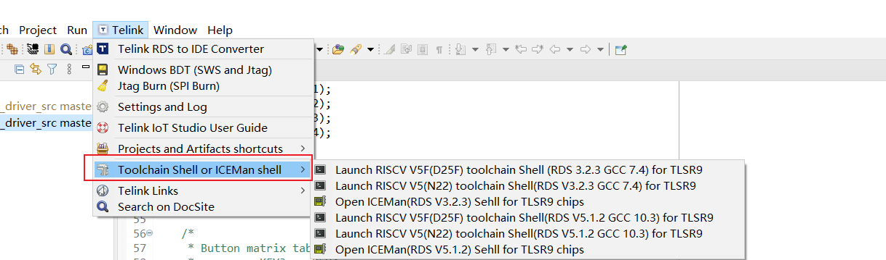

## Windows BDT

The `Windows BDT (SWS and JTAG)` menu item would open the standalone program `Windows BDT`. Users can use this tool to flash or debug the TLSR8 and TLSR9 chips.

Refer to [this wiki page](http://wiki.telink-semi.cn/wiki/IDE-and-Tools/Burning-and-Debugging-Tools-for-all-Series/) on how to use it.

## Open artifact path

There's an icon on the toolbar used to open the artifact directory:

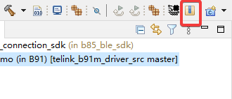

It wouldn't work if the project was not properly configured (the `.cproject` file), this occurs in many old TLSR8 SDKs.

While most TLSR9 SDK projects work as expected.

### Notice

The project or project file must be selected before clicking the icon, otherwise it will not work.

## Copy artifact path

The Telink IoT studio added a handy menu entry to help users copy the artifact path:

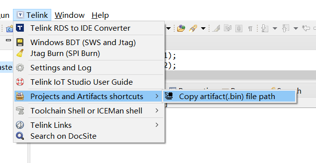

Users can click this icon to copy the artifact path to the system clipboard.

### Notice

The project or project file must be selected before clicking the icon, otherwise it will not work.

### In other places

The `Copy artifact path` menu entry also shows at toolbar and right-click the pop-up menu:

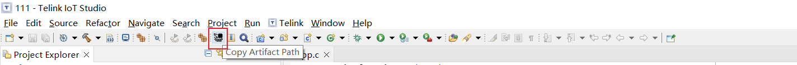

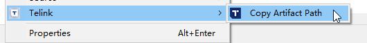

## Search on DocSite

This tool can be used to search for specific keywords in the Telink Document Center website. Double click a keyword in the project file and click 'Search on DocSite' to jump to the Document Center search page.

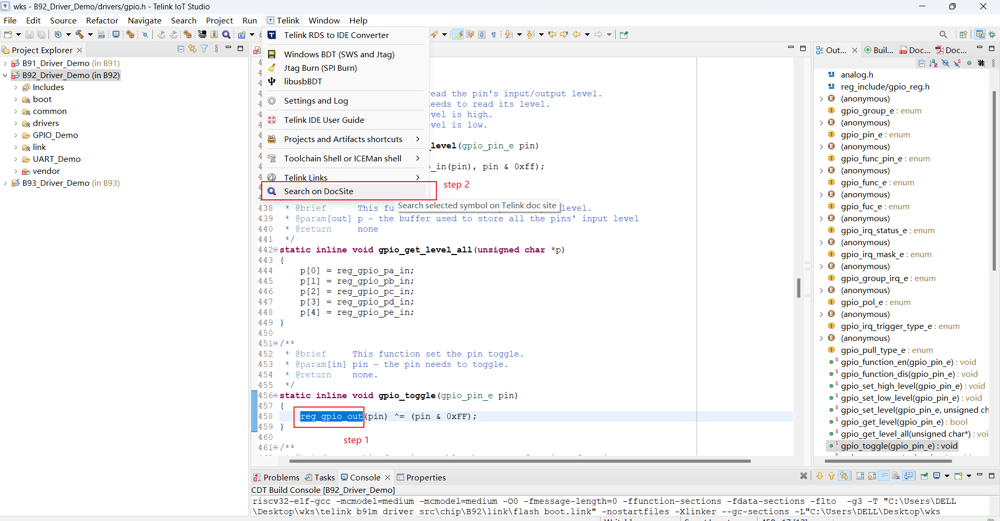

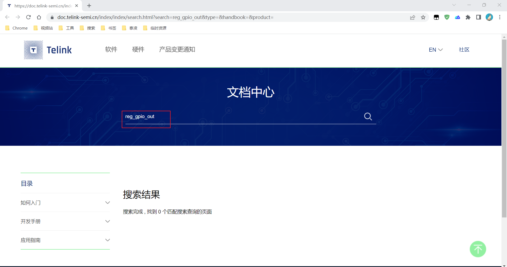

# Common compiling error

## Can't find the link script file

This type of error would occur when link script file path is in relative format. This wouldn't be an issue in `Telink RDS IDE`, but there will be an error in `Telink IoT studio`.

The error log would hint like the following:

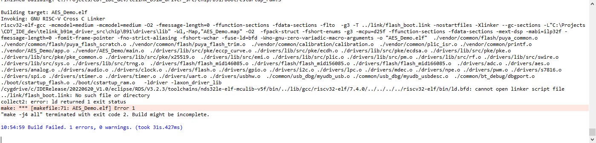

To resolve this problem, users can open the project property, then navigate to linker's `General` page of `Tool Settings` tab as following image, then double click the link script file:

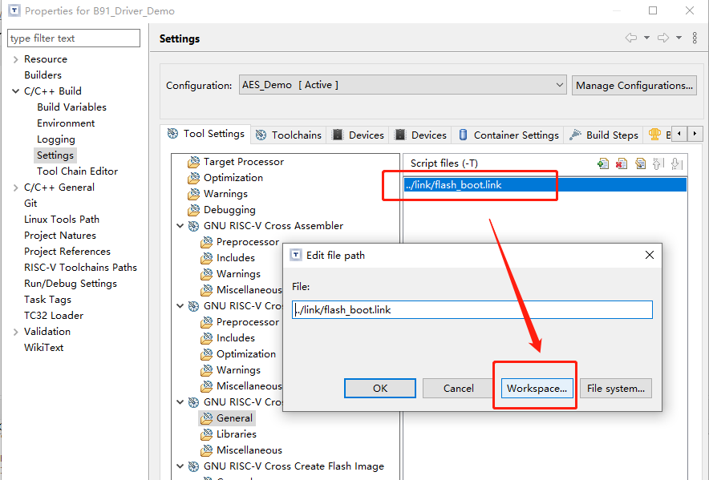

On opened dialog, select it from `workspace`:

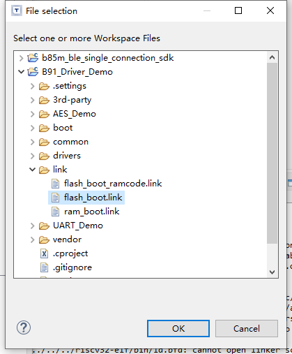

Click `OK` and `apply and close` button, and rebuild the project to check the results.

# Other plugins or functions

## Telink Formatter

This plugin is used to format the code/file with format shortcut or saving a file with clang-format.

### Use as formatter

To use it in formatter, users should set the `Telink Formatter` as the default formatter. Open the setting from the menu `Windows` --> `Preference` --> `C/C++` --> `Code style` --> `Formatter`, select the `TelinkFormatter` in `Code Formatter:` list, then click the `Apply and Close` button:

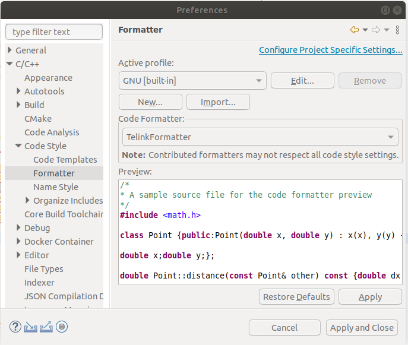

Afterwards users can press the shortcut keys (by default, it's `Ctrl+Shift+F`) on any openned source code file editor, a dialog would show, uses click the corronsponding button and option to confirm:

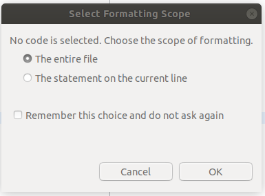

After the `Telink Formatter` has formatted the code/file, users can view the logs on the `Telink Formatter` output console for details (notice that the log function should be enabled in the `TelinkFormatter` Preference dialog, check the following guide):

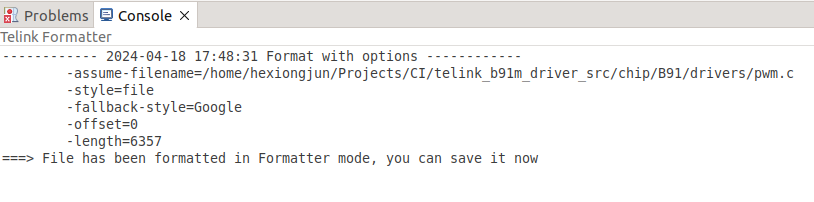

### Trigger with saving event(recommanded method)

The formatter can be triggered when a file or multiple files are saving, this requires the selection of the function in `TelinkFormat` setting(through the menu `Windows` --> `Preference` --> `C/C++` --> `TelinkFormatter` ):

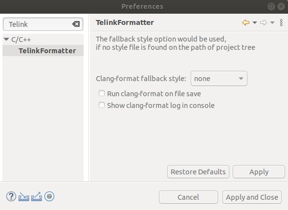

After the `Telink Formatter` has formatted the code/file, users can view the logs on the `Telink Formatter` output console for details if the log has been enabled in setting:

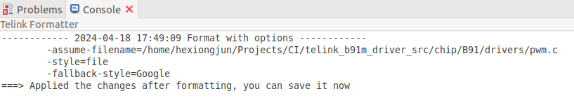

### Known issue

#### `Save` button is disabled at the first time

The "Save" button is int disabled state when a file is modified at the first time. After save it using "CTRL+S" ( or `File` --> `Save` , or with `Save all` menu-item/button ), modify this file again, it will become enabled state.

## Easy Shell

This plugin allows to open a shell window or file manager from the pop-up menu in the navigation tree or editor view. Additionally, it is possible to run selected files in the shell, copy file or directory path or run user defined external tools.

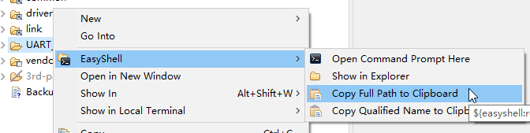

## ECalculator

A calculator with lots of functions, including:

- Display of the calculation in base-n numbers
- Standard, scientific and trigonometric calculation
- Enter arithmetic expressions naturally

Users can open it from the menu: `Window` --> `Show view` --> `other...`, then input `Ecalculator` to search and open it:

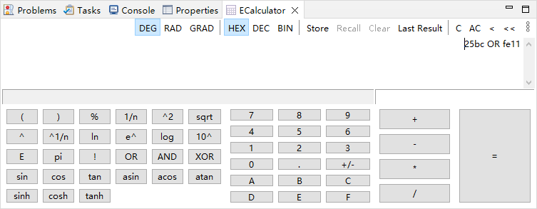

## Terminal in Eclipse

The terminal can be used for inputting git commands and serial debugging.

Users can open it from the menu `Window` --> `Show View` --> `Terminal`:

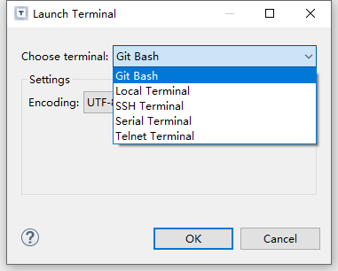

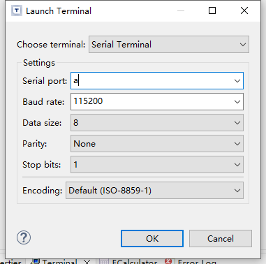

If your serial debugging log output frequency is very fast, use other dedicated tools instead.

## Binary Viewer

This plugin is used to open the binary files:

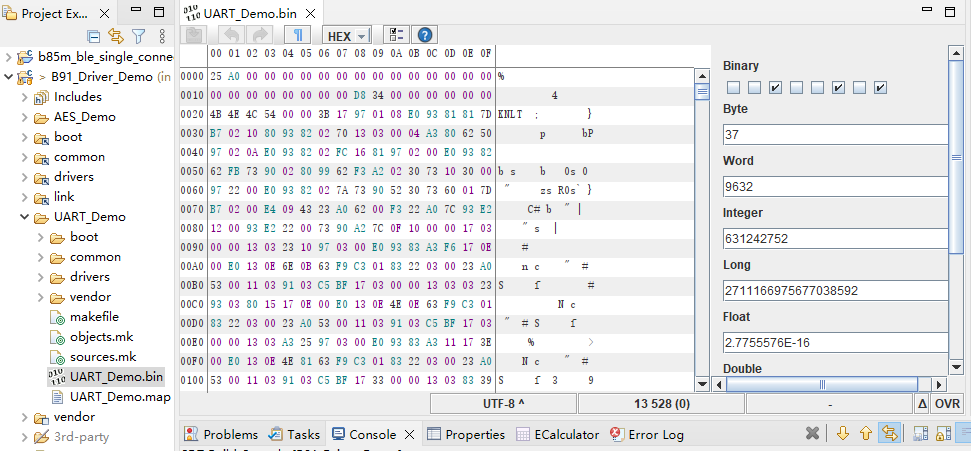

Users can double-click a binary file to open and view it in IoT Studio.

# FAQ

## `Error 127` when compiling the code

This error would give the `Error 127` at console window:

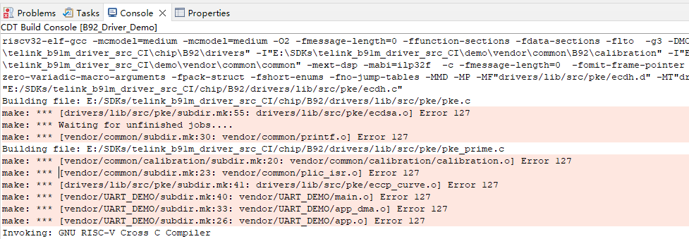

This issue is caused by the incorrect setting of the build tool version, setting the correct build tool version would fix this problem.

## Not found make in PATH or nothing to build when building

These problems are normally caused by importing the Telink RDS IDE format projects to Telink IoT studio directly without converting.

To resolve this problem, remove the project and convert it to Telink IoT studio before importing.

## Orphaned configuration and no options on Settings tab

When this occurs, the properties of the project would be like the following:

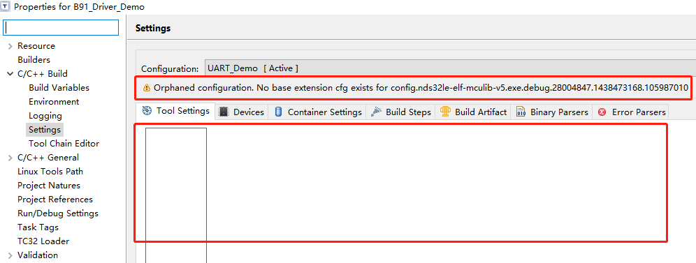

This problem is caused by the same reason as previous FAQ, converting Telink RDS format project before importing it.

## How to verify the current used toolchain gcc version for TLSR9

Users can set the following command to post command in project properties:

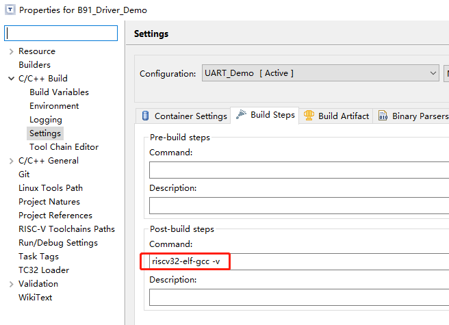

Then build the project, the console will output the GCC version:

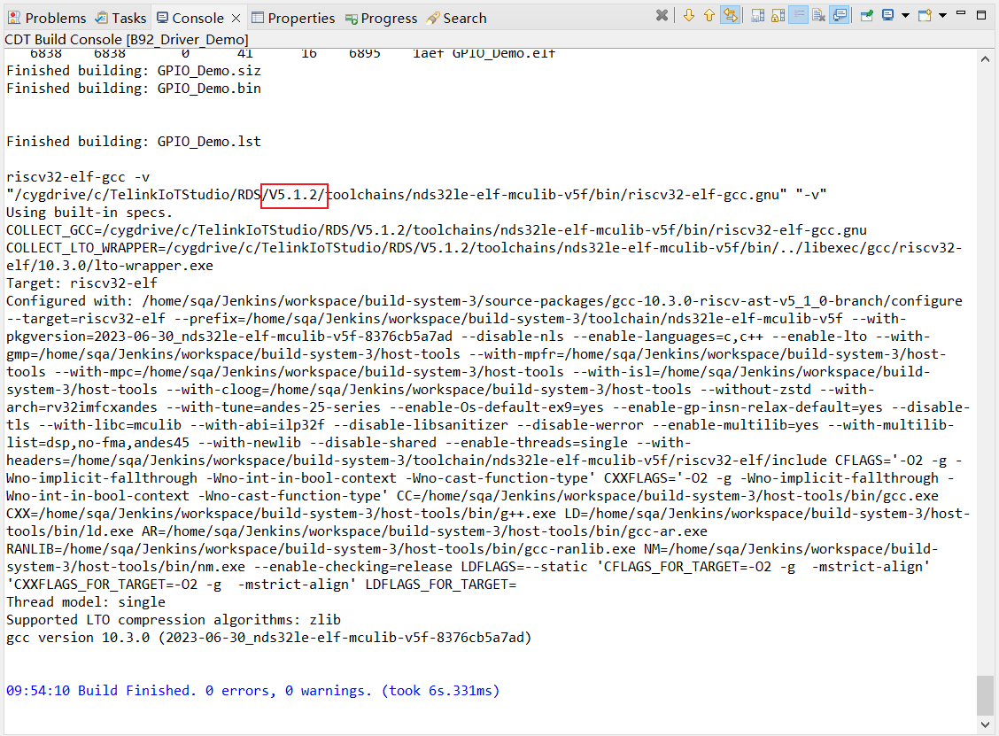

## How to verify current used `make tools`

Users can set following command (`echo "${PATH}"`) to post command in project properties:

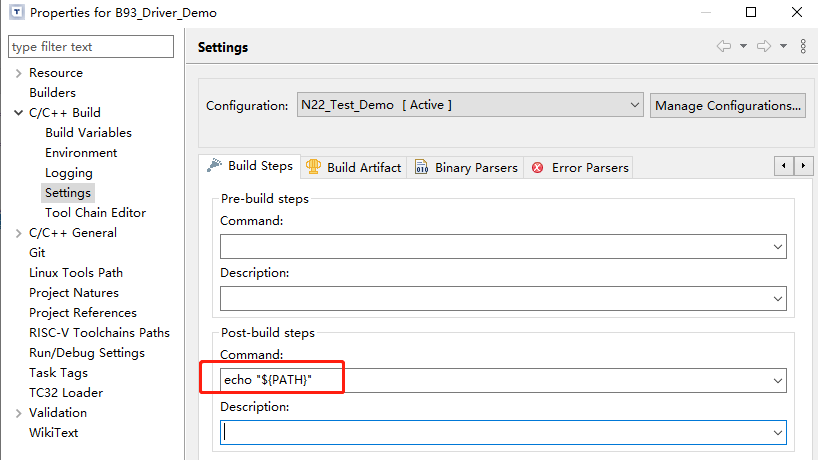

Then build the project, the console will output the path that the first one is the make tool path:

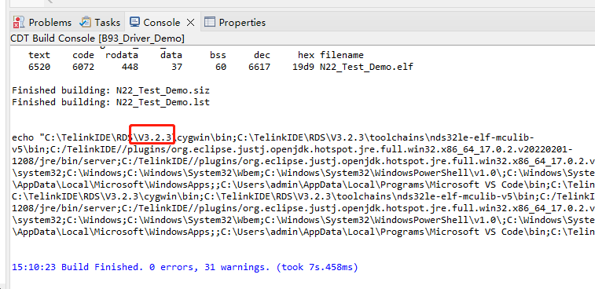

In the above example result, the `make tool` path is `C:\TelinkIDE\RDS\V3.2.3\cygwin\bin` with base version `V3.2.3`.

## The permission error occurred while opening the Telink TC32 console

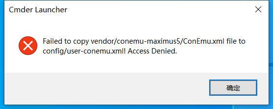

The user should open `Telink TC32 console` with the privileges of `administrator`.

# Known issues

## `Save` button is disabled at the first time

Use the `Ctrl+S` or menu item `File` --> `Save` , or click the `Save All` button/menu-item or use `Ctrl + Shift +S`. The save button would become enabled state in the following modifications.

This is caused by `Telink Formatter` plugin.

## IoT Studio exits if users click the `Open artifact path`  multiple times

This occurs in that the IoT Studio cannot find the artifact path. Users should avoid clicking the toolbar icon `Open artifact path` multiple times in a short time.

## IoT Studio will block for a while after importing project and changing toolchain

This is a normal case as the IoT Studio would take a while to do the `code indexing` and scan compiler files (for example the toolchain system header files and directories).

This procedure would take a few seconds. Users should wait for this job done before other operations (eg: building). This is a one-shot action, it will happen on toolchain changing settings or importing projects.

## The size of generated artifacts are zero

This issue will occur if users start to build a configuration when the project is just imported and the makefile hasn't been generated fully.

When this happens, a log similar to the following example would display on the console log window:

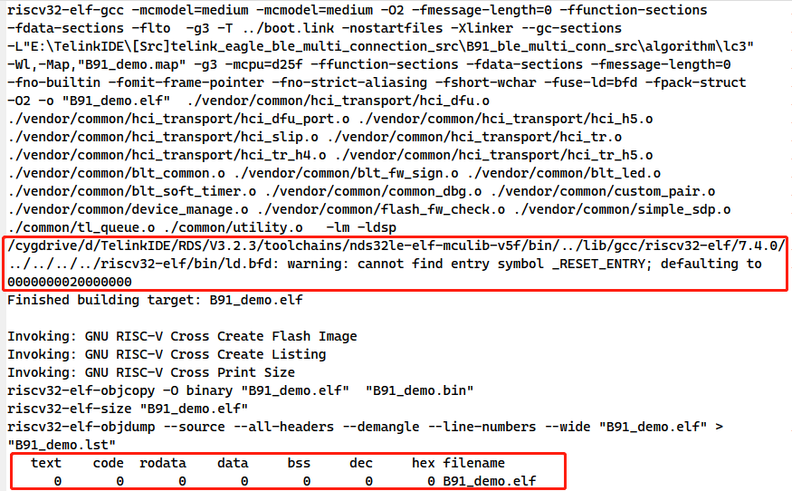

To resolve this problem, users should wait a few seconds then build the configuration again.

To avoid this issue, users should wait for the makefiles to be generated and the indexing to be finished. The process can be viewed at the right bottom of the IoT Studio:

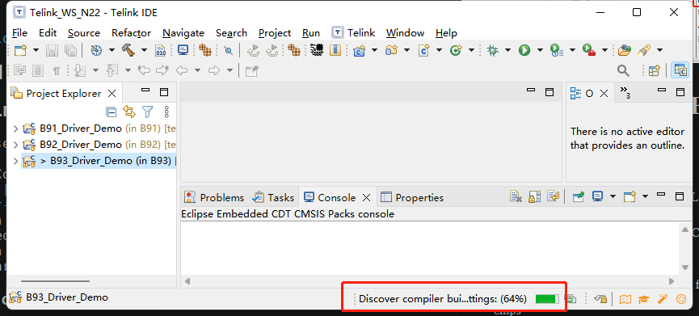

## Clicking the telink menu is invalid

This issue will occur if users do not select any project. To avoid this issue, select a project before clicking the telink drop-down menu.

## The problem that the source file cannot be found in debugging

In the process of debugging, there may be an error that the source file cannot be found. At this time, click Edit Source Path... , as shown below:

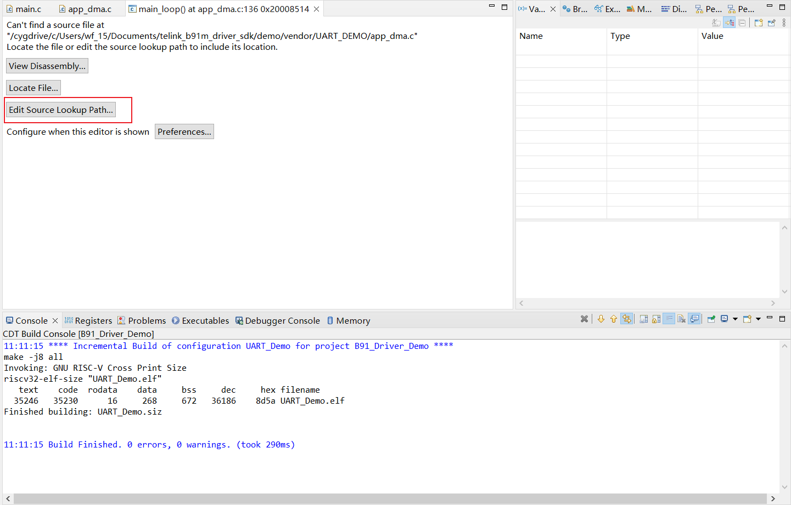

Then follow the instructions in Chapter [Edit Path Mapping](#edit-path-mapping) to configure path mapping

# IoT Studio settings

## Hide print margin

The print margin will show in default, which is a vertical line in the code editor:

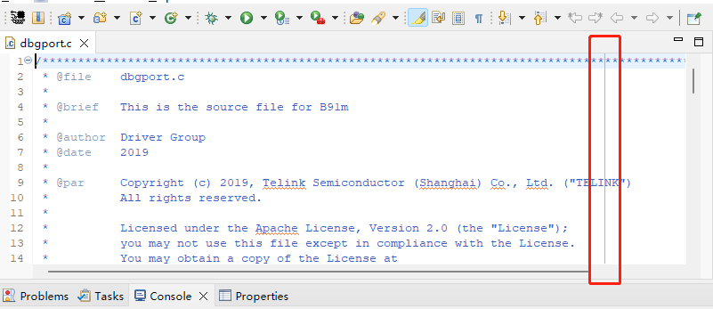

If you want to hide it, you can uncheck the `Show print margin` option on the `Text Editors` page of preferences.

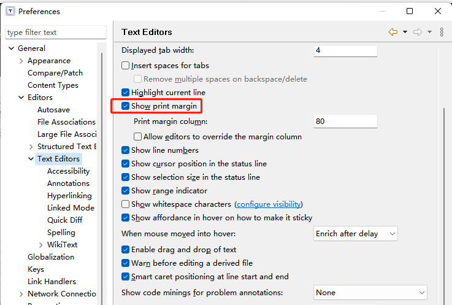

# IoT Studio Debug Tool For TLSR9

Note: This jtag debug tool is only used for TLSR9 series chips

## Build debuggable programs

To use the debugging function, when building an executable file, add the -g option to the compilation options, and pay attention to check the compiler and linker parameters, and delete all the -O options.

And the optimization option should be selected as -Og, and cannot be set to -O0, because in the test, it is found that the program compiled with the -O0 option cannot run normally after downloading, and the following error will occur when trying to download again:

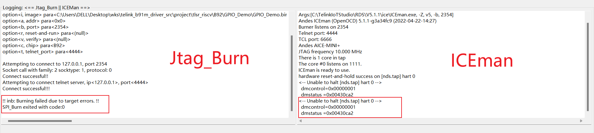

In the process of building the program, you may encounter syntax errors like the one shown in the figure below. The solution is to delete options such as -Wall -Werror of the compiler (also pay attention to checking the parameters of assembler and linker):

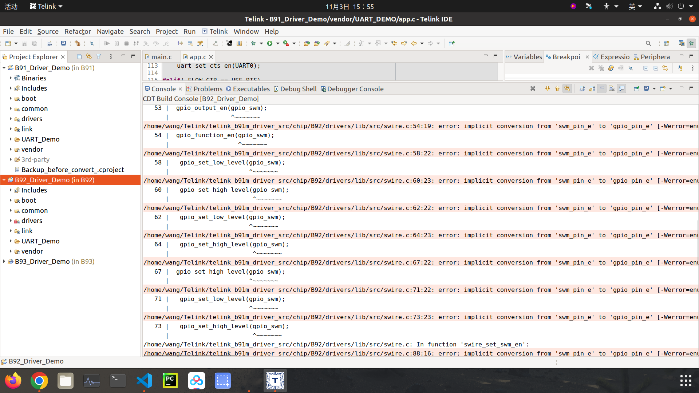

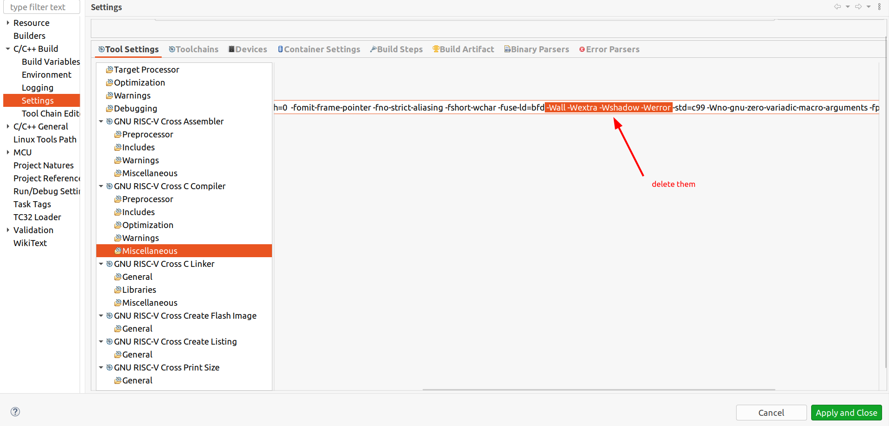

One thing to note is that when building the V5.1.2 N22 program, because of the tool chain, when using the GCC 10 version of the N22 tool chain, delete the -mabi=ilp32f option (also pay attention to check the parameters of assembler and linker).

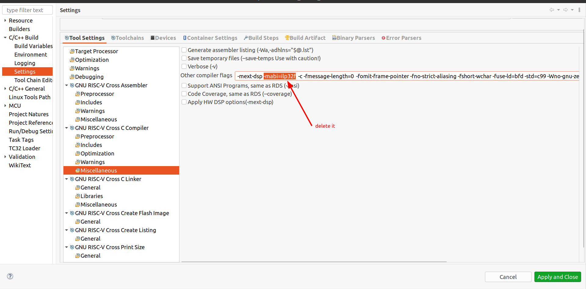

## Burn program

When burning the program, pay attention to burner's path and chip type, and then click Start ICEman. After ICEman is ready, the telnet_port and burner_port should be consistent with ICEman's, then click Burn, as shown below:


Jtag_ Burn is located in the $IoTStudio_PATH/RDS/V3.2.3/flash/directory, and its help documents are also in the same directory.

## Telink ICEman GDB Debugging (Recommended)

Before starting debugging, you must ensure that the elf file you want to use is selected, as shown in the figure.

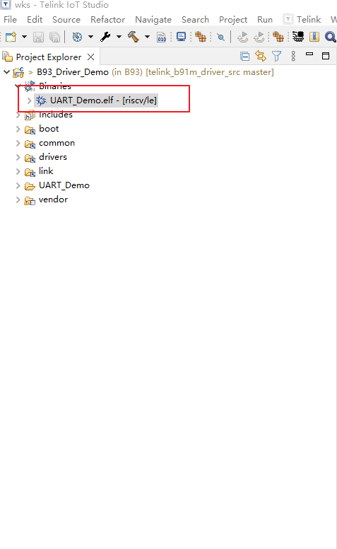

Then click the drop-down arrow of the Debug icon on the toolbar and select Debug Configuration.

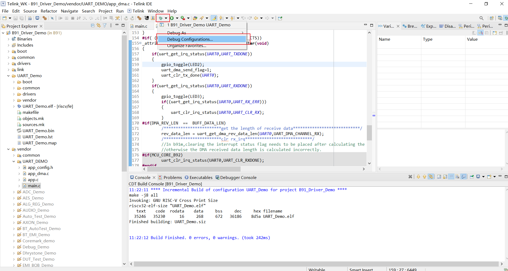

Double clicking on Telink ICEMan GDB Debugging, and a default debug configuration will be generated. You can choose whether you need an ICEman interface in the Debugger tab, as shown in the figure. 

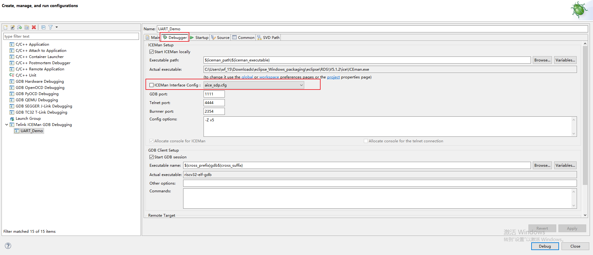

### Edit Path Mapping

Click the Source tab. Click the `Add` button and select `Path Mapping`, and edit as follows:

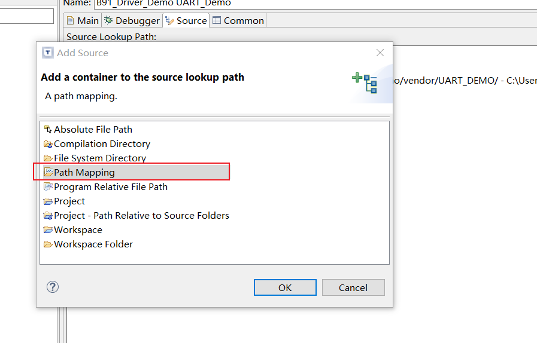

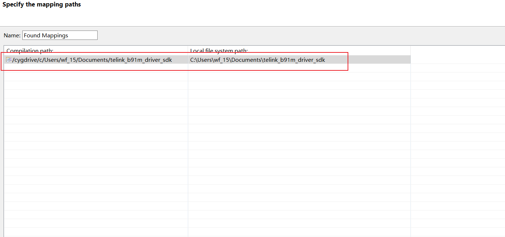

The input box on the left requires manual input, and the right side is to select the path.

The function of this operation is that the path in the IoT Studio will be correctly mapped to the local path. The simplest mapping method is to map /cygdrive/c/ directly to C:\ (because in this example the SDK is placed on the C drive).

Then you can start debugging after saving it. Of course, you can also change some settings according to your needs.

After configuration, click the Debug button and add breakpoints to start debugging. The interface is as follows:

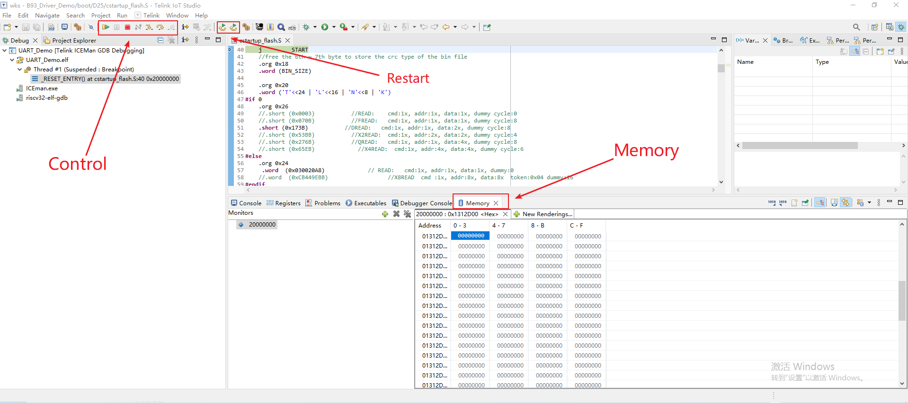

## C/C++ Remote Application (Old version, not recommended for use)

### ICEman

Before debugging, you need to execute ICEman. ICEman is used to configure a gdbserver and obtain the TCP port number for remote debugging.

Click the toolbar Telink --> Toolchain Shell or ICEman Shell --> Open ICEman(RDS V5.1.2) shell.

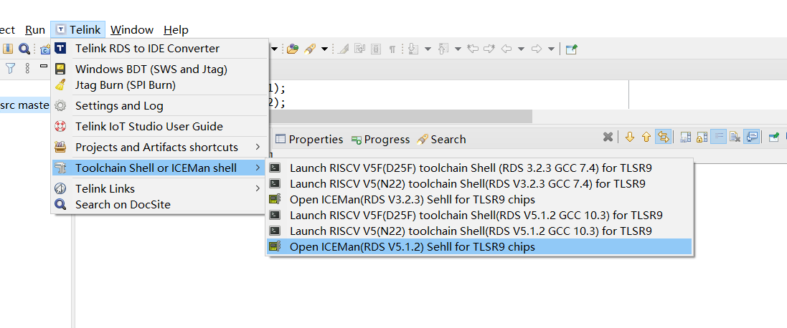

Enter the command at the terminal:

```Shell
./ICEman -Z v5
```

The execution results are as follows:

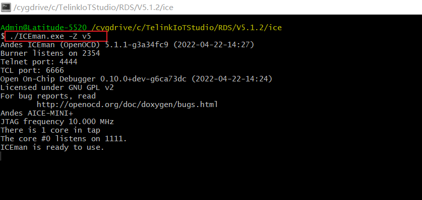

1111 is the TCP port number that we need to monitor. During debugging, we need to ensure that ICEman is running and the terminal cannot be closed.

ICEman is located in the $IoTStudio_PATH/RDS/V5.1.2/ice/directory, you can also open ICEman by yourself.

### Debug Configuration

After ICEman, click the drop-down arrow of the Debug icon on the toolbar and select Debug Configuration.


Select `C/C++ Remote Application`, configure the main tab, and select the compiled elf file as the input file of gdb, and select Disable auto build.

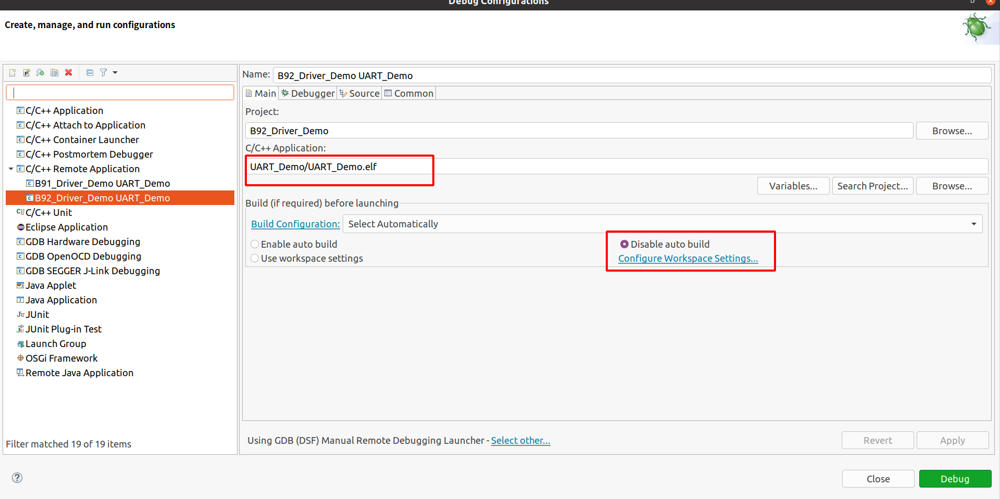

Then click Select other below. The default is Automatic, and select `Manual`.

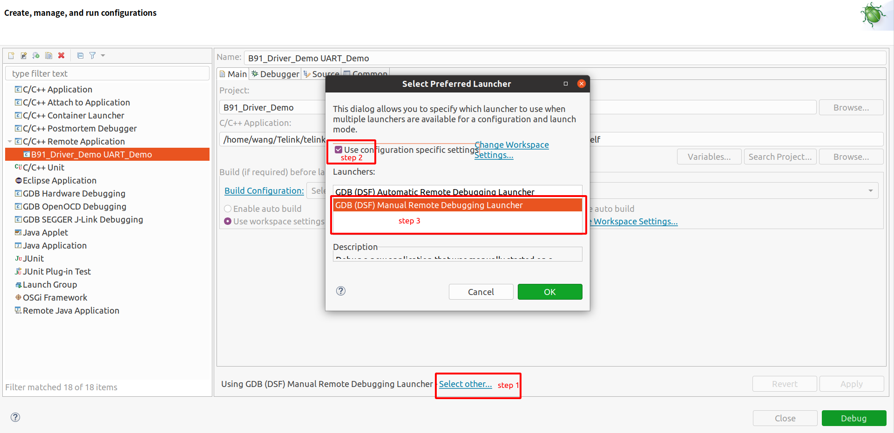

Click the Debugger tab to configure the corresponding debugger. Here is `riscv32-elf-gdb`, Be careful not to check *Stop on startup at*.

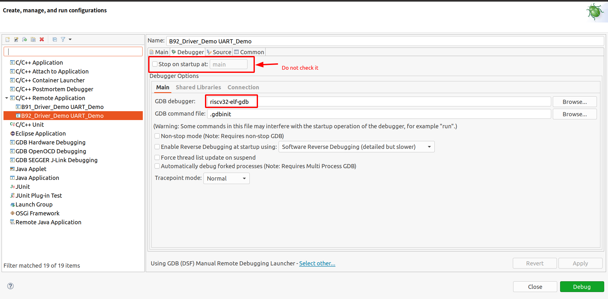

Click the Connect sub tab and fill in the TCP port number as 1111 obtained by ICEman.

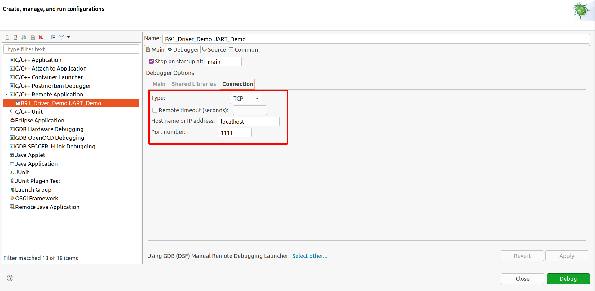

After configuration, click the Debug button and add breakpoints to start debugging. The interface is as follows:

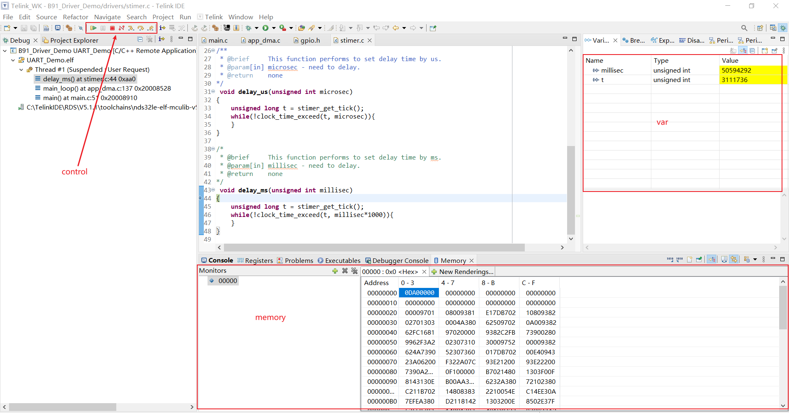

## Breakpoint

At present, TLSR9 series SoC supports up to two hardware breakpoints. When you find that the starting address of your program is 0x20000000, it means that it is running in flash and needs to use hardware breakpoints. Commands such as `step in` or `step over` will use a breakpoint, so users can only customize one breakpoint when debugging, otherwise an exception will occur.

When a `cannot access memory at address xx exception` occurs during debugging, you can use the `info br` command to check the number of breakpoints.

# Independent use of some tools in the IoT Studio

## Converter

The purpose of this tool is to convert the project file format of the original Telink RDS IDE to the current Telink IoT Studio project format.

To use it on the command line, you should switch to the directory of the `.cproject` file that needs to be converted, and executing $(converter_path)/TelinkRDS2IDE in this directory.

The directory where the converter is located is the $IoTStudio_PATH/tools/Converter/.

For example：

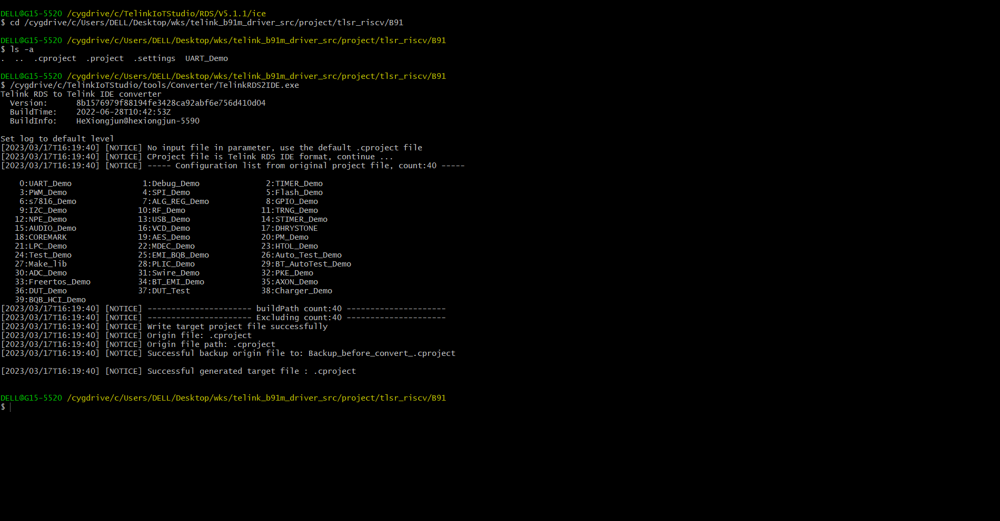

## Jtag Burn

The function of this tool is to burn and write binary files into the TLSR9 chip. Before using it, you need to first use ICEman. The Jtag Burn tool is located in the $IoTStudio_PATH/RDS/V3.2.3/flash/, and the user manual is also in this directory. The following is a example of usage:

```Shell
./Jtag_Burn --chip B92 --reset-and-run --verify --addr 0 --image /home/wang/UART_Demo.bin --port 2354 --telnet_port 4444 --unlock
```

The parameter of \-\-port and \-\-telnet_port should be same with the parameter of ICEman's Burner port and telnet port. If you see the running results of ICEman indicating its Burner Port is 2354 and its telnet port is 4444 (as shown in the following figure):

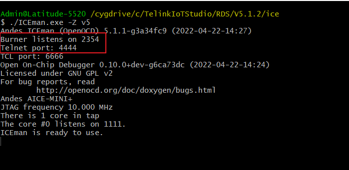

In this case, you can run the Jtag_Burn without \-\-port and \-\-telnet_port.

# Installation and uninstallation of IoTStudio in linux

## Installation

In linux, run the installation program "`Telink_IoT_Studio_xxxx_Installer.run`" to install the IoTStudio. You can give it executable permissions and run it. During the execution, the user needs to enter the installation path. Be sure to enter the absolute path, as shown in the figure below.

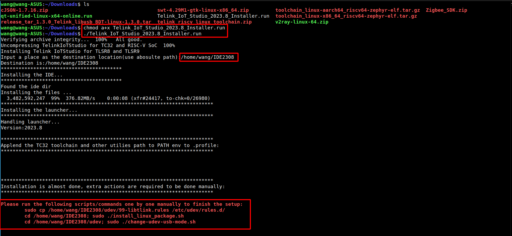

After the program execution ends, you need to execute the command given at the end of the program to complete the installation.

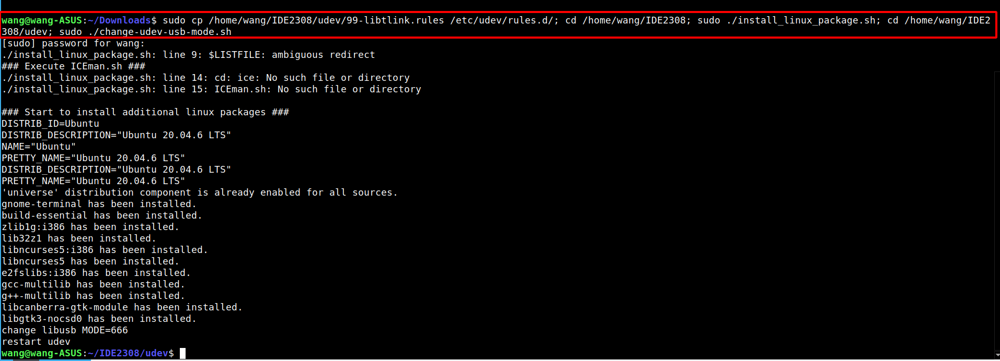

## Uninstallation

In the IoTStudio installation directory, there is an `uninstall.sh` file that can be used to uninstall IoTStudio. You can give it executable permissions and run it. Users need to pass the path of IoTStudio's .desktop file as a parameter to uninstall.sh. Note that there may be a TelinkIoTStudio.desktop file in the installation directory, do not use it as a parameter. You should use the .desktop file with the version number and you can refer to the following example.

```Shell
./uninstall.sh /home/wang/IDE2308/TelinkIoTStudio_2023.8.desktop
```

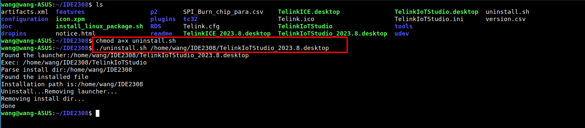

# Docs for AndeSight

We have provided the relevant documents for AndeSight, which include the usage documents for Andes Riscv toolchain and other tools. You can find them in the path below according to your needs.

- `${IoTStudio_Path}/doc/Andes_V323_doc/` : Docs for AndeSight V3.2.3
- `${IoTStudio_Path}/doc/Andes_V512_doc/` : Docs for AndeSight V5.1.2
- `${IoTStudio_Path}/doc/Andes_V530_doc/` : Docs for AndeSight V5.3.0
