---
hide:
  - toc
---

## 效果0

## 效果3

-----------------------------------------------------------------------------------------------------

<!DOCTYPE html>
<html lang="en">
<head>
    <meta charset="UTF-8">
    <meta name="viewport" content="width=device-width, initial-scale=1.0">
    <title>轮播图</title>
    
</head>
 
<body>
    

        

            

                
            

            

                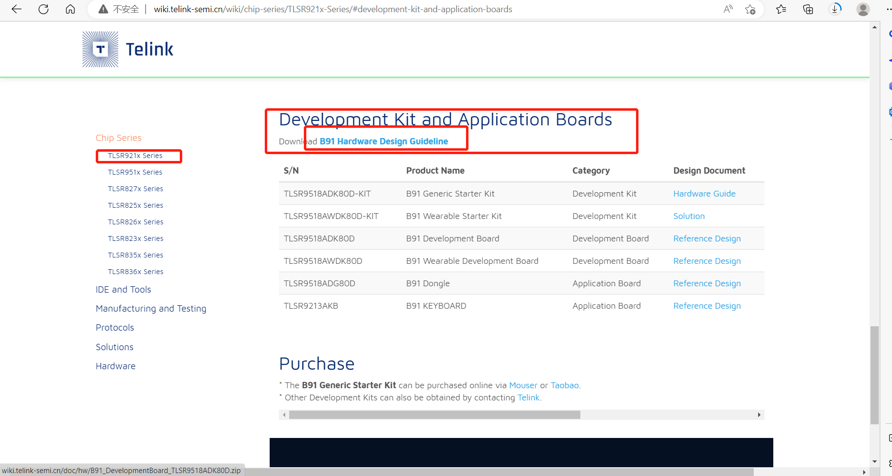
            

            

                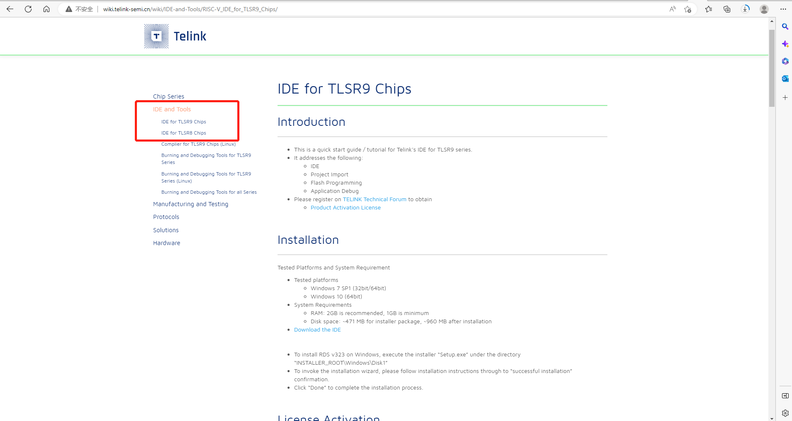
            

            

                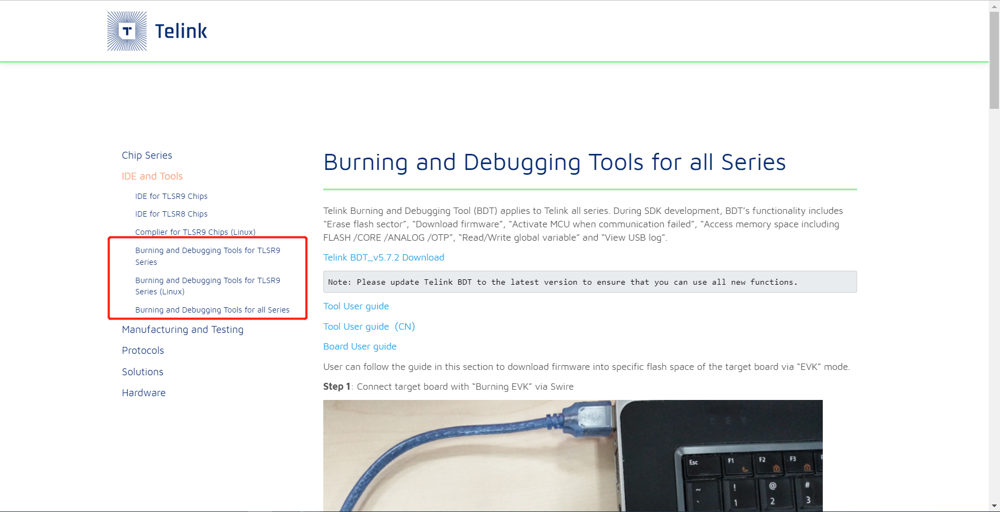
            

            

                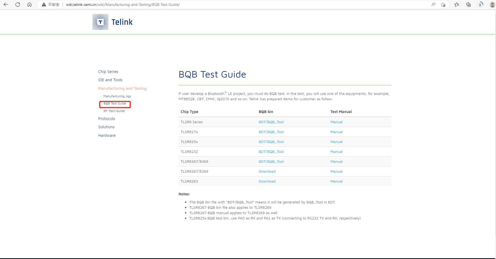
            

            

                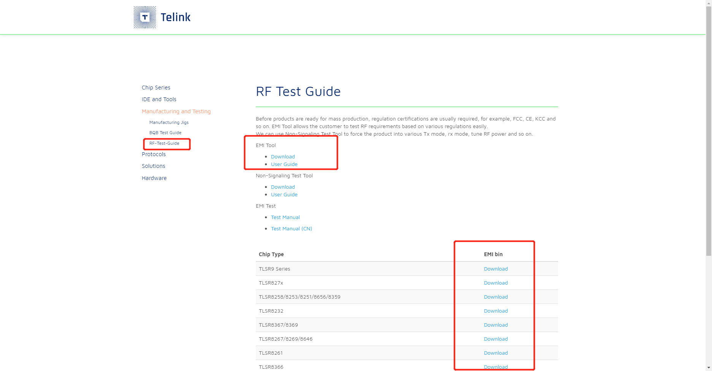
            

            

                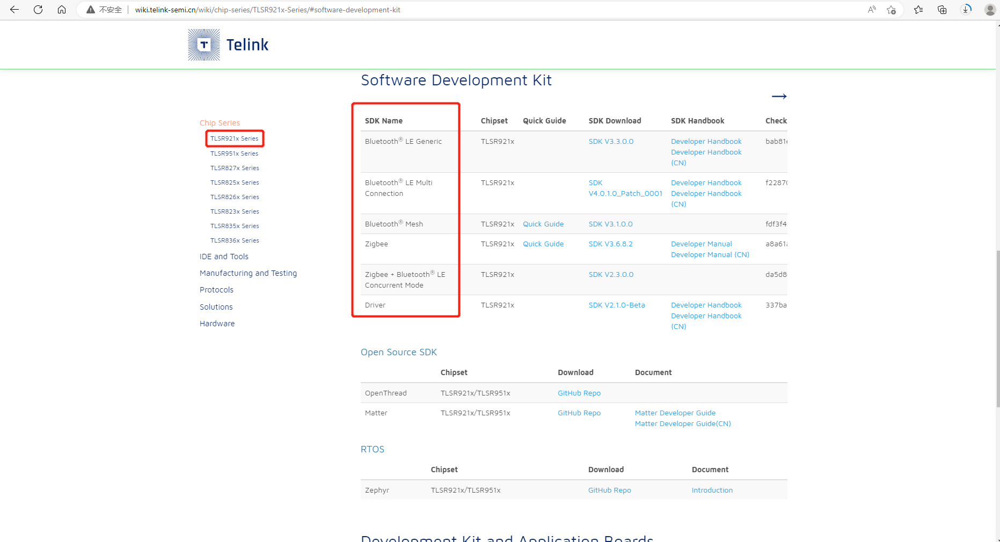
            

            

                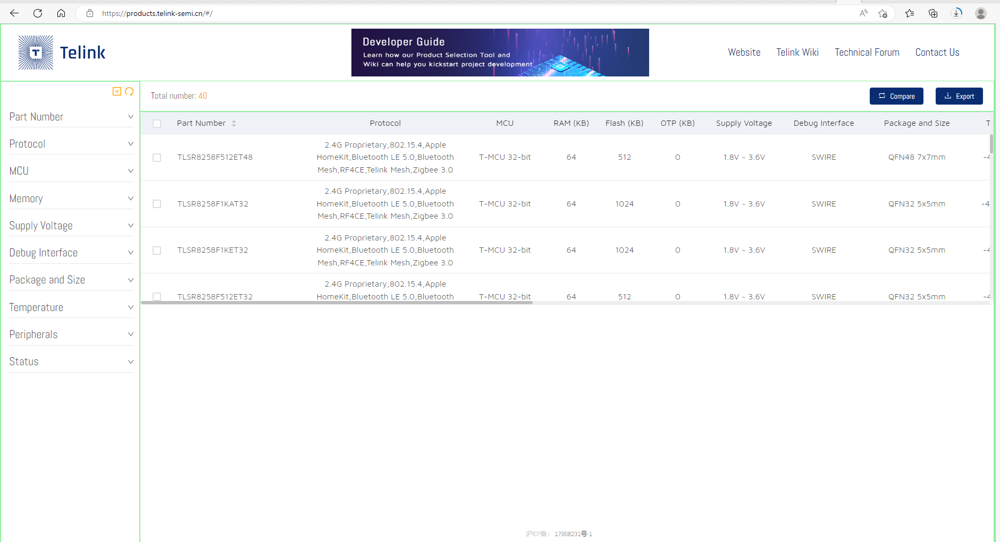
            

            

                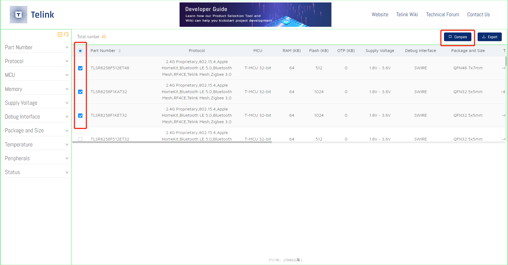
            

            

                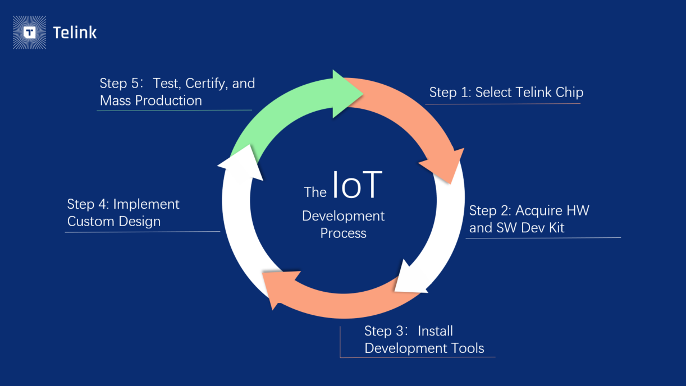
            

        

        
&lsaquo;

        
&rsaquo;

 
        

            <li class="active" onclick="jumpToSlide(0)"></li>
            <li onclick="jumpToSlide(1)"></li>
            <li onclick="jumpToSlide(2)"></li>
            <li onclick="jumpToSlide(3)"></li>
            <li onclick="jumpToSlide(4)"></li>
            <li onclick="jumpToSlide(5)"></li>
            <li onclick="jumpToSlide(6)"></li>
            <li onclick="jumpToSlide(7)"></li>
            <li onclick="jumpToSlide(8)"></li>
            <li onclick="jumpToSlide(9)"></li>
        

    

</body>
    
</html>

## 效果4

&nbsp;
Need to develop a new product? Here’s a guide for getting started with Telink’s innovative connectivity SoCs.
&nbsp;

    
    

        示例
    

    <a href="https://doc.telink-semi.cn/doc/zh/">
    
    

        <a href="https://doc.telink-semi.cn/doc/zh/">Point 1</a>
    

    
    

        <a href="https://doc.telink-semi.cn/doc/zh/" style="position: absolute; bottom: 10px; right: 10px; color: white; background: rgba(0, 0, 0, 0.5); padding: 5px;">1</a>
        <a href="https://doc.telink-semi.cn/doc/zh/software/" style="position: absolute; bottom: 20px; right: 10px; color: red; background: rgba(0, 0, 0, 0.5); padding: 5px;">2</a>
    

:octicons-heart-fill-24:{ .heart } 2

This guide shows you how to use [Telink Chip Selection Tool](https://products.telink-semi.cn/#/), [Telink Wiki website](http://wiki.telink-semi.cn/wiki/), [Telink Developer Forum](https://developers.telink-semi.cn/)，[Gitee](https://gitee.com/telink-semi)，[Github](https://github.com/telink-semi) and other support resources can easily locate the chip model, obtain the development kit and SDK, verify the product prototype and realize the customized design, and finally pass the certification test and put into mass production.
&nbsp;
If you want to know more about Telink, you can go to [Telink official website](https://www.telink-semi.com/for-developers/) find the information you need.
&nbsp;

  
  <a href="https://doc.telink-semi.cn/doc/zh/software/" title="11">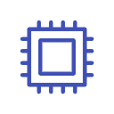</a>

<!DOCTYPE html>
<html>
<head>

</head>
<body>
 

  
  

 
</body>
</html>

&nbsp;

# Select Telink Chip 

## Select Telink Chip 
&nbsp;
Begin with [Telink Chip Selection Tool](https://products.telink-semi.cn/#/) to narrow down your options for SoCs that will best suit your product needs.
&nbsp;
- The left drop-down menu provides search filters so you can find SoCs that align with your preferences. Choose from characteristics such as protocol, MCU, memory size, supply voltage, temperature, peripherals, and so on.

&nbsp;
- The list to the right of the sidebar presents available SoCs based on your filter selections. At a quick glance, you can view performance information to better compare SoCs. To dive further into each SoC, you can click on its part number to the chip details page.

&nbsp;

&nbsp;
If you’re struggling to decide between a few SoCs that catch your eye, check the boxes next to your preferred chips, then hit the compare button on the upper right corner. Unique attributes for your selections will be displayed in red, as shown below.
&nbsp;

&nbsp;
## Download the Datasheet
&nbsp;
Click on the specific part number to check its details page. On this page, you can read a thorough overview of the product and download the datasheet for additional information. 
&nbsp;
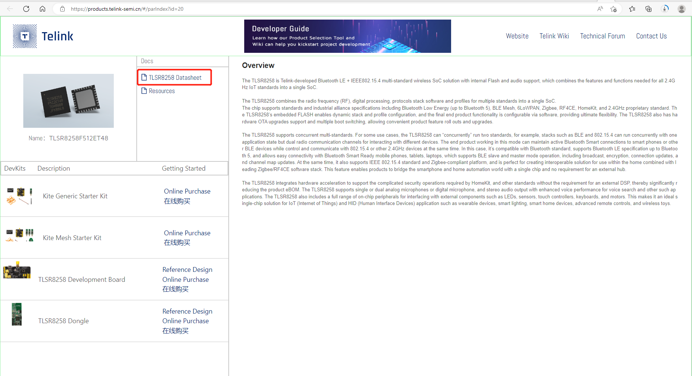
&nbsp;
# Acquire HW and SW Dev Kit
## Acquire the HW Development Kit and Reference Schematic
&nbsp;
From this screen, you can easily get started with your chosen product by clicking “Online Purchase.” If a specific Dev Kit is not available online, then [contact Telink Sales](https://www.telink-semi.cn/contact-us/).
&nbsp;
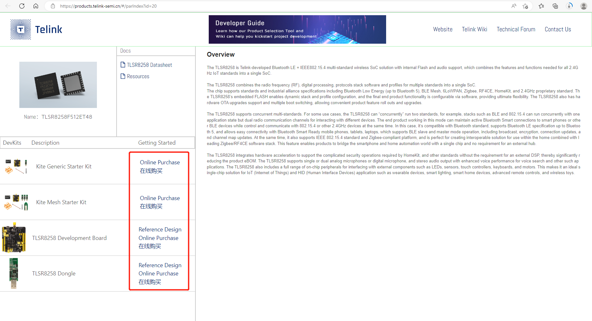
&nbsp;
The reference schematic of the relevant board of the corresponding chip can be obtained from [Telink Wiki website](http://wiki.telink-semi.cn/wiki/). Find the hardware reference design document according to the version number on the board, and download the hardware Design Guideline.
&nbsp;

&nbsp;
## Acquire the Software Development Kit
&nbsp;
After obtaining the HW Dev Kit, developers can find the required SDK and the relevant download content of all the processes below at [Telink WIKI website](http://wiki.telink-semi.cn/wiki/).

In the "Software Development Kit" section of the "Chip Series" page of a specific chip, there are SDKs for different protocols and different functions to choose from. You can select the appropriate SDK according to the characteristics of the developed product, and download the corresponding development guide, operation manual and other reference materials.
&nbsp;
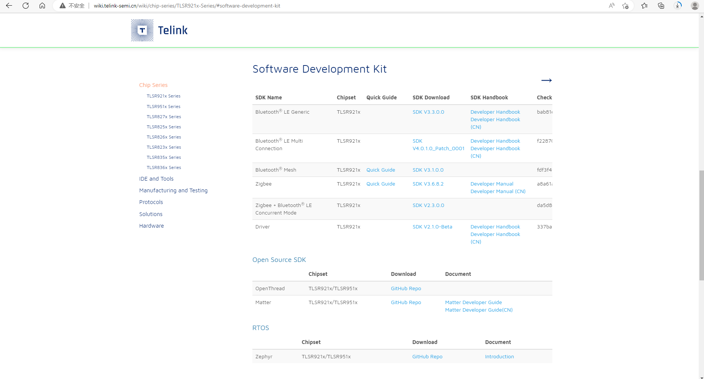
&nbsp;
You can also click [Gitee](https://gitee.com/telink-semi) and [Github](https://github.com/telink-semi) to get software resources.
&nbsp;
# Install Development Tools 
&nbsp;
IDE (Integrated Development Environment) embeds the software program that runs your developmental work on your computer, allowing you to debug, run, and test protocols and programs with your own system and products.
&nbsp;
To obtain the IDE for Telink chips, jump back to the left sidebar and click the “IDE and Tools” tab. Based on the general model of the SoC you choose (TLSR8 or TLSR9), there are different steps involved for proper installation. Follow each step outlined on the Wiki page for the correct chip model.

> For the TLSR9 chip series only, the IDE needs to be activated before use. Please note that if you have not done so, this step requires you to create an account on [Telink Developer Forum](https://developers.telink-semi.cn/) in order to obtain your license and proceed with the activation steps outlined in the IDE wiki page above.

> The Windows IDE of TLSR9 series chips has integrated JTAG burning and debugging tools.

In addition to the IDE, you also need to install the Burning and Debugging Tool, write the program to the development board, and find and repair the errors in the product development process. This tool is available in the "Burning and Debugging Tools" directory.
&nbsp;

&nbsp;
# Implement Custom Design
&nbsp;
After the preliminary prototype verification is completed using the hardware development kit and SDK, the final product needs to be customized and developed.
&nbsp;
The corresponding hardware reference design schematic and related documents are provided for download under the section of "Development Kits and Application Board" of each chip series on [Telink Wiki website](http://wiki.telink-semi.cn/wiki/). The hardware reference design covers many fields of IoT applications, such as intelligent remote control, mesh network equipment and electronic shelf labels. You can design and develop product hardware based on our hardware reference design. 
&nbsp;
The "Solution" directory introduces Telink's mainstream application solutions. The corresponding SDK is provided under the "Software Development Kit" section of each chip series. You can develop product firmware based on the corresponding SDK.
&nbsp;
If you’re stuck during development process, go to [Telink Developer Forum](https://developers.telink-semi.cn/)! Our team of experts is glad to answer your questions throughout your development journey.
&nbsp;
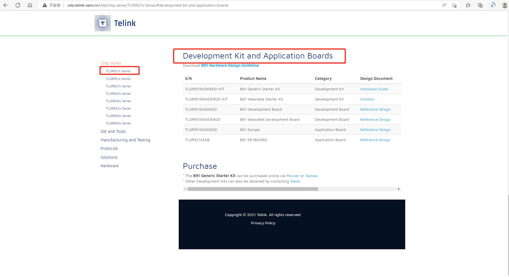

> During the development process, please pay attention to our [Product Change Notice (PCN)](https://doc.telink-semi.cn/index/index/index/id/274.html), and get the latest change information in time.

# Test, Certify, and Mass Production
&nbsp;
After implementing your custom design, you need to ensure the final product conforms to the regional compliance requirements (FCC, CE, etc.) of where it will sell and/or the standard(s) it will claim to support (Bluetooth, Zigbee, etc.). Under the “Manufacturing and Testing” tab on the Wiki site, you will find the tools and manuals that can help tune your product to pass the compliance tests. 
&nbsp;
- The BQB authentication, as shown in the figure below, can download the corresponding bin file. If there is no corresponding firmware, use the BDT tool attached to generate the corresponding test firmware as required. If you find that the serial port used is not in the bin file, please contact the corresponding technical support staffs.

&nbsp;
 
&nbsp;
- The FCC/CE/SRRC certification, as shown in the figure below, use EMI as the host computer tool to download the corresponding Bin to the chip, and operate and control by downloading EVK and the host computer.

&nbsp;
 
&nbsp;
As you are ready for manufacturing, Telink also provides the hardware kits that you will need to program and test each product for the production line.

To find out more, please leave us a question through our  [Telink Developer Forum](https://developers.telink-semi.cn/) or directly [contact us](https://www.telink-semi.cn/contact-us/) .
&nbsp;

&nbsp;
**Copyright © 2023 Telink Semiconductor (Shanghai) Co., Ltd.**
&nbsp;

