# SDK Overview


<!DOCTYPE html>
<html lang="en">
<head>
    <meta charset="UTF-8">
    <meta name="viewport" content="width=device-width, initial-scale=1.0">
    <title>轮播图</title>
    <style>
        *{
            margin: 0;
            padding: 0;
            text-decoration: none;
            list-style: none;
            background-repeat: no-repeat;
        .carousel {
            position: relative;
            width: 1000px;
            height: 900px;
            overflow: hidden;
        }
        .carousel-inner {
            display: flex;
            width: 1600px;
            height: 900px;
            transition: transform 0.6s ease-in-out;
        }
        }
        .item {
            flex: 0 0 100%;
            height: 55vh%;
        }
        .item img {
            width: 100%;
            height: 100%;
            object-fit: cover;
        }
        .carousel-control {
            position: absolute;
            top: 50%;
            transform: translateY(-50%);
            color: #fff;
            font-size: 80px;
            z-index: 10;
            cursor: pointer;
        }
        .left {
            left: 25px;
        }
        .right {
            right: 25px;
        }
 
        .dots {
            position: absolute;
            bottom: 20px;
            left: 50%;
            z-index: 15;
            width: 60%;
            padding-left: 0;
            margin-left: -30%;
            text-align: center;
            list-style: none;
        }
 
        .dots > li {
            display: inline-block;
            width: 10px;
            height: 10px;
            margin: 1px;
            cursor: pointer;
            background-color: rgba(0,0,0,0);
            border: 1px solid #fff;
            border-radius: 10px;
        }
 
        .dots .active {
            width: 12px;
            height: 12px;
            margin: 0;
            background-color: #fff;
        }
    </style>
</head>
 
<body>
    <div class="carousel" id="carousel">
        <div class="carousel-inner">
            <div class="item">
                
            </div>
            <div class="item">
                
            </div>
            <div class="item">
                
            </div>
            <div class="item">
                
            </div>
            <div class="item">
                
            </div>
            <div class="item">
                
            </div>
            <div class="item">
                
            </div>
            <div class="item">
                
            </div>
            <div class="item">
                
            </div>
            <div class="item">
                
            </div>
        </div>
        <div class="carousel-control left" onclick="prevSlide()">&lsaquo;</div>
        <div class="carousel-control right" onclick="nextSlide()">&rsaquo;</div>
 
        <div class="dots">
            <li class="active" onclick="jumpToSlide(0)"></li>
            <li onclick="jumpToSlide(1)"></li>
            <li onclick="jumpToSlide(2)"></li>
            <li onclick="jumpToSlide(3)"></li>
            <li onclick="jumpToSlide(4)"></li>
            <li onclick="jumpToSlide(5)"></li>
            <li onclick="jumpToSlide(6)"></li>
            <li onclick="jumpToSlide(7)"></li>
            <li onclick="jumpToSlide(8)"></li>
            <li onclick="jumpToSlide(9)"></li>
        </div>
    </div>
</body>
    <script>
        let items = document.querySelectorAll('.item');
        let current = 0;
        function showSlide() {
            items.forEach(item => {
                item.style.transform = `translateX(-${current * 100}%)`;
            });
            updateDots();
        }
 
        function prevSlide() {
            if (current > 0) {
                current--;
            } else {
                current = items.length - 1;
            }
            showSlide();
        }
 
        function nextSlide() {
            if (current < items.length - 1) {
                current++;
            } else {
                current = 0;
            }
            showSlide();
        }
 
        let timer = setInterval(nextSlide, 3000);
 
        function pauseTimer() {
            clearInterval(timer);
        }
        function resumeTimer() {
            timer = setInterval(nextSlide, 3000);
        }
 
        document.getElementById('carousel').addEventListener('mouseover', pauseTimer);
        document.getElementById('carousel').addEventListener('mouseout', resumeTimer);
 
        let dots = document.querySelectorAll('.dots li');
 
        function updateDots() {
            dots.forEach(dot => {
                dot.classList.remove('active');
            });
            dots[current].classList.add('active');
        }
 
        function jumpToSlide(index) {
            current = index;
            showSlide();
            updateDots();
        }
    </script>
</html>

This BLE SDK supplies demo code for BLE Slave single connection development, based on which user can develop his own application program.[Feature Demo](#feature-demo), [创建](#创建), [创建](#创建artifact), [Address](#地址)， [MCU地址](#address), [tupian](#tupian), [artifact](#artifact)

## Software architecture


测试：


<map name="map">
  <area shape="rect" coords="34,44,270,350" href="https://doc.telink-semi.cn/doc/zh/software/" alt="Point 1">
  <area shape="rect" coords="290,172,333,250" href="https://doc.telink-semi.cn/doc/zh/hardware/" alt="Point 2">
</map>

测试：

<div style="position: relative; display: inline-block;">
    
    <div style="position: absolute; bottom: 10px; right: 10px; color: white; background: rgba(0, 0, 0, 0.5); padding: 5px;">
        示例
    </div>
</div>

Software architecture for this BLE SDK includes application (APP) layer and BLE protocol stack.  
Figure below shows the file structure after the SDK project is imported in IDE, which mainly contains 8 top-layer folders below: "algorithm", "application", "boot", "common", "drivers", "proj_lib", "stack" and "vendor".  

Software architecture for this BLE SDK includes application (APP) layer and BLE protocol stack.

<div align="center" style="font-size: 10px;">


<br>
Figure below shows the file structure after the SDK project is imported in IDE.
</div>

<div style="font-size: 10px;">

Figure below shows the file structure after the SDK project is imported in IDE.
</div>

<br><br><br><br><br><br><br><br><br><br><br>
44444444

## 11

- Algorithm: This folder contains functions related to encryption algorithms.

- Application: This folder contains general application program, e.g. print, keyboard, and etc.

- boot: This folder contains software bootloader for chip, i.e., assembly code after MCU power on or deepsleep wakeup, so as to establish environment for C program running.

- common:This folder contains generic handling functions across platforms, e.g. SRAM handling function, string handling function, and etc.

- drivers: This folder contains hardware configuration and peripheral drivers closely related to MCU, e.g. clock, flash, i2c, usb, gpio, uart.

- proj_lib: This folder contains library files necessary for SDK running, e.g. BLE stack, RF driver, PM driver. Since this folder is supplied in the form of library files (e.g. libB91_ble_lib.a), the source files are not open to users.

- stack: This folder contains header files for BLE stack. Source files supplied in the form of library files are not open to users.

- vendor: This folder contains user application-layer code.

<p style="font-size: 20px;">    
    
    <br> <br>
   		Markdown 是一种轻量级标记语言，它允许人们使用易读易写的纯文本格式编写文档。<br>
		Markdown 语言在 2004 由约翰·格鲁伯（英语：John Gruber）创建。<br>
		Markdown 编写的文档可以导出 HTML 、Word、图像、PDF、Epub 等多种格式的文档。<br>
		Markdown 编写的文档后缀为 .md, .markdown。
</p>


### main.c

The “main.c” file includes main function entry, system initialization functions and endless loop “while(1)”. It’s not recommended to make any modification to this file.

```C  
_attribute_ram_code_ int main (void)   //must on ramcode
{
	DBG_CHN0_LOW;
	blc_pm_select_internal_32k_crystal();

	sys_init(DCDC_1P4_DCDC_1P8,VBAT_MAX_VALUE_GREATER_THAN_3V6);

	/* detect if MCU is wake_up from deep retention mode */
	int deepRetWakeUp = pm_is_MCU_deepRetentionWakeup();  //MCU deep retention wakeUp

	CCLK_16M_HCLK_16M_PCLK_16M;
	rf_drv_ble_init();
	gpio_init(!deepRetWakeUp);

	if(!deepRetWakeUp){//read flash size
		blc_readFlashSize_autoConfigCustomFlashSector();
	}
	blc_app_loadCustomizedParameters();  //load customized freq_offset cap value
	if( deepRetWakeUp ){ //MCU wake_up from deepSleep retention mode
		user_init_deepRetn ();
	}
	else{ //MCU power_on or wake_up from deepSleep mode
		user_init_normal();
	}
	irq_enable();
	while (1) {
		main_loop ();
	}
	return 0;
}
```

### app_config.h

<section>
	<p style="font-size: 20px;">    
    	
   		Markdown 是一种轻量级标记语言，它允许人们使用易读易写的纯文本格式编写文档。<br>
		Markdown 语言在 2004 由约翰·格鲁伯（英语：John Gruber）创建。<br>
		Markdown 编写的文档可以导出 HTML 、Word、图像、PDF、Epub 等多种格式的文档。<br>
		Markdown 编写的文档后缀为 .md, .markdown。
	</p>
</section>

The user configuration file “app_config.h” serves to configure parameters of the whole system, including parameters related to BLE, GPIO, PM (low-power management), and etc. Parameter details of each module will be illustrated in following sections.

### application file

- "app.c": User file for BLE protocol stack initialization, data processing and low power management.

- "app_att.c" of BLE sample project: configuration files for services and profiles. Based on Telink Attribute structure, as well as Attributes such as GATT, standard HID, proprietary OTA and MIC, user can add his own services and profiles as needed.

<section>
	<div style="font-size: 20px;">   
    	
   		Markdown 是一种轻量级标记语言，它允许人们使用易读易写的纯文本格式编写文档。<br>
		Markdown 语言在 2004 由约翰·格鲁伯（英语：John Gruber）创建。<br>
		Markdown 编写的文档可以导出 HTML 、Word、图像、PDF、Epub 等多种格式的文档。<br>
		Markdown 编写的文档后缀为 .md, .markdown。
	</div>
</section>

- UI task files: IR (Infrared Radiation), battery detect, and other user tasks.

### BLE stack entry

<!-- 轮播图 -->
<div id="myCarousel" class="carousel slide" data-ride="carousel">
    <ol class="carousel-indicators">
        <li data-target="#myCarousel" data-slide-to="0" class="active"></li>
        <li data-target="#myCarousel" data-slide-to="1"></li>
        <li data-target="#myCarousel" data-slide-to="2"></li>
    </ol>

<!-- 轮播图1 -->
<div class="carousel-inner">
    <div class="item active">
        
        <div class="carousel-caption">
            <h3>不闻余物</h3>
            <p>晚风吻尽荷花叶，任我醉倒在池边。</p>
            <p><a class="btn btn-primary" href="#"> 访问 >> </a></p>
    </div>
</div>

<!-- 轮播图2 -->
<div class="item">
    
        <div class="carousel-caption">
            <h3>不闻余物</h3>
            <p>微言躬行，格物致知。谦逊待友，与人为善。</p>
            <p><a class="btn btn-primary" href="#"> 访问 >> </a></p>
        </div>
</div>

<!-- 轮播图3 -->
<div class="item">
    
    <div class="carousel-caption">
        <h3>不闻余物</h3>
        <p>任凭你喊破喉咙，那岁月总是无声</p>
        <p><a class="btn btn-primary" href="#"> 访问 >> </a></p>
    </div>
</div>

<!-- Controls -->
<a class="left carousel-control" href="#myCarousel" data-slide="prev">
    <span class="glyphicon glyphicon-chevron-left"></span>
    <span class="sr-only">Previous</span>
</a>
<a class="right carousel-control" href="#myCarousel" data-slide="next">
    <span class="glyphicon glyphicon-chevron-right"></span>
    <span class="sr-only">Next</span>
</a>
</div>
</div>

There are three entry functions in BLE stack code of Telink BLE SDK.

(1) BLE related interrupt handling entry in "irq_handler" function "irq_blt_sdk_handler".

```C
_attribute_ram_code_ void rf_irq_handler (void)
{
……
irq_blt_sdk_handler ();
……
}
```

(2) BLE related interrupt handling entry in 	"stimer_irq_handler" function "irq_blt_sdk_handler".

```C
_attribute_ram_code_ void stimer_irq_handler (void)
{
……
irq_blt_sdk_handler ();
……
}
```

(3) BLE logic and data processing function entry in application file mainloop “blt_sdk_main_loop”.

```C
void main_loop (void)
{	
///////////////////// BLE entry ////////////////////////////
blt_sdk_main_loop();
////////////////////// UI entry ////////////////////////////
……
////////////////////// PM process ////////////////////
……
}

```

## Software Bootloader

The software bootloader file is stored in the SDK/boot/directory, as shown below:

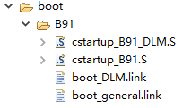{align=left}

The cstartup_B91.S and boot_general.link files are run by default. At this time, the SDK will occupy the I-SRAM and D-SRAM space. I-SRAM includes retention_reset, aes_data, retention_data, ramcode, and unused I-SRAM area. D-SRAM includes data, sbss, bss, heap, unused D-SRAM area and stack.

If you want to leave all the 128K D-SRAM space for users, you need to make the following changes.

(1) Change the #if 1 at the beginning of the cstartup_B91.S file to #if 0.

(2) Change #if 0 at the beginning of the cstartup_B91_DLM.S file to #if 1.

(3) Copy the content of boot_DLM.link to the boot.link file of the project.

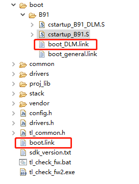

For more information about I-SRAM and D-SRAM, please refer to "2.1.2 SRAM Space Allocation".

The SDK runs deepsleep retention 32K by default. If you want to switch to deepsleep retention 64K, you need to add the following code to the user_init_normal() function Power Management initialization:

```C
blc_pm_setDeepsleepRetentionType(DEEPSLEEP_MODE_RET_SRAM_LOW64K);
```

## Demo Codes

Telink BLE SDK provides users with multiple BLE demos.

Users can observe intuitive effects by running the software and hardware demo. Users can also modify the demo code to complete their own application development. Demo codes path is shown as below.

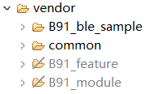

### BLE Slave Demo

BLE slave demos and their differences are shown in the table below.

Table: BLE slave demo

------------------------------------------------------------------------------------------------------------------------------------------------------
Demo             Stack                    Application                                                   MCU Funciton
---------------- ------------------------ ------------------------------------------------------------- ----------------------------------------------
B91 module       BLE controller + host    Application is on the master MCU                              BLE transparent transmission module (UART)

B91 ble sample   BLE controller + host    The simplest slave demo, broadcast and connection functions   Master MCU
------------------------------------------------------------------------------------------------------------------------------------------------------

B91 module is a complete BLE slave stack provided by Telink. The B91 module is only used as a BLE transparent transmission module, and communicates with the master MCU through the UART interface. Generally, the application code is written in the master MCU of the other party.


Demo             Stack                    Application                                                   MCU Funciton
---------------- ------------------------ ------------------------------------------------------------- ----------------------------------------------
B91 module       BLE controller + host    Application is on the master MCU                              BLE transparent transmission module (UART)

B91 ble sample   BLE controller + host    The simplest slave demo, broadcast and connection functions   Master MCU
------------------------------------------------------------------------------------------------------------------------------------------------------

The B91 ble sample is also a complete BLE slave stack provided by Telink. It can be paired and connected with standard IOS/android devices.


------------------------------------------------------------------------------------------------------------------------------------------------------
Demo             Stack                    Application                                                   MCU Funciton
---------------- ------------------------ ------------------------------------------------------------- ----------------------------------------------

B91 module       BLE controller + host    Application is on the master MCU                              BLE transparent transmission module (UART)

B91 ble sample   BLE controller + host    The simplest slave demo, broadcast and connection functions   Master MCU

------------------------------------------------------------------------------------------------------------------------------------------------------

### Feature Demo

B91_feature provides demo codes for some commonly used BLE-related features. Users can refer to these demos to complete their own function implementation. See code for details. The BLE section of this document will introduce all the features.

------------------------------------------------------------------------------------------------------------------------------------------------------
Demo             Stack                    Application                                                   MCU Funciton
---------------- ------------------------ ------------------------------------------------------------- ----------------------------------------------

B91 module       BLE controller + host    Application is on the master MCU                              BLE transparent transmission module (UART)

B91 ble sample   BLE controller + host    The simplest slave demo, broadcast and connection functions   Master MCU
------------------------------------------------------------------------------------------------------------------------------------------------------

Select the macro "FEATURE_TEST_MODE" in feature_config.h in the B91_feature project to switch to the demo of different features.

The "Feature Demo Introduction" chapter of this document will introduce the simple use of each demo.

## Project Configuration

Under most circumstances, the default configured BLE_SDK is used and user does not need to modify it. If users want to build a new project of their own, the following configuration is recommended.

### Tool Setting

(1) Symbols Define

This is to deifine macros in SDK, by adding the following configuration:

CHIP_TYPE=CHIP_TYPE_9518

\__PROJECT_B91_BLE_SAMPLE__=1

The detailed configuration is as following:

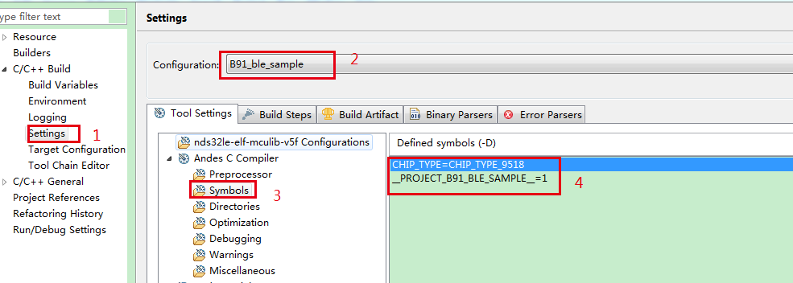

Please be noted, select the corresponding project when configuring, as in step 2 in the above figure, or select all projects at the same time, by selecting [All configurations].

(2) Directories

To add directories:

```C
"${workspace_loc:/${ProjName}}"
```

As shown below.

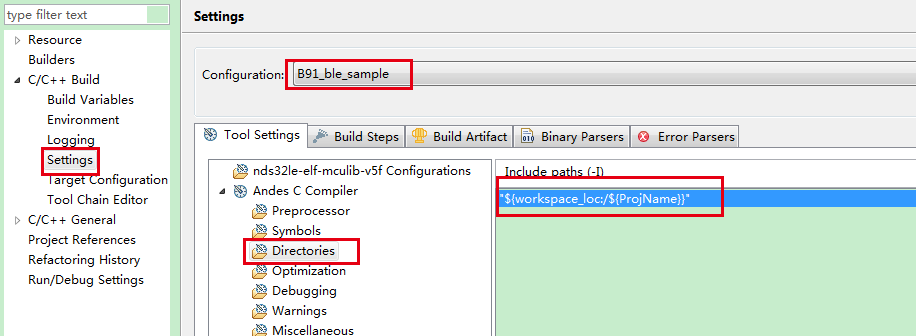

(3) Optimization Config

For compiler optimization options, users need to tick the three options as shown below.

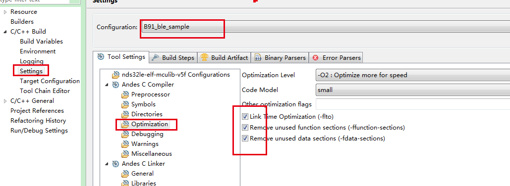

(4) Miscellaneous config

Add

```C
-c -fmessage-length=0 -fno-builtin -fomit-frame-pointer -fno-strict-aliasing -fshort-wchar -fuse-ld=bfd -fpack-struct
```

in other flags.

(5) Libraries set

To use BLE_SDK, we need to add our stack library file. The configuration method of the link library file is as following,
Add B91_ble_lib in Libraries.

Library search path:

```C
"${workspace_loc:/${ProjName}/proj_lib}"
```

Detailed configuration is shown as below:

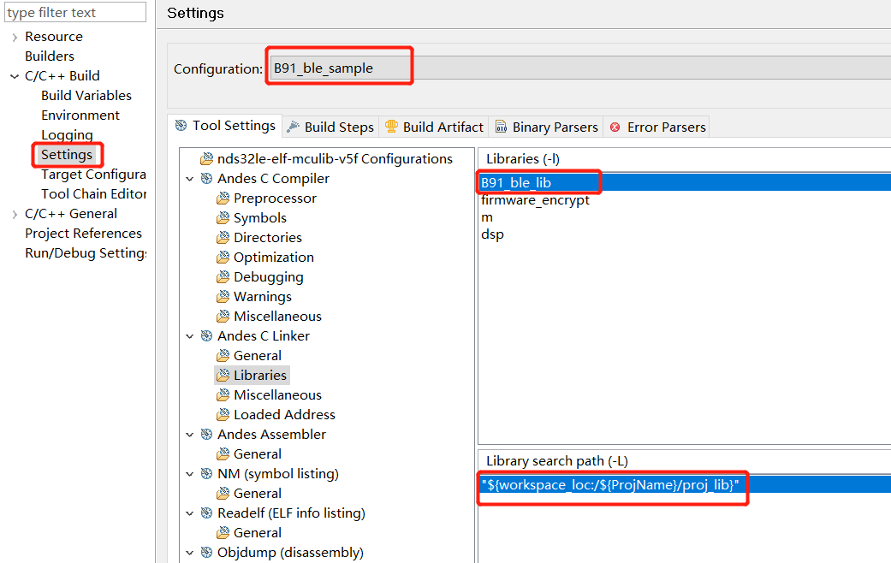

(6) Objcopy General

This item is to cancel the automatic generation of the bin file, the configuration is as follows:

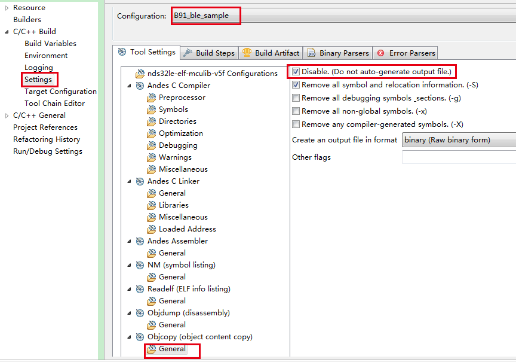

### 创建

In this step, you need to add the following command to the Command of Post-build steps:

```c
"${workspace_loc:/${ProjName}}/tl_check_fw.bat" ${ConfigName}
```

In the previous section, we introduced how to cancel the automatic bin file generation. The purpose of this step is to call the tl_check_fw.bat script in the post build phase to generate the bin file and add the CRC field at the end.

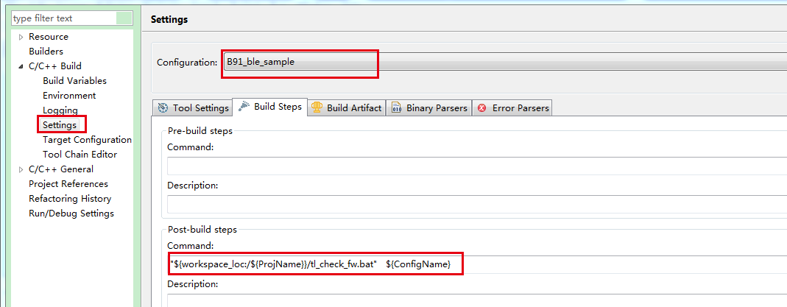

### 创建Artifact <a name="artifact"></a>

Select the elf option in the Artifact extension of Build Artifact, as shown below.

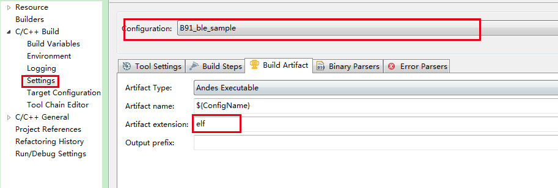


# MCU Basic Modules

## <a id="address">MCU地址</a>

### <a id="地址">地址A</a>

The default flash program storage is 1 MB.

The chip supports 256 KB SRAM, including 128 KB ILM (instruction local memory) and 128 KB DLM (data local memory).

In this document， ILM will be called as I-SRAM, and DLM as D-SRAM.

The address space allocation is shown in the <a id="tupian">figure</a> below.

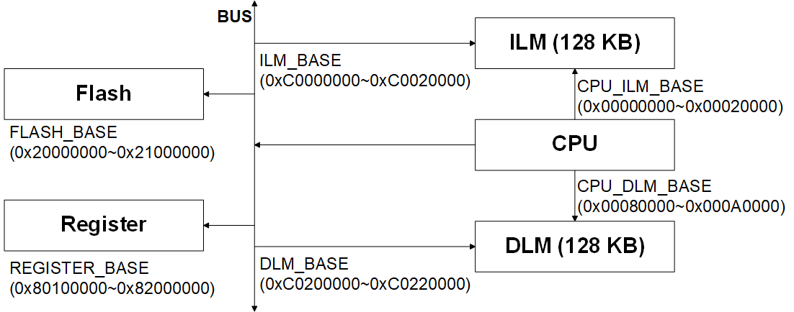

- Program space address range：0x20000000~0x21000000

- Register accessing address range：0x80100000~0x820000004

- ILM bus accessing address range: 0xC0000000~0xC0020000

- DLM bus accessing address range: 0xC0200000~0xC0220000

- ILM CPU accessing address range: 0x00000000~0x00020000

- DLM CPU accessing address range: 0x00080000~0x000A0000

### SRAM Space Allocation

The B91 chip embeds 2 kind of SRAMs, one is I-SRAM (128 KB), the other is D-SRAM (128 KB), I-SRAM stores instructions and data, and D-SRAM stores only data.

The SRAM space allocation is defined by the deep-sleep retention function of the low-power management part.  Please first get familiar with deep-sleep retention function.

#### SRAM and Firmware Space

The allocation of SRAM space in MCU address space will be explained in detail.

128KB I-SRAM CPU access address range is 0x00000000~0x00020000, 128KB D-SRAM CPU access address range is 0x00080000~0x000A0000.

The figure below shows the corresponding SRAM and Firmware space allocation instructions when both I-SRAM and D-SRAM are used at the same time in the deep-sleep retention 32K mode.

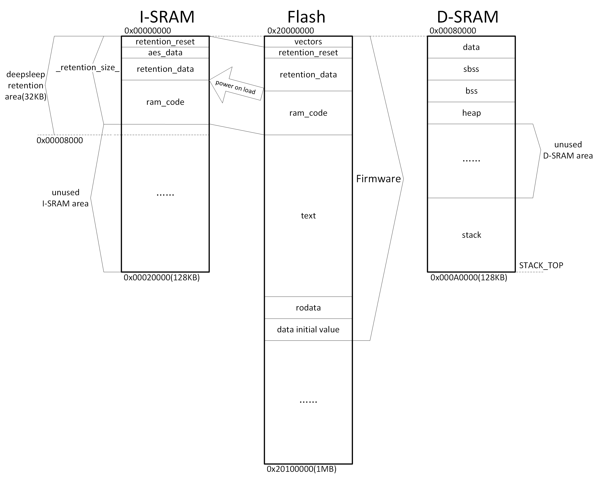

The files related to the SRAM space allocation in the above figure are cstartup_B91.S and boot.link (from the "1.2 software bootloader introduction" section, we can see that the content of boot.link here is the same as the boot_general.link file). (If you use the deep-sleep retention 64K mode, the range of the deep-sleep retention area at the top left of the figure above is 0x00000000~0x00010000.)

Firmware in Flash includes vectors, retention_reset, retention_data, ram_code, text, rodata, and data initial value.

I-SRAM includes retention_reset, aes_data, retention_data, ram_code, and unused I-SRAM area.

The retention_reset / retention_data / ram_code in I-SRAM is a copy of retention_reset / retention_data / ram_code in Flash.

D-SRAM includes data, sbss, bss, heap, unused D-SRAM area and stack.

The initial value of data in D-SRAM is the initial value of data in Flash.

Detailed introduction of each segment in figure above is shown as below.

(1) vectors and retention_reset

"Vectors" and "retention_reset" are the programs corresponding to the assembly file cstartup_B91.S, which are the software bootloader. The vectors section is at the starting address of Flash, and the retention_reset section is at the starting address of I-SRAM. After the chip is powered on or wakes up from normal deep sleep, it jumps to the starting address of Flash (0x20000000) to start execution. If it is deep sleep retention wakes up, it will start execution from the starting address of I-SRAM (0x00000000).

(2) aes_data

The cache data of the hardware AES module is stored in the aes_data section, which is on I-SRAM, and the length is fixed to 32Bytes, which cannot be changed by the user. When running the bootloader, it will be set to 0 directly on the I-SRAM.

(3) retention_data

The deep sleep retention mode of B91 supports that after MCU enters retention， the first 32K/64K of I-SRAM can keep the power，thus keep the data.

If the global variables in the program are compiled directly, they will be allocated in the "data" section, "sbss" section or "bss" section. The contents of these three sections are all stored in D-SRAM and will be lost when  power down after entering deep sleep retention.

If you want some specific variables to be stored in spite of power down during the deep sleep retention mode, just assign them to the "retention_data" section, by adding the keyword "_attribute_data_retention_" when defining the variables. Here are a few examples:

```C
_attribute_data_retention_	int 	AA;
_attribute_data_retention_	unsigned int BB = 0x05;
_attribute_data_retention_	int	CC[4];
_attribute_data_retention_	unsigned int DD[4] = {0,1,2,3};

```

Regardless of whether the initial value of the global variables in the "retention_data" section is 0, their initial value will be prepared unconditionally and stored in the retention_data area of the flash. The MCU will copy from the Flash to the retention_data area of the I-SRAM after power-on or normal deep sleep wake up.

I-SRAM's "retention_reset + aes_data + retention_data + ram_code" are arranged in sequence in front of the I-SRAM, and their total size is "\_retention_size_". After the MCU is powered on or wakes up from normal deep sleep, as long as the program does not enter normal deep sleep (only suspend/deep sleep retention) during execution, the content of "_retention_size_" is always kept on the I-SRAM, and the MCU does not need to read it from the Flash.

The method of evaluating "\_retention_size_" is based on the "Sections" at the beginning of the objdump file, using the "Size" of the "ram_code" segment and the addition of "VMA" to get the actual "\_retention_size_" size. For example, the size of "\_retention_size_" in the figure below is 0x5b02 + 0xf00, about 26.5KB.

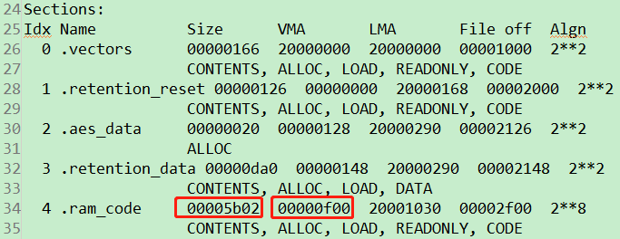

If users do not want to waste too much "\_retention_size_", they can switch to retention_data/ram_code by adding corresponding keywords to the variable/function (function) that was not previously in retention_data/ram_code. The variable placed in retention_data can also save initialization time to reduce power consumption (for specific reasons, please refer to the introduction in the low power management section).

If the configuration selected by the user uses the deep sleep retention 32K mode, but the defined "\_retention_size_" exceeds the defined 32K, for example, the size of the "\_retention_size_" in the figure below is 0x5b02 + 0x3700, which is about 36.5KB. The ram_code beyond 32K will enter Deep sleep retention mode and lost content.

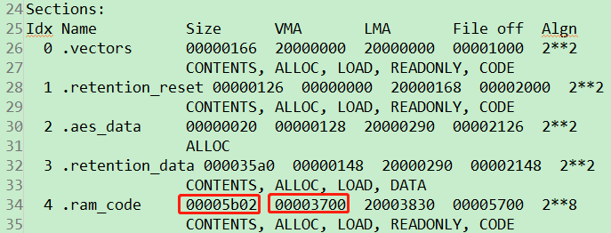

Users can modify with one of the following ways:
One is to reduce the attribute content of the defined "\_attribute_data_retention_" section or "\_attribute_ram_code_" section.
The second is to switch to the deep sleep retention 64K mode. For detailed configuration methods, refer to the section "1.2 Software bootloader introduction".

(4) ram_code

The "ram_code" section is the code that requires permanent memory in the Flash Firmware, corresponding to all functions in the SDK with the keyword "\_attribute_ram_code_", such as the rf_irq_handler function:

```C
_attribute_ram_code_ void rf_irq_handler(void);
```

There are three reasons why functions stays in memory:

First, because some functions involve timing multiplexing with the four pins of Flash MSPI, they must stay in memory. If they are placed in Flash, timing conflicts will occur and cause crashes, such as all Flash operations functions;

The second is that the functions stay in ram do not need to be re-read from Flash each time they are called, which can save time, so some functions that require execution time can be placed in resident memory to improve execution efficiency. In the SDK, some frequently executed functions related to BLE timing are stored in the memory, which greatly reduces the execution time and ultimately saves power consumption.

The third is that B91 is based on the Risc-V Platform and supports the function of interrupt nesting. For details, please refer to the chapter "2.3 Interrupt Nesting". If the user adds a LEV3 priority interrupt entry function, it must be placed in "ram_code" "segment. Because the current SDK supports LEV2 (BLE interrupt) and LEV3 priority interrupt response when reading and writing Flash, if the newly added LEV3 priority interrupt entry function is not in the "ram_code" section, it will cause timing conflict between Flash pre-fetch operation and the Flash read/write operations, causing a crash.

If the user needs to store a certain function in memory, he can imitate the rf_irq_handler above and add the keyword "\_attribute_ram_code_" to the function. After compilation, the function can be seen in the ram_code section in the objdump file.

After power on, the MCU copy from the Flash to the ram_code area of ​​the I-SRAM.

(5) Cache

Cache is a high-speed cache, divided into I-Cache and D-Cache, each with a fixed size of 8KB, and the access address is not visible to users.
The Cache is enabled by default, which is configured in the cstartup_B91.S file.

```C
  /* Enable I/D-Cache */
    csrr   t0,  mcache_ctl
    ori    t0,  t0,  1  #/I-Cache
    ori    t0,  t0,  2  #/D-Cache
    csrw   mcache_ctl,  t0
    fence.i
```

The permanent code in the memory can be read and executed directly from the SRAM, but only part of the code in the firmware can stay in the SRAM, and most of the codes are still in the Flash. According to the locality principle of the program, part of the Flash code can be stored in the Cache. If the code currently needs to be executed is in the Cache, it is directly read and executed from the Cache; if it is not in the Cache, the code will be read from the Flash and moved to the Cache, then read and execute from the Cache.

The "text" and "rodata" segments of the Firmware are not placed in the SRAM. This part of the code conforms to the principle of program locality and needs to be loaded into the Cache to be executed.

Because the Cache is relatively large, users are not allowed to read Flash in pointer format, because the data read from Flash in pointer format is cached in Cache. If the data in Cache is not overwritten by other content, even the Flash data at that location has been overwritten , when a new request to access the data occurs, the MCU will directly use the content cached in the Cache as the result.

(6) text

The "text" section is a collection of all non-ram_code functions in Flash Firmware. If "\_attribute_ram_code_" is added to the function in the program, it will be compiled into the ram_code section, and all other functions without this keyword will be compiled into the "text" section. The code access in the "text" section needs to pass the caching function of the I-Cache, and the code that needs to be executed can be executed before being loaded into the I-Cache.

(7) rodata

The "rodata" segment in Flash Firmware is the readable and non-re-writeable data defined in the program, and is a variable defined with the keyword "const". For example, the ATT table in Slave:

```C
static const attribute_t my_Attributes[] = ……
```

Users can see that "my_Attributes" is in the "rodata" section in the corresponding objdump file.

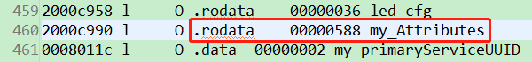

(8) data and data initial value

The "data" section is the global variable that has been initialized by the program stored in the D-SRAM, that is, the global variable whose initial value is not 0. The initial value needs to be stored in the "data initial value" section of the Flash Firmware in advance.

For example, define global variables as follows:

```C
int   testValue = 0x1234;
```

Then the compiler will put the variable testValue in the "data" section of D-SRAM, and store the initial value 0x1234 in the "data initial value" section of the Flash Firmware. When the bootloader is running, the initial value will be copied to the testValue corresponding D-SRAM memory address.

(9) sbss and bss

The "sbss" section and the "bss" section store global variables that are not initialized by the program in the D-SRAM, that is, the global variables whose initial value is 0. sbss is short for small bss. The two parts are connected together, and the initial value does not need to be prepared in advance. When the bootloader is running, it will be set to 0 directly on the D-SRAM.

(10) heap

The "heap" area is allocated to the heap, and the heap grows upward. Generally, we set the unused space behind the bss. If functions such as sprintf/malloc/free are called, these functions will call the \_sbrk function to allocate heap memory, \_Sbrk will use the _end symbol to determine where to start allocating heap space. The definition in the link file is as follows.

```C
PROVIDE (_BSS_VMA_END = .);
	. = ALIGN(8);
	/* end is the starting address of the heap, the heap grows upward */
	_end = .;
	PROVIDE (end = .);	
```

(11) stack

For 128K D-SRAM, "stack" starts from the highest address 0x000A0000, and its direction extends from bottom to top, that is, the stack pointer SP is decremented when data is put on the stack, and incremented when data is popped out of the stack.

By default, the SDK library uses a stack size of no more than 384 bytes, but since the stack size depends on the address of the deepest position of the stack, the final stack usage is related to the user's upper-level program design. If the user uses a troublesome recursive function call, or uses a relatively large local array variable in the function, or other situations that may cause the stack to be deeper, the final stack size will increase.

The stack top position _STACK_TOP is defined in the boot_general.link file.

```C
PROVIDE (_STACK_TOP = 0x00a0000);/*Need to prevent stack overflow*/
```

The stack pointer sp register is initialized in the cstartup_B91.S file.

```C
/* Initialize stack pointer */
la     t0, _STACK_TOP
mv     sp, t0
```

If the user wants all the 128K of D-SRAM space to be reserved for the user, he can put all the data and instructions occupied by the SDK into the I-SRAM. For the modification method, see "1.2 software bootloader introduction."

The figure below shows the corresponding SRAM and Firmware space allocation instructions when the SDK uses only I-SRAM in the deep sleep retention 32K mode.

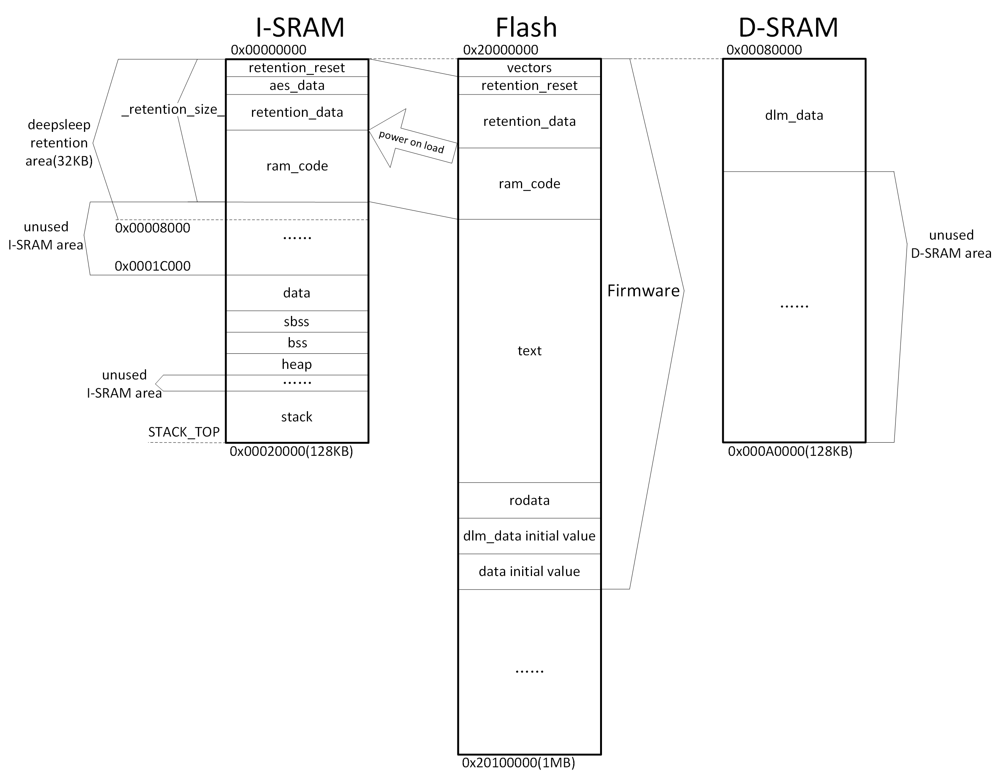

The files related to the SRAM space allocation in the above figure are cstartup_B91_DLM.S and boot.link (from the "1.2 software bootloader introduction" section, we can see that the contents of boot.link here are the same as the boot_DLM.link file). (If you use the deep sleep retention 64K mode, the range of the deep sleep retention area in the above figure is 0x00000000~0x00010000.)

Firmware in Flash includes vectors, retention_reset, retention_data, ram_code, text, rodata, dlm_data initial value, and data initial value.

I-SRAM includes retention_reset, aes_data, retention_data, ram_code, unused I-SRAM area, data, sbss, bss, heap and stack.

The retention_reset / retention_data / ram_code in I-SRAM is a copy of retention_reset / retention_data / ram_code in Flash.
The initial value of data in I-SRAM is the initial value of data in Flash.
Only dlm_data is stored in D-SRAM.
The initial value of dlm_data in D-SRAM is the initial value of dlm_data in Flash.

Please refer to above description for the definition of each segments, here only dlm_data, dlm_data initial value and ram_code are introduced separately.
The "dlm_data" section is a global variable stored in the D-SRAM that has been initialized by the program, that is, a global variable with an initial value other than 0. Its initial value needs to be stored in the "dlm_data initial value" section of the Flash Firmware in advance.
If the user defines variables to D-SRAM, just assign them to the "dlm_data" section, by adding the keyword "\_attribute_data_dlm_" when defining the variable

For example, define global variables as follows:

```C
_attribute_data_dlm_	int   dlm_testValue = 0x12345;
```

Then the compiler will put the variable dlm_testValue in the "dlm_data" section of D-SRAM, and store the initial value 0x12345 in the "dlm_data initial value" section of the Flash Firmware. When the bootloader is running, the initial value will be copied to the dlm_testValue corresponding D-SRAM memory address.

For the 128K I-SRAM, "stack" starts from the highest address 0x00020000, and its direction extends from bottom to top, that is, the stack pointer SP is decremented when data is pushed into the stack, and incremented when data is popped out of the stack.

The stack top position _STACK_TOP is defined in the boot_DLM.link file.

```C
PROVIDE (_STACK_TOP = 0x0020000);/*Need to prevent stack overflow*/
```

#### objdump File Analysis Demo

Here is the simplest demo B91_ble_sample of BLE slave as an example, combined with "SRAM space allocation & Firmware space allocation (SDK uses I-SRAM and D-SRAM)" to analyze.

The bin file and objdump file of B91_ble_sample can be found in the directory "SDK" -> "B91_ble_sample" -> "output" -> "B91_ble_sample.bin" and "objdump.txt".

In the following analysis, there will be multiple screenshots, all from boot_general.link, cstartup_B91.S, B91_ble_sample.bin, and objdump.txt. Please check the files to find the corresponding location of the screenshot.

The distribution of each section in the objdump file is shown in the following figure (note the Algn byte alignment):

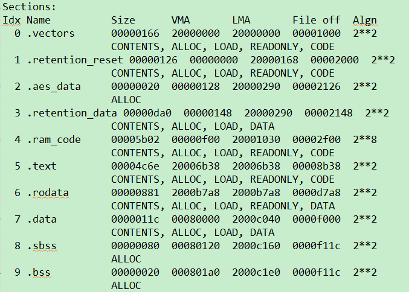

According to the section analysis, below lists the information you need to know, detailed introduction will be introduced later.

(1) vectors:

starting from Flash 0x20000000, size is 0x166, and the end address is calculated as 0x166;

(2) retention_reset:

starting from Flash 0x20000168, size is 0x126, and the end address is calculated as 0x2000028E;

starting from I-SRAM 0x00000000, size is 0x126, and the end address is calculated as 0x00000126;

(3) aes_data:

starting from I-SRAM 0x00000128, size is 0x20, and the end address is calculated as 0x00000148

(4) retention_data:

starting from Flash 0x20000290, size is 0xda0, and the end address is calculated as 0x20001030;

starting from I-SRAM 0x00000148, size is 0xda0, and the end address is calculated as 0x00000EE8;

(5) ram_code:

start fromm Flash 0x20001030，size is 0x5b02， and the end address is calculated as0x20006B32;

start from I-SRAM 0x00000f00，size is 0x5b02， and the end address is calculated as 0x00006A02;

(6) text:

start from Flash 0x20006b38，size is 0x4c6e，and the end address is calculated as 0x2000B7A6;

(7) rodata:

start from Flash 0x2000b7a8，size is 0x881，and the end address is calculated as 0x2000C029;

(8) data:

start from Flash 0x2000c040，size is 0x11c，and the end address is calculated as 0x2000C15C;

start from D-SRAM 0x00080000，size is 0x11c，and the end address is calculated as 0x0008011C;

(9) sbss:

start from Flash 0x2000c160，size is 0x80，and the end address is calculated as 0x2000C1E0;

start from D-SRAM 0x00080120，size is 0x80，and the end address is calculated as 0x000801A0;

(10) bss:

start from Flash 0x2000c1e0，size is 0x20，and the end address is calculated as 0x2000C200;

start from D-SRAM 0x000801a0，size is 0x20，and the end address is calculated as 0x000801C0;

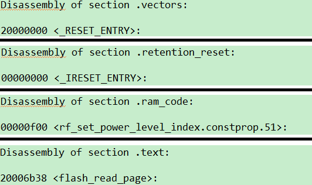

The above picture is the start address of the partial section searching result of  "section"   in the objdump file. together with the above figure "objdump file section statistics", the analysis is as follows:

(1) vector:

the start address of "vectors" section in the Flash Firmware is 0x20000000, end address is 0x20000168 (the last data address is 0x20000162~0x20000165), and the size is 0x166.

The "vectors" section will not be copied to SRAM.

(2) retention_reset:

the "retention_reset" segment starts at 0x20000168 in Flash, ends at 0x20000290 (the last data address is 0x2000028A~0x2000028D), and the size is 0x126. It will be copied to  I-SRAM when power on.

The "retention_reset" segment  has a starts at 0x00000000 in I-SRAM, end at 0x00000128 (the last data address is 0x00000122~0x00000125), and the size is 0x126.

(3) aes_data:

"aes_data" will not be copied to Flash.

"aes_data" starts at 0x00000128 and ends at 0x00000148 in I-SRAM（the last data address is 0x00000144~0x00000147）， the size is 0x20.

(4) retention_data:

"retention_data" segment starts at 0x20000290 in Flash, ends at 0x20001030 (the last data address is 0x2000102D~0x2000102F), and the size is 0xda0. It will be copied to I-SRAM when power on.

"Retention_data" segment starts at 0x00000148 in I-SRAM, and ends at 0x00000f00 (the last data address is 0x00000EE4~0x00000EE7), and the size is 0xda0. 0x00000EE8~0x00000EFF is invalid I-SRAM area.

(5) ram_code:

"ram_code" segment start at 0x20001030 in Flash, and ends at address 0x20006b38 (the last data address is 0x20006B2E~0x20006B31), the size is 0x5b02. It will be copied to I-SRAM when power on.

The "ram_code" segment in I-SRAM starts at 0x00000f00, the last data address is 0x000069FE~0x00006A01, and the size is 0x5b02. The end address can be used up to 0x00020000 theoretically.

(6) Cache:

I-Cache and D-Cache related information will not show in objdump files.

(7) text:

the start address of "text" segment in Flash is 0x20006b38, the end address is 0x2000b7a8 (the last data address is 0x2000B7A2~0x2000B7A5), and the size is 0x4c6e.

(8) rodata:

the start address of "rodata" segment in Flash is 0x2000b7a8, the end address is 0x2000c040 (the last data address is 0x2000C025~0x2000C028), and the size is 0x881.

(9) data:

the start address of "data" segment in Flash is 0x2000c040, the end address is 0x2000c160 (the last data address is 0x2000C158~0x2000C15B), and the size is 0x11c.

The start address of "data" segment in D-SRAM is 0x00080000, the end address is 0x00080120 (the last data address is 0x00080118~0x0008011B), and the size is 0x11c.

(10) sbss:

"sbss" segment starts at 0x2000c160 in Flash, ends at 0x2000c1e0 (the last data address is 0x2000C1DC~0x2000C1DF), and the size is 0x80.

The "sbss" segment in D-SRAM has a start address of 0x00080120, an end address of 0x000801a0 (the last data address is 0x0008019C~0x0008019F), and the size is 0x80.

(11) bss:

the start address of "bss" segment in Flash is 0x2000c1e0, the last data address is 0x2000C1FC~0x2000C1FF, and the size is 0x20.

The "bss" segment starts at 0x000801a0 in D-SRAM, the last data address is 0x000801BC~0x000801BF, and the size is 0x20.

### MCU Address Space Access

The access to the address space in the program is divided into two situations: peripheral space and Flash space.

#### Peripheral Space R/W Operation

The program uses the functions write_reg8(addr,v), write_reg16(addr,v), write_reg32(addr,v), read_reg8(addr), read_reg16(addr), read_reg32(addr) to read and write the registers in the peripheral space. It is pointer operation. For more information, please refer to drivers/B91/sys.h.

```C
#define REG_RW_BASE_ADDR  	0x80000000
#define write_reg8(addr,v)	(*(volatile unsigned char*)(REG_RW_BASE_ADDR | (addr)) = (unsigned char)(v))
#define write_reg16(addr,v)	(*(volatile unsigned short*)(REG_RW_BASE_ADDR | (addr)) = (unsigned short)(v))
#define write_reg32(addr,v)	(*(volatile unsigned long*)(REG_RW_BASE_ADDR | (addr)) = (unsigned long)(v))
#define read_reg8(addr)		(*(volatile unsigned char*)(REG_RW_BASE_ADDR | (addr)))
#define read_reg16(addr)	(*(volatile unsigned short*)(REG_RW_BASE_ADDR | (addr)))
#define read_reg32(addr)	(*(volatile unsigned long*)(REG_RW_BASE_ADDR | (addr)))
```

Note: operations write_reg32(0x140824)/read_reg16(0x140300) and alike are defined as shown above, as can be seen that the offset of 0x80000000 is automatically added, so the MCU can ensure that it is accessing the Register space, but not the Flash space.

The program uses functions write_sram8(addr,v), write_sram16(addr,v), write_sram32(addr,v), read_sram8(addr), read_sram16(addr), read_sram32(addr) to read/write the I-SRAM and D-SRAM of the peripheral space, it is also a pointer operation, without automatically adding an offset, so pay attention to the address, it is different when operating I-SRAM and D-SRAM. For more information, please refer to drivers/B91/sys.h.

```C
#define write_sram8(addr,v)			(*(volatile unsigned char*)( (addr)) = (unsigned char)(v))
#define write_sram16(addr,v)		(*(volatile unsigned short*)( (addr)) = (unsigned short)(v))
#define write_sram32(addr,v)		(*(volatile unsigned long*)( (addr)) = (unsigned long)(v))
#define read_sram8(addr)			(*(volatile unsigned char*)((addr)))
#define read_sram16(addr)          	(*(volatile unsigned short*)((addr)))
#define read_sram32(addr)          	(*(volatile unsigned long*)((addr)))
```

**Note:**

> The functions to read and write to I-SRAM and D-SRAM in peripheral space are generally only used in a few debug modes and must use the free sram space to ensure that normal program execution is not disrupted.

#### Flash Space Operation

The flash_read_page and flash_write_page functions are used to read and write Flash space respectively, and flash_erase_sector is to erase Flash.

**Note:**

> The starting address of address parameter is 0x0 for Flash operation functions.

(1) Flash Erase Operation

Call function flash_erase_sector to erase Flash.

```C
void flash_erase_sector(unsigned long addr);
```

A sector is 4096 bytes, e.g. 0x13000~0x13FFF is a complete sector.
addr must be the first address of a sector, this function erases the entire sector each time.
It takes a long time to erase a sector. When the system clock is 16M, it takes about 10~20ms or even longer.

(2) Flash Read/Write Operation

Flash read and write operations can only be implemented by calling flash_read_page and flash_write_page functions.

```C
void flash_read_page(unsigned long addr, unsigned long len, unsigned char *buf);
void flash_write_page(unsigned long addr, unsigned long len, unsigned char *buf);
```

The flash_read_page function reads the content on Flash:

```C
u8 data[6] = {0 };
flash_read_page(0x11000, 6, data); //read 6 bytes from Flash 0x20011000 into data array.
```

The flash_write_page function writes to Flash:

```C
flash_write_page(u32 addr, u32 len, u8 *buf);
u8 data[6] = {0x11, 0x22, 0x33, 0x44, 0x55, 0x66 };
flash_write_page(0x12000, 6, data); //Write 0x665544332211 to 6 bytes start from 0x20012000 in Flash.
```

**Note:**

> Flash must be erased before writing. A page in Flash is 256 bytes. The flash_write_page function supports cross-page write operations.

(3) Impact of interrupt on Flash operation

The B91 series chips support interrupt nesting function, please refer to section "2.3 Interrupt Nesting". The three Flash operation functions described above, flash_read_page, flash_write_page, and flash_erase_sector, will set the interrupt threshold to 1 when executed, allowing interrupts with an interrupt priority higher than 1 to interrupt the Flash operation function, and continue to execute the Flash operation after responding to the interrupt. The interrupt threshold will be set to 0 after executing the Flash operation function.

### SDK Flash Space Allocation

Flash takes the size of a sector (4K byte) as the basic unit, because Flash erase is based on sector (the erase function is flash_erase_sector), theoretically the same type of information needs to be stored in a sector, different types of information need to be in different sectors (to prevent other types of information from being erased by mistake when erasing information). Therefore, it is recommended that users follow the principle of "different types of information in different sectors" when using Flash to store customized information.

The B91 chip supports 1MB of Flash as program storage space by default. The SDK defines "FLASH_SIZE" as 1MB at the end of the file boot.link, and makes a restriction judgment on "BIN_SIZE" <= "FLASH_SIZE". If the user uses Flash larger than 1MB, this description need to be modified.

```C
PROVIDE (FLASH_SIZE = 0x0100000);
ASSERT((BIN_SIZE)<= FLASH_SIZE, "BIN FILE OVERFLOW");
```

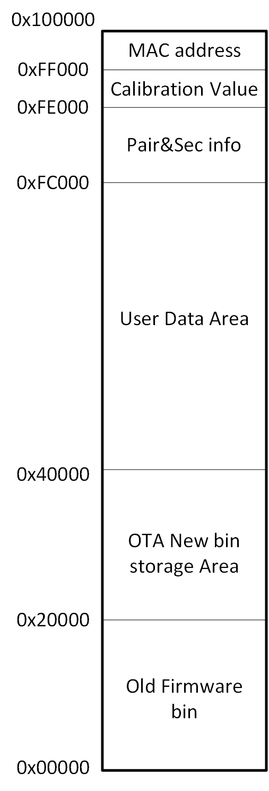{ height=768px }

B91's default Flash size is 1MB. The above figure shows Flash address allocation. Users can plan address allocation according to their needs. The following describes the default address allocation method and the corresponding interface to modify the address.

(1) The 0xFF000~0xFFFFF sector stores the MAC address. In fact, the 6 bytes of MAC address are stored in 0xFF000 ~ 0xFF005, the high byte address is stored in 0xFF005, and the low byte address is stored in 0xFF000. For example, the contents of FLASH 0xFF000 to 0xFF005 are 0x11 0x22 0x33 0x44 0x55 0x66, then the MAC address is 0x665544332211.

Telink’s mass production jig will burn the actual product’s MAC address to the address 0xFF000, which corresponds to the SDK. If the user needs to modify this address, please ensure that the address programmed by the firmware is also modified accordingly. In the SDK, the user_init function will read the MAC address from the CFG_ADR_MAC_1M_FLASH address of the Flash. This macro can be modified in /vendor/common/blt_common.h.

```C
#ifndef		CFG_ADR_MAC_1M_FLASH
#define		CFG_ADR_MAC_1M_FLASH		  0xFF000
#endif
```

(2) The 0xFE000~0xFEFFF sector stores the information that Telink MCU needs to calibrate and customize. Only this part of the information does not follow the principle of "different types of information are placed in different sectors". This sector's 4096 bytes is divided into different units in groups of 64 bytes, and each unit stores one type of calibration information. The calibration information can be placed in the same sector, because the calibration information is burned to the corresponding address during the firmware burning process. The actual firmware can only read the calibration information when it is running, and it is not allowed to write or erase. . The specific allocation is:

- The first 64bytes stores frequency offset calibration information. The actual calibration value is only one byte, which is stored in 0xFE000.

- The second 64bytes stores TP calibration value: B91 series chips do not need.

- The third 64bytes stores the capacitance calibration value of the external 32k crystal in 0xFE080.

- The fourth 64bytes stores the internal ADC calibration value in 0xFE0C0.

- The space behind is reserved for other calibration values that may be needed.

(3) The two sectors 0xFC000~0xFDFFF are occupied by the BLE protocol stack system to store pairing and encryption information. The user can also modify the positions of these two sectors. The size is fixed at two sectors 8K and cannot be modified. You can call the following function to modify the starting address of the paired encryption information storage:

```C
void 	bls_smp_configParingSecurityInfoStorageAddr (int addr);
```

(4) 0x00000~0x3FFFF 256KB space is used as program space by default. The 256KB 0x00000~0x3FFFF is the firmware storage space, 0x40000~0x7FFFF 256KB is the space for storing new firmware during OTA update, that is, the supported firmware space is theoretically 256KB, the space of the high address 0x40000~0x7FFFF is actually only used 254KB, the last 4KB cannot be used.

**Note:**

> The last 4KB of all high address spaces cannot be used.

If the default 256K program space is too small for the user, and the user wants the firmware space to be 512KB, the protocol stack also provides the corresponding API, and the modification method is described in the OTA chapter below.

(5) The remaining Flash space is all used as user data storage space.

## Clock Module

### Clock Overview

The Clock of B91 is relatively complicated. The following figure shows part of the clock tree. the following clocks will be detailed in this part, pll_clk/cclk/hclk/pclk/clk_mspi/clk_stimer.

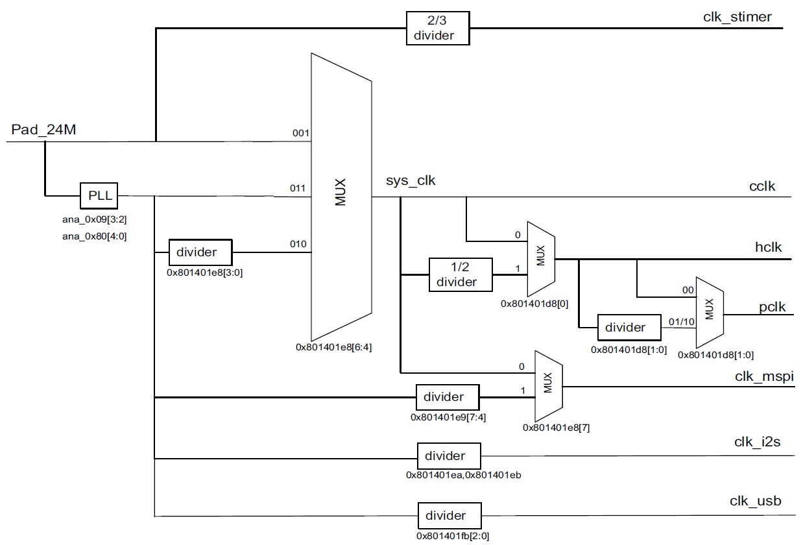

- pll_clk: the PLL in the figure above, it is the source of many module clocks, including sys_clk, which is generally used by frequency division from PLL.
  
- cclk: i.e.， cpu clk, the speed of the program is determined by this clock, and it is also the only clock source for hclk and pclk.
  
- hclk: all modules hanging on the AHB bus use hclk.
  
- pclk: all modules hanging on the APB bus use pclk.
  
- mspi_clk: mspi connects to Flash, and performs Flash related operations (including fetching instructions, reading and writing Flash, etc.) are all controlled by this clock.
  
- clk_stimer: The system timer is a read-only timer that provides a time reference for the timing control of BLE, and can also be provided to the user. The System Timer is obtained by an external 24M Crystal Oscillator divided by 2/3 16MHz.

As you can see in the figure above, sys_clk (system clock) is obtained by frequency multiplication/division of an external 24M crystal oscillator.
Call API clock_init() during initialization to configure pll_clk/cclk/hclk/pclk/clk_mspi. The SDK has defined some commonly used clocks.

```C
//PCLK can't larger than 24MHz, HCLK can't larger than 48MHz
#define  	CCLK_16M_HCLK_16M_PCLK_16M		clock_init(PLL_CLK_192M, PAD_PLL_DIV, PLL_DIV12_TO_CCLK, CCLK_DIV1_TO_HCLK, HCLK_DIV1_TO_PCLK, PLL_DIV4_TO_MSPI_CLK)
#define		CCLK_24M_HCLK_24M_PCLK_24M		clock_init(PLL_CLK_192M, PAD_PLL_DIV, PLL_DIV8_TO_CCLK, CCLK_DIV1_TO_HCLK, HCLK_DIV1_TO_PCLK, PLL_DIV4_TO_MSPI_CLK)
#define		CCLK_32M_HCLK_32M_PCLK_16M		clock_init(PLL_CLK_192M, PAD_PLL_DIV, PLL_DIV6_TO_CCLK, CCLK_DIV1_TO_HCLK, HCLK_DIV2_TO_PCLK, PLL_DIV4_TO_MSPI_CLK)
#define		CCLK_48M_HCLK_48M_PCLK_24M		clock_init(PLL_CLK_192M, PAD_PLL_DIV, PLL_DIV4_TO_CCLK, CCLK_DIV1_TO_HCLK, HCLK_DIV2_TO_PCLK, PLL_DIV4_TO_MSPI_CLK)
#define		CCLK_64M_HCLK_32M_PCLK_16M		clock_init(PLL_CLK_192M, PAD_PLL_DIV, PLL_DIV3_TO_CCLK, CCLK_DIV2_TO_HCLK, HCLK_DIV2_TO_PCLK, PLL_DIV4_TO_MSPI_CLK)
#define		CCLK_96M_HCLK_48M_PCLK_24M		clock_init(PLL_CLK_192M, PAD_PLL_DIV, PLL_DIV2_TO_CCLK, CCLK_DIV2_TO_HCLK, HCLK_DIV2_TO_PCLK, PLL_DIV4_TO_MSPI_CLK)
```

The system timer has a fixed frequency of 16MHz, so for this timer, the following values are used in the SDK code to represent s, ms, and us. Since the System Timer is the benchmark for BLE timing, all BLE time-related parameters and variables in the SDK use "SYSTEM_TIMER_TICK_xxx".

```C
enum{
	SYSTEM_TIMER_TICK_1US 		= 16,
	SYSTEM_TIMER_TICK_1MS 		= 16000,
	SYSTEM_TIMER_TICK_1S 		= 16000000,

	SYSTEM_TIMER_TICK_625US  	= 10000,  //625*16
	SYSTEM_TIMER_TICK_1250US 	= 20000,  //1250*16
};
```

The following APIs in the SDK are some operations related to the System Timer. These APIs have used the above-mentioned similar "xxx_TIMER_TICK_xxx" method to indicate time. When users operate these APIs, they can enter us or ms according to the parameter prompt.

```C
void delay_us(u32 microsec);
void delay_ms(u32 millisec);
clock_time_exceed(unsigned int ref, unsigned int us)
```

### System Timer Usage

After the initialization of sys_init in the main function is completed, the System Timer starts to work, and the user can read the value of the System Timer counter (referred to as System Timer tick).

The System Timer tick is incremented by one every clock cycle, and its length is 32bit, that is, every 1/16 us plus 1, the minimum value is 0x00000000, and the maximum value is 0xffffffff. When the System Timer starts, the tick value is 0, and the time required to reach the maximum value of 0xffffffff is: (1/16) us * (2^32) approximately equal to 268 seconds, and the System Timer tick makes one cycle every 268 seconds.
The system tick will not stop when the MCU is running the program.

The reading of System Timer tick can be obtained through the clock_time() function:

```C
u32 current_tick = clock_time();
```

The entire BLE timing of the BLE SDK is designed based on the System Timer tick. This System Timer tick is also used extensively in the program to complete various timing and timeout judgments. It is strongly recommended that users use this System Timer tick to implement some simple timing and timeout judgments.

For example, to implement a simple software timing. The realization of the software timer is based on the query mechanism. Because it is implemented through query, it cannot guarantee real-time performance and readiness. It is generally used for applications that are not particularly demanding on error. Implementation:

(1) Start timer: set a u32 variable, read and record the current System Timer tick.

```C
u32 start_tick = clock_time();   // clock_time() returns System Timer tick value
```

(2) Constantly inquire whether the difference between the current System Timer tick and start_tick exceeds the time value required for timing in the program. If it exceeds, consider that the timer is triggered, perform corresponding operations, and clear the timer or start a new round of timing according to actual needs.

Assuming that the time to be timed is 100 ms, the way to query whether the time is reached is:

```C
if( (u32) ( clock_time() - start_tick) >  100 * CLOCK_16M_SYS_TIMER_CLK_1MS)
```

Since the difference is converted to the u32 type, the limit of the system clock tick from 0xffffffff to 0 is solved.

In fact, in order to solve the problem of conversion to u32 caused by different system clocks, the SDK provides a unified calling function. Regardless of the system clock, the following functions can be used to query and judge:

```C
if( clock_time_exceed(start_tick, 100 * 1000))  //unit of the second parameter is us
```

Please be noted: since the 16MHz clock rotates for 268 seconds once, this query function is only applicable to the timing within 268 seconds. If it exceeds 268 seconds, you need to add a counter to accumulate in the software (not introduced here).

Application example: after 2 seconds when A condition is triggered (only once), the program performs B() operation.

```C
u32  a_trig_tick;
int  a_trig_flg = 0;
while(1)
{
		if(A){
			a_trig_tick = clock_time();
			a_trig_flg = 1;
		}
		if(a_trig_flg && clock_time_exceed(a_trig_tick,2 *1000 * 1000)){
			a_trig_flg = 0;
			B();
		}	
}
```

## Interrupt Nesting

### Interrupt Nesting Overview

The B91 series supports interrupt nesting. First, explain the following three concepts: interrupt priority, interrupt threshold, and interrupt preemption.

(1) The interrupt priority is the level of each interrupt, which needs to be configured when initializing the interrupt;

(2) The interrupt threshold refers to the threshold for responding to interrupts. Only interrupts with an interrupt priority higher than the interrupt threshold will be triggered;

(3) Interrupt preemption means that when the priority of two interrupts is higher than the interrupt threshold, if the current lower priority interrupt is being responded, the higher priority interrupt can be triggered to preempt the lower priority interrupt and execute. After finishing the higher-priority interrupt, continue to execute the lower-priority interrupt.

**Note:**

> The interrupt nesting function is enabled by default, and the interrupt threshold is 0 by default.

The interrupt priority can be set in the range of 1~3. The interrupt priority currently only supports the highest setting to 3. The larger the number, the higher the priority. The priority enumeration is as follows:

```C
typedef enum{
		IRQ_PRI_LEV1 = 1,
		IRQ_PRI_LEV2,
		IRQ_PRI_LEV3,
}irq_priority_e;
```

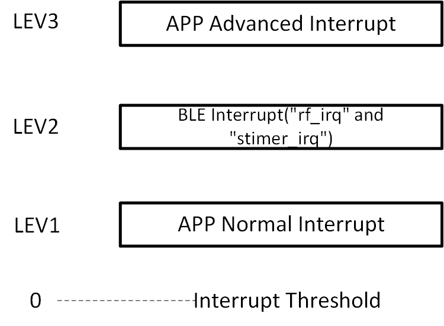

As shown in the figure above, the BLE SDK has three types of priority interrupts, and users must use them according to this category. The interrupt priority level LEV1 has the lowest interrupt level and is assigned to the user-defined normal APP interrupt. The interrupt priority level of LEV2 is in the middle. It is forcibly assigned to BLE interrupts. User-defined interrupts cannot use LEV2. Interrupt priority LEV3 has the highest interrupt level. It is generally not recommended to use it. It is only used when real-time response is required in some special occasions. It is also assigned to user-defined APP advanced interrupts.

The BLE SDK has set the interrupt priority of the BLE interrupt ("rf_irq" and "stimer_irq") to IRQ_PRI_LEV2 in the initialized blc_ll_initBasicMCU, and the interrupt threshold is set to 0 (the interrupts of LEV1~LEV3 priority can be triggered).

For user-defined normal APP interrupts, the interrupt priority needs to be set to IRQ_PRI_LEV1, without limiting the execution time, BLE interrupts and APP advanced interrupts will preempt normal APP interrupts.

If the user has the need for advanced interrupts in the APP, the interrupt priority needs to be set to IRQ_PRI_LEV3, and the code must be placed in the ram_code segment, it will preempt the BLE interrupt and the APP ordinary interrupt, so the user must limit the execution time to less than 50us to avoid affecting the BLE interrupt .

The reason why all the codes of the APP advanced interrupt must be placed in ram_code it that, when the erase, read, and write operation functions of the Flash space are executed, the interrupt threshold is set to 1, and the interrupt threshold is set to 0 after the Flash operation function is executed. In this case, during the execution of the Flash operation function, the priority of the BLE interrupt and the APP advanced interrupt are greater than the interrupt threshold 1. They may be triggered during the execution of the Flash operation function. If the triggered interrupt function is not placed The ram_code segment will cause a timing conflict between the Flash pre-fetch instruction operation and the read/write Flash operation, resulting in a crash. The relevant codes of the BLE interrupt have been put into the ram_code section, so all the relevant codes of the APP advanced interrupt must be put in the ram_code section.

### Interrupt Nesting Application

#### App Normal Interrupt

For example, if the user wants to set a PWM APP general interrupt, when configuring the interrupt, define the interrupt priority as IRQ_PRI_LEV1, the method is as follows.

```C
plic_set_priority(IRQ16_PWM, IRQ_PRI_LEV1);
```

The type of interrupt response function is not limited.

```C
void pwm_irq_handler(void)
{
		……
}
```

#### App High-priority Interrupt

For example, the user wants to set a Timer0 APP high-priority interrupt. When configuring the interrupt, define the interrupt priority as IRQ_PRI_LEV3. Pay attention to controlling the interrupt execution time of Timer0 to be less than 50us. The method is as follows.

```C
plic_set_priority(IRQ4_TIMER0, IRQ_PRI_LEV3);
```

The interrupt response function must be defined as the ram_code section, the method is as follows.

```C
_attribute_ram_code_ void timer0_irq_handler(void)
{
		……
}
```

\newpage
# BLE Module

## BLE SDK Software Architecture

### Standard BLE SDK Architecture

Figure below shows standard BLE SDK software architecture compliant with BLE spec.

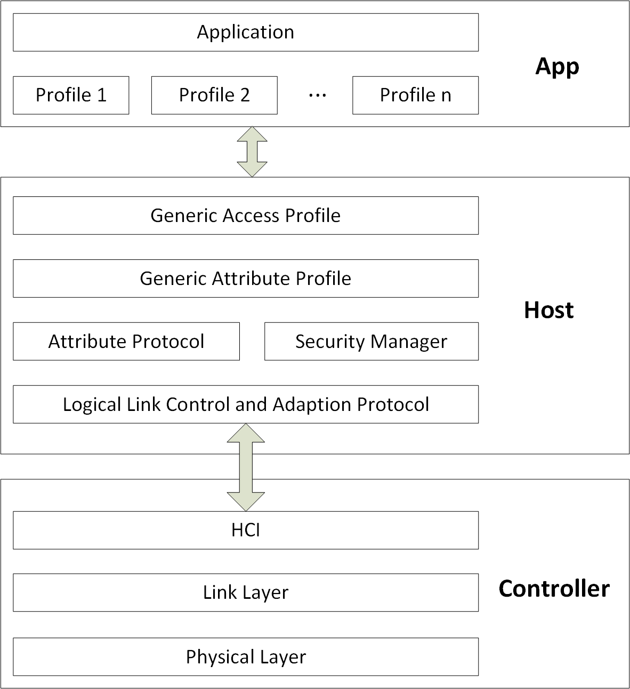{height=512px}

As shown above, BLE protocol stack includes Host and Controller.

- As BLE bottom-layer protocol, the “Controller” contains Physical Layer (PHY) and Link Layer (LL). Host Controller Interface (HCI) is the sole communication interface for all data transfer between Controller and Host.

- As BLE upper-layer protocol, the “Host” contains protocols including Logic Link Control and Adaption Protocol (L2CAP), Attribute Protocol (ATT), Security Manager Protocol (SMP), as well as Profiles including Generic Access Profile (GAP) and Generic Attribute Profile (GATT).

- The “Application” (APP) layer contains user application codes and Profiles corresponding to various Services. User controls and accesses Host via “GAP”, while Host transfers data with Controller via “HCI”, as shown below.

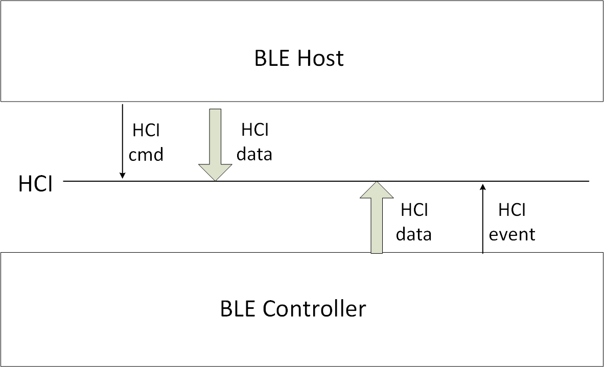

(1) BLE Host will use HCI cmd to operate and set Controller. Controller API corresponding to each HCI cmd will be introduced in this chapter.

(2) Controller will report various HCI events to Host via HCI.

(3) Host will send target data to Controller via HCI, while Controller will directly load data to Physical Layer for transfer.

(4) When Controller receives RF data in Physical Layer, it will first check whether the data belong to Link Layer or Host, and then process correspondingly: If the data belong to LL, the data will be processed directly; if the data belong to Host, the data will be sent to Host via HCI.

### Telink BLE SDK Architecture

B91 BLE Single Connection SDK only supports slave, the detailed content and realization method about master and controller architecture refer to *BLE Multi Connection SDK Handbook*. Here describes Telink BLE slave.

#### Telink BLE Slave

Telink BLE SDK in BLE Host fully supports stack of Slave.

When user only needs to use standard BLE Slave, and Telink BLE SDK runs Host (Slave part) + standard Controller, the actual stack architecture will be simplified based on the standard architecture, so as to minimize system resource consumption of the whole SDK (including SRAM, running time, power consumption, and etc.). Following shows Telink BLE Slave architecture. In the SDK, B91 ble sample and B91 module are based on this architecture.

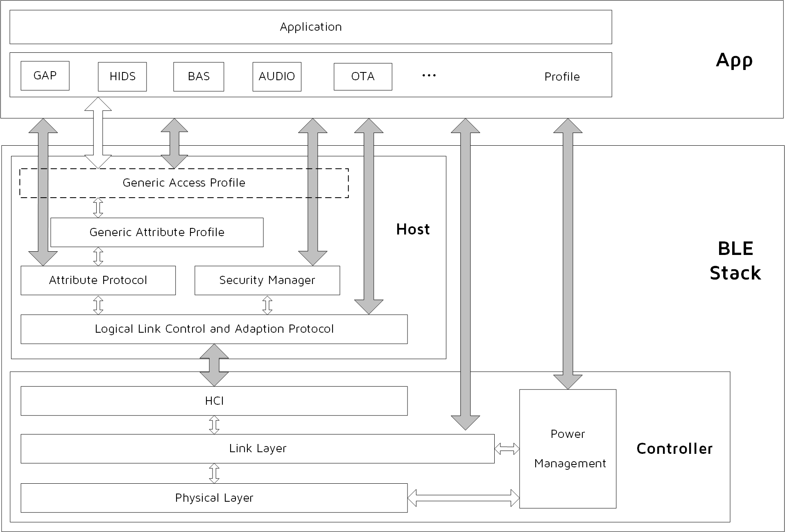

In figure above, solid arrows indicate data transfer controllable via user APIs, while hollow arrows indicate data transfer within the protocol stack not involved in user.

Controller can still communicate with Host (L2CAP layer) via HCI; however, the HCI is no longer the sole interface, and the APP layer can directly exchange data with Link Layer of the Controller. Power Management (PM) Module is embedded in the Link Layer, and the APP layer can invoke related PM interfaces to set power management.

Considering efficiency, data transfer between the APP layer and the Host is not controlled via GAP; the ATT, SMP and L2CAP can directly communicate with the APP layer via corresponding interface. However, the event of the Host should be communicated with the APP layer via the GAP layer.

Generic Attribute Profile (GATT) is implemented in the Host layer based on Attribute Protocol. Various Profiles and Services can be defined in the APP layer based on GATT. Basic Profiles including HIDS, BAS, AUDIO and OTA are provided in demo code of this BLE SDK.

Following sections explain each layer of the B91 BLE stack according to the structure above, as well as user APIs for each layer.

Physical Layer is totally controlled by Link Layer, since it does not involve the APP layer, it will not be covered in this document.

Though HCI still implements part of data transfer between Host and Controller, it is basically implemented by the protocol stack of Host and Controller with little involvement of the APP layer. User only needs to register HCI data callback handling function in the L2CAP layer.

## BLE Controller

### BLE Controller Introduction

BLE Controller contains Physical Layer, Link Layer, HCI and Power Management.

Telink BLE SDK fully assembles Physical Layer in the library (corresponding to c file of rf.h in driver file), and user does not need to learn about it. Power Management will be introduced in detail in section 4 Low Power Management (PM).

This section will focus on Link Layer, and also introduce HCI related interfaces to operate Link Layer and obtain data of Link Layer.

### Link Layer State Machine

Figure below shows Link Layer state machine in BLE spec. Please refer to “Core_v5.0” (Vol 6/Part B/1.1 “LINK LAYER STATES”) for more information.

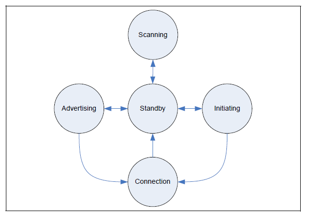

Telink BLE SDK Link Layer state machine is shown as below.

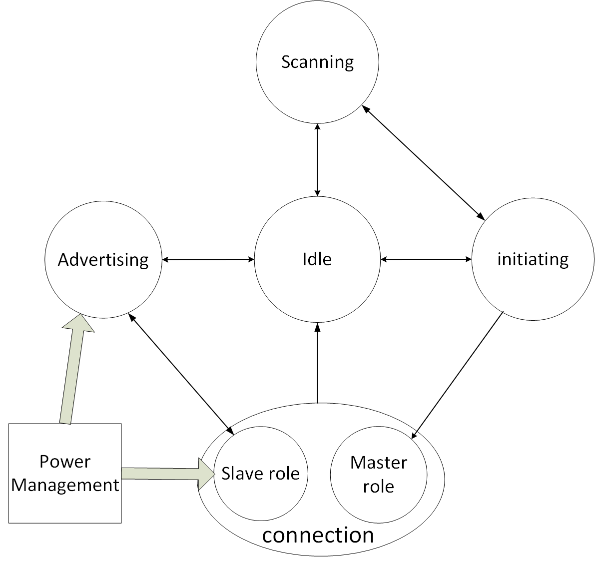

Telink BLE SDK Link Layer state machine is consistent with BLE spec, and it contains five basic states: Idle (Standby), Scanning, Advertising, Initiating, and Connection. Connection state contains Slave Role and Master Role.

As introduced above, currently both Slave Role and Master Role design are based on single connection. Slave Role is single connection by default; while Master Role is marked as "Master role single connection" due to multi connection will be provided.  

In this document, Slave Role will be marked as "Conn state Slave role" or "ConnSlaveRole/Connection Slave Role", or "ConnSlaveRole" in brief; while Master Role will be marked as "Conn state Master role" or "ConnMasterRole/Connection Master Role", or "ConnMasterRole" in brief.  

The "Power Management" in figure above is not a state of LL, but a functional module which indicates the SDK only implements low power processing for Advertising and Connection Slave Role. If Idle state needs low power, user can invoke related APIs in the APP layer. For the other states, the SDK does not contain low power management, and user cannot implement low power in the APP layer.

Based on the five states above, corresponding state machine names are defined in the “stack/ble/ll/ll.h”. “ConnSlaveRole” and “ConnMasterRole” correspond to state name “BLS_LINK_STATE_CONN”.  

```C
#define	BLS_LINK_STATE_IDLE			0
#define	BLS_LINK_STATE_ADV			BIT(0)
#define	BLS_LINK_STATE_SCAN			BIT(1)
#define	BLS_LINK_STATE_INIT			BIT(2)
#define BLS_LINK_STATE_CONN			BIT(3)
```

Switch of Link Layer state machine is automatically implemented in BLE stack bottom layer. Therefore, user cannot modify state in APP layer, but can obtain current state by invoking the API below. The return value will be one of the five states.

```C
u8 		blc_ll_getCurrentState(void);
```

### Link Layer State Machine Combined Application

#### Link Layer State Machine Initialization

Telink BLE SDK Link Layer fully supports all states; however, it’s flexible in design. Each state can be assembled as a module; be default there’s only the basic Idle module, and user needs to add modules and establish state machine combination for his application. For example, for BLE Slave application, user needs to add Advertising module and ConnSlaveRole, while the remaining Scanning/Initiating modules are not included so as to save code size and ram_code. The code of unused states won’t be compiled.

The API below is used for MCU initialization. This API is necessary for all BLE applications.

```C
void 		blc_ll_initBasicMCU (void);
```

The API below serves to add the basic Idle module. This API is also necessary for all BLE applications.

```C
void 		blc_ll_initStandby_module (u8 *public_adr);
```

Following are initialization APIs of modules corresponding to the other states (Advertising, Initiating, Slave Role).

```C
void		blc_ll_initAdvertising_module(void);
void 		blc_ll_initConnection_module(void);
void 		blc_ll_initSlaveRole_module(void);
```
among them,

```C
void 		blc_ll_initConnection_module(void);
```

is used to initialize the common module share between master and slave mode.

User can flexibly establish Link Layer state machine combination by using the APIs above. Following shows some common combination methods as well as corresponding application scenes.

#### Idle + Advertising

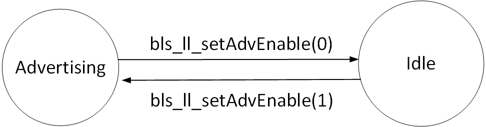

As shown above, only Idle and Advertising module are initialized, and it applies to applications which use basic advertising function to advertise product information in single direction, e.g. beacon.

Following is module initialization code of Link Layer state machine.

```C
u8  mac_public[6];
blc_ll_initBasicMCU();  
blc_ll_initStandby_module(mac_public);
blc_ll_initAdvertising_module();
```

State switch of Idle and Advertising is implemented via the “bls_ll_setAdvEnable”.

#### Idle + Advertising + ConnSlaveRole

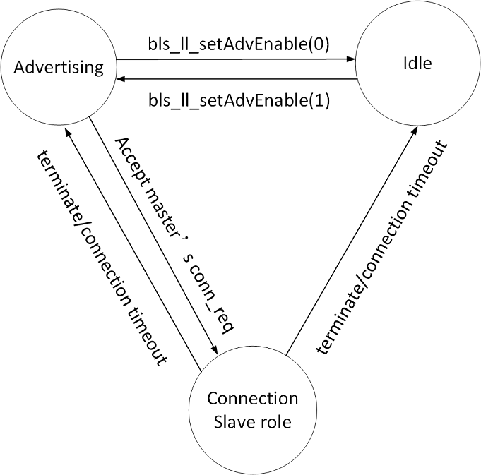

The figure above shows a Link Layer state machine combination for a basic BLE Slave application. In the SDK, B91 hci/B91 ble sample/B91 remote/B91 module are all based on this combination.

Following is module initialization code of Link Layer state machine.

```C
u8  mac_public[6];
blc_ll_initBasicMCU();                     
blc_ll_initStandby_module(mac_public);
blc_ll_initAdvertising_module(); 
blc_ll_initConnection_module();
blc_ll_initSlaveRole_module();
```

State switch in this combination is shown as below:

(1) After power on, B91 MCU enters Idle state. In Idle state, when adv is enabled, Link Layer switches to Advertising state; when adv is disabled, it will return to Idle state.

	The API “bls_ll_setAdvEnable” serves to enable/disable Adv.

	After power on, Link Layer is in Idle state by default. Typically it’s needed to enable Adv in the “user_init” so as to enter Advertising state.  

(2) When Link Layer is in Idle state, Physical Layer won’t take any RF operation including packet transmission and reception.

(3) When Link Layer is in Advertising state, advertising packets are transmitted in adv channels. Master will send conneciton request if it receives adv packet. After Link Layer receives this connection request, it will respond, establish connection and enter ConnSlaveRole.

(4) When Link Layer is in ConnSlaveRole, it will return to Idle State or Advertising state in any of the following cases:

- Master sends “terminate” command to Slave and requests disconnection. Slave will exit ConnSlaveRole after it receives this command.

- By sending “terminate” command to Master, Slave actively terminates the connection and exits ConnSlaveRole.

- If Slave fails to receive any packet due to Slave RF Rx abnormity or Master Tx abnormity until BLE connection supervision timeout is triggered, Slave will exit ConnSlaveRole.  

	When Link Layer exits ConnSlaveRole state, it will switch to Adv or Idle state according to whether Adv is enabled or disabled which depends on the value configured during last invoking of the “bls_ll_setAdvEnable” in APP layer.

- If Adv is enabled, Link Layer returns to Advertising state.

- If Adv is disabled, Link Layer returns to Idle state.

### Link Layer Timing Sequence

In this section, Link Layer timing sequence in various states will be illustrated combining with rf_irq_handler, stimer_irq_handler and main_loop of this BLE SDK.

```C
_attribute_ram_code_ void rf_irq_handler(void)
{
	……
	irq_blt_sdk_handler ();
	……
}
_attribute_ram_code_ void stimer_irq_handler(void)
{
	……
	irq_blt_sdk_handler ();
	……
}
void main_loop (void)
{
///////////////////// BLE entry ////////////////////////////
	blt_sdk_main_loop();
////////////////////// UI entry ////////////////////////////
	……
}
```

The “blt_sdk_main_loop” function at BLE entry serves to process data and events related to BLE protocol stack. UI entry is for user application code.

#### Timing Sequence in Idle State

When Link Layer is in Idle state, no task is processed in Link Layer and Physical Layer; the “blt_sdk_main_loop” function doesn’t act and won’t generate any interrupt, i.e. the whole timing sequence of main_loop is occupied by UI entry.

#### Timing Sequence in Advertising State

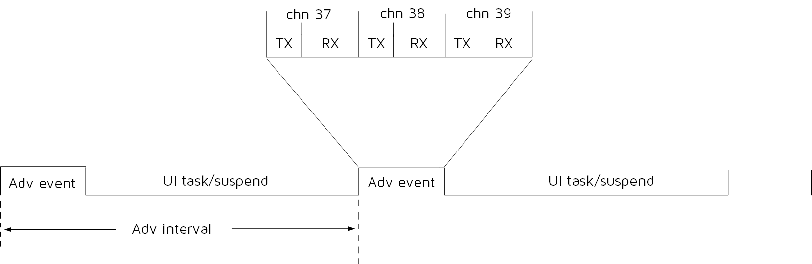

As shown in figure above, an Adv event is triggered by Link Layer during each adv interval. A typical Adv event with three active adv channels will send an advertising packet in channel 37, 38 and 39, respectively. After an adv packet is sent, Slave enters Rx state, and waits for response from Master:

- If Slave receives a scan request from Master, it will send a scan response to Master.
  
- If Slave receives a connect request from Master, it will establish BLE connection with Master and enter Connection state Slave Role.

Code of UI entry in main_loop is executed during UI task/suspend part in figure above. This duration can be used for UI task only, or MCU can enter sleep (suspend or deep sleep retention) for the redundant time to reduce power consumption.

In Advertising state, the “blt_sdk_main_loop” function does not need to process many tasks, and only some callback events related to Adv will be triggered, including BLT_EV_FLAG_ADV_DURATION_TIMEOUT、BLT_EV_FLAG_SCAN_RSP, BLT_EV_FLAG_CONNECT, etc.

#### Timing Sequence in Scanning State

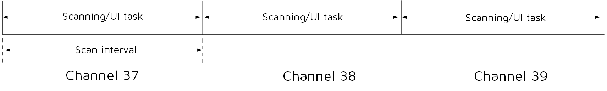

Scan interval is configured by the API “blc_ll_setScanParameter”. During a whole Scan interval, packet reception is implemented in one channel, and Scan window is not designed in the SDK. Therefore, the SDK won’t process the setting of Scan window in the “blc_ll_setScanParameter”.  

After the end of each Scan interval, it will switch to the next receiving channel, and enters next Scan interval. Channel switch action is triggered by interrupt, and it’s executed in irq which takes very short time.

In Scanning interval, PHY Layer of Scan state is always in RX state, and it depends on MCU hardware to implement packet reception. Therefore, all timing in software are for UI task.  

After correct BLE packet is received in Scan interval, the data are first buffered in software RX fifo (corresponding to “my_fifo_t  blt_rxfifo” in code), and the “blt_sdk_main_loop” function will check whether there are data in software RX fifo. If correct adv data are discovered, the data will be reported to BLE Host via the event “HCI_SUB_EVT_LE_ADVERTISING_REPORT”.

#### Timing Sequence in Initiating State


Timing sequence of Initiating state is similar to that of Scanning state, except that Scan interval is configured by the API “blc_ll_createConnection”. During a whole Scan interval, packet reception is implemented in one channel, and Scan window is not designed in the SDK. Therefore, the SDK won’t process the setting of Scan window in the “blc_ll_createConnection”.  

After the end of each Scan interval, it will switch to the next listening channel, and start a new Scan interval. Channel switch action is triggered by interrupt, and it’s executed in irq which takes very short time.

In Scanning state, BLE Controller will report the received adv packet to BLE Host; however, in Initiating state, adv won’t be reported to BLE Host, and it only scans for the device specified by the “blc_ll_createConnection”. If the specific device is scanned, it will send connection_request and establish connection, then Link Layer enters ConnMasterRole.

#### Timing Sequence in Conn State Slave Role

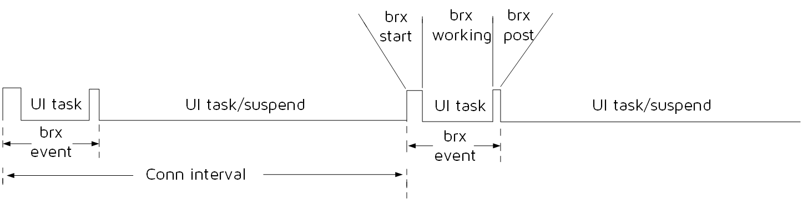

As shown in the above figure, each conn interval starts with a brx event, i.e. transfer process of BLE RF packets by Link Layer: PHY enters Rx state, and an ack packet will be sent to respond to each received data packet from Master. If there is more data, then continue to receive master packets and reply, this process is called brx event for short.

In this BLE SDK, each brx process consists of three phases according to the assignment of hardware and software.

(1) brx start phase

When Master is about to send packet, an interrupt is triggered by system tick irq to enter brx start phase. During this interrupt, MCU sets BLE state machine of PHY to enter brx state, hardware in bottom layer prepares for packet transfer, and then MCU exits from the interrupt irq.

(2) brx working phase

After brx start phase ends and MCU exits from irq, hardware in bottom layer enters Rx state first and waits for packet from Master. During the brx working phase, all packet reception and transmission are implemented automatically without involvement of software.

(3) brx post phase

After packet transfer is finished, the brx working phase is completed. System tick irq triggeres an interrupt to switch to the brx post phase. During this phase, protocol stack will process BLE data and timing sequence according to packet transfer in the brx working phase.

During the three phases, brx start and brx post are implemented in interrupt, while brx working phase does not need the involvement of software, and UI task can be executed normally (Note that during brx working phase, UI task can be executed in the time slots except RX, TX, and System Timer interrupt handler). During the brx working phase, MCU can’t enter sleep (suspend or deep sleep retention) since hardware needs to transfer packets.

Within each conn interval, the duration except for brx event can be used for UI task only, or MCU can enter sleep (suspend or deep sleep retention) for the redundant time to reduce power consumption.

In the ConnSlaveRole, the “blt_sdk_main_loop” needs to process the data received during the brx process. During the brx working phase, the data packet received from Master will be copied out during RX interrupt irq handler; these data won’t be processed immediately, but buffered in software RX fifo (corresponding to my_fifo_t  blt_rxfifo in code). The “blt_sdk_main_loop” function will check whether there are data in software RX fifo, and process the detected data packet correspondingly.

The processing of packets by blt_sdk_main_loop includes:

(1) Decryption of data packet

(2) Parsing of data packet

If the parsed data belongs to the control command sent by Master to Link Layer, this command will be executed immediately; if it’s the data sent by Master to Host layer, the data will be transferred to L2CAP layer via HCI interface.

### Link Layer State Machine Extension

The above BLE Link Layer state machine and timing sequence introduces the most basic states, which can meet basic applications such as BLE slave/master. However, considering that the user may have some special applications (such as being able to advertising in the Conn state Slave role), Telink BLE SDK adds some special extension functions to the Link Layer state machine. The states of the state machine extensions: ADVERTISING_IN_CONN_SLAVE_ROLE, SCANNING_IN_ADV and SCAN_IN_CONN_SLAVE_ROLE are described in detail below.

#### ADVERTISING_IN_CONN_SLAVE_ROLE

The Advertising feature can be added when the Link Layer is in ConnSlaveRole.

The API for adding Advertising feature is:

```C
ble_sts_t   blc_ll_addAdvertisingInConnSlaveRole(void);
```

The API to remove Advertising feature is:

```C
ble_sts_t   blc_ll_removeAdvertisingFromConnSLaveRole(void);
```

The return value of the above two API ble_sts_t types is BLE_SUCCESS.

Combining the timing diagrams of the Advertising and ConnSlaveRole, when the Advertising feature is added to ConnSlaveRole, the timing diagram is as follows:

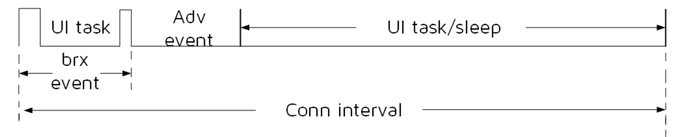

The current Link Layer is still in ConnSlaveRole (BLS_LINK_STATE_CONN). After the brx event ends in each Conn interval, an adv event is executed immediately, and the remaining time is left to the UI task or goes to sleep (suspend/deepsleep retention) to save power consumption.

For the use of Advertising in ConnSlaveRole, please refer to "TEST_ADVERTISING_IN_CONN_SLAVE_ROLE" in B91m_feature_test.

#### ADVERTISING_IN_CONN_SLAVE_ROLE

The Scanning feature can be added when the Link Layer is in the Advertising state.

The API for adding Scanning feature is:

```C
ble_sts_t   blc_ll_addScanningInAdvState(void);
```

The API to remove Scanning feature is:

```C
ble_sts_t   blc_ll_removeScanningFromAdvState(void);
```

The return value of the above two API ble_sts_t types is BLE_SUCCESS.

Combining the timing diagrams of the Advertising state and Scanning state, when the Scanning feature is added to the Advertising state, the timing diagram is as follows:

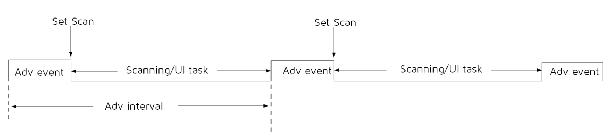

The current Link Layer is still in the Advertising state (BLS_LINK_STATE_ADV). In each Adv interval, except for the Adv event, all the remaining time is used for Scanning.

In each Set Scan, it will judge whether the current time is more than a Scan interval from the last Set Scan time (from the setting of blc_ll_setScanParameter), and if it exceeds, switch the Scan channel (channel 37/38/39).

For the use of Scanning in Advertising state, please refer to "TEST_SCANNING_IN_ADV_AND_CONN_SLAVE_ROLE" in B91m_feature_test.

#### SCAN_IN_CONN_SLAVE_ROLE

The Scanning feature can be added when the Link Layer is in ConnSlaveRole.

The API for adding Scanning feature is:

```C
ble_sts_t   blc_ll_addScanningInConnSlaveRole(void);
```

The API to remove Scanning feature is:

```C
ble_sts_t   blc_ll_removeScanningFromConnSLaveRole(void);
```

The return value of the above two API ble_sts_t types is BLE_SUCCESS.

Combining the timing diagrams of the Scanning state and ConnSlaveRole, when the Scanning feature is added to the ConnSlaveRole, the timing diagram is as follows:

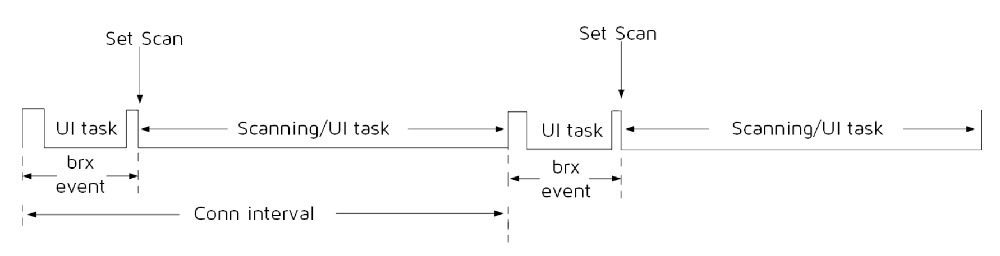

The current Link Layer is still in ConnSlaveRole (BLS_LINK_STATE_CONN). In each Conn interval, except for the brx event, all the remaining time is used for Scanning.

In each Set Scan, it will judge whether the current time is more than a Scan interval from the last Set Scan time (from the setting of blc_ll_setScanParameter), and if it exceeds, switch the Scan channel (channel 37/38/39).

For the use of Scanning in ConnSlaveRole, please refer to "TEST_SCANNING_IN_ADV_AND_CONN_SLAVE_ROLE" in B91m_feature_test.

### Link Layer TX fifo & RX fifo

The processing methods of BLE TX fifo and BLE RX fifo of Slave role are the same.

#### Link Layer RX fifo Introduction

All data received from peer device during Link Layer brx will be buffered in a BLE RX fifo, and then transmitted to BLE Host or APP layer for processing.

BLE RX fifo is defined at the application layer:

```C
#define ACL_RX_FIFO_SIZE	48
#define ACL_RX_FIFO_NUM		8
_attribute_data_retention_	u8	app_acl_rxfifo[ACL_RX_FIFO_SIZE * ACL_RX_FIFO_NUM] = {0};
blc_ll_initAclConnRxFifo(app_acl_rxfifo, ACL_RX_FIFO_SIZE, ACL_RX_FIFO_NUM);

```

ACL_RX_FIFO_SIZE is 48 by default. Unless you need to use the data length extension, you are not allowed to modify this size.

ACL_RX_FIFO_NUM must be set to a power of 2, which is 2, 4, 8, 16, etc. Users can make slight modifications according to their needs.

ACL_RX_FIFO_NUM is 8 by default, which is a reasonable value and can ensure that the bottom layer of the Link Layer can buffer up to 8 packets. If the setting is too large, it will take up too much SRAM. If the setting is too small, there may be a risk of data overwriting: in the brx event, the Link Layer is likely to word under more data (MD) mode on an interval, and continue to receive multiple packets, if you set 4, it is likely that there will be five or six packets in an interval (such as OTA, playing master voice data, etc.), and the upper layer's response to these data is too long to process due to the long decryption time, then it is possible some data is overflowed.

Here is an example of RX overflow, we have the following assumptions:

a) The number of RX fifo is 8;

b) Before brx_event(n) is turned on, the read and write pointers of RX fifo are 0 and 2 respectively;

c) In the brx_event(n) and brx_event(n+1) stages, the main_loop has task blockage, and the RX fifo is not taken in time;

d) Both brx_event stages are multi-packet situations.

From the description in the “Conn state Slave role timing” section above, we know that the BLE data packets received in the brx_working stage will only be copied to the RX fifo (RX fifo write pointer++), and the RX fifo data is actually taken out for processing. In the main_loop stage (RX fifo read pointer++), we can see that the sixth data will cover the read pointer 0 area. It should be noted here that the UI task time slot in the brx working stage is the time except for interrupt processing such as RX, TX, and system timer.

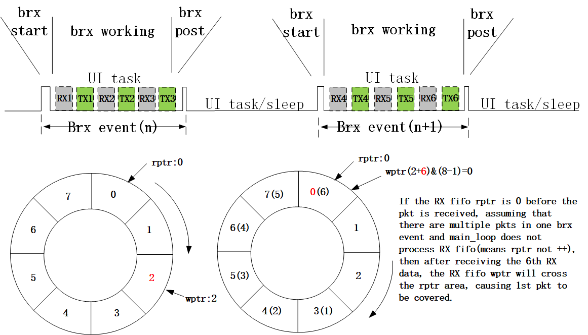

Relative to the extreme case above with long task blockade duration due to one connection interval, the case below is more likely to occur:

During one brx_event, since Master writes multiple packets (e.g. 7/8 packets) into Slave, Slave fails to process the received data in time. As shown below, the rptr (read pointer) is increased by two, but the wptr (write pointer) is also increased by eight, which thus causes data overflow.

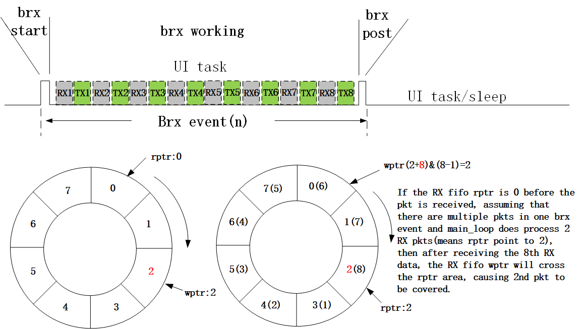

Once there is a data loss problem caused by overflow, for the encryption system, there will be a MIC failure disconnection problem. SDK has Rx overflow check: check whether the current RX fifo write pointer and read pointer difference is greater than the number of Rx fifo in brx Rx IRQ. Once the Rx fifo is found to be full, the RF will not ACK the other party. BLE protocol Data retransmission will be ensured. In addition, the SDK also provides the Rx overflow callback function to notify users. This callback will be introduced in the chapter "Telink defined event" later in the document.

Similarly, if there may be more than 8 valid packets in an interval, the default 8 is not enough.

#### Link Layer TX fifo Introduction

All data of the application layer and the BLE Host need to be transmitted through the Link Layer of the Controller to complete the RF data transmission. A BLE TX fifo is designed in the Link Layer, which can be used to buffer the transmitted data and proceed after the start of brx Data transmission.

BLE TX fifo is defined at the application layer:

```C
#define ACL_TX_FIFO_SIZE	48
#define ACL_TX_FIFO_NUM		17
_attribute_data_retention_  u8	app_acl_txfifo[ACL_TX_FIFO_SIZE * ACL_TX_FIFO_NUM] = {0};
blc_ll_initAclConnTxFifo(app_acl_txfifo, ACL_TX_FIFO_SIZE, ACL_TX_FIFO_NUM); 
```

ACL_TX_FIFO_SIZE defaults to 48. Unless you need to use the data length extension, you are not allowed to modify this size.

ACL_TX_FIFO_NUM must be set to a power of 2 plus 1, that is, 3, 5, 9, 17 and so on. Users can make slight modifications according to their needs.

The default TX fifo number is 17, which can handle voice data with a large amount of data. If User does not use such a large fifo, it can be modified to 9.

It should be noted that (ACL_TX_FIFO_SIZE * (ACL_TX_FIFO_NUM -1)) cannot exceed 0xFFF (4096).

In TX fifo, the SDK bottom stack needs to use 3, and the rest is completely used by the application layer. When the TX fifo is 17, the application layer can only use 14; when it is 9, the application layer can only use 6.

When the user sends data at the application layer (for example, calling blc_gatt_pushHandleValueNotify), he should first check how many TX fifos are available in the current Link Layer.

The following API is used to determine how many TX fifos are currently occupied, not how many are available.

```C
u8		blc_ll_getTxFifoNumber (void);
```

For example, when the TX fifo number defaults to 17, the number of users available is 14, so as long as the value returned by the API is less than 14, it is available: returning 13 means that there is 1 more available, and returning 0 means that there are 14 more available.

When using TX fifo, if the customer first looks at how many are left before deciding whether to directly push the data, a fifo should be reserved to prevent various boundary problems.

In B91 Audio's voice processing, since it is known that each voice data will be split into 5 packets, 5 TX fifos are required, and no more than 9 fifos are occupied. In order to avoid abnormalities caused by some boundary conditions when TX fifo is used (for example, when the BLE stack is just in time to reply to the command of the master, a data is inserted into TX fifo), the final code is written as follows: When the occupied TX fifo does not exceed After 8 hours, the voice data is pushed to TX fifo.

```C
if (blc_ll_getTxFifoNumber() < 9)
	{
		……
	}
```

The problem of data overflow has been discussed above. In addition to the automatic processing mechanism for data overflow, the bottom of the SDK also provides the following API to limit the number of more data received on an interval (if the customer wants RX fifo to be sufficient, the data can also be processed Limit, you can use the following API).

### Controller Event

Considering user may need to record and process some key actions of BLE stack bottom layer in the APP layer, Telink BLE SDK provides three types of event: Standard HCI event defined by BLE Controller; Telink defined event; event-notification type GAP event (Host event) defined by BLE Host for stack flow interaction (see section GAP event).

As shown in the BLE SDK event architecture below: HCI event and Telink defined event are Controller event, while GAP event is BLE Host event.

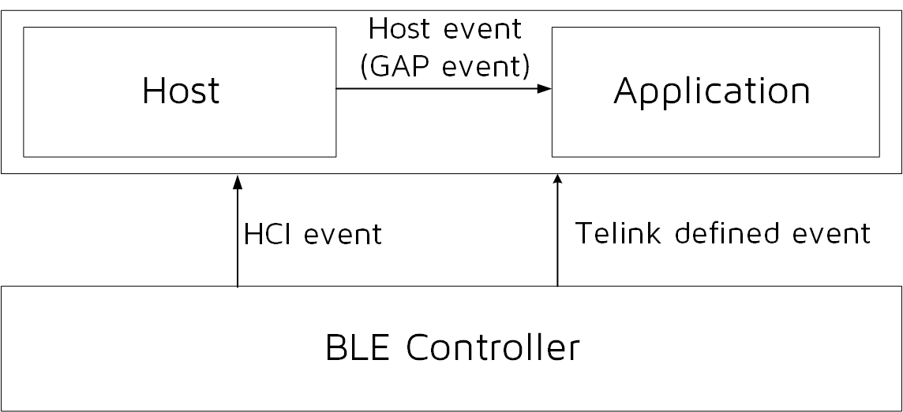

#### Controller HCI Event

HCI event is designed according to BLE Spec; Telink defined event only applies to BLE Slave (B91 module etc).

- BLE Master only supports HCI event.

- BLE Slave supports both HCI event and Telink defined event.

For BLE Slave, basically the two sets of event are independent of each other, except for the connect and disconnect event of Link Layer.

User can select one set or use both as needed. In Telink BLE SDK, B91 module use Telink defined event.

As shown in the “Host + Controller” architecture below, Controller HCI event indicates all events of Controller are reported to Host via HCI.

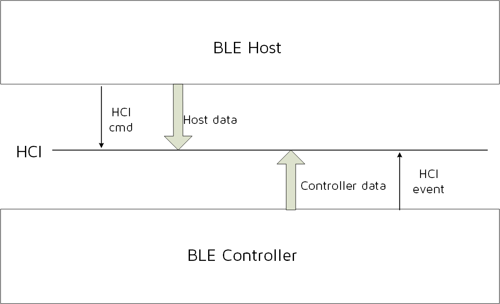

For definition of Controller HCI event, please refer to “Core_v5.0” (Vol 2/Part E/7.7 “Events”). “LE Meta Event” in 7.7.65 indicates HCI LE (low energy) Event, while the others are commom HCI events.

As defined in Spec, Telink BLE SDK also divides Controller HCI event into two types: HCI Event and HCI LE event. Since Telink BLE SDK focuses on BLE, it supports most HCI LE events and only a few basic HCI events.

For the definition of macros and interfaces related to Controller HCI event, please refer to head files under “stack/ble/hci”.

To receive Controller HCI event in Host or APP layer, user should register callback function of Controller HCI event, and then enable mask of corresponding event. 

Following are callback function prototype and register interface of Controller HCI event: 

```C
typedef int (*hci_event_handler_t) (u32 h, u8 *para, int n);
void  blc_hci_registerControllerEventHandler(hci_event_handler_t  handler);
```

In the callback function prototype, “u32 h” is a mark which will be frequently used in bottom-layer stack, and user only needs to know the following: 

```C
#define			HCI_FLAG_EVENT_TLK_MODULE		(1<<24)
#define			HCI_FLAG_EVENT_BT_STD			(1<<25)
```

“HCI_FLAG_EVENT_TLK_MODULE” will be introduced in “Telink defined event”, while “HCI_FLAG_EVENT_BT_STD” indicates current event is Controller HCI event. 

In the callback function prototype, “para” and “n” indicate data and data length of event. The data is consistent with the definition in BLE spec. 

```C
blc_hci_registerControllerEventHandler(controller_event_callback);
```

#### HCI event

Telink BLE SDK supports a few HCI events. Following lists some events for user.

```C
#define HCI_EVT_DISCONNECTION_COMPLETE                 	0x05
#define HCI_EVT_ENCRYPTION_CHANGE                      	0x08
#define HCI_EVT_READ_REMOTE_VER_INFO_COMPLETE      	0x0C
#define HCI_EVT_ENCRYPTION_KEY_REFRESH                 	0x30
#define HCI_EVT_LE_META                                	0x3E
```

a) HCI_EVT_DISCONNECTION_COMPLETE

Please refer to “Core_v5.0” (Vol 2/Part E/7.7.5 “Disconnection Complete Event”). 
Total data length of this event is 7, and 1-byte “param len” is 4, as shown below.
Please refer to BLE spec for data definition.


b) HCI_EVT_ENCRYPTION_CHANGE and HCI_EVT_ENCRYPTION_KEY_REFRESH

Please refer to “Core_v5.0” (Vol 2/Part E/7.7.8 & 7.7.39).
The two events are related to Controller encryption, and the processing is assembled in library.

c) HCI_EVT_READ_REMOTE_VER_INFO_COMPLETE

Please refer to “Core_v5.0” (Vol 2/Part E/7.7.12).
When Host uses the “HCI_CMD_READ_REMOTE_VER_INFO” command to exchange version information between Controller and BLE peer device, and version of peer device is received, this event will be reported to Host.
Total data length of this event is 11, and 1-byte “param len” is 8, as shown below. Please refer to BLE spec for data definition.

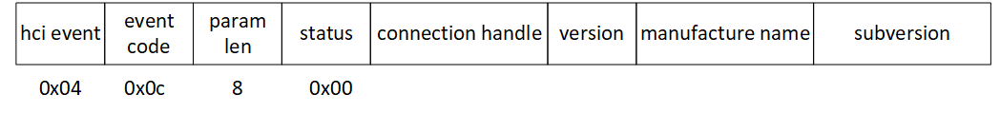

d) HCI_EVT_LE_META

It indicates current event is HCI LE event, and event type can be judged according to sub event code. Except for HCI_EVT_LE_META, other HCI events should use the API below to enable corresponding event mask.

```C
ble_sts_t	blc_hci_setEventMask_cmd(u32 evtMask);
```

Definition of event mask:

```C
#define HCI_EVT_MASK_DISCONNECTION_COMPLETE           						0x0000000010     
#define HCI_EVT_MASK_ENCRYPTION_CHANGE                 						0x0000000080
#define HCI_EVT_MASK_READ_REMOTE_VERSION_INFORMATION_COMPLETE    			0x0000000800 
```

If HCI event mask is set via this API, by default only the mask corresponding to the “HCI_CMD_DISCONNECTION_COMPLETE” is enabled in the SDK, i.e. the SDK only ensures report of “Controller disconnect event” by default.

#### HCI LE event

When event code in HCI event is “HCI_EVT_LE_META” to indicate HCI LE event, common sub-event code are shown as below:

```C
#define HCI_SUB_EVT_LE_CONNECTION_COMPLETE                          0x01
#define HCI_SUB_EVT_LE_ADVERTISING_REPORT                           0x02
#define HCI_SUB_EVT_LE_CONNECTION_UPDATE_COMPLETE                   0x03
#define HCI_SUB_EVT_LE_CONNECTION_ESTABLISH	 						0x20  
```

a) HCI_SUB_EVT_LE_CONNECTION_COMPLETE

Please refer to “Core_v5.0” (Vol 2/Part E/7.7.65.1 “LE Connection Complete Event”).
When connection is established between Controller Link Layer and peer device, this event will be reported.
Total data length of this event is 22, and 1-byte “param len” is 19, as shown below. Please refer to BLE spec for data definition.

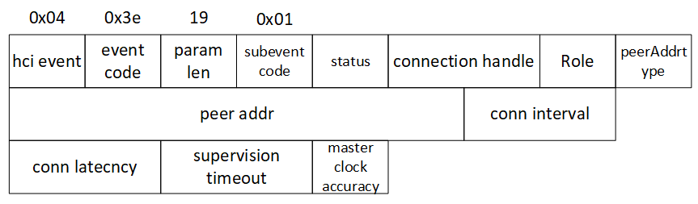

b) HCI_SUB_EVT_LE_ADVERTISING_REPORT

Please refer to “Core_v5.0” (Vol 2/Part E/7.7.65.2 “LE Advertising Report Event”).
When Link Layer of Controller scans right adv packet, it will be reported to Host via the “HCI_SUB_EVT_LE_ADVERTISING_REPORT”.
Data length of this event is not fixed and it depends on payload of adv packet, as shown below. Please refer to BLE spec for data definition.

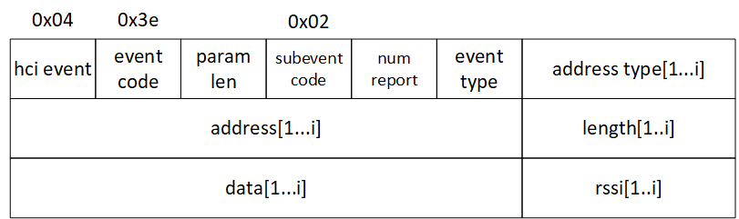

**Note:**

> In Telink BLE SDK, each “LE Advertising Report Event” only reports an adv packet, i.e. “i” in figure above is 1.

c) HCI_SUB_EVT_LE_CONNECTION_UPDATE_COMPLETE

Please refer to “Core_v5.0” (Vol 2/Part E/7.7.65.3 “LE Connection Update Complete Event”).
When “connection update” in Controller takes effect, the “HCI_SUB_EVT_LE_CONNECTION_UPDATE_COMPLETE” will be reported to Host.
Total data length of this event is 13, and 1-byte “param len” is 10, as shown below. Please refer to BLE spec for data definition.


d) HCI_SUB_EVT_LE_CONNECTION_ESTABLISH

The “HCI_SUB_EVT_LE_CONNECTION_ESTABLISH” is a supplement to the “HCI_SUB_EVT_LE_CONNECTION_COMPLETE”, so all the parameters except for subevent is the same. This Telink private defined event is the sole event which is not standard in BLE spec. This event is only used in B91 master kma dongle.

Following illustrates the reason for Telink to define this event.

When BLE Controller in Initiating state scans adv packet from specific device to be connected, it will send connection request packet to peer device; no matter whether this connection request is received, it will be considered as “Connection complete”, “LE Connection Complete Event” will be reported to Host, and Link Layer immediately enters Master role. Since this packet does not support ack/retry mechanism, Slave may miss the connection request, thus it cannot enter Slave role, and won’t enter brx mode to transfer packets. In this case, Master Controller will process according to the mechanism below: After it enters Master role, it will check whether there’s any packet received from Slave during the beginning 6~10 conn intervals (CRC check is negligible).

- If no packet is received, it’s considered that Slave does not receive connection request; suppose “LE Connection Complete Event” has already been reported, it must report a “Disconnection Complete Event” quickly, and indicate disconnect reason is “0x3E (HCI_ERR_CONN_FAILED_TO_ESTABLISH)”.

- If there’s packet received from Slave, it can confirm that Connection is established, thus Master can continue rest of the flow.

According to the description above, the processing method of BLE Host should be: After it receives “LE Connection Complete Event” of Controller, it cannot confirm that connection has already been established, but instead, starts a timer based on conn interval (timing value should be configured as 10 intervals or above to cover the longest time). After the timer is started, it will check whether there is “Disconnection Complete Event” with disconnect reason of 0x3E; if there is no such event, it will be considered as “Connection Established”.

Considering this processing of BLE Host is very complex and error prone, the SDK defines the “HCI_SUB_EVT_LE_CONNECTION_ESTABLISH” in the bottom layer. When Host receives this event, it indicates that Controller has confirmed connection is OK on Slave side and can continue rest of the flow.

“HCI LE event” needs the API below to enable mask.

```C
ble_sts_t 	blc_hci_le_setEventMask_cmd(u32 evtMask);
```

Following lists some evtMask definitions. User can view the other events in the “hci_const.h”.

```C
#define HCI_LE_EVT_MASK_CONNECTION_COMPLETE             0x00000001
#define HCI_LE_EVT_MASK_ADVERTISING_REPORT     			0x00000002
#define HCI_LE_EVT_MASK_CONNECTION_UPDATE_COMPLETE   	0x00000004
#define HCI_LE_EVT_MASK_CONNECTION_ESTABLISH      		0x80000000 
```

If HCI LE event mask is not set via this API, mask of all HCI LE events in the SDK are disabled by default.

#### Telink Defined Event

Besides standard Controller HCI event, the SDK also provides Telink defined event. Up to 20 Telink defined events are supported, which are defined by using macros in the “stack/ble/ll/ll.h”.

Current SDK version supports the following callback events. The “BLT_EV_FLAG_CONNECT / BLT_EV_FLAG_TERMINATE” has the same function as the “HCI_SUB_EVT_LE_CONNECTION_COMPLETE” / “HCI_EVT_DISCONNECTION_COMPLETE” in HCI event, but data definition of these events are different.

```C
#define			BLT_EV_FLAG_ADV						0
#define			BLT_EV_FLAG_ADV_DURATION_TIMEOUT	1
#define			BLT_EV_FLAG_SCAN_RSP				2
#define			BLT_EV_FLAG_CONNECT					3
#define			BLT_EV_FLAG_TERMINATE				4
#define			BLT_EV_FLAG_LL_REJECT_IND			5
#define			BLT_EV_FLAG_RX_DATA_ABANDOM			6
#define 		BLT_EV_FLAG_PHY_UPDATE				7
#define			BLT_EV_FLAG_DATA_LENGTH_EXCHANGE	8
#define			BLT_EV_FLAG_GPIO_EARLY_WAKEUP		9
#define			BLT_EV_FLAG_CHN_MAP_REQ				10
#define			BLT_EV_FLAG_CONN_PARA_REQ			11
#define			BLT_EV_FLAG_CHN_MAP_UPDATE			12
#define			BLT_EV_FLAG_CONN_PARA_UPDATE		13
#define			BLT_EV_FLAG_SUSPEND_ENTER			14
#define			BLT_EV_FLAG_SUSPEND_EXIT			15
```

Telink defined event is only triggered in BLE slave applications. There are two ways to implement callback of Telink defined event in BLE slave application.

(1) The first method, which is called “independent registration”, is to independently register callback function for each event.

Prototype of callback function is shown as below:

```C
typedef void (*blt_event_callback_t)(u8 e, u8 *p, int n);
```

“e”: event number.

“p”: It’s the pointer to the data transmitted from the bottom layer when callback function is executed, and it varies with the callback function.  

“n”: length of valid data pointed by pointer.

API to register callback function:

```C
void	bls_app_registerEventCallback (u8 e, blt_event_callback_t p);
```

Whether each event will respond depends on whether corresponding callback function is registered in APP layer.

(2) The second method, which is called “shared event entry”, is that all event callback functions share the same entry. Whether each event will respond depends on whether its event mask is enabled.

This method uses the same API as HCI event to register event callback:

```C
typedef int (*hci_event_handler_t) (u32 h, u8 *para, int n);
void  blc_hci_registerControllerEventHandler(hci_event_handler_t  handler);
```

Although registered callback function of HCI event is shared, they are different in implementation. In HCI event callback function:

```C
h = HCI_FLAG_EVENT_BT_STD  |  hci_event_code;
```

While in Telink defined event “shared event entry”:

```C
h = HCI_FLAG_EVENT_TLK_MODULE  |  e;
```

Where “e” is event number of Telink defined event.

Telink defined event “shared event entry” is similar to mask of HCI event; the API below serves to set the mask to determine whether each event will be responded. 

```C
ble_sts_t 	bls_hci_mod_setEventMask_cmd(u32 evtMask);
```

Relationship between evtMask and event number is：

```C
evtMask = BIT(e);
```

The two methods for Telink defined event are exclusive to each other. The first method is recommended and is adopted by most demo code of the SDK; only “B91_module” uses the “shared event entry” method.

For the use of Telink defined event, please refer to the demo code of project “B91_module” for 2 “shared event entry”.

The following takes the connect and terminate event callbacks as examples to describe the code implementation methods of these two methods.

(1) The first method: “independent registration”

```C
void	task_connect (u8 e, u8 *p, int n)
{
	    // add connect callback code here
}

void	task_terminate (u8 e, u8 *p, int n)
{
	    // add terminate callback code here
}
bls_app_registerEventCallback (BLT_EV_FLAG_CONNECT, &task_connect);
bls_app_registerEventCallback (BLT_EV_FLAG_TERMINATE, &task_terminate);
```

(2) The second method: “shared event entry”

```C
int event_handler(u32 h, u8 *para, int n)
{
	    if( (h&HCI_FLAG_EVENT_TLK_MODULE)!= 0 ) //module event
		{
			switch(event)
			{
				case BLT_EV_FLAG_CONNECT:
				{
					// add connect callback code here
}
				break;
				case BLT_EV_FLAG_TERMINATE:
				{
					// add terminate callback code here
				}
			break;
				default:
			break;
}
}
}
blc_hci_registerControllerEventHandler(event_handler);	
bls_hci_mod_setEventMask_cmd( BIT(BLT_EV_FLAG_CONNECT) | BIT(BLT_EV_FLAG_TERMINATE) );
```

Following will introduce details about all events, event trigger condition and parameters of corresponding callback function for Controller.

(1) BLT_EV_FLAG_ADV

This event is not used in current SDK.

(2) BLT_EV_FLAG_ADV_DURATION_TIMEOUT

Event trigger condition: If the API “bls_ll_setAdvDuration” is invoked to set advertising duration, a timer will be started in BLE stack bottom layer. When the timer reaches the specified duration, advertising is stopped, and this event is triggered. 
In the callback function of this event, user can modify adv event type, re-enable advertising, re-configure advertising duration, and etc.  

Pointer “p”: null pointer.

Data length “n”: 0.

Note: This event won’t be triggered in “advertising in ConnSlaveRole” which is an extended state of Link Layer.

(3) BLT_EV_FLAG_SCAN_RSP

Event trigger condition: When Slave is in advertising state, this event will be triggered if Slave responds with scan response to the scan request from Master.

Pointer “p”: null pointer.

Data length “n”: 0.

(4) BLT_EV_FLAG_CONNECT

Event trigger condition: When Link Layer is in advertising state, this event will be triggered if it responds to connect reqeust from Master and enters Conn state Slave role.

Data length “n”: 34.  

Pointer “p”: p points to one 34-byte RAM area, corresponding to the “connect request PDU” below.  

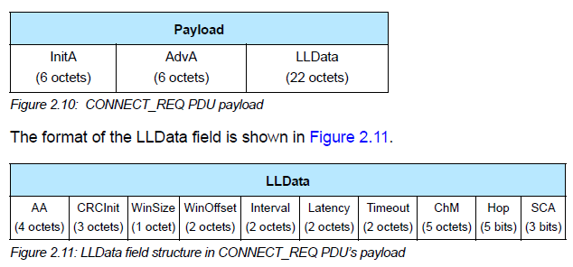

Please refer to the “rf_packet_connect_t” defined in the “ble_formats.h”. In the structure below, the connect request PDU is from scanA[6] (corresponding to InitA in figure above) to hop.

```C
typedef struct{
	u32 dma_len;
	u8  type   :4;
	u8  rfu1   :1;
	u8  chan_sel:1;
	u8  txAddr :1;
	u8  rxAddr :1;
	u8  rf_len;
	u8  initA[6];
	u8  advA[6];
	u8  accessCode[4];
	u8  crcinit[3];
	u8  winSize;
	u16  winOffset;
	u16 interval;
	u16 latency;
	u16 timeout;
	u8  chm[5];
	u8  hop;
}rf_packet_connect_t;
```

(5) BLT_EV_FLAG_TERMINATE

Event trigger condition: This event will be triggered when Link Layer state machine exits from Conn state Slave role in any of the three specific cases.

Pointer “p”: p points to an u8-type variable “terminate_reason”. This variable indicates the reason for disconnection of Link Layer.  

Data length “n”: 1.

Three cases to exit Conn state Slave role and corresponding reasons are listed as below:

A. If Slave fails to receive packet from Master for a duration due to RF communication problem (e.g. bad RF or Master is powered off), and “connection supervision timeout” expires, this event will be triggered to terminate connection and return to None Conn state. The terminate reason is HCI_ERR_CONN_TIMEOUT (0x08).

B. If Master sends “terminate” command to actively terminate connection, after Slave responds to the command with an ack, this event will be triggered to terminate connection and return to None Conn state. The terminate reason is the Error Code in the “LL_TERMINATE_IND” control packet received in Slave Link Layer. The Error Code is determined by Master. Common Error Codes include HCI_ERR_REMOTE_USER_TERM_CONN (0x13), HCI_ERR_CONN_TERM_MIC_FAILURE (0x3D), and etc.

C. If Slave invokes the API “bls_ll_terminateConnection(u8 reason)” to actively terminate connection, this event will be triggered. The terminate reason is the actual parameter “reason” of this API.

(6) BLT_EV_FLAG_LL_REJECT_IND

Event trigger condition: When Master sends a “LL_ENC_REQ” (encryption request) in the Link Layer and it’s declared to use the pre-allocated LTK, if Slave fails to find corresponding LTK and responds with a “LL_REJECT_IND” (or “LL_REJECT_EXT_IND”), this event will be triggered. 

Pointer “p”: p points to the response command (LL_REJECT_IND or LL_REJECT_EXT_IND).

Data length “n”: 1.

For more information, please refer to “Core_v5.0” Vol 6/Part B/2.4.2.

(7) BLT_EV_FLAG_RX_DATA_ABANDOM

Event trigger condition: This event will be triggered when BLE RX fifo overflows (see section Link Layer TX fifo & RX fifo), or the number of More Data received in an interval exceeds the preset threshold (Note: User needs to invoke the API “blc_ll_init_max_md_nums” with non-zero parameter, so that SDK bottom layer will check the number of More Data.)

Pointer “p”: null pointer.

Data length “n”: 0.

(8) BLT_EV_FLAG_PHY_UPDATE

Event trigger condition: This event will be triggered after the update succeeds or fails when the slave or master proactively initiates LL_PHY_REQ; Or when the slave or master passively receives LL_PHY_REQ and meanwhile PHY is updated successfully, this event will be triggered.

Data length “n”: 1.

Pointer “p”: p points to an u8-type variable indicating the current connection of PHY mode.

```C
typedef enum {
	BLE_PHY_1M 			= 0x01,
	BLE_PHY_2M 			= 0x02,
	BLE_PHY_CODED	 	= 0x03,
} le_phy_type_t;
```

(9) BLT_EV_FLAG_DATA_LENGTH_EXCHANGE

Event trigger condition: This event will be triggered when Slave and Master exchange max data length of Link Layer, i.e. one side sends “ll_length_req”, while the peer responds with “ll_length_rsp”. If Slave actively sends “ll_length_req”, this event won’t be triggered until “ll_length_rsp” is received. If Master initiates “ll_length_req”, this event will be triggered immediately after Slave responds with “ll_length_rsp”.

Data length “n”: 12.

Pointer “p”: p points to data of a memory area, corresponding to the beginning six u16-type variables in the structure below.

```C
typedef struct {
	u16		connEffectiveMaxRxOctets;
	u16		connEffectiveMaxTxOctets;
	u16 	connMaxRxOctets;
	u16 	connMaxTxOctets;
	u16		connRemoteMaxRxOctets;
	u16 	connRemoteMaxTxOctets;
			……
}ll_data_extension_t;
```

The “connEffectiveMaxRxOctets” and “connEffectiveMaxTxOctets” are max RX and TX data length finally allowed in current connection; “connMaxRxOctets” and “connMaxTxOctets” are max RX and TX data length of the device; “connRemoteMaxRxOctets” and “connRemoteMaxTxOctets” are max RX and TX data length of peer device.

connEffectiveMaxRxOctets = min(supportedMaxRxOctets,connRemoteMaxTxOctets);

connEffectiveMaxTxOctets = min(supportedMaxTxOctets, connRemoteMaxRxOctets);

(10) BLT_EV_FLAG_GPIO_EARLY_WAKEUP

Event trigger condition: Slave will calculate wakeup time before it enters sleep (suspend or deepsleep retention), so that it can wake up when the wakeup time is due (It’s realized via timer in sleep). Since user tasks won’t be processed until wakeup from sleep, long sleep time may bring problem for real-time demanding applications.

Take keyboard scanning as an example: If user presses keys fast, to avoid key press loss and process debouncing, it’s recommended to set the scan interval as 10~20ms; longer sleep time (e.g. 400ms or 1s, which may be reached when latency is enabled) will lead to key press loss. So it’s needed to judge current sleep time before MCU enters sleep; if it’s too long, the wakeup method of user key press should be enabled, so that MCU can wake up from sleep (suspend or deepsleep retention) in advance (i.e. before timer timeout) if any key press is detected. This will be introduced in details in following PM module section.

The event “BLT_EV_FLAG_GPIO_EARLY_WAKEUP” will be triggered if MCU is woke up from sleep (suspend or deepsleep) by GPIO in advance before wakeup timer expires.

Data length “n”: 1.

Pointer “p”: p points to an u8-type variable “wakeup_status”. This variable indicates valid wakeup source status for current sleep.

Following types of wakeup status are defined in the “drivers/B91/pm.h”:

```C
enum {
	 WAKEUP_STATUS_COMPARATOR  		= BIT(0),
	 WAKEUP_STATUS_TIMER  			= BIT(1),
	 WAKEUP_STATUS_CORE 			= BIT(2),
	 WAKEUP_STATUS_PAD    			= BIT(3),
	 WAKEUP_STATUS_MDEC    			= BIT(4),
	 STATUS_GPIO_ERR_NO_ENTER_PM  	= BIT(7),
	 STATUS_ENTER_SUSPEND  			= BIT(30),
};
```

For parameter definition above, please refer to “Power Management” section.

(11) BLT_EV_FLAG_CHN_MAP_REQ

Event trigger condition: When Slave is in Conn state, if Master needs to update current connection channel list, it will send a “LL_CHANNEL_MAP_REQ” command to Slave; this event will be triggered after Slave receives this request from Master and has not processed the request yet.

Data length “n”: 5.

Pointer “p”: p points to the starting address of the following channel list array. unsigned char type bltc.conn_chn_map[5]

Note: When the callback function is executed, p points to the old channel map before update.

Five bytes are used in the “conn_chn_map” to indicate current channel list by mapping. Each bit indicates a channel:

conn_chn_map[0] bit0-bit7 indicate channel0~channel7, respectively.

conn_chn_map[1] bit0-bit7 indicate channel8~channel15, respectively.

conn_chn_map[2] bit0-bit7 indicate channel16~channel23, respectively.

conn_chn_map[3] bit0-bit7 indicate channel24~channel31, respectively.

conn_chn_map[4] bit0-bit4 indicate channel32~channel36, respectively.

(12) BLT_EV_FLAG_CHN_MAP_UPDATE

Event trigger condition: When Slave is in connection state, this event will be triggered if Slave has updated channel map after it receives the “LL_CHANNEL_MAP_REQ” command from Master.  

Pointer “p”: p points to the starting address of the new channel map conn_chn_map[5] after update.  

Data length “n”: 5.

(13) BLT_EV_FLAG_CONN_PARA_REQ

Event trigger condition: When Slave is in connection state (Conn state Slave role), if Master needs to update current connection parameters, it will send a “LL_CONNECTION_UPDATE_REQ” command to Slave; this event will be triggered after Slave receives this request from Master and has not processed the request yet.

Data length “n”: 11.

Pointer “p”: p points to the 11-byte PDU of the LL_CONNECTION_UPDATE_REQ.

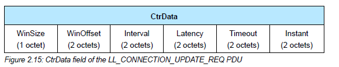

(14) BLT_EV_FLAG_CONN_PARA_UPDATE

Event trigger condition: When Slave is in connection state, this event will be triggered if Slave has updated connection parameters after it receives the “LL_CONNECTION_UPDATE_REQ” from Master.

Data length “n”: 6.

Pointer “p”: p points to the new connection parameters after update, as shown below.

p[0] | p[1]<<8:   new connection interval in unit of 1.25ms. 

p[2] | p[3]<<8:   new connection latency.

p[4] | p[5]<<8:   new connection timeout in unit of 10ms.

(15) BLT_EV_FLAG_SUSPEND_ENETR

Event trigger condition: When Slave executes the function “blt_sdk_main_loop”, this event will be triggered before Slave enters suspend.  

Pointer “p”: Null pointer.

Data length “n”: 0.

(16) BLT_EV_FLAG_SUSPEND_EXIT

Event trigger condition: When Slave executes the function “blt_sdk_main_loop”, this event will be triggered after Slave is woke up from suspend.

Pointer “p”: Null pointer.

Data length “n”: 0.

**Note:**

> This callback is executed after SDK bottom layer executes “cpu_sleep_wakeup” and Slave is woke up, and this event will be triggered no matter whether the actual wakeup source is gpio or timer. If the event “BLT_EV_FLAG_GPIO_EARLY_WAKEUP” occurs at the same time, for the sequence to execute the two events, please refer to pseudo code in “Power Management – PM Working Mechanism”.

### Data Length Extension

BLE Spec core_4.2 and above supports Data Length Extension (DLE).

Link Layer in this BLE SDK supports data length extension to max rf_len of 251 bytes per BLE Spec. Please refer to “Core_v5.0” (Vol 6/Part B/2.4.2.21 “LL_LENGTH_REQ and LL_LENGTH_RSP”).

Following steps explains how to use data length extension.

(1) Configure suitable TX & RX fifo size

To receive and transmit long packet, bigger Tx & Rx fifo size is required and thus ocupies large SRAM space. So be cautious when setting fifo size to avoid waste of SRAM space.

Tx fifo size should be increasd to transmit long packet. Tx fifo size should be larger than Tx rf_len by 12, and must be aligned by 16 bytes.

TX rf_len = 56 bytes：  blc_ll_initTxFifo (app_ll_txfifo, 80, 17);

TX rf_len = 100 bytes： blc_ll_initTxFifo (app_ll_txfifo, 112, 17);

TX rf_len = 200 bytes： blc_ll_initTxFifo (app_ll_txfifo, 224, 17);

Rx fifo size should be increasd to receive long packet. Rx fifo size should be larger than Rx rf_len by 24, and must be aligned by 16 bytes.

RX rf_len = 56 bytes：  blc_ll_initRxFifo (app_ll_rxfifo, 80, 8);

RX rf_len = 100 bytes： blc_ll_initRxFifo (app_ll_rxfifo, 128, 8);

RX rf_len = 200 bytes： blc_ll_initRxFifo (app_ll_rxfifo, 224, 8);

(2) Set proper MTU size

MTU, the maximum transmission unit, is used to set the size of the payload in a single packet of the L2CAP layer in BLE. THe att.h provides the interface function ble_sts_t blc_att_setRxMtuSize(u16 mtu_size); during the initialization of the BLE stack, users can directly use this function to pass the parameter to set the MTU. The return value is success, please refer to the DLE Demo of B91 feature, you can choose to set the MTU size by replacing different macros.

```C
#define DLE_LENGTH_SELECT			DLE_LENGTH_200_BYTES

#if (DLE_LENGTH_SELECT == DLE_LENGTH_27_BYTES)
	#define ACL_CONN_MAX_RX_OCTETS		27
#elif (DLE_LENGTH_SELECT == DLE_LENGTH_52_BYTES)
	#define MTU_SIZE_SETTING   			 48
#elif (DLE_LENGTH_SELECT == DLE_LENGTH_56_BYTES)
	#define MTU_SIZE_SETTING   			 52
#elif (DLE_LENGTH_SELECT == DLE_LENGTH_100_BYTES)
	#define MTU_SIZE_SETTING   			 96
#elif (DLE_LENGTH_SELECT == DLE_LENGTH_200_BYTES)
	#define MTU_SIZE_SETTING   			 196
#elif (DLE_LENGTH_SELECT == DLE_LENGTH_251_BYTES)
	#define MTU_SIZE_SETTING   			 247
#else
	#define MTU_SIZE_SETTING   			 23
#endif

blc_att_setRxMtuSize(MTU_SIZE_SETTING);
```

(3) data length exchange

Before transfer of long packets, please make sure the “data length exchange” flow has already been completed in BLE connection. Data length exchange is an interactive process in Link Layer by LL_LENGTH_REQ and LL_LENGTH_RSP. Either master or slave can initiate the process by sending LL_LENGTH_REQ, while the peer responds with LL_LENGTH_RSP. Through this interaction, master and slave obtain the max Tx and Rx packet size from each other, and adopt the minimum of the two as the max Tx and Rx packet size in current connection.

No matter which side initiates LL_LENGTH_REQ, at the end of data length exchange process, the SDK will generate “BLT_EV_FLAG_DATA_LENGTH_EXCHANGE” event callback assuming this callback has been registered. User can refer to “Telink defined event” section to understand the parameters of this event callback function.

The final max Tx and Rx packet size can be obtained from the “BLT_EV_FLAG_DATA_LENGTH_EXCHANGE” event callback function.

When B91 acts as slave device in actual applications, master may or may not initiate LL_LENGTH_REQ. If master does not initiate it, slave should initiate LL_LENGTH_REQ by the following API in the SDK:

```C
ble_sts_t   	blc_ll_exchangeDataLength (u8 opcode, u16 maxTxOct);
```

In this API, “opcode” is “LL_LENGTH_REQ”, and “maxTxOct” is the max Tx packet size supported by current device. For example, if max Tx packet size is 200bytes, the setting below applies:

```C
blc_ll_exchangeDataLength(LL_LENGTH_REQ , 200);
```

In Telink BLE SDK, when the slave end in the main function call blc_att_setRxMtuSize () to set the Rx MTU size, if the size is greater than 23 it will take the initiative to report MTU and update DLE, which will trigger two Event, the corresponding code is task_dle_exchange and app_ host_event_callback. Users can add their own flags to determine the trigger event, if no triggering is found, it represents that the setting parameters MTU and DLE is not updated, then manually set below two functions.

```C
ble_sts_t  blc_att_requestMtuSizeExchange (u16 connHandle, u16 mtu_size);
ble_sts_t  blc_ll_exchangeDataLength (u8 opcode, u16 maxTxOct);
```

(4) MTU size exchange

In addition to data length exchange, MTU size exchange flow should also be executed to ensure large MTU size takes effect, so that the peer can process long packet in BLE L2CAP layer. MTU size should be equal or larger than max packet size of Tx & Rx.
Please refer to “ATT & GATT” section or the demo of the B91_feature for the implementation of MTU size exchange.

(5) Transmission/Reception of long packet

Please refer to “ATT & GATT” section for illustration of Handle Value Notification, Handle Value Indication, Write request and Write Command.

Transmission and reception of long packet can start after correct completion of the three steps above.

The APIs corresponding to “Handle Value Notification” and “Handle Value Indication” can be invoked in ATT layer to transmit long packet. As shown below, fill in the address and length of data to be sent to the parameters “*p” and “len”, respectively:

```C
ble_sts_t	blc_gatt_pushHandleValueNotify(u16 connHandle, u16 attHandle, u8 *p, int len);
ble_sts_t	blc_gatt_pushHandleValueIndicate(u16 connHandle, u16 attHandle, u8 *p, int len);
```

To receive long packet, it’s only needed to use callback function “w” corresponding to “Write Request” and “Write Command” as explained in “ATT & GATT” section.

**Note:**

> Telink BLE protocol stack will actively update MTU and DLE, and the application layer can set them without manually calling interface functions.

### Controller API

#### Controller API Introduction

In standard BLE stack architecture (see Figure23), APP layer cannot directly communicate with Link Layer of Controller, i.e. data of APP layer must be first transferred to Host, and then Host can transfer control command to Link Layer via HCI. All control commands from Host to LL via HCI follow the definition in BLE spec “Core_v5.0”, please refer to “Core_v5.0” (Vol 2/Part E/ Host Controller Interface Functional Specification) for more information.

Telink BLE SDK based on standard BLE architecture can serve as a Controller and work together with Host system. Therefore, all APIs to operate Link Layer strictly follow the data format of Host commands in the spec.  

Although the architecture in Figure26 is used in Telink BLE SDK, during which APP layer can directly operate Link Layer, it still use the standard APIs of HCI part.  

In BLE spec, all HCI commands to operate Controller have corresponding “HCI command complete event” or “HCI command status event” in response to Host layer. However, in Telink BLE SDK, it is handled case by case.

Controller API declaration is available in head files under “stack/ble/ll” and “stack/ble/hci”. Corresponding to Link Layer state machine functions, the “ll” directory contains ll.h, ll_adv.h, ll_scan.h, ll_ext_adv.h, ll_pm.h and ll_whitelist.h, e.g. APIs related to advertising function should be in ll_adv.h.

#### API Return Type ble_sts_t

An enum type “ble_sts_t” defined in the “stack/ble/ble_common.h” is used as return value type for most APIs in the SDK. When API invoking with right parameter setting is accepted by the protocol stack, it will return “0” to indicate BLE_SUCCESS; if any non-zero value is returned, it indicates a unique error type. All possible return values and corresponding error reason will be listed in the subsections below for each API.

The “ble_sts_t” applies to both APIs in Link Layer and some APIs in Host layer.

#### MAC address initialization

In this document, “BLE MAC address” includes both “public address” and “random static address”.

In this BLE SDK, the API below serves to obtain public address and random static address:  

```C
void blc_initMacAddress(int flash_addr, u8 *mac_public, u8 *mac_random_static);
```

“flash_addr” is the flash address to store MAC address. As explained earlier, this address in B91 1MB flash is 0xFF000.
If random static address is not needed, set “mac_random_static” as “NULL”.

The Link Layer initialization API can be invoked to load the obtained MAC address into BLE prototol stack:

```C
blc_ll_initStandby_module(mac_public);
```

#### Link Layer state machine initialization

The APIs below serve to configure initializaiont of each module when BLE state machine is established. Please refer to introduction of Link Layer state machine.

```C
blc_ll_initBasicMCU();                    
blc_ll_initStandby_module(mac_public);		
blc_ll_initAdvertising_module(); 	
blc_ll_initConnection_module();			
blc_ll_initSlaveRole_module();			
```

#### bls_ll_setAdvData

Please refer to “Core_v5.0” (Vol 2/Part E/ 7.8.7 “LE Set Advertising Data Command”).

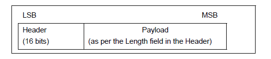

As shown above, an Adv packet in BLE stack contains 2-byte header, and Payload (PDU). The maximum length of Payload is 31 bytes.  

The API below serves to set PDU data of adv packet:

```C
ble_sts_t	bls_ll_setAdvData(u8 *data, u8 len);
```

The “data” pointer points to the starting address of the PDU, while the “len” indicates data length. 

The table below lists possible results for the return type “ble_sts_t”.  

| ble_sts_t                        | Value   | ERR Reason                       |
| :------------------------------- | :-----  | :------------------------------- |
| BLE_SUCCESS                      | 0       | Success                          |
| HCI_ERR_INVALID_HCI_ CMD_PARAMS  | 0x12    | Len exceeds the maximum length 31|

This API can be invoked during initialization to set adv data, or invoked in main_loop to modify adv data when firmware is running.

In the "feature_backup" project of this BLE SDK, Adv PDU definition is shown as below. Please refer to “Data Type Specifcation” in BLE Spec “CSS v6” (Core Specification Supplement v6.0) for introduction to various fields.  

```C
const u8	tbl_advData[] = {
	 	0x08, 0x09, 'f', 'e', 'a', 't', 'u', 'r', 'e',
	 	0x02, 0x01, 0x05,
	 	0x03, 0x19, 0x80, 0x01, 
	 	0x05, 0x02, 0x12, 0x18, 0x0F, 0x18,
};
```

As shown in the adv data above, the adv device name is set as "feature".

#### bls_ll_setScanRspData

Please refer to “Core_v5.0” (Vol 2/Part E/ 7.8.8 “LE Set Scan response Data Command”).

The API below serves to set PDU data of scan response packet.

```C
ble_sts_t	bls_ll_setScanRspData(u8 *data, u8 len);
```

The "data" pointer points to the starting address of the PDU, while the “len” indicates data length.

The table below lists possible results for the return type "ble_sts_t".

| ble_sts_t                        | Value  | ERR Reason                        |
| :------------------------------- | :----  | :-------------------------------- |
| BLE_SUCCESS                      | 0      | Success                           |
| HCI_ERR_INVALID_HCI_ CMD_PARAMS  | 0x12   | Len exceeds the maximum length 31 |

The user can call this API to set the Scan response data during initialization, or call this API in the main_loop at any time while the program is running to modify the Scan response data. The scan response data defined in the B91 ble remote project in the BLE SDK is as follows, and the scan device name is "Eaglerc". For the meaning of each field, please refer to the specific description of Data Type Specifcation in the document BLE Spec "CSS v6" (Core Specification Supplement v6.0).

```C
const u8	tbl_scanRsp [] = { 0x08, 0x09, 'E', 'a', 'g', 'l', 'e', 'r', 'c',};
```

The device name is set in the advertising data and scan response data above and is not the same. Then when scanning a Bluetooth device on a mobile phone or IOS system, the device name may be different:

a) Some devices only watch broadcast packets, then the displayed device name is "feature";

b) After seeing the broadcast, some devices send scan request and read back the scan response, then the displayed device name may be "Eaglerc".

The user can also write the same device name in these two packages, and two different names will not be displayed when scanned.

In fact, after the device is connected by the master, when the master reads the Attribute Table of the device, it will obtain the gap device name of the device. After connecting to the device, it may also display the device name according to the settings there.

#### bls_ll_continue_adv_after_scan_req

```C
static inline void bls_ll_continue_adv_after_scan_req(u8 enable);
```
This function is used to add and remove scan requests when broadcasting, and to set up the continuous sending of broadcast packets when a scan request is received.

#### bls_ll_setAdvParam

Please refer to “Core_v5.0” (Vol 2/Part E/ 7.8.5 “LE Set Advertising Parameters Command”).

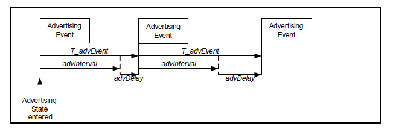

The figure above shows Advertising Event (Adv Event in brief) in BLE stack. It indicates during each T_advEvent, Slave implements one advertising process, and sends one packet in three advertising channels (channel 37, 38 and 39) respectively.

The API below serves to set parameters related to Adv Event.

```C
ble_sts_t bls_ll_setAdvParam( u16 intervalMin, u16 intervalMax, adv_type_t advType, own_addr_type_t  ownAddrType,  u8 peerAddrType, u8 *peerAddr, adv_chn_map_t, adv_channelMap, adv_fp_type_t advFilterPolicy);
```

(1) intervalMin & intervalMax

The two parameters serve to set the range of advertising interval in integer multiples of 0.625ms. The valid range is from 20ms to 10.24s, and intervalMin should not exceed intervalMax.

As required by BLE spec, it’s not recommended to set adv interval as fixed value; in Telink BLE SDK, the eventual adv interval is random variable within the range of intervalMin ~ intervalMax. If intervalMin and intervalMax are set as same value, adv interval will be fixed as the intervalMin.  

Adv packet type has limits to the setting of intervalMin and intervalMax. Please refer to “Core 5.0” (Vol 6/Part B/ 4.4.2.2 “Advertising Events”) for details.

(2) advType

AS per BLE spec, the following four basic advertising event types are supported.

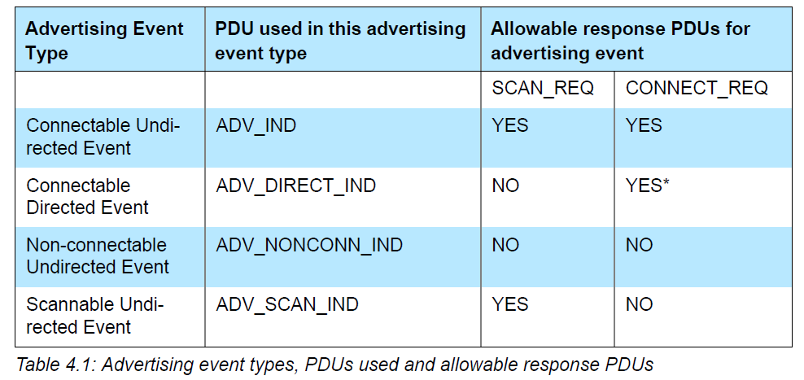

In the “Allowable response PDUs for advertising event” column, “YES” and “NO” indicate whether corresponding adv event type can respond to “Scan request” and “Connect Request” from other device. For example, “Connectable Undirected Event” can respond to both “Scan request” and “Connect Request”, while “Non-connectable Undireted Event” will respond to neither “Scan request” nor “Connect Request”.

For “Connectable Directed Event”, “YES” marked with an asterisk indicates the matched “Connect Request” received won’t be filtered by whitelist and this event will surely respond to it. Other “YES” not marked with asterisk indicate corresponding request can be responded depending on the setting of whitelist filter.

The “Connectable Directed Event” supports two sub-types including “Low Duty Cycle Directed Advertising” and “High Duty Cycle Directed Advertising”. Therefore, five types of adv events are supported in all, as defined below.

```C
/* Advertisement Type */
typedef enum{
  ADV_TYPE_CONNECTABLE_UNDIRECTED             = 0x00,  // ADV_IND
  ADV_TYPE_CONNECTABLE_DIRECTED_HIGH_DUTY     = 0x01,  // ADV_INDIRECT_IND (high duty cycle)
  ADV_TYPE_SCANNABLE_UNDIRECTED               = 0x02 , // ADV_SCAN_IND
  ADV_TYPE_NONCONNECTABLE_UNDIRECTED          = 0x03 , // ADV_NONCONN_IND
  ADV_TYPE_CONNECTABLE_DIRECTED_LOW_DUTY      = 0x04,  // ADV_INDIRECT_IND (low duty cycle)
}adv_type_t;
```

By default, the most common adv event type is “ADV_TYPE_CONNECTABLE_UNDIRECTED”.

(3) ownAddrType

There are four optional values for “ownAddrType” to specify adv address type.

```C
/* Own Address Type */
typedef enum{
	OWN_ADDRESS_PUBLIC = 0,
	OWN_ADDRESS_RANDOM = 1,
	OWN_ADDRESS_RESOLVE_PRIVATE_PUBLIC = 2,
	OWN_ADDRESS_RESOLVE_PRIVATE_RANDOM = 3,
}own_addr_type_t;
```

First two parameters are explained herein.

The “OWN_ADDRESS_PUBLIC” indicates that public MAC address is used during advertising. Actual address is the setting from the API “blc_ll_initAdvertising_module(u8 *public_adr)” during MAC address initialization.

The “OWN_ADDRESS_RANDOM” indicates random static MAC address is used during advertising, and the address comes from the setting of the API below:

```C
ble_sts_t 	blc_ll_setRandomAddr(u8 *randomAddr);
```

(4) peerAddrType & *peerAddr

When advType is set as directed adv type (ADV_TYPE_CONNECTABLE_DIRECTED_HIGH_DUTY or ADV_TYPE_CONNECTABLE_DIRECTED_LOW_DUTY), the “peerAddrType” and “*peerAddr” serve to specify the type and address of peer device MAC Address.

When advType is set as type other than directed adv, the two parameters are invalid, and they can be set as “0” and “NULL”.
  
(5) adv_channelMap

The “adv_channelMap” serves to set advertising channel. It can be selectable from channel 37, 38, 39 or combination.

```C
typedef enum{
	BLT_ENABLE_ADV_37	=		BIT(0),
	BLT_ENABLE_ADV_38	=		BIT(1),
	BLT_ENABLE_ADV_39	=		BIT(2),
	BLT_ENABLE_ADV_ALL	=		(BLT_ENABLE_ADV_37 | BLT_ENABLE_ADV_38 | BLT_ENABLE_ADV_39),
}adv_chn_map_t;
```

(6) advFilterPolicy

The “advFilterPolicy” serves to set filtering policy for scan request/connect request from other device when adv packet is transmitted. Address to be filtered needs to be pre-loaded in whitelist.  

Filtering type options are shown as below. The “ADV_FP_NONE” can be selected if whitelist filter is not needed.  

```C
typedef enum {
	ADV_FP_ALLOW_SCAN_ANY_ALLOW_CONN_ANY        =	0x00,  
	ADV_FP_ALLOW_SCAN_WL_ALLOW_CONN_ANY         =	0x01,
	ADV_FP_ALLOW_SCAN_ANY_ALLOW_CONN_WL         =	0x02, 
	ADV_FP_ALLOW_SCAN_WL_ALLOW_CONN_WL          =	0x03, 
	ADV_FP_NONE	=	ADV_FP_ALLOW_SCAN_ANY_ALLOW_CONN_ANY, 
} adv_fp_type_t; //adv_filterPolicy_type_t
```

The table below lists possible values and reasons for the return value “ble_sts_t”.

| ble_sts_t                       | Value   | ERR Reason                                                                      |
| :------------------------------ | :-----  | :-------------------------------------------------------------------------------|
| BLE_SUCCESS                     | 0       | Sucess                                                                          |
| HCI_ERR_INVALID_HCI_ CMD_PARAMS | 0x12    | The intervalMin or intervalMax value does not meet the requirement of BLE spec. |

According to Host command design in HCI part of BLE spec, eight parameters are configured simultaneously by the “bls_ll_setAdvParam” API. This setting also takes some coupling parameters into consideration. For example, the “advType” has limits to the setting of intervalMin and intervalMax, and range check depends on the advType; if advType and advInterval are set in two APIs, the range check is uncontrollable.

#### bls_ll_setAdvEnable

Please refer to “Core_v5.0” (Vol 2/Part E/ 7.8.9 “LE Set Advertising Enable Command”) .

```C
ble_sts_t	bls_ll_setAdvEnable(int en);
```

en”: 1 - Enable Advertising; 0 - Disable Advertising.

a) In Idle state, by enabling Advertising, Link Layer will enter Advertising state.

b) In Advertising state, by disabling Advertising, Link Layer will enter Idle state.

c) In other states, Link Layer state won’t be influenced by enabling or disabling Advertising.

**Note:**

> Note that at any time this function is called, ble_sts_t unconditionally returns BLE_SUCCESS, which means that the adv-related parameters will be turned on or off internally, but only if they are in idle or adv state.

#### bls_ll_setAdvDuration

```C
ble_sts_t	bls_ll_setAdvDuration (u32 duration_us, u8 duration_en);
```

After the “bls_ll_setAdvParam” is invoked to set all adv parameters successfully, and the “bls_ll_setAdvEnable (1)” is invoked to start advertising, the API “bls_ll_setAdvDuration” can be invoked to set duration of adv event, so that advertising will be automatically disabled after this duration.

“duration_en”: 1-enable timing function; 0-disable timing function.

“duration_us”: The “duration_us” is valid only when the “duration_en” is set as 1, and it indicates the advertising duration in unit of us. When this duration expires, “AdvEnable” becomes unvalid, and advertising is stopped. None Conn state will swtich to Idle State. The Link Layer event “BLT_EV_FLAG_ADV_DURATION_TIMEOUT” will be triggered.

As specified in BLE spec, for the adv type “ADV_TYPE_CONNECTABLE_DIRECTED_HIGH_DUTY”, the duration time is fixed as 1.28s, i.e. advertising will be stopped after the 1.28s duration. Therefore, for this adv type, the setting of “bls_ll_setAdvDuration” won’t take effect.

The return value “ble_sts_t” is shown as below.

| ble_sts_t                       | Value  | ERR Reason                                                                      |
| :------------------------------ | :----- | :------------------------------------------------------------------------------ |
| BLE_SUCCESS                     | 0      | Success                                                                         |
| HCI_ERR_INVALID_HCI_ CMD_PARAMS | 0x12   | Duration Time can’t be configured for “ADV_TYPE_CONNECTABLE_DIRECTED_HIGH_DUTY”.|

When Adv Duratrion Time expires, advertising is stopped, if user needs to re-configure adv parameters (such as AdvType, AdvInterval, AdvChannelMap), first the parameters should be set in the callback function of the event “BLT_EV_FLAG_ADV_DURATION_TIMEOUT”, then the “bls_ll_setAdvEnable (1)” should be invoked to start new advertising.  

To trigger the “BLT_EV_FLAG_ADV_DURATION_TIMEOUT”, a special case should be noted:

Suppose the “duration_us” is set as “2000000” (i.e. 2s).

- If Slave stays in advertising state, when adv time reaches the preset 2s timeout, the “BLT_EV_FLAG_ADV_DURATION_TIMEOUT” will be triggered to execute corresponding callback function.

- If Slave is connected with Master when adv time is less than the 2s timeout (suppose adv time is 0.5s), the timeout timing is not cleared but cached in bottom layer. When Slave stays in connection state for 1.5s (i.e. the preset 2s timeout moment is reached), since Slave won’t check adv event timeout in connection state, the callback of “BLT_EV_FLAG_ADV_DURATION_TIMEOUT” won’t be triggered.

**Note:**

> When Slave stays in connection state for certain duration (e.g. 10s), then terminates connection and returns to adv state, before it sends out the first adv packet, the Stack will regard current time exceeds the preset 2s timeout and trigger the callback of “BLT_EV_FLAG_ADV_DURATION_TIMEOUT”. In this case, the callback triggering time largely exceeds the preset timeout moment.

#### blc_ll_setAdvCustomedChannel

The API below serves to customize special advertising channel/scanning channel, and it only applies some special applications such as BLE mesh. It’s not recommended to use this API for other conventional application cases.

```C
void  blc_ll_setAdvCustomedChannel (u8 chn0, u8 chn1, u8 chn2);
```

chn0/chn1/chn2: customized channel. Default standard channel is 37/38/39. 
For example, to set three advertising channels as 2420MHz, 2430MHz and 2450MHz, the API below should be invoked:

```C
blc_ll_setAdvCustomedChannel (8, 12, 22);
```

#### rf_set_power_level_index

This BLE SDK supplies the API to set output power for BLE RF packet, as shown below.

```C
void rf_set_power_level_index (rf_power_level_index_e level)
```

The “level” is selectable from the corresponding enum variable RF_PowerTypeDef in the “drivers/B91/rf_drv.h”.

The Tx power configured by this API will take effect for both adv packet and conn packet, and it can be set freely in firmware. The actual Tx power will be determined by the latest setting.

Please note that the “rf_set_power_level_index” configures registers related to MCU RF. Once MCU enters sleep (suspend/deepsleep retention), these registers’ values will be lost, so they should be reconfigured after each wakeup. For example, SDK demo employs the event callback “BLT_EV_FLAG_SUSPEND_EXIT” to guarantee RF power is recovered after wakeup from sleep.

```C
_attribute_ram_code_ void	 user_set_rf_power (u8 e, u8 *p, int n)
{
	rf_set_power_level_index (MY_RF_POWER_INDEX);
}
user_set_rf_power(0, 0, 0);
bls_app_registerEventCallback (BLT_EV_FLAG_SUSPEND_EXIT, &user_set_rf_power);
```

#### bls_ll_terminateConnection

```C
ble_sts_t	bls_ll_terminateConnection (u8 reason);
```

This API is used for BLE Slave device, and it only applies to Connection state Slave role.

In order to actively terminate connection, this API can be invoked by APP Layer to send a “Terminate” to Master in Link Layer. “reason” indicates reason for disconnection. Please refer to “Core_v5.0” (Vol 2/Part D/2 “Error Code Descriptions”).

If connection is not terminated due to system operation abnormity, generally APP layer specifies the “reason” as:

```C
HCI_ERR_REMOTE_USER_TERM_CONN  = 0x13
bls_ll_terminateConnection(HCI_ERR_REMOTE_USER_TERM_CONN);
```

In bottom-layer stack of Telink BLE SDK, this API is invoked only in one case to actively terminate connection: When data packets from peer device are decrpted, if an authentication data MIC error is detected, the “bls_ll_terminateConnection(HCI_ERR_CONN_TERM_MIC_FAILURE)” will be invoked to inform the peer device of the decryption error, and connection is terminated.

After Slave invokes this API to actively initiate disconnection, the event “BLT_EV_FLAG_TERMINATE” will be triggered. The terminate reason in the callback function of this event will be consistent with the reason manually configured in this API.

In Connection state Slave role, generally connection will be terminated successfully by invoking this API; however, in some special cases, the API may fail to terminate connection, and the error reason will be indicated by the return value “ble_sts_t”. It’s recommended to check whether the return value is “BLE_SUCCESS” when this API is invoked by APP layer.

| ble_sts_t                           | Value     | ERR Reason                                                                                         |
| :---------------------------------- | :-------  | :------------------------------------------------------------------------------------------------- |
| BLE_SUCCESS                         | 0         | Success                                                                                            |
| HCI_ERR_CONN_NOT_ ESTABLISH         | 0x3E      | Link Layer is not in Connection state Slave role.                                                  |
| HCI_ERR_CONTROLLER _BUSY            | 0x3A      | Controller busy (mass data are being transferred), this command cannot be accepted for the moment. |

#### Get Connection Parameters

The following APIs serves to obtain current connection paramters including Connection Interval, Connection Latency and Connection Timeout (only apply to Slave role). 

```C
u16			bls_ll_getConnectionInterval(void); 
u16			bls_ll_getConnectionLatency(void);	
u16			bls_ll_getConnectionTimeout(void);
```

a) If return value is 0, it indicates current Link Layer state is None Conn state without connection parameters available.

b) The returned non-zero value indicates the corresponding parameter value.

- Actual conn interval divided by 1.25ms will be returned by the API “bls_ll_getConnectionInterval”. Suppose current conn interval is 10ms, the return value should be 10ms/1.25ms=8.  

- Acutal Latency value will be returned by the API “bls_ll_getConnectionLatency”.

- Actual conn timeout divided by 10ms will be returned by the API “bls_ll_getConnectionTimeout”. Suppose current conn timeout is 1000ms, the return value would be 1000ms/10ms=100.

#### blc_ll_getCurrentState

The API below serves to obtain current Link Layer state.

```C
u8  blc_ll_getCurrentState(void);
```

User can invoke the “bls_ll_getCurrentState()” in APP layer to judge current state, e.g.

```C
if(  blc_ll_getCurrentState() == BLS_LINK_STATE_ADV)
if(  blc_ll_getCurrentState() == BLS_LINK_STATE_CONN )
```

#### blc_ll_getLatestAvgRSSI

The API serves to obtain latest average RSSI of connected peer device after Link Layer enters Slave role or Master role. 

```C
u8 		blc_ll_getLatestAvgRSSI(void)
```

The return value is u8-type rssi_raw, and the real RSSI should be: rssi_real = rssi_raw- 110. Suppose the return value is 50, rssi = -60 db.

#### Whitelist & Resolvinglist

As introduced above, “filter_policy” of Advertising/Scanning/Initiating state involves Whitelist, and actual operation may depend on devices in Whitelist. Actually Whitelist contains two parts: Whitelist and Resolvinglist. 

User can check whether address type of peer device is RPA (Resolvable Private Address) via “peer_addr_type” and “peer_addr”. The API below can be invoked directly.

```C
#define IS_NON_RESOLVABLE_PRIVATE_ADDR(type, addr)         
( (type)==BLE_ADDR_RANDOM && (addr[5] & 0xC0) == 0x00 )
```

Only non-RPA address can be stored in whitelist. In current SDK, whitelist can store up to four devices.

```C
#define  	MAX_WHITE_LIST_SIZE    		4
```

The API below serves to reset whitelist: 

```C
ble_sts_t ll_whiteList_reset(void);
```

The return value of reset whitelist is “BLE_SUCCESS”.

```C
ble_sts_t ll_whiteList_add(u8 type, u8 *addr);
```

Add a device into whitelist, the return value is shown as below.

| ble_sts_t                | Value  | ERR Reason                            |
| :----------------------- | :----- | :-----------------------------------  |
| BLE_SUCCESS              | 0      | Add success                           |
| HCI_ERR_MEM_CAP_EXCEEDED | 0x07   | Whitelist is already full, add failure|

Delete a device from whitelist, the return value is “BLE_SUCCESS”.

```C
ble_sts_t ll_whiteList_delete(u8 type, u8 *addr);
```

RPA (Resolvable Private Address) device needs to use Resolvinglist. To save RAM space, “Resolvinglist” can store up to two devices in current SDK.

```C
#define 	MAX_WHITE_IRK_LIST_SIZE          	2
```

Corresponding API:
```C
ble_sts_t  ll_resolvingList_reset(void);
```

Reset Resolvinglist, the return value is “BLE_SUCCESS”.

The API below serves to enable/disable device address resolving for Resolvinglist. It is used for device address resolution. If you want to use Resolvinglist to resolve addresses, you must enable it. You can disable it when you do not need to parse it.

```C
ble_sts_t  ll_resolvingList_setAddrResolutionEnable (u8 resolutionEn);
```

The API below serves to add device using RPA address into Resolvinglist, peerIdAddrType/ peerIdAddr and peer-irk indicate identity address and irk declared by peer device. These information will be stored into flash during pairing encryption process, and corresponding interfaces to obtain the info are available in SMP part. “local_irk” is not processed in current SDK, and it can be set as “NULL”.

```C
ble_sts_t  ll_resolvingList_add(u8 peerIdAddrType, u8 *peerIdAddr, 
u8 *peer_irk, u8 *local_irk);
```

The API below serves to delete a RPA device from Resolvinglist. 

```C
ble_sts_t  ll_resolvingList_delete(u8 peerIdAddrType, u8 *peerIdAddr);
```

For usage of address filter based on Whitelist/Resolvinglist, please refer to “TEST_WHITELIST” in feature test demo of the SDK.

### Coded PHY/2M PHY

#### Coded PHY/2M PHY Introduction

Coded PHY and 2M PHY are new features to <Core_5.0>, this expands the BLE application scenario, Coded PHY includes S2 (500kbps) and S8 (125kbps) in order to support long range application. 2M PHY (2Mbps) improved the BLE bandwidth. Coded PHY and 2M PHY could be used under both the adversting channel and data channel when in connected state. Connected state application will be introduced in the following section, advertising channel application will be introduced in “Extended Advertising).

#### Coded PHY/2M PHY Demo Introduction

In the BLE SDK, in order to save the sram space, Code PHY and 2M PHY is disabled by default. If user wants to enable this feature, you can enable it manually.
You can refer to the BLE SDK demo:

- Slave mode reference demo “B91_feature_test”

In the vendor/B91_feature/feature_config.h, macro definition:

```C
#define FEATURE_TEST_MODE	TEST_2M_CODED_PHY_CONNECTION
```

#### Coded PHY/2M PHY API Introduction

(1) API

```C
void blc_ll_init2MPhyCodedPhy_feature(void)
```

is used to enable Code PHY and 2M PHY.

(2) A new event - BLT_EV_FLAG_PHY_UPDATE is introduced to Telink Defined Event in order to support Coded and 2M PHY, the detail implementation could refer to section “Controller Event”.

(3) API:

```C
ble_sts_t  blc_ll_setPhy (u16 connHandle,le_phy_prefer_mask_t all_phys, le_phy_prefer_type_t tx_phys, le_phy_prefer_type_t rx_phys, le_ci_prefer_t phy_options);
```

This is a BLE Spec standard interface, please refer to <Core_5.0>, Vol 2/Part7/7.8.49, “LE Set PHY Command”.

connHandle:

slave mode: it should set to BLS_CONN_HANDLE;

master mode: it should set to BLM_CONN_HANDLE.

For other parameters, please refer to Spec’s definition along with SDK’s enumeration definition.

### Channel Selection Algorithm #2

Channel Selection Algorithm #2 is a new feature added to <Core_5.0, with a better interference avoidance capability. You can refer to <Core_5.0> (Vol 6/Part B/4.5.8.3 “Channel Selection Algorithm #2”) for further information.

a) User could call below API if choosing the hopping algorithm #2.

```C
 void blc_ll_initChannelSelectionAlgorithm_2_feature(void)
```

b) If using <Core_4.2> API, user could choose to use or not use the hopping algothrim#2. In Eagle SDK, it is also not using it by default.

c) If using <Core_5.0> extended advertising and initiate connect through Extend ADV, user will have to use above API to choose Algorithm #2 according to the spec <Core_5.0>. Because if the connection is initiated through Extended Adv, it’ll choose Algorithm#2 by default, and on the othe hand, if only uses advertising, in order to save sram space, Algorithm #2 is not recommended.

### Extended Advertising

#### Extended Advertising Introduction

Extended Advertising is a new feature to <Core_5.0>

Due to the new feature to Advertising in <Core_5.0>, SDK has new APIs in order to support the legacy Advertising function in <Core_4.2) and the new Advertising function in <Core_5.0>. These APIs will be covered in later secions, named as <Core_5.0> API.（following secion will use this name as reference）, and <Core_4.2)> APIs refered in section <Controller API>, like bls_ll_setAdvData()、bls_ll_setScanRspData()、bls_ll_setAdvParam(), will only support for <Core_4.2>’s Advertising function, but not <Core_5.0> Advertising new function.

Extended Advertising primary feature as following:

(1) Increase the Advertising PDUs – In <Core_4.2>, the Advertising PDU length is ranging from 6 to 37 bytes, and in <Core_5.0>, the extended Advertising PDU is ranging from 0 to 255 bytes (single PDU). If the Advertising Data length > Adv PDU, it’ll be fragmented into N Advertising PDU and send it out.

(2) It could chose different PHYs（1Mbps，2Mbps，125kbps，500kbps）based on different application.

#### Extended Advertising Demo Setup

Extended Advertising Demo “B91_feature”：

Demo1：use to illustrate all the basic advertising functions in <Core_5.0>.

a) In vendor/B91_feature/feature_config.h, declares the following macro:

```C
#define FEATURE_TEST_MODE	TEST_EXTENDED_ADVERTISING
```

b) Based on the type of Advertising, select the corresponding macro. The demo could also test all the supported Advertising type in <Core_5.0>, below are all the type that Eagle SDK currently supported.

```C
/* Advertising Event Properties type*/
typedef enum{
  ADV_EVT_PROP_LEGACY_CONNECTABLE_SCANNABLE_UNDIRECTED  			= 0x0013,
  ADV_EVT_PROP_LEGACY_CONNECTABLE_DIRECTED_LOW_DUTY					= 0x0015,
  ADV_EVT_PROP_LEGACY_CONNECTABLE_DIRECTED_HIGH_DUTY 				= 0x001D,
  ADV_EVT_PROP_LEGACY_SCANNABLE_UNDIRECTED 							= 0x0012,
  ADV_EVT_PROP_LEGACY_NON_CONNECTABLE_NON_SCANNABLE_UNDIRECTED		= 0x0010,
  ADV_EVT_PROP_EXTENDED_NON_CONNECTABLE_NON_SCANNABLE_UNDIRECTED  	= 0x0000,
  ADV_EVT_PROP_EXTENDED_CONNECTABLE_UNDIRECTED       				= 0x0001,
  ADV_EVT_PROP_EXTENDED_SCANNABLE_UNDIRECTED						= 0x0002,
  ADV_EVT_PROP_EXTENDED_NON_CONNECTABLE_NON_SCANNABLE_DIRECTED		= 0x0004,
  ADV_EVT_PROP_EXTENDED_CONNECTABLE_DIRECTED						= 0x0005,
  ADV_EVT_PROP_EXTENDED_SCANNABLE_DIRECTED							= 0x0006,
  ADV_EVT_PROP_EXTENDED_MASK_ANONYMOUS_ADV 							= 0x0020,
  ADV_EVT_PROP_EXTENDED_MASK_TX_POWER_INCLUDE						= 0x0040,
}advEvtProp_type_t;
```

Demo2：Based on Demo1，enable the Coded PHY/2M PHY option

a) In vendor/B91_feature/feature_config.h, declares the following macro:

```C
#define FEATURE_TEST_MODE	TEST_2M_CODED_PHY_EXT_ADV
```

b) Based on the type of Advertising and PHY mode, select the corresponding macro

#### Extended Advertising Related API

Extended Advertising is using module design. Due to the variable length of adv data length/scan response data where the maximum length will be up to more than 1000 bytes, instead of statically defining the maximum value in BLE stack that might waste the SRAM space, we leave the definition of SRAM space to developer, so that it would have the flexibility for user to review their needs to best use of the SRAM space.

Current SDK only support one Advertising set, but with the design that has flexibility to support multiple adv set for future as well. So you could see the APIs’ parameters are all designed in the way to support multiple adv sets for future.

With that design, following are the APIs.

(1) Initialization stage, you would need to call the following APIs to allocate the SRAM.

```C
blc_ll_initExtendedAdvertising_module(app_adv_set_param, app_primary_adv_pkt, APP_ADV_SETS_NUMBER);
blc_ll_initExtSecondaryAdvPacketBuffer(app_secondary_adv_pkt, MAX_LENGTH_SECOND_ADV_PKT);
blc_ll_initExtAdvDataBuffer(app_advData, APP_MAX_LENGTH_ADV_DATA);
blc_ll_initExtScanRspDataBuffer(app_scanRspData, APP_MAX_LENGTH_SCAN_RESPONSE_DATA);
```

According to above API, the memory allocation is shown as below:

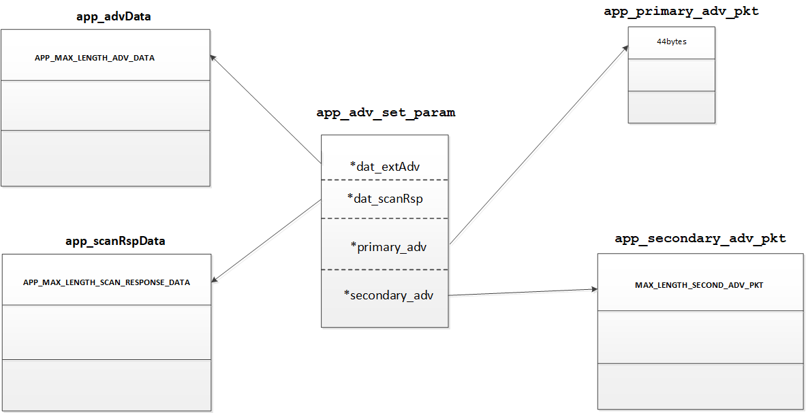

- APP_MAX_LENGTH_ADV_DATA: Advertising Set length, developer could adjust the macro to define the size based on the needs in order to save the DeepRetention space.

- APP_MAX_LENGTH_SCAN_RESPONSE_DATA: Scan response data length, developer could adjust the macro to define the size based on the needs in order to save the DeepRetention space.

- app_primary_adv_pkt: Primary Advertising PDU data length, the size is allocated as 44 bytes, application can’t change it.

- app_secondary_adv_pkt: Secondary Advertising PDU data length, the size is allocated as 264 bytes, application can’t change it.

In the demo of "B91_feature", (vendor/B91_feature/feature_extend_adv/app.c), developer can use the following macro to allocate the sram based on your requirement in order to best use the sram.

```C
#define	APP_ADV_SETS_NUMBER						1			
#define	APP_MAX_LENGTH_ADV_DATA			  	   1024		
#define	APP_MAX_LENGTH_SCAN_RESPONSE_DATA		31	
```

(2) API

```C
ble_sts_t 	blc_ll_setExtAdvParam(……);
```

This is a BLE Spec standard interface, used to configure Advertising parameter, please refer to <Core_5.0> (Vol 2/Part E/7.8.53 “LE Set Extended Advertising Parameters Command”) for further information.

**Note:**

> The parameter adv_tx_pow does not currently support the option to send power value, you need to call the API void rf_set_power_level_index (rf_power_level_index_e level) to configure the send power.

(3) API

```C
ble_sts_t blc_ll_setExtScanRspData(u8 advHandle, data_oper_t operation, data_fragm_t fragment_prefer, u8 scanRsp_dataLen, u8 *scanRspData);
```

This is a BLE Spec standard interface，used to configure the Scan Response Data，please refer to <Core_5.0> (Vol 2/Part E/7.8.53 “LE Set Extended Scan Response Command”).

(4) API

```C
ble_sts_t	blc_ll_setExtAdvEnable_n(u32 extAdv_en, u8 sets_num, u8 *pData);
```

This is a BLE Spec standard interface，used to enable/disable Extended Advertising，please refer to <Core_5.0> (Vol 2/Part E/7.8.56 “LE Set Extended Advertising Enable Command”).

Since B91 SDK currently only support one Advertising Set, so this API is for furture support, and not functioning at this moment，And a separate API is added to support one Advertising Set.

```C
ble_sts_t 	blc_ll_setExtAdvEnable_1(u32 extAdv_en, u8 sets_num, u8 advHandle, 	 u16 duration, 	  u8 max_extAdvEvt);
```

(5) API

```C
void   blc_ll_setDefaultExtAdvCodingIndication(u8 advHandle, le_ci_prefer_t prefer_CI);
```

This is a BLE Spec standard interface，used to configure the Random address，please refer to <Core_5.0> (Vol 2/Part E/7.8.4 “LE Set Random Address Command”).

The user can pass parameters via prefer_CI for S2/S8 mode selection, as enumerated below.

```C
typedef enum {
	CODED_PHY_PREFER_NONE 	= 0,
	CODED_PHY_PREFER_S2		= 1,
	CODED_PHY_PREFER_S8 	= 2,
} le_ci_prefer_t;   //LE coding indication prefer
```

(6) API

```C
void   blc_ll_setAuxAdvChnIdxByCustomers(u8 aux_chn);
```

This is a none BLE Spec standard interface，if developer use BLE standard interface blc_ll_setExtAdvParam() to configure the Advertising parameters, and also if configure it to Coded PHY（for either S2 or S8）in the same time, but didn’t specify which Coded PHY mode is, S2 will be choosen by default. This API is added for developer to specify the Coded PHY mode.

(7) API

```C
void   blc_ll_setMaxAdvDelay_for_AdvEvent(u8 max_delay_ms);
```

This is a none BLE Spec standard interface，used to configure the AdvDelay timing based on the Adv Interval, the input range is from 0, 1, 2, 4, 8 in the unit of ms.

```C
advDelay(unit: us) = Random()  %  (max_delay_ms*1000);
T_advEvent = advInterval + advDelay
```

If max_delay_ms = 0 ,T_advEvent is right on the advInterval timing;
If max_delay_ms = 8, T_advEvent is based on the advInterval with a random offset in between 0-8ms.

## BLE Host

### BLE Host Introduction

BLE Host consists of L2CAP, ATT, SMP, GATT and GAP layer, and user-layer applications are implemented on the basis of the Host layer.

### L2CAP

The L2CAP, Logical Link Control and Adaptation Protocol, connects to the upper APP layer and the lower Controller layer. By acting as an adaptor between the Host and the Controller, the L2CAP makes data processing details of the Controller become negligible to the upper-layer application operations.

The L2CAP layer of BLE is a simplified version of classical Bluetooth. In basic mode, it does not implement segmentation and re-assembly, has no involvement of flow control and re-transmission, and only uses fixed channels for communication.
The figure below shows simple L2CAP structure: Data of the APP layer are sent in packets to the BLE Controller. The BLE Controller assembles the received data into different CID data and report them to the Host layer.

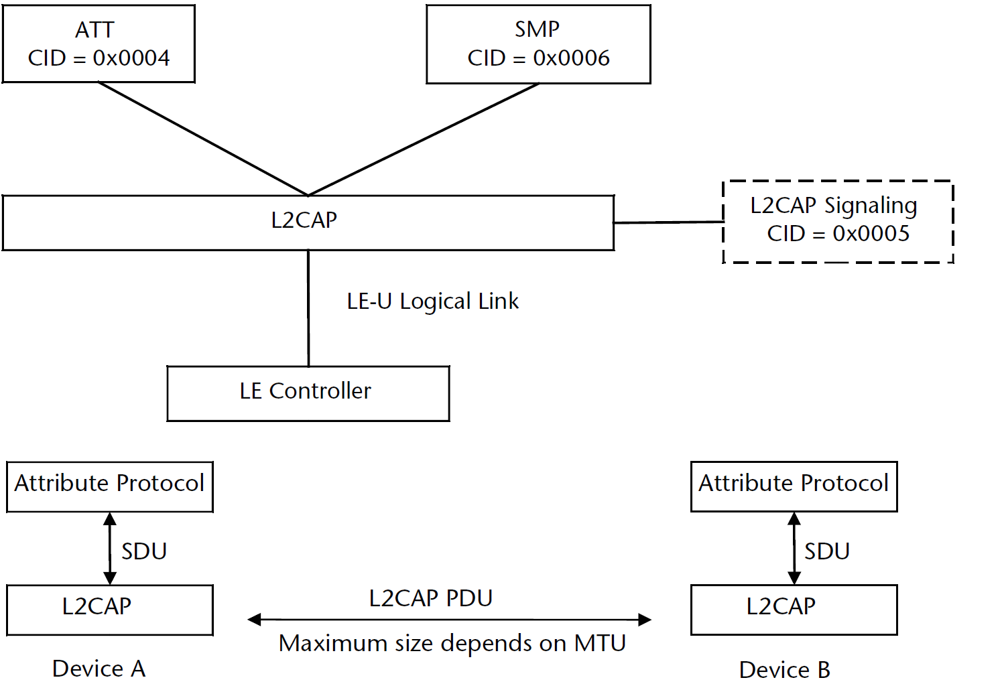

As specified in BLE Spec, L2CAP is mainly used for data transfer between Controller and Host. Most work are finished in stack bottom layer with little involvement of user. User only needs to invoke the following APIs to set correspondingly.

```C
void	blc_l2cap_register_handler (void *p);
```

In BLE slave applications such as B91 module, the function of SDK L2CAP layer processing controller data is:

```C
int 	blc_l2cap_packet_receive (u16 connHandle, u8 * p);
```

This function has been implemented in the protocol stack and it will parse the received data and transmit it upwards to ATT, SIG or SMP.

Initialization:

```C
blc_l2cap_register_handler (blc_l2cap_packet_receive);
```

#### Slave Requests for Connection Parameter Update

In BLE stack, Slave can actively apply for a new set of connection parameters by sending a “CONNECTION PARAMETER UPDATE REQUEST” command to Master in L2CAP layer. The figure below shows the command format. Please refer to “Core_v5.0” (Vol 3/Part A/ 4.20 “CONNECTION PARAMETER UPDATE REQUEST”) .

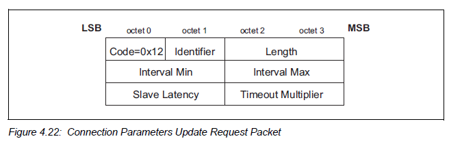

The BLE SDK provides an API for slaves to actively apply to update connection parameters on the L2CAP layer to send the above CONNECTION PARAMETER UPDATE REQUEST command to the master.

```C
void  bls_l2cap_requestConnParamUpdate (u16 min_interval, u16 max_interval, u16 latency, u16 timeout);
```

The four parameters of this API correspond to the parameters in the “data” field of the “CONNECTION PARAMETER UPDATE REQUEST”. The “min_interval” and “max_interval” are the actual interval time divided by 1.25ms (e.g. for 7.5ms connection interval, the value should be 6); the “timeout” is actual supervision timeout divided by 10ms (e.g. for 1s timeout, the value should be 100).

Application example: Slave requests for new connection parameters when connection is established.

```C
void	task_connect (u8 e, u8 *p, int n)
	{
		bls_l2cap_requestConnParamUpdate (6, 6, 99, 400);  
		bls_l2cap_setMinimalUpdateReqSendingTime_after_connCreate(1000);
	}
```

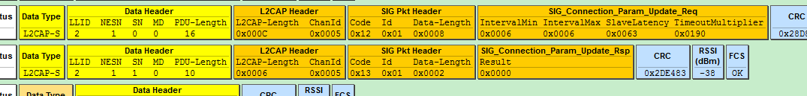

The API:

```C
void bls_l2cap_setMinimalUpdateReqSendingTime_after_connCreate(int time_ms)
```

serves to make the Slave wait for time_ms miliseconds after connection is established, and then invoke the API “bls_l2cap_requestConnParamUpdate” to update connection parameters. After conection is established, if user only invokes the “bls_l2cap_requestConnParamUpdate”, the Slave will wait for 1s to execute this request command.

For Slave applications, the SDK provides register callback function interface of obtaining Conn_UpdateRsp result, so as to inform user whether connection parameter update request from Slave is rejected or accepted by Master. As shown in the figure above, Master accepts Connection_Param_Update_Req from Slave.

```C
void blc_l2cap_registerConnUpdateRspCb(l2cap_conn_update_rsp_callback_t cb);
```

Please refer to the use case of Slave initialization:

```C
blc_l2cap_registerConnUpdateRspCb(app_conn_param_update_response)
```

Following shows the reference for the callback function "app_conn_param_update_response".

```C
int app_conn_param_update_response(u8 id, u16  result)
{
	if(result == CONN_PARAM_UPDATE_ACCEPT){
		//the LE master Host has accepted the connection parameters
	}
	else if(result == CONN_PARAM_UPDATE_REJECT){
		//the LE master Host has rejected the connection parameter
	}
	return 0;
}
```

### ATT & GATT

#### GATT basic unit “Attribute”

GATT defines two roles: Server and Client. In this BLE SDK, Slave is Server, and corresponding Android/iOS device is Client. Server needs to supply multiple Services for Client to access.  

Each Service of GATT consists of multiple Attributes, and each Attribute contains certain information.

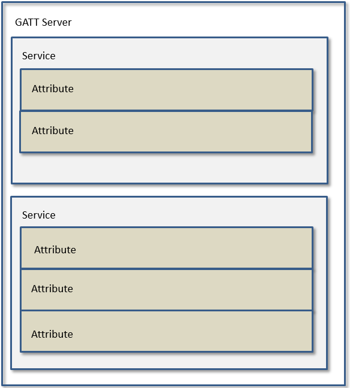

The basic contents of Attribute are shown as below:

(1) Attribute Type: UUID

The UUID is used to identify Attribute type, and its total length is 16 bytes. In BLE standard protocol, the UUID length is defined as two bytes, since Master devices follow the same method to transform 2-byte UUID into 16 bytes.

When standard 2-byte UUID is directly used, Master should know device types indicated by various UUIDs. 8x5x BLE stack defines some standard UUIDs in “stack/service/hids.h” and “stack/ble /uuid.h”.

Telink proprietary profiles (OTA, MIC, SPEAKER, and etc.) are not supported in standard Bluetooth. The 16-byte proprietary device UUIDs are defined in “stack/ble/uuid.h”.  

(2) Attribute Handle

Slave supports multiple Attributes which compose an Attribute Table. In Attribute Table, each Attribute is identified by an Attribute Handle value. After connection is established, Master will analyze and obtain the Attribute Table of Slave via “Service Discovery” process, then it can identify Attribute data via the Attribute Handle during data transfer.

(3) Attribute Value

Attribute Value corresponding to each Attribute is used as request, response, notification and indication data. In 8x5x BLE stack, Attribute Value is indicated by one pointer and the length of the area pointed by the pointer.

#### Attribute and ATT Table

To implement GATT Service on Slave, an Attribute Table is defined in this BLE SDK and it consists of multiple basic Attributes. Attribute definition is shown as below.

```C
typedef struct attribute
	{
		u16 attNum;
		u8   perm;
		u8   uuidLen;
		u32  attrLen;    //4 bytes aligned
		u8*  uuid;
		u8*  pAttrValue;
		att_readwrite_callback_t  w;
		att_readwrite_callback_t  r;
	} attribute_t;
```

Below is Attribute Table given by the BLE SDK to illustrate the meaning of the above items. See app_att.c for the Attribute Table code, as shown below:

```C
static const attribute_t my_Attributes[] = {
	{ATT_END_H - 1, 0,0,0,0,0},	// total num of attribute
	// 0001 - 0007  gap
	{7,ATT_PERMISSIONS_READ,2,2,(u8*)(&my_primaryServiceUUID), 	(u8*)(&my_gapServiceUUID), 0},
	{0,ATT_PERMISSIONS_READ,2,sizeof(my_devNameCharVal),(u8*)(&my_characterUUID), (u8*)(my_devNameCharVal), 0},
	{0,ATT_PERMISSIONS_READ,2,sizeof(my_devName), (u8*)(&my_devNameUUID), (u8*)(my_devName), 0},
	{0,ATT_PERMISSIONS_READ,2,sizeof(my_appearanceCharVal),(u8*)(&my_characterUUID), (u8*)(my_appearanceCharVal), 0},
	{0,ATT_PERMISSIONS_READ,2,sizeof (my_appearance), (u8*)(&my_appearanceUIID), 	(u8*)(&my_appearance), 0},
	{0,ATT_PERMISSIONS_READ,2,sizeof(my_periConnParamCharVal),(u8*)(&my_characterUUID), (u8*)(my_periConnParamCharVal), 0},
	{0,ATT_PERMISSIONS_READ,2,sizeof (my_periConnParameters),(u8*)(&my_periConnParamUUID), 	(u8*)(&my_periConnParameters), 0},
	// 0008 - 000b gatt
	{4,ATT_PERMISSIONS_READ,2,2,(u8*)(&my_primaryServiceUUID), 	(u8*)(&my_gattServiceUUID), 0},
	{0,ATT_PERMISSIONS_READ,2,sizeof(my_serviceChangeCharVal),(u8*)(&my_characterUUID), 		(u8*)(my_serviceChangeCharVal), 0},
	{0,ATT_PERMISSIONS_READ,2,sizeof (serviceChangeVal), (u8*)(&serviceChangeUUID), 	(u8*)(&serviceChangeVal), 0},
	{0,ATT_PERMISSIONS_RDWR,2,sizeof (serviceChangeCCC),(u8*)(&clientCharacterCfgUUID), (u8*)(serviceChangeCCC), 0},
};
```

Note: The key word “const” is added before Attribute Table definition:

```C
const attribute_t my_Attributes[] = { ... };
```

By adding the “const”, the compiler will store the array data to flash rather than RAM, while all contents of the Attribute Table defined in flash are read only and not modifiable.

(1) attNum

The “attNum” supports two functions.

The “attNum” can be used to indicate the number of valid Attributes in current Attribute Table, i.e. the maximum Attribute Handle value. This number is only used in the invalid Attribute item 0 of Attribute Table array.

```C
{57,0,0,0,0,0},	// ATT_END_H – 1 = 57
```

“attNum = 57” indicates there are 57 valid Attributes in current Attribute Table.

In BLE, Attribute Handle value starts from 0x0001 with increment step of 1, while the array index starts from 0. When this virtual Attribute is added to the Attribute Table, each Attribute index equals its Attribute Handle value. After the Attribute Table is defined, Attribute Handle value of an Attribute can be obtained by counting its index in current Attribute Table array.

The final index is the number of valid Attributes (i.e. attNum) in current Attribute Table. In current SDK, the attNum is set as 57; if user adds or deletes any Attribute, the attNum needs to be modified correspondingly.

The “attNum” can also be used to specify Attributes constituting current Service.

The UUID of the first Attribute for each Service must be “GATT_UUID_PRIMARY_SERVICE(0x2800)”; the first Attribute of a Service sets “attNum” and it indicates following “attNum” Attributes constitute current Service.

As shown in code above, for the gap service, the Attribute with UUID of “GATT_UUID_PRIMARY_SERVICE” sets the “attNum” as 7, it indicates the seven Attributes from Attribute Handle 1 to Attribute Handle 7 constitute the gap service.

Except for Attribute item 0 and the first Attribute of each Service, attNum values of all Attributes must be set as 0.  

(2)	perm

The “perm” is the simplified form of “permission” and it serves to specify access permission of current Attribute by Client.

The “perm” of each Attribute should be configured as one or combination of following 10 values.

```C
#define ATT_PERMISSIONS_READ                 0x01 
#define ATT_PERMISSIONS_WRITE                0x02 
#define ATT_PERMISSIONS_AUTHEN_READ          0x61 
#define ATT_PERMISSIONS_AUTHEN_WRITE         0x62
#define ATT_PERMISSIONS_SECURE_CONN_READ     0xE1
#define ATT_PERMISSIONS_SECURE_CONN_WRITE    0xE2
#define ATT_PERMISSIONS_AUTHOR_READ          0x11 
#define ATT_PERMISSIONS_AUTHOR_WRITE         0x12
#define ATT_PERMISSIONS_ENCRYPT_READ         0x21
#define ATT_PERMISSIONS_ENCRYPT_WRITE        0x22 
```

Note: Current SDK version does not support PERMISSION READ and PERMISSION WRITE yet.

(3) uuid and uuidLen

As introduced above, UUID supports two types: BLE standard 2-byte UUID, and Telink proprietary 16-byte UUID. The “uuid” and “uuidLen” can be used to describe the two UUID types simultaneously.

The “uuid” is an u8-type pointer, and “uuidLen” specifies current UUID length, i.e. the uuidLen bytes starting from the pointer are current UUID. Since Attribute Table and all UUIDs are stored in flash, the “uuid” is a pointer pointing to flash.

a) BLE standard 2-byte UUID：

For example, the Attribute “devNameCharacter” with Attribute Handle of 2, related code is shown as below:

```C
#define GATT_UUID_CHARACTER              0x2803
static const u16 my_characterUUID = GATT_UUID_CHARACTER;
static const u8 my_devNameCharVal[5] = {0x12, 0x03, 0x00, 0x00, 0x2A};
{0,1,2,5,(u8*)(&my_characterUUID), (u8*)(my_devNameCharVal), 0},
```

“UUID=0x2803” indicates “character” in BLE and the “uuid” points to the address of “my_devNameCharVal” in flash. The “uuidLen” is 2. When Master reads this Attribute, the UUID would be “0x2803”.  

b) Telink proprietary 16-byte UUID：

For example, the Attribute MIC of audio, related code is shown as below:

```C
#define TELINK_MIC_DATA	{0x18,0x2B,0x0d,0x0c,0x0b,0x0a,0x09,0x08,0x07,0x06,0x05,0x04,0x03,0x02,0x01,0x0}
const u8 my_MicUUID[16]		= TELINK_MIC_DATA;
static u8 my_MicData 		= 0x80;
{0,1,16,1,(u8*)(&my_MicUUID), (u8*)(&my_MicData), 0},
```

The “uuid” points to the address of “my_MicData” in flash, and the “uuidLen” is 16. When Master reads this Attribute, the UUID would be “0x000102030405060708090a0b0c0d2b18”.

(4)	pAttrValue and attrLen

Each Attribute corresponds to an Attribute Value. The “pAttrValue” is an u8-type pointer which points to starting address of Attribute Value in RAM/Flash, while the “attrLen” specifies the data length. When Master reads the Attribute Value of certain Attribute from Slave, the “attrLen” bytes of data starting from the area (RAM/Flash) pointed by the “pAttrValue” will be read by this BLE SDK to Master.

Since UUID is read only, the “uuid” is a pointer pointing to flash; while Attribute Value may involve write operation into RAM, so the “pAttrValue” may points to RAM or flash.

For example, the Attribute hid Information with Attribute Handle of 35, related code is as shown below:

```C
const u8 hidInformation[] =
{
	U16_LO(0x0111), U16_HI(0x0111),   // bcdHID (USB HID version)，0x11,0x01
	0x00,                           // bCountryCode
	0x01                           // Flags
};
{0,1,2, sizeof(hidInformation),(u8*)(&hidinformationUUID), (u8*)(hidInformation), 0},
```

In actual application, the key word “const” can be used to store the read-only 4-byte hid information “0x01 0x00 0x01 0x11” into flash. The “pAttrValue” points to the starting address of hidInformation in flash, while the “attrLen” is the actual length of hidInformation. When Master reads this Attribute, “0x01000111” will be returned to Master correspondingly.

Figure below shows a packet example captured by BLE sniffer when Master reads this Attribute. Master uses the “ATT_Read_Req” command to set the target AttHandle as 0x23 (35), corresponding to the hid information in Attribute Table of SDK.

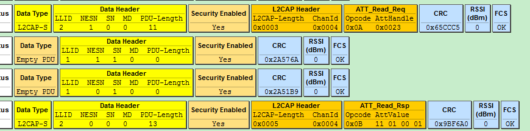

For the Attribute “battery value” with Attribute Handle of 40, related code is as shown below:

```C
u8 	my_batVal[1] 	= {99};
{0,1,2,1,(u8*)(&my_batCharUUID), 	(u8*)(my_batVal), 0},
```

In actual application, the “my_batVal” indicates current battery level and it will be updated according to ADC sampling result; then Slave will actively notify or Master will actively read to transfer the “my_batVal” to Master. The starting address of the “my_batVal” stored in RAM will be pointed by the “pAttrValue”.

(5) Callback function w

The callback function w is write function with prototype as below:

```C
typedef int (*att_readwrite_callback_t)(void* p);
```

User must follow the format above to define callback write function. The callback function w is optional, i.e. for an Attribute, user can select whether to set the callback write function as needed (null pointer 0 indicates not setting callback write function).

The trigger condition for callback function w is: When Slave receives any Attribute PDU with Attribute Opcode as shown below, Slave will check whether the callback function w is set.

a) opcode = 0x12, Write Request.

b) opcode = 0x52, Write Command.

c) opcode = 0x18, Execute Write Request.

After Slave receives a write command above, if the callback function w is not set, Slave will automatically write the area pointed by the “pAttrValue” with the value sent from Master, and the data length equals the “l2capLen” in Master packet format minus 3; if the callback function w is set, Slave will execute user-defined callback function w after it receives the write command, rather than writing data into the area pointed by the “pAttrValue”. Note: Only one of the two write operations is allowed to take effect.  

By setting the callback function w, user can process Write Request, Write Command, and Execute Write Request in ATT layer of Master. If the callback function w is not set, user needs to evaluate whether the area pointed by the “pAttrValue” can process the command (e.g. If the “pAttrValue” points to flash, write operation is not allowed; or if the “attrLen” is not long enough for Master write operation, some data will be modified unexpectedly.)

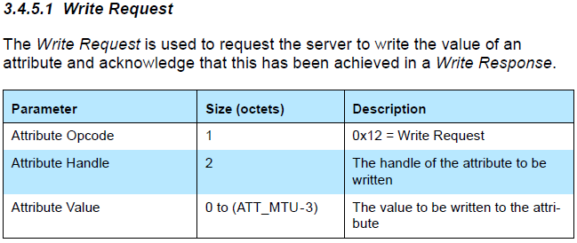

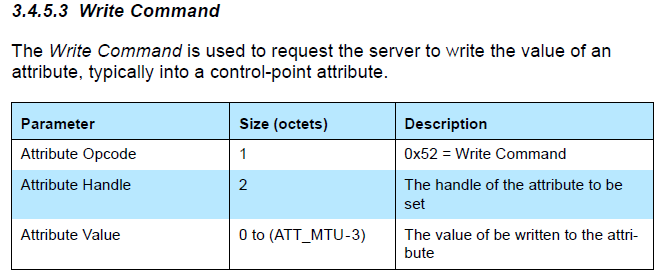

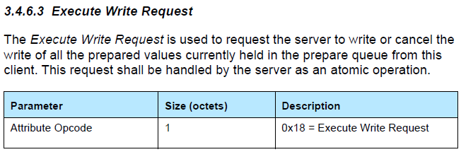

The void-type pointer “p” of the callback function w points to the value of Master write command. Actually “p” points to a memory area, the value of which is shown as the following structure.

```C
typedef struct{          
	u8	type;					
	u8  rf_len;
	u16	l2cap;       
	u16	chanid;
	u8	att;		   
	u8	hl;			
	u8	hh;			
	u8	dat[20];
}rf_packet_att_data_t;
```

“p” points to "type", valid length of data is l2cap minus 3, and the first valid data is pw->dat[0].

```C
int	my_WriteCallback (void *p)
{
	rf_packet_att_data_t *pw = (rf_packet_att_data_t *)p;
	int len = pw->l2cap - 3;
	//add your code
	//valid data is pw->dat[0] ~ pw->dat[len-1]
	return 1;
}	
```

The structure “rf_packet_att_data_t” above is available in the “stack/ble/ble_format.h”.

(6)	Callback function r

The callback function r is read function with prototype as below:

```C
typedef int (*att_readwrite_callback_t)(u16 connHandle,void* p);
```

User must follow the format above to define callback read function. The callback function r is also optional, i.e. for an Attribute, user can select whether to set the callback read function as needed (null pointer 0 indicates not setting callback read function), connHandle is connecting sentence between master and slave, type BLS_CONN_HANDLE for slave application, and type BLM_CONN_HANDLE for master application.

The trigger condition for callback function r is: When Slave receives any Attribute PDU with Attribute Opcode as shown below, Slave will check whether the callback function r is set.

a) opcode = 0x0A, Read Request.

b) opcode = 0x0C, Read Blob Request.

After Slave receives a read command above,

a) If the callback read function is set, Slave will execute this function, and determine whether to respond with “Read Response/Read Blob Response” according to the return value of this function.

- If the return value is 1, Slave won’t respond with “Read Response/Read Blob Response” to Master.

- If the return value is not 1, Slave will automatically read “attrLen” bytes of data from the area pointed by the “pAttrValue”, and the data will be responded to Master via “Read Response/Read Blob Response”.

b) If the callback read function is not set, Slave will automatically read “attrLen” bytes of data from the area pointed by the “pAttrValue”, and the data will be responded to Master via “Read Response/Read Blob Response”.

Therefore, after a Read Request/Read Blob Request is received from Master, if it’s needed to modify the content of Read Response/Read Blob Response, user can register corresponding callback function r, modify contents in RAM pointed by the “pAttrValue” in this callback function, and the return value must be 0.

(7) Attribute Table layout

Figure below shows Service/Attribute layout based on Attribute Table. The “attnum” of the first Attribute indicates the number of valid Attributes in current ATT Table; the remaining Attributes are assigned to different Services, the first Attribute of each Service is the “declaration”, and the following “attnum” Attributes constitute current Service. Actually the first item of each Service is a Primary Service.

```C
#define GATT_UUID_PRIMARY_SERVICE                    0x2800  
const u16 my_primaryServiceUUID = GATT_UUID_PRIMARY_SERVICE;
```

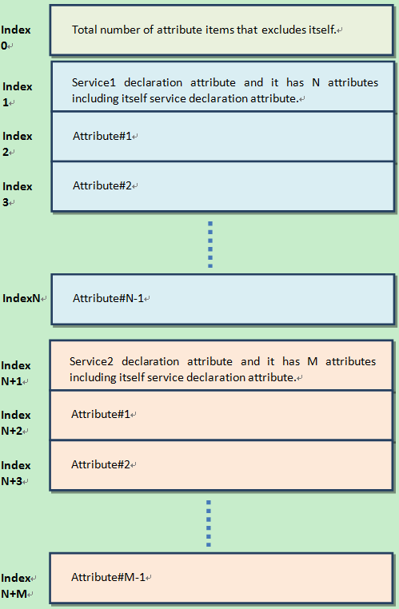

(8) ATT table Initialization

GATT & ATT initialization only needs to transfer the pointer of Attribute Table in APP layer to protocol stack, and the API below is supplied:

```C
void		bls_att_setAttributeTable (u8 *p);
```

“p” is the pointer of Attribute Table.

#### Attribute PDU and GATT API

As required by BLE spec, the following Attribute PDU types are supported in current SDK.

- Requests: Data request sent from Client to Server.

- Responses: Data response sent by Server after it receives request from Client.

- Commands: Command sent from Client to Server.

- Notifications: Data sent from Server to Client.

- Indications: Data sent from Server to Client.

- Confirmations: Confirmation sent from Client after it receives data from Server.

The subsections below will introduce all ATT PDUs in ATT layer. Please refer to structure of Attribute and Attribute Table to help understanding.

(1) Read by Group Type Request, Read by Group Type Response

Please refer to “Core_v5.0” (Vol 3/Part F/3.4.4.9 and 3.4.4.10) for details about the “Read by Group Type Request” and “Read by Group Type Response” commands.

The “Read by Group Type Request” command sent by Master specifies starting and ending attHandle, as well as attGroupType. After the request is received, Slave will check through current Attribute Table according to the specified starting and ending attHandle, and find the Attribute Group that matches the specified attGroupType. Then Slave will respond to Master with Attribute Group information via the “Read by Group Type Response” command.

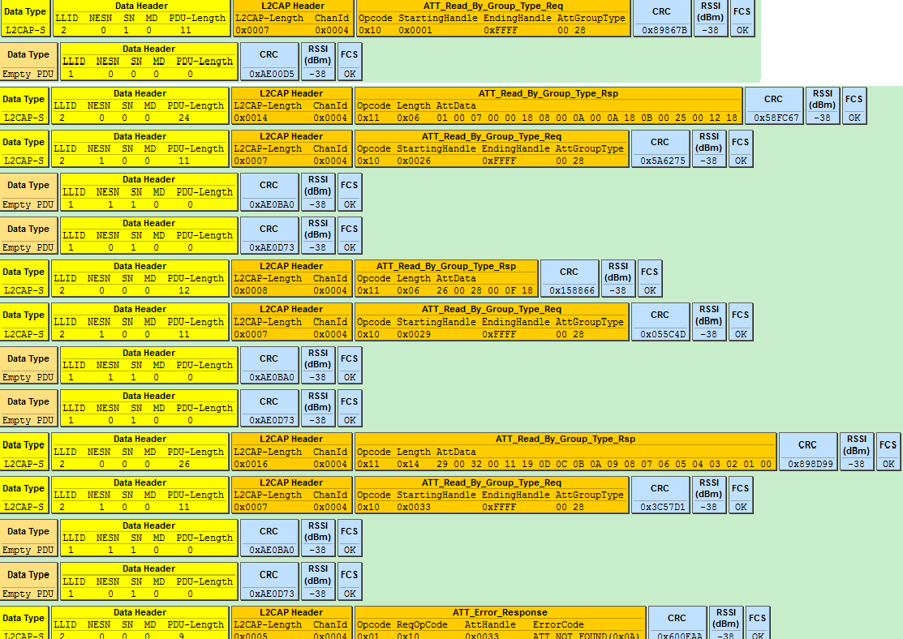

As shown above, Master requests from Slave for Attribute Group information of the “primaryServiceUUID” with UUID of 0x2800.

```C
#define GATT_UUID_PRIMARY_SERVICE        0x2800
const u16 my_primaryServiceUUID = GATT_UUID_PRIMARY_SERVICE;
```

The following groups in Slave Attribute Table meet the requirement according to current demo code.

a) Attribute Group with attHandle from 0x0001 to 0x0007,

&nbsp;Attribute Value is SERVICE_UUID_GENERIC_ACCESS (0x1800).

b) Attribute Group with attHandle from 0x0008 to 0x000a,

&nbsp;Attribute Value is SERVICE_UUID_DEVICE_INFORMATION (0x180A).

c) Attribute Group with attHandle from 0x000B to 0x0025,

&nbsp;Attribute Value is SERVICE_UUID_HUMAN_INTERFACE_DEVICE (0x1812).

d) Attribute Group with attHandle from 0x0026 to 0x0028,

&nbsp;Attribute Value is SERVICE_UUID_BATTERY (0x180F).

e) Attribute Group with attHandle from 0x0029 to 0x0032,

&nbsp;Attribute Value is TELINK_AUDIO_UUID_SERVICE(0x11,0x19,0x0d,0x0c,0x0b,0x0a,0x09,0x08,0x07,0x06,0x05,0x04,0x03,0x02,0x01,0x00).

Slave responds to Master with the attHandle and attValue information of the five Groups above via the “Read by Group Type Response” command. The final ATT_Error_Response indicates end of response. When Master receives this packet, it will stop sending “Read by Group Type Request”.

(2) Find by Type Value Request, Find by Type Value Response

Please refer to “Core_v5.0” (Vol 3/Part F/3.4.3.3 and 3.4.3.4) for details about the “Find by Type Value Request” and “Find by Type Value Response” commands. 

The “Find by Type Value Request” command sent by Master specifies starting and ending attHandle, as well as AttributeType and Attribute Value. After the request is received, Slave will check through current Attribute Table according to the specified starting and ending attHandle, and find the Attribute that matches the specified AttributeType and Attribute Value. Then Slave will respond to Master with the Attribute via the “Find by Type Value Response” command.

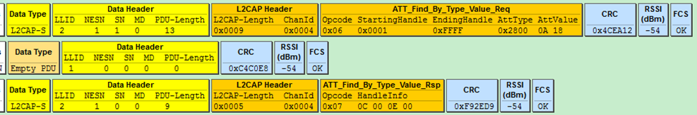

(3) Read by Type Request, Read by Type Response

Please refer to “Core_v5.0” (Vol 3/Part F/3.4.4.1 and 3.4.4.2) for details about the “Read by Type Request” and “Read by Type Response” commands. 

The “Read by Type Request” command sent by Master specifies starting and ending attHandle, as well as AttributeType. After the request is received, Slave will check through current Attribute Table according to the specified starting and ending attHandle, and find the Attribute that matches the specified AttributeType. Then Slave will respond to Master with the Attribute via the “Read by Type Response”. 

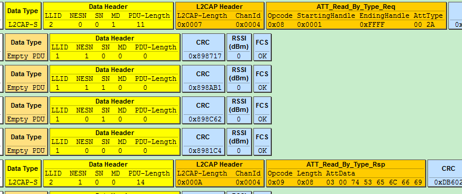

As shown above, Master reads the Attribute with attType of 0x2A00, i.e. the Attribute with Attribute Handle of 00 03 in Slave.

```C
const u8	my_devName [] = {'t', 'S', 'e', 'l', 'f', 'i'};
#define GATT_UUID_DEVICE_NAME            0x2a00
const u16 my_devNameUUID = GATT_UUID_DEVICE_NAME;
{0,1,2, sizeof (my_devName),(u8*)(&my_devNameUUID),(u8*)(my_devName), 0},
```

In the “Read by Type response”, attData length is 8, the first two bytes are current attHandle “0003”, followed by 6-byte Attribute Value. 

(4) Find information Request, Find information Response

Please refer to “Core_v5.0” (Vol 3/Part F/3.4.3.1 and 3.4.3.2) for details about the “Find information request” and “Find information response” commands.

The master sends a "Find information request", specifying the starting and ending attHandle. After receiving the command, the slave replies to the master through "Find information response" the UUIDs of all the starting and ending attHandle corresponding Attributes. As shown in the figure below, the master requires information of three Attributes with attHandle of 0x0016~0x0018, and Slave responds with corresponding UUIDs.

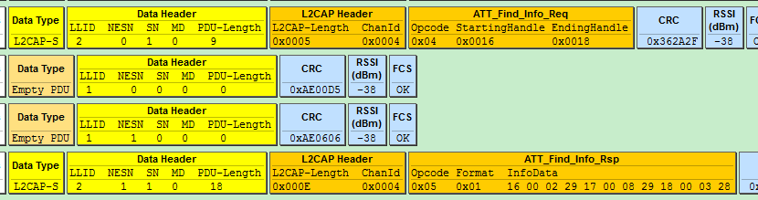

(5) Read Request, Read Response

Please refer to “Core_v5.0” (Vol 3/Part F/3.4.4.3 and 3.4.4.4) for details about the “Read Request” and “Read Response” commands.  

The “Read Request” command sent by Master specifies certain attHandle. After the request is received, Slave will respond to Master with the Attribute Value of the specified Attribute via the “Read Response” command (If the callback function r is set, this function will be executed), as shown below.

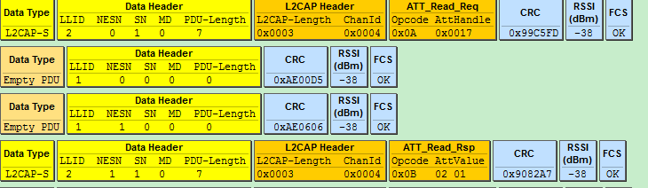

(6) Read Blob Request, Read Blob Response

Please refer to “Core_v5.0” (Vol 3/Part F/3.4.4.5 and 3.4.4.6) for details about the “Read Blob Request” and “Read Blob Response” commands.

If some Slave Attribute corresponds to Attribute Value with length exceeding MTU_SIZE (It’s set as 23 in current SDK), Master needs to read the Attribute Value via the “Read Blob Request” command, so that the Attribute Value can be sent in packets. This command specifies the attHandle and ValueOffset. After the request is received, Slave will find corresponding Attribute, and respond to Master with the Attribute Value via the “Read Blob Response” command according to the specified ValueOffset. (If the callback function r is set, this function will be executed.)

As shown below, when Master needs the HID report map of Slave (report map length largely exceeds 23), first Master sends “Read Request”, then Slave responds to Master with part of the report map data via “Read response”; Master sends “Read Blob Request”, and then Slave responds to Master with data via “Read Blob Response”.

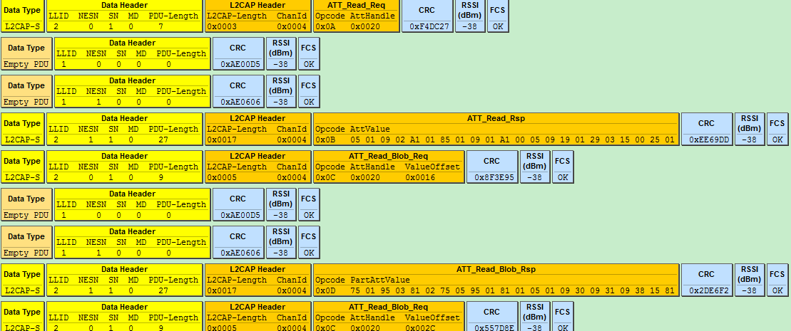

(7) Exchange MTU Request, Exchange MTU Response

Please refer to “Core_v5.0” (Vol 3/Part F/3.4.2.1 and 3.4.2.2) for details about the “Exchange MTU Request” and “Exchange MTU Response” commands.

As shown below, Master and Slave obtain MTU size of each other via the “Exchange MTU Request” and “Exchange MTU Response” commands.

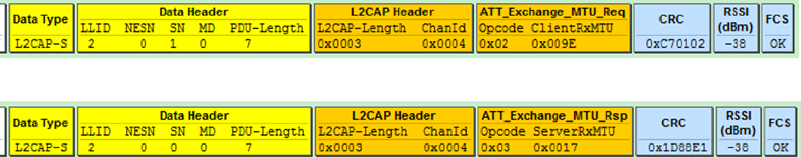

During data access process of Telink BLE Slave GATT layer, if there’s data exceeding a RF packet length, which involves packet assembly and disassembly in GATT layer, Slave and Master need to exchange RX MTU size of each other in advance. Transfer of long packet data in GATT layer can be implemented via MTU size exchange. In the Telink BLE SDK described in the previous section 3.2.8, when the slave end sets the Rx MTU size in the main function call blc_att_setRxMtuSize(), if the size is greater than 23, it will actively perform the upstream MTU and update the DLE.

a) User can register callback of GAP event (see section 3.3.5.2 GAP event) and enable the eventMask “GAP_EVT_MASK_ATT_EXCHANGE_MTU” to obtain EffectiveRxMTU.

```C
EffectiveRxMTU=min(ClientRxMTU, ServerRxMTU)。
```

The “GAP event” section of this document will introduce GAP event in detail.

b) Processing of long Rx packet data in Slave GATT layer

Slave ServerRxMTU is set as 23 by default. Actually maximum ServerRxMTU can reach 250, i.e. 250-byte packet data on Master can be correctly re-assembled on Slave. When it’s needed to use packet re-assembly of Master in an application, the API below should be invoked to modify RX size of Slave first.

```C
ble_sts_t   blc_att_setRxMtuSize(u16 mtu_size);
```

The return value is shown as below:

| ble_sts_t                  | Value                         | ERR Reason                         |
| :------------------------- | :---------------------------- | :----------------------------------|
|BLE_SUCCESS                 | 0                             | Add success                        |
|GATT_ERR_INVALID_ PARAMETER | See the definition in the SDK | mtu_size exceeds the max value 250.|

When Master GATT layer needs to send long packet data to Slave, Master will actively initiate “ATT_Exchange_MTU_req”, and Slave will respond with “ATT_Exchange_MTU_rsp”. “ServerRxMTU” is the configured value of the API “blc_att_setRxMtuSize”. If user has registered GAP event and enabled the eventMask “GAP_EVT_MASK_ATT_EXCHANGE_MTU”, “EffectiveRxMTU” and “ClientRxMTU” of Master can be obtained in the callback function of GAP event.

c) Processing of long Tx packet data in Slave GATT layer

When Slave needs to send long packet data in GATT layer, it should obtain Client RxMTU of Master first, and the eventual data length should not exceed ClientRxMTU. 

First Slave should invoke the API “blc_att_setRxMtuSize” to set its ServerRxMTU. Suppose it’s set as 158.

```C
blc_att_setRxMtuSize（158）;
```

Then the API below should be invoked to actively initiate an “ATT_Exchange_MTU_req”.

```C
ble_sts_t	 blc_att_requestMtuSizeExchange (u16 connHandle, u16 mtu_size);
```

“connHandle” is ID of Slave conection, i.e. “BLS_CONN_HANDLE”, while “mtu_size” is ServerRxMTU.

```C
blc_att_requestMtuSizeExchange(BLS_CONN_HANDLE,  158);
```

After the “ATT_Exchange_MTU_req” is received, Master will respond with “ATT_Exchange_MTU_rsp”. After receiving the response, the SDK will calculate EffectiveRxMTU. If user has registered GAP event and enabled the eventMask “GAP_EVT_MASK_ATT_EXCHANGE_MTU”, “EffectiveRxMTU” and “ClientRxMTU” will be reported to user. 

(8) Prepare Write Request

When User uses the Prepare Write command to transfer data, if the transferred data is larger than 260Bytes, the Slave end may receive incomplete data because the default Buffer size set by Telink BLE SDK stack is 260Bytes and the last 3 bytes are used to save other useful information. User can call API blc_att_setPrepareWriteBuffer to customize the required Buffer size for the actual application.

```C
void  	blc_att_setPrepareWriteBuffer(u8 *p, u16 len);
```

The parameter p is a pointer to the set buffer, len is the length of the set buffer.

(9) Write Request, Write Response

Please refer to “Core_v5.0” (Vol 3/Part F/3.4.5.1 and 3.4.5.2) for details about the “Write Request” and “Write Response” commands.
The “Write Request” command sent by Master specifies certain attHandle and attaches related data. After the request is received, Slave will find the specified Attribute, determine whether to process the data by using the callback function w or directly write the data into corresponding Attribute Value depending on whether the callback function w is set by user. Finally Slave will respond to Master via “Write Response”.

As shown in below, by sending “Write Request”, Master writes Attribute Value of 0x0001 to the Slave Attribute with the attHandle of 0x0016. Then Slave will execute the write operation and respond to Master via “Write Response”.

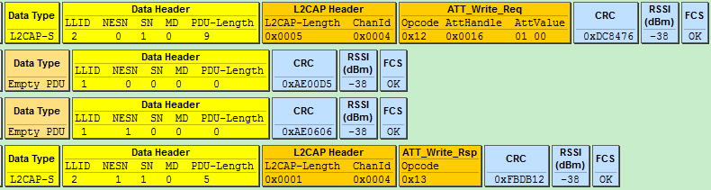

(10) Write Command

Please refer to “Core_v5.0” (Vol 3/Part F/3.4.5.3) for details about the “Write Command”. 
The “Write Command” sent by Master specifies certain attHandle and attaches related data. After the command is received, Slave will find the specified Attribute, determine whether to process the data by using the callback function w or directly write the data into corresponding Attribute Value depending on whether the callback function w is set by user. Slave won’t respond to Master with any information.

(11) Queued Writes

“Queued Writes” refers to ATT protocol including “Prepare Write Request/Response” and “Execute Write Request/Response”. Please refer to “Core_v5.0” (Vol 3/Part F/3.4.6/Queued Writes).

“Prepare Write Request” and “Execute Write Request” can implement the two functions below.

a) Provide write function for long attribute value.

b) Allow to write multiple values in an atomic operation that is executed seperately.

Similar to “Read_Blob_Req/Rsp”, “Prepare Write Request” contains AttHandle, ValueOffset and PartAttValue. That means Client can prepare multiple attribute values or various parts of a long attribute value in the queue. Thus, before executing the prepared queue indeed, Client can confirm that all parts of some attribute can be written into Server.

Note: Current SDK version only supports the write function of long attribute value with the maximum length not exceeding 244 bytes.

The figure below shows the case when Master writes a long character string “I am not sure what a new song” (byte number is far more than 23, and use the default MTU) into certain characteristic of Slave. First Master sends a “Prepare Write Request” with offset of 0x0000, to write the data “I am not sure what” into Slave, and Slave responds to Master with a “Prepare Write Response”. Then Master sends a “Prepare Write Request” with offset of 0x12, to write the data “ a new song” into Slave, and Slave responds to Master with a “Prepare Write Response”. After the write operation of the long attribute value is finished, Master sends an “Execute Write Request” to Slave. “Flags=1” indicates write result takes effect immediately. Then Slave responds with an “Execute Write Response” to complete the whole Prepare Write process.

As we can see, “Prepare Write Response” also contains AttHandle, ValueOffsetand PartAttValue in the request, so as to ensure reliable data transfer. Client can compare field value of Response with that of Request, to ensure correct reception of the prepared data.

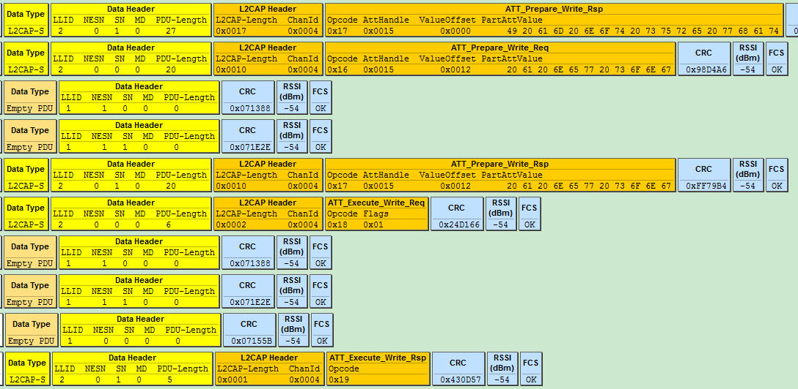

(12) Handle Value Notification

Please refer to “Core_v5.0” (Vol 3/Part F/3.4.7.1).

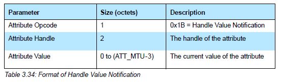

The figure above shows the format of “Handle Value Notification” in BLE Spec.

This BLE SDK supplies an API for Handle Value Notification of an Attribute. By invoking this API, user can push the notify data into bottom-layer BLE software fifo. Stack will push the data of software fifo into hardware fifo during the latest packet transfer interval, and finally send the data out via RF.

(13) Handle Value Indication

Please refer to “Core_v5.0” (Vol 3/Part F/3.4.7.2).

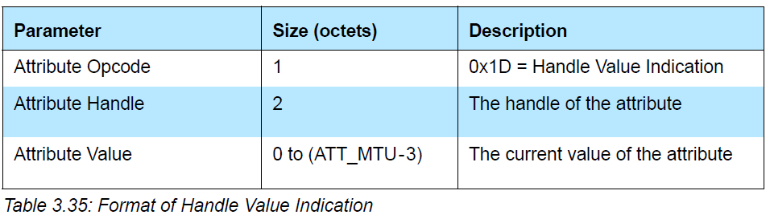

The figure above shows the format of “Handle Value Indication” in BLE Spec. 

This BLE SDK supplies an API for Handle Value Indication of an Attribute. By invoking this API, user can push the indicate data into bottom-layer BLE software fifo. Stack will push the data of software fifo into hardware fifo during the latest packet transfer interval, and finally send the data out via RF.

```C
ble_sts_t  blc_gatt_pushHandleValueIndicate (u16 connHandle, u16 attHandle, u8 *p, int len);
```

When calling this API, it is recommended that users check whether the return value is BLE_SUCCESS: 1. When in the pairing phase, the new API returns the value: SMP_ERR_PAIRING_BUSY; 2. When in the encryption phase, the new API returns the value: LL_ERR_ENCRYPTION_BUSY; 3. When len is greater than ATT_MTU-3 (3 is the ATT layer packet format length opcode and handle), it means that the data length PDU to be sent exceeds the maximum PDU length ATT_MTU supported by the ATT layer.

The first parameter connHandle is the connHandle of the corresponding GATT service, the second parameter attHandle is attHandle corresponding to Attribute, the third parameter “p” is the head pointer of successive memory data to be sent, and the fourth parameter “len” specifies byte number of data to be sent. Since this API supports auto packet disassembly based on EffectiveMaxTxOctets, long indicate data to be sent can be disassembled into multiple BLE RF packets, large “len” is supported. (EffectiveMaxTxOctets indicates the maximum RF TX octets to be sent in the Link Layer. Its default value is 27, and DLE may modify it. Another API as a replacement will be introduced later.)

As specified in BLE Spec, Slave won’t regard data indication as success until Master confirms the data, and the next indicate data won’t be sent until the previous data indication is successful.

When Link Layer is in Conn state, generally data will be successfully pushed into bottom-layer software FIFO by invoking this API; however, some special cases may result in invoking failure, and the return value “ble_sts_t” will indicate the corresponding error reason.

When this API is invoked in APP layer, it’s recommended to check whether the return value is “BLE_SUCCESS”. If the return value is not “BLE_SUCCESS”, a delay is needed to re-push the data. The return value is shown as below:

| ble_sts_t                                              | Value                         | ERR Reason                                                                  |
| :----------------------------------------------------- | :---------------------------- | :-------------------------------------------------------------------------- |
| BLE_SUCCESS                                            |  0                            | Add success                                                                 |
| LL_ERR_CONNECTION_NOT_ ESTABLISH                       | See the definition in the SDK |Link Layer is in None Conn state                                             |
| LL_ERR_ENCRYPTION_BUSY                                 | See the definition in the SDK |Data cannot be sent during pairing or encryption phase.                      |
| LL_ERR_TX_FIFO_NOT_ENOUGH                              | See the definition in the SDK |Since task with mass data is being executed, software Tx fifo is not enough. |
| GATT_ERR_DATA_PENDING_DUE _TO_SERVICE_DISCOVERY_BUSY   | See the definition in the SDK |Data cannot be sent during service discovery phase.                          |
| GATT_ERR_PREVIOUS_INDICATE_ DATA_HAS_NOT_CONFIRMED     | See the definition in the SDK |The previous indicate data has not been confirmed by Master.                 |

(14) Handle Value Confirmation

Please refer to “Core_v5.0” (Vol 3/Part F/3.4.7.3).

Whenever the API “bls_att_pushIndicateData” (or “blc_gatt_pushHandleValueIndicate”) is invoked by APP layer to send an indicate data to Master, Master will respond with “Confirmation” to confirm the data, then Slave can continue to send the next indicate data.

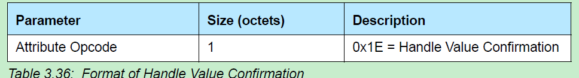

As shown above, “Confirmation” is not specific to indicate data of certain handle, and the same “Confirmation” will be responded irrespective of handle.

To enable the APP layer to know whether the indicate data has already been confirmed by Master, user can register the callback of GAP event (see section 3.3.5.2 GAP event), and enable corresponding eventMask “GAP_EVT_GATT_HANDLE_VLAUE_CONFIRM” to obtain Confirm event.

#### GATT Service Security

Before reading “GATT Service Security”, user can refer to section 3.3.4 SMP to learn basic knowledge related to SMP including LE pairing method, security level, and etc.

The figure below shows the mapping relationship of service request for GATT Service Security level given by BLE spec. Please refer to “core5.0” (Vol3/Part C/10.3 AUTHENTICATION PROCEDURE).

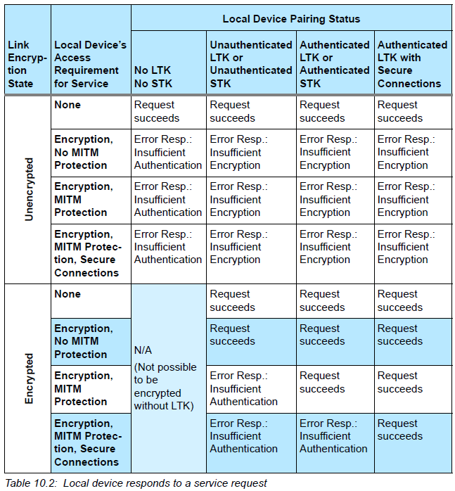

As shown in the figure above:

- The first column marks whether currently connected Slave device is in encryption state;

- The second column (local Device’s Access Requirement for service) is related to Permission Access setting for attributes in ATT table;

- The third column includes four sub-columns corresponding to four levels of LE secuiry mode1 for current device pairing state: 

a) No authentication and no encryption

b) Unauthenticated pairing with encryption

c) Authenticated pairing with encryption

d) Authenticated LE Secure Connections

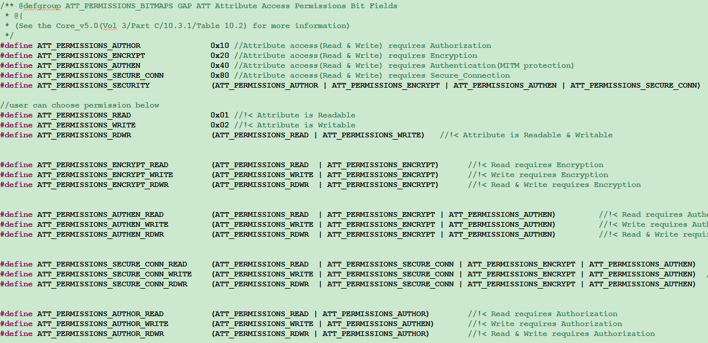

The final implementation of GATT Service Security is related to parameter settings during SMP initialization, including the highest security level, permission access of attributes in ATT table.

It is also related to Master, for example, suppose Slave sets the highest security level supported by SMP as “Authenticated pairing with encryption”, but the highest level supported by Master is “Unauthenticated pairing with encryption”; if the permission for some write attribute in ATT table is “ATT_PERMISSIONS_AUTHEN_WRITE”, when Master writes this attribute, an error will be responded to indicate “encryption level is not enough”.

User can set permission of attributes in ATT table to implement the application below:

Suppose the highest security level supported by Slave is “Unauthenticated pairing with encryption”, but it’s not hoped to trigger Master pairing by sending “Security Request” after connection, user can set the permission for CCC (Client Characteristic Configuration) attribute with nofity attribute as “ATT_PERMISSIONS_ENCRYPT_WRITE”. Only when Master writes the CCC, will Slave respond that security level is not enough and trigger Master to start pairing encryption.

**Note:**

> Security level set by user only indicates the highest security level supported by device, and GATT Service Secuiry can be used to realize control as long as ATT Permission does not exceed the highest level that takes effect indeed. For LE security mode1 level 4, if use only sets the level “Authenticated LE Secure Connections”, the setting supports LE Secure Connections only.

For the example of GATT security level, please refer to “B91_feature/feature_gatt_security/app.c”.

### SMP

Security Manager (SM) in BLE is mainly used to provide various encryption keys for LE device to ensure data security. Encrypted link can protect the original contents of data in the air from being intercepted, decoded or read by any attacker.
For details about the SMP, please refer to “Core_v5.0” (Vol 3/Part H/ Security Manager Specification).

#### SMP Security Level

BLE 4.2 Spec adds a new pairing method “LE Secure Connections” which further strengthens security. The pairing method in earlier version is called “LE legacy pairing”.

As shown in the section of GATT Service Security, local device supports pairing states below:

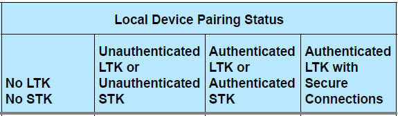

The four states correspond to the four levels of LE security mode1:

a) No authentication and no encryption (LE security mode1 level1)

b) Unauthenticated pairing with encryption (LE security mode1 level2)

c) Authenticated pairing with encryption (LE security mode1 level3)

d) Authenticated LE Secure Connections (LE security mode1 level4)

For more details, please refer to “Core_v5.0” (Vol 3//Part C/10.2 LE SECURITY MODES).

Note: Security level set by local device only indicates the highest security level that local device may reach. However, to reach the preset level indeed, the two factors below are important:

a) The supported highest security level set by peer Master device >= the supported highest security level set by local Slave device.

b) Both local device and peer device complete the whole pairing process (if pairing exsits) correctly as per the preset SMP parameters.

For example, even if the highest security level supported by Slave is set as “mode1 level3” (Authenticated pairing with encryption), when the highest security level supported by peer Master is set as “mode1 level1” (No authentication and no encryption), after connection Slave and Master won’t execute pairing, and indeed Slave uses security mode1 level 1.

User can use the API below to set the highest security level supported by SM:

```C
void blc_smp_setSecurityLevel(le_security_mode_level_t  mode_level);
```

Following shows the definition for the enum type le_security_mode_level_t:

```C
typedef enum {
	LE_Security_Mode_1_Level_1 = BIT(0),  		No_Authentication_No_Encryption	= BIT(0), No_Security = BIT(0),
	LE_Security_Mode_1_Level_2 = BIT(1),  		Unauthenticated_Paring_with_Encryption = BIT(1),
	LE_Security_Mode_1_Level_3 = BIT(2),    	Authenticated_Paring_with_Encryption = BIT(2),
	LE_Security_Mode_1_Level_4 = BIT(3),       Authenticated_LE_Secure_Connection_Paring_with_Encryption =BIT(3),
.....
}le_security_mode_level_t;
```

#### SMP Parameter Configuration

SMP parameter configuration In Telink BLE SDK is introduced according to the configuration of four SMP security levels.

For Slave, SMP function currently can support the highest security level “LE security mode1 level4”.

(1) LE security mode1 level1

Level 1 indicates device does not support encryption pairing. If it’s needed to disable SMP function, user only needs to invoke the function below during initialization:

```C
blc_smp_setSecurityLevel(No_Security);
```

It means the device won’t implement pairing encryption for current connection. Even if the peer requests for pairing encryption, the device will reject it. It generally applies to the device that does not support encryption pairing process.
As shown in the figure below, Master sends a pairing request, and Slave responds with “SM_Pairing_Failed”.

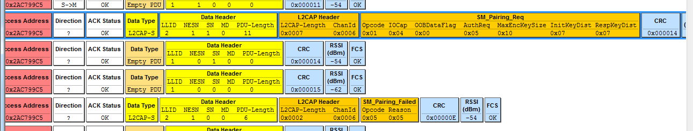

(2) LE security mode1 level2

Level 2 indicates device supports the highest security level “Unauthenticated_Paring_with_Encryption”, e.g. “Just Works” pairing mode in legacy pairing and secure connection pairing method.

A. As introduced earlier, SMP supports legacy encryption and secure connection pairing. The SDK provides the API below to set whether the new encryption feature in BLE4.2 is supported.

```C
void blc_smp_setParingMethods (paring_methods_t  method);
```

Following shows the definition for the enum type paring_methods_t:

```C
typedef enum {
	LE_Legacy_Paring     = 0,   // BLE 4.0/4.2
	LE_Secure_Connection = 1,   // BLE 4.2/5.0/5.1
}paring_methods_t;
```

B. When using security level other than LE security mode1 level1, the API below must be invoked to initialize SMP parameter configuration, including flash initialization setting of bonded area.

```C
int blc_smp_peripheral_init (void);
```

If only this API is invoked during initialization, the SDK will use default parameters to configure SMP:

- The highest security level supported by default: Unauthenticated_Paring_with_Encryption.

- Default bonding mode: Bondable_Mode (store KEY that is distributed after pairing encryption into flash).

- Default IO capability: IO_CAPABILITY_NO_INPUT_NO_OUTPUT.

The default parameters above follow the configuration of legacy pairing “Just Works” mode. Therefore invoking this API only is equivalent to configure LE security mode1 level2. LE security mode1 level2 has two types of setting:

A. Device supports initialization setting of “Just Works” in legacy pairing.

```C
blc_smp_peripheral_init();
```

B. Device supports initialization setting of “Just Works” in secure connections.

```C
blc_smp_setParingMethods(LE_Secure_Connection);
blc_smp_peripheral_init();
```

(3) LE security mode1 level3

Level 3 indicates device supports the highest security level “Authenticated pairing with encryption”, e.g. “Passkey Entry” / “Out of Band” in legacy pairing mode.

As required by this level, device should support Authentication, i.e. legal identity of two pairing sides should be ensured.

The three Authentication methods below are supported in BLE:

- Method 1 with involvement of user, e.g. device has button or display capability, so that one side can display TK, while the other side can input the same TK (e.g. Passkey Entry).

- Method 2: The two pairing sides can exchange information using the method of non-BLE RF transfer to implement pairing (e.g. Out of Band which transfers TK via NFC generally).

- Method 3: Use the TK negotiated and agreed by two device sides (e.g. Just Works with TK 0 used by two sides). Since this method is Unauthenticated, the security level of “Just Works” corresponds to LE security mode1 level2.

Authentication can ensure the legality of two pairing sides, and this protection method is called MITM (Man-in-the-Middle) protection.

A. Device with Authentication should set its MITM flag or OOB flag. The SDK provides the two APIs below to set MITM flag and OOB flag.

```C
void blc_smp_enableAuthMITM (int MITM_en);
void blc_smp_enableOobAuthentication (int OOB_en);
```

“MITM_en”/“OOB_en”: 1 - enable; 0 - disable.

B. As introduced earlier, SM provides three Authentication methods selectable depending on IO capability of two sides. The SDK provides the API below to set IO capability for current device.

```C
void blc_smp_setIoCapability (io_capability_t ioCapablility);
```

Following shows the definition for the enum type io_capability_t:

```C
typedef enum {
	IO_CAPABILITY_UNKNOWN = 0xff,
	IO_CAPABILITY_DISPLAY_ONLY = 0,
	IO_CAPABILITY_DISPLAY_YESNO = 1,
	IO_CAPABILITY_KEYBOARD_ONLY = 2,
	IO_CAPABILITY_NO_IN_NO_OUT = 3,
	IO_CAPABILITY_KEYBOARD_DISPLAY = 4,
} io_capability_t;
```

C. The figure below shows the rule to use MITM flag and OOB flag in legacy pairing mode.

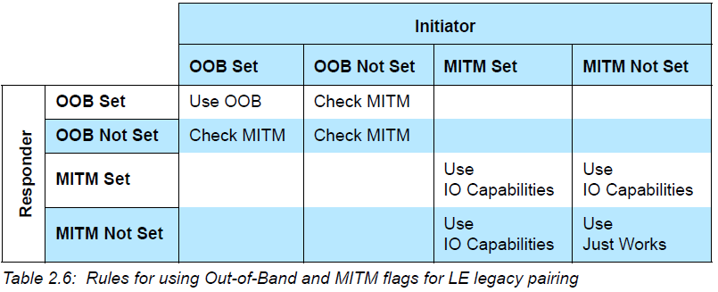

The OOB and MITM flag of local device and peer device will be checked to determine whether to use OOB method or select certain KEY generation method as per IO capability.

As shown in the figure below, the SDK will select different KEY generation methods according to IO capability (Row/Column parameter type io_capability_t):

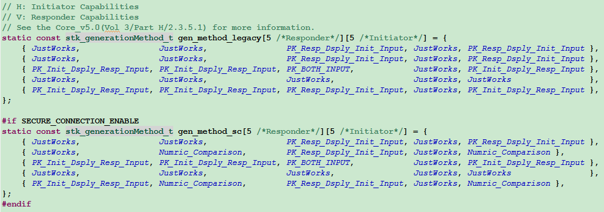

For details about the mapping relationship, please refer to “core5.0” (Vol3/Part H/2.3.5.1 Selecting Key Generation Method).

LE security mode1 level3 supports the methods below to configure initial values:

A. Initialization setting of OOB for device with legacy pairing:

```C
blc_smp_enableOobAuthentication(1);
blc_smp_peripheral_init();
```

Considering TK value transfer by OOB, the SDK provides related GAP event in the APP layer (see section 3.3.5.2 GAP event).

The API below serves to set TK value of OOB.

```C
void blc_smp_setTK_by_OOB (u8 *oobData);
```

The parameter “oobData” indicates the head pointer for the array of 16-digit TK value to be set.

B. Initialization setting of Passkey Entry (PK_Resp_Dsply_Init_Input) for device with legacy pairing:

```C
blc_smp_enableAuthMITM(1);
blc_smp_setIoCapability(IO_CAPABILITY_DISPLAY_ONLY);
blc_smp_peripheral_init();
```

C. Initialization setting of Passkey Entry (PK_Init_Dsply_Resp_Input or PK_BOTH_INPUT) for device with legacy pairing:

```C
blc_smp_enableAuthMITM(1);
blc_smp_setIoCapability(IO_CAPABLITY_KEYBOARD_ONLY);
blc_smp_peripheral_init();
```

Considering TK value input by user, the SDK provides related GAP event in the APP layer (see section 3.3.5.2 GAP event).
The API below serves to set TK value of Passkey Entry:

```C
void blc_smp_setTK_by_PasskeyEntry (u32 pinCodeInput);
```

The parameter “pinCodeInput” indicates the pincode value to be set and its range is 0~999999. It applies to the case of Passkey Entry method in which Master displays TK and Slave needs to input TK.

KEY generation method finally adopted is related to SMP security level supported by two pairing sides. If Master only supports LE security mode1 level1, since Master does not support pairing encryption, Slave won’t enable SMP function.

(4) LE security mode1 level4

Level 4 indicates device supports the highest security level “Authenticated LE Secure Connections”, e.g. Numeric Comparison/Passkey Entry/Out of Band in secure connection pairing mode.

LE security mode1 level4 supports the methods below to configure initial values:

A. Initialization setting of Numeric Comparison for device with secure connection pairing:

```C
blc_smp_setParingMethods(LE_Secure_Connection);
blc_smp_enableAuthMITM(1);
blc_smp_setIoCapability(IO_CAPABLITY_DISPLAY_YESNO);
```

Considering display of numerical comparison result to user, the SDK provides related GAP event in the APP layer (see section 3.3.5.2 GAP event).
The API below serves to set numerical comparison result as “YES” or “NO”.

```C
void blc_smp_setNumericComparisonResult(bool YES_or_NO);
```

The parameter “YES_or_NO” serves to confirm whether six-digit values on two sides are consistent. If yes, input 1 to indicate “YES”; otherwise input 0 to indicate “NO”.

B. Initialization setting of Passkey Entry for device with secure connection pairing:

User initialization code of this part is almost the same with that of the configuration mode B/C (Passkey Entry in legacy pairing) in LE security mode1 level3, except that pairing method herein should be set as “secure connection pairing” at the start of initialization.

```C
blc_smp_setParingMethods(LE_Secure_Connection);
.....//Refer to configuration method B/C in LE security mode1 level3
```

C. Initialization setting of Out of Band for device with secure connection pairing:

This part is not implemented in current SDK yet.

(5) Several APIs related to SMP parameter configuration:

A. The API below serves to set whether to enable bonding function:

```C
void blc_smp_setBondingMode(bonding_mode_t mode);
```

Following shows the enum type bonding_mode_t:

```C
typedef enum {
	Non_Bondable_Mode = 0,
	Bondable_Mode     = 1,
}bonding_mode_t;
```

For device with security level other than mode1 level1, bonding function must be enabled. Since the SDK has enabled bonding function by default, generally user does not need to invoke this API.

B. The API below serves to set whether to enable Key Press function:

```C
void blc_smp_enableKeypress (int keyPress_en);
```

It indicates whether it’s supported to provide some necessary input status information for KeyboardOnly device during Passkey Entry. Since the current SDK does not support this function yet, the parameter must be set as 0.

C. The API below serves to set whether to enable key pairs for ECDH (Elliptic Curve Diffie-Hellman) debug mode:

```C
void blc_smp_setEcdhDebugMode(ecdh_keys_mode_t mode);
```

Following shows the definition for the enum type ecdh_keys_mode_t:

```C
typedef enum {
	non_debug_mode = 0,//ECDH distribute private/public key pairs
	debug_mode = 1,//ECDH use debug mode private/public key pairs
} ecdh_keys_mode_t;
```

This API only applies to the case with secure connection pairing. The ellipse encryption algorithm can prevent eavesdropping effectively, but at the same time, it’s not very friendly to debugging and development, since user cannot capture BLE packet in the air by sniffer and analyze the data. Thus, as defined in BLE spec, ellipse encryption mode with private and public key pairs is provided for debugging. As long as this mode is enabled, BLE sniffer tool can use the known key to decrypt the link.

D. Following is a unified API to set whether to enable bonding, whether to enable MITM flag, whether to support OOB, whether to support Keypress notification, as well as to set supported IO capability(The previous documents are all separate configuration APIs. For the convenience of user settings, the SDK also provides a unified configuration API).

```C
void blc_smp_setSecurityParameters (bonding_mode_t mode,int MITM_en,int OOB_en, int keyPress_en,
io_capability_t ioCapablility);
```

Definition for each parameter herein is consistent with the same parameter in the corresponding independent API.

#### SMP Security Request Configuration

Only Slave can send SMP Security Request, so this part only applies to Slave device.

During phase 1 of pairing process, there’s an optional Security Request packet which serves to enable Slave to actively trigger pairing process to start. 
The SDK provides the API below to flexibly set whether Slave sends Security Request to Master immediately after connection/re-connection, or delay for pending_ms miliseconds before sending Security Request, or does not send Security Request, so as to implement different pairing trigger combination. 

```C
blc_smp_configSecurityRequestSending( secReq_cfg newConn_cfg, secReq_cfg reConn_cfg, u16 pending_ms);
```

Following shows the definition for the enum type secReq_cfg:

```C
typedef enum {
	 SecReq_NOT_SEND = 0,
SecReq_IMM_SEND = BIT(0),
	SecReq_PEND_SEND = BIT(1),
}secReq_cfg;
```

- SecReq_NOT_SEND: After connection is established, Slave won’t send Security Request actively.

- SecReq_IMM_SEND: After connection is established, Slave will send Security Request immediately.

- SecReq_PEND_SEND: After connection is established, Slave will wait for pending_ms miliseconds and then determine whether to send Security Request. 

(1) For the first connection, Slave receives Pairing_request from Master before pending_ms miliseconds, and it won’t send Security Request;

(2) For re-connection, if Master has already sent LL_ENC_REQ before pending_ms miliseconds to encrypt reconnection link, Slave won’t send Security Request.

The parameter “newConn_cfg” serves to configure new device, while the parameter “reConn_cfg” serves to configure device to be reconnected.
During reconnection, the SDK also supports the configuration whether to send purpose of pairing request: During reconnection for a bonded device, Master may not actively initiate LL_ENC_REQ to encrypt link, and Security Request sent by Slave will trigger Master to actively enrypt the link. Therefore, the SDK provides reConn_cfg configuration, and user can configure it as needed.

Note: This API must be invoked before connection. It’s recommended to invoke it during initialization.

The input parameters for the API “blc_smp_configSecurityRequestSending” supports the nine combinations below:

Table: Input parameter combination

-----------------------------------------------------------------------------------------------------------------------------------------------------------------------------
Parameter              SecReq_NOT_SEND                                  SecReq_IMM_SEND                                   SecReq_PEND_SEND
---------------------- ------------------------------------------------ ------------------------------------------------- ---------------------------------------------------
SecReq_NOT _SEND       Not send SecReq after the first connection or    Not send ecReq after the first connection, and    Not send ecReq after the first connection, and 
				       reconnection (the para pending_ms is invalid).   immediately send SecReq after reconnection 		  wait for pending_ms miliseconds to send SecReq 
				                                                        (the para pending_ms is invalid).				  after reconnection.

SecReq_IMM _SEND       Immediately send SecReq after the first          Immediately send SecReq after the first           Immediately send SecReq after the first connection 
				       connection, and not send SecReq after            connection or reconnection (the para              and wait for pending_ms miliseconds to send SecReq 
				       reconnection (the para pending_ms is invalid).	pending_ms is invalid).  						  after reconnection.

SecReq_ PEND_SEND      Wait for pending_ms miliseconds to send SecReq   Wait for pending_ms miliseconds to send SecReq    Wait for pending_ms miliseconds to send SecReq                                 
				       after the first connection, and not send         after the first connection, and immediately 	  after the first connection or reconnection.
				       SecReq after reconnection.						send SecReq after reconnection.
----------------------------------------------------------------------------------------------------------------------------------------------------------------------------

Following shows two examples:

(1) newConn_cfg: SecReq_NOT_SEND

&nbsp;reConn_cfg: SecReq_NOT_SEND

&nbsp;pending_ms: This parameter does not take effect.

When newConn_cfg is set as SecReq_NOT_SEND, it means new Slave device won’t actively initiate Security Request, and it will only respond to the pairing request from the peer device. If the peer device does not send pairing request, encryption pairing won’t be executed. As shown in the figure below, when Master sends a pairing request packet “SM_Pairing_Req”, Slave will respond to it, but won’t actively trigger Master to initiate pairing request.

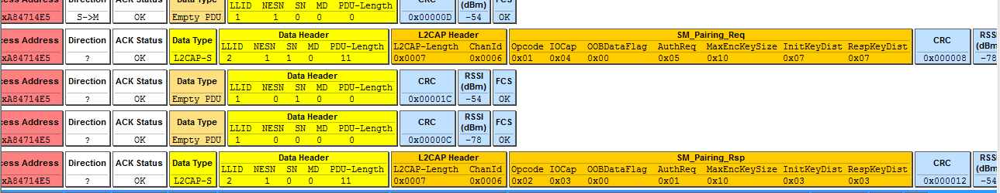

When reConn_cfg is set as SecReq_NOT_SEND, it means device pairing has already been completed, and Slave won’t send Security Reqeust after reconnection. 

(2) newConn_cfg: SecReq_IMM_SEND

&nbsp;reConn_cfg: SecReq_NOT_SEND

&nbsp;pending_ms: This parameter does not take effect.

When newConn_cfg is set as SecReq_IMM_SEND, it means new Slave device will immediately send Security Request to Master after connection, to trigger Master to start pairing process.

As shown in the figure below, Slave actively sends a SM_Security_Req to trigger Master to send pairing request.

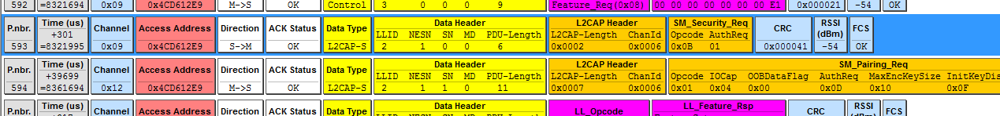

When reConn_cfg is set as SecReq_NOT_SEND, it means Slave won’t send Security Reqeust after reconnection.

The SDK also provides an API to send Security Request packet only for special use case. The APP layer can invoke this API to send Security Request at any time.

```C
int blc_smp_sendSecurityRequest (void);
```

Note: If user invokes the “blc_smp_configSecurityRequestSending” to control secure pairing request packet, the “blc_smp_sendSecurityRequest” should not be invoked.

#### SMP Bonding info

SMP bonding information herein is discussed relative to Slave device. User can refer to the code of "direct advertising" setting during initialization in the SDK demo "feature_gatt_security/feature_smp_security".

Slave can store pairing information of up to four Master devices at the same time, so that all of the four devices can be reconnected successfully.
The API below serves to set the max number of bonding devices with the upper limit of 4  which is also the default value.

```C
ble_sts_t blc_smp_param_setBondingDeviceMaxNumber( int device_num);
```

If using blc_smp_param_setBondingDeviceMaxNumber (4) to set the max number as 4, after four devices have been paired, excuting pairing for the fifth device will automatically delete the pairing info of the earliest connected (first) device, so as to store the pairing info of the fifth device.

If using blc_smp_param_setBondingDeviceMaxNumber (2) to set the max number as 2, after two devices have been paired, excuting pairing for the third device will automatically delete the pairing info of the earliest connected (first) device, so as to store the pairing info of the third device.

The API below serves to obtain the number of currently bonded Master devices (successfully paired with Slave) stored in the flash.

```C
u8 blc_smp_param_getCurrentBondingDeviceNumber(void);
```

(1) Storage sequence for bonding info

Index is a concept related to BondingDeviceNumber. If current BondingDeviceNumber is 1, there’s only one bonding device whose index is 0; if BondingDeviceNumber is 2, there’re two bonding devices with index 0 and 1.

The SDK provides two methods to update device index, Index_Update_by_Connect_Order and Index_Update_by_Pairing_Order, i.e. update index as per the time sequence of lastest connection or pairing for devices.

The API below serves to select index update method.

```C
void	bls_smp_setIndexUpdateMethod(index_updateMethod_t method);
```

Following shows the enum type index_updateMethod_t:

```C
typedef enum {
	Index_Update_by_Pairing_Order = 0,     //default value
	Index_Update_by_Connect_Order = 1,
} index_updateMethod_t;
```

Two index update methods are introduced below:

A. Index_Update_by_Connect_Order

If BondingDeviceNumber is 2, device index stored in Slave flash includes 0 and 1. Index sequence is updated by the order of the latest successful connection rather than the latest pairing. Suppose Slave is paired with MasterA and MasterB in sequence, since MasterB is the latest connected device, the index for MasterA is 0, while the index for MasterB is 1. Then reconnect Slave with MasterA. Now MasterA becomes the latest connected device, so the index for MasterB is 0, and the index for MasterA is 1.

If BondingDeviceNumber is 3, device index includes 0, 1 and 2. The index for the latest connected device is 2, and index for the earliest connected device is 0.

If BondingDeviceNumber is 4, device index includes 0, 1, 2 and 3. The index for the latest connected device is 3, and index for the earliest connected device is 0. Suppose Slave is paired with MasterA, MasterB, MasterC and MasterD in sequence, the index for the latest connected MasterD is 3. If Slave is reconnected with MasterB, the index for the latest connected MasterB is 3.

Since the upper limit for bonding devices is 4, please note the case when more than four Master devices are paired: When Slave is paired with MasterA, MasterB, MasterC and MasterD in sequence, pairing Slave with MasterE will make Slave delete the pairing info for MasterA; however, if Slave is reconnected with MasterA before pairing Slave with MasterE, since the sequence changes to B-C-D-A, the latest pairing operation between Slave and MasterE will delete the pairing info for MasterB. 

B. Index_Update_by_Pairing_Order

If BondingDeviceNumber is 2, device index stored in Slave flash includes 0 and 1. Index sequence is updated by the order of the latest pairing. Suppose Slave is paired with MasterA and MasterB in sequence, since MasterB is the latest paired device, the index for MasterA is 0, while the index for MasterB is 1. Then reconnect Slave with MasterA. Now the index sequence for MasterA and MasterB is not changed.

If BondingDeviceNumber is 4, device index includes 0, 1, 2 and 3. The index for the latest paired device is 3, and the index for the earliest paired device is 0. Suppose Slave is paired with MasterA, MasterB, MasterC and MasterD in sequence, the index for the latest paired MasterD is 3. No matter how Slave is reconnected with MasterA/B/C/D, the index sequence won’t be changed.

Note: When Slave is paired with MasterA, MasterB, MasterC and MasterD in sequence, pairing Slave with MasterE will make Slave delete the pairing info for MasterA; if Slave is reconnected with MasterA before pairing Slave with MasterE, since the sequence is still A-B-C-D, the latest pairing operation between Slave and MasterE will delete the pairing info for MasterA.

(2) Format for bonding info and related APIs

Bonding info of Master device is stored in flash with the format below:

```C
typedef struct { 
	u8		flag;
	u8		peer_addr_type;  //address used in link layer connection
	u8		peer_addr[6];
	u8 		peer_key_size;
	u8		peer_id_adrType; //peer identity address information in key distribution, used to identify
	u8		peer_id_addr[6];
	u8 		own_ltk[16];      //own_ltk[16]
	u8		peer_irk[16];
	u8		peer_csrk[16];
}smp_param_save_t;
```

Bonding info includes 64 bytes.

- peer_addr_type and peer_addr indicate Master connection address in the Link Layer which is used during device direct advertising.

- peer_id_adrType/peer_id_addr and peer_irk are identity address and irk declared in the key distribution phase.

Only when the peer_addr_type and peer_addr are Resolvable Private Address (RPA), and address filtering is needed, should related info be added into resolving list for Slave to analyze it (refer to TEST_WHITELIST in the B91_feature_test).
Other parameters are negligible to user.

The API below serves to obtain device information from flash by using index.

```C
u32  bls_smp_param_loadByIndex(u8 index, smp_param_save_t* smp_param_load);
```

If the return value is 0, it indicates failure to get info; non-zero return value indicates starting flash address to store the info. 
For example, suppose there’re three bonded devices, user can invoke the

```C
bls_smp_param_loadByIndex(2， …)
```

to get related info of the latest device.
The API below serves to obtain bonding device info from flash by using Master address (connection address in the Link Layer).

```C
u32  bls_smp_param_loadByAddr(u8 addr_type, u8* addr, smp_param_save_t* smp_param_load);
```

If the return value is 0, it indicates failure to get info; non-zero return value indicates starting flash address to store the info. 

The API below is used for Slave device to erase all pairing info stored in local flash.

```C
void	bls_smp_eraseAllParingInformation(void);
```

Note: Before invoking this API, please ensure the device is in non-connection state.

The API below is used for Slave device to configure address to store pairing info in flash.

```C
void bls_smp_configParingSecurityInfoStorageAddr(int addr);
```

User can set the parameter “addr” as needed, and please refer to the section 2.1.4 SDK flash space partition so as to determine a suitable flash area for bonding info storage.

(1) Non-standard self-defined pairing management (set the macro “BLE_HOST_SMP_ENABLE” as 0)

When using self-defined pairing management, initialization related APIs are shown as below:

```C
blc_smp_setSecurityLevel(No_Security);//disable SMP function
user_master_host_pairing_flash_init();//custom method
```

A. Design flash storage method
The default flash sector used for pairing is 0x78000 ~ 0x78FFF, and it’s modifiable in the “app_config.h”.

```C
#define FLASH_ADR_PAIRING   0x78000
```

Starting from flash address 0x78000, every eight bytes form an area (named 8 bytes area). Each area can store MAC address of one Slave, and includes 1-byte bonding mark, 1-byte address type and 6-byte MAC address.

```C
typedef struct {
	u8 bond_mark;
	u8 adr_type;
	u8 address[6];
} macAddr_t;
```

All valid Slave MAC addresses are stored in 8 bytes areas successively:
The first valid Slave MAC address is stored in 0x78000~0x78007, and the mark in 0x78000 is set as “0x5A” to indicate current address is valid. The second valid Slave MAC address is stored in the next 8 bytes area 0x78008~ 0x7800f and the mark in 0x78008 is set as “0x5A”.The third valid Slave MAC address is stored in the next 8 bytes area 0x78010~ 0x78017 and the mark in 0x78010 is set as “0x5A”. 

To un-pair certain Slave device, it’s needed to erase its MAC address in the Dongle side by setting the mark of the corresponding 8 bytes area as “0x00”. For example, to erase the MAC addres of the first Slave device as shown above, user should set 0x78000 as “0x00”.

The reason to adopt this design is: During execution of program, the SDK cannot invoke the function “flash_erase_sector” to erash flash, since this operation takes 20~200ms to erase a 4kB sector of flash and thus will result in BLE timing error.

Mark of “0x5A” and “0x00” are used to indicate pairing storage and un-pairing erasing of all Slave MAC addresses.  
Considering 8 bytes areas may occupy the whole 4kB sector of flash and thus result in error, a special processing is added during initialization: Read info of 8 bytes areas starting from address 0x78000, and store all valid MAC addresses into Slave MAC table of RAM. During this process, it will check whether there’re too many 8 bytes areas. If yes, erase the whole sector and then write the contents of Slave MAC table in RAM back to 8 bytes areas starting from 0x78000.

B. Slave mac table

```C
#define	USER_PAIR_SLAVE_MAX_NUM     4  //telink demo use max 4, you can change this value
typedef struct {
	u8 bond_mark;
	u8 adr_type;
	u8 address[6];
} macAddr_t;
typedef struct {
	u32 bond_flash_idx[USER_PAIR_SLAVE_MAX_NUM];  //mark paired slave mac address in flash
	macAddr_t bond_device[USER_PAIR_SLAVE_MAX_NUM];  //macAddr_t alreay defined in ble stack
	u8 curNum;
} user_salveMac_t;
user_salveMac_t user_tbl_slaveMac;
```

The structure above serves to use Slave MAC table in RAM to maintain all paired devices.

The macro “USER_PAIR_SLAVE_MAX_NUM” serves to set the max allowed number of maintainable paired devices, and the default value is 4 which indicates four paired device is maintainable. User can modify this value as needed.

Suppose the “USER_PAIR_SLAVE_MAX_NUM” is set as 3 to indicate up to three paired devices can be maintained. In the “user_tbl_slaveMac”, the “curNum” indicates the number of current valid Slave devices in flash, the array “bond_flash_idx” records offset relative to 0x78000 for starting address of each valid 8 bytes area in flash (When un-pairing certain device, based on corresponding offset, user can locate the mark of the 8 bytes area, and then write the mark as 0x00), while the array “bond_device” records MAC address.

C. Related APIs

Based on the design of flash storage and Slave MAC table above, user can invoke the APIs below.

a) user_master_host_pairing_flash_init

```C
void	user_master_host_pairing_flash_init(void);
```

This API should be invoked to implement flash initialization when enabling user-defined pairing management.

b) user_tbl_slave_mac_add

```C
int user_tbl_slave_mac_add(u8 adr_type, u8 *adr);
```

The API above should be invoked when a new device is paired, and it serves to add one Slave MAC address. The return value should be either 1 (success) or 0 (failure).

The API will check whether current number of devices in flash and Slave MAC table has reached the maximum. If not, directly add the MAC address of the new device into Slave MAC table, and store it in an 8 bytes area of flash. If yes, the viable processing policy may be: “pairing is not allowed”, or “directly delete the earliest MAC address”. Telink demos adopts the latter. Since Telink supported max number of paired device is 1, this method will preempt current paired device, i.e. delete current device by using the “user_tbl_slave_mac_delete_by_index(0)” and then add MAC address of new device into Slave MAC table.User can modify the implementation of this API as per his own policy.

c) user_tbl_slave_mac_search

```C
int user_tbl_slave_mac_search(u8 adr_type, u8 * adr)
```

This API serves to check whether the device is already available in Slave MAC table according to device address reported by adv, i.e. whether the device sending adv packet currently has already been paired with Master. The device that has already been paired can be directly reconnected.

d) user_tbl_slave_mac_delete_by_adr

```C
int user_tbl_slave_mac_delete_by_adr(u8 adr_type, u8 *adr)
```

This API serves to delete MAC addr of certain paired device from Slave MAC table by specified address.

e) user_tbl_slave_mac_delete_by_index

```C
void user_tbl_slave_mac_delete_by_index(int index)
```

This API serves to delete MAC addr of certain paired device from Slave MAC table by specified index.
The parameter “index” indicates device pairing sequence. If the max pairing number is 1, the index for the paired device is always 0; if the max pairing number is 2, the index for the first paired device is 0, and the index for the second paired device is 1……

f) user_tbl_slave_mac_delete_all

```C
void user_tbl_slave_mac_delete_all(void)
```

This API serves to delete MAC addr of all the paired devices from Slave MAC table.

g) user_tbl_salve_mac_unpair_proc

```C
void user_tbl_salve_mac_unpair_proc(void)
```

This API serves to process un-pairing. The demo code adopts the processing method using the default max pairing number (1) to delete all paired devices. User can modify the implementation of the API.

D. Connection and pairing

When Master receives adv packet reported by Controller, it will establish connection with Slave in the two cases below:
Invoke the function “user_tbl_slave_mac_search” to check whether current Slave device has already been paired with Master and un-pairing has not been executed. If yes, Master can automatically establish connection with the device.

```C
master_auto_connect = user_tbl_slave_mac_search(pa->adr_type, pa->mac);
if(master_auto_connect) { create connection }
```

If current adv device is not available in Slave MAC table, auto connection won’t be initiated, and it’s needed to check whether manual pairing condition is met. The SDK provides two manual pairing solutions by default.

Premise: Current adv device is close enough.

Solution 1: The pairing button on Master Dongle is pressed.

Solution 2: Current adv data is pairing adv packet data defined by Telink.

```C
//manual paring methods 1: button triggers
user_manual_paring = dongle_pairing_enable && (rssi > -56);  //button trigger pairing(rssi threshold, short distance)
//manual paring methods 2: special paring adv data
if(!user_manual_paring){  //special adv pair data can also trigger pairing
user_manual_paring = (memcmp(pa->data,telink_adv_trigger_paring,sizeof(telink_adv_trigger_paring)) == 0)
&& (rssi > -56);
}
if(user_manual_paring) { create connection }
```

After connection triggered by manual pairing is established successfully, the current device is added into Slave MAC table when reporting “HCI LE CONECTION ESTABLISHED EVENT”.

```C
//manual paring, device match, add this device to slave mac table
if(blm_manPair.manual_pair  &&  blm_manPair.mac_type == pCon->peer_adr_type  &&
  !memcmp(blm_manPair.mac,pCon->mac, 6))
{
	blm_manPair.manual_pair = 0; 
	user_tbl_slave_mac_add(pCon->peer_adr_type, pCon->mac);
}
```

E. Un-pairing

```C
_attribute_ram_code_void host_pair_unpair_proc (void) 
{
	//terminate and unpair proc
	static int master_disconnect_flag;
	if(dongle_unpair_enable){
		if(!master_disconnect_flag && blc_ll_getCurrentState() == BLS_LINK_STATE_CONN){
if( blm_ll_disconnect(cur_conn_device.conn_handle, HCI_ERR_REMOTE_USER_TERM_CONN)  == 
BLE_SUCCESS){
				master_disconnect_flag = 1;
				dongle_unpair_enable = 0;

				#if (BLE_HOST_SMP_ENABLE)
					tbl_bond_slave_unpair_proc(cur_conn_device.mac_adrType, cur_conn_device.mac_addr); 
				#else
					user_tbl_salve_mac_unpair_proc();
				#endif
			}
		}
	}
	if(master_disconnect_flag && blc_ll_getCurrentState() != BLS_LINK_STATE_CONN){
		master_disconnect_flag = 0;
	}
}
```

As shown in the code above, when un-pairing condition is triggered, Master first invokes the “blm_ll_disconnect” to terminate connection, and then invokes the “user_tbl_salve_mac_unpair_proc” to process un-pairing. The demo code will directly delete all paired devices. In the default case, the max pairing number is 1, so only one device will be deleted. If user sets the max number larger than 1, the “user_tbl_slave_mac_delete_by_adr” or “user_tbl_slave_mac_delete_by_index” should be invoked to delete specified device.

The demo code provides two conditions to trigger un-pairing:

- The un-pairing button on Master Dongle is pressed.

- The un-pairing key value “0xFF” is received in “HID keyboard report service”.

User can modify un-pairing trigger method as needed.

### GAP

#### GAP Initialization

GAP initialization for Master and Slave is different. Slave uses the API below to initialize GAP.

```C
void blc_gap_peripheral_init(void);
```

As introduced earlier, data transfer between the APP layer and the Host is not controlled via GAP; the ATT, SMP and L2CAP can directly communicate with the APP layer via corresponding interface. In current SDK version, the GAP layer mainly serves to process events in the Host layer, and GAP initialization mainly registers processing function entry for events in the Host layer.

#### GAP Event

GAP event is generated during the communication process of Host protocol layers such as ATT, GATT, SMP and GAP. As introduced earlier, current SDK supports two types of event: Controller event, and GAP (Host) event. Controller event also includes two sub types: HCI event, and Telink defined event.

GAP event processing is added in current BLE SDK, which enables the protocol stack to layer events more clearly and to process event communication in the user layer more conveniently. SMP related processing, such as Passkey input and notification of pairing result to user, is also included.

If user wants to receive GAP event in the APP layer, it’s needed to register the corresponding callback function, and then enable the corresponding mask.

Following shows the prototype and register interface for callback function of GAP event.

```C
typedef int (*gap_event_handler_t) (u32 h, u8 *para, int n);
void blc_gap_registerHostEventHandler (gap_event_handler_t  handler);
```

The “u32 h” in the callback function prototype is the mark of GAP event which will be frequently used in the bottom layer protocol stack. 
Following lists some events which user may use.

```C
#define GAP_EVT_SMP_PAIRING_BEAGIN	                0
#define GAP_EVT_SMP_PAIRING_SUCCESS		            1
#define GAP_EVT_SMP_PAIRING_FAIL			        2
#define GAP_EVT_SMP_CONN_ENCRYPTION_DONE			3
#define GAP_EVT_SMP_SECURITY_PROCESS_DONE			4
#define GAP_EVT_SMP_TK_DISPALY			            8
#define GAP_EVT_SMP_TK_REQUEST_PASSKEY				9
#define GAP_EVT_SMP_TK_REQUEST_OOB					10
#define GAP_EVT_SMP_TK_NUMERIC_COMPARE				11
#define GAP_EVT_ATT_EXCHANGE_MTU					16
#define GAP_EVT_GATT_HANDLE_VLAUE_CONFIRM			17
```

In the callback function prototype, “para” and “n” indicate data and data length of event. User can refer to the usage below in the “B91 feature/feature_smp_security/app.c” and the implementation of the function “app_host_event_callback”.

```C
blc_gap_registerHostEventHandler( app_host_event_callback ); 
```

The API below serves to enable the mask for GAP event.

```C
void blc_gap_setEventMask(u32 evtMask);
```

Following lists the definition for some common eventMasks. For other event masks, user can refer to the “ble/gap/gap_event.h”.

```C
#define GAP_EVT_MASK_SMP_PAIRING_BEAGIN             (1<<GAP_EVT_SMP_PAIRING_BEAGIN)
#define GAP_EVT_MASK_SMP_PAIRING_SUCCESS            (1<<GAP_EVT_SMP_PAIRING_SUCCESS)
#define GAP_EVT_MASK_SMP_PAIRING_FAIL               (1<<GAP_EVT_SMP_PAIRING_FAIL)
#define GAP_EVT_MASK_SMP_CONN_ENCRYPTION_DONE       (1<<GAP_EVT_SMP_CONN_ENCRYPTION_DONE)
#define GAP_EVT_MASK_SMP_SECURITY_PROCESS_DONE      (1<<GAP_EVT_SMP_SECURITY_PROCESS_DONE)
#define GAP_EVT_MASK_SMP_TK_DISPALY                 (1<<GAP_EVT_SMP_TK_DISPALY)
#define GAP_EVT_MASK_SMP_TK_REQUEST_PASSKEY         (1<<GAP_EVT_SMP_TK_REQUEST_PASSKEY)
#define GAP_EVT_MASK_SMP_TK_REQUEST_OOB	            (1<<GAP_EVT_SMP_TK_REQUEST_OOB)
#define GAP_EVT_MASK_SMP_TK_NUMERIC_COMPARE         (1<<GAP_EVT_SMP_TK_NUMERIC_COMPARE)
#define GAP_EVT_MASK_ATT_EXCHANGE_MTU               (1<<GAP_EVT_ATT_EXCHANGE_MTU)
#define GAP_EVT_MASK_GATT_HANDLE_VLAUE_CONFIRM      (1<<GAP_EVT_GATT_HANDLE_VLAUE_CONFIRM)
```

If user does not set GAP event mask via this API, the APP layer won’t receive notification when corresponding GAP event is generated. 

**Note:**

> For the description about GAP event below, it’s supposed that GAP event callback has been registered, and corresponding eventMask has been enabled.

(1)	GAP_EVT_SMP_PAIRING_BEAGIN

Event trigger condition: When entering connection state, Slave sends a SM_Security_Req command, and Master sends a SM_Pairing_Req to request for pairing. When Slave receives the pairing request, this event will be triggered to indicate that pairing starts.

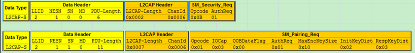

Data length “n”: 4.

Pointer “p”: p points to data of a memory area, corresponding to the structure below.

```C
typedef struct {
	u16	connHandle;
	u8	secure_conn;
	u8	tk_method;
} gap_smp_paringBeginEvt_t;
```

“connHandle”: current connection handle.

“secure_conn”: If it’s 1, secure encryption feature (LE Secure Connections) will be used; otherwise LE legacy pairing will be used.

“tk_method”: It indicates the method of TK value to be used in the subsequent pairing, e.g. JustWorks, PK_Init_Dsply_Resp_Input, PK_Resp_Dsply_Init_Input, Numric_Comparison.

(2)	GAP_EVT_SMP_PAIRING_SUCCESS

Event trigger condition: This event will be generated when the whole pairing process is completed correctly. This phase is called “Key Distribution, Phase 3” of LE pairing phase. If there’s key to be distributed, the pairing success event will be triggered after the two sides have completed key distribution; otherwise the pairing success event will be triggered directly.  

Data length “n”: 4.

Pointer “p”: p points to data of a memory area, corresponding to the structure below.

```C
typedef struct {
	u16	connHandle;
	u8	bonding;
	u8	bonding_result;
} gap_smp_paringSuccessEvt_t;
```

“connHandle”: current connection handle.

“bonding”: If it’s 1, bonding function is enabled; otherwise bonding function is disabled.

“bonding_result”: It indicates bonding result. If bonding function is disabled, the result value should be 0. If bonding function is enabled, it’s also needed to check whether encryption Key is correctly stored in flash; if yes, the result value is 1; otherwise the result value is 0.

(3)	GAP_EVT_SMP_PAIRING_FAIL

Event trigger condition: If Slave or Master does not conform to standard pairing flow, or pairing process is terminated due to abnormity such as error report during communication, this event will be triggered.  

Data length “n”: 2.

Pointer “p”: p points to data of a memory area, corresponding to the structure below.

```C
typedef struct {
	u16	connHandle;
	u8  reason;
} gap_smp_paringFailEvt_t;
```

“connHandle”: current connection handle.

“reason”: It indicates the reason for pairing failure. Following lists some common reason values, and for other values, please refer to the file “stack/ble/smp/smp_const.h”.

For the definition of pairing failure values, please refer to “Core_v5.0” (Vol 3/Part H/3.5.5 “Pairing Failed”).

```C
#define PAIRING_FAIL_REASON_CONFIRM_FAILED				0x04
#define PAIRING_FAIL_REASON_PAIRING_NOT_SUPPORTED		0x05
#define PAIRING_FAIL_REASON_DHKEY_CHECK_FAIL			0x0B
#define PAIRING_FAIL_REASON_NUMUERIC_FAILED				0x0C
#define PAIRING_FAIL_REASON_PAIRING_TIEMOUT				0x80
#define PAIRING_FAIL_REASON_CONN_DISCONNECT				0x81
```

(4)	GAP_EVT_SMP_CONN_ENCRYPTION_DONE

Event trigger condition: When Link Layer encryption is completed (the LL receives “start encryption response” from Master), this event will be triggered.  

Data length “n”: 3.

Pointer “p”: p points to data of a memory area, corresponding to the structure below.

```C
typedef struct {
	u16	connHandle;
	u8	re_connect;   //1: re_connect, encrypt with previous distributed LTK;   0: pairing , encrypt with STK
} gap_smp_connEncDoneEvt_t;
```

“connHandle”: current connection handle.

“re_connect”: If it’s 1, it indicates fast reconnection (The LTK distributed previously will be used to encrypt the link); if it’s 0, it indicates current encryption is the first encryption. 

(5)	GAP_EVT_MASK_SMP_SECURITY_PROCESS_DONE

Event trigger condition: when pairing for the first time, it is triggered after the GAP_EVT_SMP_PAIRING_SUCCESS event, and in the fast reconnection, triggered after GAP_EVT_SMP_CONN_ENCRYPTION_DONE event.

Data length “n”: 3.

Pointer “p”:  p points to data of a memory area, corresponding to the structure below. 

```C
typedef struct {
	u16	connHandle;
	u8	re_connect;   //1: re_connect, encrypt with previous distributed LTK;   0: paring , encrypt with STK
} gap_smp_securityProcessDoneEvt_t;	
```

“re_connect”: If it’s 1, it indicates fast reconnection (The LTK distributed previously will be used to encrypt the link); if it’s 0, it indicates current encryption is the first encryption.

(6)	GAP_EVT_SMP_TK_DISPALY

Event trigger condition: After Slave receives a Pairing_Req from Master, as per the pairing parameter configuration of the peer device and the local device, the method of TK (pincode) value to be used for pairing will be known. If the method “PK_Resp_Dsply_Init_Input” is enabled, which means Slave displays 6-digit pincode and Master inputs 6-digit pincode, this event will be triggered.   

Data length “n”: 4.

Pointer “p”: p points to an u32-type variable “tk_set”. The value is 6-digit pincode that Slave needs to inform the APP layer, and the APP layer needs to display the pincode.  

If the user does not use the 6-digit pincode code randomly generated by the bottom layer when debugging, he can manually set a user-specified pincode code, such as "123456", using the following API.

Users need to add the following statement to /stack/ble/host/smp/smp.h:

```C
extern void blc_smp_setDefaultPinCode(u32 pinCodeInput);
```

User should get the 6-digit pincode from Slave and input the pincode on Master side (e.g. Mobile phone), to finish TK input and continue pairing process. If user has input wrong pincode, or has clicked “cancel”, the pairing process fails. 

The demo "vendor/B91_feature/feature_smp_security/app.c" provides an example for Passkey Entry application.

```C
case GAP_EVT_SMP_TK_DISPALY:
{
	char pc[7];
	u32 pinCode = 123456;
	memset(smp_param_own.paring_tk, 0, 16);
	memcpy(smp_param_own.paring_tk, &pinCode, 4);
}
break;
```

(7)	GAP_EVT_SMP_TK_REQUEST_PASSKEY

Event trigger condition: When the slave device enables the Passkey Entry mode and the PK_Init_Dsply_Resp_Input or PK_BOTH_INPUT pairing mode is used, this event will be triggered to notify the user that the TK value needs to be input. After receiving the event, the user needs to input the TK value through the IO input port (if the timeout is 30s, the pairing fails). The API for inputting the TK value: blc_smp_setTK_by_PasskeyEntry is explained in the "SMP parameter configuration" chapter.

Data length “n”: 0.

Pointer “p”: NULL.

(8)	GAP_EVT_SMP_TK_REQUEST_OOB

Event trigger condition: When Slave device enables the OOB method of legacy pairing, this event will be triggered to inform user that 16-digit TK value should be input by the OOB method. After this event is received, user needs to input 16-digit TK value within 30s via IO input capability, otherwise pairing will fail due to timeout. For the API “blc_smp_setTK_by_OOB” to input TK value, please refer to section 3.3.4.2 SMP parameter configuration.  

Data length “n”: 0.

Pointer “p”: NULL.

(9)	GAP_EVT_SMP_TK_NUMERIC_COMPARE

Event trigger condition: After Slave receives a Pairing_Req from Master, as per the pairing parameter configuration of the peer device and the local device, the method of TK (pincode) value to be used for pairing will be known. If the method “Numeric_Comparison” is enabled, this event will be triggered immediately.

For “Numeric_Comparison”, a method of SMP4.2 secure encryption, dialog window will pop up on both Master and Slave to show 6-digit pincode, “YES” and “NO”; user needs to check whether pincodes on the two sides are consistent, and decide whether to click “YES” to confirm TK check result is OK.

Data length “n”: 4.

Pointer “p”: p points to an u32-type variable “pinCode”. The value is 6-digit pincode that Slave needs to inform the APP layer. The APP layer needs to display the pincode, and supplies “YES or “NO” confirmation mechanism.  

The demo “vendor/B91_feature/feature_smp_security/app.c” provides an example for Numeric_Comparison application.

(10)	GAP_EVT_ATT_EXCHANGE_MTU

Event trigger condition: This event will be triggered in either of the two cases below.

- Master sends “Exchange MTU Request”, and Slave responds with “Exchange MTU Response”.

- Slave sends “Exchange MTU Request”, and Master responds with “Exchange MTU Response”.

Data length “n”: 6.

Pointer “p”: p points to data of a memory area, corresponding to the structure below.

```C
typedef struct {
	u16	connHandle;
	u16	peer_MTU;
	u16	effective_MTU;
} gap_gatt_mtuSizeExchangeEvt_t;
```

connHandle: current connection handle.

peer_MTU: RX MTU value of the peer device.

effective_MTU = min(CleintRxMTU, ServerRxMTU). “CleintRxMTU” and “ServerRxMTU” indicate RX MTU size value of Client and Server respectively. After Master and Slave exchanges MTU size of each other, the minimum of the two values is used as the maximum MTU size value for mutual communication between them.

11)	GAP_EVT_GATT_HANDLE_VLAUE_CONFIRM

Event trigger condition: Whenever the APP layer invokes the “blc_gatt_pushHandleValueIndicate” to send indicate data to Master, Master will respond with a confirmation for the data. This event will be triggered when Slave receives the confirmation.   

Data length “n”: 0.

Pointer “p”: Null pointer.

\newpage
# Low Power Management (PM)

Low Power Management is also called Power Management, or PM as referred by this document.

## Low Power Driver

### Low Power Mode

For the B91 family, when MCU works in normal mode, or working mode, current is about 3~7mA. To save power consumption, MCU should enter low power mode.

There are three low power modes, or sleep modes: Suspend mode, Deepsleep mode, and Deepsleep retention mode. Please be noted that A0 chip does not support suspend mode.

| Module | suspend | deepsleep retention |deepsleep|
| :------------- | :-------------------- | :----------------------------|:------------|
| Sram | 100% keep | first 32K(or 64K) keep, others lost |100% lost|
| digital register |  99% keep | 100% lost|100% lost|
| analog register|  100% keep|99% lost|99% lost|

The table above illustrates statistically data retention and loss for SRAM, digital registers and analog registers during each sleep mode.

(1) Suspend mode (sleep mode 1)

In this mode, program execution pauses, most hardware modules of MCU are powered off, and the PM module still works normally.
In this mode, IC current is about 40-50uA. Program execution continues after wakeup from suspend mode.

In suspend mode, data of the SRAM and all analog registers are maintained. In order to reduce power consumption, the SDK has set the power-down mode for some modules when entering the suspend low-power processing, at which time the digital register of the module will also be powered down, and must be re-initialized and configured after waking up.

User should pay close attention to the registers configured by the API “rf_set_power_level_index”. This API needs to be invoked after each wakeup from suspend mode.

(2) Deepsleep mode (sleep mode 2)

In this mode, program execution pauses, vast majority of hardware modules are powered off, and the PM module still works. In this mode, IC current is less than 1uA, but if flash standby current comes up at 1uA or so, total current may reach 1~2uA. After wakeup from deepsleep mode, similar to power on reset, MCU will restart, and program will reboot and re-initialize.

In deepsleep mode, except a few retention analog registers, data of all registers (analog & digital) and SRAM are lost.

(3) Deepsleep retention mode (sleep mode 3)

In deepsleep mode, current is very low, but all SRAM data are lost; while in suspend mode, though SRAM and most registers are non-volatile, current is increased. 

Deepsleep with SRAM retention (deepsleep retention or deep retention) mode is designed in the B91 family, so as to achieve application scenes with low sleep current and quick wakeup to restore state, e.g. maintain BLE connection during long sleep. Corresponding to 32K or 64K SRAM retention area, deepsleep retention 32K Sram and deepsleep retention 64K Sram are introduced.

Deepsleep retention mode is also a kind of deepsleep. Most of the hardware modules of the MCU are powered off, and the PM hardware modules remain working. Power consumption is the power consumed by retention Sram  plus that of deepsleep mode, and the current is between 2~3uA. When deepsleep mode wake up, the MCU will restart and the program will restart to initialize.

Deepsleep retention mode and deepsleep mode are consistent in register state, almost all of them are powered off. Compare with in deepsleep mode, in deepsleep retention mode, the first 32K (or the first 64K) of Sram can be kept without power-off, and the remaining Sram is powered off.

In deepsleep mode and deepsleep retention mode, there are very few analog registers that can be kept without power-down. These non-power-down analog registers include:

a) Analog registers to control GPIO pull-up/down resistance

When configured via the API “gpio_setup_up_down_resistor” or the following method in the app_config.h, GPIO pull-up/down resistance are non-volatile:

```C
#define	PULL_WAKEUP_SRC_PD5		PM_PIN_PULLDOWN_100K
```

Using GPIO output belongs to the state controlled by the digital register. B91 can use GPIO output to control some peripherals during suspend, but after being switched to deepsleep retention mode, the GPIO output status becomes invalid and it cannot accurately control peripherals during sleep. At this point, you can use GPIO to simulate the state of the pull-up and pull-down resistors instead: pull-up 10K instead of GPIO output high, and pull-down 100K instead of GPIO output low.

b) Special retention analog registers of the PM module:

The code below shows the “DEEP_ANA_REG” in the “drivers/B91/pm.h”.

```C
#define PM_ANA_REG_POWER_ON_CLR_BUF1 	0x3a // initial value 0x00
#define PM_ANA_REG_POWER_ON_CLR_BUF2 	0x3b // initial value 0x00
#define PM_ANA_REG_POWER_ON_CLR_BUF3 	0x3c // initial value 0x00
#define PM_ANA_REG_POWER_ON_CLR_BUF4 	0x3d // initial value 0x00
#define PM_ANA_REG_POWER_ON_CLR_BUF5 	0x3e // initial value 0x00
```

The above registers will restore their initial values only when the power is off. Please note, that customers are not allowed to use ana_39. This analog register is reserved for the underlying stack. If the application layer code uses this register, it needs to be modified to ana_3a~ana_3f. Because the number of non-power-off analog registers is relatively small, it is recommended that customers use each of its bits to indicate different status bits.

```C
#define PM_ANA_REG_POWER_ON_CLR_BUF0 	0x39 // initial value 0x00. [Bit0][Bit1] is already occupied. The customer cannot change!
```

The above 0x38 register will be initialized in the following three cases: hardware/software reset, power down and watchdog. Please note that bit0 has been used by the stack, and users need to avoid this bit when using it.

Users can use the return value of API pm_get_mcu_status(void) after sys_init(power_mode_e power_mode) to determine which state the cpu is returning from. The return value is as follows:

```C
typedef enum{
	MCU_STATUS_POWER_ON  		= BIT(0),
	MCU_STATUS_REBOOT_BACK    	= BIT(2),	//the user will not see the reboot status.
	MCU_STATUS_DEEPRET_BACK  	= BIT(3),
	MCU_STATUS_DEEP_BACK		= BIT(4),
	MCU_STATUS_REBOOT_DEEP_BACK	= BIT(5),	//reboot + deep
}pm_mcu_status;
```

### Low Power Wake-up Source

The low-power wake-up source diagram of B91 MCU is shown below, suspend/deepsleep/deepsleep retention can all be awakened by GPIO PAD and timer. In the BLE SDK, only two types of wake-up sources are concerned, as shown below (note that the two definitions of PM_TIM_RECOVER_START and PM_TIM_RECOVER_END in the code are not wake-up sources):

```C
typedef enum {
	 PM_WAKEUP_PAD   = BIT(3),
	 PM_WAKEUP_TIMER = BIT(5),
}SleepWakeupSrc_TypeDef;
```

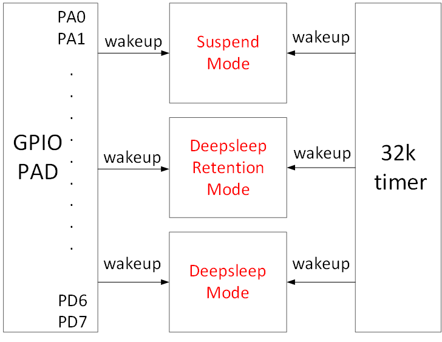

As shown above, there are two hardware wakeup sources: TIMER and GPIO PAD.

- The “PM_WAKEUP_TIMER” comes from 32k HW timer (32k RC timer or 32k Crystal timer). The 32k timer has been correctly initialized in the SDK, and the user only needs to set the wakeup source in cpu_sleep_wakeup() when using it. The cpu_sleep_wakeup is a function pointer. When using the internal 32k RC, the user calls blc_pm_select_internal_32k_crystal in the main function to make cpu_sleep_wakeup point to cpu_sleep_wakeup_32k_rc; when using the external 32k crystal, the user calls blc_pm_select_external_32k_crystal in the main function to make cpu_sleep_wakeup point to cpu_sleep_wakeup_32k_xtal.
  
- The “PM_WAKEUP_PAD” comes from GPIO module. Except 4 MSPI pins, all GPIOs (PAx/PBx/PCx/PDx) support high or low level wakeup .

The API below serves to configure GPIO PAD as wakeup source for sleep mode.

```C
typedef enum{
	Level_Low=0,
	Level_High =1,
}pm_gpio_wakeup_Level_e; 
void pm_set_gpio_wakeup (gpio_pin_e pin, pm_gpio_wakeup_Level_e pol, int en);
#define cpu_set_gpio_wakeup				pm_set_gpio_wakeup
```

- “pin”: GPIO pin
- “pol”: wakeup polarity, Level_High: high level wakeup, Level_Low: low level wakeup
- “en”: 1-enable, 0-disable. 

Examples:

```C
cpu_set_gpio_wakeup (GPIO_PC2, Level_High, 1);  //Enable GPIO_PC2 PAD high level wakeup
cpu_set_gpio_wakeup (GPIO_PC2, Level_High, 0);  //Disable GPIO_PC2 PAD wakeup
cpu_set_gpio_wakeup (GPIO_PB5, Level_Low, 1);  //Enable GPIO_PB5 PAD low level wakeup
cpu_set_gpio_wakeup (GPIO_PB5, Level_Low, 0);  //Disable GPIO_PB5 PAD wakeup
```

### Sleep and Wake-up from Low Power Mode

The API below serves to configure MCU sleep and wakeup.

```C
typedef int (*cpu_pm_handler_t)(SleepMode_TypeDef sleep_mode,  SleepWakeupSrc_TypeDef wakeup_src, unsigned int  wakeup_tick);
cpu_pm_handler_t  		 cpu_sleep_wakeup;
```

- “sleep_mode”: This para serves to set sleep mode as suspend mode, deepsleep mode, deepsleep retention 32K Sram or deepsleep retention 64K Sram.

```C
typedef enum {
	//available mode for customer
	SUSPEND_MODE						= 0x00,
	DEEPSLEEP_MODE						= 0x30,
	DEEPSLEEP_MODE_RET_SRAM_LOW32K  	= 0x21,  //for boot from sram
	DEEPSLEEP_MODE_RET_SRAM_LOW64K  	= 0x03,  //for boot from sram
	DEEPSLEEP_MODE_RET_SRAM = 0x21,
	//not available mode
	DEEPSLEEP_RETENTION_FLAG			= 0x0F,
}SleepMode_TypeDef;
```

- wakeup_src: This para serves to set wakeup source for suspend/deep retention/deepsleep as one or combination of PM_WAKEUP_PAD and PM_WAKEUP_TIMER. If set as 0, MCU wakeup is disabled for sleep mode.
  
- “wakeup_tick”: if PM_WAKEUP_TIMER is assigned as wakeup source, the “wakeup_tick” serves to set MCU wakeup time. If PM_WAKEUP_TIMER is not assigned, this para is negligible.

The “wakeup_tick” is an absolute value, which equals current value of System Timer tick plus intended sleep duration. When System Timer tick reaches the time defined by the wakeup_tick, MCU wakes up from sleep mode. Without taking current System Timer tick value as reference point, wakeup time is uncontrollable.

Since the wakeup_tick is an absolute time, it follows the max range limit of 32bit System Timer tick. In current SDK, 32bit max sleep time corresponds to 7/8 of max System Timer tick. Since max System Timer tick is 268s or so, max sleep time is 268*7/8=234s, which means the “delta_Tick” below should not exceed 234s. If a longer sleep time is needed, user can call the long sleep function, as described in section 4.2.7.

```C
cpu_sleep_wakeup(SUSPEND_MODE, PM_WAKEUP_TIMER, clock_time() + delta_tick);
```

The return value is an ensemble of current wakeup sources. Following shows wakeup source for each bit of the return value.

```C
typedef enum {
	WAKEUP_STATUS_COMPARATOR  		= BIT(0),
	WAKEUP_STATUS_TIMER  			= BIT(1),
	WAKEUP_STATUS_CORE 				= BIT(2),
	WAKEUP_STATUS_PAD    			= BIT(3),
	WAKEUP_STATUS_MDEC    			= BIT(4),

	STATUS_GPIO_ERR_NO_ENTER_PM    	= BIT(7),
	STATUS_ENTER_SUSPEND  			= BIT(30),
}pm_wakeup_status_e;;
```

a) If WAKEUP_STATUS_TIMER bit = 1, wakeup source is Timer.

b) If WAKEUP_STATUS_PAD bit = 1, wakeup source is GPIO PAD.

c) If both WAKEUP_STATUS_TIMER and WAKEUP_STATUS_PAD equal 1, wakeup source is Timer and GPIO PAD.

d) STATUS_GPIO_ERR_NO_ENTER_PM is a special state indicating GPIO wakeup error. E.g. Suppose a GPIO is set as high level PAD wakeup (PM_WAKEUP_PAD). When MCU attempts to invoke the “cpu_sleep_wakeup” to enter suspend, if this GPIO is already at high level, MCU will fail to enter suspend and immediately exit the “cpu_sleep_wakeup” with return value STATUS_GPIO_ERR_NO_ENTER_PM.

Sleep time is typically set in the following way：

```C
cpu_sleep_wakeup (SUSPEND_MODE , PM_WAKEUP_TIMER,  clock_time() + delta_Tick);
```

The “delta_Tick”, a relative time (e.g. 100* CLOCK_16M_SYS_TIMER_CLK_1MS), plus “clock_time()” becomes an absolute time.

Some examples on cpu_sleep_wakeup：

```C
cpu_sleep_wakeup (SUSPEND_MODE , PM_WAKEUP_PAD, 0);
```

When it’s invoked, MCU enters suspend, and wakeup source is GPIO PAD.

```C
cpu_sleep_wakeup (SUSPEND_MODE , PM_WAKEUP_TIMER, clock_time() + 10* CLOCK_16M_SYS_TIMER_CLK_1MS;
```

When it’s invoked, MCU enters suspend, wakeup source is timer, and wakeup time is current time plus 10ms, so the suspend duration is 10ms.

```C
cpu_sleep_wakeup (SUSPEND_MODE , PM_WAKEUP_PAD | PM_WAKEUP_TIMER, 
clock_time() + 50* CLOCK_16M_SYS_TIMER_CLK_1MS);
```

When it’s invoked, MCU enters suspend, wakeup source includes timer and GPIO PAD, and timer wakeup time is current time plus 50ms.

If GPIO wakeup is triggered before 50ms expires, MCU will be woke up by GPIO PAD in advance; otherwise, MCU will be woke up by timer.

```C
cpu_sleep_wakeup (DEEPSLEEP_MODE, PM_WAKEUP_PAD, 0);
```

When it’s invoked, MCU enters deepsleep, and wakeup source is GPIO PAD.

```C
cpu_sleep_wakeup (DEEPSLEEP_MODE_RET_SRAM_LOW32K , PM_WAKEUP_TIMER, clock_time() + 8* CLOCK_16M_SYS_TIMER_CLK_1S);
```

When it’s invoked, MCU enters deepsleep retention 32K Sram mode, wakeup source is timer, and wakeup time is current time plus 8s.

```C
cpu_sleep_wakeup (DEEPSLEEP_MODE_RET_SRAM_LOW32K , PM_WAKEUP_PAD | PM_WAKEUP_TIMER,clock_time() + 10* CLOCK_16M_SYS_TIMER_CLK_1S);
```

When it’s invoked, MCU enters deepsleep retention 32K Sram mode, wakeup source includes GPIO PAD and Timer, and timer wakeup time is current time plus 10s. If GPIO wakeup is triggered before 10s expires, MCU will be woke up by GPIO PAD in advance; otherwise, MCU will be woke up by timer.

### Low Power Wake-up Procedure

When user calls the API cpu_sleep_wakeup, the MCU enters the sleep mode; when the wake-up source triggers the MCU to wake up, the MCU software operation flow is inconsistent for different sleep modes.

The following is a detailed description of the MCU operating process after the suspend, deepsleep, and deepsleep retention three sleep modes are awakened. Please refer to the figure below.

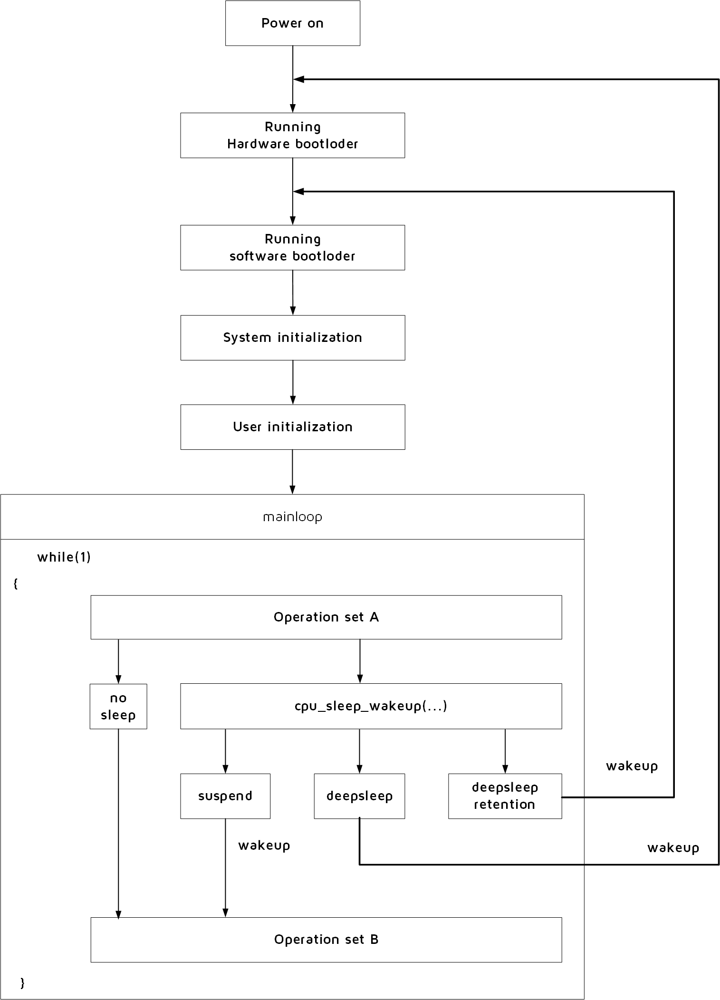{ height=856px}

Detailed process after the MCU is powered on (Power on) is introduced as following:

(1) Running hardware bootloader

It is pure MCU hardware operation without involvement of software.

Couple of examples:

Chip back from power on/deep sleep: By reading the flash boot mark "TLNK", determine the current firmware storage address (offset address 0x00000/0x20000/0x40000/0x80000), then jump to the corresponding address of the flash (base address 0x20000000+offset address 0x00000/0x20000/0x40000/0x80000) and start executing the software bootloader. (The reason why this can be done is that the B91 series chips support direct execution from Flash.)

(2) Running software bootloader

After hardware bootloader, MCU starts “Running software bootloader”. Software bootloader is vector side corresponding to assembly in the “cstartup_B91.S”.  
Software bootloader serves to set up memory environment for C program execution, so it can be regarded as memory initialization.

(3) System initialization

System initialization corresponds to the initialization of each hardware module (including sys_init, rf_drv_init, gpio_init, clock_init) from sys_init to user_init in the main function, and sets the digital/analog register status of each hardware module.

(4) User initialization

User initialization corresponds to user_init, or user_init_normal/ user_init_deepRetn in the SDK.

(5) main_loop

After User initialization, program enters main_loop inside while(1). The operation is called “Operation Set A” before main_loop enters sleep mode, and called “Operation Set B” after wakeup from sleep.

As shown in figure above, sleep mode process is detailed as following:

(6) no sleep

Without sleep mode, MCU keeps looping inside while(1) between “Operation Set A” -> “Operation Set B”.

(7) suspend

MCU enters suspend mode by invoking cpu_sleep_wakeup, wakes up from suspend after exiting from cpu_sleep_wakeup, and then executes “Operation Set B”.

Suspend can be regarded as the most “clean” sleep mode, in which data of SRAM, digital and analog registers are retained. After wakeup from suspend, program continues from the breakpoint, with almost no need to recover SRAM or registers.
However, in suspend current is relatively high.

(8) deepsleep

MCU can also enter deepsleep by invoking cpu_sleep_wakeup.
After wakeup from deepsleep, MCU restarts from “Running hardware bootloader”.
Almost the same as power on reset, all hardware and software initialization are required after deepsleep wakeup.
Since SRAM and registers - except a few retention analog registers - will lose their data in deepsleep, MCU current is decreased to less than 1uA.

(9) deepsleep retention

MCU can also enter deepsleep retention mode by invoking cpu_sleep_wakeup. After wakeup from deepsleep retention, MCU restarts from “Running software bootloader”.

Deepsleep retention is an intermediate sleep state between suspend and deepsleep. In suspend mode, both SRAM and most registers need to retain data, which thus ends up with higher current. In deepsleep retention, it’s only needed to maintain states of a few retention analog registers, as well as data of first 32K or 64K SRAM, so current is largely decreased to 2uA or so.

After deepsleep wake_up, MCU needs to restart the whole flow. Since first 32K or 64K SRAM are non-volatile in deepsleep retention, there’s no need to re-load from flash to SRAM after wake_up, and thus “Running hardware bootloader” is skipped. Due to limited SRAM retention size, “Running software bootloader” cannot be skipped. Since deepsleep retention does not keep register state, system initialization must also be executed to re-initialize registers.

User initialization after deepsleep retention wake_up can actually be optimized to differentiate from MCU power on and deepsleep wake_up.

### API pm_is_MCU_deepRetentionWakeup

According to the “sleep mode wakeup work flow” above, MCU power on, deepsleep wake_up and deepsleep retention wake_up all need to go through “Running software bootloader”, “system initialization”, and “user initialization”.

While running system initialization and user initialization, user needs to know whether MCU is woke up from deepsleep retention, so as to differentiate from power on and deepsleep wake_up. The following API in the PM driver serves to make this judgement.

```C
int pm_is_MCU_deepRetentionWakeup(void);
```

Return value: 1 - deepsleep retention wake_up; 0 - power on or deepsleep wake_up.

## BLE Low Power Management

### BLE PM Initialization

For applications with low power mode, BLE PM module needs to be initialized by following API.

```C
void 	blc_ll_initPowerManagement_module(void);
```

If low power is not required, DO NOT use this API, so as to skip compiling of related code and variables into program and thus save FW and SRAM space.

### BLE PM for Link Layer

In this BLE SDK, PM module manages power consumption in BLE Link Layer. It would be helpful referring to introduction to Link Layer in earlier chapter.

Current SDK only applies low power management to Advertising state and Connection state Slave role with a set of APIs for user. It’s not applicable yet to Scanning state, Initiating state and Connection state Master role.

The SDK does not apply low power management to Idle state either. In Idle state, since there is no RF activity, i.e. the “blt_sdk_main_loop” function is not valid, user can use PM driver for certain low power management. E.g. In the demo code below, when Link Layer is in Idle state, every main_loop would suspend for 10ms.

```C
void main_loop (void)
{
	////////////////////// BLE entry ////////////////////////
	blt_sdk_main_loop();

	///////////////////// UI entry //////////////////////////
	// add user task
	//////////////////// PM configuration ////////////////////////
	if(blc_ll_getCurrentState() == BLS_LINK_STATE_IDLE ){  //Idle state
		cpu_sleep_wakeup(SUSPEND_MODE, PM_WAKEUP_TIMER, 
clock_time() + 10*CLOCK_16M_SYS_TIMER_CLK_1MS);
	}
	else{
		blt_pm_proc();  //BLE Adv & Conn state 
	}
}
```

The figure below shows timing of sleep mode when Link Layer is in Advertising state or Conn state Slave role with connection latency = 0.

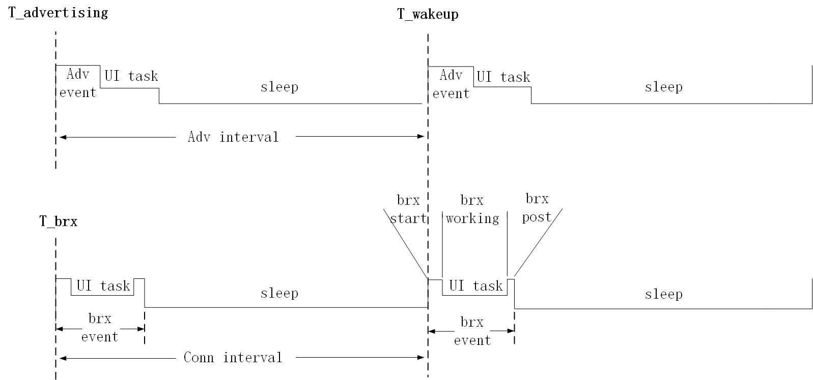

(1) In Advertising state, during each Adv Internal, Adv Event is mandatory; MCU can enter sleep mode (suspend/deepsleep retention) during the rest time other than UI task.

In figure above, the starting time of Adv event at first Adv interval is defined as T_advertising, and the time for MCU to wake up from sleep is defined as T_wakeup.T_wakeup is also the start of Adv event at next Adv interval. Both these two parameters will be elaborated in later section.

(2) During each Conn-interval at Conn state Slave role, the time for brx Event (brx start+brx working+brx post) is mandatory. MCU can enter sleep mode (suspend/ deepsleep retention) during the rest time other than UI task.

The starting time of of Brx event at first Connection interval is defined as T_brx, and the time for MCU to wake up from sleep is T_wakeup.

T_wakeup is also the start of BRx event at next Connection interval. Both these two parameters will be elaborated in later section.

BLE PM is basically the sleep mode management in Advertising state or Conn state Slave role. User can select sleep mode and set related time parameters.

As explained earlier, the B91 family has 3 sleep modes: suspend, deepsleep, and deepsleep retention.

For suspend and deepsleep retention, since the blt_sdk_main_loop of the SDK includes low PM in BLE stack according to Link Layer state, to configure low power management, user only needs to invoke corresponding APIs instead of the “cpu_sleep_wakeup”.  

Deepsleep is not included in BLE low PM, so user needs to manually invoke the API “cpu_sleep_wakeup” in APP layer to enter deepsleep. Please refer to the “blt_pm_proc” function in the project “8258_ble_remote” of the SDK.

Following sections illustrate details of low power management in Advertising state and Connection state Slave role.

### BLE PM Variables

The variables in this section are helpful to understand BLE PM software flow.

The struct “st_ll_pm_t” is defined in BLE SDK. Following lists some variables of the struct which will be used by PM APIs.

```C
typedef struct {
	u8		suspend_mask;
	u8		wakeup_src;
	u16		sys_latency;
	u16 	user_latency;
	u32     deepRet_advThresTick;
	u32     deepRet_connThresTick;
	u32     deepRet_earlyWakeupTick;
}st_ll_pm_t;
```

Following struct is defined in the file “ll_pm.c” for understanding purpose.

```C
st_ll_pm_t  bltPm;
```

**Note:**

> This file is assembled in library, and user is not allowed to make any operation on this struct variable.

There will be a lot of variables like the “bltPm. suspend_mask” in later sections.

### API bls_pm_setSuspendMask

The APIs below serve to configure low power management in Link Layer at “Advertising state” and “Conn state Slave role”.

```C
void	bls_pm_setSuspendMask (u8 mask);
u8		bls_pm_getSuspendMask (void);
```

The “bltPm.suspend_mask” is set by the “bls_pm_setSuspendMask” and its default value is SUSPEND_DISABLE.

Following shows source code of the 2 APIs.

```C
void  bls_pm_setSuspendMask (u8 mask)
{
		bltPm.suspend_mask = mask;
}
u8 	bls_pm_getSuspendMask (void)
{
		return bltPm.suspend_mask;
}
```

The “bltPm.suspend_mask” can be set as any one or the “or-operation” of following values:

```C
#define			SUSPEND_DISABLE				0
#define			SUSPEND_ADV					BIT(0)
#define			SUSPEND_CONN				BIT(1)
#define			DEEPSLEEP_RETENTION_ADV		BIT(2)
#define			DEEPSLEEP_RETENTION_CONN	BIT(3)
```

“SUSPEND_DISABLE” means sleep is disabled which allows MCU to enter neither suspend nor deepsleep retention.

“SUSPEND_ADV” and “DEEPSLEEP_RETENTION_ADV” decide whether MCU at Advertising state can enter suspend and deepsleep retention.

“SUSPEND_CONN” and “DEEPSLEEP_RETENTION_CONN” decide whether MCU at Conn state Slave role can enter suspend and deepsleep retention.

In low power sleep mode design of the SDK, deepsleep retention is a substitute of suspend mode to reduce sleep power consumption. 

Take Conn state slave role as an example:

The SDK will first check whether SUSPEND_CONN is enabled in the “bltPm.suspend_mask”, and MCU can enter suspend only when SUSPEND_CONN is enabled. Further on, based on the value of the DEEPSLEEP_RETENTION_CONN, MCU can decide whether it will enter suspend mode or deepsleep retention mode.

Therefore, to enable MCU to enter suspend, user only needs to enable SUSPEND_ADV/SUSPEND_CONN. To enable MCU to enter deepsleep retention mode, both SUSPEND_CONN and DEEPSLEEP_RETENTION_CONN should be enabled.

Following shows 3 typical use cases:

```C
bls_pm_setSuspendMask(SUSPEND_DISABLE);
```

MCU will not enter sleep mode (suspend/deepsleep retention).

```C
bls_pm_setSuspendMask(SUSPEND_ADV | SUSPEND_CONN);
```

At Advertising state and Conn state Slave role, MCU can only enter suspend mode, and it’s not allowed to enter deepsleep retention.

```C
bls_pm_setSuspendMask(SUSPEND_ADV | DEEPSLEEP_RETENTION_ADV 
					|SUSPEND_CONN | DEEPSLEEP_RETENTION_CONN);
```

At Advertising state and Conn state Slave role, MCU can enter both suspend and deepsleep retention, but the sleep mode to enter depends on sleeping time which will be explained later.

There may be some special applications, for example：

```C
bls_pm_setSuspendMask(SUSPEND_ADV)
```

Only at Advertising state can MCU enter suspend, and at Conn state Slave role it’s not allowed to enter sleep mode.

```C
bls_pm_setSuspendMask(SUSPEND_CONN | DEEPSLEEP_RETENTION_CONN)
```

Only at Conn state Slave role, can MCU enter suspend or deepsleep retention, and at Advertising state it’s not allowed to enter sleep mode.

### API bls_pm_setWakeupSource

User can set the bls_pm_setSuspendMask to enable MCU to enter sleep mode (suspend or deepsleep retention), and use the following API to set wakeup source.

```C
void		bls_pm_setWakeupSource(u8 source);
```

“source”: Wakeup source, can be set as PM_WAKEUP_PAD.

This API sets the bottom-layer variable “bltPm.wakeup_src”. Following shows source code in the SDK.

```C
void	bls_pm_setWakeupSource (u8 src)
{
	bltPm.wakeup_src = src;
}
```

When MCU enters sleep mode at Advertising state or Conn state Slave role, its actual wakeup source is:

```C
bltPm.wakeup_src | PM_WAKEUP_TIMER
```

So PM_WAKEUP_TIMER is mandatory, not depending on user setup. This guarantees that MCU will wake up at specified time to handle Adv Event or Brx Event.

Everytime wakeup source is set by the “bls_pm_setWakeupSource”, after MCU wakes up from sleep mode, the bltPm.wakeup_src is set to 0.

### API blc_pm_setDeepsleepRetentionType

Deepsleep retention further separates into 32K SRAM retention or 64K SRAM retention. When entering deepsleep retention mode, the following API can be set to decide which sub-mode to enter:

```C
void blc_pm_setDeepsleepRetentionType(SleepMode_TypeDef sleep_type);
```

Only two options are available:

```C
typedef enum {
		DEEPSLEEP_MODE_RET_SRAM_LOW32K  	= 0x21,
		DEEPSLEEP_MODE_RET_SRAM_LOW64K  	= 0x03,
}SleepMode_TypeDef;
```

In the B91 SDK, default deepsleep retention mode is set as DEEPSLEEP_MODE_RET_SRAM_LOW32K，and to use 64K retention mode, user needs to invoke the API below during initialization.

```C
blc_pm_setDeepsleepRetentionType(DEEPSLEEP_MODE_RET_SRAM_LOW64K);
```

**Note:**

> This API must be invoked after the “blc_ll_initPowerManagement_module” to take effect.

### API cpu_long_sleep_wakeup_32k_rc

This API is mainly used to set the time point for waking up the CPU:

```c
int cpu_long_sleep_wakeup_32k_rc(SleepMode_TypeDef sleep_mode,  SleepWakeupSrc_TypeDef wakeup_src, unsigned int  wakeup_tick);
```

The main difference between this API and cpu_sleep_wakeup_32k_rc is the sleep duration. The original function cpu_sleep_wakeup_32k_rc cannot set the maximum sleep duration more than 5 minutes, while this function can support sleep duration more than 5 minutes. The premise of calling this function is to disconnect and close the advertising, and both suspend mask and sleep mask should be set to disable.

The first parameter sleep_mode is the low-power mode, and there are four modes to choose from.

```C
typedef enum {
	SUSPEND_MODE						= 0x00,
	DEEPSLEEP_MODE						= 0x30,	
	DEEPSLEEP_MODE_RET_SRAM_LOW32K  	= 0x21, 
	DEEPSLEEP_MODE_RET_SRAM_LOW64K  	= 0x03,
};
```

The second parameter wakeup_src is the wakeup source, and there are five wakeup sources to choose from.

```C
typedef enum {
	 PM_WAKEUP_PAD   		= BIT(3),
	 PM_WAKEUP_CORE  		= BIT(4),
	 PM_WAKEUP_TIMER 		= BIT(5),
	 PM_WAKEUP_COMPARATOR 	= BIT(6),
	 PM_WAKEUP_MDEC		 	= BIT(7),
};
```

The third parameter wakeup_tick is the wakeup count value, which is 31.25us. When the sleep time is equal to this count value, the CPU will wake up, and the return value of 0 means wakeup is successful, otherwise it is failure.

### PM software processing flow

Both actual code and pseudo-code are used herein to explain the flow details.

#### blt_sdk_main_loop

As shown below, the “blt_sdk_main_loop” is repetitively executed in while (1) loop of the SDK. 

```C
while(1)
{
	////////////////////// BLE entry ////////////////////////
	blt_sdk_main_loop();
////////////////////// UI entry ////////////////////////
//UI  task
////////////////////// user PM config ////////////////////////
	//blt_pm_proc();
}
```

The blt_sdk_main_loop function is executed continuously in while(1), and the code for BLE low-power management is in the blt_sdk_main_loop function, so the code for low-power management is also executed all the time.

Following shows the implementation of BLE PM logic inside the “blt_sdk_main_loop”.

```C
int	blt_sdk_main_loop (void)
{
	……
	if(bltPm. suspend_mask == SUSPEND_DISABLE) // SUSPEND_DISABLE, can not
{                                      // enter sleep mode
		return  0;
	}

	if( (Link Layer State == Advertising state)  ||  (Link Layer State == Conn state Slave role) )
{
		if(Link Layer is in Adv Event or Brx Event) //RF is working, can not enter
{                                 //sleep mode
			return  0;
		}
		else
		{
			blt_brx_sleep (); //process sleep & wakeup
}
}
	return 0;
}
```

(1) When the “bltPm.suspend_mask” is SUSPEND_DISABLE, the SW directly exits without executing the “blt_brx_sleep” function. So when using the “bls_pm_setSuspendMask(SUSPEND_DISABLE)”, PM logic is completely ineffective; MCU will never enter sleep and the SW always execute while(1) loop.

(2) When the SW is executing Adv Event at Advertising State or Brx Event at Conn state Slave role, the “blt_brx_sleep” won’t be executed either due to RF task ongoing. The SDK needs to guarantee completion of Adv Event/Brx Event before MCU enters sleep mode.

Only when both cases above are invalid, the blt_brx_sleep will be executed.

#### blt_brx_sleep

Following shows logic implementation of the “blt_brx_sleep” function in the case of default deepsleep retention 32K Sram.

```C
void	blt_brx_sleep (void)
{
if(	(Link Layer state == Adv state)&& (bltPm. suspend_mask &SUSPEND_ADV) )
{   //current state is adv state, suspend is allowed
T_wakeup = T_advertising + advInterval;
		”BLT_EV_FLAG_SUSPEND_ENTER” event callback execution
		T_sleep = T_wakeup – clock_time();
		if(  bltPm. suspend_mask & DEEPSLEEP_RETENTION_ADV &&
T_sleep  >  bltPm.deepRet_advThresTick )
{   //suspend is automatically switched to deepsleep retention 
cpu_sleep_wakeup (DEEPSLEEP_MODE_RET_SRAM_LOW32K, 
PM_WAKEUP_TIMER | bltPm.wakeup_src,T_wakeup); //suspend
//MCU reset to 0 after wakeup, restart on “software bootloader” 
}
else
{
cpu_sleep_wakeup (	SUSPEND_MODE, PM_WAKEUP_TIMER | bltPm.wakeup_src, T_wakeup);
}
	  ”BLT_EV_FLAG_SUSPEND_EXIT ” event callback execution

		if(suspend is woke up by GPIO PAD)
		{
			”BLT_EV_FLAG_GPIO_EARLY_WAKEUP” event callback execution
		}
	}
    else if((Link Layer state == Conn state Slave role)&& (SuspendMask&SUSPEND_CONN) )
{       //current Conn state, enter suspend
		if(conn_latency != 0)
		{	
			latency_use = bls_calculateLatency();	
			T_wakeup = T_brx + (latency_use +1) * conn_interval;
		}
		else
		{	
			T_wakeup = T_brx + conn_interval;
		}
		”BLT_EV_FLAG_SUSPEND_ENTER” event callback execution
T_sleep = T_wakeup – clock_time();
		if(  bltPm. suspend_mask & DEEPSLEEP_RETENTION_CONN &&
T_sleep  >  bltPm.deepRet_connThresTick )
{   //suspend is automatically switched to deepsleep retention 
cpu_sleep_wakeup (DEEPSLEEP_MODE_RET_SRAM_LOW32K, 
PM_WAKEUP_TIMER | bltPm.wakeup_src,T_wakeup); //suspend
//MCU reset to 0 after wakeup, restart on “software bootloader” 
}
else
{
cpu_sleep_wakeup (	SUSPEND_MODE, PM_WAKEUP_TIMER | bltPm.wakeup_src, T_wakeup);
}

” BLT_EV_FLAG_SUSPEND_EXIT” event callback execution
		if(suspend is woke up by GPIO PAD)
		{
			”BLT_EV_FLAG_GPIO_EARLY_WAKEUP” event callback execution
			Adjust BLE timing
}
}
	bltPm.wakeup_src = 0; 
bltPm.user_latency = 0xFFFF; 
}
```

**Note:**

> Here is the default deepsleep retention 32K Sram to illustrate.

To simplify the discussion, let’s begin with an easy case: conn_latency =0, only suspend mode, no deepsleep retention. This is the case when setting suspend mask in APP layer via the “bls_pm_setSuspendMask(SUSPEND_ADV | SUSPEND_CONN)”.

Referring to controller event introduced earlier, please pay close attention to the timing of these suspend related events and callback functions: BLT_EV_FLAG_SUSPEND_ENTER, BLT_EV_FLAG_SUSPEND_EXIT, BLT_EV_FLAG_GPIO_EARLY_WAKEUP.

When Link Layer is in Advertising state with “bltPm. suspend_maskis” set to SUSPEND_ADV, or at Conn state slave role with “bltPm. suspend_mask” set to SUSPEND_CONN, MCU can enter suspend mode.

In suspend mode, the API “cpu_sleep_wakeup” in the driver is finally invoked.

```C
cpu_sleep_wakeup (SUSPEND_MODE, PM_WAKEUP_TIMER | bltPm.wakeup_src, T_wakeup);
```

This API sets wakeup source as PM_WAKEUP_TIMER | bltPm.wakeup_src, so Timer wakeup is mandatory to guarantee MCU wakeup before next Adv Event or Brx Event. For wakeup time “T_wakeup”, please refer to earlier “sleep timing for Advertising state & Conn state Slave role” diagram.

When exiting the “blt_brx_sleep” function, both the “bltPm.wakeup_src” and the “bltPm.user_latency” are reset. So the API “bls_pm_setWakeupSource” and “bls_pm_setManualLatency” are only effective for current sleep mode.

### Analysis of deepsleep retention

Introduce deepsleep retention, and continue to analyze the above software processing flow. When the application layer is set as follows, deepsleep retention mode is enabled.

```C
bls_pm_setSuspendMask(  SUSPEND_ADV | DEEPSLEEP_RETENTION_ADV | SUSPEND_CONN | DEEPSLEEP_RETENTION_CONN);
```

#### API blc_pm_setDeepsleepRetentionThreshold

At Advertising state and Conn state slave role, suspend can switch to deep retention only when following conditions are met, respectively:

```C
if(  bltPm. suspend_mask & DEEPSLEEP_RETENTION_ADV &&T_sleep  > bltPm.deepRet_advThresTick )
if(  bltPm. suspend_mask & DEEPSLEEP_RETENTION_CONN &&T_sleep  >  bltPm.deepRet_connThresTick )
```

Firstly, the “bltPm. suspend_mask” should be set to DEEPSLEEP_RETENTION_ADV or DEEPSLEEP_RETENTION _CONN, as explained before.

Secondly, for T_sleep  >  bltPm.deepRet_advThresTick  or T_sleep  >  bltPm.deepRet_connThresTick ，T_sleep, sleep duration time, equals Wakeup time “T_wakeup” minus current time “clock_time()”. It means that sleep duration should exceed certain threshold so that MCU can switch sleep mode from suspend to deepsleep retention.

Here is the API to set the two threshold in unit of ms for Advertising state and Conn state slave role.

```C
void blc_pm_setDeepsleepRetentionThreshold( u32 adv_thres_ms, 
u32 conn_thres_ms)
{
 bltPm.deepRet_advThresTick = adv_thres_ms * CLOCK_16M_SYS_TIMER_CLK_1MS;
 bltPm.deepRet_connThresTick = conn_thres_ms * CLOCK_16M_SYS_TIMER_CLK_1MS;
}
```

API blc_pm_setDeepsleepRetentionThreshold is used to set the time threshold when suspend is switched to deepsleep retention trigger condition. This design is to pursue lower power consumption.

Refer to the description of the "Run Process After Sleep Wake_up" section above. After suspend mode wake_up, you can immediately return to the environment before suspend to continue running. In the above software flow, after T_wakeup wakes up, it can immediately start executing the Adv Event/Brx Event task.

After deepsleep retention wake_up, you need to return to the place where "Run software bootloader" started. Compared with suspend wake_up, you need to run 3 more steps (Run software bootloader + System initialization + User initialization) before you can return to main_loop to execute Adv Event again. /Brx Event task.

Taking Conn state slave role as an example, the following figure shows the timing (sequence) & power (power consumption) comparison when sleep mode is suspend and deepsleepretention respectively.

The time difference T_cycle between two adjacent Brx events is the current time period. Average the power consumption of Brx Event, the equivalent current is I_brx, and the duration is t_brx (the name t_brx here is to distinguish it from the previous concept T_brx). The bottom current of Suspend is I_suspend, and the bottom current of deep retention is I_deepRet.

The average current in the process of "Run software bootloader + System initialization + User initialization" is equivalent to I_init, and the total duration is T_init. In actual applications, the value of T_init needs to be controlled and measured by the user, and how to implement it will be introduced later.

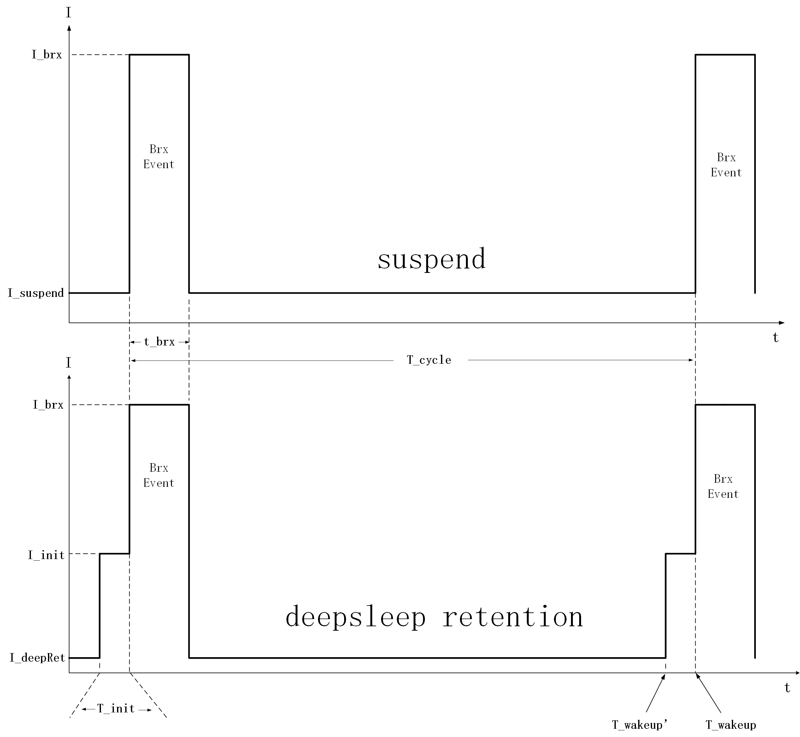

The following is the description of terms in the figure.

- T_cycle: the time difference between two adjacent Brx events

- I_brx: average the power consumption of Brx Event, the equivalent current is I_brx

- t_brx: l_brx duration

- l_suspend: suspend bottom current

- l_deepRet: bottom current of deep retention

- l_init: Software bootloader + System initialization + User initialization process equivalent average current

- T_init: the total duration of l_init

Average Brx current with suspend mode is:

I_avgSuspend = I_brx\*t_brx + I_suspend\* (T_cycle – t_brx)

Simplified by T_cycle >> t_brx, (T_cycle – t_brx) can be regarded as T_cycle.

I_avgSuspend = I_brx\*t_brx + I_suspend\* T_cycle

Average Brx current with deepsleep retention mode is:

I_avgDeepRet = I_brx\*t_brx + I_init\*T_init + I_deepRet\* (T_cycle – t_brx)

&nbsp;&nbsp;&nbsp;&nbsp;&nbsp;&nbsp;&nbsp;&nbsp;&nbsp;&nbsp;&nbsp;&nbsp;&nbsp;= I_brx\*t_brx + I_init\*T_init + I_ deepRet \* T_cycle

Calculate the delta between I_avgSuspend and I_avgDeepRet:

I_avgSuspend – I_avgDeepRet =  I_suspend\* T_cycle –  I_init\*T_init – I_ deepRet \* T_cycle

&nbsp;&nbsp;&nbsp;&nbsp;&nbsp;&nbsp;&nbsp;&nbsp;&nbsp;&nbsp;&nbsp;&nbsp;&nbsp;&nbsp;&nbsp;=  T_cycle( (I_suspend –  I_ deepRet) – (T_init\*I_init)/T_cycle)

For application program with correct power debugging on both HW circuit and SW, the “(I_suspend - I_ deepRet)” and “(T_init\*I_init)” can be regarded as fixed value.

Suppose I_suspend=30uA, I_deepRet=2uA, (I_suspend - I_ deepRet) = 28uA; I_init=3mA, T_init=400 us, (T_init\*I_init)=1200 uA\*us:

I_avgSuspend – I_avgDeepRet = Tcycle (28 – 1200/Tcycle)

I_avgSuspend – I_avgDeepRet

	>0 when Tcycle > (1200/28) = 43ms, DeepRet consumes less power;

	<0 when Tcycle < 43ms, Suspend mode consumes less power.

Mathematically, when Tcycle < 43 ms, suspend mode is more power efficient; when Tcycle > 43 ms, deepsleep retention mode is a better choice. 

By using the threshold setting API below, MCU will automatically switch suspend to deepsleep retention for T_sleep more than 43mS, and maintain suspend for T_sleep less than 43mS.

```C
blc_pm_setDeepsleepRetentionThreshold(43, 43);
```

Take a long connection of 10ms connection interval \* (99 + 1) = 1s as an example:

At Conn state slave role, even though user may choose different suspend duration such as 10ms, 20ms, 50ms, 100ms, or 1s due to UI task, latency etc, this threshold API will ensure optimum power consumption by auto switching between suspend mode and deepsleep retention mode.

It is reasonable to assume MCU working time（Brx Event + UI task）is short enough therefore when T_cycle is long, T_sleep approximately equals to T_cycle.Fundamentally, user may need to measure and come up with more accurate current and timing values for a correct threshold value.

In practice, following demos in the SDK, as long as user initialization does not incorrectly run across extended time, for T_cycle larger than 100ms, deepsleep retention mode should end up with lower power in most application scenarios.

#### blc_pm_setDeepsleepRetentionEarlyWakeupTiming

According to the “suspend & deepsleep retention timing & power”, suspend wake_up time “T_wakeup” is exactly the starting point of next Brx Event, or the time point when BLE master starts sending packet.

For deepsleep retention, wake_up time needs to start earlier than T_wakeup to allow T_init: running software bootloader + system initialization + user initialization, or it will miss Brx Event, i.e., the time when BLE master starts sending packet. So MCU wake_up time should be pulled in to T_wakeup’:

&nbsp;&nbsp;T_wakeup’ = T_wakeup – T_init

When applying to：

```C
cpu_sleep_wakeup (DEEPSLEEP_MODE_RET_SRAM_LOW32K, PM_WAKEUP_TIMER | bltPm.wakeup_src,
T_wakeup - bltPm.deepRet_earlyWakeupTick); 
```

T_wakeup is automatically calculated by the BLE stack, while the “bltPm.deepRet_earlyWakeupTick” can be assigned to the measured T_init (or slightly larger) by following API:

```C
void blc_pm_setDeepsleepRetentionEarlyWakeupTiming(u32 earlyWakeup_us)
{
	bltPm.deepRet_earlyWakeupTick = earlyWakeup_us *	CLOCK_16M_SYS_TIMER_CLK_1US;
}
```

User can directly set the measured value of T_init to the above API, or set a value slightly larger than T_init, but not less than this value.

#### Optimization and measurement of T_init

For SRAM concept to be discussed in this section such as ram_code, retention_data, deepsleep retention area, please refer to section 2.1.2 SRAM space partition.

(1) T_init timing

From the figure "suspend & deepsleep retention timing & power", combined with the previous analysis, we can see that for the larger T_cycle, the sleep mode uses deepsleep retention with lower power consumption, but in this mode the T_init time is mandatory. In order to minimize the power consumption of long sleep, the time of T_init needs to be optimized to the minimum. The value of I_init is basically stable and does not need to be optimized.

T_init is the sum of the time consumed by the 3 steps of Run software bootloader + System initialization + User initialization. The 3 steps are disassembled and analyzed, and the time of each step is defined first.

- T_cstatup is the time of running software bootloader, i.e. executing assembly file cstartup_xxx.S.

- T_sysInit is system initialization time.

- T_userInit is user initialization time.

T_init = T_cstatup + T_sysInit + T_userInit

Following is a complete timing diagram of T_init:

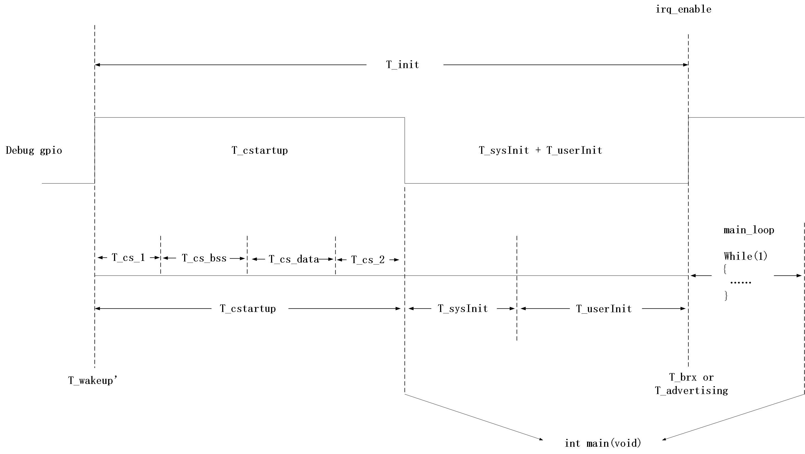

Based on earlier definition, T_wakeup is the starting point of next Adv Event/Brx Event, and T_wakeup’ is MCU early wake_uptime.

After wake_up, MCU will execute cstatup_xxx.S, jump to main() to start system initialization followed by user initialization, and then enter main_loop. Once getting in main_loop, it can start processing of Adv Event/Brx Event. The end of T_userInit is the starting point of Adv Event/Brx Event, or T_brx/T_advertising as shown in above diagram. “irq_enable” in the diagram is the separation between T_userInit and main_loop, matching the code in the SDK.

In the SDK, T_sysInit includes execution time of cpu_wakeup_init, rf_drv_init, gpio_init and clock_init. These timing parameters have been optimized in the SDK by placing the associated code into the ram_code.

T_cstatup and T_userInit in the SDK are elaborated herein.

(2) T_userInit

User initialization is executed at power on, deepsleep wake_up, and deepsleep retention wake_up.

For applications without deepsleep retention mode, user initialization does not need to differentiate between deepsleep retention wake_up and power on/ deepsleep wake_up.

```C
void user_init(void);
```

For applications with deepsleep retention mode, to reduce power, T_userInit needs to be as short as possible as explained earlier, so deepsleep retention wake_up would be different from power on / deepsleep wakeup. 

Initialization tasks in the user_init falls into 2 categories: initialization of hardware registers, and initialization of logic variables in SRAM.

Since in deepsleep retention mode first 32K or 64K SRAM is non-volatile, logic variables can be defined as retention_data to save time for initialization. Since registers cannot retain data across deepsleep retention, re-initialization is required for registers.

In summary, for deepsleep retention wake_up, user_init_deepRetn applies; while for power on and deepsleep wake_up, user_init_normal function applies, as shown in following code:

```C
int deepRetWakeUp = pm_is_MCU_deepRetentionWakeup();
	if( deepRetWakeUp ){
		user_init_deepRetn ();
	}
	else{
		user_init_normal ();
	}
```

The user can compare the implementation of these two functions. The following is the implementation of the user_init_deepRetn function in the SDK demo "B91_ble_sample".

```C
_attribute_ram_code_ void user_init_deepRetn(void)
{
#if (PM_DEEPSLEEP_RETENTION_ENABLE)
	blc_ll_initBasicMCU();   //mandatory
	rf_set_power_level_index (MY_RF_POWER_INDEX);
	blc_ll_recoverDeepRetention();

	irq_enable(); #endif
}
```

First 3 lines (from blc_ll_initBasicMCU(); to blc_ll_recoverDeepRetention();) are mandatory BLE initialization of hardware registers.

The blc_ll_recoverDeepRetention() is to recover software and hardware state at Link Layer by low level stack.

User is not recommended to modify these lines.

The GPIO wakeup configuration and LED state setting in the demo “B91_ble_sample” are hardware initialization. The UART hardware register state in the demo “B91_module” needs to re-initialize.

On top of SDK demo, if additional items are added to user initialization, following judgement is recommended:

- If it is SRAM variable, put it to the “retention_data” section by adding the keyword “_attribute_data_retention_”, so as to save re-initialization time after deepsleep retention wake_up. Then it can be run at user_init_normal function.

- If it is hardware register, it should be placed inside user_init_deepRetn function.

With above implementation, after deepsleep retention wake_up, T_userInit is execution time of user_init_deepRetn. The SDK also tries to place these functions inside ram_code to save time. If deepsleep retention area allows, user should place added register initialization functions inside ram_code as well.

(3) T_userInit Optimization for Conn state slave role

TBD

(4) T_cstartup

T_cstartupis the execution time of cstartup_xxx.S, e.g. cstartup_B91.S in the SDK.

T_cstartup has 4 components, in time sequence：

T_cstartup = T_cs_1 + T_cs_bss + T_cs_data + T_cs_2

T_cs_1 and T_cs_2 are fixed timing which user is not allowed to modify.

T_cs_data is initialization of “data” sector in SRAM. “data” is already initialized global variables with initial values stored in “data initial value” sector of flash. Therefore, T_cs_data is the time transferring “data” from flash “data initial value” sector to SRAM “data” sector. Corresponding assembly code is:

```C
/* Move Data from flash to sram */
_DATA_INIT:
    la     t1, _DATA_LMA_START
    la     t2, _DATA_VMA_START
    la     t3, _DATA_VMA_END
_DATA_INIT_BEGIN:
    bleu   t3, t2, _ZERO_BSS
    lw     t0, 0(t1)
    sw     t0, 0(t2)
    addi   t1, t1, 4
    addi   t2, t2, 4
    j      _DATA_INIT_BEGIN
```

Data transferring from flash is slow. As a reference, 16 bytes would take 7us. So more data are in “data” sector, the longer T_cs_data and T_init would be, or vice versa.

User can use method explained earlier to check size of "data" sector in list file. 

If “data” sector is too big and there is enough space in deepsleep retention area, user can add the keyword “_attribute_data_retention_” to place some of the variables in “data” sector into “retention_data” sector, so as to reduce T_cs_data and T_init.

T_cs_bss is time to initialize SRAM “bss” sector. Initial values of “bss” sector are all 0s. It’s only need to reset SRAM “bss” sector to 0, and no flash transferring is needed. Corresponding assembly code is：

```C
/* Zero .bss section in sram */
_ZERO_BSS:
    lui    t0, 0
    la     t2, _BSS_VMA_START
    la     t3, _BSS_VMA_END
_ZERO_BSS_BEGIN:
    bleu   t3, t2, _ZERO_AES
    sw     t0, 0(t2)
    addi   t2, t2, 4
    j      _ZERO_BSS_BEGIN
```

Resetting each word (4 byte) to 0 can be very fast. So when “bss” is small, T_cs_bss is very small. But if “bss” sector is large, for example when a huge global data array is defined (int AAA[2000] = {0})，T_cs_bss can also be very long. So it is worth paying attention to “bss” size in list file.

To optimize T_cs_bss when “bss” sector is large, if retention area allows, some of them can also be defined as “_attribute_data_retention_” to place in “retention_data” sector.

(5) T_init measurement

After T_cstartup and T_userInit are optimized to minimize T_init, it’s also needed to measure T_init, and apply to API: blc_pm_setDeepsleepRetentionEarlyWakeupTiming

T_init starts at the timing as T_cstartup, which is the “_reset” point in cstartup_B91.S file as shown below:

```C
_START:
#if 0
	// add debug, PB4 output 1
	lui		t0,0x80140 			//0x8014030a
	li		t1, 0xef
	li		t2, 0x10
	sb		t1 , 0x30a(t0)		 //0x8014030a  PB oen     =  0xef
	sb		t2 , 0x30b(t0)		 //0x8014030b  PB output  =  0x10
#endif  
```

Combined with the Debug gpio indication in the picture "T_init timing", the Debug GPIO PB4 output high operation is placed in "__start". The user only needs to change "#if 0" to "#if 1" to enable the PB4 output high operation.

T_cstartup finishes at “tjl main”.

```C
_MAIN_FUNC:
    nop
    la     t0, main
    jalr   t0
    nop
    nop
    nop
    nop
    nop
_END:
```

Since main function starts almost at the end of T_cstartup, PB4 can be set to output low at beginning of main function as shown below. Please note that DBG_CHN0_LOW requires enabling “DEBUG_GPIO_ENABLE” in app_config.h.

```C
_attribute_ram_code_ int main (void)    //must run in ramcode
{
	DBG_CHN0_LOW;   //debug
	sys_init();
	……
}
```

By scoping signal of PB4, T_cstartup is obtained.

Adding PB4 output high at end of T_userInit inside user_init_deepRetn will generate same timing diagram as Debug gpio as shown above. T_init and T_cstartup can be measured by oscilloscope or logic analyzer. Following understanding of GPIO operation, user can modify the Debug gpio code as needed, so as to get other timing parameters as well, e.g. T_sysInit, T_userInit etc.

### Connection Latency

#### Sleep timing with non-zero connection latency

The previous introduction to the sleep mode of Conn state slave role (refer to the figure "sleep timing for Advertising state & Conn state Slave role") is based on the premise that connection latency (conn_latency for short) does not take effect.

In the PM software processing flow, T_wakeup = T_brx + conn_interval, the corresponding code is as follows.

```C
if(conn_latency != 0)
	{	
		latency_use = bls_calculateLatency();	
		T_wakeup = T_brx + (latency_use +1) * conn_interval;
	}
	else
	{	
		T_wakeup = T_brx + conn_interval;
	}
```

When the BLE slave goes through the connection parameters update process and conn_latency takes effect, the sleep wake_up time is:

T_wakeup = T_brx + (latency_use +1) * conn_interval;

Following diagram illustrates sleep timing with non-zero conn_latency when latency_use= 2.

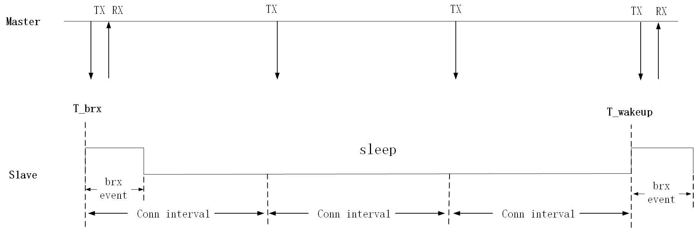

When conn_latency is not effective, the sleep duration is no more than 1 connection interval (generally small). After conn_latency becomes effective, the sleep time may have a relatively large value, such as 1S, 2S, etc., and the system power consumption can become very low. It makes sense to use deepsleep retention mode with lower power consumption during long sleep.

#### latency_use calculation

At effective conn_latency, T_wakeup is determined by latency_use, so it is not necessarily equal to conn_latency.

```C
latency_use = bls_calculateLatency();
```

In the calculation of latency_use, user_latency is involved. This is the value that the user can set. The API to be called and its source code are:

```C
void bls_pm_setManualLatency(u16 latency)
{
	bltPm.user_latency = latency;
}
```

Initial value of bltPm.user_latency is 0xFFFF, and at the end of blt_brx_sleep function it will be reset to 0xFFFF, which means the value set by the API bls_pm_setManualLatency is only valid for latest sleep, so it needs to be set on every sleep event.

The calculation process of latency_use is as follows.

First calculate the system latency:

(1) If connection latency=0，system latency=0

(2) If connection latency > 0：

- If system task is not done in current connection interval, MCU needs to wake up on next connection interval to continue the task such as transfer packet not completely sent out, or handle data from master not fully processed yet, and under this scenario, system latency=0.

- If no task is left over, system latency = connection latency. However, if slave receives master’s update map request or update connection parameter request, and its updated timing is before (connection latency+1)*interval, then the actual system latency would force MCU to wake up before the updated timing point to ensure correct BLE timing sequence.

Combining user_latency and system_latency:

latency_use = min(system latency, user_latency)

Accordingly, if user_latency set by the API bls_pm_setManualLatency is less than system latency, user_latency would be the final latency_use; otherwise, system latency is the final latency_use.

### API bls_pm_getSystemWakeupTick

Following API is used to obtain wakeup time out of suspend (System Timer tick), or T_wakeup:

```C
u32 bls_pm_getSystemWakeupTick(void);
```

According to blt_brx_sleep explanation in 4.2.7.2, T_wakeup is calculated fairly late, almost next to cpu_sleep_wakeup. Application layer can only get an accurate T_wakeup by BLT_EV_FLAG_SUSPEND_ENTER event callback function.

Following keyscan example explains usage of BLT_EV_FLAG_SUSPEND_ENTER event callback function and bls_pm_getSystemWakeupTick.

```C
bls_app_registerEventCallback(BLT_EV_FLAG_SUSPEND_ENTER, &ble_remote_set_sleep_wakeup); 			
void ble_remote_set_sleep_wakeup (u8 e, u8 *p, int n)
{
	if( blc_ll_getCurrentState() == BLS_LINK_STATE_CONN &&				((u32)(bls_pm_getSystemWakeupTick() - clock_time())) >
				80 * CLOCK_SYS_CLOCK_1MS){
		bls_pm_setWakeupSource(PM_WAKEUP_PAD);
	}
}
```

Above callback function is meant to prevent loss of key press.

A normal key press lasts for a few hundred ms, or at least 100~200ms for a fast press. When Advertising state and Conn state are configured by bls_pm_setSuspendMask to enter sleep mode, without conn_latency in effect, as long as Adv interval or conn_interval is not very long, typically less than 100ms, sleep time will not exceed Adv Interval or conn_interval, in other words, sleep time is less than 100ms or a fast key press time, loss of key press can be prevented and there is no need to enable GPIO wakeup.

With conn_latency ON, for example, with conn_interval = 10ms, connec_latency = 99, sleep time may last 1s, obviously key loss may occur. If current state is Conn state and wakeup time of suspend to be entered is more than 80ms from current time as determined by BLT_EV_FLAG_SUSPEND_ENTER callback function, key loss can be prevented by using GPIO level trigger to wake up MCU for keyscan process in case timer wakeup is too late.

## Issues in GPIO Wake-up

In B91, GPIO wakeup is level triggered instead of edge triggered, so when GPIO PAD is configured as wakeup source, for example, suspend wakeup triggered by GPIO high level, MCU needs to make sure when MCU invokes cpu_sleep_wakeup to enter suspend, that the wakeup GPIO is not at high level. Otherwise, once entering cpu_sleep_wakeup, it would exit immediately and fail to enter suspend.

If the above situation occurs, it may cause unexpected problems. For example, the MCU is awakened after entering deepsleep, and the program is re-executed. As a result, the MCU cannot enter deepsleep, causing the code to continue to run, which is not the state we expected, and the flow of the entire program may be messed up.

Users should pay attention to avoid this problem when using Telink's GPIO PAD wakeup.

If the APP layer does not avoid this problem, and GPIO PAD wakeup source is already effective at invoking of cpu_sleep_wakeup, PM driver makes some improvement to avoid flow mess:

(1) Suspend & deepsleep retention mode

For both suspend and deepsleep retention mode, the SW will fast exit cpu_sleep_wakeup with two potential return values:

- Return WAKEUP_STATUS_PAD if the PM module has detected effective GPIO PAD state.

- Return STATUS_GPIO_ERR_NO_ENTER_PM if the PM module has not detected effective GPIO PAD state.
  
(2) deepsleep mode

For deepsleep mode, PM diver will reset MCU automatically in bottom layer (equivalent to watchdog reset). The SW restarts from “Run hardware bootloader”.

To prevent this problem, following is implemented in the SDK demo.

In BLT_EV_FLAG_SUSPEND_ENTER, it is configured that only when suspend time is larger than a certain value, can GPIO PAD wakeup be enabled.

```C
void ble_remote_set_sleep_wakeup (u8 e, u8 *p, int n)
{
	if( blc_ll_getCurrentState() == BLS_LINK_STATE_CONN && ((u32)(bls_pm_getSystemWakeupTick() - clock_time())) >
				80 * CLOCK_SYS_CLOCK_1MS){
		bls_pm_setWakeupSource(PM_WAKEUP_PAD);
	}
}
```

When key is pressed, manually set latency to 0 or a small value (as shown in below code), so as to ensure short sleep time, e.g. shorter than 80ms as set in above code. Therefore, the high level on drive pin due to a pressed key will never become a high-level GPIO PAD wakeup trigger.

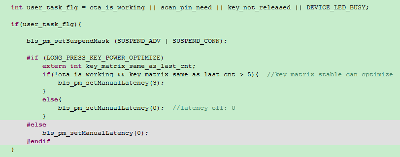

There are 2 scenarios that will make MCU enter deepsleep.

- First one is if there’s no event for 60s, MCU will enter deepsleep.

- The other scenario is if a key is stuck for more than 60s, MCU will enter deepsleep. Under the second scenario, the SDK will invert polarity from high level trigger to low level trigger to solve the problem.

## BLE System Low Power Management

Based upon understanding of PM principle of this BLE SDK, user can configure PM under different application scenarios, referring to the demo “B91 ble sample” low power management code as explained below.

Function blt_pm_proc is added in PM configuration of main_loop. This function must be placed at the end of main_loop to ensure it is immediate to blt_sdk_main_loop in time, since blt_pm_proc needs to configure low power management according to different UI entry tasks.  

Summary of highlights in blt_pm_proc function：

(1) When UI task requires turning off sleep mode, such as audio (ui_mic_enable) and IR, set bltm.suspend_mask to SUSPEND_DISABLE.

(2) After advertising for 60s in Advertising state, MCU enters deepsleep with wakeup source set to GPIO PAD in user initialization. 60s timeout is determined by software timer using advertise_begin_tick variable to capture advertising start time.

The design of 60s into deepsleep is to save power, prevent slave wasting power on advertising even when not connected with master. User can justify 60s setting based on different applications.

(3) At Conn state slave role, under conditions of no key press, no audio or LED task for over 60s from last task, MCU enters deepsleep with GPIO PAD as wakeup source, and at the same time set DEEP_ANA_REG0 label in deepsleep register, so that once after wakeup slave will connect quickly with master.

The design of 60s into deepsleep is to save power. Actually if power consumption under connected state is tuned low enough as with deepsleep retention, it is not absolutely necessary to enter deepsleep.

To enter deepsleep at Conn state slave role, slave first issues a TERMINATE command to master by calling bls_ll_terminateConnection, after receiving ack which triggers BLT_EV_FLAG_TERMINATEcallback function, slave will enter deepsleep. If slave enters deepsleep without sending any request, since master is still at connected state and would constantly try to synchoroniz with slave till connection timeout. The connection timeout could be a very large value, e.g. 20s. If slave wakes up before 20s, slave would send advertising packet attempting to connect with master. But since master would assume it is already in connected state, it would not be able to connect to slave, and user experience is therefore very slow reconnection.

(4) If certain task can not be disrupt by long sleep time, user_latency can be set to 0, so latency_use is 0.

Under applications such as key_not_released, or DEVICE_LED_BUSY, call API bls_pm_setManualLatency to set user_latency to 0. When conn_interval is 10ms, sleep time is no more than 10ms.

(5) For scenario as in item 4, with latency set to 0, slave will wakeup at every conn interval, power might be unnecessarily too high since key scan and LED task does not repeat on every conn interval. Further power optimization can be done as following:

When LONG_PRESS_KEY_POWER_OPTIMIZE=1, once key press is stable (key_matrix_same_as_last_cnt > 5), manually set latency. With bls_pm_setManualLatency (3), sleep time will not exceed 4 *conn_interval. If conn_interval=10 ms, MCU will wake up every 40ms to process LED task and keyscan.

User can tweak this approach toward different conn intervals and task response time requirements.

## Timer Wake-up by Application Layer

At Advertising state or Conn state Slave role, without GPIO PAD wakeup, once MCU enters sleep mode, it only wakes up at T_wakeup pre-determined by BLE SDK. User can not wake up MCU at an earlier time which might be needed at certain scenario. To provide more flexibility, application layer wakeup and associated callback function are added in the SDK:

Application layer wakeup API:

```C
void  bls_pm_setAppWakeupLowPower(u32 wakeup_tick, u8 enable);
```

“wakeup_tick” is wakeup time at System Timer tick value.

“enable”: 1-wakeup is enabled; 0-wakeup is disabled.

Registered call back function bls_pm_registerAppWakeupLowPowerCb is executed at application layer wakeup：

```C
typedef 	void (*pm_appWakeupLowPower_callback_t)(int);
void 		bls_pm_registerAppWakeupLowPowerCb(pm_appWakeupLowPower_callback_t cb);
```

Take Conn state Slave role as an example:

When the user uses bls_pm_setAppWakeupLowPower to set the app_wakeup_tick for the application layer to wake up regularly, the SDK will check whether app_wakeup_tick is before T_wakeup before entering sleep.

- If app_wakeup_tick is before T_wakeup, as shown in the figure below, it will trigger sleep in app_wakeup_tick to wake up early;

- If app_wakeup_tick is after T_wakeup, MCU will still wake up at T_wakeup.

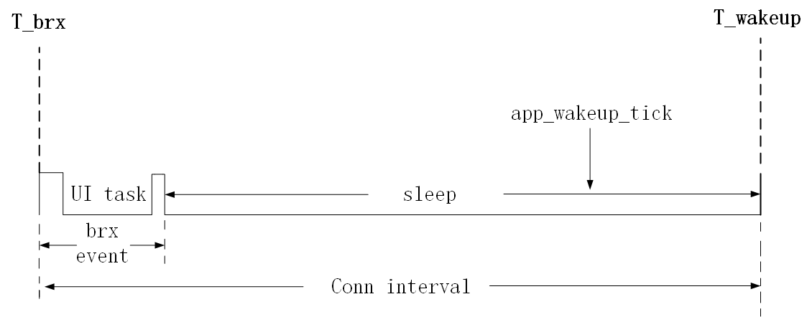

\newpage
# Low Battery Detect

Battery power detect/check, which may also appear in the Telink BLE SDK and related documentation under other names, includes: battery power detect/check, low battery detect/check low power detect/check), battery detect/check, etc. For example, the relevant files and functions in the SDK are named battery_check, battery_detect, battery_power_check, etc.

This document is unified under the name of "low battery detect".

## The importance of low battery detect

For battery-powered products, as the battery power will gradually drop, when the voltage is low to a certain value, it will cause many problems.

a) The operating voltage range of B91 chip is 1.8V~4.3V. When the voltage is lower than 1.8V, B91 chip can no longer guarantee stable operation.

b) When the battery voltage is low, due to the unstable power supply, the "write" and "erase" operations of Flash may have the risk of error, causing the program firmware and user data to be modified abnormally, and eventually causing the product to fail. Based on our previous mass production experience, we set the low voltage threshold for this risk to 2.0V.

According to the above description, for battery-powered products, a secure voltage must be set, and the MCU is allowed to continue working only when the voltage is higher than this secure voltage; once the voltage falls below the secure voltage, the MCU stops running and needs to be shutdown immediately (this is achieved by entering deepsleep mode on the SDK).

The secure voltage is also called alarm voltage, and the value of this voltage is 2.0 V by default in the SDK . If the user has an unreasonable design in the hardware circuit, resulting in the deterioration of the stability of the power network, the secure voltage value needs to be increased, such as 2.1 V, 2.2 V, etc.

For the product developed and implemented using Telink BLE SDK, as long as the use of battery power, low power detection must be a real-time operation of the task for the product's entire life cycle to ensure the stability of the product.

## The implementation of low battery detect

The low battery detect requires the use of ADC to measure the power supply voltage. Users can refer to the B91 Datasheet and Driver SDK Developer Handbook chapter on ADC to get the necessary understanding of the B91 ADC module first.

The implementation of the low battery detect is described in the SDK demo "B91_ble_sample", refer to the files battery_check.h and battery_check.c.

Make sure the macro "BATT_CHECK_ENABLE" is enabled in app_config.h. This macro is disabled by default, and users need to pay attention to it when using the low battery detect function.

```C
#define BATT_CHECK_ENABLE					1
```

### Notes on low battery detect

Low battery detect is a basic ADC sampling task, and there are a number of issues that need attention when implementing an ADC to sample the supply voltage, as described below.

#### GPIO input channel recommended

The sampling method of B91 chip can be sampled by Vbat or GPIO analog signal input. However, the sampling accuracy of Vbat channel is poor, and it is recommended to sample by external GPIO method for high sampling accuracy requirement.

- 3/4 external resistor divider (total resistance value of 400k, without any capacitance)

- 1.2V Vref reference voltage

- 1/4 pre_scale factor

- Sampling frequency below 48K

The available GPIO input channels are the input channels corresponding to PB0~PB7, PD0, PD1.

```C
typedef enum{
	ADC_GPIO_PB0 = GPIO_PB0 | (0x1<<12),
	ADC_GPIO_PB1 = GPIO_PB1 | (0x2<<12),
	ADC_GPIO_PB2 = GPIO_PB2 | (0x3<<12),
	ADC_GPIO_PB3 = GPIO_PB3 | (0x4<<12),
	ADC_GPIO_PB4 = GPIO_PB4 | (0x5<<12),
	ADC_GPIO_PB5 = GPIO_PB5 | (0x6<<12),
	ADC_GPIO_PB6 = GPIO_PB6 | (0x7<<12),
	ADC_GPIO_PB7 = GPIO_PB7 | (0x8<<12),
	ADC_GPIO_PD0 = GPIO_PD0 | (0x9<<12),
	ADC_GPIO_PD1 = GPIO_PD1 | (0xa<<12),
}adc_input_pin_def_e;
```

Use GPIO input channel for ADC sampling of power supply voltage, its specific use is as follows.

In the hardware circuit design, the power supply is directly connected to the GPIO input channel, and the ADC is initialized by setting the GPIO to high resistance (ie, oe, output all set to 0), at which time the voltage on the GPIO is equal to the power supply voltage, and ADC sampling can be performed directly.

User can switch the GPIO input channel through the macro in app_config.h of B91 sample, choose PB7 as GPIO input channel, PB7 as ordinary GPIO function, initialize all states (ie, oe, output) using the default state, no special modification. In the demo, PB0 is selected as the GPIO input channel by default.

```C
	#define PB0_FUNC					AS_GPIO
	#define PB0_INPUT_ENABLE			0
	#define PB0_OUTPUT_ENABLE			0
	#define PB0_DATA_OUT				0
	#define ADC_INPUT_PIN_CHN			ADC_GPIO_PB0
```

#### Differential mode only

Although the B91 ADC input mode supports both Single Ended Mode and Differential Mode, for some specific reasons, Telink specifies that only Differential Mode can be used, and Single Ended Mode is not allowed.

The differential mode input channel is divided into positive input channel and negative input channel, the measured voltage is the voltage difference obtained by subtracting the negative input channel voltage from the positive input channel voltage.  

If the ADC sample has only one input channel, when using differential mode, set the current input channel as the positive input channel and GND as the negative input channel, so that the voltage difference between the two is equal to the positive input channel voltage. 

The differential mode is used in SDK low battery detect, the interface function is as follows.

```C
adc_set_diff_input(ADC_INPUT_PIN_CHN>>12, GND);
```

#### Need to switch different ADC tasks

The Misc channel is used for low battery detect as the most basic ADC sampling. Users need to use the Misc channel if they need other ADC tasks besides low battery detect. The low battery detect cannot run simultaneously with other ADC tasks and must be implemented by switching.

### Stand-alone use of low battery detect

In the SDK demo, both B91_ble_sample and B91_module project implement the low battery detect function, user needs to enable the low battery detect function in battery_check.h to use.

#### Low battery detect initialization

Refer to the implementation of the adc_bat_detect_init function.

The order of ADC initialization must satisfy the following procedure: first power off sar adc, then configure other parameters, and finally power on sar adc. All initialization of ADC sampling must follow this flow.

```C
_attribute_ram_code_ void adc_bat_detect_init(void)
{ 
	adc_power_off();  // power off sar adc
……              // add ADC Configuration
adc_power_on();  // power on sar adc
} 
```

For the configuration before sar adc power on and power off, the user try not to modify, and use the default settings. If users choose a different GPIO input channel, directly modify the app_config.h related macro definition described earlier.

The adc_bat_detect_init initialization function is called in app_battery_power_check with the following code:

```C
if(!adc_hw_initialized){
	adc_hw_initialized = 1;
	adc_bat_detect_init();
	}
```

Here a variable adc_hw_initialized is used, which is called once only when it is 0 and set to 1; it is not initialized again when it is 1. The adc_hw_initialized is also manipulated in the following API.

```C
void battery_set_detect_enable (int en)
{
	lowBattDet_enable = en;
	if(!en){
		adc_hw_initialized = 0;   //need initialized again
	}
}
```

The functions that can be implemented by a design using adc_hw_initialized are:

a) Switching with other ADC task

The effect of sleep mode (suspend/deepsleep retention) is not considered first, and only the switching between low battery detect and other ADC tasks is analyzed.

Because of the need to consider the switch between low battery detect and other ADC tasks, adc_bat_detect_init may be executed several times, so it cannot be written to user initialization and must be implemented in main_loop.

The first time the app_battery_power_check function is executed, adc_bat_detect_init is executed and will not be executed repeatedly.

Once the "ADC other task" needs to be executed, it will take away the ADC usage and make sure that the "ADC other task" must call battery_set_detect_enable(0) when it is initialized, which will clear adc_hw_initialized to 0.

When the "ADC other task" is finished, the right to use the ADC is handed over. The app_battery_power_check is executed again, and since the value of adc_hw_initialized is 0, adc_bat_detect_init must be executed again. This ensures that the low battery detect is reinitialized each time it is switched back.

b) Adaptive handling of suspend and deepsleep retention

Take sleep mode into account.

The adc_hw_initialized variable must be defined as a variable on the "data" or "bss" segment, not on the retention_data. Defining it on the "data" segment or "bss" ensures that this variable is used after each deepsleep retention wake_up when the software bootloader is executed (i.e., cstartup_xxx. S) will be re-initialized to 0; after sleep wake_up, this variable can be left unchanged.

The common feature of the register configured inside the adc_bat_detect_init function is that it does not power down in suspend mode and can maintain the state; it will power down in deepsleep retention mode.

If the MCU enters into suspend mode, when it wakes up and executes app_battery_power_check again, the value of adc_hw_initialized is the same as before suspend, so there is no need to re-execute the adc_vbat_detect_init function.

If the MCU enters deepsleep retention mode and wakes up with adc_hw_initialized to 0, adc_bat_detect_init must be re-executed and the ADC-related register state needs to be reconfigured.

The state of register set in the adc_bat_detect_init function can be kept from powering down during the suspend.

The keyword "_attribute_ram_code_" is added to the adc_bat_detect_init function in the SDK to set it to ram_code, with the ultimate goal of optimizing power consumption for long sleep connection states. For example, for a typical long sleep connection of 10ms * (99+1) = 1s, waking up every 1s and using deepsleep retention mode during long sleep, adc_bat_detect_init must be executed again after each wake-up, and the execution speed will become faster after adding to ram_code.

This "_attribute_ram_code_" is not required. In the product application, the user can decide whether to put this function into ram_code based on the usage of the deepsleep retention area and the results of the power test.

#### Low battery detect processing

In main_loop, the app_battery_power_check function is called to implement the processing of low battery detect, and the related code is as follows.

```C
_attribute_data_retention_	u8 		lowBattDet_enable = 1;
							u8      adc_hw_initialized = 0;
void battery_set_detect_enable (int en)
{
	lowBattDet_enable = en;

	if(!en){
		adc_hw_initialized = 0;   //need initialized again
	}
}
int battery_get_detect_enable (void)
{
	return lowBattDet_enable;
}
	if(battery_get_detect_enable() && clock_time_exceed(lowBattDet_tick, 500000) ){
		lowBattDet_tick = clock_time();
app_battery_power_check(bat_deep_thres,bat_suspend_thres);
}
```

The default value of lowBattDet_enable is 1. Low battery detect is allowed by default, and the MCU can start low battery detect immediately after powering up. This variable needs to be set to retention_data to ensure that deepsleep retention cannot modify its state.

The value of lowBattDet_enable can only be changed when other ADC tasks need to seize ADC usage: when other ADC tasks start, battery_set_detect_enable(0) is called, at this time app_battery_power_check is not called again in main_loop; After the other ADC tasks are finished, call battery_set_detect_enable(1) to surrender the right to use ADC, then the app_battery_power_check function can be called again in main_loop.

The frequency of low battery detect is controlled by the variable lowBattDet_tick, which is executed every 500ms in the demo. Users can modify this time according to their needs.

The app_battery_power_check function is put on ram_code, refer to the above description of "adc_vbat_detect_init" ram_code, also to save running time and optimize power consumption.

The "_attribute_ram_code_" is not necessary. In the product application, the user can decide whether to put this function into ram_code based on the usage of the deepsleep retention area and the results of the power test.

```C
_attribute_ram_code_ void app_battery_power_check(u16 threshold_deep_vol_mv, u16 threshold_suspend_vol_mv)
```

#### Low voltage alarm

The two parameters of app_battery_power_check are to specify the alarm voltage in mV for low battery detect. The first parameter is the threshold voltage for deepsleep, and the second parameter is the threshold voltage for suspend. According to the previous content, the default setting in SDK is 2000 mV for deepsleep and 1800 mV for suspend. In the low voltage detection of main_loop, when the power supply voltage is lower than 1800 mV, it enters suspend, and when the power supply voltage is greater than 1800 mV but less than 2000 mV, it enters deepsleep mode.

The "B91_ble_sample" and "B91_ble_module" use the way to enter deepsleep to implement the shutdown MCU, and set the key to wake up.

After "B91_ble_sample" and "B91_ble_module" are shutdown, they enter the deepsleep mode where they can be woken up. If a key wake-up occurs, the SDK will do a quick low battery detect during user initialization instead of waiting until the main_loop. The reason for this process is to avoid application errors, as illustrated by the following example.

If the product user has been alerted by the flashing LED during the low power alarm and then wakes up again by entering deepsleep, it takes at least 500ms to do the low battery detect from the processing of main_loop. Before 500ms, the slave's broadcast packet has been sent for a long time, and it is likely to be connected to the master already. In this case, there is a bug that the device already having low power alarm continues to work again.

For this reason, the SDK must do the low battery detect in advance during user initialization, and must prevent the above situation from happening at this step. So add low battery detect during user initialization, and the function interface in the SDK is:

```C
void user_init_battery_power_check（void）
if(!deepRetWakeUp){
user_init_battery_power_check();
}
```

In user_init_battery_power_check function, the macro BAT_LEAKAGE_PROTECT_EN is used to make a distinction, by default the macro is enabled, mainly based on the previous low battery detection into sleep voltage and then increase 200mV to detect; after disabling the macro, the fixed setting value such as the original setting of low battery detection 2000mV and then increase 200mV to detect. The reason is that when the fast low battery detection after the shutdown mode wakes up, the alarm voltage will be adjusted slightly higher, and the adjustment is slightly higher than the maximum error of low battery detection, so it is necessary to make the setting to increase the voltage detected when waking up. Generally, only when a certain low battery detection found that the voltage is lower than 2000mV into the shutdown mode, there will be a recovery voltage of 2200mV, so the user does not have to worry about this 2200mV will cause false alarm low voltage for the actual voltage of 2V ~ 2.2V products.

### Low battery detect and Amic Audio

Referring to the detailed introduction in Low Battery Detect Stand-alone Use mode, for products that need to implement Amic Audio, just switch between Low Battery Detect and Amic Audio.

According to the low battery detection stand-alone use mode, after the program starts running, the default low battery detection is enabled first. When Amic Audio is triggered, do the following two things.

(1) Disable low battery detection

Call battery_set_detect_enable(0) to inform the low battery detect module that the ADC resources have been seized.

(2) Amic Audio ADC initialization

Since the ADC is used in a different way than the low battery detection, the ADC needs to be initialized again. For details, refer to the "Audio" section of this document.

At the end of Amic Audio, battery_set_detect_enable(1) is called to inform the low battery detect module that the ADC resources have been released. At this point the low battery detection needs to reinitialize the ADC module and then start the low battery detection.

If it is low battery detection and other non-Amic Audio ADC tasks at the same time, the processing of other ADC tasks can imitate the processing flow of Amic Audio.

If there are three kinds of tasks at the same time: low battery detection, Amic Audio and other ADC tasks, user can refer to the method of switching between low battery detection and Amic Audio to implement them according to the principle of "switching if ADC circuit needs".

\newpage
# Audio

The source of Audio can be AMIC or DMIC.

- DMIC is a chip that directly uses peripheral audio processing to read digital signals onto B91;

- AMIC needs to use the codec module inside B91 to sample and post-process the original Audio signal, and finally convert it into a digital signal and transmit it to the MCU.

## Initialization

### AMIC and Low Power Detect

The current version does not support this function, and future versions will support it.

### AMIC Initialization

Refer to the SDK demo B91 feature "feature_audio" speech processing related code.

```C
	void ui_enable_mic (int en)
	{
		ui_mic_enable = en;

		#if (BLT_APP_LED_ENABLE)
			device_led_setup(led_cfg[en ? LED_AUDIO_ON : LED_AUDIO_OFF]);
		#endif
		gpio_write(GPIO_LED_BLUE,en);
		if(en){  //audio on
			///////////////////// AUDIO initialization///////////////////
			#if (MICPHONE_SELECT == BLE_DMIC_SELECT)  //Dmic config
				audio_dmic_init();
			#else  //Amic config
				audio_amic_init();
			#endif
		}
		else{  //audio off
			#if (MICPHONE_SELECT == BLE_DMIC_SELECT)  //Dmic config
				audio_mic_off();
			#else  //audio off
				audio_mic_off();
			#endif
		}

		#if (BATT_CHECK_ENABLE)
			battery_set_detect_enable(!en);
		#endif
	}
```

In the function “ui_enable_mic”, the parameter “en” serves to enable (1) or disable (0) Audio task.

At the beginning of Audio, the TL_MICBIAS pin has been configured in audio_amic_init() by default to output a high level to drive AMIC, and users can use it directly without reconfiguration.

Following shows AMIC initialization setting:

```C
void audio_amic_init(void)
{
	audio_set_codec_in_path_a_d_gain(CODEC_IN_D_GAIN_20_DB,CODEC_IN_A_GAIN_0_DB);//recommend setting dgain:20db,again 0db
	audio_init(AMIC_IN_TO_BUF_TO_LINE_OUT ,AUDIO_16K,MONO_BIT_16);
	audio_rx_dma_chain_init(DMA2,(u16*)buffer_mic,TL_MIC_BUFFER_SIZE);
}
```

In the working process of Audio, the data in codec is continuously copied to SRAM through DMA. audio_rx_dma_chain_init is used to configure the buffer and length of the Audio data stored in the SRAM, and configure it into a circular linked list structure to store the Audio data. The user can refer to the current SDK method to align the four-byte buffer_mic when defining the buffer_mic.

audio_set_codec_in_path_a_d_gain is used to configure the Audio gain. The setting range of codec_in_path_digital_gain_e is 0-43db, and the user can configure it as needed.

The configuration of Buffer_mic is handled in the ui_enable_mic function, which is equivalent to doing it again every time Audio starts. The reason is that the configured register will be lost during sleep.

After the Audio task is over, the codec ADC must be closed to prevent leakage:

```C
audio_codec_adc_power_down ();
```

The execution of the Audio task is placed in the UI entry part of the main_loop.

```C
	if(ui_mic_enable){
		if(audio_start || (audio_stick && clock_time_exceed(audio_stick, 380*1000))){
			audio_start = 1;
			task_audio();
		}
	}
	else{
		audio_start = 0;
	}
```

### DMIC Initialization

Enable the macro "BLE_DMIC_ENABLE" and set it to DMIC working mode, the initial configuration of DMIC is as follows:

```C
void audio_dmic_init()
{
	audio_set_codec_in_path_a_d_gain(CODEC_IN_D_GAIN_20_DB,CODEC_IN_A_GAIN_0_DB);
	audio_set_dmic_pin(DMIC_D4_DAT_D5_CLK);
	audio_init(DMIC_IN_TO_BUF ,AUDIO_16K,MONO_BIT_16);
	audio_rx_dma_chain_init(DMA2,(u16*)&buffer_mic,TL_MIC_BUFFER_SIZE);
}
```

For the Mic_buffer and voice gain section, please refer to Amic's explanation. The user needs to configure the clk pin and dat pin of DMIC through audio_set_dmic_pin. There are DMIC_GROUPB_B2_DAT_B3_B4_CLK, DMIC_GROUPC_C1_DAT_C2_C3_CLK and DMIC_GROUPD_D4_D6_D for selection.

## Audio Data Processing

### Audio Data Volume and RF Transfer

The raw data sampled by AMIC adopt pcm format. The demo currently provides three compression algorithms, sbc, msbc and adpcm, with adpcm using the pcm-to-adpcm algorithm to compress the raw data into adpcm format with compression ratio of 25%, thus BLE RF data volume will be decreased largely. Master will decompress the received adpcm-format data back to pcm format.

AMIC sampling rate is 16K x 16bits, corresponding to 16K samples of raw data per second, i.e. 16 samples per millisecond (16*16bits=32bytes per ms).

For every 15.5ms, 496-byte (15.5*16=248 samples) raw data are generated. Via pcm-to-adpcm convertion with compression ratio of 1/4, the 496-byte data are compressed into 124 bytes.

The 128-byte data, including 4-byte header and 124-byte compression result, will be disassembled into five packets, and sent to Master in L2CAP layer; since the maximum length of each packet is 27 bytes, the first packet must contain 7-byte l2cap information, including: 2-byte l2caplen, 2-byte chanid, 1-byte opcode and 2-byte AttHandle.

Figure below shows the RF data captured by sniffer. The first packet contains 7-byte extra information and 20-byte audio data, followed by four packets with 27-byte audio data each. As a result, total audio data length is 20 + 27*4 = 128 bytes.

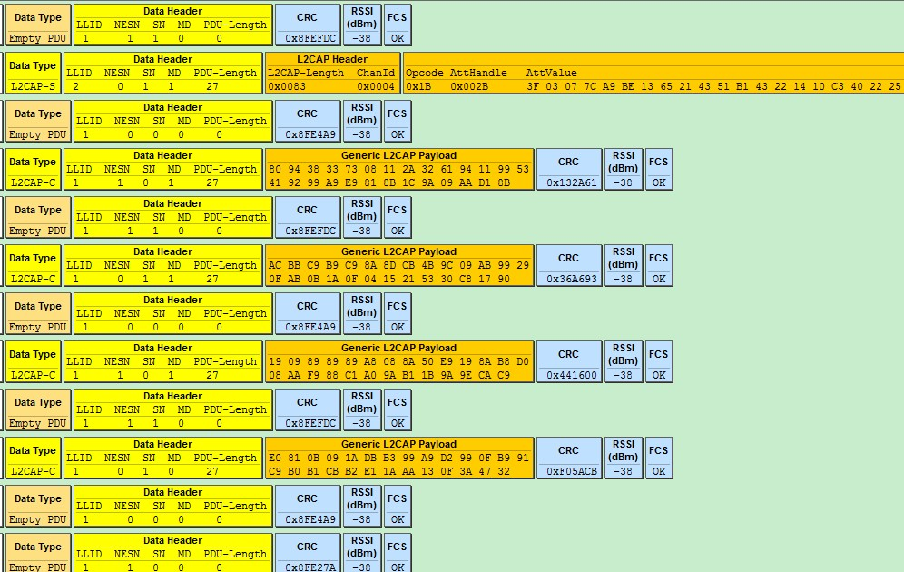

According to “Exchange MTU size” in ATT & GATT (section 3.3.3 ATT & GATT), since 128-byte long audio data packet are disassembled on Slave side, if peer device needs to re-assemble these received packets, we should determine maximum ClientRxMTU of peer device. Only when “ClientRxMTU” is 128 or above, can the 128-byte long packet of Slave be correctly processed by peer device. In the Telink BLE SDK described in the previous section 3.2.8, when the slave end sets the Rx MTU size in the main function call blc_att_setRxMtuSize(), if the size is greater than 23, it will actively perform the upstream MTU and update the DLE.

Following is the audio service in Attribute Table:

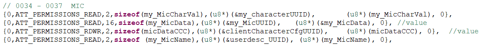

The second Attribute above is used to transfer audio data. This Attribute uses “Handle Value Notification” to send Data to Master. After Master receives Handle Value Notification, the Attribute Value data corresponding to the five successive packets will be assembled into 128 bytes, and then decompressed back to the pcm-format audio data.

### Audio Data Compression

Related macros are defined in the “audio_config.h”, as shown below:

```C
	#if (TL_AUDIO_MODE == TL_AUDIO_RCU_ADPCM_GATT_TLEINK)
		#define	ADPCM_PACKET_LEN				128
		#define TL_MIC_ADPCM_UNIT_SIZE			248
		#define	TL_MIC_BUFFER_SIZE				992
	#elif (TL_AUDIO_MODE == TL_AUDIO_RCU_ADPCM_GATT_GOOGLE)
		#define	ADPCM_PACKET_LEN				136		//(128+6+2)
		#define TL_MIC_ADPCM_UNIT_SIZE			256
		#define	TL_MIC_BUFFER_SIZE				1024
	#elif (TL_AUDIO_MODE == TL_AUDIO_RCU_ADPCM_HID_DONGLE_TO_STB)
		#define	ADPCM_PACKET_LEN				120
		#define TL_MIC_ADPCM_UNIT_SIZE			240
		#define	TL_MIC_BUFFER_SIZE				960
	#elif (TL_AUDIO_MODE == TL_AUDIO_RCU_ADPCM_HID)
		#define	ADPCM_PACKET_LEN				120
		#define TL_MIC_ADPCM_UNIT_SIZE			240
		#define	TL_MIC_BUFFER_SIZE				960
	#elif (TL_AUDIO_MODE == TL_AUDIO_RCU_SBC_HID_DONGLE_TO_STB)
		#define	ADPCM_PACKET_LEN				20
		#define MIC_SHORT_DEC_SIZE				80
		#define	TL_MIC_BUFFER_SIZE				320
	#elif (TL_AUDIO_MODE == TL_AUDIO_RCU_SBC_HID)
		#define	ADPCM_PACKET_LEN				20
		#define MIC_SHORT_DEC_SIZE				80
		#define	TL_MIC_BUFFER_SIZE				320
	#elif (TL_AUDIO_MODE == TL_AUDIO_RCU_MSBC_HID)
		#define	ADPCM_PACKET_LEN				57
		#define MIC_SHORT_DEC_SIZE				120
		#define	TL_MIC_BUFFER_SIZE				480
```

Each compression needs to process 248-sample, i.e. 496-byte data. Since AMIC continuously samples audio data and transfers the processed pcm-format data into buffer_mic, considering data buffering and preservation, this buffer should be pre-configured so that it can store 496 samples for two compressions. If 16K sampling rate is used, then 496 samples correspond to 992 bytes, i.e. “TL_MIC_BUFFER_SIZE” should be configured as 992.

“buffer_mic” is defined as below:

```C
s16 buffer_mic[TL_MIC_BUFFER_SIZE>>1]; //496 sample,992 bytes
audio_rx_dma_chain_init(DMA2,(u16*)buffer_mic,TL_MIC_BUFFER_SIZE);
```

Following shows the mechanism of data filling into buffer_mic via HW control.

Data sampled by AMIC are transferred into memory starting from buffer_mic address with 16K speed; once the maximum length 992 is reached, data transfer returns to the buffer_mic address, the old data will be replaced directly without checking whether it’s read. It’s needed to maintain a write pointer when transferring data into RAM; the pointer is used to indicate the address in RAM for current newest audio data.

The “buffer_mic_enc” is defined to store the 128-byte compression result data; the buffer number is configured as 4 to indicate result of up to four compressions can be buffered.

```C
int buffer_mic_enc[BUFFER_PACKET_SIZE];
```

Since “BUFFER_PACKET_SIZE” is 128, and “int” occupies four bytes, it’s equivalent to 128*4 signed char.

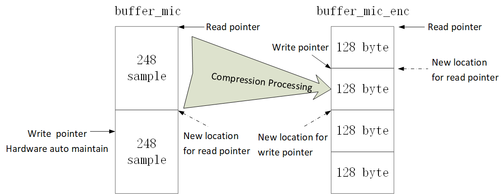

The figure above shows data compression processing method:

The buffer_mic automatically maintains a write pointer by hardware, and maintains a read pointer by software.

Whenever SW detects there’re 248 samples between the two pointers, the compression handler is invoked to read 248-sample data starting from the read pointer and compress them into 128 bytes; the read pointer moves to a new location to indicate following data are new and not read.

The buffer_mic is continuously checked whether there’re enough 248-sample data; if so, the data are compressed and transferred into the buffer_mic_enc.

Since 248-sample data are generated for every 15.5ms, the firmware must check the buffer_mic with maximum frequency of 1/15.5ms. The FW only executes the task_audio once during each main_loop, so the main_loop duration must be less than 15.5ms to avoid audio data loss. In Conn state, the main_loop duration equals connection interval; so for applications with audio task, connection interval must be less than 15.5ms. It’s recommended to configure connection interval as 10ms.

The buffer_mic_enc maintains a write pointer and a read pointer by software: after the 248-sample data are compressed into 128 bytes, the compression result are copied into the buffer address starting from the write pointer, and the buffer_mic_enc is checked whether there’s overflow; if so, the oldest 128-byte data are discarded and the read pointer switches to the next 128 bytes.

The compression result data are copied into BLE RF Tx buffer as below:

The buffer_mic_enc is checked if it’s non-empty (when writer pointer equals read pointer, it indicates “empty”, otherwise it indicates “non-empty); if the buffer is non-empty, the 128-byte data starting from the read pointer are copied into the BLE RF Tx buffer, then the read pointer moves to the new location.

The function “proc_mic_encoder” is used to process Audio data compression.

## Compression and Decompression Algorithm

B91 single connection SDK provides sbc, mscc and adpcm compression and decompression algorithms, the following mainly takes adpcm to explain the entire compression and decompression algorithm. About sbc and mscc, the user can refer to the project implementation to understand.

The function below is used to invoke the adpcm compression algorithm:

```C
void mic_to_adpcm_split (signed short *ps, int len, signed short *pds, int start);
```

- "ps" points to the starting storage address for data before compression, which corresponds to the read pointer location of the buffer_mic as shown in figure above;

- "len" is configured as “TL_MIC_ADPCM_UNIT_SIZE (248)”, which indicates 248 samples;

- "pds" points to the starting storage address for compression result data, which corresponds to the write pointer location of the buffer_mic_enc as shown in figure above.  

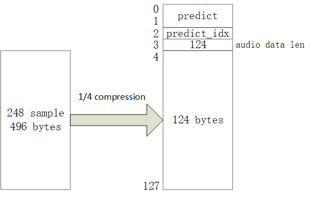

After compression, the data space stores 2-byte predict, 1-byte predict_idx, 1-byte length of current valid adpcm-format audio data (i.e. 124), and 124-byte data compressed from the 496-byte raw data with compression ratio of 1/4.

The function below is used to invoke the decompression algorithm:

```C
void adpcm_to_pcm (signed short *ps, signed short *pd, int len);
```

- "s" points to the starting storage address for data to be decompressed (i.e. 128-byte adpcm-format data). This address needs user to define a buffer to store 128-byte data copied from BLE RF.

- "pd" points to the starting storage address for 496-byte pcm-format audio data after decompression. This address needs user to define a buffer to store data to be transferred when playing audio.

- "len" is 248, same as the "len" during compression.

As shown in figure above, during decompression, the data read from the buffer are two-byte predict, 1-byte predict_idx, 1-byte valid audio data length "124", and the 124-byte adpcm-format data which will be decompressed into 496-byte pcm-format audio data.

## Audio data processing flow

The feature_audio project in B91 SDK's B91 feature contains a number of mode options, the user can select by changing the macro in app_config.h, the default is TL_AUDIO_RCU_ADPCM_GATT_TLEINK, that is, Telink custom Audio processing, its related settings are as follows. 

```C
/* Audio MODE:
 * TL_AUDIO_RCU_ADPCM_GATT_TLEINK
 * TL_AUDIO_RCU_ADPCM_GATT_GOOGLE
 * TL_AUDIO_RCU_ADPCM_HID
 * TL_AUDIO_RCU_SBC_HID
 * TL_AUDIO_RCU_ADPCM_HID_DONGLE_TO_STB
 * TL_AUDIO_RCU_SBC_HID_DONGLE_TO_STB
 * TL_AUDIO_RCU_MSBC_HID
 */
	#define TL_AUDIO_MODE					TL_AUDIO_RCU_ADPCM_GATT_TLEINK
```

Since several of these modes have similar processes and the default Telink customization is just a single compression of voice data for transmission, the whole process is relatively simple.

The TL_AUDIO_RCU_ADPCM_HID_DONGLE_TO_STB and TL_AUDIO_RCU_SBC_HID_DONGLE_TO_STB are two modes with similar implementation functions but different encoding. So this chapter mainly describes on TL_AUDIO_RCU_ADPCM_GATT_GOOGLE, TL_AUDIO_RCU_ADPCM_HID_DONGLE_TO_STB and TL_AUDIO_RCU_ADPCM_HID_DONGLE_TO_STB. Note that the B91 SDK only provides the demo program at Slave end, for master program user can refer to the master_kma_dongle project in the Vulture BLE SDK. This chapter describes the master-end related operations are referred to the Vulture BLE SDK.

**Note:**

> If in setting different modes, compile prompt error that XX function or variable lack of definition, this is due to the voice related lib library is not added, Users in the use of TL_AUDIO_RCU_ADPCM_GATT_GOOGLE, TL_AUDIO_RCU_MSBC_HID, TL_AUDIO_RCU_SBC_HID, respectively, need to add the corresponding library file, which corresponds to the library file as shown below.

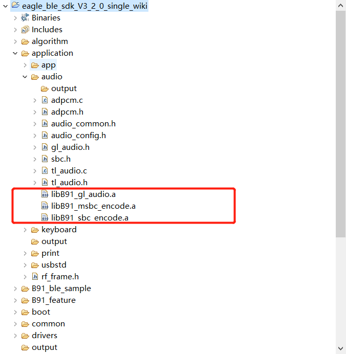

For example, if using SBC mode, the setting method is shown as below.

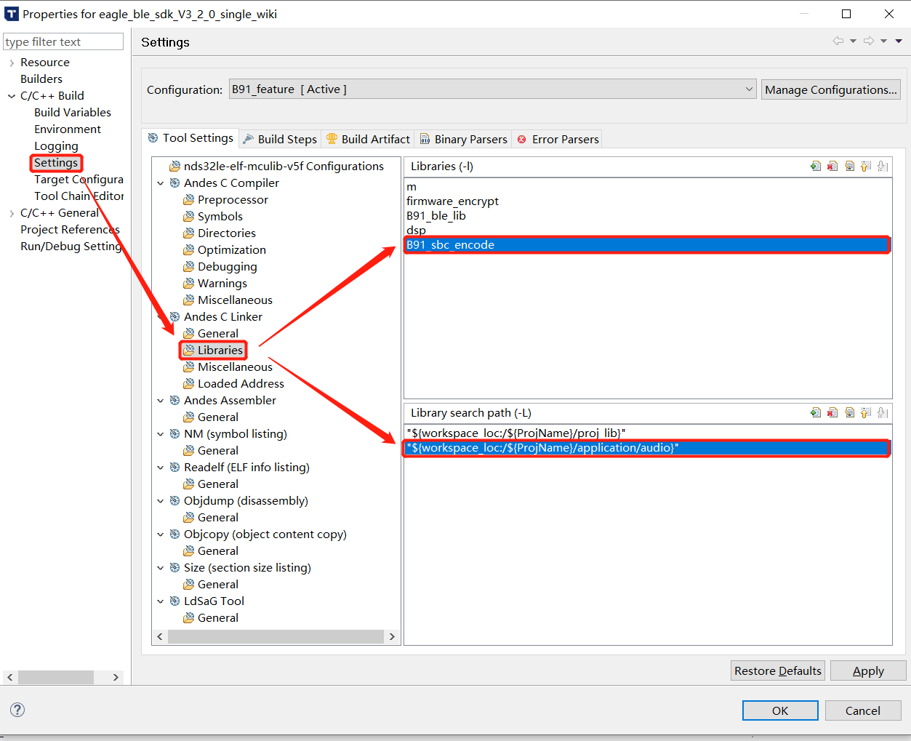

### TL_AUDIO_RCU_ADPCM_GATT_GOOGLE

Audio demo refers Google Voice V0.4 Spec for implementation, the user can use this demo and google TV box for voice-related product development. Google's Service UUID is also set in accordance with the Spec provisions, as follows.

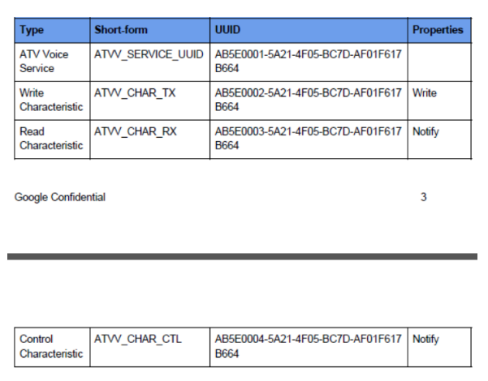

#### Initialization

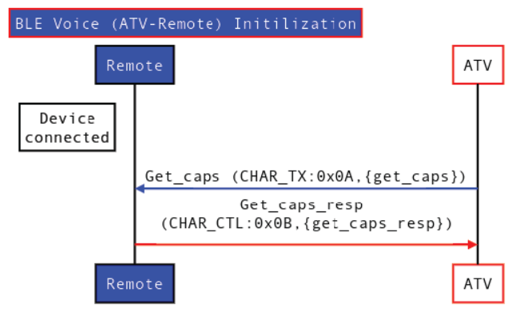

Initialization is mainly the slave end to obtain the configuration information of the master end, the entire packet interaction information is as follows.

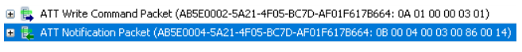

#### Voice data transmission

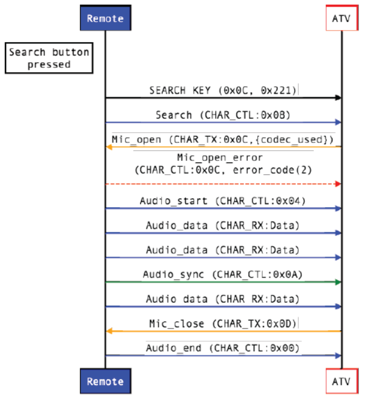

After the initialization is completed, the Slave end will send Search_KEY to the Master end, and the packet is as follows.


Then the Slave end will send Search to the Master end with the following packet.


Then the Master end will send MIC_Open to the Slave end, and the packet is as follows.


Then the Slave end sends Start to the Master end with the following packet.


According to Google Voice's Spec, the voice data transmission implemented in the program is 134 bytes per frame, and the entire packet is displayed as follows.

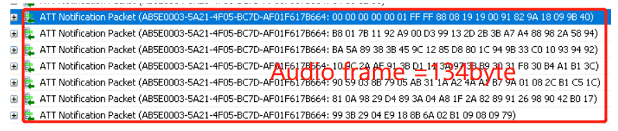

**Note:**

> On the Dongle side, we do not send a close command to end the voice transmission, but use a timeout judgment to end the voice. For details, please refer to the code of Dongle implementation on Master end.

#### TL_AUDIO_RCU_ADPCM_HID_DONGLE_TO_STB

This mode uses Service for the HID service specified in the Bluetooth Spec, through which the service can achieve communication with the Dongle connected devices, provided that the Dongle and the master computer device support the HID service method of interaction.

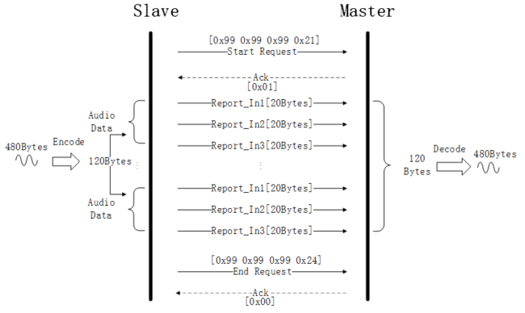

At the beginning, the Slave sends start_request to the Master with the following packet.


After the Master receives the start_request, it sends the Ack,packet as follows.


Slave starts to send Audio voice data, the decompression and compression of voice data are operated in 480Bytes size, the voice data is first compressed to 120 bytes by ADPCM compression algorithm, then split into 6 groups of packets and sent to Master end in turn, each group packet size is 20 bytes. In order to ensure the sequence of voice packets, use every three groups of packets are changed in turn for a fixed handle value. The receiver side starts to decompress and restore the voice signal after completing 6 groups of packets. The packets are as follows.

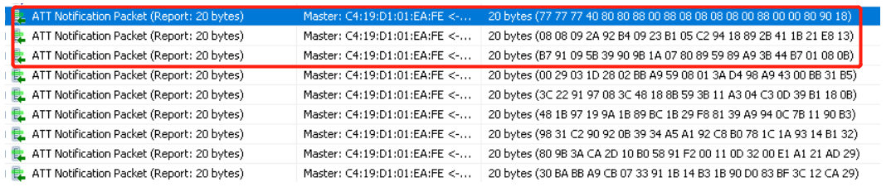

At the end of the voice transmission, the Slave sends an End Request to the Master with the following packet.


The Master sends an Ack after receiving the End Request with the following packet.


### TL_AUDIO_RCU_SBC_HID_DONGLE_TO_STB

This mode and TL_AUDIO_RCU_ADPCM_HID_DONGLE_TO_STB, the same use of Service for the HID service specified in the Bluetooth Spec, through the service can achieve the communication among the Dongle connected, the premise is that the Dongle and the master computer device support the HID service interaction.

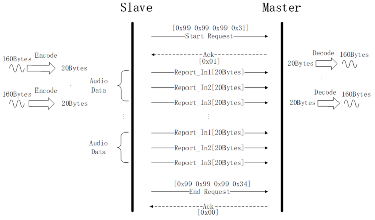

At the beginning, the Slave sends start_request to the Master with the following packet.


After the Master receives the start_request, it sends the Ack,packet as follows.


Slave starts to send Audio voice data, voice data decompression and compression are operated in 160 bytes size, voice data is first compressed to 20 bytes by SBC compression algorithm, and then sent to Master end, each group of packet size is 20 bytes. In order to ensure the sequence of voice packets, use every three groups of packets for fixed handle value. The receiver end starts to decompress and restore the voice signal after each group of packets is completed. The packets are as follows.

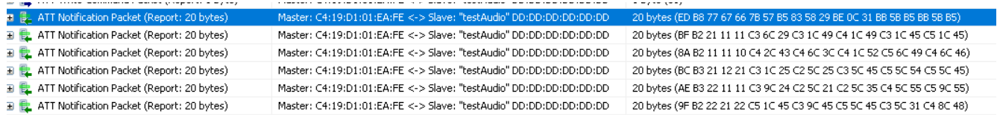

At the end of the voice transmission, the Slave sends an End Request to the Master with the following packet.


The Master sends an Ack after receiving the End Request with the following packet.


\newpage
# OTA

In order to realize the OTA function of the B91 BLE slave, a device is required as a BLE OTA master.

The OTA master can be a Bluetooth device actually used with the slave (you need to implement OTA in the APP), or you can use Telink's BLE master kma dongle. The following uses Telink's BLE master kma dongle as the ota master to introduce OTA in detail. The related code implementation can also be found in feature_ota under the Multi-Connection SDK.

B91 supports Flash multi-address boot: In addition to the first address of Flash 0x00000, it also supports reading firmware from Flash high addresses 0x20000 (128K), 0x40000 (256K), 0x80000 (512K). This document uses high address 0x20000 as an example to introduce OTA.

## Flash Architecture and OTA Procedure

### FLASH Storage Architecture

When booting address is 0x20000, size of firmware compiled by the SDK should not exceed 128kB, i.e. the flash area 0~0x20000 serves to store firmware. If you’re using boot address as 0x0 and 0x20000, the firmware size shouldn’t be larger than 124K. if your firmware size is larger than 124K, then you would need to use 0x0 and 0x40000 as boot address, the firmware size shouldn’t be larger than 252K. If more than 252K must be upgraded alternately using boot address 0 and 0x80000, the maximum firmware size must not exceed 508K.


(1) OTA Master burns new firmware2 into the Master flash area starting from 0x20000.

(2) OTA for the first time:

- When power on, Slave starts booting and executing firmware1 from flash 0~0x20000.

- When firmware1 is running, the area of Slave flash starting from 0x20000 (i.e. flash 0x20000~0x40000) is cleared during initialization and will be used as storage area for new firmware.

- OTA process starts, Master transfers firmware2 into Slave flash area starting from 0x20000 via RF. Then Slave sets bootloader to boot from the new firmware offset and reboots (similar to power cycle).
  
(3) For subsequent OTA updates, OTA Master first burns new firmware3 into the Master flash area starting from 0x20000.

(4) OTA for the second time:

- When power on, Slave starts booting and executing firmware2 from flash 0x20000~0x40000.

- When firmware2 is running, the area of Slave flash starting from 0x0 (i.e. flash 0~0x20000) is cleared during initialization and will be used as storage area for new firmware.

- OTA process starts, Master transfers firmware3 into Slave flash area starting from 0x0 via RF. Then Slave sets bootloader to boot from the new firmware offset and reboots.
  
(5) Subsequent OTA process repeats steps 1)~4): 1)~2) represents OTA of the (2n+1)-th time, while 3)~4) represents OTA of the (2n+2)-th time.

### OTA Update Procedure

Based on the flash storage structure introduced, the OTA update procedure is illustrated as below: 

First introduce the multi-address booting mechanism (only the first two booting addresses 0x00000 and 0x20000 will be introduced here): after MCU is powered on, it boots from address 0 by default. First, read the content of flash 0x20. If the value is 0x4b, the code starting from 0 are transferred to RAM, and the following instruction fetch address equals 0 plus PC pointer value;  if the value of 0x20 is not 0x4b, the MCU directly reads the value of 0x20020, if the value is 0x4b, the MCU moves the code from 0x20000 to RAM, and all subsequent fetches start from the 0x20000 address, that is, the fetch address = 0x20000+PC pointer value.

So as long as you modify the value of the 0x20 and 0x20020 flag bits, you can specify which part of the FLASH code that the MCU executes.

The power-on and OTA process of a certain SDK (2n+1 or 2n+2) is:

(1) The MCU is powered on, and the values ​​of 0x20 and 0x20020 are read and compared with 0x4b to determine the booting address, and then boots from the corresponding address and execute the code. This function is automatically completed by the MCU hardware.

(2) During the program initialization process, read the MCU hardware register to determine which address the MCU boots from:

If boots from 0, set ota_program_offset to 0x20000, and erase all non-0xff content in the 0x20000 area to 0xff, which means that the new firmware obtained by the next OTA will be stored in the area starting at 0x20000;

If boots from 0x20000, set ota_program_offset to 0x0, and erase all the non-0xff content in the 0x0 area to 0xff, which means that the new firmware obtained by the next OTA will be stored in the area starting from 0x0.

(3) Slave MCU executes the firmware after booting; OTA Master is powered on and establishes BLE connection with Slave.

(4) Trigger OTA Master to enter OTA mode by UI (e.g. button press, write memory by PC tool, etc.). After entering OTA mode, OTA Master needs to obtain Handle value of Slave OTA Service Data Attribute (The handle value can be pre-appointed by Slave and Master, or obtained via “read_by_type”.)

(5) After the Attribute Handle value is obtained, OTA Master may need to obtain version number of current Slave Flash firmware, and compare it with the version number of local stored new firmware.

**Note:**

> If legacy protocol is used, user needs to implement the version number; if extend protocol is used, the operation related to version number acquisition has been implemented. For the difference between legacy and extend protocol, user can refer to section 7.2.2.

(6) To enable OTA upgrade, OTA Master will send an OTA_start command to inform Slave to enter OTA mode.

(7) After the OTA_start command is received, Slave enters OTA mode and waits for OTA data to be sent from Master.

(8) Master reads the firmware stored in the flash area starting from 0x20000, and continuously sends OTA data to Slave until the entire firmware is sent.

(9) Slave receives OTA data and stores it in the area starting with ota_program_offset.

(10) After the master sends all the OTA data, check whether the data is received correctly by the slave (call the relevant function of the underlying BLE to determine whether the data of the link layer is correctly acknowledged).

(11) After the master confirms that all OTA data has been correctly received by the slave, it sends an OTA_END command.

(12) Slave receives the OTA_END command and writes the offset address of the new firmware area 0x20 (that is, ota_program_offset+0x20) as 0x4b, and writes the offset address of the old firmware storage area 0x20 as 0x00, which means it will Move code execution from the new area.

(13) Slave reports the results of OTA to master through Handle Value Notification.

(14) Reboot the slave, the new firmware takes effect.

During the whole OTA upgrade process, Slave will continuously check whether there’s packet error, packet loss or timeout (A timer is started when OTA starts). Once packet error, packet loss or timeout is detected, Slave will determine the OTA process fails. Then Slave reboots, and executes the old firmware. 

The OTA related operations on Slave side described above have been realized in the SDK and can be used by user directly. On Master side, extra firmware design is needed and it will be introduced later.

### Modify FW Size and Booting Address

API blc_ota_setNewFirmwwareStorageAddress supports modification of the boot address. Herein booting address means the address except 0 to store New_firmware, so it should be one of 0x20000, 0x40000 or 0x80000.

|Firmware_Boot_address|Firmware size (max)/K|
|---------------------|---------------------|
|0x20000|124|
|0x40000|252|
|0x80000|508|

The default maximum firmware size in the SDK is 252K (due to some special reasons, the firmware size of the startup address 0x40000 must not be greater than 252K), and the corresponding startup addresses are 0x00000 and 0x40000. These two values are consistent with the previous description. User need to follow the above table startup address and firmware_size size constraints when setting. If the maximum firmware_size changes and exceeds 124K, then you need to move the startup address to 0x40000 (size maximum must not exceed 252K), similarly if firmware_size exceeds 252K, the boot address needs to be moved to 0x80000 (the maximum size must not exceed 508K). For example, the maximum firmware size may be up to 200K, user can call API blc_ota_setNewFirmwwareStorageAddress to set.

```C
ble_sts_t blc_ota_setNewFirmwwareStorageAddress(multi_boot_addr_e  new_fw_addr);
```

The parameter multi_boot_addr_e indicates the available boot addresses, including three.

```C
typedef enum{
	MULTI_BOOT_ADDR_0x20000 	= 0x20000,	//128 K
	MULTI_BOOT_ADDR_0x40000		= 0x40000,  //256 K
	MULTI_BOOT_ADDR_0x80000	    = 0x80000,  //512 K
};
```

The return value ble_sts_t indicates the set status, for the definition of this type, please refer to ble_common.h in SDK.

If successful, it returns BLE_SUCCESS; otherwise it returns SERVICE_ERR_INVALID_PARAMETER.

## RF Data Processing for OTA Mode

### OTA Processing in Attribute Table

OTA related contents needs to be added in the Attribute Table on slave end. The “att_readwrite_callback_t r” and “att_readwrite_callback_t w” of the OTA data Attribute should be set as otaRead and otaWrite, respectively; the attribute should be set as Read and Write_without_Rsp (Telink Master KMA Dongle sends data via “Write Command” by default, with no need of ack from Slave to enable faster speed). Note that if the master uses Write Response to send data, you need to change gatt's feature permission to allow the slave end to respond. (CHAR_PROP_WRITE_WITHOUT_RSP is changed to CHAR_PROP_WRITE).

```C
// OTA attribute values
static const u8 my_OtaCharVal[19] = {
	CHAR_PROP_READ | CHAR_PROP_WRITE_WITHOUT_RSP,
	U16_LO(OTA_CMD_OUT_DP_H), U16_HI(OTA_CMD_OUT_DP_H),
	TELINK_SPP_DATA_OTA, };

	{4,ATT_PERMISSIONS_READ, 2,16,(u8*)(&my_primaryServiceUUID), 	(u8*)(&my_OtaServiceUUID), 0},
	{0,ATT_PERMISSIONS_READ, 2, sizeof(my_OtaCharVal),(u8*)(&my_characterUUID), (u8*)(my_OtaCharVal), 0},				//prop
	{0,ATT_PERMISSIONS_RDWR,16,sizeof(my_OtaData),(u8*)(&my_OtaUUID),	(&my_OtaData), &otaWrite, NULL},			//value
	{0,ATT_PERMISSIONS_READ, 2,sizeof (my_OtaName),(u8*)(&userdesc_UUID), (u8*)(my_OtaName), 0}, 
```

When Master sends OTA data to Slave, it actually writes data to the second Attribute as shown above, so Master needs to know the Attribute Handle of this Attribute in the Attribute Table. To use the Attribute Handle value pre-appointed by Master and Slave, user can directly define it on Master side.

### OTA Protocol

The current OTA architecture extends the functionality and is compatible with previous versions of the protocol. The entire OTA protocol consists of two parts: the Legacy protocol and the Extend protocol.

|OTA Protocol|-|
|---------------|---------------|
|Legacy protocol|Extend protocol|

**Note:**

> Functions supported by OTA protocol are:  
(1) OTA Result feedback function: this function is not optional, added by default;  
(2) Firmware Version Compare function and Big PDU function: This function is optional and can not be added, it should be noted that the version number comparison function is different in Legacy protocol and Extend protocol, please refer to the following OTA_CMD section for details.

The following introductions are all focused on Legacy and Extend protocols.

**OTA_CMD composition**

The PDUs of OTA's CMD are as follows.

|OTA Command Payload|-|
|----------------|---------------------|
|Opcode (2 octet)|Cmd_data (0-18 octet)|

**Opcode**

|Opcode|Name|Use*|
|------|---------------|-------|
|0xFF00|CMD_OTA_VERSION|Legacy|
|0xFF01|CMD_OTA_START|Legacy|
|0xFF02|CMD_OTA_END|All|
|0xFF03|CMD_OTA_START_EXT|Extend|
|0xFF04|CMD_OTA_FW_VERSION_REQ|Extend|
|0xFF05|CMD_OTA_FW_VERSION_RSP|Extend|
|0xFF06|CMD_OTA_RESULT|All|

**Note:**

>- Use:To identify the command use in Legacy protocol、Extend protocol or both of all;
>- Legacy: Only use in the Legacy protocol;
>- Extend: Only use in the Extend protocol;
>- All: use both in the Legacy protocol and Extend protocol.

(1) CMD_OTA_VERSION

It is a command to get the current firmware version number of the slave, and the user can choose to use it if he adopts OTA Legacy protocol for OTA upgrade. It is Optional. This command can be used to pass the firmware version number through the callback function reserved on the slave end.

```C
void blc_ota_registerOtaFirmwareVersionReqCb(ota_versionCb_t cb);
```

The server side will trigger this callback function when it receives the CMD_OTA_VERSION command.

(2) CMD_OTA_START

This command is the OTA update start command. The master sends this command to the slave to officially start the OTA update. This command is only for Legacy Protocol, if user uses OTA Legacy protocol, this command must be used.

(3) CMD_OTA_END

This command is the end command, which is used by both legacy and extend protocol in OTA. When Master confirms all OTA data are correctly received by Slave, it will send this command, which can be followed by four valid bytes to re-confirm Slave has received all data from Master. 

|-|CMD_data|-|
|------------------------|----------------------------|---------|
|Adr_index_max (2 octets)|Adr_index_max_xor (2 octets)|Reserved (16 octets)|

- Adr_index_max: the maximum adr_index value

- Adr_index_max_xor: the anomaly value of Adr_index_max for verification

- Reserved: Reserved for future function extension

(4) CMD_OTA_START_EXT

This command is the OTA update start command in the extend protocol. master sends this command to slave to officially start the OTA update. User must use this command as the start command if using OTA extend protocol.

|-|CMD_data|-|
|-----------------|--------------------------|-----------------|
|Length (1 octets)|Version_compare (1 octets)|Reserved (16 octets)|

- Length: PDU length

- Version_compare: 0x01: enable version compare 0x00: disable version compare

- Reserved: Reserved for future extension

(5) CMD_OTA_FW_VERSION_REQ

This command is the version comparison request command in the OTA upgrade process. This command is initiated by client to Server side to request for version number and upgrade permission.

|-|CMD_data|-|
|----------------------|--------------------------|-----------------|
|version_num (2 octets)|version_compare (1 octets)|Reserved (16 octets)|

- Version num: the firmware version number to be upgraded on the client side

- Version compare: 0x01: Enable version compare 0x00: Disable version compare

- Reserved: Reserved for future extensions

(6) CMD_OTA_FW_VERSION_RSP

This command is a version response command, the server side will compare the existing firmware version number with the version number requested by the client side after receiving the version comparison request command (CMD_OTA_FW_VERSION_REQ) from the client side to determine whether to upgrade, and the related information will be sent back to the client via this command.

|-|CMD_data|-|
|----------------------|--------------------------|-----------------|
|version_num (2 octets)|version_accept (1 octets)|Reserved (16 octets)|

- Version num: the firmware version number that Server side is currently running

- Version_accept: 0x01: accept client side upgrade request, 0x00: reject client side upgrade request

- Reserved: Reserved for future extensions

(7) CMD_OTA_RESULT

This command is the OTA result return command, the slave will send the result information to the master after the OTA is finished. In the whole OTA process, no matter success or failure, the OTA_result will only be reported once, the user can judge whether the upgrade is successful according to the returned result.

|CMD_data|-|
|-----------------|--------------------|
|Result (1 octets)|Reserved (16 octets)|

Result: OTA result information, all possible return results are shown in the following table.

Table: All possible return results of OTA

-------------------------------------------------------------------------------------------------------------------------------------------------------
Value     Type                                    info
--------- --------------------------------------- -----------------------------------------------------------------------------------------------------
0x00      OTA_SUCCESS                             success

0x01      OTA_DATA_PACKET_ 			    	  	  OTA data packet sequence number error: repeated OTA PDU or lost some OTA PDU
		  SEQ_ERR

0x02      OTA_PACKET_INVALID      			      invalid OTA packet: 1. invalid OTA command; 2. addr_index out of range; 3.not standard OTA PDU length

0x03      OTA_DATA_CRC_ERR        			      packet PDU CRC err

0x04      OTA_WRITE_FLASH_ERR     			      write OTA data to flash ERR

0x05      OTA_DATA_UNCOMPLETE     			      lost last one or more OTA PDU

0x06      OTA_FLOW_ERR            			      peer device send OTA command or OTA data not in correct flow

0x07      OTA_FW_CHECK_ERR        			      firmware CRC check error

0x08      OTA_VERSION_ 			    			  the version number to be update is lower than the current version
		  COMPARE_ERR

0x09      OTA_PDU_LEN_ERR         			      PDU length error: not 16\*n, or not equal to the value it declare in "CMD_OTA_START_EXT" packet

0x0a      OTA_FIRMWARE_   			    		  firmware mark error: not generated by telink's BLE SDK
		  MARK_ERR

0x0b      OTA_FW_SIZE_ERR         			      firmware size error: no firmware_size; firmware size too small or too big

0x0c      OTA_DATA_PACKET_ 			    		  time interval between two consequent packet exceed a value(user can adjust this value)
		  TIMEOUT

0x0d      OTA_TIMEOUT             			      OTA flow total timeout

0x0e   	  OTA_FAIL_DUE_TO_  					  OTA fail due to current connection terminate(maybe connection timeout or local/peer device terminate connection)
		  CONNECTION _TERMIANTE

0x0f-0xff Reserved for future use 			      /
-----------------------------------------------------------------------------------------------------------------------------------------------------------

Reserved: Reserved for future extensions

**OTA Packet structure composition**

When the Master sends commands and data to the Slave using WirteCommand or WriteResponse, the value of the Attribute Handle of the ATT layer is the handle_value of the OTA data on the slave side. According to the specification of the Ble Spec L2CAP layer regarding the PDU format, Attribute Value length is defined as the OTA_DataSize part in the following figure.

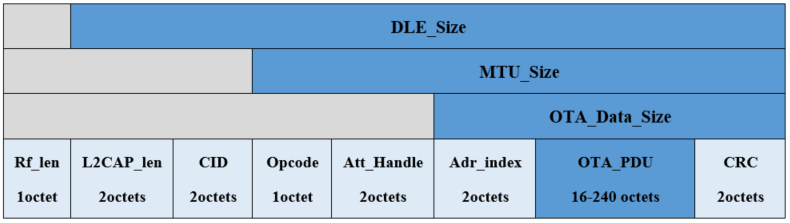

- DLE Size:  CID + Opcode + Att_Handle + Adr_index + OTA_PDU + CRC

- MTU_Size: Opcode + Att_Handle + Adr_index + OTA_PDU +CRC

- OTA_Data_Size: Adr_index + OTA_PDU + CRC

**OTA_Data introduction**

|Type|Length|
|------------------|----------------------------------|
|Default* + BigPDU*|16octets -240octets(n*16,n=1..15)|

**Note:**

>- Default: OTA PDU length fixed default size is 16 octets;
>- BigPDU: OTA PDU length can be changed in the range of 16octets - 240 octets, and is an integer multiple of 16 bytes.

**OTA_PDU Format**

When user adopts Extend protocol in OTA and supports Big PDU, it can support long packet for OTA upgrade operation and reduce the time of OTA upgrade. User can customize the PDU size at the client side according to the need. The last two bytes are a CRC_16 calculation of the previous Adr_Index and Data to get the first CRC value, the slave will do the same CRC calculation after receiving the OTA data, and only when the CRC calculated by both matches, it will be considered a valid data.

|-|OTA PDU|-|
|----------------------|--------------------------|-----------------|
|Adr_Index (2 octets)|Data(n*16 octets) n=1..15|CRC (2 octets)|

(1) PDU packet length: n=1

Data : 16 octets

Mapping of Adr_Index to Firmware address.

|Adr_Index|Firmware_address|
|------------|-------------------|
|0x0001|0x0000  -  0x000F|
|0x0002|0x0010  -  0x001F|
|…….|……|
|XXXX|(XXXX -1)\*16  - (XXXX)\*16+15|

(2) PDU packet length: n=2

Data : 32 octets

Mapping of Adr_Index to Firmware address.

|Adr_Index|Firmware_address|
|------------|-------------------|
|0x0001|0x0000  -  0x001F|
|0x0002|0x0010  -  0x003F|
|…….|……|
|XXXX|(XXXX -1)\*32  - (XXXX)\*32+31|

(3) PDU packet length: n=15

Data : 240 octets

Mapping of Adr_Index to Firmware address.

|Adr_Index|Firmware_address|
|------------|-------------------|
|0x0001|0x0000  -  0x00EF|
|0x0002|0x0010  -  0x01DF|
|…….|……|
|XXXX|(XXXX -1)*240  - (XXXX)*240+239|

**Note:**

>- In the OTA upgrade process, each packet of PDU length sent needs to be aligned with 16 bytes, that is, when the valid OTA data in the last packet is less than 16 bytes, the 0xFF data is added to make up the alignment, as listed below.
a) the current PDU length is set to 32, the last packet of valid data PDU is 4octets, then you need to add 12octets of 0xFF for alignment;  
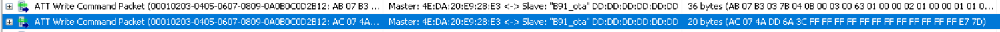
b) the current PDU length is set to 48, the last packet of valid data PDUs is 20octets, then you need to add 12octets of 0xFF for alignment;  
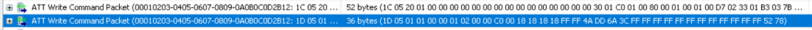
c) the current PDU length is set to 80, the last packet of valid data PDUs is 52octets, then you need to add 12octets of 0xFF for alignment.  
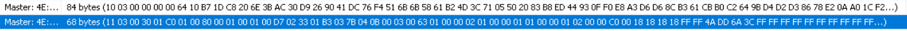
>- For the packet capture records corresponding to different PDU sizes, users can contact Telink technical support to obtain.

### RF Transfer Processing on Master Side

The master end sends commands and data to the slave via Write Command or Write Request in the L2CAP layer, and Spec specifies that it must return Write Response after receiving Write Request. For the introduction of ATT layer about Write Command and Write Request, please refer to Ble Spec or section 3.3.3.2 for its specific composition user. Telink Ble master Dongle uses Write Command to send data and commands by default, in this way, during OTA data transfer, Master won’t check whether each OTA data is acknowledged. In other words, after sending an OTA data via write command, Master won’t check if there’s ack response from Slave by software, but will directly push the following data into HW TX buffer which yet does not have enough data to be sent.

The following will introduce the process of Legacy Protocol and Extend Protocol, and Version Compare of OTA, respectively, to explain the interaction process of Salve and Master in the whole RF Transform. The Server side shown below is the Slave side, and the Client side is the Master side, which will not be distinguished later.

**OTA Legacy Protocol Process**

OTA Legacy is compatible with the previous version of Telink's OTA protocol. To better explain the whole interaction process between Slave and Master, the following example is used to illustrate.

**Note:**

>- The default PDU length of 16 octets is used, which does not involve the operation of DLE long packets.
>- Firmware compare function is not selected.

The specific operation flow is shown in the following figure.

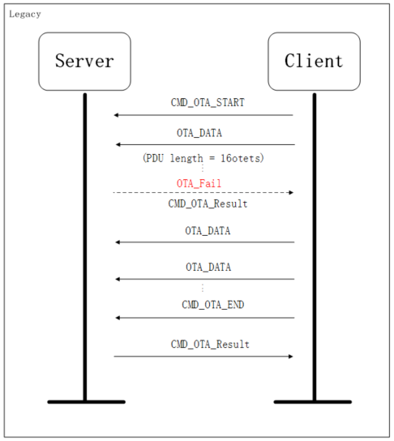

Client side will first send CMD_OTA_START command to Server side, Server side will start to prepare to receive OTA data after receiving the command, then Client side will start to send OTA_Data. If there is any interaction failure during the process, Server side will send CMD_OTA_Result to Client side, that is, return an error message and re-run the original program but will not enter reboot, the client side will stop the OTA data transfer when receiving this message. If the Client side and Server side successfully complete the OTA_Data transfer, the Client side will send CMD_OTA_END to the Server side, and the Server side will send CMD_OTA_Result to the Client side after receiving the result information, and enter reboot and run the new firmware.

**OTA Extend Protocol Process**

As mentioned above, there are some differences between the interaction commands of OTA Extend and Legacy introduced above. To better illustrate the whole interaction process between Slave and Master, the following example is used.

**Note:**

>- PDU length adopts 64 octets size, which involves the operation of DLE long packets.
>- Firmware compare function is not selected.

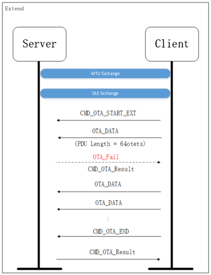

Due to the DLE long packet function, the Client side first needs to interact with the Server side for MTU and DLE, then the next process is similar to the previous Legacy. The Client side sends CMD_OTA_START_EXT command to the Server side, the Server side starts to prepare to receive OTA data after receiving the command, then client side starts sending OTA_Data. If there is any interaction failure during the process, the Server side will send CMD_OTA_Result to the Client side, which returns the error message and re-runs the original program but will not enter reboot. If the Client side and Server side successfully complete the OTA_Data transfer, the Client side will send CMD_OTA_END to the Server side, and the Server side will send CMD_OTA_Result to the Client side after receiving the result information, and enter reboot and run the new firmware.

**OTA Version Compare Process**

In the Slave side, both Extend and Legacy Protocol have version comparison function, where Legacy reserved the interface, need to be implemented by the user, while Extend has implemented the version comparison function, the user can directly use, as follows, need to enable the following macro.

```C
#define OTA_FW_VERSION_EXCHANGE_ENABLE			1	//user can change
#define OTA_FW_VERSION_COMPARE_ENABLE			1	//user can change
```

The following is an example of the interaction flow in Extend with version comparison.

**Note:**

>- PDU length is 16 octets size, no operation of DLE long packet is involved.
>- Firmware compare function selection (OTA to be upgraded version number is 0x0001, enable version compare enable)

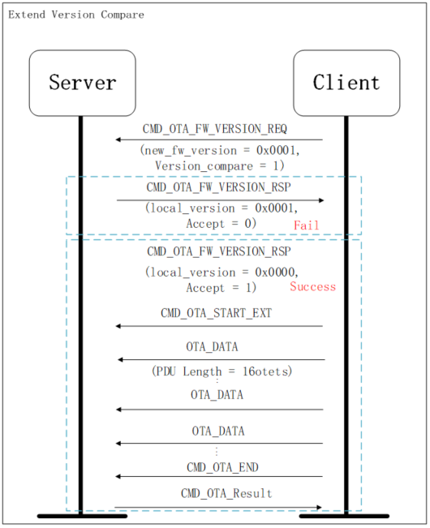

After enabling the version comparison function, the Client side first sends the CMD_OTA_FW_VERSION_REQ version comparison request command to the Server side, where the PDU sent includes the Firmware version number of the Client side (new_fw_version = 0x0001), and the Server side gets the version number information of the Client side and compares it with the local version number (local_version).

If the received version number (new_fw_version = 0x0001) is not greater than the local version number (local version = 0x0001), the Server side will reject the Client side OTA upgrade request and send the Client side version response command (CMD_OTA_FW_VERSION_RSP). The information sent includes the receiving parameter (accept = 0) and the local version number (local_version = 0x0001), and the Client will stop the OTA related operation after receiving it, that is, the current version upgrade is not successful.

If the received version number (new_fw_version = 0x0001) is larger than the local version number (local version = 0x0000), the Server side will receive the OTA upgrade request from the Client side and send the version response command (CMD_OTA_FW_VERSION_RSP) to the Client side. The message sent includes the acceptance parameter (accept = 1) and the local version number (local_version = 0x0000), which the Client receives to start preparing the OTA upgrade related operations.The process is similar to the previous content, that is, first send the CMD_OTA_START command to the Server side, and then the Server side starts to prepare to receive the OTA data after receiving the command, client side starts sending OTA_data. If there is any interaction failure during the process, the Server side will send CMD_OTA_Result to the Client side, which will return the error message and re-run the original program but will not enter reboot, and the Client side will stop OTA data transmission immediately after receiving it. If the Client side and Server side successfully complete the OTA_Data transfer, the Client side will send CMD_OTA_END to the Server side, and the Server side will send CMD_OTA_Result to the Client side after receiving the result information, and enter reboot and run the new firmware.

**OTA implementation**

The above describes the entire OTA interaction process, the following example illustrates the specific data interaction between Master and Slave.

**Note:**

>- OTA Protocol: Legacy Protocol;
>- The PDU length is 16 octets, which does not involve the operation of long DLE packets;
>- The Master side enables Firmware compare function.

(1) Check if there’s any behavior to trigger entering OTA mode. If so, Master enters OTA mode.

(2) To send OTA commands and data to Slave, Master needs to know the Attribute Handle value of current OTA data Atrribute on Slave side. User can decide to directly use the pre-appointed value or obtain the Handle value via “Read By Type Request”.

UUID of OTA data in Telink BLE SDK is always 16-byte value as shown below:

```C
#define TELINK_SPP_DATA_OTA 	{0x12,0x2B,0x0d,0x0c,0x0b,0x0a,0x09,0x08,0x07,0x06,0x05,0x04,0x03,0x02,0x01,0x00}
```

In “Read By Type Request” from Master, the “Type” is set as the 16-byte UUID. The Attribute Handle for the OTA UUID is available from “Read By Type Rsp” responded by Slave. In the figure below, the Attribute Handle value is shown as “0x0031”.

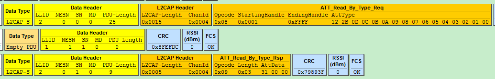

(3)  Obtain the current firmware version number of the slave and decide whether to continue the OTA update (if the version is already the latest, no update is required). This step is for the user to choose whether to do it or not. The BLE SDK does not provide a specific version number acquisition method, users can play by themselves. In the current BLE SDK, legacy protocol does not implement version number transmission. The user can use write cmd or write response to send a request to obtain the OTA version to the slave through the OTA version cmd, but the slave side only provides a callback function when receiving the OTA version request, and the user finds a way to set the slave side in the callback function. The version number is sent to the master (such as manually sending a NOTIFY/INDICATE data).

(4) Start a timing at the beginning of the OTA, and then continue to check whether the timing exceeds 30 seconds (this is only a reference time, and the actual evaluation will be made after the normal OTA required by the user test).

If it takes more than 30 seconds to consider the OTA timeout failure, because the slave side will check the CRC after receiving the OTA data. Once the CRC error or other errors (such as programming flash errors) occur, the OTA will be considered as a failure and the program will be restarted directly. The layer cannot ack the master, and the data on the master side has not been sent out, resulting in a timeout.

(5) Read the four bytes of Master flash 0x20018~0x2001b to determine the size of the firmware.

This size is implemented by our compiler. Assuming the size of the firmware is 20k = 0x5000, then the value of 0x18~0x1b of the firmware is 0x00005000, so the size of the firmware can be read from 0x20018~0x2001b.

In the bin file shown in the figure below, the content of 0x18 ~ 0x1b is 0x0000cf94, so the size is 0xcf94 = 53140Bytes, from 0x0000 to 0xcf96.

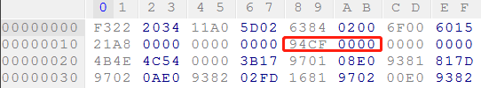

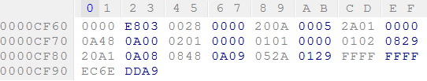

(6) Master sends an OTA start command “0xff01” to Slave, so as to inform it to enter OTA mode and wait for OTA data from Master, as shown below.

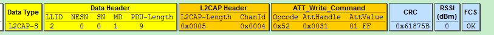

(7) Read 16 bytes of firmware each time starting from Master flash 0x20000, assemble them into OTA data packet, set corresponding adr_index, calculate CRC value, and push the packet into TX FIFO, until all data of the firmware are sent to Slave.

OTA data format is used in data transfer (see Figure7 3): 20-byte valid data contains 2-byte adr_index, 16-byte firmware data and 2-byte CRC value to the former 18 bytes.

Note: If firmware data for the final transfer are less than 16 bytes, the remaining bytes should be complemented with “0xff” and need to be considered for CRC calculation.

Below illustrates how to assemble OTA data.

Data for first transfer: “adr_index” is “0x00 00”, 16-byte data are values of addresses 0x0000 ~ 0x000f. Suppose CRC calculation result for the former 18 bytes is “0xXYZW”, the 20-byte data should be:

0x00  0x00  0xf3  0x22  .... (12 bytes not listed).....  0x60 0x15  0xZW  0xXY

Data for second transfer:

0x01  0x00  0x21  0xa8  ....(12 bytes not listed).....  0x00 0x00  0xJK  0xHI

Data for third transfer:

0x02  0x00  0x4b  0x4e  ....(12 bytes not listed).....  0x81 0x7d  0xNO  0xLM

........

Data for penultimate transfer:

0xf8  0x0c  0x20  0xa1  ....(12 bytes not listed).....  0xff  0xff  0xST  0xPQ

Data for final transfer:

0xf9  0x0c  0xec  0x6e  0xdd  0xa9  0xff  0xff  0xff  0xff

0xff   0xff   0xff   0xff   0xff   0xff   0xff   0xff   0xWX  0xUV

12 “0xff” are added to complement 16 bytes.

0xec 0x6e 0xdd 0xa9 is the third to sixth, which is the CRC_32 calculation result of the entire firmware bin. The slave will synchronously calculate the CRC_32 check value of the entire bin received during the OTA upgrade process, and compare it with 0xec 0x6e 0xdd 0xa9 at the end.

The CRC calculation result for a total of 18 bytes from 0xf9 to 0xff is 0xUVWX.

The above data is shown in the figure below:

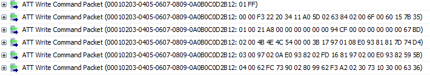

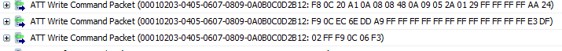

(8) After the firmware data is sent, check whether the data of the BLE link layer has been completely sent (because only when the data of the link layer is acked by the slave, the data is considered to be sent successfully). If it is completely sent, the master sends an ota_end command to notify the slave that all data has been sent.

The packet effective bytes of the OTA end are set to 6, the first two are 0xff02, and the middle two bytes are the maximum adr_index value of the new firmware (this is for the slave to confirm again that the last or several OTA data is not lost) , The last two bytes are the inverse of the largest adr_index value in the middle, which is equivalent to a simple check. OTA end does not require CRC check.

Take the bin shown in the above figure as an example, the largest adr_index is 0x0cf9, and its inverse value is 0xf306, and the final OTA end package is shown in the figure above.

(9) Check if link-layer TX FIFO on Master side is empty: If it’s empty, it indicates all data and commands in above steps are sent successfully, i.e. OTA task on Master succeeds.

Please refer to Appendix for CRC_16 calculation function.

As introduced above, Slave can directly invoke the otaWrite and otaRead in OTA Attribute. After Slave receives write command from Master, it will be parsed and processed automatically in BLE stack by invoking the otaWrite function.

In the otaWrite function, the 20-byte packet data will be parsed: first judge whether it’s OTA CMD or OTA data, then process correspondingly (respond to OTA cmd; check CRC to OTA data and burn data into specific addresses of flash).

The OTA related operations on Slave side are shown as below：

(1) OTA_FIRMWARE_VERSION command is received: Master requests to obtain Slave firmware version number.

In this BLE SDK, after Slave receives this command, it will only check whether related callback function is registered and determine whether to trigger the callback function correspondingly.

The interface in ble_ll_ota.h to register this callback function is shown as below:

```C
typedef void (*ota_versionCb_t)(void);
void blc_ota_registerOtaFirmwareVersionReqCb(ota_versionCb_t cb);
```

(2) OTA start command is received: Slave enters OTA mode. 

If the “bls_ota_registerStartCmdCb” function is used to register the callback function of OTA start, then the callback function is executed to modify some parameter states after entering OTA mode (e.g. disable PM to stabilize OTA data transfer). 

Slave also starts and maintains a slave_adr_index to record the adr_index of the latest correct OTA data. The slave_adr_index is used to check whether there’s packet loss in the whole OTA process, and its initial value is -1. Once packet loss is detected, OTA fails, Slave MCU exits OTA and reboots; since Master cannot receive any ack from Slave, it will discover OTA failure by software after timeout. 

The following interface is used to register the callback function of OTA start:

```C
typedef void (*ota_startCb_t)(void);
void blc_ota_registerOtaStartCmdCb(ota_startCb_t cb);
```

User needs to register this callback function to carry out operations when OTA starts, for example, configure LED blinking to indicate OTA process.

After Slave receives “OTA start”, it enters OTA and starts a timer (The timeout duration is set as 30s by default in current SDK). If OTA process is not finished within the duration, it’s regarded as OTA failure due to timeout. User can evaluate firmware size (larger size takes more time) and BLE data bandwidth on Master (narrow bandwidth will influence OTA speed), and modify this timeout duration accordingly via the variable as shown below.

```C
ble_sts_t	blc_ota_setOtaProcessTimeout(int timeout_second);
ble_sts_t	blc_ota_setOtaDataPacketTimeout(int timeout_second);
```

The unit of parameter timeout_second of the function blc_ota_setOtaProcessTimeout is seconds, the default is 30, and the range is 5-1000;

The unit of parameter timeout_second of the function blc_ota_setOtaDataPacketTimeout is seconds, the default is 5, and the range is 1-20;

After initializing the variable, the user can call the following timeout function to perform the timeout process.

```C
void blt_ota_procTimeout(void)；
```

The other is the timeout period of the receive packet. It will be updated every time an OTA data packet is received. The timeout period is 5s, that is, if the next data is not received within 5s, the OTA_RF_PACKET_TIMEOUT is considered as a failure.

(3) Valid OTA data are received (first two bytes are 0~0x1000):

Whenever Slave receives one 20-byte OTA data packet, it will first check if the adr_index equals slave_adr_index plus 1. If not equal, it indicates packet loss and OTA failure; if equal, the slave_adr_index value is updated.

Then carry out CRC_16 check to the former 18 bytes. If not matched, OTA fails; if matched, the 16-byte valid data are written into corresponding flash area (ota_program_offset+adr_index*16 ~ ota_program_offset+adr_index*16 + 15). During flash writing process, if there’s any error, OTA also fails.

In order to ensure the integrity of the firmware after the OTA is completed, a CRC_32 check will be performed on the entire firmware at the end, and it will be compared with the check value calculated by the same method sent by the master. If it is not equal, it means there is a data error in the middle, and the OTA is considered a failure.

(4) “OTA end” command is received:

Check whether adr_max in OTA end packet and the inverted check value are correct. If yes, the adr_max can be used to double check whether maximum index value of data received by Slave from Master equals the adr_max in this packet. If equal, OTA succeeds; if not equal, OTA fails due to packet loss.

After successful OTA, Slave will set the booting flag of the old firmware address in flash as 0, set the booting flag of the new firmware address in flash as 0x4b, then reboot MCU.

(5) The slave sends the OTA result back to the master:

Once the OTA is started on the slave side, regardless of whether the OTA succeeds or fails, the slave will finally send the result to the master. The following is an example of the result information sent by the slave after the OTA is successful (the length is only 3 bytes):

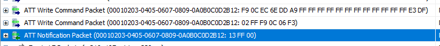

(6) Slave supplies OTA state callback function:

After Slave starts OTA, MCU will finally reboot when OTA is successful.

If OTA succeeds, Slave will set flag before rebooting so that MCU executes the New_firmware.

If OTA fails, the incorrect new firmware will be erased before rebooting, so that MCU still executes the Old_firmware.

Before rebooting, user can judge whether the OTA state callback function is registered and determine whether to trigger it correspondingly.

Corresponding codes are as following:

```C
void blc_ota_registerOtaResultIndicationCb (ota_resIndicateCb_t cb);
```

After the callback function is set, the enum of the parameter result of the callback function is the same as the result reported by the OTA. The first 0 is OTA success, and the rest are different reasons for failure.

OTA upgrade success or failure will trigger the callback function, the actual code can be debugged by the result of the function to return parameters. When the OTA is unsuccessful, you can read the above result and stop the MCU with while(1) to understand what causes the OTA failure.

\newpage
# Key Scan

Telink provides a keyscan architecture based on row/column scan to detect and process key state update (press/release). User can directly use the demo code, or realize the function by developing his own code.

## Key Matrix

Figure shows a 5*6 Key matrix which supports up to 30 buttons. Five drive pins (Row0~Row4) serve to output drive level, while six scan pins (CoL0~CoL5) serve to scan for key press in current column.

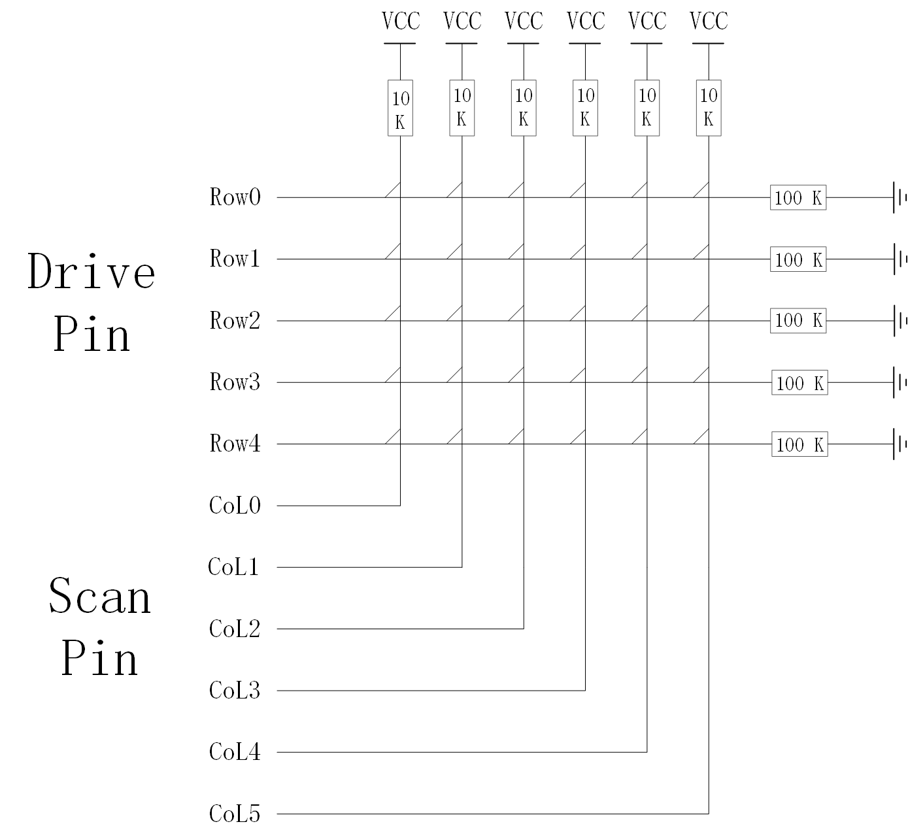

The Telink EVK board is a 2*2 keyboard matrix. In the actual product application, more keys may be needed, such as remote control switches, etc. The following is an example of Telink's demo board providing remote control. Combined with the above figure, the keyscan related configuration in app_config.h is explained in detail as follows.

According to the real hardware circuit, on Telink demo board, Row0~Row4 pins are PE2, PB4, PB5, PE1 and PE4, CoL0~CoL5 pins are PB1, PB0, PA4, PA0, PE6 and PE5.

Define drive pin array and scan pin array:

```C
#define KB_DRIVE_PINS  	{GPIO_PE2, GPIO_PB4, GPIO_PB5, GPIO_PE1, GPIO_PE4}
#define KB_SCAN_PINS   	{GPIO_PB1, GPIO_PB0, GPIO_PA4, GPIO_PA0, GPIO_PE6, GPIO_PE5}
```

Keyscan adopts analog pull-up/pull-down resistor of GPIO: drive pins use 100K pull-down resistor, and scan pins use 10K pull-up resistor. When no button is pressed, scan pins act as input GPIOs and read high level due to 10K pull-up resistor. When key scan starts, drive pins output low level; if low level is detected on a scan pin, it indicates there’s button pressed in current column (Note: Drive pins are not in float state, if output is not enabled, scan pins still detect high level due to voltage division of 100K and 10K resistor.)

Define valid voltage level detected on scan pins when drive pins output low level in Row/Column scan:

```C
#define KB_LINE_HIGH_VALID				0
```

Define pull-up resistor for scan pins and pull-down resistor for drive pins:

```C
#define	MATRIX_ROW_PULL			PM_PIN_PULLDOWN_100K
#define	MATRIX_COL_PULL			PM_PIN_PULLUP_10K
#define	PULL_WAKEUP_SRC_PE2		MATRIX_ROW_PULL
#define	PULL_WAKEUP_SRC_PB4		MATRIX_ROW_PULL
#define	PULL_WAKEUP_SRC_PB5		MATRIX_ROW_PULL
#define	PULL_WAKEUP_SRC_PE1		MATRIX_ROW_PULL
#define	PULL_WAKEUP_SRC_PE4		MATRIX_ROW_PULL
#define	PULL_WAKEUP_SRC_PB1		MATRIX_COL_PULL
#define	PULL_WAKEUP_SRC_PB0		MATRIX_COL_PULL
#define	PULL_WAKEUP_SRC_PA4		MATRIX_COL_PULL
#define	PULL_WAKEUP_SRC_PA0		MATRIX_COL_PULL
#define	PULL_WAKEUP_SRC_PE6		MATRIX_COL_PULL
#define	PULL_WAKEUP_SRC_PE5		MATRIX_COL_PULL
```

Since “ie” of general GPIOs is set as 0 by default in gpio_init, to read level on scan pins, corresponding “ie” should be enabled.

```C
#define PB1_INPUT_ENABLE		1
#define PB0_INPUT_ENABLE		1
#define PA4_INPUT_ENABLE		1
#define PA0_INPUT_ENABLE		1
#define PE6_INPUT_ENABLE		1
#define PE5_INPUT_ENABLE		1
```

When MCU enters sleep mode, it’s needed to configure PAD GPIO wakeup. Set drive pins as high level wakeup; when there’s button pressed, drive pin reads high level, which is 10/11 VCC. To read level state of drive pins, corresponding “ie” should be enabled.

```C
#define PE2_INPUT_ENABLE		1
#define PB4_INPUT_ENABLE		1
#define PB5_INPUT_ENABLE		1
#define PE1_INPUT_ENABLE		1
#define PE4_INPUT_ENABLE		1
```

## Keyscan and Keymap

### Keyscan

After configuration as shown in section 8.1 Key matrix, the function below is invoked in main_loop to implement keyscan.

```C
u32 kb_scan_key (int numlock_status, int read_key)
```

numlock_status: Generally set as 0 when invoked in main_loop. Set as “KB_NUMLOCK_STATUS_POWERON” only for fast keyscan after wakeup from deepsleep (refer to section 8.4 Deepsleep wake_up fast keyscan, corresponding to DEEPBACK_FAST_KEYSCAN_ENABLE).

read_key: Buffer processing for key values, generally not used and set as 1 (if it’s set as 0, key values will be pushed into buffer and not reported to upper layer).

The return value is used to inform user whether matrix keyboard update is detected by current scan: if yes, return 1; otherwise return 0.

The “kb_scan_key” is invoked in main_loop. As in BLE timing sequence, each main_loop is an adv_interval or conn_interval. In advertising state (suppose adv_interval is 30ms), key scan is processed once for each 30ms; in connection state (suppose conn_interval is 10ms), key scan is processed once for each 10ms.

In theory, when button states in matrix are different during two adjacent key scans, it’s considered as an update.

In actual code, a debounce filtering processing is enabled: It will be considered as a valid update, only when button states stay the same during two adjacent key scans, but different with the latest stored matrix keyboard state. “1” will be returned by the function to indicate valid update, matrix keyboard state will be indicated by the structure “kb_event”, and current button state will be updated to the newest matrix keyboard state. Corresponding code in keyboard.c is shown as below:

```C
	unsigned int key_debounce_filter( u32 mtrx_cur[], u32 filt_en );
```

The newest button state means press or release state set of all buttons in the matrix. When power on, initial matrix keyboard state shows all buttons are “released” by default, and debounce filtering processing is enabled. As long as valid update occurs to the button state, “1” will be returned, otherwise “0” will be returned.

For example: press a button, a valid update is returned; release a button, a valid update is returned; press another button with a button held, a valid update is returned; press the third button with two buttons held, a valid update is returned; release a button of the two pressed buttons, a valid update is returned……

### Keymap & kb_event

If a valid button state update is detected by invoking the “kb_scan_key”, user can obtain current button state via a global structure variable “kb_event”.

```C
#define KB_RETURN_KEY_MAX	6
typedef struct{
	u8 cnt;
	u8 ctrl_key;
	u8 keycode[KB_RETURN_KEY_MAX];
}kb_data_t;
kb_data_t	kb_event;
```

The “kb_event” consists of 8 bytes:

- “cnt” serves to indicate valid count number of pressed buttons currently;

- “ctrl_key” is not used generally except for standard USB HID keyboard (user is not allowed to set keycode in keymap as 0xe0~0xe7).

- keycode[6] indicates keycode of up to six pressed buttons can be stored (if more than six buttons are pressed actually, only the former six can be reflected).

Keycode definition of all buttons in the “app_config.h” is shown as below:

```C
#define	KB_MAP_NORMAL {\
VK_B,		CR_POWER,		VK_NONE,		VK_C,				CR_HOME,	 \
VOICE,	     VK_NONE,		VK_NONE,		CR_VOL_UP,			CR_VOL_DN,	 \
VK_2,		VK_RIGHT,		CR_VOL_DN,		VK_3,				VK_1,	 \
VK_5,		VK_ENTER,		CR_VOL_UP,		VK_6,				VK_4,	 \
VK_8,		VK_DOWN,		VK_UP ,			VK_9,				VK_7,	 \
VK_0,		CR_BACK,		VK_LEFT,		CR_VOL_MUTE,		CR_MENU,	 }
```

The keymap follows the format of 5*6 matrix structure. The keycode of pressed button can be configured accordingly, for example, the keycode of the button at the cross of Row0 and CoL0 is “VK_B”.

In the “kb_scan_key” function, the “kb_event.cnt” will be cleared before each scan, while the array “kb_event.keycode[]” won’t be cleared automatically. Whenever “1” is returned to indicate valid update, the “kb_event.cnt” will be used to check current valid count number of pressed buttons.

a) If current kb_event.cnt = 0, previous valid matrix state “kb_event.cnt” must be uncertain non-zero value; the update must be button release, but the number of released button is uncertain. Data in kb_event.keycode[] (if available) is invalid.

b) If current kb_event.cnt = 1, the previous kb_event.cnt indicates button state update. If previous kb_event.cnt is 0, it indicates the update is one button is pressed; if previous kb_event.cnt is 2, it indicates the update is one of the two pressed buttons is released; if previous kb_event.cnt is 3, it indicates the update is two of the three pressed buttons are released……kb_event.keycode[0] indicates the key value of currently pressed button. The subsequent keycodes are negligible.

c) If current kb_event.cnt = 2, the previous kb_event.cnt indicates button state update. If previous kb_event.cnt is 0, it indicates the update is two buttons are pressed at the same time; if previous kb_event.cnt is 1, it indicates the update is another button is pressed with one button held; if previous kb_event.cnt is 3, it indicates the update is one of the three pressed buttons is released……kb_event.keycode[0] and kb_event.keycode[1] indicate key values of the two pressed buttons currently. The subsequent keycodes are negligible.

User can manually clear the “kb_event.keycode” before each key scan, so that it can be used to check whether valid update occurs, as shown in the example below.

In the sample code, when kb_event.keycode[0]is not zero, it’s considered a button is pressed, but the code won’t check further complex cases, such as whether two buttons are pressed at the same time or one of the two pressed buttons is released.

```C
kb_event.keycode[0] = 0;//clear keycode[0]
int det_key = kb_scan_key (0, 1);
if (det_key)
{
	key_not_released = 1;
	u8 key0 = kb_event.keycode[0];
	if (kb_event.cnt == 2)   //two key press, do  not process
	{ 
	} 
	else if(kb_event.cnt == 1)
	{			
key_buf[2] = key0;
	     //send key press
		bls_att_pushNotifyData (HID_NORMAL_KB_REPORT_INPUT_DP_H, key_buf, 8);
}
	else  //key release
	{
		key_not_released = 0;
		key_buf[2] = 0;
		//send key release
		bls_att_pushNotifyData (HID_NORMAL_KB_REPORT_INPUT_DP_H, key_buf, 8);
}
}
```

## Keyscan Flow

When “kb_scan_key” is invoked, a basic keyscan flow is shown as below:

(1) Initial full scan through the whole matrix.

All drive pins output drive level (0). Meanwhile read all scan pins, check for valid level, and record the column on which valid level is read. (The scan_pin_need is used to mark valid column number.)

If row-by-row scan is directly adopted without initial full scan through the whole matrix, each time all rows should be scanned at least, even if no button is pressed. To save scan time, initial full scan through the whole matrix can be added, thus it will directly exit keyscan if no button press is detected on any column.

The first full scan codes:

```C
scan_pin_need = kb_key_pressed (gpio);
```

In the “kb_key_pressed” function, all rows output low level, and stabilized level of scan pins will be read after 20us delay. A release_cnt is set as 6; if a detection shows all pressed buttons in the matrix are released, it won’t consider no button is pressed and stop row-by-row scan immediately, but buffers for six frames. If six successive detections show buttons are all released, it will stop row-by-row scan. Thus key debounce processing is realized.

(2) Scan row by row according to full scan result through the whole matrix.

If button press is detected by full scan, row-by-row scan is started: Drive pins (ROW0~ROW4) output valid drive level row by row; read level on columns, and find the pressed button. Following is related code:

```C
u32 pressed_matrix[ARRAY_SIZE(drive_pins)] = {0};
kb_scan_row (0, gpio);
for (int i=0; i<=ARRAY_SIZE(drive_pins); i++) {
	u32 r = kb_scan_row (i < ARRAY_SIZE(drive_pins) ? i : 0, gpio);
	if (i) {
		pressed_matrix[i - 1] = r;
	}
}
```

The following methods are used to optimize code execution time for row-by-row scan.

- When a row outputs drive level, it’s not needed to read level of all columns (CoL0~CoL5). Since the scan_pin_need marks valid column number, user can read the marked columns only.

- After a row outputs drive level, a 20us or so delay is needed to read stabilized level of scan pins, and a buffer processing is used to utilize the waiting duration. 

The array variable “u32 pressed_matrix[5]” (up to 40 columns are supported) is used to store final matrix keyboard state: pressed_matrix[0] bit0~bit5 mark button state on CoL0~CoL5 crossed with Row0, ……, pressed_matrix[4] bit0~bit5 mark button state on CoL0~CoL5 crossed with Row4.

(3) Debounce filtering for pressed_matrix[].

Corresponding codes:

```C
unsigned int key_debounce_filter( u32 mtrx_cur[], u32 filt_en );
u32 key_changed = key_debounce_filter( pressed_matrix, (numlock_status & KB_NUMLOCK_STATUS_POWERON) ? 0 : 1);
```

During fast keyscan after wakeup from deepsleep, “numlock_status” equals “KB_NUMLOCK_STATUS_POWERON”; the “filt_en” is set as 0 to skip filtering and fast obtain key values.

In other cases, the “filt_en” is set as 1 to enable filtering. Only when pressed_matrix[] stays the same during two adjacent key scans, but different from the latest valid pressed_matrix[], will the “key_changed” set as 1 to indicate valid update in matrix keyboard.

(4) Buffer processing for pressed_matrix[].

Push pressed_matrix[] into buffer. When the “read_key” in “kb_scan_key (int numlock_status, int read_key)” is set as 1, the data in the buffer will be read out immediately. When the “read_key” is set as 0, the buffer stores the data without notification to the upper layer; the buffered data won’t be read until the read_key is 1.

In current SDK, the “read_key” is fixed as 1, i.e. the buffer does not take effect actually.

(5) According to pressed_matrix[], look up the KB_MAP_NORMAL table and return key values.

Corresponding functions are “kb_remap_key_code” and “kb_remap_key_row”.

## Repeat Key Processing

When a button is pressed and held, it’s needed to enable repeat key function to repeatedly send the key value with a specific interval.

The “repeat key” function is masked by default. By configuring related macros in the “app_config.h”, this function can be controlled correspondingly.

```C
#define KB_REPEAT_KEY_ENABLE			0
#define KB_REPEAT_KEY_INTERVAL_MS		200
#define KB_REPEAT_KEY_NUM				1
#define KB_MAP_REPEAT					{VK_1, }
```

(1) KB_REPEAT_KEY_ENABLE

This macro serves to enable or mask the repeat key function. To use this function, first set “KB_REPEAT_KEY_ENABLE” as 1.

(2) KB_REPEAT_KEY_INTERVAL_MS

This macro serves to set the repeat interval time. For example, if it’s set as 200ms, it indicates when a button is held, kb_key_scan will return an update with the interval of 200ms. Current button state will be available in kb_event.

(3) KB_REPEAT_KEY_NUM & KB_MAP_REPEAT

The two macros serve to define current repeat key values: KB_REPEAT_KEY_NUM specifies the number of keycodes, while the KB_MAP_REPEAT defines a map to specify all repeat keycodes. Note that the keycodes in the KB_MAP_REPEAT must be the values in the KB_MAP_NORMAL.

Following example shows a 6*6 matrix keyboard: by configuring the four macros, eight buttons including UP, DOWN, LEFT, RIGHT, V+, V-, CHN+ and CHN- are set as repeat keys with repeat interval of 100ms, while other buttons are set as non-repeat keys.

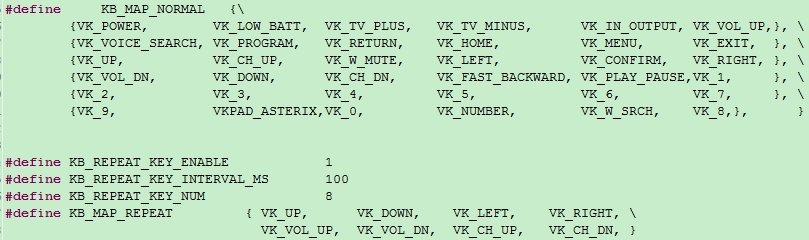

User can search for the four macros in the project to locate the code about repeat key.

## Stuck Key Processing

Stuck key processing is used to save power when one or multiple buttons of a remote control/keyboard is/are pressed and held for a long time unexpectedly, for example a RC is pressed by a cup or ashtray. If keyscan detects some button is pressed and held, without the stuck key processing, MCU won’t enter deepsleep or other low power state since it always considers the button is not released.

Following are two related macros in the app_config.h: 

```C
#define STUCK_KEY_PROCESS_ENABLE		0
#define STUCK_KEY_ENTERDEEP_TIME		60//in s
```

By default the stuck key processing function is masked. User can set the “STUCK_KEY_PROCESS_ENABLE” as 1 to enable this function.

The “STUCK_KEY_ENTERDEEP_TIME” serves to set the stuck key time: if it’s set as 60s, it indicates when button state stays fixed for more than 60s with some button held, it’s considered as stuck key, and MCU will enter deepsleep.

User can search for the macro “STUCK_KEY_PROCESS_ENABLE” to locate related code in the keyboard.c, as shown below:

```C
#if (STUCK_KEY_PROCESS_ENABLE)
	u8 stuckKeyPress[ARRAY_SIZE(drive_pins)];
#endif
```

An u8-type array stuckKeyPress[5] is defined to record row(s) with stuck key in current key matrix. The array value is obtained in the function “key_debounce_filter”.

Upper-layer processing is shown as below:

```C
kb_event.keycode[0] = 0;
int det_key = kb_scan_key (0, 1);
if (det_key){
	if(kb_event.cnt){  //key press
		stuckKey_keyPressTime = clock_time() | 1;;	
	}
	.......
}
```

For each button state update, when button press is detected (i.e. kb_event.cnt is non-zero value), the “stuckKey_keyPressTime” is used to record the time for the latest button press state.

Processing in the “blt_pm_proc” is shown as below:

```C
#if (STUCK_KEY_PROCESS_ENABLE)
if(key_not_released && clock_time_exceed(stuckKey_keyPressTime, STUCK_KEY_ENTERDEEP_TIME*1000000)){
	u32 pin[] = KB_DRIVE_PINS;
	for (u8 i = 0; i < ARRAY_SIZE(pin); i ++)
	{
		extern u8 stuckKeyPress[];
		if(stuckKeyPress[i])
               continue;
			cpu_set_gpio_wakeup (pin[i],0,1);		
}

…… 	if(sendTerminate_before_enterDeep == 1){ //sending Terminate and wait for ack before enter deepsleep
		if(user_task_flg){  //detect key Press again,  can not enter deep now
			sendTerminate_before_enterDeep = 0;
			bls_ll_setAdvEnable(BLC_ADV_ENABLE);   //enable adv again
		}
	}
	else if(sendTerminate_before_enterDeep == 2){  //Terminate OK
		cpu_sleep_wakeup(DEEPSLEEP_MODE, PM_WAKEUP_PAD, 0);  //deepSleep
	}}#endif
```

Determine whether the time of the most recent key press has exceeded 60s continuously. If it exceeds, it is considered that the stuck key processing has occurred. According to the stuckKeyPress[] of the bottom layer, all the row numbers where the stuck key occurs are obtained, and the original high-level PAD wake-up deepsleep is changed to the low-level PAD wake-up deepsleep.

The reason for the modification is that when the key is pressed, the drive pin on the corresponding line reads a high level of 10/11 VCC. At this time, it is impossible to enter deepsleep because it is already high. As long as you enter deepsleep, it will immediately Wake up by this high level; after modifying it to low level, you can enter deepsleep normally, and when the button is released, the level of the drive pin on the row changes to a low level of 100K pull-down, releasing the button can wake up the entire MCU.

\newpage
# LED Management

## LED task related functions

Source code about LED management is available in vendor/common/blt_led.c of this BLE SDK for user reference. User can directly include the “vendor/common/blt_led.h” into his C file.

User needs to invoke the following three functions:

```C
void device_led_init(u32 gpio,u8 polarity);
int device_led_setup(led_cfg_t led_cfg);
static inline void device_led_process(void);
```

During initialization, the “device_led_init(u32 gpio,u8 polarity)” is used to set current GPIO and polarity corresponding to LED. If “polarity” is set as 1, it indicates LED will be turned on when GPIO outputs high level; if “polarity” is set as 0, it indicates LED will be turned on when GPIO outputs low level.

The “device_led_process” function is added at UI Entry of main_loop. It’s used to check whether LED task is not finished (DEVICE_LED_BUSY). If yes, MCU will carry out corresponding LED task operation.

## LED Task Configuration and Management

### LED Event Definition

The following structure serves to define a LED event.

```C
typedef struct{
	unsigned short onTime_ms;
	unsigned short offTime_ms;
	unsigned char repeatCount; 
	unsigned char priority; 
} led_cfg_t;
```

The unsigned short int type “onTime_ms” and “offTime_ms” specify light on and off time (unit: ms) for current LED event, respectively. The two variables can reach the maximum value 65535.

The unsigned char type “repeatCount” specifies blinking times (i.e. repeat times for light on and off action specified by the “onTime_ms” and “offTime_ms”). The variable can reach the maximum value 255.

The “priority” specifies the priority level for current LED event.

To define a LED event when the LED always stays on/off, set the “repeatCount” as 255(0xff), set “onTime_ms”/“offTime_ms” as 0 or non-zero correspondingly. 

LED event examples:

(1) Blink for 3s with 1Hz frequency: keep on for 500ms, stay off for 500ms, and repeat for 3 times.

```C
led_cfg_t led_event1 = {500,	  500 ,   3,	 0x00}; 
```

(2) Blink for 50s with 4Hz frequency: keep on for 125ms, stay off for 125ms, and repeat for 200 times.

```C
led_cfg_t   led_event2  =  {125,	125 ,  200,  0x00};
```

(3) Always on: onTime_ms is non-zero, offTime_ms is zero, and repeatCount is 0xff.

```C
led_cfg_t   led_event3  = {100,	0 ,	 0xff,	0x00};
```

(4) Always off: onTime_ms is zero, offTime_ms is non-zero, and repeatCount is 0xff.

```C
led_cfg_t   led_event4  =  {0,    100,	 0xff,	0x00};
```

(5) Keep on for 3s, and then turn off: onTime_ms is 1000, offTime_ms is 0, and repeatCount is 0x3.

```C
led_cfg_t   led_event5  =  {1000,   0,	   3,    0x00};
```

The “device_led_setup” can be invoked to deliver a led_event to LED task management.

```C
device_led_setup(led_event1);
```

### LED Event Priority

User can define multiple LED events in the SDK, however, only a LED event is allowed to be executed at the same time.

No task list is set for the simple LED management: When LED is idle, LED will accept any LED event delivered by invoking the “device_led_setup”. When LED is busy with a LED event (old LED event), if another event (new LED event) comes, MCU will compare priority level of the two LED events; if the new LED event has higher priority level, the old LED event will be discarded and MCU starts to execute the new LED event; if the new LED event has the same or lower priority level, MCU continues executing the old LED event, the new led event will be discarded (note: it will be completely discarded, and the led event will not be cached to be processed later).

By defining LED events with different priority levels, user can realize corresponding LED indicating effect.

Since inquiry scheme is used for LED management, MCU should not enter long suspend (e.g. 10ms * 50 = 500ms) with latency enabled and LED task ongoing (DEVICE_LED_BUSY); otherwise LED event with small onTime_ms value (e.g. 250ms) won’t be responded in time, thus LED blinking effect will be influenced.

```C
#define  DEVICE_LED_BUSY	(device_led.repeatCount)
```

The corresponding processing is needed to add in blt_pm_proc, as shown below:

```C
user_task_flg = scan_pin_need || key_not_released || DEVICE_LED_BUSY;
if(user_task_flg){
	bls_pm_setManualLatency(0);  // manually disable latency
}
```

\newpage
# Software Timer

Telink BLE SDK supplies source code of blt software timer demo for user reference on timer task. User can directly use this timer or modify as needed.

Source code are available in “vendor/common/blt_soft_timer.c” and “blt_soft_timer.h”. To use this timer, the macro below should be set as 1.

```C
#define BLT_SOFTWARE_TIMER_ENABLE       0   //enable or disable
```

Since blt software timer is inquiry timer based on system tick, it cannot reach the accuracy of hardware timer, and it should be continuously inquired during main_loop. The blt soft timer applies to the use scenarios with timing value more than 5ms and without high requirement for time error.

Its key feature is: This timer will be inquired during main_loop, and it ensures MCU can wake up in time from suspend and execute timer task. This design is implemented based on “Timer wakeup by Application layer” (section 4.5 Timer wakeup by Application Layer).

Current design can run up to four timers, and maximum timer number is modifiable via the macro below:

```C
#define 	MAX_TIMER_NUM		4   //timer max number
```

## Timer Initialization

The API below is used for blt software timer initialization:

```C
void  blt_soft_timer_init(void);
```

Timer initialization only registers “blt_soft_timer_process” as callback function of APP layer wakeup in advance.

```C
void  blt_soft_timer_init(void){
	  bls_pm_registerAppWakeupLowPowerCb(blt_soft_timer_process);
}
```

## Timer Inquiry Processing

The function “blt_soft_timer_process” serves to implement inquiry processing of blt software timer. 

```C
void  blt_soft_timer_process(int type);
```

On one hand, main_loop should always invoke this function in the location as shown in the figure below. On the other hand, this function must be registered as callback function of APP layer wakeup in advance. Whenever MCU is woke up from suspend in advance by timer, this function will be quickly executed to process timer task.

```C
_attribute_ram_code_ void main_loop (void)
{
	tick_loop++;
#if (FEATURE_TEST_MODE == TEST_USER_BLT_SOFT_TIMER)
	blt_soft_timer_process(MAINLOOP_ENTRY);
#endif
	blt_sdk_main_loop();
}
```

The parameter “type” of the “blt_soft_timer_process” indicates two cases to enter this function: If “type” is 0, it indicates entering this function via inquiry in main_loop; if “type” is 1, it indicates entering this function when MCU is woke up in advance by timer. 

```C
#define		MAIN_LOOP_ENTRY					0
#define 	CALLBACK_ENTRY				 	1
```

The implementation of the “blt_soft_timer_process” is rather complex, and its basic principle is shown as below:

(1) First check whether there is still user-defined timer in current timer table. If not, directly exit the function and disable timer wakeup of APP layer; if there’s timer task, continue the flow.

```C
if(!blt_timer.currentNum){
	bls_pm_setAppWakeupLowPower(0, 0);  //disable
	return;
}
```

(2) Check whether the nearest timer task is reached: if the task is not reached, exit the function; otherwise continue the flow. Since the design will ensure all timers are time-ordered, herein it’s only needed to check the nearest timer.

```C
if( !blt_is_timer_expired(blt_timer.timer[0].t, now) ){
	return;
}
```

(3) Inquire all current timer tasks, and execute corresponding task as long as timer value is reached.

```C
for(int i=0; i<blt_timer.currentNum; i++){
if(blt_is_timer_expired(blt_timer.timer[i].t ,now) ){ //timer trigger
	if(blt_timer.timer[i].cb == NULL){
	}
	else{
		result = blt_timer.timer[i].cb();
		if(result < 0){
			blt_soft_timer_delete_by_index(i);
		}
		else if(result == 0){
			change_flg = 1;
			blt_timer.timer[i].t = now + blt_timer.timer[i].interval;
		}
		else{  //set new timer interval
			change_flg = 1;
			blt_timer.timer[i].interval = result * CLOCK_16M_SYS_TIMER_CLK_1US;
			blt_timer.timer[i].t = now + blt_timer.timer[i].interval;
			}
		}
	}
}
```

The code above shows processing of timer task function: If the return value of this function is less than 0, this timer task will be deleted and won’t be responded; if the return value is 0, the previous timing value will be retained; if the return value is more than 0, this return value will be used as the new timing cycle (unit: us).

(4) In step 3, if tasks in timer task table change, the previous time sequence may be disturbed, and re-ordering is needed.

```C
if(change_flg){
	blt_soft_timer_sort();
}
```

(5) If the nearest timer task will be responded within 3s (it can be changed to a value larger than 3s as needed) from now, the response time will be set as wakeup time by APP layer in advance; otherwise APP layer wakeup in advance will be disabled.

```C
if( (u32)(blt_timer.timer[0].t - now) < 3000 *  CLOCK_16M_SYS_TIMER_CLK_1MS){
	bls_pm_setAppWakeupLowPower(blt_timer.timer[0].t,  1);
}
else{
	bls_pm_setAppWakeupLowPower(0, 0);  //disable
}
```

## Add Timer Task

The API below serves to add timer task.

```C
typedef int (*blt_timer_callback_t)(void);
int 	blt_soft_timer_add(blt_timer_callback_t func, u32 interval_us);
```

“func”: timer task function.

“interval_us”: timing value (unit: us).

The int-type return value corresponds to three processing methods:

a) If the return value is less than 0, this task will be automatically deleted after execution. This feature can be used to control the number of timer execution times.

b) If the return value is 0, the old interval_us will be used as timing cycle.

c) If the return value is more than 0, this return value will be used as new timing cycle (unit: us).

```C
int blt_soft_timer_add(blt_timer_callback_t func, u32 interval_us)
{
	int i;
	u32 now = clock_time();
	if(blt_timer.currentNum >= MAX_TIMER_NUM){  //timer full
		return 	0;
	}
	else{
		blt_timer.timer[blt_timer.currentNum].cb = func;
		blt_timer.timer[blt_timer.currentNum].interval = interval_us * CLOCK_16M_SYS_TIMER_CLK_1US;
		blt_timer.timer[blt_timer.currentNum].t = now + blt_timer.timer[blt_timer.currentNum].interval;
		blt_timer.currentNum ++;
		blt_soft_timer_sort();
		bls_pm_setAppWakeupLowPower(blt_timer.timer[0].t,  1);
		return  1;
	}
}
```

As shown in the implementation code, if timer number exceeds the maximum value, the adding operation will fail. Whenever a new timer task is added, re-ordering must be implemented to ensure timer tasks are time-ordered, while the index corresponding to the nearest timer task should be 0.

## Delete Timer Task

As introduced above, timer task will be automatically deleted when the return value is less than 0. Except for this case, the API below can be invoked to specify the timer task to be deleted.

```C
int 	blt_soft_timer_delete(blt_timer_callback_t func);
```

## Demo

For Demo code of blt soft timer, please refer to “TEST_USER_BLT_SOFT_TIMER” in B91 feature.

```C
int gpio_test0(void)
{
	DBG_CHN3_TOGGLE;  
	return 0;
}
int gpio_test1(void)
{
	DBG_CHN4_TOGGLE;  
	static u8 flg = 0;
	flg = !flg;
	if(flg){
		return 7000;
	}
	else{
		return 17000;
	}
}
int gpio_test2(void)
{
	DBG_CHN5_TOGGLE;  		
	if(clock_time_exceed(0, 5000000)){
		//return  -1;
		blt_soft_timer_delete(&gpio_test2);
	}
	return 0;
}
int gpio_test3(void)
{
	DBG_CHN6_TOGGLE;
	return 0;
}
```

Initialization:

```C
blt_soft_timer_init();
blt_soft_timer_add(&gpio_test0, 23000);
blt_soft_timer_add(&gpio_test1, 7000);
blt_soft_timer_add(&gpio_test2, 13000);
blt_soft_timer_add(&gpio_test3, 27000);
```
Four timer tasks are defined with differenet features:

(1) gpio_test0: Toggle once for every 23ms.

(2) gpio_test1: Switch between two timers of 7ms/17ms.

(3) gpio_test2: Delete itself after 5s, which can be implemented by invoking “blt_soft_timer_delete(&gpio_test2)” or “return -1”.

(4) gpio_test3: Toggle once for every 27ms.

\newpage
# IR

## PWM Driver

By operating registers, hardware configurations for PWM are very simple. To improve execution efficiency and save code size, related APIs, implemented via “static inline function”, are defined in the “pwm.h”.

### PWM ID and Pin

B91 supports up to 12-channel PWM: PWM0 ~ PWM5 and PWM0_N ~ PWM5_N.

Six-channel PWM is defined in driver:

```C
typedef enum {
		PWM0_ID = 0,
		PWM1_ID,
		PWM2_ID,
		PWM3_ID,
		PWM4_ID,
		PWM5_ID,
}pwm_id;
```

Only six channels PWM0~PWM5 are configured in software, while the other six channels PWM0_N~PWM5_N are inverted output of PWM0~PWM5 waveform. For example: PWM0_N is inverted output of PWM0 waveform. When PWM0 is high level, PWM0_N is low level; When PWM0 is low level, PWM0_N is high level. Therefore, as long as PWM0~PWM5 are configured, PWM0_N~PWM5_N are also configured.

IC pins corresponding to 12-channel PWM are shown as below:

Table: IC pins corresponding to 12-channel PWM

| PWMx         |  Pin         | PWMx_n      |Pin         |
| :----------- | :----------- | :-----------|:-----------|
| PWM0         |  PB4/PC0/PE3 | PWM0_N      | PD0        |
| PWM1         |  PB5/PE1     | PWM1_N      | PD1        |
| PWM2         |  PB7/PE2     | PWM2_N      | PD2/PE6    |
| PWM3         |  PB1/PE0     | PWM3_N      | PD3/PE7    |
| PWM4         |  PD7/PE4     | PWM4_N      | PD4        |
| PWM5         |  PB0/PE5     | PWM5_N      | PD5        |

The “void pwm_set_pin(pwm_pin_e pin)” serves to set specific pin as PWM function.

“pin”: GPIO pin corresponding to actual PWM channel

“func”: Must set as corresponding PWM function, i.e. AS_PWM0 ~ AS_PWM5_N in table above, as shown below.

```C
typedef enum{
	PWM_PWM0_PB4 = GPIO_PB4,
	PWM_PWM0_PC0 = GPIO_PC0,
	PWM_PWM0_PE3 = GPIO_PE3,
	PWM_PWM0_N_PD0 = GPIO_PD0,

	PWM_PWM1_PB5 = GPIO_PB5,
	PWM_PWM1_PE1 = GPIO_PE1,
	PWM_PWM1_N_PD1 = GPIO_PD1,
	PWM_PWM2_PB7 = GPIO_PB7,
	PWM_PWM2_PE2 = GPIO_PE2,
	PWM_PWM2_N_PD2 = GPIO_PD2,
	PWM_PWM2_N_PE6 = GPIO_PE6,
	PWM_PWM3_PB1 = GPIO_PB1,
	PWM_PWM3_PE0 = GPIO_PE0,
	PWM_PWM3_N_PD3 = GPIO_PD3,
	PWM_PWM3_N_PE7 = GPIO_PE7,
	PWM_PWM4_PD7 = GPIO_PD7,
	PWM_PWM4_PE4 = GPIO_PE4,
	PWM_PWM4_N_PD4 = GPIO_PD4,
	PWM_PWM5_PB0 = GPIO_PB0,
	PWM_PWM5_PE5 = GPIO_PE5,
	PWM_PWM5_N_PD5 = GPIO_PD5,
}pwm_pin_e;
```

For example, to use PC0 as PWM0:

```C
pwm_set_pin (PWM_PWM0_PC0);
```

### PWM Clock

PWM has 2 clock source, pclk and 32K, as shown below.

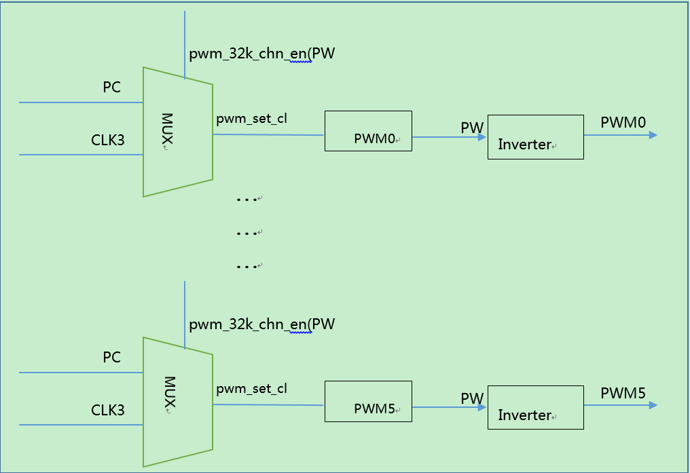

**PWM Clock Source:**

**pclk**

Function: it can be divided, and then the divided clocks are used as the clock source for PWM.

Interface configuration: static inline void pwm_set_clk(unsigned char pwm_clk_div).

Among them: pwm_clk_div = pclk_frequency /pwm_frequency -1 (pwm_clk_div：0~255).

**32K**

Function: does not support frequency division, and only supports continuous mode and counting mode. This configuration is mainly to achieve PWM waveforms in suspend mode.

Interface configuration: static inline void pwm_32k_chn_en(pwm_clk_32k_en_chn_e pwm_32K_en_chn).

**Note:**

> All channels default to the pclk clock source. If you want to use the 32K clock source, call pwm_32k_chn_en to enable the corresponding channel. The channels that are not enabled still use the pclk clock source. In fact, due to the higher carrier frequency in IR applications, 32K clock sources are less likely to be used.

### PWM Cycle and Duty

A signal frame of PWM consists of two parts, Count status (high level time) and Remaining status (low level time). The specific waveform of a signal frame is as follows, where tmax is the cycle time:

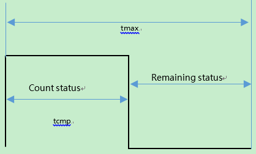

The functions that set the signal frame cycle and duty in the driver all use tcmp and tmax as parameters.

(1) General function interface for setting duty cycle (supports all channels):

```C
static inline void pwm_set_tcmp(pwm_id_e id, unsigned short tcmp);
static inline void pwm_set_tmax(pwm_id_e id, unsigned short tmax);
```

pwm_set_tcmp：

id: Which PWM channel to choose; tcmp:Set high level duration.

pwm_set_tmax：

id: Which PWM channel to choose; tmax:Set cycle.

**Note:**

>- Set the PWM cycle in the second parameter of the pwm_set_tmax function. The parameter type is short. The minimum value of tmax is 1 and cannot be 0. If it is 0, then pwm is not working, so the value range of tmax is: 1~65535.
>- Set the PWM duty cycle in the second parameter of the pwm_set_tcmp function. The parameter type is short. The minimum value of tcmp can be 0. When it is 0, the pwm waveform is always low and the maximum value can be It is tmax, and the waveform of pwm is always high at this time, so the value range of tcmp is: 0~tmax.

(2) When using IR FIFO Mode and IR DMA FIFO Mode of PWM0, another function interface will be used.

```C
static inline void pwm_set_pwm0_tcmp_and_tmax_shadow(unsigned short tmac_tick, unsigned short cmp_tick);
```

**Note:**

> In the pwm_set_pwm0_tcmp_and_tmax_shadow function, the parameter tmac_tick sets the cycle of pwm0, the parameter cmp_tick sets the high level duration of pwm0, the value range of tmac_tick: 1~65536, the value range of cmp_tick: 0~cycle_tick.

(3) When using PWM0's counting mode and IR mode, pwm0 needs to set the pulse output number function, the following function interface is used:

```C
static inline void pwm_set_pwm0_pulse_num(unsigned short pulse_num);
```

pulse_num: pulse number.

(4) When pwm0 writes cfg data to fifo, the following function interface is used:

```C
static inline void pwm_set_pwm0_ir_fifo_cfg_data(unsigned short pulse_num, unsigned char use_shadow, unsigned char carrier_en);
```

use_shadow:

1: Use the cycle and duty set under the pwm_set_pwm0_tcmp_and_tmax_shadow function.

0: Use the cycle and duty set under the pwm_set_tmax and pwm_set_tcmp functions.

carrier_en:

1: Output pulse according to the settings of the parameters pulse_num and use_shadow.

0: Output low level, the duration is calculated according to the parameters pulse_num and use_shadow.

For PWM0 ~ PWM5, the hardware will automatically put the high level in the front and the low level in the back. If you want low level first, there are several ways:

- Use the corresponding PWM0_N ~ PWM5_N, which is the opposite of PWM0 ~ PWM5.

- Use API static inline void pwm_invert_en(pwm_id_e id) to directly invert the waveform of PWM0 ~ PWM5.

For example, the current PWM clock is 16MHz, and you need to set a PWM0 with a PWM period of 1ms and a duty cycle of 50%. A frame method is:

```C
pwm_set_tmax (PWM0_ID , 16000)
pwm_set_tcmp (PWM0_ID , 8000)
```

### PWM Revert

The following API serves to invert PWM0~PWM5 waveform.

```C
void pwm_invert_en (pwm_id id)
```

The following API serves to invert PWM0_N ~ PWM5_N waveform.

```C
void pwm_n_invert_en (pwm_id id)
```

### PWM Start and Stop

The following 2 APIs serve to enable/disable specified PWM.

```C
void pwm_start(pwm_id id) ;
void pwm_stop(pwm_id id) ;
```

### PWM Mode

PWM supports 5 modes: Normal mode (Continuous mode), while only PWM0 supports Counting mode, IR mode, IR FIFO mode and IR DMA FIFO mode, defined as following:

```C
typedef enum{
	PWM_NORMAL_MODE   		= 0x00,
	PWM_COUNT_MODE    		= 0x01,
	PWM_IR_MODE       		= 0x03,
	PWM_IR_FIFO_MODE  		= 0x07,
	PWM_IR_DMA_FIFO_MODE  	= 0x0F,
}pwm_mode_e;
```

PWM0 supports all 5 modes, Normal mode (Continuous mode), while only PWM0 supports Counting mode, IR mode, IR FIFO mode and IR DMA FIFO mode, PWM1~PWM5 supports only normal mode.

### PWM Pulse Number

The API below serves to set pulse number, i.e. number of Signal Frames, for output waveform of specified PWM channel. 

```C
void pwm_set_pwm0_pulse_num(unsigned short pulse_num)
```

This API is only used for Counting mode, IR mode, IR FIFO mode and IR DMA FIFO mode, but not applies to Normal mode with continuous pulses.

### PWM Interrupt

The interrupt settings supported by PWM are explained as follows (the hardware will not automatically clear the interrupt flag bit, and the software needs to clear it manually).

Table: Interrupt settings supported by PWM

|PWM |  Supported Interrupt |
|:----------|:---------------------------------------------------------------|
|PWM0 |1.FLD_PWM0_FRAME_DONE_IRQ: When each signal frame is completed, an interrupt will be generated. 2.FLD_PWM0_PNUM_IRQ: Every time a pulse group is sent, an interrupt will be generated. 3.FLD_PWM0_IR_FIFO_IRQ: When the cfg data in the FIFO is less than (not including equal to) the set value (trigger_level), the interrupt is entered. 4.FLD_PWM0_IR_DMA_FIFO_IRQ: After the FIFO has executed the cfg data sent by the DMA, it enters the interrupt|
|PWM1 |FLD_PWM1_FRAME_DONE_IRQ: When each signal frame is completed, an interrupt will be generated. |
|PWM2 |FLD_PWM2_FRAME_DONE_IRQ: When each signal frame is completed, an interrupt will be generated. |
|PWM3 |FLD_PWM3_FRAME_DONE_IRQ: When each signal frame is completed, an interrupt will be generated. |
|PWM4 |FLD_PWM4_FRAME_DONE_IRQ: When each signal frame is completed, an interrupt will be generated. |
|PWM5 |FLD_PWM5_FRAME_DONE_IRQ: When each signal frame is completed, an interrupt will be generated. |

A pulse group (pluse groups) containing several frames can be configured through the pwm_set_pwm0_pulse_num function interface:

```C
static inline void pwm_set_pwm0_pulse_num(unsigned short pulse_num)；
```

The value of trigger_level in IR FIFO mode can be configured through the pwm_set_pwm0_ir_fifo_irq_trig_level function interface:

```C
static inline void pwm_set_pwm0_ir_fifo_irq_trig_level(unsigned char trig_level)；
```

### IR DMA FIFO mode

IR DMA FIFO mode is to write configuration data to FIFO through DMA. Each FIFO uses 2 bytes to represent a PWM waveform. When the DMA data buffer takes effect, the PWM hardware module will sent out PWM waveform 1, waveform 2  Waveform n in chronological order continuously, when fifo finishes executing the cfg_data sent by DMA, it triggers the interrupt FLD_PWM0_IR_FIFO_IRQ.

#### Configuration for DMA FIFO

On each DMA FIFO, use 2bytes (16 bits) to configure a PWM waveform. Call the following API to return 2 bytes of DMA FIFO data.

```C
unsigned short pwm_cal_pwm0_ir_fifo_cfg_data(unsigned short pulse_num, 
unsigned char shadow_en, unsigned char carrier_en)
```

The API has three parameters: "carrier_en", "shadow_en" and "pulse_num". The configured PWM waveform is a collection of "pulse_num" PWM signal frames.

BIT(15) determines the format of Signal Frame, the basic unit of the current PWM waveform, corresponding to the "carrier_en" in the API:

- When "carrier_en" is 1, the high pulse in the Signal Frame is effective;

- When "carrier_en" is 0, the signal frame is all 0 data, and the high pulse is invalid.

"Pulse_num" is the number of Signal Frames in the current PWM waveform.

"Shadow_en" can choose the following two definitions.

```C
typedef enum{
		PWM0_PULSE_NORMAL =		0,     
		PWM0_PULSE_SHADOW =		BIT(14), 
}Pwm0Pulse_SelectDef;
```

When "shadow_en" is PWM0_PULSE_NORMAL, the Signal Frame comes from the configuration of pwm_set_tcmp and pwm_set_tmax; when "shadow_en" is PWM0_PULSE_SHADOW, the Signal Frame comes from the configuration of pwm_set_pwm0_tcmp_and_tmax_shadow.

The purpose of PWM shadow mode is to add a set of signal frame configuration, thereby adding more flexibility to the PWM waveform configuration of IR DMA FIFO mode.

#### Set DMA FIFO Buffer

After DMA FIFO buffer is configured, the API below should be invoked to set the starting address of the buffer to DMA module and the transmission data length. The buffer should be four-byte aligned.

```C
void pwm_set_dma_buf(dma_chn_e chn,u32 buf_addr,u32 len)
```

#### Start and Stop for IR DMA FIFO Mode

After DMA FIFO buffer is prepared, the API below should be invoked to start sending PWM waveforms.

```C
void pwm_ir_dma_mode_start(dma_chn_e chn);
```

After all PWM waveforms in DMA FIFO buffer are sent, the PWM module will be stopped automatically. The API below can be invoked to manually stop the PWM module in advance.

```C
void pwm_stop_dma_ir_sending(void);
```

## IR Demo

User can refer to the Ble SDK demo "vendor / B91_feature / feature_ir" and set the macro FEATURE_TEST_MODE in feature_config.h to TEST_IR.

### PWM mode selection

As required by IR transmission, PWM output needs to switch at specific time with small error tolerance of switch time accuracy to avoid incorrect IR.

As described in Link Layer timing sequence (section 3.2.4), Link Layers uses system interrupt to process brx event. (In the new SDK, adv event is processed in the main_loop and does not occupy system interrupt time.) When IR is about to switch PWM output soon, if brx event related interrupt comes first and occupies MCU time, the time to swtich PWM output may be delayed, thus to result in IR error. Therefore IR cannot use PWM Normal mode.

The B91 family introduces an extra IR DMA FIFO mode. In IR DMA FIFO mode, since FIFO can be defined in SRAM, more FIFOs are available, which can effectively solve the shortcoming of PWM IR mode above.

IR DMA FIFO mode supports pre-storage of multiple PWM waveforms into SRAM. Once DMA is started, no software involvement is needed. This can save frequent SW processing time, and avoid PWM waveform delay caused by simultaneous response to multiple IRQs in interrupt system.

Only PWM0 with IR DMA FIFO mode can be used to implement IR. Therefore, in HW design, IR control GPIO must be PWM0 pin or PWM0_n pin.

### Demo IR Protocol

The figure below shows demo IR protocol in the SDK.

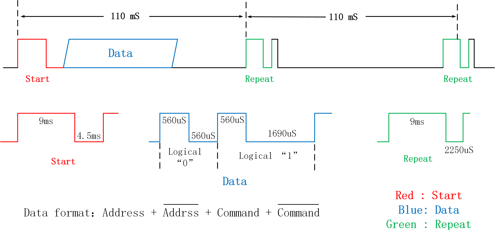

### IR Timing Design

The figure below shows basic IR timing abased demo IR protocol and feature of IR DMA FIFO mode.

In IR DMA FIFO mode, a complete task is defined as FifoTask. Herein the processing of IR repeat signal adopts the method of “add repeat one by one”, i.e. the macro below is defined as 1.

```C
#define ADD_REPEAT_ONE_BY_ONE			1
```

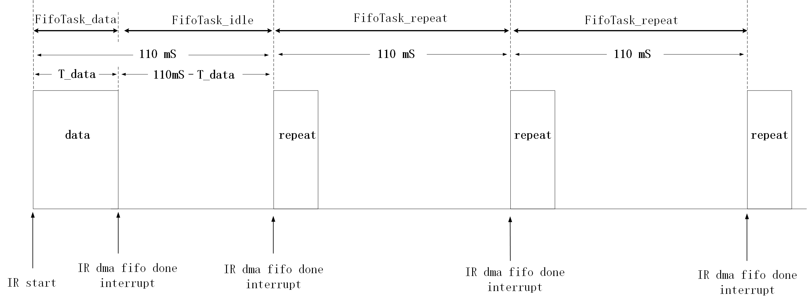

When a button is pressed to trigger IR transmission, IR is disassembled to FifoTasks as shown in the figure above.

(1) After IR is started, run FifoTask_data to send valid data. The duration of FifoTask_data, marked as T_data, is not certain due to the uncertainty of data. After FifoTask_data is finished, trigger IRQ_PWM0_IR_DMA_FIFO_DONE.

(2) In interrupt function of IRQ_PWM0_IR_DMA_FIFO_DONE, start FifoTask_idle phase to send signal without carrier and it lasts for a duration of (110ms – T_data). This phase is designed to guarantee the time point the first FifoTask_repeat is 110ms later after IR is started. After FifoTask_idle is finished, trigger IRQ_PWM0_IR_DMA_FIFO_DONE.

(3) In interrupt function of IRQ_PWM0_IR_DMA_FIFO_DONE, start the first FifoTask_repeat. Each FifoTask_repeat lasts for 110ms. By adding FifoTask_repeat in corresponding interrupt function, IR repeat signals can be sent continuously.

(4) The time point to stop IR is not certain, and it depends on the time to release the button. After the APP layer detects key release, as long as FifoTask_data is correctly completed, IR transmission is finished by manually stoppng IR DMA FIFO mode.

Following shows some optimization steps for the IR timing design above.

(1) Since FifoTask_repeat timing is fixed, and there are many DMA fifos in IR DMA FIFO mode, multiple FifoTask_repeat of 110ms can be assembled into one FifoTask_repeat\*n, so as to reduce the number of times to process IRQ_PWM0_IR_DMA_FIFO_DONE in SW. Correponding to the processing of “ADD_REPEAT_ONE_BY_ONE” macro defined as 0, the Demo herein assembles five IR repeat signals into one FifoTask_repeat\*5. User can further optimize it according to the usage of DMA fifos.

(2) Based on step 1, combine FifoTask_ilde and the first “FifoTask_repeat\*n” to form “FifoTask_idle_repeat*n”.

The figure below shows IR timing after optimization.

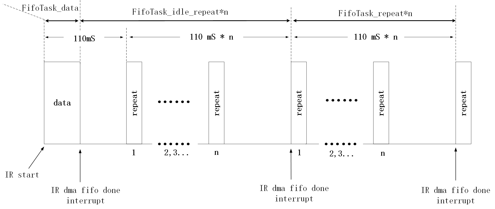

As per the IR timing design above, corresponding code in SW flow is shown as below:

At IR start, invoke the function “ir_nec_send”, enable FifoTask_data, and use interrupt to control the following flow. In the interrupt when FifoTask_data is finished, enable FifoTask_idle. In the interrupt when FifoTask_idle is finished, enable FifoTask_repeat. Before manually stopping IR DMA FIFO mode, FifoTask_repeat is executed continually.

```C
void ir_nec_send(u8 addr1, u8 addr2, u8 cmd)
{
	if(ir_send_ctrl.last_cmd != cmd)
	{
		if(ir_sending_check())
		{
			return;
		}
		ir_send_ctrl.last_cmd = cmd;

	    // set waveform input in sequence
		T_dmaData_buf.data_num = 0;

		//waveform for start bit
		T_dmaData_buf.data[T_dmaData_buf.data_num ++] = waveform_start_bit_1st;
		T_dmaData_buf.data[T_dmaData_buf.data_num ++] = waveform_start_bit_2nd;

		//add data
		u32 data = (~cmd)<<24 | cmd<<16 | addr2<<8 | addr1;
		for(int i=0;i<32;i++){
			if(data & BIT(i)){
				//waveform for logic_1
				T_dmaData_buf.data[T_dmaData_buf.data_num ++] = waveform_logic_1_1st;
				T_dmaData_buf.data[T_dmaData_buf.data_num ++] = waveform_logic_1_2nd;
			}
			else{
				//waveform for logic_0
				T_dmaData_buf.data[T_dmaData_buf.data_num ++] = waveform_logic_0_1st;
				T_dmaData_buf.data[T_dmaData_buf.data_num ++] = waveform_logic_0_2nd;
			}
		}

		//waveform for stop bit
		T_dmaData_buf.data[T_dmaData_buf.data_num ++] = waveform_stop_bit_1st;
		T_dmaData_buf.data[T_dmaData_buf.data_num ++] = waveform_stop_bit_2nd;
		T_dmaData_buf.dma_len = T_dmaData_buf.data_num * 2;
		ir_send_ctrl.repeat_enable = 1;  //need repeat signal
		ir_send_ctrl.is_sending = IR_SENDING_DATA;
//dma init
		pwm_set_dma_config(PWM_DMA_CHN);
		pwm_set_dma_buf(PWM_DMA_CHN, (u32) &T_dmaData_buf ,T_dmaData_buf.dma_len);
		pwm_ir_dma_mode_start(PWM_DMA_CHN);
		pwm_set_irq_mask(FLD_PWM0_IR_DMA_FIFO_IRQ);
		pwm_clr_irq_status(FLD_PWM0_IR_DMA_FIFO_IRQ );
		core_interrupt_enable();//
		plic_interrupt_enable(IRQ16_PWM);
		ir_send_ctrl.sending_start_time = clock_time();
	}
}
```

### IR Initialization

#### rc_ir_init

IR initialization function is shown as below. Please refer to demo code in the SDK.

```C
void rc_ir_init(void)
```

#### IR Hardware Configuration

Following shows the PWM configuration code.

```C
pwm_n_invert_en(PWM0_ID);
pwm_set_clk((unsigned char) (sys_clk.pclk*1000*1000/PWM_CLK_SPEED-1));//use pclk is ok
pwm_set_pin(PWM_PIN);
pwm_set_pwm0_mode(PWM_IR_DMA_FIFO_MODE);
pwm_set_tcmp(PWM_ID, PWM_CARRIER_HIGH_TICK);
pwm_set_tmax(PWM_ID, PWM_CARRIER_CYCLE_TICK);
```

Following shows the DMA configuration code.

```C
pwm_set_dma_config(PWM_DMA_CHN);
pwm_set_dma_buf(PWM_DMA_CHN, (u32) &T_dmaData_buf ,T_dmaData_buf.dma_len);
pwm_ir_dma_mode_start(PWM_DMA_CHN);
```

Following shows the interrupt configuration code.

```C
pwm_set_irq_mask(FLD_PWM0_IR_DMA_FIFO_IRQ);
pwm_clr_irq_status(FLD_PWM0_IR_DMA_FIFO_IRQ );
core_interrupt_enable();
plic_interrupt_enable(IRQ16_PWM);
```

The Demo IR carrier frequency is 38K, the cycle is 26.3uS, and the duty is 1/3. Use API pwm_set_tmax and pwm_set_tcmp and configure the cycle and duty. 

```c
pwm_set_tcmp(PWM_ID, PWM_CARRIER_HIGH_TICK);
pwm_set_tmax(PWM_ID, PWM_CARRIER_CYCLE_TICK);
```

In Demo IR, there are no multiple different carrier frequencies. This 38K carrier is sufficient for all FifoTask configurations. So there is no need to use PWM shadow mode. An introduction to the model can be found in section 11.1.9.1.

#### IR Variable Initialization

Related variables in the SDK demo includes waveform_start_bit_1st, waveform_start_bit_2nd, and etc.

As introduced in IR timing design, FifoTask_data and FifoTask_repeat should be configured.

Start signal = 9ms carrier signal + 4.5ms low level signal (no carrier). The “pwm_config_dma_fifo_waveform” is invoked to configure the two corresponding DMA FIFO data.

```C
//start bit, 9000 us carrier,  4500 us low
	waveform_start_bit_1st = pwm_cal_pwm0_ir_fifo_cfg_data(9000 * CLOCK_PWM_CLOCK_1US/PWM_CARRIER_CYCLE_TICK, PWM0_PULSE_NORMAL, 1);
	waveform_start_bit_2nd = pwm_cal_pwm0_ir_fifo_cfg_data(4500 * CLOCK_PWM_CLOCK_1US/PWM_CARRIER_CYCLE_TICK, PWM0_PULSE_NORMAL, 0);
```

The method also applies to configure stop signal, repeat signal, data logic “1” signal, and data logic “0” signal.

### FifoTask Configuration

#### FifoTask_data

As per demo IR protocol, to send a cmd (e.g. 7), first send start signal, i.e. 9ms carrier signal + 4.5ms low level signal (no carrier); then send “address+ ~address+ cmd + ~cmd”. In the demo code, address is 0x88.

When sending the final bit of “~cmd”, logical “0” or logical “1” always contains some non-carrier signals at the end. If “~cmd” is not followed by any data, there may be a problem on Rx side: Since there’s no boundary to differentiate carrier, the FW does not know whether the non-carrier signal duration of the final bit is 560us or 1690us, and fails to recognize whether it’s logical “0” or logical “1”.

To solve this problem, the Data signal should be followed by a “stop” signal which is defined as 560us carrier signal + 500us non-carrier signal.

Thus, the FifoTask_data mainly contains the three parts below:

(1) start signal: 9ms carrier signal + 4.5ms low level signal (no carrier)

(2) data signal: address+ ~address+ cmd + ~cmd

(3) stop signal: 560us carrier signal + 500us non-carrier signal

According to the above 3 signals, configure the Dma FIfo buffer to start the IR transmission, which is partially implemented in the ir_nec_send function, where part of the relevant code is as follows.

```C
// set waveform input in sequence
	T_dmaData_buf.data_num = 0;
	//waveform for start bit
	T_dmaData_buf.data[T_dmaData_buf.data_num ++] = waveform_start_bit_1st;
	T_dmaData_buf.data[T_dmaData_buf.data_num ++] = waveform_start_bit_2nd;

	//add data
	u32 data = (~cmd)<<24 | cmd<<16 | addr2<<8 | addr1;
	for(int i=0;i<32;i++){
		if(data & BIT(i)){
			//waveform for logic_1
			T_dmaData_buf.data[T_dmaData_buf.data_num ++] = waveform_logic_1_1st;
			T_dmaData_buf.data[T_dmaData_buf.data_num ++] = waveform_logic_1_2nd;
		}
		else{
			//waveform for logic_0
			T_dmaData_buf.data[T_dmaData_buf.data_num ++] = waveform_logic_0_1st;
			T_dmaData_buf.data[T_dmaData_buf.data_num ++] = waveform_logic_0_2nd;
		}
	}

	//waveform for stop bit
	T_dmaData_buf.data[T_dmaData_buf.data_num ++] = waveform_stop_bit_1st;
	T_dmaData_buf.data[T_dmaData_buf.data_num ++] = waveform_stop_bit_2nd;
	T_dmaData_buf.dma_len = T_dmaData_buf.data_num * 2;
```

#### FifoTask_idle

As introduced in IR timing design, FifoTask_idle lasts for the duration “110mS – T_data”. Record the time when FifoTask_data starts:

```C
ir_send_ctrl.sending_start_time = clock_time();
```

Then calculate FifoTask_idle time in the interrupt triggered when FifoTask_data is finished:

```C
  110mS – (clock_time() - ir_send_ctrl.sending_start_time)
```

Demo code:

```C
u32 tick_2_repeat_sysClockTimer16M = 110*CLOCK_16M_SYS_TIMER_CLK_1MS - (clock_time() ir_send_ctrl.sending_start_time);
u32 tick_2_repeat_sysTimer = (tick_2_repeat_sysClockTimer16M*CLOCK_PWM_CLOCK_1US>>4);
```

Please pay attention to time unit switch. As introduced in Clock module, Sytem Timer frequency used in software timer is fixed as 16MHz. Since PWM clock is derived from system clock, user needs to consider the case with system clock rather than 16MHz (e.g. 24MHz, 32MHz).

FifoTask_idle does not send PWM waveform, which can be considered to continually send non-carrier signal. It can be implemented by setting the first parameter “carrier_en” of the API “pwm_config_dma_fifo_waveform” as 0.

```C
waveform_wait_to_repeat = pwm_config_dma_fifo_waveform(0, PWM0_PULSE_NORMAL, tick_2_repeat_sysTimer/PWM_CARRIER_CYCLE_TICK);
```

#### FifoTask_repeat

As per Demo IR protocol, repeat signal is 9ms carrier signal + 2.25ms non-carrier signal.

Similar to the processing of FifoTask_data, the end of repeat signal should be followed by 560us carrier signal as stop signal.

As introduced in IR timing design, repeat signal lasts for 110ms, so the duration of non-carrier signal after the 560us carrier signal should be:

&nbsp;&nbsp;110ms – 9ms – 2.25ms – 560us = 99190us

The code below shows the configuration for a complete repeat signal.

```C
//repeat signal  first part,  9000 us carrier, 2250 us low
	waveform_repeat_1st = pwm_config_dma_fifo_waveform(1, PWM0_PULSE_NORMAL, 9000 * CLOCK_SYS_CLOCK_1US/PWM_CARRIER_CYCLE_TICK);
	waveform_repeat_2nd = pwm_config_dma_fifo_waveform(0, PWM0_PULSE_NORMAL, 2250 * CLOCK_SYS_CLOCK_1US/PWM_CARRIER_CYCLE_TICK);

//repeat signal  second part,  560 us carrier, 99190 us low
	waveform_repeat_3rd = pwm_config_dma_fifo_waveform(1, PWM0_PULSE_NORMAL, 560 * CLOCK_SYS_CLOCK_1US/PWM_CARRIER_CYCLE_TICK);
	waveform_repeat_4th = pwm_config_dma_fifo_waveform(0, PWM0_PULSE_NORMAL, 99190 * CLOCK_SYS_CLOCK_1US/PWM_CARRIER_CYCLE_TICK);

T_dmaData_buf.data[T_dmaData_buf.data_num ++] = waveform_repeat_1st;
T_dmaData_buf.data[T_dmaData_buf.data_num ++] = waveform_repeat_2nd;
T_dmaData_buf.data[T_dmaData_buf.data_num ++] = waveform_repeat_3rd;
T_dmaData_buf.data[T_dmaData_buf.data_num ++] = waveform_repeat_4th;
```

#### FifoTask_repeat\*n and FifoTask_idle_repeat*n

By simple superposition in DMA Fifo buffer, “FifoTask_repeat\*n” and “FifoTask_idle_repeat*n” can be implemented on the basis of FifoTask_idle and FifoTask_repeat.

### Check IR Busy Status in APP Layer

In the Application layer, user can use the variable “ir_send_ctrl.is_sending” to check whether IR is busy sending data or repeat signal.

The following shows the determination of whether IR is busy in power management. When IR is busy, MCU cannot enter suspend.

```C
if( ir_send_ctrl.is_sending)
{
		bls_pm_setSuspendMask(SUSPEND_DISABLE);
}
```

## IR Learn

### IR Learn introduction

IR learning is done by using the characteristics of IR tube to transmit and receive IR signals, and using the amplifier circuit to amplify and convert the received weak signals into digital signals, thus completing the learning of IR waveforms. After learning, the relevant data is stored in RAM/Flash, and then the learned waveform is sent out using the transmitting characteristics of the IR tube.

### IR Learn hardware principle

The hardware circuit of IR learn is shown as below.

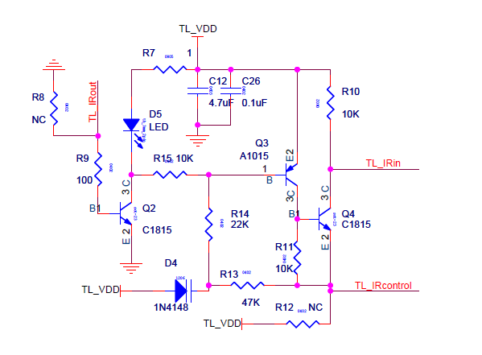

When in  the IR learning state, IR_OUT and IR_CONTROL pin should be set to GPIO function and pulled low at the same time, then Q2 and Q3 will be in the cutoff state, IR_IN level is high when there is no waveform, and then will follow the waveform received by the triode and change: when the input waveform is high, IR_IN is pulled low, on the contrary IR_IN back to high. IR learning also takes advantage of this feature, using GPIO low level trigger to complete the learning algorithm, which will be described in detail later. As shown in the figure below, the transmitter is using NEC format IR, and the waveform of IR_IN is captured as shown in the figure below.

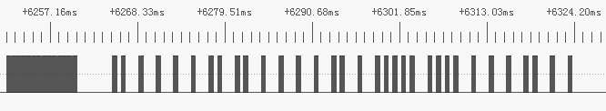

The dark part is the carrier waveform and the white part is the non-carrier waveform. The waveform of the amplified carrier part is shown in the figure below, which is high when no IR signal is received in front, and IR_IN is pulled down when a signal is received. The IR_IN low level is 9.35us and the period is 26.4us, which is converted to a carrier frequency of 37.88kHz. This matches the NEC protocol carrier of 38kHz with a duty cycle of 1/3.

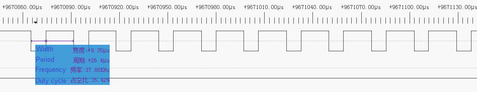

### IR Learn software principle

During IR learning, the chip will set and enable the IR_IN trigger interrupt at falling edge. Every time it receives an IR carrier waveform from its device, IR_IN will be pulled low and trigger the interrupt. In the interrupt, the timing, number of waveforms, and carrier period of the carrier and non-carrier waveforms will be recorded by the algorithm, and the waveforms will be copied and sent out according to the above information when sending.

The following figure shows the order of recording during interrupt processing, the duration of the carrier/non-carrier part shown in the previous 1, 2... will be recorded in the buff. At the same time, the duration of a certain number of single carriers constituting 1 is recorded, and the carrier frequency fc of the waveform is obtained by averaging. When the waveform is sent after the recording is completed, the carrier frequency fc is fixed with a duty cycle of 1/3, and the time corresponding to 1 and 2 is sent out in the carrier/non-carrier order to complete the IR learning process.

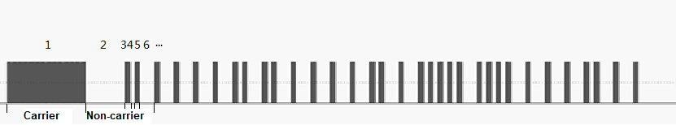

### IR Learn software description

To quickly complete the IR learning and sending function, the following steps are required.

(1) Initialize with ir_learn_init(void).

(2) Add the relevant part of the ir_learn_irq_handler(void) interrupt handling function to the interrupt function.

(3) Add the ir_learn_detect(void) section to the program to determine the learning results.

(4) Modify the relevant macro definitions in rc_ir_learn.h.

(5) Add the ir_learn_start(void) function to the appropriate location in the UI layer to start learning.

(6) After judging the result by the judgment function set in step 3, use get_ir_learn_state(void) to check the IR learning status and do UI layer operations according to the success or failure of learning: if successful, continue steps 7~9 to finish sending, if failure, you can re-execute step 5 or perform other custom UI actions.

(7) After successful learning, the learning result can be sent. The first step of sending is to initialize the IR transmission, using ir_learn_send_init(void). Be noted that after calling this function IR_OUT will be changed to PWM output pin, if you want to re-enter the IR learning state, you must re-execute step 1 to re-initialize the pin function.

(8) The second step of sending is to copy the useful parameters of the learning result to a fixed area, RAM/Flash are suitable, use the ir_learn_copy_result(ir_learn_send_t* send_buffer) function to copy to the structure defined for sending the IR learning result.

(9) The final step of sending is to call the ir_learn_send(ir_learn_send_t* send_buffer) function to send the learning results.

At this point, the entire functionality of IR learning has been implemented. In the following section, we will specify how to add the functions mentioned in the steps, one by one, in the order of the above steps.

#### IR_Learn initialization

When using the IR Learn function, after copying rc_ir_learn.c and rc_ir_learn.h into the project, the first step is to call the initialization function.

```C
void ir_learn_init(void)
```

This function finds its entity in rc_ir_learn.c. It first clears the structure used, then sets IR_OUT and IR_CONTROL to GPIO and outputs 0. Then it sets the GPIO interrupt enable and clears the interrupt flag bit.

#### IR_Learn interrupt handling

Since the IR Learn function is implemented based on interrupts, the second step requires adding interrupt handling functions to the interrupts. As the protocol stack will be constructed to enter the interrupt several times, in order to distinguish it is a GPIO interrupt, the interrupt flag bit will be read first and then recorded when it is an interrupt generated by GPIO. The implementation code is as follows.

```C
void ir_learn_irq_handler(void)
{
	gpio_clr_irq_status(FLD_GPIO_IRQ_CLR);
	if ((g_ir_learn_ctrl -> ir_learn_state != IR_LEARN_WAIT_KEY) && (g_ir_learn_ctrl -> ir_learn_state != IR_LEARN_BEGIN))
    {
		return;
    }
	ir_record(clock_time());  // IR Learning
}
```

Where ir_record() is the specific learning algorithm, the function pre_attribute_ram_code_ is put into the ram in order to speed up the learning and avoid errors caused by long execution time.

#### IR_Learn result processing function

The main role of the result processing function is to change the state of IR learning in time according to the current IR learning situation, and each loop needs to be executed to complete the detection in time. The function can be called in the main_loop().

```C
void ir_learn_detect(void)
```

As can be seen from the function entity, when the time after the start of learning exceeds IR_LEARN_ OVERTIME_THRESHOLD, the waveform is still not received and it is a timeout failure; after learning has started and has received the signal, the set threshold time passed but no new signal received, it is considered to have completed the learning state, at this time, if the received carrier and non-carrier part exceeds the set number (default is 15), the learning is considered successful, otherwise it is considered failed.

#### IR_Learn macro definition

To increase extensibility, some macro definitions are added to rc_ir_learn.h.

```C
#define  GPIO_IR_OUT	                PWM_PIN   // GPIO_PE3
#define  GPIO_IR_CONTROL	            GPIO_PE0
#define  GPIO_IR_LEARN_IN	            GPIO_PE1
```

The first three define the GPIO pins, IN/OUT/CONTROL, which change according to the specific design.

#### IR_Learn start function

The IR Learn start function is called where needed in the UI layer to start the IR learning process. The function is as follows.

```C
ir_learn_start();
```

#### IR_Learn state query

Users can call the status query function to query the learning results, the function is as follows.

```C
unsigned char get_ir_learn_state(void)
{
	if(g_ir_learn_ctrl -> ir_learn_state == IR_LEARN_SUCCESS)
		return 0;
	else if(g_ir_learn_ctrl -> ir_learn_state < IR_LEARN_SUCCESS)
		return 1;
	else
		return (g_ir_learn_ctrl -> ir_learn_state);
}
```

Return value = 0: IR learning is successful.

Return value = 1: IR learning is in progress or not started.

Return value > 1: IR learning failed, the return value is the reason for failure, which corresponds to the reason for failure known in ir_learn_states.  The ir_learn_states is defined as follows.

```C
enum {
    IR_LEARN_DISABLE = 0x00,
    IR_LEARN_WAIT_KEY,
    IR_LEARN_KEY,
    IR_LEARN_BEGIN,
    IR_LEARN_SAMPLE_END,
    IR_LEARN_SUCCESS,
    IR_LEARN_FAIL_FIRST_INTERVAL_TOO_LONG,
    IR_LEARN_FAIL_TWO_LONG_NO_CARRIER,
    IR_LEARN_FAIL_WAIT_OVER_TIME,
    IR_LEARN_FAIL_WAVE_NUM_TOO_FEW,
    IR_LEARN_FAIL_FLASH_FULL,
    IR_LEARN_FAIL,
}ir_learn_states;
```

#### IR_Learn_Send initialization

After the UI layer determines that the learning is successful, the send initialization function needs to be called before sending the learned waveform, and the function is as follows.

```C
void ir_learn_send_init(void)
```

The initialization function mainly sets PWM-related parameters, interrupt-related parameters, and sets IR_OUT as the output port of PWM, noting that the IR learning function stops after this function is used, and the initialization function described in 11.3.4.1 needs to be called again if it needs to be enabled again.

#### IR_Learn result copy function

In the design, there are often cases where several keys need to have IR learning functions, so the UI layer wants to be able to copy the learning results to a location in RAM/Flash for later transmission after successful learning, and to start the learning process for other keys. Therefore, a result copy function is provided to copy the necessary parameters for sending. The function is as follows.

```C
void ir_learn_copy_result(ir_learn_send_t* send_buffer)
```

The send_buffer is the structure needed for IR learning to send, which contains the clock_tick value for one carrier cycle, the total number of carriers and non-carriers (counting from 0), and the buffer of carriers and non-carriers already to be sent.

```C
typedef struct{
	unsigned int   ir_learn_carrier_cycle;
	unsigned short ir_learn_wave_num;
	unsigned int   ir_lenrn_send_buf[MAX_SECTION_NUMBER];
}ir_learn_send_t;
```

#### IR_Learn send function

After the learning is successful and the pre-send operation is done, the send function can be called to send the learning result. The function is as follows.

```C
void ir_learn_send(ir_learn_send_t* send_buffer);
```

where send_buffer is the structure used in the previous function. The send function does not carry the repeat function, each call to the function will send the learned waveform, if you need to repeat the user can use the timer in the UI layer to design their own repeated calls to the function.

### IR Learn algorithm details

To facilitate understanding the code, the principle of the IR learning algorithm is explained in detail here. The following is a simulated waveform, which simulates a complete packet of IR data. The data contains Start carrier, Start No carrier, bit 1 carrier, bit 1 no carrier, bit 0 carrier, bit 0 no carrier, End carrier, End no carrier.

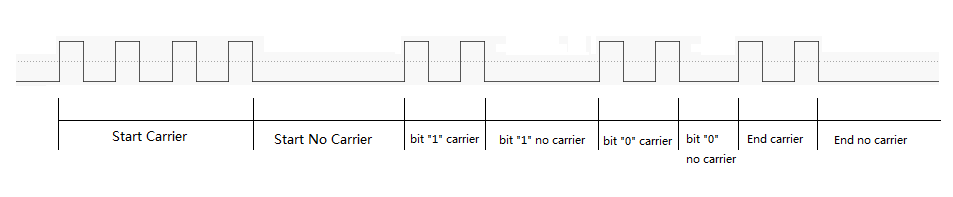

Since IR_IN is set in the IR learning state to wake up on the falling edge of the GPIO, normally every falling edge goes to an interrupt where we do the recording operation. In the IR learning algorithm, instead of identifying the waveform to a specific code type, the waveform is recorded with the concept of carrier/non-carrier. Consecutive carriers are considered as one carrier segment, while two carriers separated by a long time are considered as non-carriers. Thus the above is considered in the IR learning algorithm as follows.

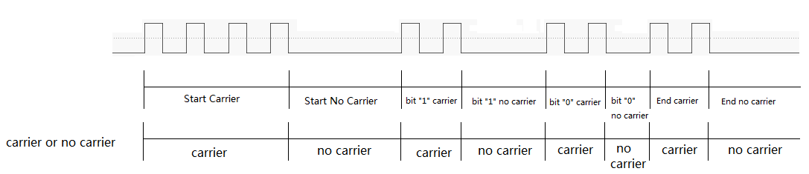

Each time the algorithm is executed, the current time curr_trigger_tm_point is recorded, and the last_trigger_tm_point is subtracted from the last interrupt time to get a time_interval of one cycle. If this time is relatively small, it is considered to be still in the carrier; if this time exceeds the set threshold, it is considered to be in the middle of a no carrier segment, and at this time it is in the first waveform of the new carrier segment: at this time, it is necessary to record the last carrier time and put it into the buffer, which is the difference between the first interrupt entry time and the last interrupt time, as shown below.

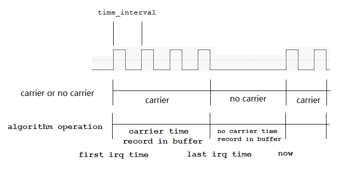

According to this method, let wave_series_cnt increase from 0, corresponding to the first carrier segment, the first non-carrier segment, the second carrier segment, the second non-carrier segment... At the same time, the calculated time of each segment is stored in the corresponding location (wave_series_buf\[wave_series_cnt]) in wave_series_buf\[0], wave_series_buf\[1], and wave_series_buf\[2]. All the way to the end of the waveform, wave_series_cnt represents the total number of segments, and wave_series_buf is loaded with the length of each segment.

In addition, during the first N (settable) interrupts, N times are recorded, and the smallest one of them is taken as the carrier period, which is used when sending after the learning is finished, and the duty cycle is 1/3 (settable) by default.

After the IR learning process is finished, the learning result can be sent. When sending the learning result, it is also sent according to the concept of carrier and non-carrier. Using PWM DMA_FIFO mode, after putting the learned carrier frequency, duty cycle, and duration of each segment into DMA buffer, enable DMA, the chip will automatically send out the learned waveform until all the sending is finished, and generate FLD_IRQ_PWM0_IR_DMA_FIFO_DONE interrupt.

### IR Learn learning parameter adjustment

Some parameters related to IR learning are defined in rc_ir_learn.h. When setting the parameter mode to USER_DEFINE is selected and set by yourself, it will have different effects on the learning effect, which will be described in detail here.

```C
#define		IR_LEARN_MAX_FREQUENCY			40000
#define		IR_LEARN_MIN_FREQUENCY			30000

#define		IR_LEARN_CARRIER_MIN_CYCLE		16000000/IR_LEARN_MAX_FREQUENCY
#define		IR_LEARN_CARRIER_MIN_HIGH_TICK	IR_LEARN_CARRIER_MIN_CYCLE/3
#define		IR_LEARN_CARRIER_MAX_CYCLE		16000000/IR_LEARN_MIN_FREQUENCY
#define		IR_LEARN_CARRIER_MAX_HIGH_TICK	IR_LEARN_CARRIER_MAX_CYCLE/3
```

The above parameters set the frequencies supported by IR learning. The default value is set to 30k~40k. The following parameters are the maximum and minimum values of the sys_tick value per carrier cycle, default 1/3 duty cycle high level to sys_tick value, calculated from the frequency parameters for later parameter calculation. Other parameters that affect the learning results are described below, and each parameter is defined in rc_ir_learn.h using macros.

```C
#define			IR_LEARN_INTERVAL_THRESHOLD		(IR_LEARN_CARRIER_MAX_CYCLE*3/2)
#define			IR_LEARN_END_THRESHOLD	 		(30*SYSTEM_TIMER_TICK_1MS)
#define			IR_LEARN_OVERTIME_THRESHOLD		10000000						// 10s
#define			IR_CARR_CHECK_CNT		 		10
#define			CARR_AND_NO_CARR_MIN_NUMBER		15
#define			MAX_SECTION_NUMBER				100
```

(1) IR_LEARN_INTERVAL_THRESHOLD.

Carrier period threshold, the default value is 1.5 times the IR_LEARN_CARRIER_MAX_CYCLE value, when the time to enter the interrupt twice is more than this threshold is considered at the carrier side.

(2)IR_LEARN_END_THRESHOLD

IR learning end threshold, when the time to enter interrupt twice exceeds this threshold, or the threshold is exceeded without entering the next interrupt, the IR learning process is considered to be finished.

(3) IR_LEARN_OVERTIME_THRESHOLD

Timeout time, after the start of IR learning process, if the threshold value is exceeded and the received waveform enters interrupt, the learning process is considered to be finished and failed.

(4) IR_CARR_CHECK_CNT

Set the number of packets to be collected to determine the carrier cycle time, the default is set to 10, which means the smallest of the time_interval of the first 10 interrupts will be taken as the carrier time and used to calculate the carrier cycle when sending learning results.

(5) CARR_AND_NO_CARR_MIN_NUMBER

The minimum threshold of carrier and non-carrier segments. When the IR learning process is completed, if the total number of recorded carrier and non-carrier segments is less than this threshold, the entire waveform is considered not learned and the IR learning fails.

(6) MAX_SECTION_NUMBER

The maximum threshold value of carrier and non-carrier section, which will be used when setting the buffer size. If setting to 100, the IR learning process will record at most 100 carrier and non-carrier sections; if it exceeds, the IR learning will be considered failed.

### IR Learn common issues

During the learning process, sometimes it encounters that the frequency of the waveform sent after successful learning changes. The possible cause is that the frequency of the learned waveform is too high, resulting in the execution of the algorithm in the interrupt for more than the carrier period. This is shown in the figure below.

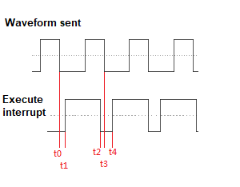

Take the IR signal with duty cycle 1/3 and transmitting frequency 38K as an example, one carrier cycle is about 26.3us, high level accounts for 1/3 about 8.7us. At the moment of t0, the external waveform carrier end point is pulled low from high, the chip GPIO triggers an interrupt, and the interrupt needs to execute several instructions in the assembly to save the site to enter the interrupt, after testing at t1 after about 4us to enter the interrupt function to start executing the operation. Due to the long execution time in the interrupt, the interrupt execution ends at t2, and it also takes about 4us to restore the site. In the process of restoring the site at t3 moment, as the next falling edge of the transmit waveform arrives, the interrupt flag bit is cleared at this time and the hardware will trigger the interrupt again. The interrupt has been triggered again after restoring the site about 4us after t2, so the chip saves the site again to enter the interrupt at t4 after 4us in entering the interrupt for operation, after which the above process will be repeated. As seen by the waveform executed by the interrupt, its time is completely deformed and the time to enter the interrupt twice is also larger than the time of one carrier cycle of the original waveform. Since the IR learning is done exactly according to the time recorded in the interrupt, the abnormal time of entering the interrupt will lead to abnormal IR learning results.

There are several ways to solve this problem.

One is to put the IR learning algorithm into the ram_code to reduce the execution time, by default this operation is already performed and does not need to be modified.

The second is to make sure to reduce other processing of interrupts. BLE needs to be disabled in IR learning because it takes up a lot of time in interrupts during non-IDLE states, and the UI layer also tries to prohibit other interrupt sources from causing interrupts during IR learning to prevent exceptions.

## Demo description

The feature_IR of the BLE SDK contains the normal IR sending function and IR learning function, and the IR encoding method used is NEC encoding. The switch between the different modes is shown in the following code.

```C
void key_change_proc(void)
{
switch(key0)
  {……
      if(switch_key == IR_mode){……
	}
      else if(switch_key == IR_Learn_mode){……
	}
else{…… 
	}
  }
}
```

Each mode can be switched to a different mode by pressing a key to perform the corresponding initialization operation, the specific code implementation can be referred to the BLE SDK.

\newpage
# Feature Demo Introduction

B91_feature_test provides demo codes for some commonly used BLE-related features. Users can refer to these demos to complete their own function implementation. See code for details. Select the macro "FEATURE_TEST_MODE" in app_config.h in the B91_feature_test project to switch to the demo of different feature test.

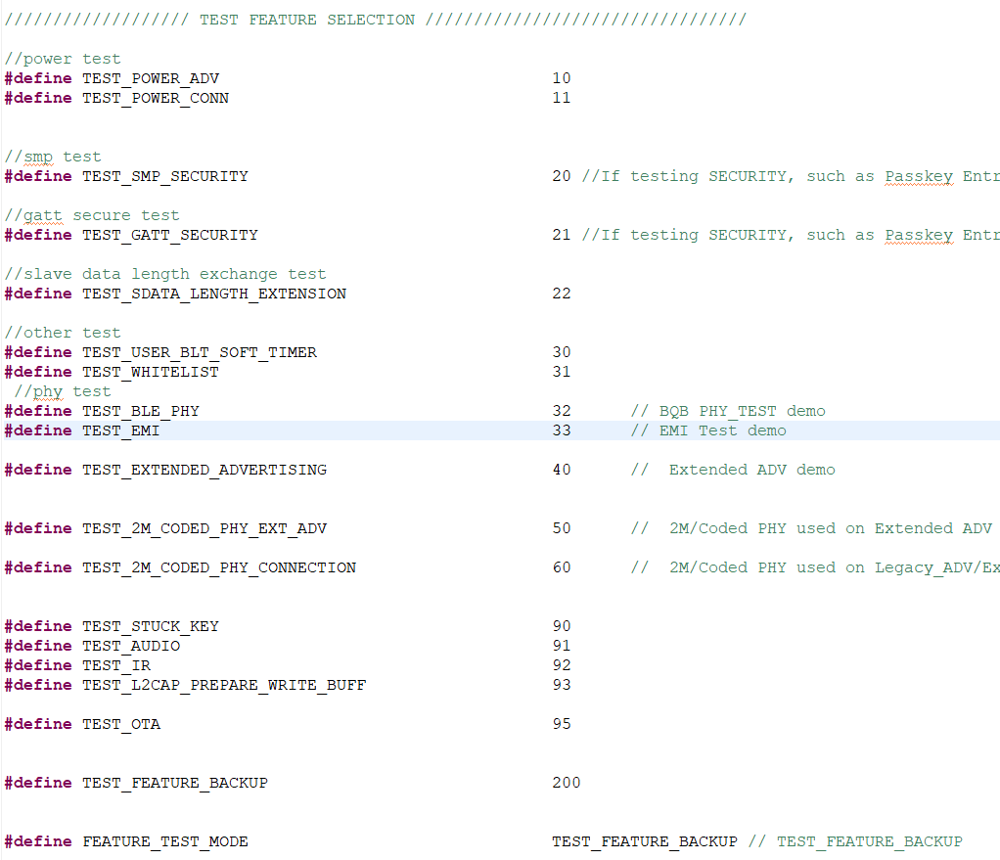

Test methods of each demo are described below.

## Broadcast Power Consumption Test

This item mainly tests the power consumption during broadcasting of different broadcasting parameters. Users can measure the power consumption with an external multimeter during the test. Need to modify FEATURE_TEST_MODE to TEST_POWER_ADV in app_config.h.

```C
#define FEATURE_TEST_MODE					TEST_POWER_ADV
```

Modify the broadcast type and broadcast parameters in feature_adv_power.c as required. There are two types of broadcasts provided in Demo: connectable broadcast and non-connectable broadcast.

### Connectable Broadcast Power Consumption Test

In the feature_adv_power.c function feature_adv_power_test_init_normal(), the default test non-connectable broadcast power consumption needs to be changed from #if 0 to #if 1, as shown in the following code.

```C
#if 1   //connectable undirected ADV
```

The default broadcast data length of Demo is 12 bytes, and users can modify it according to their needs.

```C
//ADV data length: 12 byte
u8 tbl_advData[12] = {0x08, 0x09, 't', 'e', 's', 't', 'a', 'd', 'v',0x02, 0x01, 0x05,};
```

The Demo provides 1s1channel, 1s3channel, 500ms3channel broadcast parameters, users can select the corresponding test items according to their needs.

### Un-connectable Broadcast Power Consumption Test

In feature_adv_power.c function feature_adv_power_test_init_normal(), the default test is non-connectable broadcast power consumption.

```C
#if 0   //un-connectable undirected ADV
```

Demo provides two broadcast data lengths of 16byte and 31byte, which users can choose according to their needs.

```C
#if 1    //ADV data length: 16 byte
	u8 tbl_advData[8] = {
			0x0C, 0x09, 't', 'e', 's', 't', 'a', 'd',
		};
#else  	//ADV data length: max 31 byte
	u8 tbl_advData[] = {
		 0x1E, 0x09, 't', 'e', 's', 't', 'a', 'd', 'v', '8', '9', 'A', 'B', 'C', 'D', 'E', 'F', '0', '1', '2', '3', '4', '5', '6', '7', '8', '9', 'A', 'B', 'C', 'D'
	};
#endif
```

The Demo provides 1s3channel, 1.5s3channel, and 2s3channel broadcast parameters. Users can select the corresponding test items according to their needs.

## Connection Power Consumption Test

This test  item is mainly to test the power consumption when connected with different connection parameters, the user can connect an external multimeter to measure the power consumption during the test. In feature_config.h, you need to modify FEATURE_TEST_MODE to TEST_POWER_CONN.

```C
#define FEATURE_TEST_MODE						TEST_POWER_CONN
```

Users can modify the connection parameters in the task_connect callback function in the feature_conn_power project directory according to their needs.

```C
void	task_connect (u8 e, u8 *p, int n)
{
	bls_l2cap_requestConnParamUpdate (8, 8, 99, 400);  // 1 S
}
```

The connection parameters are mainly modified by the bls_l2cap_requestConnParamUpdate function, which sets a 1s connection interval by default in the demo.

```C
void bls_l2cap_requestConnParamUpdate (u16 min_interval, u16 max_interval, u16 latency, u16 timeout)
```

For a detailed description of this function, users can refer to section 3.3.2.1 Updating Connection Parameters of the BLE module.

## SMP Test

SMP test mainly tests the process of pairing encryption, mainly divided into the following ways:

(1) LE_Security_Mode_1_Level_1, no authentication and no encryption.

(2) LE_Security_Mode_1_Level_2, unauthenticated paring with encryption.

(3) LE_Security_Mode_1_Level_3, authenticated paring with encryption-legacy.

(4) LE_Security_Mode_1_Level_4, authenticated paring with encryption-sc.

Users need to set FEATURE_TEST_MODE to TEST_SMP_SECURITY in app_config.h.

```C
#define FEATURE_TEST_MODE						TEST_SMP_SECURITY
```

Below is a brief introduction to each pairing mode.

### LE_Security_Mode_1_Level_1

LE_Security_Mode_1_Level_1 is the simplest pairing method, neither authentication nor encryption. The user changes the SMP_TEST_MODE of feature_security.c to SMP_TEST_NO_SECURITY.

```C
#define     SMP_TEST_MODE					SMP_TEST_NO_SECURITY
```

### LE_Security_Mode_1_Level_2

The LE_Security_Mode_1_Level_2 mode is just work, only encryption but not authentication. Just work is divided into legacy just work and sc just work. The user changes the SMP_TEST_MODE of feature_security.c to SMP_TEST_LEGACY_PARING_JUST_WORKS or SMP_TEST_SC_PARING_JUST_WORKS as required. Introduced separately below.

#### SMP_TEST_LEGACY_PARING_JUST_WORKS

The user makes the following modifications:

```C
#define     SMP_TEST_MODE			SMP_TEST_LEGACY_PARING_JUST_WORKS
```

The process is shown as following:

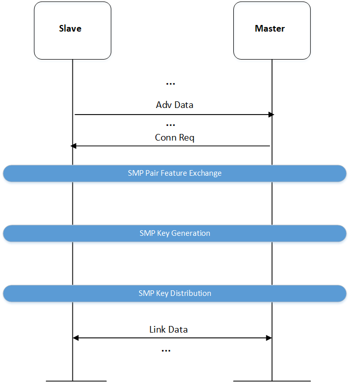

#### SMP_TEST_SC_PAIRING_JUST_WORKS

The user makes the following modifications:

```C
#define     SMP_TEST_MODE						SMP_TEST_SC_PAIRING_JUST_WORKS
```

The process is shown as following:

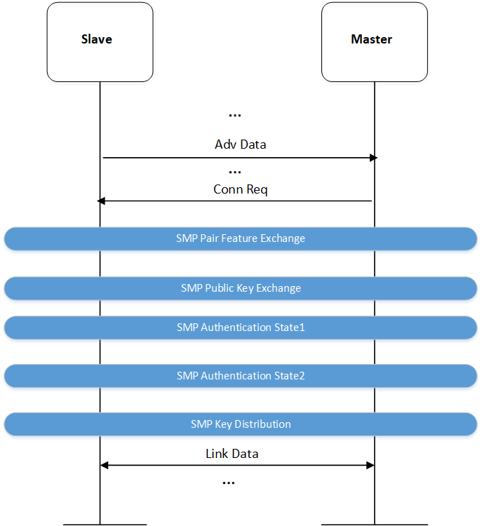

### LE_Security_Mode_1_Level_3

LE_Security_Mode_1_Level_3 is both the authentication and encryption Legacy pairing method. According to the pairing parameter settings, it is divided into OOB, PassKey Entry, and Numeric Comparison. Currently the demo provides two sample codes for PassKey Entry, namely SMP_TEST_LEGACY_PASSKEY_ENTRY_SDMI and SMP_TEST_LEGACY_PASSKEY_ENTRY_MDSI. Users can choose according to their needs. The two methods are briefly introduced below.

#### SMP_TEST_LEGACY_PASSKEY_ENTRY_SDMI

The user needs to modify as follows in feature_security.c:

```C
#define     SMP_TEST_MODE						SMP_TEST_LEGACY_PASSKEY_ENTRY_SDMI
```

During the pairing process, the slave side needs to display the key and the master side enters the key. During initialization, a gap event related to pairing is registered. The pairing information will be notified to the app layer.

```C
blc_gap_registerHostEventHandler( app_host_event_callback );
blc_gap_setEventMask( GAP_EVT_MASK_SMP_PARING_BEAGIN 			|  \
						  GAP_EVT_MASK_SMP_PARING_SUCCESS   		|  \
						  GAP_EVT_MASK_SMP_PARING_FAIL				|  \
						  GAP_EVT_MASK_SMP_TK_DISPALY				|  \
						  GAP_EVT_MASK_SMP_CONN_ENCRYPTION_DONE );
```

The user needs to print the current key information when receiving the GAP_EVT_MASK_SMP_TK_DISPLAY message.

```C
int app_host_event_callback (u32 h, u8 *para, int n)
{
	u8 event = h & 0xFF;
	switch(event)
	{
…
		case GAP_EVT_SMP_TK_DISPALY:
		{
			char pc[7];
			u32 pinCode = *(u32*)para;
		}
		break;
…
}
}
```

The process is shown as following:


#### SMP_TEST_LEGACY_PASSKEY_ENTRY_MDSI

The difference from the above is that the key is displayed on the master and the key is entered by the slave. The user needs to modify the code:

```C
#define     SMP_TEST_MODE						SMP_TEST_LEGACY_PASSKEY_ENTRY_MDSI
```

The process is shown as following:

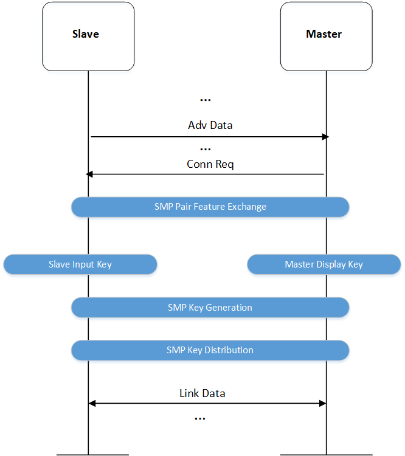

### LE_Security_Mode_1_Level_4

LE_Security_Mode_1_Level_4 is both an authentication and encryption SC pairing method. According to the pairing parameter settings, it is divided into OOB, PassKey Entry, and Numeric Comparison. Currently the demo provides three sample codes of SC PassKey Entry and SC Numeric Comparison, namely SMP_TEST_SC_PASSKEY_ENTRY_SDMI, SMP_TEST_SC_PASSKEY_ENTRY_MDSI and SMP_TEST_SC_NUMERIC_COMPARISON. Users can choose according to their needs. These methods are briefly introduced below.

#### SMP_TEST_SC_NUMERIC_COMPARISON

The user needs to modify as follows in feature_security.c:

```C
#define     SMP_TEST_MODE						SMP_TEST_SC_NUMERIC_COMPARISON
```

This pairing method is numeric comparison, that is, during the pairing process, both the master and slave will display a six-digit PIN code. If the user compares the numbers for the same, if they are the same, click to confirm and agree to the pairing. Demo is to send YES or NO in the form of a button. The sample code is as follows:

```C
if(consumer_key == MKEY_VOL_DN){
blc_smp_setNumericComparisonResult(1);// YES
/*confirmed YES*/
led_onoff(LED_ON_LEVAL);
}
else if(consumer_key == MKEY_VOL_UP){
blc_smp_setNumericComparisonResult(0);// NO
/*confirmed NO*/
led_onoff(LED_ON_LEVAL);
}
```

The process is shown as following:

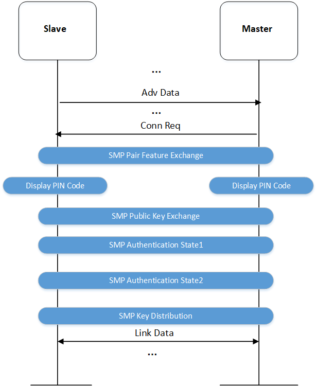

#### SMP_TEST_SC_PASSKEY_ENTRY_SDMI

The user needs to modify as follows in feature_security.c:

```C
#define     SMP_TEST_MODE						SMP_TEST_SC_PASSKEY_ENTRY_SDMI
```

During the pairing process, the slave side needs to display the key and the master side enters the key. During initialization, a gap event related to pairing is registered. The pairing information will be notified to the app layer.

```C
blc_gap_registerHostEventHandler( app_host_event_callback );
blc_gap_setEventMask(    GAP_EVT_MASK_SMP_PARING_BEAGIN 			|  \
						  GAP_EVT_MASK_SMP_PARING_SUCCESS   		|  \
						  GAP_EVT_MASK_SMP_PARING_FAIL				|  \
						  GAP_EVT_MASK_SMP_TK_DISPALY				|  \
						  GAP_EVT_MASK_SMP_CONN_ENCRYPTION_DONE );
```

The user needs to print the current key information when receiving the GAP_EVT_MASK_SMP_TK_DISPLAY message.

```C
int app_host_event_callback (u32 h, u8 *para, int n)
{
	u8 event = h & 0xFF;
	switch(event)
	{
…
		case GAP_EVT_SMP_TK_DISPLAY:
		{
			char pc[7];
			u32 pinCode = *(u32*)para;
		}
		break;
…
	}
}
```

The process is shown as following:

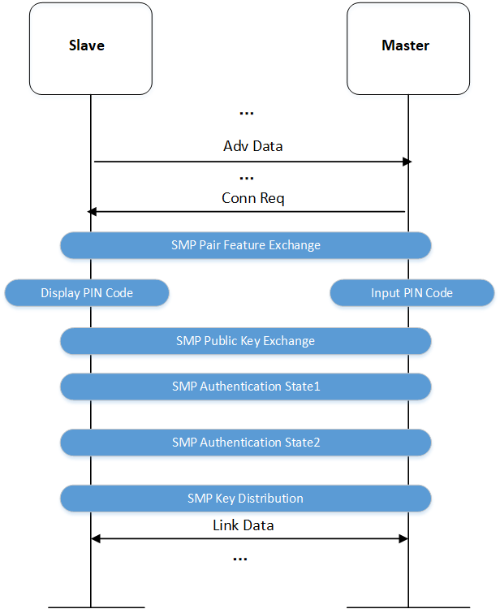

## GATT Security Test

As known from the BLE module 3.3.3 ATT&GATT chapter, each Attribute in the service list defines read and write permissions, that is, the pairing mode must reach the corresponding level to read or write. For example, in the SPP service of Demo:

```C
// client to server RX
{0,ATT_PERMISSIONS_READ,2,sizeof(TelinkSppDataClient2ServerCharVal),(u8*)(&my_characterUUID), 		(u8*)(TelinkSppDataClient2ServerCharVal), 0},		//prop
	{0,SPP_C2S_ATT_PERMISSIONS_RDWR,16,sizeof(SppDataClient2ServerData),(u8*)(&TelinkSppDataClient2ServerUUID), (u8*)(SppDataClient2ServerData), &module_onReceiveData},	//value
	{0,ATT_PERMISSIONS_READ,2,sizeof(TelinkSPPC2SDescriptor),(u8*)&userdesc_UUID,(u8*)(&TelinkSPPC2SDescriptor)},
```

The read and write permissions of the second Attribute are defined as: SPP_C2S_ATT_PERMISSIONS_RDWR.

This read and write permission is up to the user to choose, you can choose one of the following:

```C
#define     SPP_C2S_ATT_PERMISSIONS_RDWR        ATT_PERMISSIONS_RDWR
#define     SPP_C2S_ATT_PERMISSIONS_RDWR        ATT_PERMISSIONS_ENCRYPT_RDWR
#define     SPP_C2S_ATT_PERMISSIONS_RDWR        ATT_PERMISSIONS_AUTHEN_RDWR
#define     SPP_C2S_ATT_PERMISSIONS_RDWR        ATT_PERMISSIONS_SECURE_CONN_RDWR
```

No matter which one you choose, the current pairing mode must be higher than or equal to this level of read and write permissions to read and write services correctly.

The user needs to modify feature_config.h as follows:

```C
#define FEATURE_TEST_MODE								TEST_GATT_SECURITY
```

SMP test encryption levels are LE_SECURITY_MODE_1_LEVEL_1, LE_SECURITY_MODE_1_LEVEL_2, LE_SECURITY_MODE_1_LEVEL_3, LE_SECURITY_MODE_1_LEVEL_4. The user needs to select app_config.h according to the needs of the corresponding pairing mode.

```C
#define     SMP_TEST_MODE						LE_SECURITY_MODE_1_LEVEL_3
```

For example, the current pairing mode is LE_SECURITY_MODE_1_LEVEL_3, that is, there are both authentication and encryption Legacy pairing modes. So the current read and write permissions can be selected as follows.

```C
#define     SPP_C2S_ATT_PERMISSIONS_RDWR        ATT_PERMISSIONS_AUTHEN_RDWR
```

The process is shown as following:

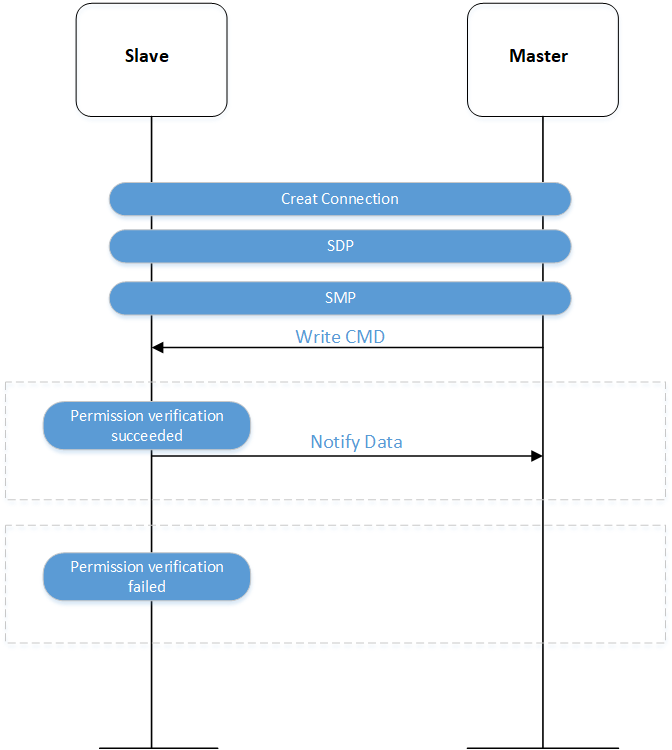

## DLE Test

The DLE test mainly tests the long package. Demo is divided into master and slave. Users need to compile and burn to two EVB boards respectively. For the code at master end, users can refer to B91 Multi-Connection SDK handbook. For the corresponding feature_config.h selection at slave end, the code is as follows:

```C
#define FEATURE_TEST_MODE			TEST_SDATA_LENGTH_EXTENSION
```

After programming, they are reset respectively, and the master's GPIO_PC6 is triggered to establish a connection at a low level. After the connection is successful, the MTU and DataLength are exchanged respectively.

```C
blc_att_requestMtuSizeExchange(BLS_CONN_HANDLE, MTU_SIZE_SETTING);
blc_ll_exchangeDataLength(LL_LENGTH_REQ , DLE_TX_SUPPORTED_DATA_LEN);
```

After the exchange is successful, the slave will send a long packet of data to the master every 3.3s, or the master will trigger the pairing key GPIO_PC6 every time at a low level, the mater will write a long packet of data to the slave, and the slave will send the same data to the master after receiving it.

The test process is as follows:

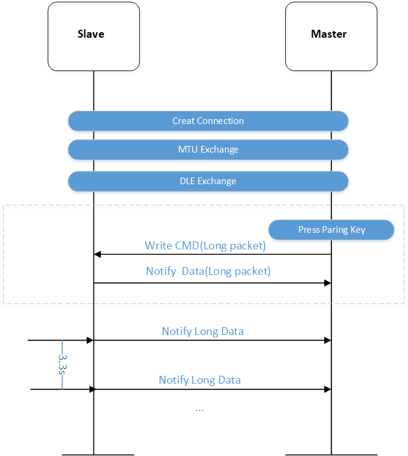

## Soft Timer Test

Please refer to the chapter of Software Timer.

## WhiteList Test

If the whitelist is set, only the devices in the whitelist are allowed to establish connections. The user needs to modify app_config.h as follows:

```C
#define FEATURE_TEST_MODE								TEST_WHITELIST
```

When the slave has no binding information, any other device is allowed to connect. After the connection is successful, the slave will add the current master's information to the whitelist, and then only the current device can connect with the slave.

The test process is as follows:


## 1M Extended Advertising Test

The 1M Extended advertising demo is mainly to test the extended broadcasting of 1M PHY. You need to modify FEATURE_TEST_MODE to TEST_EXTENDED_ADVERTISING in app_config.h.

```C
#define FEATURE_TEST_MODE								TEST_EXTENDED_ADVERTISING
```

The relevant codes are in vendor/feature_extend_adv, and the slave demo is provided.

Set the maximum length of broadcast data as follows:

```C
#define	APP_ADV_SETS_NUMBER			1		// Number of Supported Advertising Sets
#define APP_MAX_LENGTH_ADV_DATA			1024	// Maximum Advertising Data Length
#define APP_MAX_LENGTH_SCAN_RESPONSE_DATA	31	// Maximum Scan Response Data Length
```

In feature_ext_adv_init_normal, different types of extended broadcast packets based on 1M PHY configuration have been reserved.

```C
#if 1  //Legacy, non_connectable_non_scannable
……
#elif 0 //Legacy, connectable_scannable
……
#elif 0 // Extended, None_Connectable_None_Scannable undirected, without auxiliary packet
……
#elif 0 // Extended, None_Connectable_None_Scannable directed, without auxiliary packet
……
#elif 0 // Extended, None_Connectable_None_Scannable undirected, with auxiliary packet
……
#elif 0 // Extended, None_Connectable_None_Scannable Directed, with auxiliary packet
……
#elif 0 // Extended, Scannable, Undirected
……
#elif 0 // Extended, Connectable, Undirected
……
#endif
```

Users need to use a mobile phone or protocol analysis device that supports the Bluetooth 5 Low Energy Advertising Extension function to see the extended broadcast data.

## 2M/Coded PHY Used on Extended Advertising Test

The 2M/Coded PHY used on Extended advertising demo is mainly to test the extended broadcasting of various combinations of 1M/2M/Coded PHY. You need to modify FEATURE_TEST_MODE to TEST_2M_CODED_PHY_EXT_ADV in app_config.h.

```C
#define FEATURE_TEST_MODE						TEST_2M_CODED_PHY_EXT_ADV
```

The relevant codes are in vendor/feature_phy_extend_adv, and the slave demo is provided.

Set the maximum length of broadcast data as follows:

```C
#define	APP_ADV_SETS_NUMBER			1	// Number of Supported Advertising Sets
#define APP_MAX_LENGTH_ADV_DATA			1024	// Maximum Advertising Data Length
#define APP_MAX_LENGTH_SCAN_RESPONSE_DATA	31	// Maximum Scan Response Data Length
```

Feature_ext_adv_init_normal has reserved different types of extended broadcast packets based on various combinations of 1M PHY / Coded PHY(S2) / Coded PHY(S8).

```C
#if 0 // Extended, None_Connectable_None_Scannable undirected, without auxiliary packet
	#if 0     // ADV_EXT_IND: 1M PHY
	#elif 1    // ADV_EXT_IND: Coded PHY(S2)
	#elif 0		// ADV_EXT_IND: Coded PHY(S8)
	#endif#
#elif 0 // Extended, None_Connectable_None_Scannable undirected, with auxiliary packet
	#if 1       // ADV_EXT_IND: 1M PHY;  		 AUX_ADV_IND/AUX_CHAIN_IND: 1M PHY
	#elif 0      // ADV_EXT_IND: 1M PHY;  		 AUX_ADV_IND/AUX_CHAIN_IND: 2M PHY
	#elif 0      // ADV_EXT_IND: 1M PHY;  		 AUX_ADV_IND/AUX_CHAIN_IND: Coded PHY(S2)
	#elif 0      // ADV_EXT_IND: 1M PHY;  		 AUX_ADV_IND/AUX_CHAIN_IND: Coded PHY(S8)
	#elif 0      // ADV_EXT_IND: Coded PHY(S2);  AUX_ADV_IND/AUX_CHAIN_IND: 1M PHY
	#elif 0      // ADV_EXT_IND: Coded PHY(S8);  AUX_ADV_IND/AUX_CHAIN_IND: 1M PHY
	#elif 0      // ADV_EXT_IND: Coded PHY(S2);  AUX_ADV_IND/AUX_CHAIN_IND: 2M PHY
	#elif 0      // ADV_EXT_IND: Coded PHY(S8);  AUX_ADV_IND/AUX_CHAIN_IND: 2M PHY
	#elif 0      // ADV_EXT_IND: Coded PHY(S2);  AUX_ADV_IND/AUX_CHAIN_IND: Coded PHY(S2)
	#elif 0      // ADV_EXT_IND: Coded PHY(S8);  AUX_ADV_IND/AUX_CHAIN_IND: Coded PHY(S8)
	#endif
#elif 1 // Extended, Scannable, Undirected
	#if 1       // ADV_EXT_IND: 1M PHY;  		 AUX_ADV_IND/AUX_CHAIN_IND: 1M PHY
	#elif 0      // ADV_EXT_IND: 1M PHY;  		 AUX_ADV_IND/AUX_CHAIN_IND: 2M PHY
	#elif 0      // ADV_EXT_IND: 1M PHY;  		 AUX_ADV_IND/AUX_CHAIN_IND: Coded PHY(S8)
	#elif 0      // ADV_EXT_IND: Coded PHY(S8);  AUX_ADV_IND/AUX_CHAIN_IND: 1M PHY
	#elif 0      // ADV_EXT_IND: Coded PHY(S8);  AUX_ADV_IND/AUX_CHAIN_IND: 2M PHY
	#elif 0      // ADV_EXT_IND: Coded PHY(S8);  AUX_ADV_IND/AUX_CHAIN_IND: Coded PHY(S8)
	#endif
#endif
```

Users can refer to the demo to combine the types of extended broadcast packages they need.

Users need to use mobile phones or protocol analysis devices that support Bluetooth 5 Low Energy Advertising Extension, Bluetooth 5 Low Energy 2Mbps and Bluetooth 5 Low Energy Coded (Long Range) functions to see the data broadcast by the above various types of extensions.

**Note:**

> API blc_ll_init2MPhyCodedPhy_feature() is used to enable 2M PHY/Coded PHY.

## 2M/Coded PHY used on Legacy advertising and Connection Test

2M/Coded PHY used on Legacy advertising and Connection demo is mainly to test that after establishing a connection based on Legacy advertising, switch to 1M/2M/Coded PHY in the connected state, and change FEATURE_TEST_MODE to TEST_2M_CODED_PHY_CONNECTION in app_config.h.

```C
#define FEATURE_TEST_MODE			TEST_2M_CODED_PHY_CONNECTION
```

The relevant codes are in vendor/feature_phy_conn, and the slave demo is provided.
Initially open 2M Phy and Coded Phy:

```C
blc_ll_init2MPhyCodedPhy_feature();		// mandatory for 2M/Coded PHY
```

After the connection is successful, the mainloop will use the API blc_ll_setPhy() to initiate a PHY change request in a 2-second cycle, 1M –> Coded PHY(S2) –> 2M –> Coded PHY(S8) –> 1M.

```C
if(phy_update_test_tick && clock_time_exceed(phy_update_test_tick, 2000000)){
		phy_update_test_tick = clock_time() | 1;
		int AAA = phy_update_test_seq%4;
		if(AAA == 0){
			blc_ll_setPhy(BLS_CONN_HANDLE, PHY_TRX_PREFER, PHY_PREFER_CODED, PHY_PREFER_CODED, CODED_PHY_PREFER_S2);
		}
		else if(AAA == 1){
			blc_ll_setPhy(BLS_CONN_HANDLE, PHY_TRX_PREFER, PHY_PREFER_2M, 	 PHY_PREFER_2M,    CODED_PHY_PREFER_NONE);
		}
		else if(AAA == 2){
			blc_ll_setPhy(BLS_CONN_HANDLE, PHY_TRX_PREFER, PHY_PREFER_CODED, PHY_PREFER_CODED, CODED_PHY_PREFER_S8);
		}
		else{
			blc_ll_setPhy(BLS_CONN_HANDLE, PHY_TRX_PREFER, PHY_PREFER_1M, 	 PHY_PREFER_1M,    CODED_PHY_PREFER_NONE);
		}
		phy_update_test_seq ++;
	} 
```

Peer Master Device can use B91 Multi-Connection SDK Demo "B91 master kma dongle", but also need to use API blc_ll_init2MPhyCodedPhy_feature() to open 2M Phy and Coded Phy.

Users can also choose to use other manufacturers' Master devices or mobile phones that support Bluetooth 5 Low Energy 2Mbps and Bluetooth 5 Low Energy Coded (Long Range) functions.

## CSA #2 Test

CSA #2 demo mainly uses Channel Selection Algorithm #2 (Channel Selection Algorithm #2) for frequency hopping when testing the connection state. You need to modify FEATURE_TEST_MODE to TEST_CSA2 in app_config.h.

```C
#define FEATURE_TEST_MODE						TEST_CSA2
```

The relevant codes are all in vendor/feature_csa2, and the slave demo is provided.

Initial CSA #2:

```C
blc_ll_initChannelSelectionAlgorithm_2_feature()
```

After enabling CSA #2, the ChSel field in the broadcast packet of Slave has been set to 1. If the CONNECT_IND PDU of the Peer Master Device has also set the ChSel field to 1, the channel selection algorithm #2 is used after the connection is successful. Otherwise, channel selection algorithm #1 should be used.

Peer Master Device can use B91 Multi-Connection SDK Demo "B91 master kma dongle", but also need to use API blc_ll_initChannelSelectionAlgorithm_2_feature() to open CSA #2.

Users can also choose to use Master devices or mobile phones from other manufacturers that support Bluetooth 5 Low Energy CSA #2.

\newpage
# Other Modules

## 24MHz Crystal External Capacitor

Refer to the position C1/C4 of the 24MHz crystal matching capacitor in the figure below.

The SDK defaults to use B91 internal capacitance (that is, the cap corresponding to ana_8a\<5:0>) as the matching capacitance of the 24MHz crystal oscillator. At this time, C1/C4 does not need to be soldered. The advantage of using this solution is that the capacitance can be measured and adjusted on the Telink fixture to make the frequency value of the final application product reach the best.

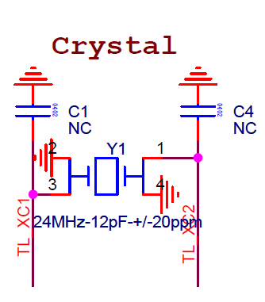

If you need to use an external welding capacitor as the matching capacitor (C1/C4 welding capacitor) of the 24MHz crystal oscillator, just call the following API at the beginning of the main function (must be before the cpu_wakeup_init function):

```C
static inline void blc_app_setExternalCrystalCapEnable(u8  en)
{
	blt_miscParam.ext_cap_en = en;
	analog_write_reg8(0x8a,analog_read_reg8(0x8a)|0x80);//close internal cap
}
```

As long as the API is called before cpu_wakeup_init, the SDK will automatically handle all the settings, including disabling the internal matching capacitor, no longer reading the frequency bias correction value, etc.

## 32KHz Clock Source Selection

At present, the SDK uses the 32KHz RC oscillator circuit inside the MCU by default, referred to as 32k RC. The error of 32k RC is relatively large, so for applications with long suspend or deep retention time, the time accuracy will be worse. At present, the maximum long connection supported by 32k RC by default cannot exceed 3s (the current SDK has the same limitation for external 32KHz crystals). Once exceeding this time, ble_timing will have errors, resulting in inaccurate packet receiving time points, prone to receiving and sending packets retry, increased power consumption, and even disconnection.

If users need to achieve lower connection power consumption, including more accurate clock timing in low-power sleep situations, they can choose to use an external 32KHz crystal, referred to as 32k Pad, which is currently supported by the SDK.

The user only needs to call one of the following API at the beginning of the main function (must be before the cpu_wakeup_init function):

```C
void blc_pm_select_internal_32k_crystal(void);
void blc_pm_select_external_32k_crystal(void);
```

They are the APIs for selecting 32k RC and 32k Pad respectively. The SDK calls blc_pm_select_internal_32k_crystal selected 32k RC by default, if you need to use 32k Pad, just replace it with blc_pm_select_external_32k_crystal.

## Software PA

If you need to use RF PA, please refer to drivers/B91/ext_driver/software_pa.c and software_pa.h.

First enable the following macro, which is disabled by default.

```C
#ifndef PA_ENABLE
#define PA_ENABLE                           0
#endif
```

During system initialization, call PA initialization.

```C
void rf_pa_init(void);
```

Referring to the code implementation, inside this initialization, PA_TXEN_PIN and PA_RXEN_PIN are set to GPIO output mode and the initial state is output 0. The GPIOs corresponding to the TX and RX PAs need to be defined by the user.

```C
#ifndef PA_TXEN_PIN
#define PA_TXEN_PIN                         GPIO_PB2
#endif

#ifndef PA_RXEN_PIN
#define PA_RXEN_PIN                         GPIO_PB3
#endif
```

In addition, register void app_rf_pa_handler(int type) as a callback handling function for PA. Referring to the implementation of this function, it actually handles the following 3 PA states: PA off, TX PA on, and RX PA on.

```C
#define PA_TYPE_OFF							0
#define PA_TYPE_TX_ON						1
#define PA_TYPE_RX_ON						2
```

User only needs to call rf_pa_init above, app_rf_pa_handler is registered to the underlying callback, and BLE will automatically call app_rf_pa_handler's processing when it is in various states.

## PhyTest

PhyTest, the PHY test, refers to the test of the BLE controller RF performance.

Please refer to "Core_v5.0" (Vol 2/Part E/7.8.28~7.8.30) and "Core_v5.0" (Vol 6/Part F "Direct Test Mode") for more details.

### PhyTest API

The source code of PhyTest is packed in the library file, providing the relevant API for users to use, please refer to the stack/ble/controller/phy/phy_test.h file.

```c
void 	  blc_phy_initPhyTest_module(void);

ble_sts_t   blc_phy_setPhyTestEnable (u8 en);
bool       blc_phy_isPhyTestEnable(void);

//user for PhyTest 2 wire uart mode
int 	 blc_phyTest_2wire_rxUartCb (void);
int 	 blc_phyTest_2wire_txUartCb (void);
// user for PhyTest 2 wire hci mode
int blc_phyTest_hci_rxUartCb (void);
```

When initializing, call blc_phy_initPhyTest_module to set up the PhyTest module.

After the application layer triggers PhyTest, blc_phy_setPhyTestEnable(1) is called to enable PhyTest mode.

The initialization in the SDK demo "B91_feature_test" triggers phytest directly to start.

PhyTest is a special mode, and it  is mutually exclusive with the normal BLE function. Once entering PhyTest mode, broadcast and connection are not available. Therefore, PhyTest cannot be triggered when running normal BLE functions.

After PhyTest ends, either reboot directly or call blc_phy_setPhyTestEnable (0), at which point the MCU will automatically reboot.

Use blc_phy_isPhyTestEnable to determine whether the current PhyTest is triggered, you can see that the code uses this API to achieve low-power management and PhyTest mode can not enter low-power.

When PhyTest uses uart two-wire mode (PHYTEST_MODE_THROUGH_2_WIRE_UART), the initialization is set as follows.

```C
blc_register_hci_handler (blc_phyTest_2wire_rxUartCb, blc_phyTest_2wire_txUartCb);
```

The blc_phyTest_2wire_rxUartCb implements the parsing and execution of the cmd sent by the master computer, and blc_phyTest_2wire_txUartCb implements the feedback of the corresponding results and data to the master computer.

When PhyTest uses uart two-wire mode (PHYTEST_MODE_OVER_HCI_WITH_UART), the initialization is set as follows.

```C
blc_register_hci_handler (blc_phyTest_hci_rxUartCb, blc_phyTest_2wire_txUartCb); 
```

The blc_phyTest_hci_rxUartCb implements the parsing and execution of the cmd sent from the master computer, blc_ phyTest_2wire_txUartCb implements the feedback of the corresponding results and data to the master computer.

### PhyTest demo

#### Demo: B91_feature_test

In app_config.h of the SDK demo "B91_feature_test", change the test mode to "TEST_BLE_PHY", as follows.

```C
#define FEATURE_TEST_MODE				TEST_BLE_PHY
```

According to the physical interface and test command format, PhyTest can be divided into three test modes, as shown below, "PHYTEST_MODE_DISABLE" means PhyTest is disabled.

```C
#ifndef		PHYTEST_MODE_DISABLE
#define		PHYTEST_MODE_DISABLE						0
#endif

#ifndef		PHYTEST_MODE_THROUGH_2_WIRE_UART
#define 		PHYTEST_MODE_THROUGH_2_WIRE_UART		1
#endif

#ifndef		PHYTEST_MODE_OVER_HCI_WITH_USB
#define 		PHYTEST_MODE_OVER_HCI_WITH_USB			2 
#endif

#ifndef		PHYTEST_MODE_OVER_HCI_WITH_UART
#define 		PHYTEST_MODE_OVER_HCI_WITH_UART			3 
#endif
```

Select test mode of PhyTest:

```C
#if (FEATURE_TEST_MODE == TEST_BLE_PHY)
		#define BLE_PHYTEST_MODE		PHYTEST_MODE_THROUGH_2_WIRE_UART
#endif
```

The following is defined as the uart two-line model.

```C
#define BLE_PHYTEST_MODE		PHYTEST_MODE_THROUGH_2_WIRE_UART
```

The following is defined as HCI mode UART interface (hardware interface is uart) phytest.

```C
#define BLE_PHYTEST_MODE		PHYTEST_MODE_OVER_HCI_WITH_UART
```

HCI mode USB interface, temporarily not supported.

According to the above definition, the bin file generated by compiling B91_feature_test can pass the test directly. User can study the implementation of the code and master the use of the relevant interface.

#### PhyTest parameter adjustment

If the PhyTest fails, the parameters available for adjustment are the length of rf packet preamble, etc.

The adjustment of rf packet preamble can be done by writing the core_402 register. The B91_feature_test demo shows the adjustment of rf packet preamble directly during initialization.

```C
	blc_phy_initPhyTest_module();
	blc_phy_setPhyTestEnable( BLC_PHYTEST_ENABLE );
	blc_phy_preamble_length_set(11);
```

## EMI

### EMI Test

EMI Test needs to call rf related interfaces when testing, such as rf_set_power_level (), these operation interfaces are packed into the library, you can see the API declaration in rf.h.

EMI Test has four test modes: carrier only mode (single carrier mode), continue mode (transmit mode with data on the carrier, continuous transmission), RX mode, three TX burst mode (different types of packet payload sent). The following definitions are shown.

```C
test_list_t  ate_list[] = {
		{0x01,emicarrieronly},
		{0x02,emi_con_prbs9},
		{0x03,emirx},
		{0x04,emitxprbs9},
		{0x05,emitx55},
		{0x06,emitx0f},
		{0x07,emi_con_tx55},
		{0x08,emi_con_tx0f}
};
```

#### EMI initialization setting

(1) Before conducting EMI tests, you first need to call the rf_drv_ble_init() function to complete the rf initialization.

```C
void rf_drv_ble_init(void);
```

(2) After setting up the rf initialization, you need to call the emi_init() function, which will initialize the master computer  interface commands.

```C
	rf_access_code_comm(EMI_ACCESS_CODE);             // access code

    write_sram8(TX_PACKET_MODE_ADDR,g_tx_cnt);        // tx_cnt
    write_sram8(RUN_STATUE_ADDR,g_run);               // run
    write_sram8(TEST_COMMAND_ADDR,g_cmd_now);         // cmd
    write_sram8(POWER_ADDR,g_power_level);            // power
    write_sram8(CHANNEL_ADDR,g_chn);                  // chn
    write_sram8(RF_MODE_ADDR,g_mode);                 // mode
    write_sram8(CD_MODE_HOPPING_CHN,g_hop);           // hop
    write_sram8(RSSI_ADDR,0);                         // rssi
    write_sram32(RX_PACKET_NUM_ADDR,0);               // rx_packet_num
```

(3) Call emi_serviceloop () in the main_loop to poll the test items.

#### Power level and Channel

During the test, you can set the power of the sending packet and the channel of the sending packet by configuring rf power level and rf channel.

- RF Power: you can set different power values according to rf_power_level_e rf_power_Level_list[30].

- RF Channel: set the frequency value equal to (2400+chn) MHz.

When setting the power level, it should be noted that the transmit power is based on the actual value, because the output power will be slightly different for different boards or different antenna matching values. The user can set the power level by calling the following 2 functions.

```C
void rf_emi_tx_single_tone(rf_power_level_e power_level,signed char rf_chn); //adjust the power level and channel under single carrier and continuous packet sending mode
void rf_emi_tx_burst_setup(rf_mode_e rf_mode,rf_power_level_e power_level,signed char rf_chn,unsigned char pkt_type);//tx burst mode to adjust the power level and channel settings
```

where the parameter power_level can be set according to the enumeration type rf_power_level_e. Among them, the parameter rf_chn can be set referring to RF_channel, parameter pkt_type 0 for the sending packet payload for PRBS9, 1 for 00001111b, 2 for 10101010b.

#### EMI Carrier Only

Carrier mode is EMI Test single carrier transmit mode, the user can directly call emicarrieronly () function, no need of other settings.

```C
void emicarrieronly(rf_mode_e rf_mode,unsigned char pwr,signed char rf_chn)
```

where the parameter rf_mode_e is defined as an enumeration in rf.h. The parameter pwr and the parameter rf_chn can be set according to the setting method described earlier.

#### emi_con_prbs9

The continue mode is a mode of transmitting data with continuous modulation on the EMI Test carrier, where the data on the carrier is updated by the rf_continue_mode_run () function to ensure that the data on the carrier is a series of random numbers.

The user can enter continue mode by calling the emi_con_prbs9 () function directly, no other settings are needed.

When setting the continue mode, the emi_con_prbs9 () function calls the rf_emi_tx_continue_setup () function to complete the continue mode settings such as rf_mode, power level, chn, etc. The rf_continue_mode_run() function will also be called to update the data on the carrier.

```C
void emi_con_prbs9(rf_mode_e rf_mode,unsigned char pwr,signed char rf_chn)
```

The parameters rf_mode, pwr, or power level, and rf_chn can be set by referring to the previous introduction.

#### EMI TX Burst

Tx Burst mode is able to send three types of packets: PRBS9 packet payload, 00001111b packet payload, 10101010b packet payload. User can select different tx modes by cmd.

The user can directly call one of the functions emitxprbs9(), emitx55(), emitx0f() to enter TX Burst mode without any other settings.

```C
void emitxprbs9(rf_mode_e rf_mode,unsigned char pwr,signed char rf_chn);
void emitx55(rf_mode_e rf_mode,unsigned char pwr,signed char rf_chn);
void emitx0f(rf_mode_e rf_mode,unsigned char pwr,signed char rf_chn);
```

where parameters rf_mode, pwr and parameter rf_chn can be set by referring to the previous introduction.

The emitxprbs9(), emitx55(), and emitx0f() functions all call the rf_emi_tx_brust_setup function to complete the tx burst initialization settings, and after doing the TX initialization, combine it with the rf_emi_tx_brust_loop() function to trigger the packet sending, as well as update the payload content.

```C
void rf_emi_tx_burst_setup(rf_mode_e rf_mode,rf_power_level_e power_level,signed char rf_chn,unsigned char pkt_type)
```

where parameters rf_mode, power level and parameter rf_chn can be set by referring to the previous introduction. The parameter pkt_type 0 is the sending packet payload for PRBS9, 1 is 00001111b, and 2 is 10101010b.

#### EMI RX

Enter rx mode by calling emirx(), call rf_emi_rx_loop() in main_loop() to poll the RX for received data, and perform quantity and RSSI statistics on the received RX data.

```C
void emirx(rf_mode_e rf_mode,unsigned char pwr,signed char rf_chn);
void rf_emi_rx_loop(void);
```

where parameters rf_mode, pwr and parameter rf_chn can be set by referring to the previous introduction.

**Note:**

> For the introduction of each mode and function, users can also refer to the emi chapter in the Telink Driver SDK Developer Handbook, available from the telink website or by contacting telink technical support.

#### Master computer configuration parameter settings

Run:

------------------------
No.    Description
------ -----------------
0      Default

1      Start test

------------------------

Cmd:

------------------------------
No.    Description
------ -----------------------
1      CarrierOnly

2      ContinuePRBS9

3      RX

4      TXBurst(PRBS9)

5      TXBurst(0x55)

6      TXBurst(0x0f)

-----------------------------

Power and channel are introduced in previous sections.

Mode:

--------------------------
No.    Description
------ -------------------
0      Ble_2M

1      Ble_1M

2      zigbee250k

3      ble125K

4      ble500K

5      reserved

--------------------------

The default power-up state for these parameters is (mode=1; power=0; channel=2; cmd=1), that is, transmitting a single carrier at 9.11dbm transmit power in ble_1M mode, 2402MHz.

**Note:**

> For parameter configuration related users can also refer to the document "Telink SoC EMI Test User Guide", which can be obtained from the Telink website or by contacting telink technical support.

### EMI Test Tool

Feature_emi in BLE SDK is used to generate the required EMI test signals, this sample should be used with "EMI_Tool" and "Non_Signaling_Test_Tool". For tools and usage, users can get them from Telink's website or by contacting telink technical support.

## JTAG Usage

In order to be able to use the JTAG module, it is necessary to ensure that the following conditions are met before use:

- The four GPIOs of JTAG need to be set to enable mode.
- If the chip is in low power mode, the chip must exit the low power mode before using JTAG.
- If the JTAG mode cannot be used normally because there are programs in the FLASH, you need to use the Telink BDT tool to erase the FLASH before use.


### Diagnostic Report

(1) Select "Diagnostic report" in Target Manager.

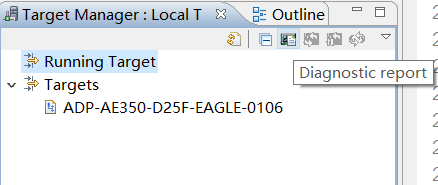

(2) Select "V5 core", do not check "SDP (2wires)", our JTAG does not support 2-wire mode temporarily, input 0 for "Address".

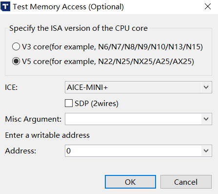

(3) Click "OK", a Diagnostic report will be generated.

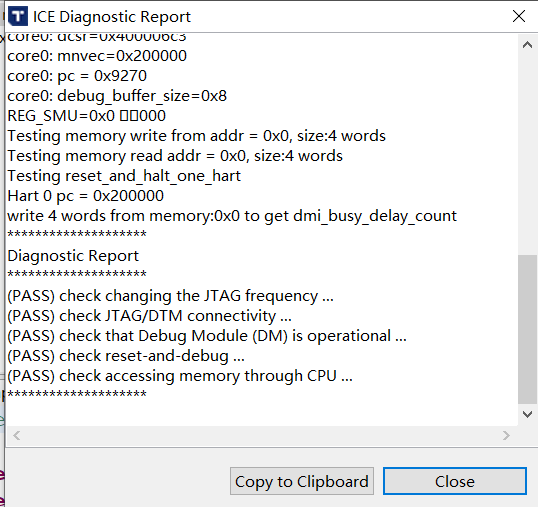

### Target Configuration

(1) Right click on the project folder and select "Target Configuration".

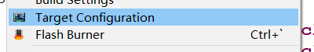

(2) Make sure "SDP (2wires)" is not checked.

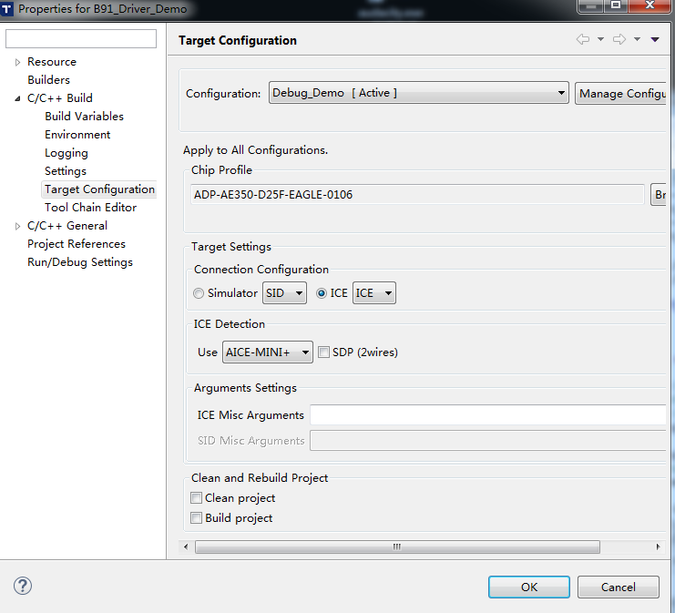

### Flash Programming

Right click on the project folder and select "Flash Burner".


(1) Select "SPI_burn.exe" in the IDE installation directory.

(2) Select the bin file to download.

(3) Check "Target management".

(4) Do not check "Target Burn".

(5) Check "Verification", if you need to erase FLASH before burning, you can check "erase all".

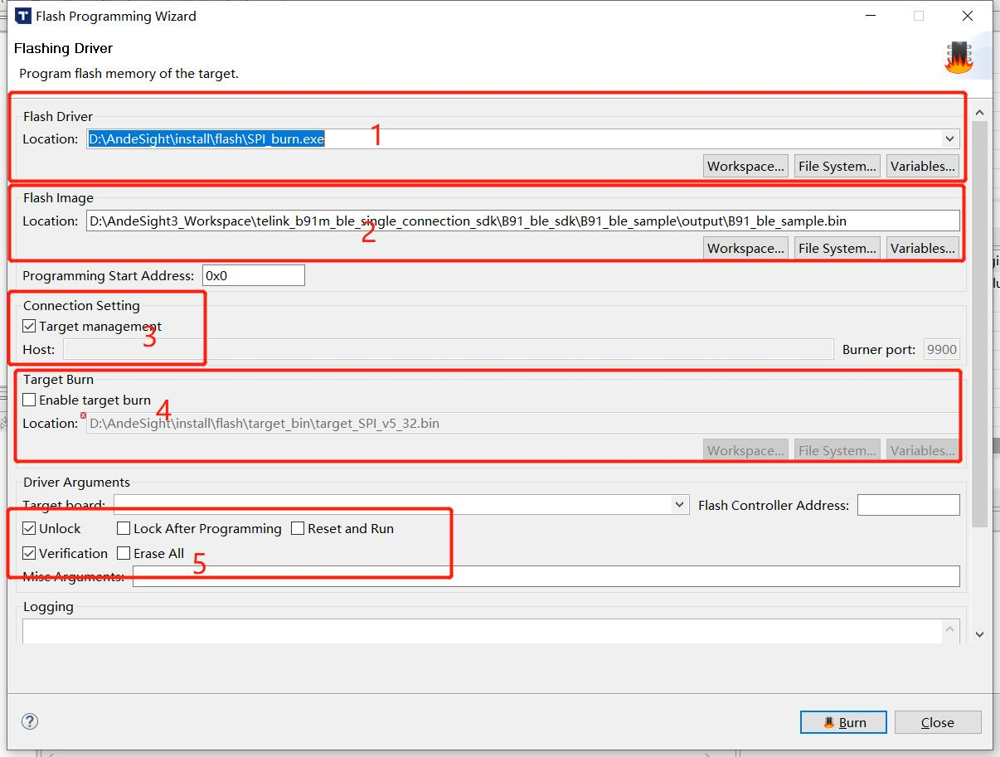

(6) Click "Burn" to download the bin file, if "Verify sucess" appears, it means the burning is successful.

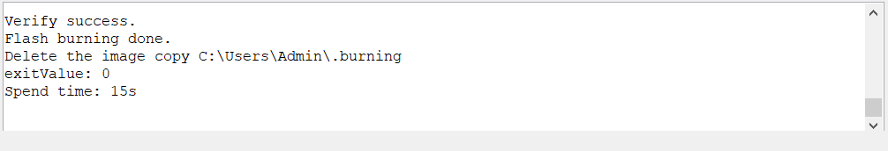

### Application Debug

(1) Right click on the project folder and select "Debug As -> Debug Configurations".

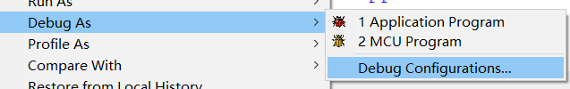

(2) Right click "MCU Program", select "new", and create a Debug Configuration.

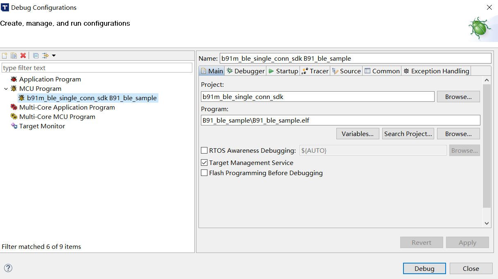

(3) Check "Reset and Hold" in Startup, then click "Apply" and "Debug".

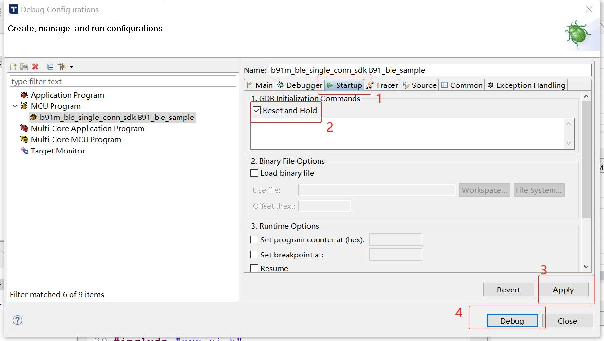

(4) After clicking "Apply", the IDE will automatically call up the debug view, and you can see "Variables", "Expressions" and other content in the toolbar.

"Variables": Lists stack area related variable information, highlighting changes to variable values ​​when the program stops abruptly.

"Expressions": Global variables are listed, changed parts are highlighted in yellow.

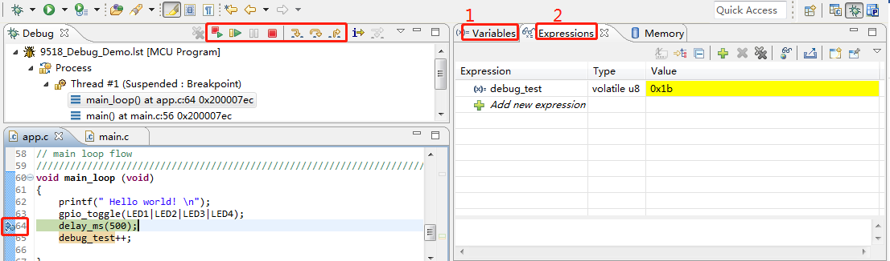

## Version Function

Users can obtain the current SDK version information through the following functions:

```C
unsigned char blc_get_sdk_version(unsigned char *pbuf,unsigned char number);
```

The parameter "pbuf" is a pointer to the location where the version information is stored, and the parameter "number" is the length of the version information, which should be between 5 and 16, and currently only 5 bytes are used to represent the version information. The return value of the function is 0 for success and 1 for failure. For example, if the data obtained after calling the blc_get_sdk_version function is {3,4,0,0,1}, it means that the current SDK version is 3.4.0.0 patch 1.

\newpage
# GPIO Simulate UART_TX Printing Method

In order to facilitate the user to print information during debugging, B91 supports gpio simulated printing printf(const char \*fmt, ...), array_printf(unsigned char*data, unsigned int len), the relevant information needs to be defined in app_config.h as follows:

```C
#ifndef UART_PRINT_DEBUG_ENABLE
#define UART_PRINT_DEBUG_ENABLE  			1
#endif
//////////////////////////// PRINT DEBUG INFO ///////////////////////////////////
#if (UART_PRINT_DEBUG_ENABLE)
	#define PRINT_BAUD_RATE             				115200
	#define DEBUG_INFO_TX_PIN           				GPIO_PA0
	#define PULL_WAKEUP_SRC_PA0         				PM_PIN_PULLUP_10K
	#define PA0_OUTPUT_ENABLE         					1
	#define PA0_DATA_OUT                                1 //must
#endif
```

The default baud rate here is 115200, TX_PIN is GPIO_PA0, and users can change the baud rate and TX_PIN according to their actual needs.

If the user wants to use a higher baud rate (greater than 115200, the highest support 1M), you need to increase cclk, at least change it to 24MHz and above, change cclk in app_config.h:

```C
/////////////////// Clock  /////////////////////////////////
/**
 *  @brief  MCU system clock
 */
#define CLOCK_SYS_CLOCK_HZ  	24000000
```

\newpage
# Appendix

## crc16 Algorithm

```C
unsigned short crc16 (unsigned char *pD, int len)
{
static unsigned short poly[2]={0, 0xa001};
unsigned short crc = 0xffff;
unsigned char ds;
int i,j;

for(j=len; j>0; j--)
    {
unsigned char ds = *pD++;
for(i=0; i<8; i++)
        {
            crc = (crc >> 1) ^ poly[(crc ^ ds ) & 1];
            ds = ds >> 1;
        }
    }

return crc;
}
```
