# Telink BDT GUI Software Introduction

This tool is based on GTK and libusb. Please install gtk+- 3.0 and libusb-1.0 environment before using (Only linux and mac need to be installed. For the installation method, see the readme.md document in the software package). And update the burning EVK firmware to the latest version v3.6. 

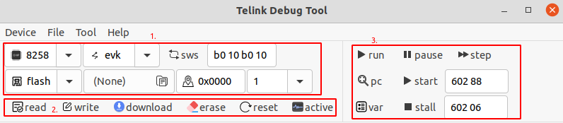

(1) Parameter Configuration - Area 1.

* Configuration Chip model(B92, B91, 8258, 8266).

* Access the device's model(evk, usb).

* Access storage type(flash, ram, analog).

* Access start address.

* Access to the number of bytes.

* Configure the download file path.

(2) After setting parameters in area 1, access the device - Area 2.

* Click the read and write key, read and write operations for storage space.

* Click the Download button to download the bin file to flash or RAM.

* Click the erase button to erase flash area, the starting address.

* Click the Reset button to reset from flash or RAM.

* Click the active button to wake up the development board.

(3) Debug - Area 3.

* run：Run the program.

* pause：Pause program.

* step：Step through the program.

* pc：View the current program running pointer.

* var：View global variable values for the current program.

* start：Start running program.

* stall：Terminate the program.

## Usage

### Select the usb device

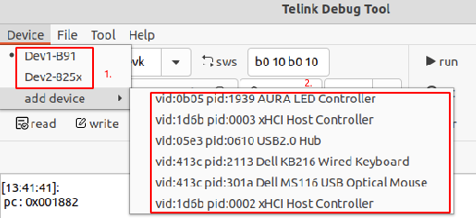

Click the Device menu bar to display the connected EVK devices. The EVK devices identified by this list (VID: 0x248A, PID: 0x8266) are shown in  area 1 shown in the figure above. Note If the VID and PID values of the devices to be added are different, click Add Device.

The add-device list displays all usb devices scanned by the system. Add devices based on your requirements, as shown in area 2 in the figure above. Please note, please add correct need connection device, or the device may malfunction, you need to plug connection, to return to normal use.

### sws

Set the single-line synchronization speed to ensure the normal connection between EVK device and development board. When the development board program is in low power mode, this function cannot be used normally, so it is necessary to wake up the development board first.

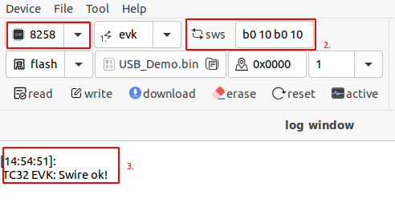

(1) Select the chip model.

(2) Configure SWS register address and clock value (default unchanged).

(3) Successful results of SWS.    

### reset

Reset the development board and select the launcher to run from Flash or SRAM.

(1) Reset, from flash to start, as shown in the figure below.

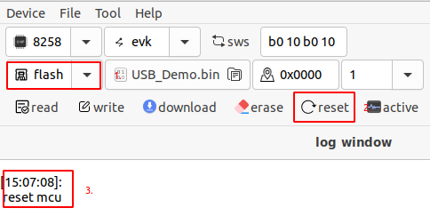

(2) Reset, from sram, as shown in the figure below. 

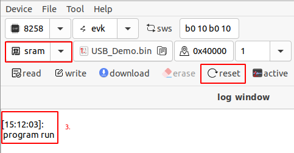

### Activate

Development board to run the program in a low power mode, wake up.

### Read and write (Memory, flash). 

(1) Read flash.     

* Read 16 bytes of data from address 0x0000 as shown in the figure below.

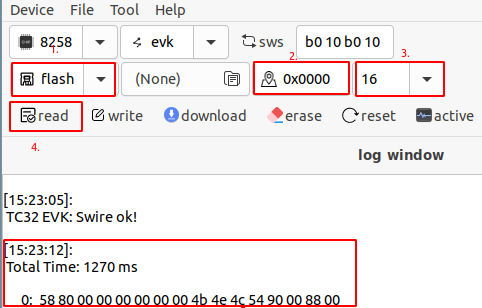

* Read 1K bytes of data from address 0x0000. The read quantity greater than or equal to 1K will not be directly printed and stored in a file, as shown in the figure below.

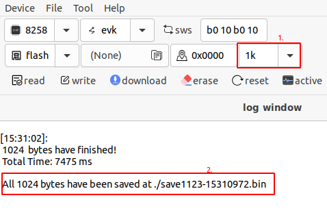

(2) Read SRAM.

* The operation of reading sRAM is similar to the above operation of reading Flash. Read 16 bytes of data from 0x40000 (8258 chip SRAM start address) as shown in the figure below.

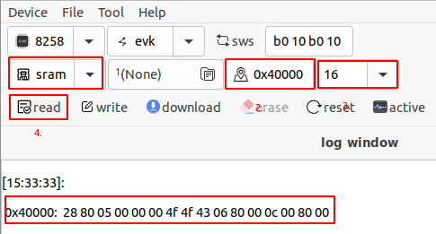

(3) Write flash

* Write four bytes of data at 0x0000, and configure the start address (the following figure - the area 2), the number of bytes written (the following figure - the area 3), and the content written ( (the following figure - the area 4), with Spaces between bytes).

* Success -  (the following figure - the area 6).

* Failure -  (the following figure - the area 7). Erase before writing, refer to 2.7 for details.

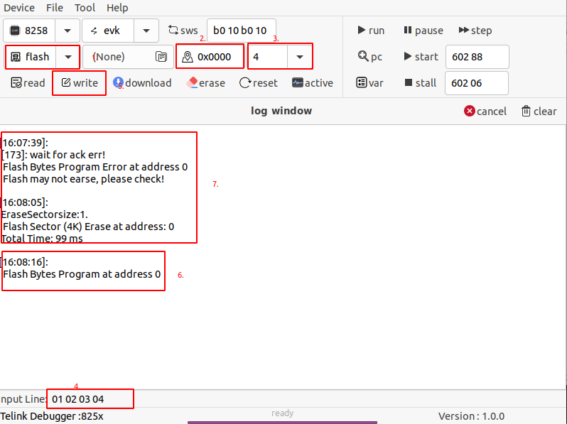

(4) Write sram

* Write 2 bytes of data at 0x40001, as shown in the following figure. Below 4 area after the input data, need not press enter, or as a command execution.

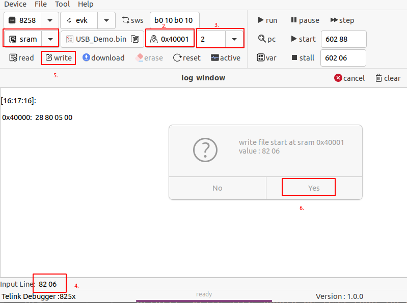

### Download

(1) Download the bin file to the flash, set the bin file path (the following figure - 2 area), and set the start address. If there is no response for a long time during the download, check whether the device is in low-power mode.

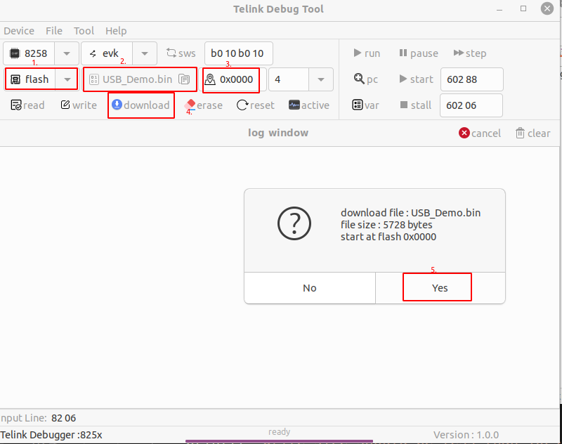

(2) Download the bin file to the sram, set the bin file path (the following figure - 2 area), and set the start address.

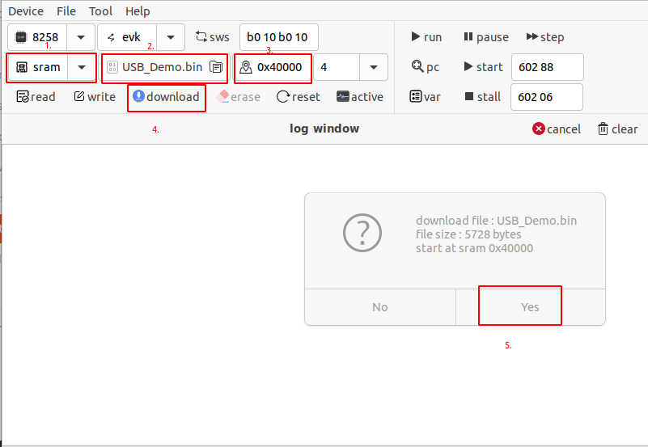

### Erase flash

Erase the starting address 0 x0000, erase the byte 8 KB size (the following figure - 3 area, erasing the custom input), erase the smallest unit of 4 KB.

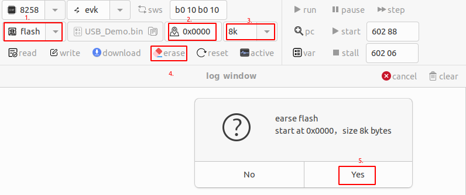

### Debug

(1) pc : View the program running pointer

* To view details about the PC value, open the. LST file for running the program  (the following figure - 1 area) and select Use. LST file (the following figure - 2 area).

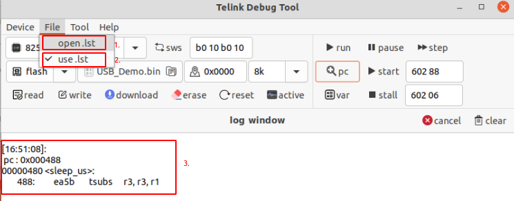

(2) View global variable values for the current program.

* This function requires opening and using. LST files, as shown in the previous section.

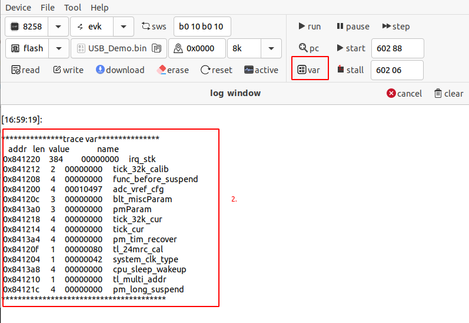

(3) run

* Continue the program after pause is used.

(4) pause

* Pause the program.

(5) step

* One step operation program.

(6) start

* The program is restarted. The operation address 0x602 and value 0x88 are generally unchanged.

(7) stall

* The program terminates. Operation address 0x602 and operation value 0x06 generally remain unchanged.

### Program terminates

Cancel button. If there is no response for a long time, you can directly exit the current command.

### Command line

In command line mode, enter the command and press Enter to execute the command. For details about the command usage format, see the bdt-cmd User guide.。

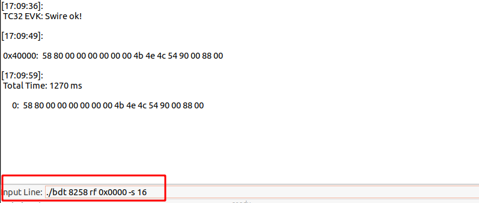

### Device user-defined label

In the case of insert multiple devices to prevent equipment. The user defines the name of the connected device. Click to modify the label text, and press Enter.

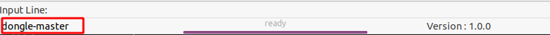

### Download mode

Tool -> mutilple downloads。This function is applicable to the device downloading multiple bin files, and multiple devices downloading files at the same time.

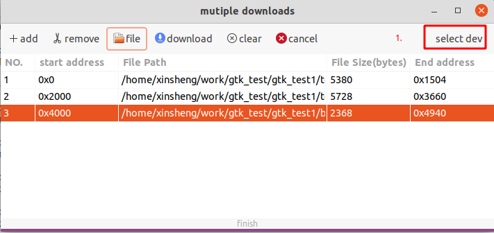

(1) add：Add download items and arrange them in sequence number (NO) . 

(2) remove：Delete the specified download item, click the download item with the mouse, and then click Remove.

(3) file：Specify the download bin file path.

(4) download：Execute download command.

(5) clear：Delete all downloaded items.

(6) cancel：Cancel all downloading processes.

**Use steps**

(1) Click the Start Address bar, enter the start address, and **press Enter to end**。

(2) Click File and select the bin file path. The file size is automatically resolved and the end address is calculated. Address range conflicts will be marked in red.

(3) Configure the device, as shown in the figure above - label 1. Click to enter the  configuration interface, input the chip signal, **enter to end**

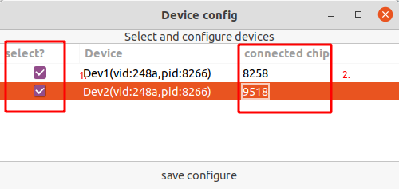

(5) As shown in the figure above, select the download device with label 1. Label 2, configure the chip model connected to the burning evk. Click Save configure. 

(6) Click Download to download and wait for the result, as shown in the following figure. (Please ensure that all devices are properly connected before downloading)

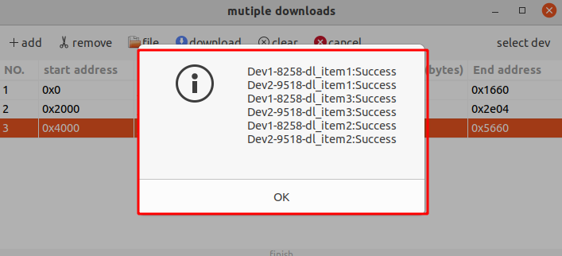

### Burning EVK firmware update

View the current firmware version and update Burning EVK firmware.

Do not remove or insert the device during the update. After the update, reinsert the device.

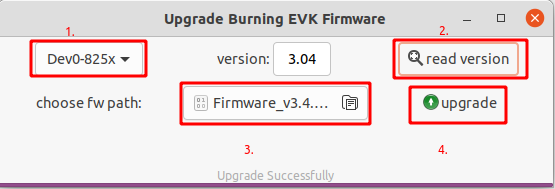

Step

* Above - 1 area, select need to update the firmware of the device.

* Above - 2 area, click can query the current firmware version.

* Above - 3 area, click on the select the firmware file path.

* Above - 4 area, click update to specify the firmware to the device.

## Software configuration

### Configure optional chip model and flash firmware path 

 Click to open config.ini file.

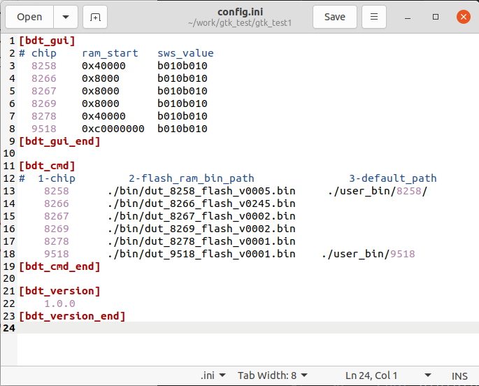

(1) In bdt_cmd area adds the chip model and the corresponding flash firmware path, and each item is separated by a space. (if the chip model in use is not configured). The chip model configured at this position will appear in the chip model optional box of the graphical interface.

(2) bdt_gui area is used to configure the starting address of ram and the set value of SWS register. 

(3) bdt_version area is not modified. 

